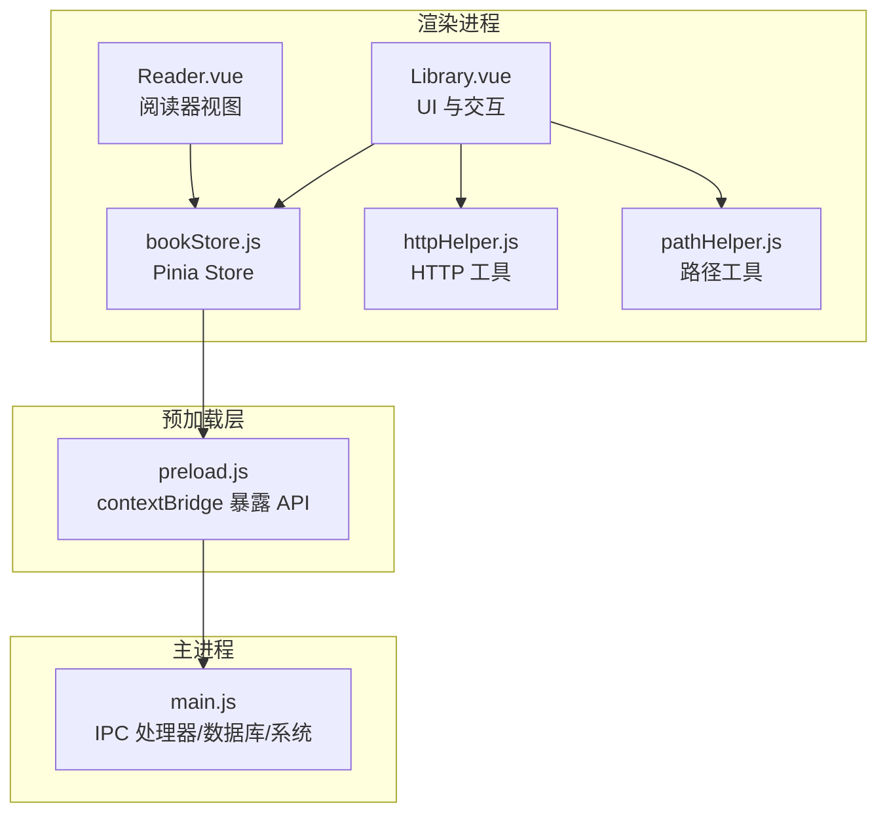
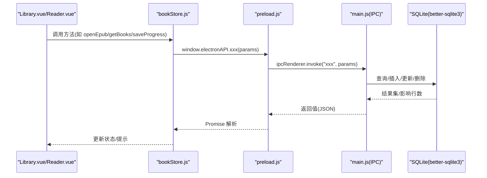
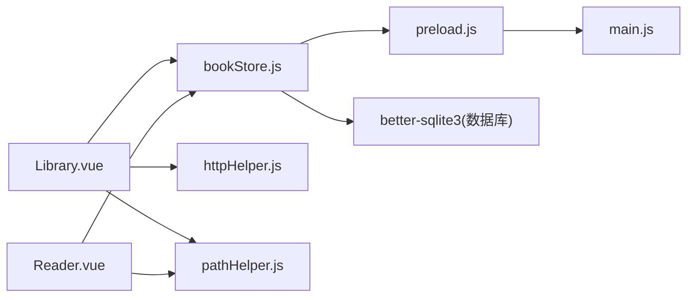

# API参考

<cite>
**本文引用的文件**
- [electron/main.js](file://electron/main.js)
- [electron/preload.js](file://electron/preload.js)
- [src/utils/httpHelper.js](file://src/utils/httpHelper.js)
- [src/utils/pathHelper.js](file://src/utils/pathHelper.js)
- [src/stores/bookStore.js](file://src/stores/bookStore.js)
- [src/components/Library.vue](file://src/components/Library.vue)
- [src/components/Reader.vue](file://src/components/Reader.vue)
- [src/main.js](file://src/main.js)
- [package.json](file://package.json)
</cite>

## 目录
1. [简介](#简介)
2. [项目结构](#项目结构)
3. [核心组件](#核心组件)
4. [架构总览](#架构总览)
5. [详细组件分析](#详细组件分析)
6. [依赖关系分析](#依赖关系分析)
7. [性能考量](#性能考量)
8. [故障排查指南](#故障排查指南)
9. [结论](#结论)
10. [附录](#附录)

## 简介
本文件为 ROSAA 电子书阅读器的完整 API 参考，覆盖以下方面：
- 主进程与渲染进程之间的 IPC 通信接口规范（消息名、参数、返回值、异常处理）
- 数据库 API（基于 SQLite 的 CRUD 操作、事务与约束）
- 工具函数 API（HTTP 请求封装、路径处理工具）
- 调用示例与集成指南
- 版本兼容性与变更历史
- 测试方法与调试技巧

## 项目结构
项目采用 Electron + Vue 3 + Pinia 架构，前端通过 preload 暴露受控 API 至渲染进程，主进程负责数据库与系统交互。

**图表来源**
- [src/components/Library.vue](file://src/components/Library.vue)
- [src/components/Reader.vue](file://src/components/Reader.vue)
- [src/stores/bookStore.js](file://src/stores/bookStore.js)
- [src/utils/httpHelper.js](file://src/utils/httpHelper.js)
- [src/utils/pathHelper.js](file://src/utils/pathHelper.js)
- [electron/preload.js](file://electron/preload.js)
- [electron/main.js](file://electron/main.js)

**章节来源**
- [src/main.js:1-11](file://src/main.js#L1-L11)
- [package.json:1-82](file://package.json#L1-L82)

## 核心组件
- IPC 通信层：通过 preload 暴露统一的 window.electronAPI，渲染进程以 ipcRenderer.invoke 调用主进程处理器。
- 数据库层：主进程使用 better-sqlite3 初始化数据库，创建 books、reading_progress、bookmarks、annotations、categories 等表。
- 工具层：httpHelper 提供带 Bearer Token 的 fetch 封装；pathHelper 提供 file:// URL 构建与校验。
- 状态层：bookStore.js 通过 Pinia 管理书籍、分类、进度、书签等状态，并封装对 IPC 的调用。

**章节来源**
- [electron/preload.js:7-92](file://electron/preload.js#L7-L92)
- [electron/main.js:167-284](file://electron/main.js#L167-L284)
- [src/stores/bookStore.js:1-234](file://src/stores/bookStore.js#L1-L234)
- [src/utils/httpHelper.js:1-47](file://src/utils/httpHelper.js#L1-L47)
- [src/utils/pathHelper.js:1-63](file://src/utils/pathHelper.js#L1-L63)

## 架构总览
渲染进程通过 window.electronAPI 发起异步调用，主进程在 ipcMain.handle 中处理业务逻辑并访问数据库，最终返回结构化结果。

**图表来源**
- [src/stores/bookStore.js:12-228](file://src/stores/bookStore.js#L12-L228)
- [electron/preload.js:7-92](file://electron/preload.js#L7-L92)
- [electron/main.js:343-427](file://electron/main.js#L343-L427)

## 详细组件分析

### IPC 通信接口规范
- 统一入口：window.electronAPI（由 preload 暴露）
- 调用方式：ipcRenderer.invoke("通道名", 参数) -> Promise
- 返回约定：成功返回结构化对象；失败返回包含错误信息的对象或抛出异常

关键 IPC 通道一览（名称、参数、返回值、异常说明）：

- open-epub
  - 参数：无
  - 返回：{ success: boolean, added: Book[], skipped: number, total: number, error?: string }
  - 异常：文件哈希生成、EPUB 元数据解析、数据库插入失败时返回错误字段
  - 作用：打开文件选择对话框，批量导入 EPUB，去重（按路径或 file_hash）

- get-books
  - 参数：categoryId: number|null
  - 返回：Book[]（按 last_read_at、added_at 降序）
  - 异常：查询异常返回空数组

- get-categories
  - 参数：无
  - 返回：Category[]（按创建时间升序）

- add-category
  - 参数：name: string, color?: string
  - 返回：{ id: number, name: string, color: string } 或 null

- delete-category
  - 参数：categoryId: number
  - 返回：boolean

- update-book-category
  - 参数：bookId: number, categoryId: number|null
  - 返回：boolean

- export-book
  - 参数：bookId: number
  - 返回：{ success: boolean, path?: string, error?: string }

- export-notes
  - 参数：bookId: number
  - 返回：{ success: boolean, path?: string, error?: string }

- delete-book-completely
  - 参数：bookId: number
  - 返回：{ success: boolean, error?: string }

- delete-book
  - 参数：bookId: number
  - 返回：boolean

- save-progress
  - 参数：{ bookId: number, cfi: string, page: number, percentage: number }
  - 返回：boolean

- get-progress
  - 参数：bookId: number
  - 返回：ReadingProgress|null

- add-bookmark
  - 参数：{ bookId: number, cfi: string, title?: string, note?: string }
  - 返回：{ id: number } 或 null

- get-bookmarks
  - 参数：bookId: number
  - 返回：Bookmark[]（按创建时间降序）

- delete-bookmark
  - 参数：bookmarkId: number
  - 返回：boolean

- save-annotation
  - 参数：{ bookId: number, cfi: string, selectedText: string, annotation: string, color?: string }
  - 返回：{ success: boolean, id?: number, error?: string }

- get-annotations
  - 参数：bookId: number
  - 返回：Annotation[]（按创建时间升序）

- delete-annotation
  - 参数：annotationId: number
  - 返回：boolean

- get-app-path
  - 参数：无
  - 返回：string

- get-user-data-path
  - 参数：无
  - 返回：string

- open-reader-window
  - 参数：{ id: number, title: string, book_path: string, cover_path?: string }
  - 返回：boolean

调用示例（概念性，非代码片段）：
- 渲染进程调用 window.electronAPI.getBooks(null) 获取全部书籍
- 调用 window.electronAPI.saveProgress({ bookId, cfi, page, percentage }) 保存阅读进度
- 调用 window.electronAPI.exportNotes(bookId) 导出笔记

**章节来源**
- [electron/preload.js:7-92](file://electron/preload.js#L7-L92)
- [electron/main.js:343-820](file://electron/main.js#L343-L820)

### 数据库 API 规范
数据库初始化与表结构：
- 数据库文件：用户数据目录/db/epub_reader.db
- 存储引擎：WAL 模式提升并发写入性能
- 表与字段概览：
  - books：id, title, author, publisher, isbn, pub_date, language, description, cover_path, book_path(唯一), file_hash, added_at, last_read_at, category_id
  - reading_progress：id, book_id(唯一), cfi, page, percentage, updated_at（外键关联 books，级联删除）
  - bookmarks：id, book_id, cfi, title, note, created_at（外键关联 books，级联删除）
  - annotations：id, book_id, cfi, selected_text, annotation, color, created_at, updated_at（外键关联 books，级联删除）
  - categories：id, name(唯一), color, created_at

CRUD 操作要点：
- 去重策略：按 book_path 或 file_hash 判重，避免重复导入
- 级联删除：删除书籍时自动删除其进度、书签、批注
- 进度更新：save-progress 使用 INSERT ... ON CONFLICT ... DO UPDATE 实现幂等更新
- 分类字段：books.category_id 可为空，支持“未分类”

典型 SQL（来自源码）：
- 创建 books 表并添加 file_hash 列（若缺失）
- 创建 reading_progress、bookmarks、annotations、categories 表
- 为 books 添加 category_id 外键列（若缺失）
- 保存进度：INSERT ... ON CONFLICT(book_id) DO UPDATE ...
- 删除书籍：DELETE FROM books WHERE id = ?

错误处理：
- 主进程各处理器均 try/catch 包裹，异常时返回 { success: false, error: string } 或空集合

**章节来源**
- [electron/main.js:167-284](file://electron/main.js#L167-L284)
- [electron/main.js:343-820](file://electron/main.js#L343-L820)

### 工具函数 API

#### HTTP 请求封装
- getAuthToken(): 从 localStorage 读取认证 token
- createAuthHeaders(options): 自动注入 Content-Type 与 Authorization(Bearer token)
- authFetch(url, options): 基于 fetch 的带认证请求

使用建议：
- 在登录成功后将 token 写入 localStorage
- 调用 authFetch 时传入标准 fetch 选项（headers/body/method 等）

**章节来源**
- [src/utils/httpHelper.js:1-47](file://src/utils/httpHelper.js#L1-L47)

#### 路径处理工具
- buildFileUrl(relativePath, userDataPath, appPath): 将相对路径标准化并拼接为 file:// URL
  - 生产环境：基于用户数据目录
  - 开发环境：同样基于用户数据目录（主进程保存文件位置一致）
  - 返回：file:// 绝对路径字符串
- isValidFileUrl(url): 校验是否为有效的 file:// URL

注意：
- 该工具用于将数据库中存储的相对路径转换为可被渲染进程访问的 file:// URL
- 与主进程的 extractEpubMetadata 保存策略保持一致

**章节来源**
- [src/utils/pathHelper.js:1-63](file://src/utils/pathHelper.js#L1-L63)

### 前端集成与调用示例

#### 图书馆界面（Library.vue）
- 通过 bookStore.js 调用 window.electronAPI：
  - 打开 EPUB：openEpub() -> 重新加载书籍列表
  - 获取书籍：getBooks(categoryId)
  - 分类管理：getCategories/addCategory/deleteCategory/updateBookCategory
  - 导出书籍/笔记：exportBook()/exportNotes()
  - 彻底删除：deleteBookCompletely()
- 路径工具：getCoverUrlSync(book) 使用 buildFileUrl 生成封面 URL

**章节来源**
- [src/components/Library.vue:365-589](file://src/components/Library.vue#L365-L589)
- [src/stores/bookStore.js:12-234](file://src/stores/bookStore.js#L12-L234)
- [src/utils/pathHelper.js:13-53](file://src/utils/pathHelper.js#L13-L53)

#### 阅读器界面（Reader.vue）
- 初始化阅读器：initReader() 读取应用路径与用户数据目录，构建 file:// URL 加载 EPUB
- 进度与书签：loadProgress()/saveProgress()、loadBookmarks()/addBookmark()/deleteBookmark()
- 批注：loadAnnotations()/saveAnnotation()/deleteAnnotation()
- 右键菜单：从 iframe 内部获取选中文本与 CFI，触发批注或摘抄

**章节来源**
- [src/components/Reader.vue:201-425](file://src/components/Reader.vue#L201-L425)
- [src/components/Reader.vue:514-527](file://src/components/Reader.vue#L514-L527)
- [src/components/Reader.vue:974-1012](file://src/components/Reader.vue#L974-L1012)

## 依赖关系分析

**图表来源**
- [electron/preload.js:7-92](file://electron/preload.js#L7-L92)
- [electron/main.js:167-284](file://electron/main.js#L167-L284)
- [src/stores/bookStore.js:12-228](file://src/stores/bookStore.js#L12-L228)
- [src/components/Library.vue:250-589](file://src/components/Library.vue#L250-L589)
- [src/components/Reader.vue:162-1012](file://src/components/Reader.vue#L162-L1012)
- [src/utils/httpHelper.js:1-47](file://src/utils/httpHelper.js#L1-L47)
- [src/utils/pathHelper.js:1-63](file://src/utils/pathHelper.js#L1-L63)

**章节来源**
- [package.json:22-41](file://package.json#L22-L41)

## 性能考量
- 数据库：启用 WAL 模式，减少写入阻塞；使用索引字段（如 book_id 外键）提升 JOIN 性能
- IPC：批量操作（如导入多文件）在主进程循环处理，避免频繁往返
- 渲染：阅读器按需生成 locations，后台异步生成避免阻塞首屏
- 资源：封面与书籍文件统一保存在用户数据目录，避免跨盘符问题

[本节为通用指导，无需特定文件引用]

## 故障排查指南
常见问题与定位思路：
- 无法加载封面/书籍文件
  - 检查 buildFileUrl 生成的 file:// URL 是否正确
  - 确认主进程保存路径与渲染进程读取路径一致
- 导入书籍无反应
  - 查看 open-epub 返回值中的 success/skipped/total
  - 检查 file_hash 与 book_path 去重逻辑
- 进度未保存/恢复
  - 确认 save-progress 返回 true
  - 检查 get-progress 是否返回对应记录
- 批注/书签无效
  - 确认 CFI 正确生成（Reader.vue 中从 iframe selection 获取）
  - 检查 annotations/bookmarks 表插入与查询
- 导出失败
  - 检查目标路径是否存在与权限
  - 主进程返回 { success: false, error } 时，前端提示具体错误

调试技巧：
- 开启渲染进程与主进程日志（preload/main 中大量 console.log）
- 使用 DevTools 检查 window.electronAPI 是否可用
- 在 Reader.vue 中观察 iframe 内容与 CFI 获取流程

**章节来源**
- [electron/preload.js:3-95](file://electron/preload.js#L3-L95)
- [electron/main.js:343-820](file://electron/main.js#L343-L820)
- [src/components/Reader.vue:809-939](file://src/components/Reader.vue#L809-L939)

## 结论
本 API 参考明确了 ROSAA 的 IPC 通道、数据库模型与工具函数的使用方式。通过统一的 window.electronAPI，渲染进程可安全地访问主进程能力；数据库设计支持阅读进度、书签、批注与分类管理；工具函数为网络与路径处理提供了便捷封装。建议在集成时遵循参数与返回值规范，并结合日志与 DevTools 进行调试。

[本节为总结性内容，无需特定文件引用]

## 附录

### API 版本兼容性与变更历史
- 1.0.0
  - 初始版本，包含基础 IPC 通道、数据库表与工具函数
  - 新增 categories 表及 books.category_id 外键列（若缺失则自动迁移）
  - reading_progress 表新增 ON CONFLICT 幂等更新逻辑

**章节来源**
- [package.json:2-4](file://package.json#L2-L4)
- [electron/main.js:209-281](file://electron/main.js#L209-L281)

### API 测试方法与建议
- 单元测试（建议）
  - 对 httpHelper 的 authFetch 与 createAuthHeaders 进行 mock fetch 测试
  - 对 pathHelper 的 buildFileUrl 进行路径拼接与 file:// URL 校验
- 集成测试（建议）
  - 使用 preload 暴露的 API 调用 open-epub 导入多个 EPUB，验证去重与元数据提取
  - 验证 save-progress/get-progress 的一致性
  - 验证 annotations/bookmarks 的增删改查链路
- 端到端测试（建议）
  - 在 Reader.vue 中模拟右键菜单，验证 CFI 获取与批注高亮
  - 验证 export-book/export-notes 的文件生成与路径返回

[本节为通用指导，无需特定文件引用]