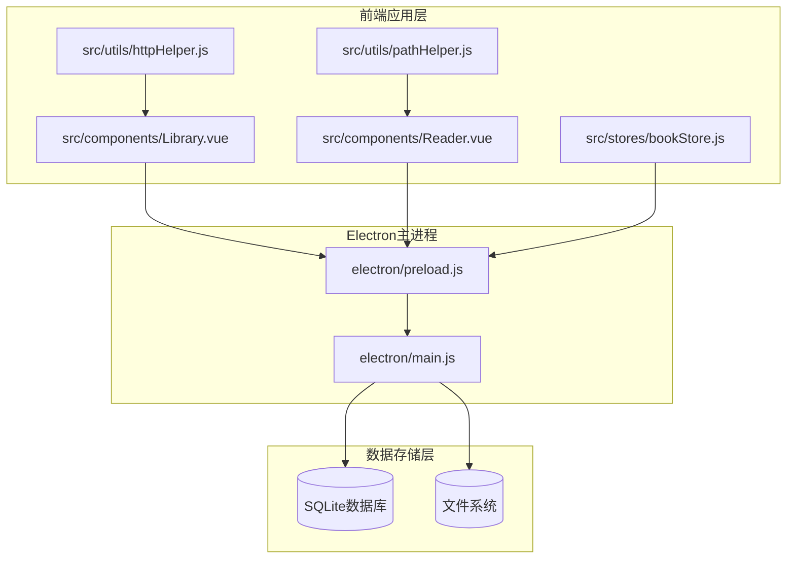
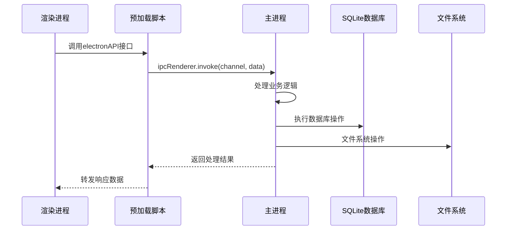
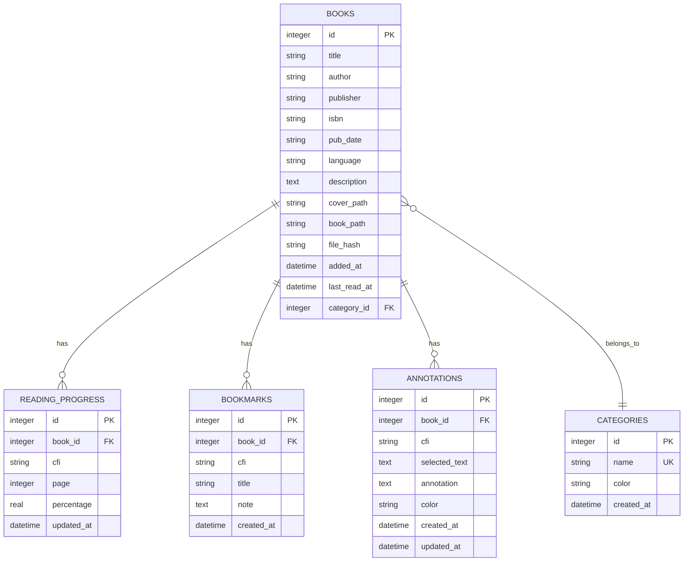
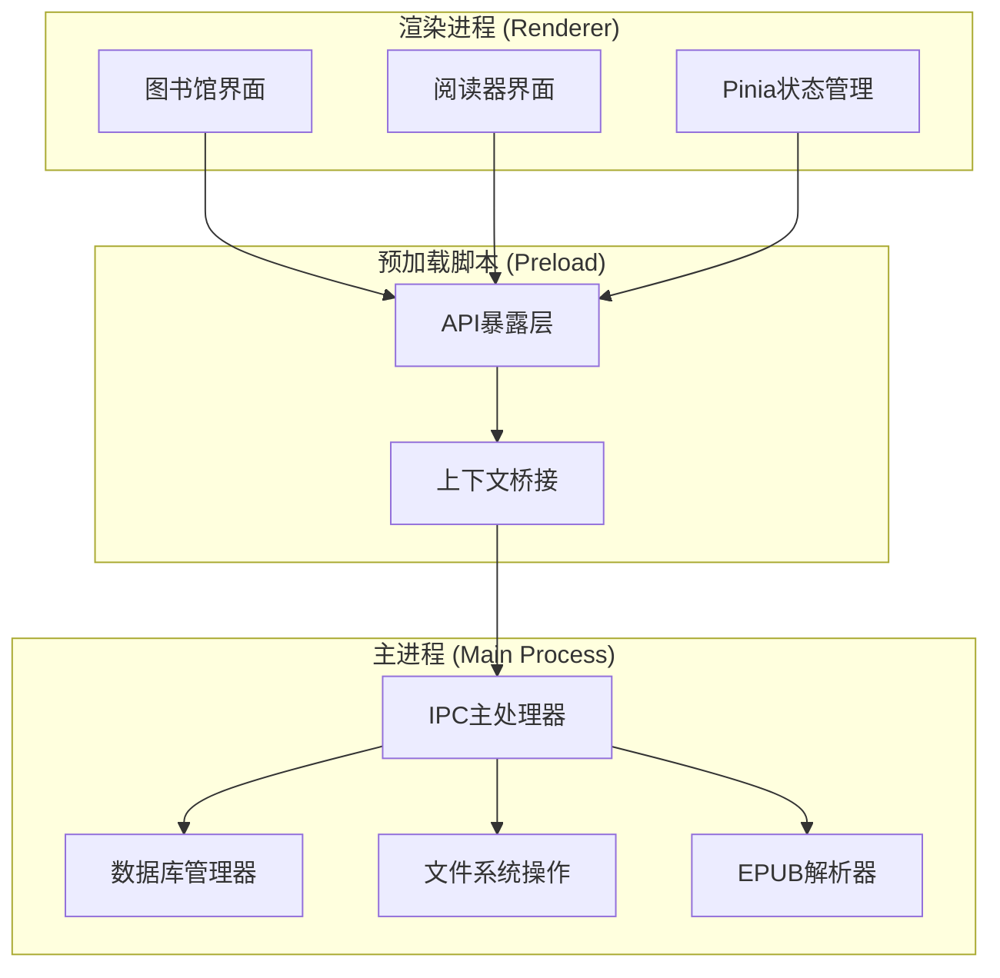
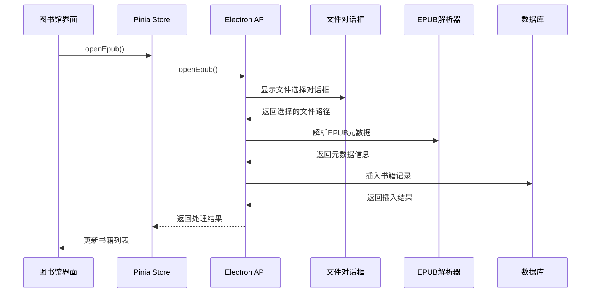
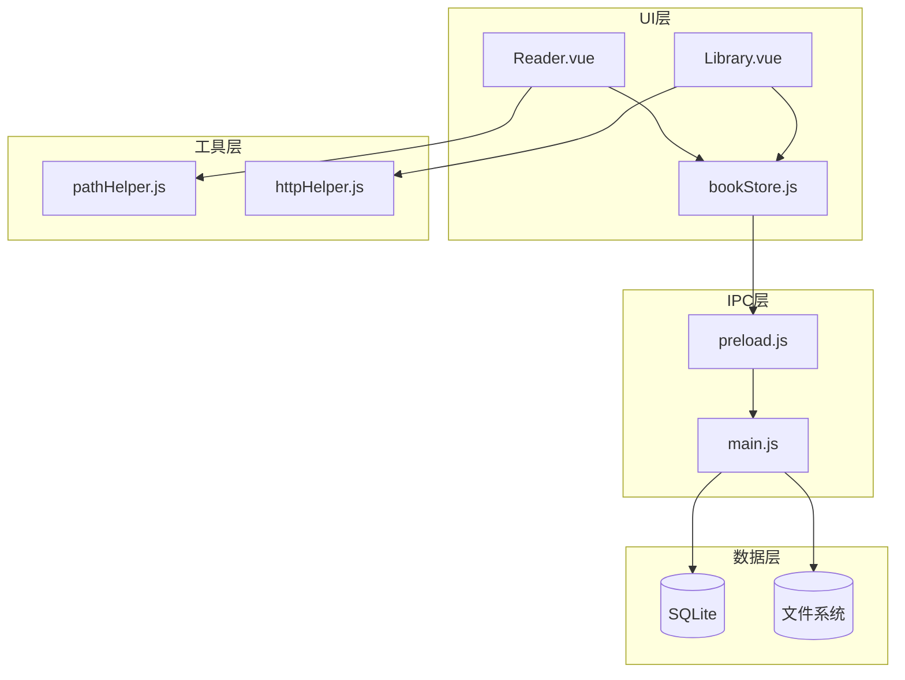
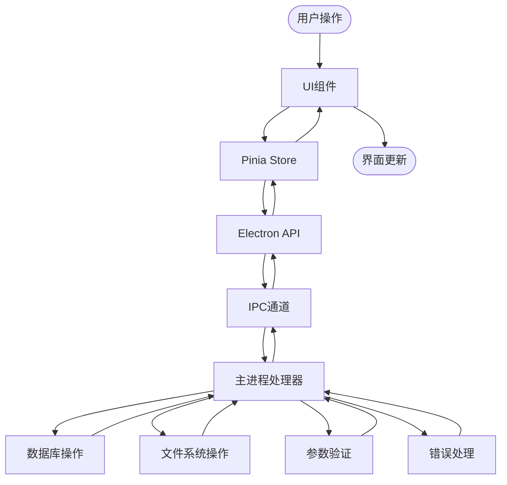

# IPC通信接口

<cite>
**本文档引用的文件**
- [electron/main.js](file://electron/main.js)
- [electron/preload.js](file://electron/preload.js)
- [src/stores/bookStore.js](file://src/stores/bookStore.js)
- [src/components/Library.vue](file://src/components/Library.vue)
- [src/components/Reader.vue](file://src/components/Reader.vue)
- [src/utils/pathHelper.js](file://src/utils/pathHelper.js)
- [src/utils/httpHelper.js](file://src/utils/httpHelper.js)
- [package.json](file://package.json)
</cite>

## 目录
1. [简介](#简介)
2. [项目结构](#项目结构)
3. [核心组件](#核心组件)
4. [架构概览](#架构概览)
5. [详细组件分析](#详细组件分析)
6. [依赖关系分析](#依赖关系分析)
7. [性能考虑](#性能考虑)
8. [故障排除指南](#故障排除指南)
9. [结论](#结论)

## 简介

ROSAA电子书阅读器是一个基于Electron和Vue.js的桌面应用程序，专门设计用于管理和阅读EPUB电子书。该应用通过精心设计的IPC（进程间通信）机制实现了主进程与渲染进程之间的高效数据交换。

本项目的核心特色包括：
- **多进程架构**：主进程负责文件系统操作和数据库管理，渲染进程专注于用户界面交互
- **完整的EPUB支持**：支持EPUB文件的导入、解析和渲染
- **丰富的阅读功能**：包括书签管理、批注系统、进度跟踪等
- **分类管理**：支持书籍分类和标签管理
- **跨平台兼容**：支持Windows、macOS和Linux操作系统

## 项目结构

该项目采用模块化的文件组织结构，主要分为以下几个核心部分：

**图表来源**
- [electron/main.js:1-820](file://electron/main.js#L1-L820)
- [electron/preload.js:1-95](file://electron/preload.js#L1-L95)
- [src/components/Library.vue:1-1291](file://src/components/Library.vue#L1-L1291)
- [src/components/Reader.vue:1-1026](file://src/components/Reader.vue#L1-L1026)

**章节来源**
- [package.json:1-82](file://package.json#L1-L82)

## 核心组件

### IPC通信架构

应用的IPC通信基于Electron的`ipcMain`和`ipcRenderer`机制，通过预加载脚本提供安全的API接口：

**图表来源**
- [electron/preload.js:7-92](file://electron/preload.js#L7-L92)
- [electron/main.js:343-427](file://electron/main.js#L343-L427)

### 数据库设计

应用使用SQLite数据库存储所有用户数据，采用better-sqlite3作为数据库驱动：

**图表来源**
- [electron/main.js:189-284](file://electron/main.js#L189-L284)

**章节来源**
- [electron/main.js:167-284](file://electron/main.js#L167-L284)

## 架构概览

### 整体架构设计

应用采用典型的Electron双进程架构，通过预加载脚本实现安全的API暴露：

**图表来源**
- [electron/main.js:286-341](file://electron/main.js#L286-L341)
- [electron/preload.js:7-92](file://electron/preload.js#L7-L92)

### 安全机制

应用实施了多层次的安全保护措施：

1. **上下文隔离**：启用`contextIsolation: true`防止渲染进程直接访问Node.js API
2. **预加载脚本**：通过`preload.js`精确控制可访问的API
3. **权限控制**：仅暴露必要的IPC通道
4. **数据验证**：对所有输入参数进行严格验证

**章节来源**
- [electron/main.js:296-302](file://electron/main.js#L296-L302)
- [electron/preload.js:1-95](file://electron/preload.js#L1-L95)

## 详细组件分析

### 文件操作接口

#### openEpub - EPUB文件导入

**功能描述**：打开文件选择对话框，导入EPUB文件并提取元数据

**调用流程**：

**图表来源**
- [src/stores/bookStore.js:71-104](file://src/stores/bookStore.js#L71-L104)
- [electron/main.js:343-427](file://electron/main.js#L343-L427)

**接口定义**：
- **通道名称**：`open-epub`
- **调用方式**：`invoke`
- **参数**：无
- **返回值**：`{ success: boolean, added: Book[], skipped: number, total: number }`
- **错误处理**：捕获解析异常，跳过无效文件

**章节来源**
- [electron/main.js:343-427](file://electron/main.js#L343-L427)
- [src/stores/bookStore.js:71-104](file://src/stores/bookStore.js#L71-L104)

#### exportBook - 书籍导出

**功能描述**：将选定的EPUB书籍导出到用户指定位置

**接口定义**：
- **通道名称**：`export-book`
- **调用方式**：`invoke`
- **参数**：`{ bookId: number }`
- **返回值**：`{ success: boolean, path?: string, error?: string }`
- **错误处理**：文件不存在、用户取消导出

**章节来源**
- [electron/main.js:495-531](file://electron/main.js#L495-L531)
- [src/stores/bookStore.js:137-145](file://src/stores/bookStore.js#L137-L145)

#### exportNotes - 笔记导出

**功能描述**：导出书籍的批注和书签到文本文件

**接口定义**：
- **通道名称**：`export-notes`
- **调用方式**：`invoke`
- **参数**：`{ bookId: number }`
- **返回值**：`{ success: boolean, path?: string, error?: string }`
- **错误处理**：数据库查询失败、文件写入错误

**章节来源**
- [electron/main.js:533-592](file://electron/main.js#L533-L592)
- [src/stores/bookStore.js:147-155](file://src/stores/bookStore.js#L147-L155)

### 书籍管理接口

#### getBooks - 获取书籍列表

**功能描述**：根据分类ID获取书籍列表，支持按最后阅读时间和添加时间排序

**接口定义**：
- **通道名称**：`get-books`
- **调用方式**：`invoke`
- **参数**：`{ categoryId?: number }`
- **返回值**：`Book[]`
- **错误处理**：数据库连接异常

**章节来源**
- [electron/main.js:429-449](file://electron/main.js#L429-L449)
- [src/stores/bookStore.js:12-22](file://src/stores/bookStore.js#L12-L22)

#### deleteBook - 删除书籍

**功能描述**：从数据库中删除书籍记录（软删除）

**接口定义**：
- **通道名称**：`delete-book`
- **调用方式**：`invoke`
- **参数**：`{ bookId: number }`
- **返回值**：`boolean`
- **错误处理**：书籍不存在、数据库操作失败

**章节来源**
- [electron/main.js:696-708](file://electron/main.js#L696-L708)
- [src/stores/bookStore.js:106-113](file://src/stores/bookStore.js#L106-L113)

#### deleteBookCompletely - 彻底删除书籍

**功能描述**：删除书籍文件和所有相关数据（包括文件系统中的EPUB文件）

**接口定义**：
- **通道名称**：`delete-book-completely`
- **调用方式**：`invoke`
- **参数**：`{ bookId: number }`
- **返回值**：`{ success: boolean, error?: string }`
- **错误处理**：文件删除失败、数据库级联删除异常

**章节来源**
- [electron/main.js:594-632](file://electron/main.js#L594-L632)
- [src/stores/bookStore.js:115-126](file://src/stores/bookStore.js#L115-L126)

### 进度管理接口

#### saveProgress - 保存阅读进度

**功能描述**：保存用户的阅读进度，包括CFI位置、页码和百分比

**接口定义**：
- **通道名称**：`save-progress`
- **调用方式**：`invoke`
- **参数**：`{ bookId: number, cfi: string, page: number, percentage: number }`
- **返回值**：`boolean`
- **错误处理**：数据库插入/更新失败

**章节来源**
- [electron/main.js:634-653](file://electron/main.js#L634-L653)
- [src/components/Reader.vue:497-507](file://src/components/Reader.vue#L497-L507)

#### getProgress - 获取阅读进度

**功能描述**：获取指定书籍的最新阅读进度

**接口定义**：
- **通道名称**：`get-progress`
- **调用方式**：`invoke`
- **参数**：`{ bookId: number }`
- **返回值**：`ReadingProgress | null`
- **错误处理**：数据库查询异常

**章节来源**
- [electron/main.js:655-663](file://electron/main.js#L655-L663)
- [src/stores/bookStore.js:161-176](file://src/stores/bookStore.js#L161-L176)

### 书签管理接口

#### addBookmark - 添加书签

**功能描述**：在指定位置添加书签

**接口定义**：
- **通道名称**：`add-bookmark`
- **调用方式**：`invoke`
- **参数**：`{ bookId: number, cfi: string, title: string, note: string }`
- **返回值**：`{ id: number } | null`
- **错误处理**：数据库插入失败

**章节来源**
- [electron/main.js:665-674](file://electron/main.js#L665-L674)
- [src/components/Reader.vue:628-641](file://src/components/Reader.vue#L628-L641)

#### getBookmarks - 获取书签列表

**功能描述**：获取书籍的所有书签，按创建时间降序排列

**接口定义**：
- **通道名称**：`get-bookmarks`
- **调用方式**：`invoke`
- **参数**：`{ bookId: number }`
- **返回值**：`Bookmark[]`
- **错误处理**：数据库查询异常

**章节来源**
- [electron/main.js:676-684](file://electron/main.js#L676-L684)
- [src/stores/bookStore.js:178-184](file://src/stores/bookStore.js#L178-L184)

#### deleteBookmark - 删除书签

**功能描述**：删除指定的书签

**接口定义**：
- **通道名称**：`delete-bookmark`
- **调用方式**：`invoke`
- **参数**：`{ bookmarkId: number }`
- **返回值**：`boolean`
- **错误处理**：数据库删除失败

**章节来源**
- [electron/main.js:686-694](file://electron/main.js#L686-L694)
- [src/components/Reader.vue:643-648](file://src/components/Reader.vue#L643-L648)

### 分类管理接口

#### getCategories - 获取分类列表

**功能描述**：获取所有分类信息，按创建时间升序排列

**接口定义**：
- **通道名称**：`get-categories`
- **调用方式**：`invoke`
- **参数**：无
- **返回值**：`Category[]`
- **错误处理**：数据库查询异常

**章节来源**
- [electron/main.js:451-460](file://electron/main.js#L451-L460)
- [src/stores/bookStore.js:24-33](file://src/stores/bookStore.js#L24-L33)

#### addCategory - 添加分类

**功能描述**：创建新的书籍分类

**接口定义**：
- **通道名称**：`add-category`
- **调用方式**：`invoke`
- **参数**：`{ name: string, color?: string }`
- **返回值**：`{ id: number, name: string, color: string } | null`
- **错误处理**：重复名称、数据库插入失败

**章节来源**
- [electron/main.js:462-471](file://electron/main.js#L462-L471)
- [src/stores/bookStore.js:35-47](file://src/stores/bookStore.js#L35-L47)

#### deleteCategory - 删除分类

**功能描述**：删除指定分类（不会删除书籍，但会清除书籍的分类关联）

**接口定义**：
- **通道名称**：`delete-category`
- **调用方式**：`invoke`
- **参数**：`{ categoryId: number }`
- **返回值**：`boolean`
- **错误处理**：数据库删除失败

**章节来源**
- [electron/main.js:473-482](file://electron/main.js#L473-L482)
- [src/stores/bookStore.js:49-61](file://src/stores/bookStore.js#L49-L61)

#### updateBookCategory - 更新书籍分类

**功能描述**：将书籍分配到指定分类

**接口定义**：
- **通道名称**：`update-book-category`
- **调用方式**：`invoke`
- **参数**：`{ bookId: number, categoryId: number }`
- **返回值**：`boolean`
- **错误处理**：数据库更新失败

**章节来源**
- [electron/main.js:484-493](file://electron/main.js#L484-L493)
- [src/stores/bookStore.js:128-135](file://src/stores/bookStore.js#L128-L135)

### 注释管理接口

#### saveAnnotation - 保存批注

**功能描述**：在指定位置保存文本批注

**接口定义**：
- **通道名称**：`save-annotation`
- **调用方式**：`invoke`
- **参数**：`{ bookId: number, cfi: string, selectedText: string, annotation: string, color?: string }`
- **返回值**：`{ success: boolean, id?: number, error?: string }`
- **错误处理**：数据库插入失败

**章节来源**
- [electron/main.js:710-731](file://electron/main.js#L710-L731)
- [src/components/Reader.vue:974-1012](file://src/components/Reader.vue#L974-L1012)

#### getAnnotations - 获取批注列表

**功能描述**：获取书籍的所有批注，按创建时间升序排列

**接口定义**：
- **通道名称**：`get-annotations`
- **调用方式**：`invoke`
- **参数**：`{ bookId: number }`
- **返回值**：`Annotation[]`
- **错误处理**：数据库查询异常

**章节来源**
- [electron/main.js:733-748](file://electron/main.js#L733-L748)
- [src/components/Reader.vue:514-527](file://src/components/Reader.vue#L514-L527)

#### deleteAnnotation - 删除批注

**功能描述**：删除指定的批注

**接口定义**：
- **通道名称**：`delete-annotation`
- **调用方式**：`invoke`
- **参数**：`{ annotationId: number }`
- **返回值**：`boolean`
- **错误处理**：数据库删除失败

**章节来源**
- [electron/main.js:750-760](file://electron/main.js#L750-L760)
- [src/components/Reader.vue:528-562](file://src/components/Reader.vue#L528-L562)

### 系统信息接口

#### getAppPath - 获取应用路径

**功能描述**：获取Electron应用的安装路径

**接口定义**：
- **通道名称**：`get-app-path`
- **调用方式**：`invoke`
- **参数**：无
- **返回值**：`string`
- **错误处理**：无

**章节来源**
- [electron/main.js:762-764](file://electron/main.js#L762-L764)
- [src/components/Library.vue:574](file://src/components/Library.vue#L574)

#### getUserDataPath - 获取用户数据路径

**功能描述**：获取用户数据目录路径

**接口定义**：
- **通道名称**：`get-user-data-path`
- **调用方式**：`invoke`
- **参数**：无
- **返回值**：`string`
- **错误处理**：无

**章节来源**
- [electron/main.js:766-769](file://electron/main.js#L766-L769)
- [src/components/Library.vue:575](file://src/components/Library.vue#L575)

#### openReaderWindow - 打开阅读器窗口

**功能描述**：为指定书籍打开独立的阅读器窗口

**接口定义**：
- **通道名称**：`open-reader-window`
- **调用方式**：`invoke`
- **参数**：`{ id: number, title: string, author: string, book_path: string, cover_path: string }`
- **返回值**：`boolean`
- **错误处理**：窗口创建失败、书籍不存在

**章节来源**
- [electron/main.js:771-819](file://electron/main.js#L771-L819)
- [src/components/Library.vue:371-387](file://src/components/Library.vue#L371-L387)

## 依赖关系分析

### 组件依赖图

**图表来源**
- [src/stores/bookStore.js:1-234](file://src/stores/bookStore.js#L1-L234)
- [electron/preload.js:7-92](file://electron/preload.js#L7-L92)
- [electron/main.js:167-284](file://electron/main.js#L167-L284)

### 数据流分析

应用的数据流遵循严格的单向数据流模式：

**图表来源**
- [src/stores/bookStore.js:12-234](file://src/stores/bookStore.js#L12-L234)
- [electron/main.js:343-819](file://electron/main.js#L343-L819)

**章节来源**
- [src/stores/bookStore.js:1-234](file://src/stores/bookStore.js#L1-L234)
- [electron/main.js:167-819](file://electron/main.js#L167-L819)

## 性能考虑

### 数据库优化

应用采用了多项数据库性能优化策略：

1. **WAL模式**：启用Write-Ahead Logging模式提高并发性能
2. **索引优化**：为常用查询字段建立索引
3. **批量操作**：支持批量文件导入和处理
4. **连接池**：使用better-sqlite3的连接池机制

### 文件系统优化

1. **异步处理**：所有文件操作都采用异步模式
2. **流式处理**：大文件处理使用流式读取避免内存溢出
3. **缓存机制**：封面和书籍文件缓存到用户数据目录
4. **增量更新**：支持文件哈希校验避免重复导入

### 渲染性能优化

1. **懒加载**：书籍封面和内容按需加载
2. **虚拟滚动**：大量书籍时使用虚拟滚动技术
3. **防抖节流**：搜索和过滤操作使用防抖机制
4. **内存管理**：及时清理DOM元素和事件监听器

## 故障排除指南

### 常见问题及解决方案

#### EPUB文件导入失败

**症状**：选择EPUB文件后无响应或报错

**可能原因**：
1. 文件损坏或格式不正确
2. 权限不足无法读取文件
3. 磁盘空间不足

**解决步骤**：
1. 验证EPUB文件完整性
2. 检查文件权限
3. 确认磁盘空间充足
4. 重启应用重试

#### 书籍无法打开

**症状**：点击书籍后阅读器窗口不显示

**可能原因**：
1. 书籍文件被移动或删除
2. 路径解析错误
3. 渲染器初始化失败

**解决步骤**：
1. 检查书籍文件是否存在
2. 重新导入书籍文件
3. 清理应用缓存
4. 更新到最新版本

#### 进度同步问题

**症状**：阅读进度不同步或丢失

**可能原因**：
1. 数据库连接异常
2. 突然断电或强制关闭
3. 多设备同步冲突

**解决步骤**：
1. 检查数据库状态
2. 重新启动应用
3. 手动保存当前进度
4. 检查应用日志

### 调试技巧

1. **启用开发者工具**：在开发环境中自动打开调试面板
2. **查看控制台日志**：关注IPC通信和数据库操作日志
3. **检查网络连接**：验证HTTP请求和认证状态
4. **监控内存使用**：定期检查应用内存占用情况

**章节来源**
- [src/components/Reader.vue:418-425](file://src/components/Reader.vue#L418-L425)
- [src/components/Library.vue:562-589](file://src/components/Library.vue#L562-L589)

## 结论

ROSAA电子书阅读器通过精心设计的IPC通信架构，成功实现了主进程与渲染进程之间的高效协作。该架构具有以下优势：

1. **安全性**：通过上下文隔离和预加载脚本实现了安全的API暴露
2. **可维护性**：清晰的模块划分和接口定义便于代码维护
3. **扩展性**：良好的架构设计支持未来功能扩展
4. **性能**：多项优化策略确保了流畅的用户体验

该IPC通信接口文档为开发者提供了完整的技术参考，涵盖了所有暴露给前端的API接口定义、参数规范、错误处理机制和最佳实践。通过遵循这些规范，开发者可以安全地扩展应用功能并保持系统的稳定性。