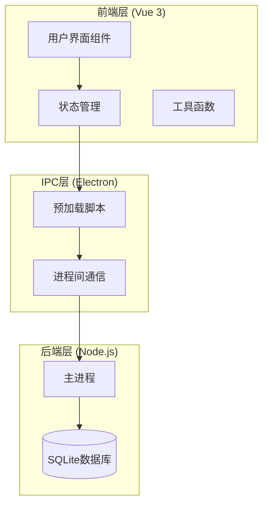
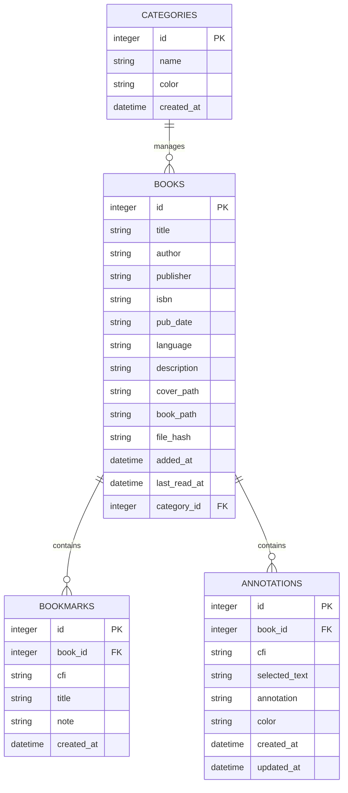
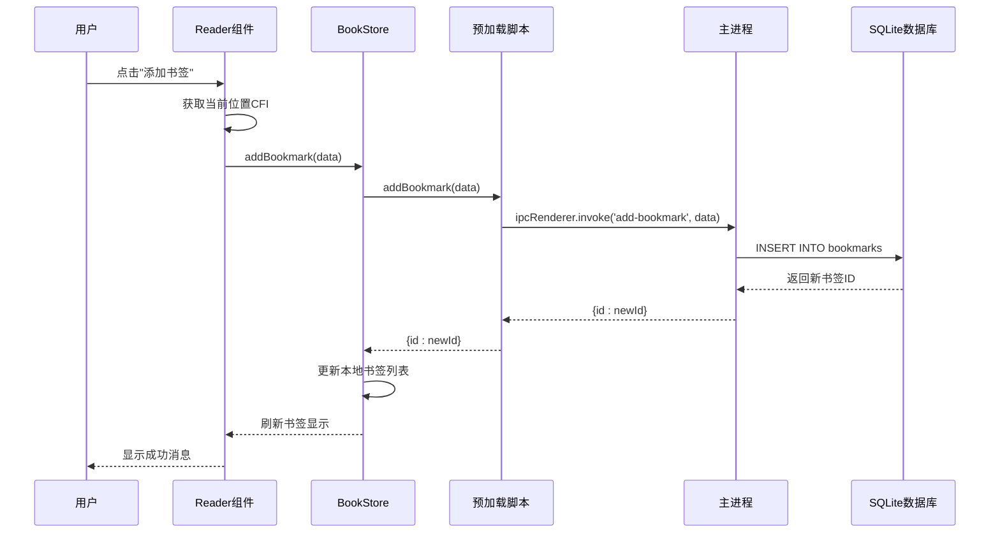
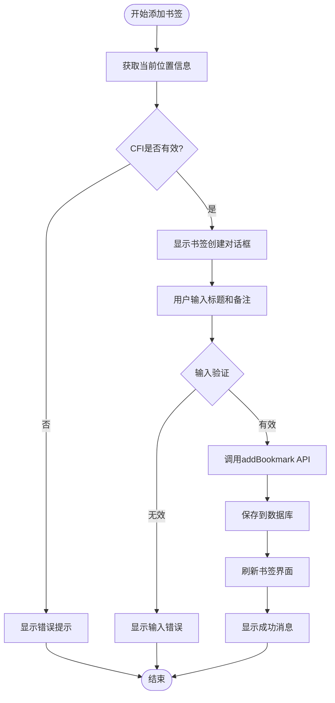
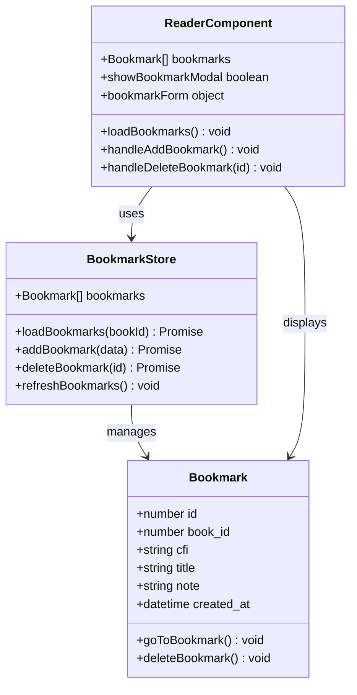
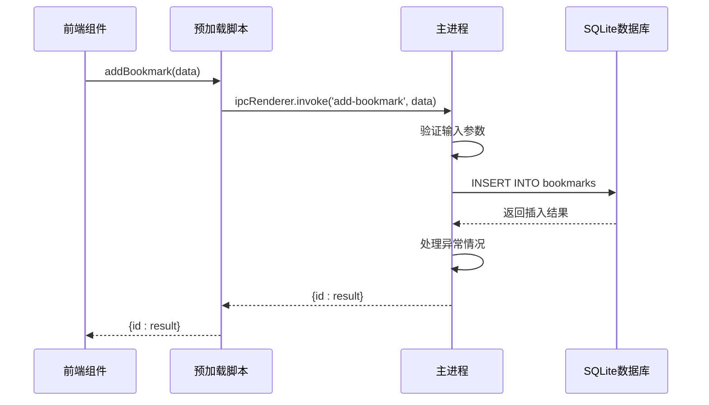
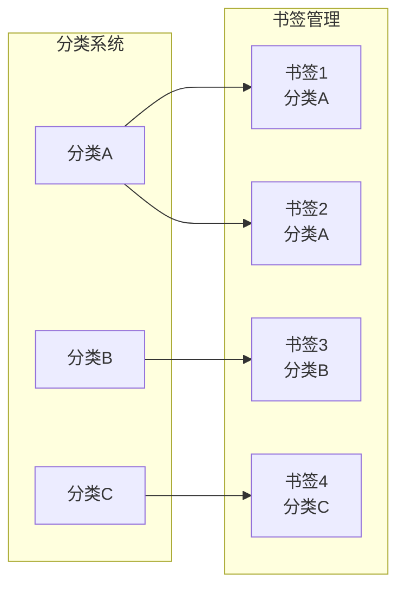
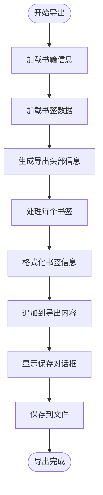
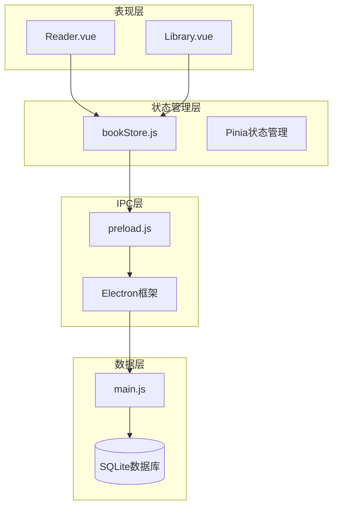

# 书签管理接口

<cite>
**本文档引用的文件**
- [README.md](file://README.md)
- [electron/main.js](file://electron/main.js)
- [electron/preload.js](file://electron/preload.js)
- [src/stores/bookStore.js](file://src/stores/bookStore.js)
- [src/components/Reader.vue](file://src/components/Reader.vue)
- [src/main.js](file://src/main.js)
</cite>

## 目录
1. [简介](#简介)
2. [项目结构](#项目结构)
3. [核心组件](#核心组件)
4. [架构概览](#架构概览)
5. [详细组件分析](#详细组件分析)
6. [依赖关系分析](#依赖关系分析)
7. [性能考虑](#性能考虑)
8. [故障排除指南](#故障排除指南)
9. [结论](#结论)

## 简介

ROSAA电子书阅读器是一个基于Electron + Vue 3 + SQLite的现代化EPUB电子书阅读器桌面应用。该应用提供了完整的书签管理系统，支持用户在阅读过程中添加、管理和跳转到书签位置。书签系统基于EPUB标准的CFI（Canonical Fragment Identifier）位置标记技术，确保书签在不同设备和应用间具有良好的兼容性和稳定性。

书签管理接口提供了完整的IPC（进程间通信）能力，包括添加书签、获取书签列表、删除书签等核心功能。系统还支持书签的分类管理、批量操作和导入导出机制，为用户提供便捷的阅读体验。

## 项目结构

ROSAA电子书阅读器采用前后端分离的架构设计，主要分为三个层次：

**图表来源**
- [src/main.js:1-11](file://src/main.js#L1-L11)
- [electron/preload.js:1-104](file://electron/preload.js#L1-L104)
- [electron/main.js:1-922](file://electron/main.js#L1-L922)

**章节来源**
- [README.md:167-193](file://README.md#L167-L193)
- [src/main.js:1-11](file://src/main.js#L1-L11)

## 核心组件

### 数据模型

书签系统的核心数据结构基于SQLite数据库表设计：

**图表来源**
- [electron/main.js:234-261](file://electron/main.js#L234-L261)

### IPC接口定义

书签管理接口通过Electron的IPC机制实现，提供以下核心接口：

| 接口名称 | 参数类型 | 返回值类型 | 描述 |
|---------|----------|------------|------|
| addBookmark | `{bookId: number, cfi: string, title: string, note: string}` | `{id: number}` | 添加新书签 |
| getBookmarks | `number` | `Array<Bookmark>` | 获取指定书籍的所有书签 |
| deleteBookmark | `number` | `boolean` | 删除指定书签 |

**章节来源**
- [electron/preload.js:24-35](file://electron/preload.js#L24-L35)
- [electron/main.js:665-694](file://electron/main.js#L665-L694)

## 架构概览

书签管理系统的整体架构采用分层设计，确保各层职责清晰、耦合度低：

**图表来源**
- [src/components/Reader.vue:628-641](file://src/components/Reader.vue#L628-L641)
- [src/stores/bookStore.js:186-195](file://src/stores/bookStore.js#L186-L195)
- [electron/preload.js:24-27](file://electron/preload.js#L24-L27)
- [electron/main.js:665-674](file://electron/main.js#L665-L674)

## 详细组件分析

### 书签数据结构

书签系统的核心数据结构设计充分考虑了EPUB标准和用户体验：

#### 书签实体属性

| 属性名 | 类型 | 必填 | 描述 | 示例 |
|--------|------|------|------|------|
| id | integer | 是 | 书签唯一标识符 | 123 |
| book_id | integer | 是 | 关联的书籍ID | 456 |
| cfi | string | 是 | EPUB CFI位置标记 | `epubcfi(/6/4!/4/12,/1:0,/1:120)` |
| title | string | 否 | 书签标题 | "第5章：引言" |
| note | string | 否 | 书签备注信息 | "重要的概念说明" |
| created_at | datetime | 是 | 创建时间戳 | "2026-05-26 14:30:00" |

#### CFI位置标记系统

CFI（Canonical Fragment Identifier）是EPUB标准定义的统一位置标记机制，具有以下特点：

- **标准化**：遵循EPUB 3.0标准，确保跨平台兼容性
- **精确性**：能够精确定位到具体的文本节点
- **稳定性**：即使文档结构发生变化也能保持相对稳定
- **可移植性**：可以在不同设备和应用间共享

**章节来源**
- [electron/main.js:234-244](file://electron/main.js#L234-L244)
- [src/components/Reader.vue:601-603](file://src/components/Reader.vue#L601-L603)

### 书签操作流程

#### 添加书签流程

**图表来源**
- [src/components/Reader.vue:628-641](file://src/components/Reader.vue#L628-L641)
- [src/stores/bookStore.js:186-195](file://src/stores/bookStore.js#L186-L195)

#### 书签列表管理

书签列表采用倒序排列，最新的书签显示在最前面：

**图表来源**
- [src/stores/bookStore.js:10-234](file://src/stores/bookStore.js#L10-L234)
- [src/components/Reader.vue:20-62](file://src/components/Reader.vue#L20-L62)

**章节来源**
- [src/stores/bookStore.js:178-206](file://src/stores/bookStore.js#L178-L206)
- [src/components/Reader.vue:29-42](file://src/components/Reader.vue#L29-L42)

### IPC接口实现

#### 主进程接口处理

主进程负责处理所有数据库操作和业务逻辑：

**图表来源**
- [electron/preload.js:24-27](file://electron/preload.js#L24-L27)
- [electron/main.js:665-674](file://electron/main.js#L665-L674)

#### 前端接口封装

前端通过预加载脚本暴露统一的API接口：

| 接口方法 | 功能描述 | 参数说明 | 返回值 |
|----------|----------|----------|--------|
| addBookmark | 添加书签 | `{bookId, cfi, title, note}` | `{id}` |
| getBookmarks | 获取书签列表 | `bookId` | `Array<Bookmark>` |
| deleteBookmark | 删除书签 | `bookmarkId` | `boolean` |

**章节来源**
- [electron/preload.js:24-35](file://electron/preload.js#L24-L35)
- [src/stores/bookStore.js:186-206](file://src/stores/bookStore.js#L186-L206)

### 分类管理机制

书签系统支持与书籍分类的关联管理：

**图表来源**
- [electron/main.js:263-282](file://electron/main.js#L263-L282)

### 批量操作支持

系统支持多种批量操作场景：

- **批量导入**：通过EPUB文件解析自动提取书签信息
- **批量导出**：支持将书签导出为文本文件
- **批量删除**：支持按条件删除多个书签

**章节来源**
- [electron/main.js:533-592](file://electron/main.js#L533-L592)

### 导入导出机制

#### 导出功能实现

书签导出功能支持将书签信息转换为人类可读的文本格式：

**图表来源**
- [electron/main.js:533-592](file://electron/main.js#L533-L592)

#### 导入功能设计

虽然当前版本主要支持导出，但系统架构已为导入功能预留了扩展空间：

- **格式兼容**：支持标准的EPUB书签格式
- **数据验证**：导入前进行数据完整性检查
- **冲突处理**：处理重复书签和格式不兼容的情况

**章节来源**
- [electron/main.js:533-592](file://electron/main.js#L533-L592)

## 依赖关系分析

书签管理系统的依赖关系体现了清晰的分层架构：

**图表来源**
- [src/stores/bookStore.js:1-234](file://src/stores/bookStore.js#L1-L234)
- [electron/preload.js:1-104](file://electron/preload.js#L1-L104)
- [electron/main.js:1-922](file://electron/main.js#L1-L922)

**章节来源**
- [src/stores/bookStore.js:1-234](file://src/stores/bookStore.js#L1-L234)
- [electron/preload.js:1-104](file://electron/preload.js#L1-L104)

## 性能考虑

### 数据库优化

书签系统采用了多项性能优化措施：

- **WAL模式**：启用Write-Ahead Logging模式提升并发性能
- **索引优化**：为常用查询字段建立适当的索引
- **事务处理**：使用事务确保数据一致性
- **连接池**：合理管理数据库连接

### 前端性能优化

- **懒加载**：书签列表采用虚拟滚动减少DOM节点数量
- **缓存机制**：本地缓存避免重复的IPC调用
- **异步处理**：所有数据库操作采用异步方式
- **内存管理**：及时释放不再使用的对象引用

### IPC通信优化

- **批量操作**：支持批量书签操作减少IPC往返次数
- **错误处理**：完善的错误处理机制避免UI阻塞
- **超时控制**：设置合理的超时时间防止无限等待

## 故障排除指南

### 常见问题及解决方案

#### 书签无法保存

**问题现象**：添加书签后立即消失或显示错误

**可能原因**：
1. CFI位置获取失败
2. 数据库连接异常
3. 网络权限问题

**解决方案**：
1. 检查EPUB文件是否完整加载
2. 验证数据库连接状态
3. 确认应用具有必要的文件系统权限

#### 书签无法跳转

**问题现象**：点击书签后无法正确跳转到指定位置

**可能原因**：
1. CFI格式不正确
2. EPUB文件结构变化
3. 阅读器渲染问题

**解决方案**：
1. 验证CFI字符串格式
2. 检查EPUB文件完整性
3. 重启阅读器重新加载

#### 书签列表显示异常

**问题现象**：书签列表显示顺序错误或重复

**可能原因**：
1. 数据库查询排序问题
2. 前端状态同步延迟
3. 缓存数据过期

**解决方案**：
1. 检查数据库查询语句
2. 强制刷新书签列表
3. 清除应用缓存

### 调试技巧

#### 开发环境调试

1. **启用详细日志**：在开发模式下查看详细的IPC通信日志
2. **断点调试**：使用浏览器开发者工具设置断点
3. **数据库监控**：使用SQLite客户端工具监控数据库状态

#### 生产环境调试

1. **错误报告**：收集用户反馈的错误信息
2. **性能监控**：监控IPC调用的响应时间和成功率
3. **数据完整性检查**：定期验证书签数据的完整性

**章节来源**
- [README.md:454-483](file://README.md#L454-L483)

## 结论

ROSAA电子书阅读器的书签管理系统展现了现代桌面应用的最佳实践。通过采用标准化的CFI位置标记、清晰的分层架构和完善的IPC通信机制，系统实现了可靠的书签功能。

系统的主要优势包括：

- **标准化支持**：完全符合EPUB标准，确保跨平台兼容性
- **用户体验**：直观的界面设计和流畅的操作体验
- **数据安全**：完善的错误处理和数据完整性保护
- **扩展性强**：模块化的架构设计便于功能扩展

未来可以考虑的功能增强包括：

- **云同步**：支持多设备间的书签同步
- **智能分类**：基于内容自动分类书签
- **搜索功能**：支持书签内容的全文搜索
- **分享机制**：允许用户分享书签给他人

通过持续的优化和改进，ROSAA电子书阅读器的书签系统将继续为用户提供优质的阅读体验。