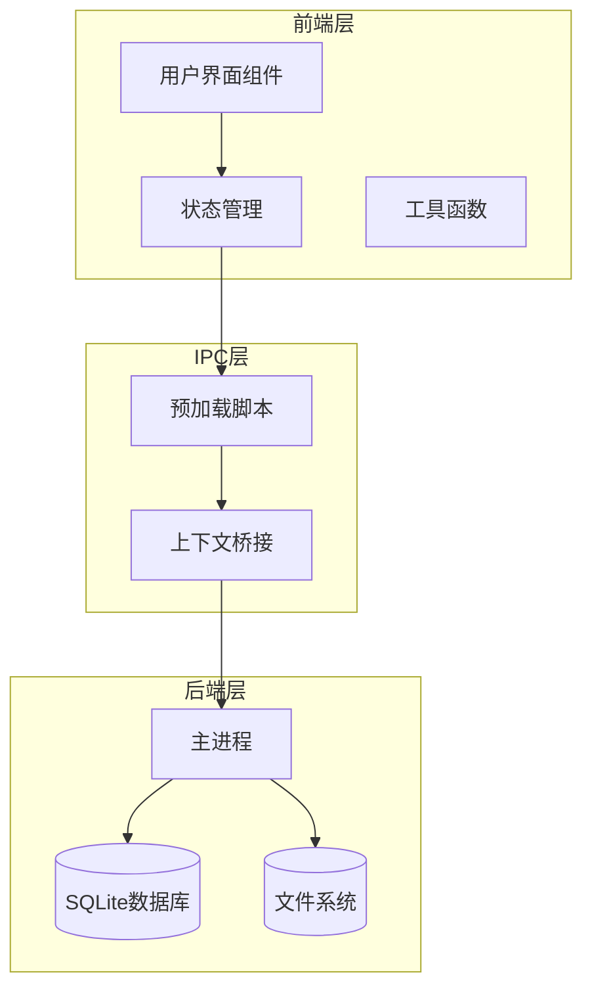
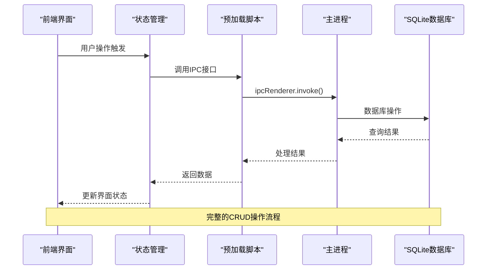
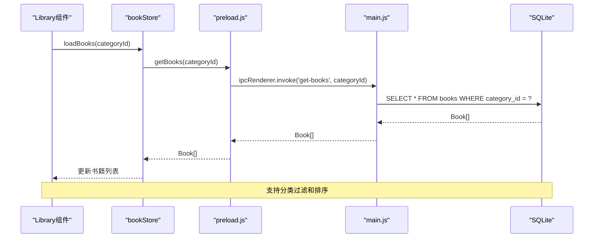
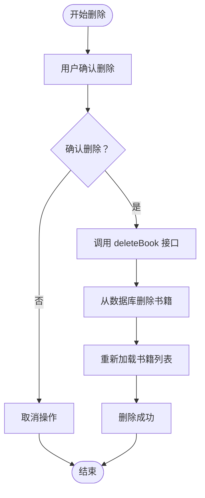
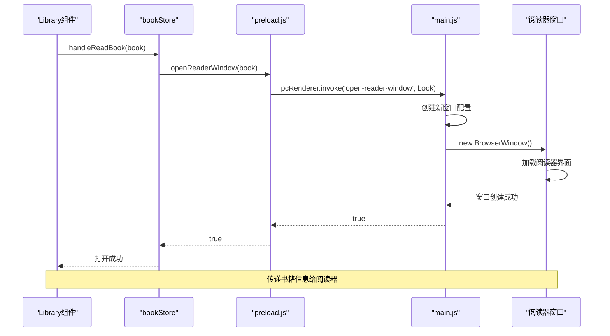
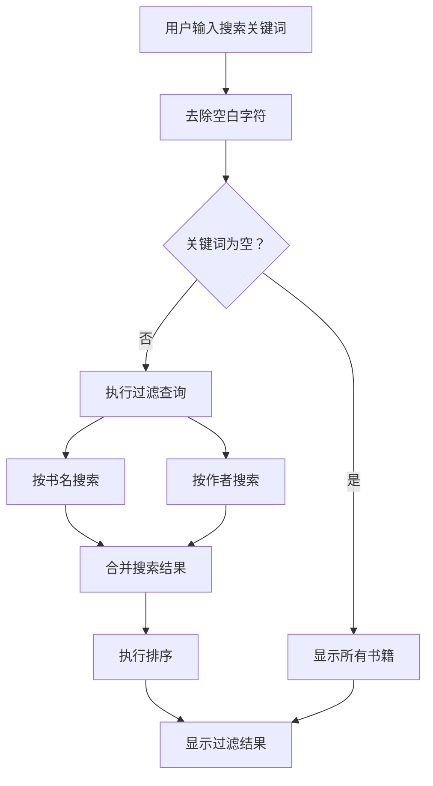
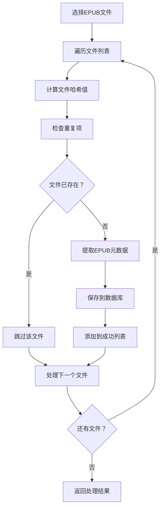
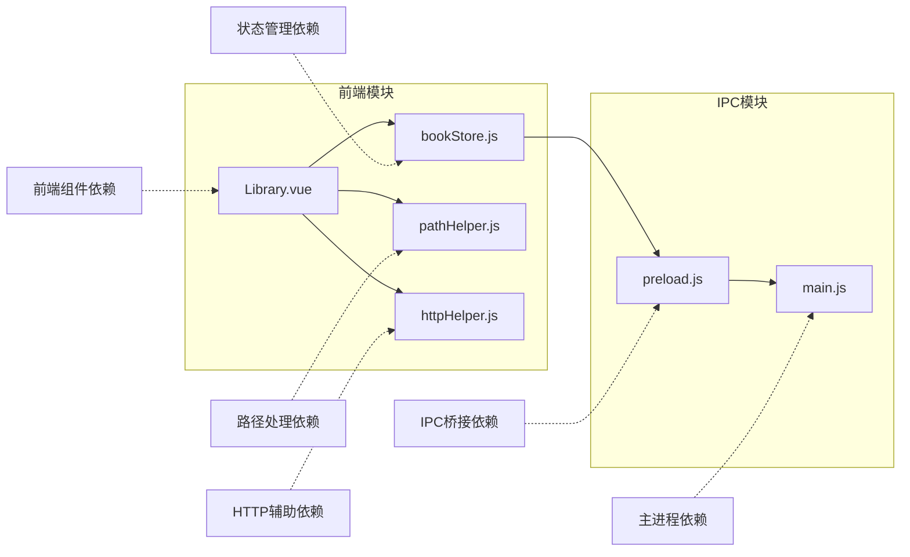

# 书籍管理接口

<cite>
**本文档引用的文件**
- [Library.vue](file://src/components/Library.vue)
- [bookStore.js](file://src/stores/bookStore.js)
- [main.js](file://electron/main.js)
- [preload.js](file://electron/preload.js)
- [pathHelper.js](file://src/utils/pathHelper.js)
- [httpHelper.js](file://src/utils/httpHelper.js)
- [package.json](file://package.json)
</cite>

## 目录
1. [简介](#简介)
2. [项目结构](#项目结构)
3. [核心组件](#核心组件)
4. [架构概览](#架构概览)
5. [详细组件分析](#详细组件分析)
6. [依赖关系分析](#依赖关系分析)
7. [性能考虑](#性能考虑)
8. [故障排除指南](#故障排除指南)
9. [结论](#结论)

## 简介

ROSAA电子书阅读器是一个基于Vue.js和Electron的桌面应用程序，专门用于管理和阅读EPUB电子书文件。本文档详细说明了书籍管理接口的IPC（进程间通信）机制，包括书籍的CRUD操作、分类管理、搜索过滤和批量操作等功能。

该系统采用前后端分离的架构设计，前端负责用户界面交互和业务逻辑处理，后端（主进程）负责数据持久化和系统资源管理。通过Electron的IPC机制实现了安全的跨进程通信。

## 项目结构

项目采用模块化的组织方式，主要分为以下几个核心部分：

**图表来源**
- [Library.vue:1-800](file://src/components/Library.vue#L1-L800)
- [bookStore.js:1-234](file://src/stores/bookStore.js#L1-L234)
- [main.js:1-922](file://electron/main.js#L1-L922)

**章节来源**
- [package.json:1-82](file://package.json#L1-L82)

## 核心组件

### 书籍管理组件（Library.vue）

Library组件是书籍管理的核心界面组件，提供了完整的书籍浏览、搜索、分类和操作功能：

- **书籍列表展示**：支持网格布局和卡片视图
- **分类导航**：左侧边栏显示所有分类和新建分类功能
- **搜索过滤**：支持按书名和作者进行实时搜索
- **排序功能**：支持按最近添加时间和书名排序
- **右键菜单**：提供丰富的书籍操作选项
- **设置管理**：包含存储管理、缓存管理和区域设置

### 状态管理（bookStore.js）

Pinia状态管理仓库提供了统一的数据访问接口：

- **书籍数据管理**：加载、更新、删除书籍
- **分类数据管理**：创建、删除、分配书籍分类
- **进度跟踪**：保存和加载阅读进度
- **书签管理**：添加、删除和管理书签
- **批注管理**：处理文本批注和高亮

**章节来源**
- [Library.vue:346-786](file://src/components/Library.vue#L346-L786)
- [bookStore.js:1-234](file://src/stores/bookStore.js#L1-L234)

## 架构概览

系统采用三层架构设计，通过Electron的IPC机制实现安全的跨进程通信：

**图表来源**
- [preload.js:7-101](file://electron/preload.js#L7-L101)
- [main.js:343-427](file://electron/main.js#L343-L427)

## 详细组件分析

### IPC接口定义

#### 书籍管理接口

| 接口名称 | 参数 | 返回值 | 描述 |
|---------|------|--------|------|
| `getBooks` | `categoryId: number` | `Book[]` | 获取指定分类的书籍列表 |
| `deleteBook` | `bookId: number` | `boolean` | 删除指定书籍 |
| `deleteBookCompletely` | `bookId: number` | `{success: boolean, error?: string}` | 彻底删除书籍及其文件 |
| `openReaderWindow` | `book: Book` | `boolean` | 打开阅读器窗口 |

#### 分类管理接口

| 接口名称 | 参数 | 返回值 | 描述 |
|---------|------|--------|------|
| `getCategories` | 无 | `Category[]` | 获取所有分类 |
| `addCategory` | `name: string, color: string` | `{id: number, name: string, color: string}` | 添加新分类 |
| `deleteCategory` | `categoryId: number` | `boolean` | 删除分类 |
| `updateBookCategory` | `bookId: number, categoryId: number` | `boolean` | 更新书籍分类 |

#### 文件管理接口

| 接口名称 | 参数 | 返回值 | 描述 |
|---------|------|--------|------|
| `openEpub` | 无 | `{success: boolean, added: Book[], skipped: number, total: number}` | 打开EPUB文件并导入 |
| `exportBook` | `bookId: number` | `{success: boolean, path?: string, error?: string}` | 导出书籍文件 |
| `exportNotes` | `bookId: number` | `{success: boolean, path?: string, error?: string}` | 导出笔记和批注 |

#### 进度和书签接口

| 接口名称 | 参数 | 返回值 | 描述 |
|---------|------|--------|------|
| `getProgress` | `bookId: number` | `ReadingProgress` | 获取阅读进度 |
| `saveProgress` | `data: ReadingProgress` | `boolean` | 保存阅读进度 |
| `getBookmarks` | `bookId: number` | `Bookmark[]` | 获取书签列表 |
| `addBookmark` | `data: Bookmark` | `{id: number}` | 添加书签 |
| `deleteBookmark` | `bookmarkId: number` | `boolean` | 删除书签 |
| `getAnnotations` | `bookId: number` | `Annotation[]` | 获取批注列表 |
| `saveAnnotation` | `data: Annotation` | `{success: boolean, id?: number}` | 保存批注 |
| `deleteAnnotation` | `annotationId: number` | `boolean` | 删除批注 |

**章节来源**
- [preload.js:7-101](file://electron/preload.js#L7-L101)
- [main.js:429-708](file://electron/main.js#L429-L708)

### 数据模型定义

#### 书籍实体（Book）

| 字段名 | 类型 | 必填 | 描述 |
|-------|------|------|------|
| `id` | `number` | 是 | 主键标识 |
| `title` | `string` | 是 | 书籍标题 |
| `author` | `string` | 否 | 作者信息 |
| `publisher` | `string` | 否 | 出版社信息 |
| `isbn` | `string` | 否 | ISBN编号 |
| `pub_date` | `string` | 否 | 出版日期 |
| `language` | `string` | 否 | 语言 |
| `description` | `string` | 否 | 简介描述 |
| `cover_path` | `string` | 否 | 封面文件路径 |
| `book_path` | `string` | 是 | 书籍文件路径 |
| `file_hash` | `string` | 否 | 文件哈希值 |
| `added_at` | `string` | 否 | 添加时间 |
| `last_read_at` | `string` | 否 | 最近阅读时间 |
| `category_id` | `number` | 否 | 分类ID |

#### 分类实体（Category）

| 字段名 | 类型 | 必填 | 描述 |
|-------|------|------|------|
| `id` | `number` | 是 | 主键标识 |
| `name` | `string` | 是 | 分类名称 |
| `color` | `string` | 否 | 分类颜色 |
| `created_at` | `string` | 否 | 创建时间 |

#### 阅读进度实体（ReadingProgress）

| 字段名 | 类型 | 必填 | 描述 |
|-------|------|------|------|
| `id` | `number` | 是 | 主键标识 |
| `book_id` | `number` | 是 | 书籍ID |
| `cfi` | `string` | 否 | CFI定位符 |
| `page` | `number` | 否 | 当前页码 |
| `percentage` | `number` | 否 | 阅读进度百分比 |
| `updated_at` | `string` | 否 | 更新时间 |

#### 书签实体（Bookmark）

| 字段名 | 类型 | 必填 | 描述 |
|-------|------|------|------|
| `id` | `number` | 是 | 主键标识 |
| `book_id` | `number` | 是 | 书籍ID |
| `cfi` | `string` | 是 | CFI定位符 |
| `title` | `string` | 否 | 书签标题 |
| `note` | `string` | 否 | 备注信息 |
| `created_at` | `string` | 否 | 创建时间 |

#### 批注实体（Annotation）

| 字段名 | 类型 | 必填 | 描述 |
|-------|------|------|------|
| `id` | `number` | 是 | 主键标识 |
| `book_id` | `number` | 是 | 书籍ID |
| `cfi` | `string` | 是 | CFI定位符 |
| `selected_text` | `string` | 是 | 选中文本 |
| `annotation` | `string` | 是 | 批注内容 |
| `color` | `string` | 否 | 高亮颜色 |
| `created_at` | `string` | 否 | 创建时间 |
| `updated_at` | `string` | 否 | 更新时间 |

**章节来源**
- [main.js:190-265](file://electron/main.js#L190-L265)

### 书籍CRUD操作流程

#### 获取书籍列表（getBooks）

**图表来源**
- [bookStore.js:12-22](file://src/stores/bookStore.js#L12-L22)
- [main.js:429-449](file://electron/main.js#L429-L449)

#### 删除书籍（deleteBook）

**图表来源**
- [bookStore.js:106-113](file://src/stores/bookStore.js#L106-L113)
- [main.js:696-708](file://electron/main.js#L696-L708)

#### 打开阅读器窗口（openReaderWindow）

**图表来源**
- [Library.vue:482-498](file://src/components/Library.vue#L482-L498)
- [main.js:772-819](file://electron/main.js#L772-L819)

### 搜索和过滤功能

系统提供了多维度的搜索和过滤功能：

#### 实时搜索过滤

**图表来源**
- [Library.vue:364-392](file://src/components/Library.vue#L364-L392)

#### 分类过滤

系统支持按分类进行书籍过滤，通过`selectCategory`方法实现：

- **全部图书**：`categoryId = null`
- **特定分类**：`categoryId = 分类ID`
- **动态更新**：切换分类时自动重新加载书籍列表

#### 排序功能

支持两种排序方式：
- **按最近添加时间**：`recent` - 最新添加的书籍排在前面
- **按书名排序**：`title` - 按中文拼音顺序排列

**章节来源**
- [Library.vue:359-392](file://src/components/Library.vue#L359-L392)

### 批量操作实现

#### 批量导入EPUB文件

系统支持批量导入EPUB文件，通过`openEpub`接口实现：

**图表来源**
- [main.js:343-427](file://electron/main.js#L343-L427)

#### 批量导出功能

支持批量导出书籍文件和笔记：
- **导出书籍**：复制EPUB文件到指定位置
- **导出笔记**：生成包含批注和书签的文本文件

**章节来源**
- [main.js:495-592](file://electron/main.js#L495-L592)

## 依赖关系分析

### 外部依赖

系统依赖的关键外部库：

| 依赖库 | 版本 | 用途 |
|-------|------|------|
| `electron` | ^28.3.3 | 桌面应用框架 |
| `better-sqlite3` | ^12.10.0 | SQLite数据库驱动 |
| `adm-zip` | ^0.5.17 | ZIP文件处理 |
| `xml2js` | ^0.6.2 | XML解析 |
| `vue` | ^3.3.0 | 前端框架 |
| `pinia` | ^2.1.0 | 状态管理 |
| `epubjs` | ^0.3.93 | EPUB渲染引擎 |

### 内部模块依赖

**图表来源**
- [package.json:22-41](file://package.json#L22-L41)

**章节来源**
- [package.json:1-82](file://package.json#L1-L82)

## 性能考虑

### 数据库优化

1. **WAL模式启用**：通过`journal_mode = WAL`提升并发性能
2. **索引优化**：在常用查询字段上建立适当的索引
3. **连接池管理**：合理管理数据库连接，避免连接泄漏
4. **事务处理**：批量操作使用事务确保数据一致性

### 内存管理

1. **懒加载机制**：封面图片采用懒加载，减少内存占用
2. **虚拟滚动**：大量书籍时使用虚拟滚动技术
3. **缓存策略**：合理使用浏览器缓存和应用缓存
4. **垃圾回收**：及时清理不再使用的对象引用

### 网络优化

1. **请求合并**：将多个小请求合并为批量请求
2. **防抖处理**：搜索输入使用防抖技术减少请求频率
3. **增量更新**：只更新变化的数据，避免全量刷新

## 故障排除指南

### 常见问题及解决方案

#### IPC通信失败

**症状**：前端无法调用后端接口
**原因**：
- 预加载脚本未正确暴露接口
- Electron环境配置问题
- 跨进程通信阻塞

**解决方案**：
1. 检查预加载脚本中的接口暴露
2. 确认`contextBridge`配置正确
3. 验证`nodeIntegration`和`contextIsolation`设置

#### 数据库连接异常

**症状**：无法读写数据库
**原因**：
- 数据库文件损坏
- 权限不足
- 并发访问冲突

**解决方案**：
1. 检查数据库文件完整性
2. 确认用户数据目录权限
3. 实施适当的锁机制

#### 文件路径问题

**症状**：封面或书籍文件无法加载
**原因**：
- 路径格式不正确
- 文件不存在
- 权限问题

**解决方案**：
1. 使用`pathHelper.js`提供的路径处理函数
2. 验证文件存在性
3. 检查文件权限

#### 性能问题

**症状**：界面响应缓慢
**原因**：
- 大量DOM操作
- 频繁的数据库查询
- 内存泄漏

**解决方案**：
1. 实施虚拟滚动
2. 优化数据库查询
3. 使用防抖和节流
4. 定期检查内存使用情况

**章节来源**
- [Library.vue:771-785](file://src/components/Library.vue#L771-L785)
- [main.js:821-881](file://electron/main.js#L821-L881)

## 结论

ROSAA电子书阅读器的书籍管理接口设计体现了现代桌面应用的最佳实践：

### 技术优势

1. **架构清晰**：采用分层架构，职责分离明确
2. **安全性强**：通过IPC机制实现安全的跨进程通信
3. **扩展性强**：模块化设计便于功能扩展
4. **用户体验好**：提供丰富的交互和反馈机制

### 功能完整性

系统完整实现了电子书管理的核心功能：
- **完整的CRUD操作**：支持书籍的增删改查
- **智能分类管理**：灵活的分类体系和标签功能
- **强大的搜索能力**：多维度搜索和过滤
- **丰富的导出功能**：支持多种格式的导出
- **进度跟踪**：完善的阅读进度管理

### 改进建议

1. **增加单元测试**：为关键接口添加自动化测试
2. **性能监控**：集成性能监控和日志收集
3. **国际化支持**：扩展多语言支持
4. **云同步功能**：添加云端备份和同步能力
5. **插件系统**：支持第三方扩展和插件

该系统为电子书阅读器提供了稳定可靠的技术基础，通过持续的优化和改进，可以为用户提供更好的阅读体验。