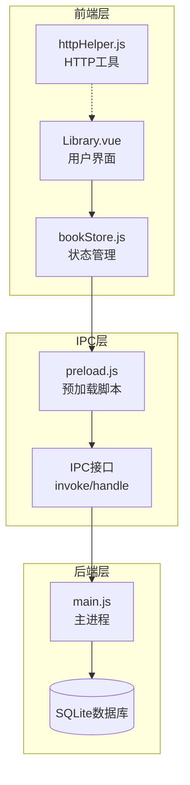
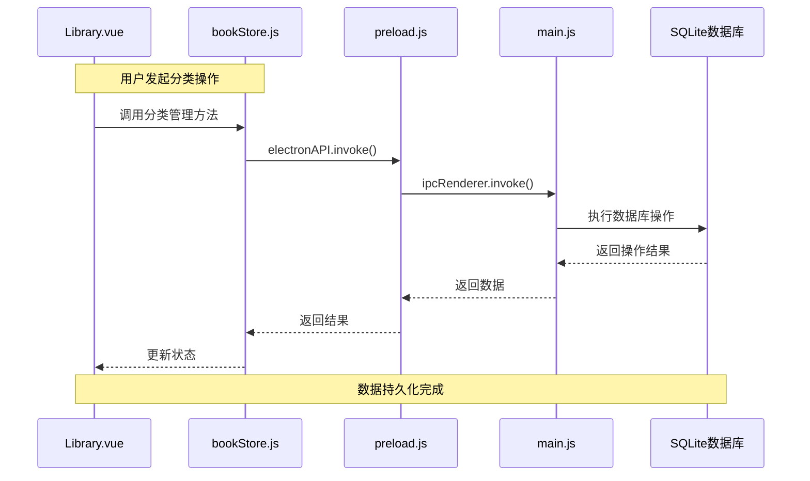
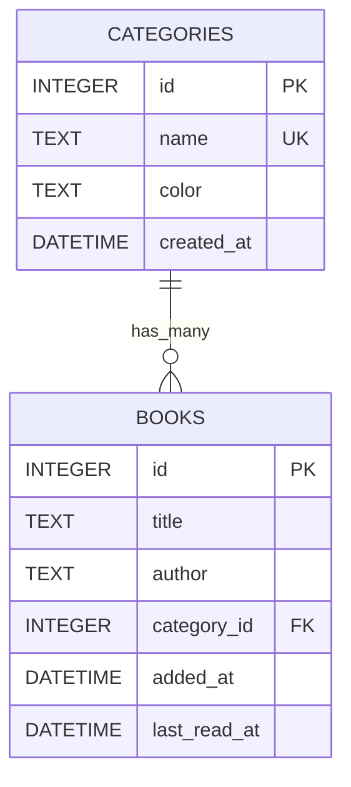
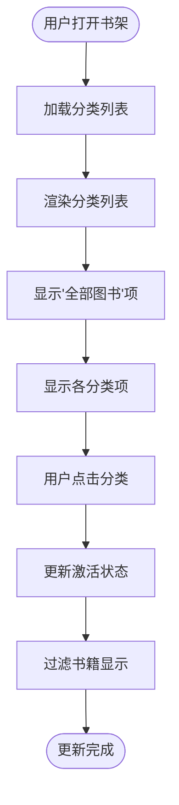
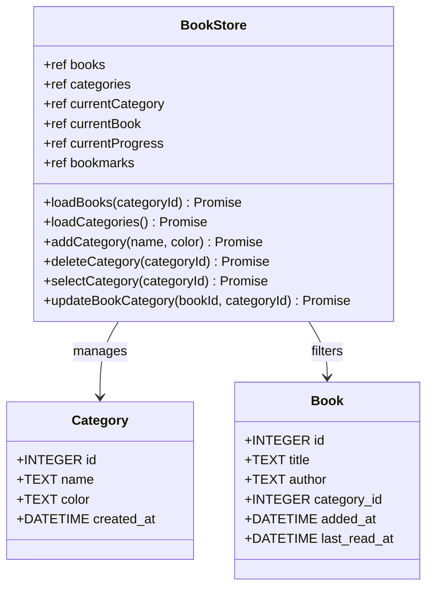
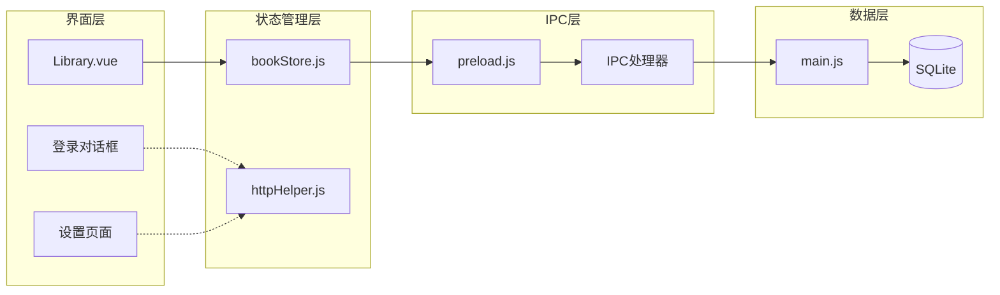

# 分类管理接口

<cite>
**本文档引用的文件**
- [bookStore.js](file://src/stores/bookStore.js)
- [Library.vue](file://src/components/Library.vue)
- [main.js](file://electron/main.js)
- [preload.js](file://electron/preload.js)
- [httpHelper.js](file://src/utils/httpHelper.js)
- [README.md](file://README.md)
</cite>

## 目录
1. [简介](#简介)
2. [项目结构](#项目结构)
3. [核心组件](#核心组件)
4. [架构概览](#架构概览)
5. [详细组件分析](#详细组件分析)
6. [依赖分析](#依赖分析)
7. [性能考虑](#性能考虑)
8. [故障排除指南](#故障排除指南)
9. [结论](#结论)
10. [附录](#附录)

## 简介
本文档详细说明 ROSAA 电子书阅读器的分类管理接口，包括书籍分类相关的 IPC 接口设计、数据结构定义、颜色标识系统、层级关系以及分类统计信息。文档重点覆盖以下接口：
- getCategories：获取分类列表
- addCategory：添加分类
- deleteCategory：删除分类
- updateBookCategory：更新书籍分类

同时提供完整的调用示例，展示如何实现灵活的书籍分类管理功能，解释分类的拖拽排序、批量分类和分类合并策略，并包含分类数据的备份恢复和迁移方案。

## 项目结构
ROSAA 电子书阅读器采用 Electron + Vue 3 + SQLite 的技术栈，项目结构清晰地分离了前端界面、状态管理和后端数据库逻辑：



**图表来源**
- [Library.vue:1-800](file://src/components/Library.vue#L1-L800)
- [bookStore.js:1-234](file://src/stores/bookStore.js#L1-L234)
- [preload.js:1-104](file://electron/preload.js#L1-L104)
- [main.js:1-922](file://electron/main.js#L1-L922)

**章节来源**
- [README.md:167-193](file://README.md#L167-L193)

## 核心组件
分类管理系统由四个核心组件构成，每个组件都有明确的职责分工：

### 1. 前端界面组件
- **Library.vue**：负责用户交互界面，包括分类列表展示、分类操作对话框、书籍右键菜单等
- **Library.vue**：提供分类颜色可视化、搜索过滤、排序功能

### 2. 状态管理组件
- **bookStore.js**：使用 Pinia 管理全局状态，封装所有分类相关的业务逻辑
- **bookStore.js**：提供分类数据的增删改查操作，维护分类状态同步

### 3. IPC 通信组件
- **preload.js**：暴露 electronAPI 接口给前端，统一处理 IPC 调用
- **main.js**：实现具体的 IPC 处理器，与数据库交互

### 4. 数据库组件
- **main.js**：使用 SQLite 数据库存储分类信息，支持分类表的完整 CRUD 操作

**章节来源**
- [Library.vue:1-800](file://src/components/Library.vue#L1-L800)
- [bookStore.js:1-234](file://src/stores/bookStore.js#L1-L234)
- [preload.js:1-104](file://electron/preload.js#L1-L104)
- [main.js:263-284](file://electron/main.js#L263-L284)

## 架构概览
分类管理系统的整体架构采用分层设计，确保前后端分离和数据一致性：



**图表来源**
- [bookStore.js:24-61](file://src/stores/bookStore.js#L24-L61)
- [preload.js:40-55](file://electron/preload.js#L40-L55)
- [main.js:452-493](file://electron/main.js#L452-L493)

## 详细组件分析

### 分类数据模型
分类系统采用简洁而强大的数据模型设计：



**图表来源**
- [main.js:263-281](file://electron/main.js#L263-L281)

#### 数据字段说明
- **id**：分类唯一标识符，自增主键
- **name**：分类名称，唯一约束，确保分类不重复
- **color**：分类颜色标识，默认值 `#667eea`
- **created_at**：创建时间戳，用于排序和统计
- **category_id**：书籍关联的分类外键，支持 NULL 值

### IPC 接口设计

#### getCategories 接口
获取所有分类列表，按创建时间升序排列：

**接口定义**
- **前端调用**：`window.electronAPI.getCategories()`
- **后端处理**：`ipcMain.handle('get-categories')`
- **数据库查询**：`SELECT * FROM categories ORDER BY created_at ASC`

**调用示例**
```javascript
// 前端使用
const categories = await window.electronAPI.getCategories()

// 状态管理封装
async function loadCategories() {
    const loadedCategories = await window.electronAPI.getCategories()
    categories.value = loadedCategories
}
```

#### addCategory 接口
添加新的分类，支持自定义颜色：

**接口定义**
- **前端调用**：`window.electronAPI.addCategory(name, color)`
- **后端处理**：`ipcMain.handle('add-category')`
- **数据库操作**：`INSERT INTO categories (name, color) VALUES (?, ?)`

**参数说明**
- **name**：分类名称（必填）
- **color**：十六进制颜色值，默认 `#667eea`

**调用示例**
```javascript
// 前端使用
const newCategory = await window.electronAPI.addCategory('学习', '#4CAF50')

// 状态管理封装
async function addCategory(name, color = '#667eea') {
    const result = await window.electronAPI.addCategory(name, color)
    if (result) {
        await loadCategories()
        return result
    }
    return null
}
```

#### deleteCategory 接口
删除指定分类，支持级联删除：

**接口定义**
- **前端调用**：`window.electronAPI.deleteCategory(categoryId)`
- **后端处理**：`ipcMain.handle('delete-category')`
- **数据库操作**：`DELETE FROM categories WHERE id = ?`

**注意事项**
- 删除分类不会影响已分配的书籍
- 如果删除的是当前选中的分类，会自动切换到"全部图书"视图

**调用示例**
```javascript
// 前端使用
await window.electronAPI.deleteCategory(1)

// 状态管理封装
async function deleteCategory(categoryId) {
    await window.electronAPI.deleteCategory(categoryId)
    await loadCategories()
    // 如果删除的是当前选中的分类，切换到所有书籍
    if (currentCategory.value === categoryId) {
        currentCategory.value = null
        await loadBooks(null)
    }
}
```

#### updateBookCategory 接口
更新书籍的分类归属：

**接口定义**
- **前端调用**：`window.electronAPI.updateBookCategory(bookId, categoryId)`
- **后端处理**：`ipcMain.handle('update-book-category')`
- **数据库操作**：`UPDATE books SET category_id = ? WHERE id = ?`

**调用示例**
```javascript
// 前端使用
await window.electronAPI.updateBookCategory(123, 5)

// 状态管理封装
async function updateBookCategory(bookId, categoryId) {
    await window.electronAPI.updateBookCategory(bookId, categoryId)
    await loadBooks(currentCategory.value)
}
```

**章节来源**
- [bookStore.js:24-61](file://src/stores/bookStore.js#L24-L61)
- [preload.js:40-55](file://electron/preload.js#L40-L55)
- [main.js:452-493](file://electron/main.js#L452-L493)

### 前端界面实现

#### 分类列表展示
Library.vue 实现了完整的分类列表界面，包括颜色标识和交互功能：



**图表来源**
- [Library.vue:15-43](file://src/components/Library.vue#L15-L43)
- [Library.vue:506-511](file://src/components/Library.vue#L506-L511)

#### 分类颜色系统
系统提供丰富的颜色选择方案，支持用户自定义分类颜色：

**预设颜色列表**
- 蓝紫色：`#667eea`
- 紫色：`#764ba2`
- 粉色：`#f093fb`
- 红色：`#f5576c`
- 橙色：`#ffa94d`
- 黄色：`#ffd43b`
- 绿色：`#69db7c`
- 青绿色：`#38d9a9`
- 蓝色：`#4dabf7`
- 淡蓝色：`#748ffc`
- 淡紫色：`#9775fa`

**颜色应用机制**
- 分类项左侧使用颜色圆点标识
- 激活状态的分类使用半透明背景
- 颜色值存储在数据库中，支持动态修改

**章节来源**
- [Library.vue:428-442](file://src/components/Library.vue#L428-L442)
- [Library.vue:34-43](file://src/components/Library.vue#L34-L43)

### 状态管理实现

#### Pinia Store 设计
bookStore.js 使用 Pinia 提供响应式状态管理：



**图表来源**
- [bookStore.js:4-234](file://src/stores/bookStore.js#L4-L234)

#### 状态同步机制
- **双向绑定**：Vue 组件与 Pinia store 实现双向数据绑定
- **异步更新**：所有数据库操作都是异步的，确保 UI 响应性
- **错误处理**：统一的错误处理机制，防止应用崩溃

**章节来源**
- [bookStore.js:12-69](file://src/stores/bookStore.js#L12-L69)

## 依赖分析

### 组件耦合关系
分类管理系统展现了良好的模块化设计，各组件之间耦合度低，职责清晰：



**图表来源**
- [Library.vue:346-348](file://src/components/Library.vue#L346-L348)
- [bookStore.js:1-2](file://src/stores/bookStore.js#L1-L2)
- [preload.js:1-1](file://electron/preload.js#L1-L1)

### 外部依赖
- **better-sqlite3**：高性能 SQLite 数据库驱动
- **electron**：跨平台桌面应用框架
- **vue3 + pinia**：现代前端框架和状态管理
- **xml2js**：EPUB 文件解析
- **adm-zip**：ZIP 文件处理

**章节来源**
- [main.js:1-8](file://electron/main.js#L1-L8)
- [README.md:32-41](file://README.md#L32-L41)

## 性能考虑

### 数据库优化
- **WAL 模式**：启用 Write-Ahead Logging 提高并发性能
- **索引策略**：categories 表的 name 字段使用唯一约束，提高查询效率
- **事务处理**：批量操作使用事务确保数据一致性

### 前端性能优化
- **懒加载**：分类列表按需加载，避免一次性渲染大量数据
- **虚拟滚动**：对于大量书籍的情况，可考虑实现虚拟滚动
- **缓存策略**：分类数据在内存中缓存，减少重复查询

### IPC 通信优化
- **批量操作**：支持批量分类操作，减少 IPC 调用次数
- **错误重试**：网络异常时提供重试机制
- **超时处理**：设置合理的超时时间，避免 UI 卡顿

## 故障排除指南

### 常见问题及解决方案

#### 分类颜色显示异常
**问题描述**：分类颜色不显示或显示错误
**解决方案**：
1. 检查颜色值格式是否为有效的十六进制颜色
2. 确认 CSS 样式正确应用
3. 验证数据库中颜色字段的数据完整性

#### 分类删除失败
**问题描述**：删除分类时报错或数据未更新
**解决方案**：
1. 检查是否存在外键约束冲突
2. 确认数据库连接状态
3. 验证分类 ID 的有效性

#### 分类排序问题
**问题描述**：分类显示顺序不符合预期
**解决方案**：
1. 检查数据库查询语句的排序条件
2. 确认 created_at 字段的时间准确性
3. 验证前端排序逻辑

**章节来源**
- [bookStore.js:35-61](file://src/stores/bookStore.js#L35-L61)
- [main.js:452-493](file://electron/main.js#L452-L493)

## 结论
ROSAA 电子书阅读器的分类管理系统展现了优秀的软件架构设计，具有以下特点：

1. **模块化设计**：清晰的分层架构，各组件职责明确
2. **数据一致性**：完善的 IPC 通信机制，确保前后端数据同步
3. **用户体验**：直观的颜色标识系统，支持丰富的交互功能
4. **扩展性**：良好的代码组织，便于后续功能扩展

该系统为电子书阅读器提供了强大而灵活的分类管理能力，能够满足用户的多样化需求。

## 附录

### API 接口参考

#### 分类管理接口
| 接口名称 | 参数 | 返回值 | 描述 |
|---------|------|--------|------|
| getCategories | 无 | Array<Category> | 获取所有分类列表 |
| addCategory | name: string, color?: string | Category \| null | 添加新分类 |
| deleteCategory | categoryId: number | boolean | 删除指定分类 |
| updateBookCategory | bookId: number, categoryId: number | boolean | 更新书籍分类 |

#### 数据结构定义
**Category 对象**
- id: INTEGER - 分类唯一标识符
- name: TEXT - 分类名称
- color: TEXT - 颜色标识
- created_at: DATETIME - 创建时间

**Book 对象**
- id: INTEGER - 书籍唯一标识符
- title: TEXT - 书籍标题
- author: TEXT - 作者信息
- category_id: INTEGER - 分类关联ID
- added_at: DATETIME - 添加时间
- last_read_at: DATETIME - 最后阅读时间

### 高级功能建议

#### 分类拖拽排序
- 实现拖拽排序功能，支持用户自定义分类顺序
- 使用 HTML5 Drag and Drop API 或第三方库
- 保存排序权重字段，支持复杂的层级关系

#### 批量分类操作
- 支持多选书籍的批量分类操作
- 提供分类合并功能，将多个分类合并为一个
- 实现分类复制功能，快速创建相似分类

#### 分类统计分析
- 统计每个分类的书籍数量
- 分析分类使用频率和趋势
- 提供分类健康度报告

#### 数据备份与恢复
- 定期备份数据库文件
- 支持分类数据的导入导出
- 实现增量备份和版本管理