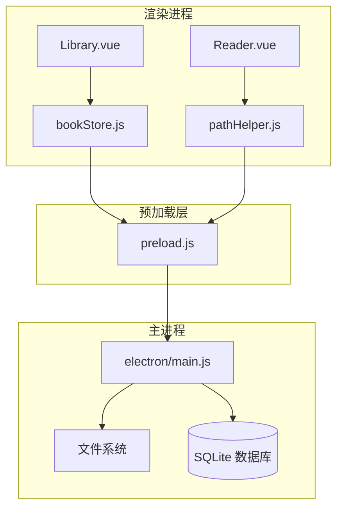
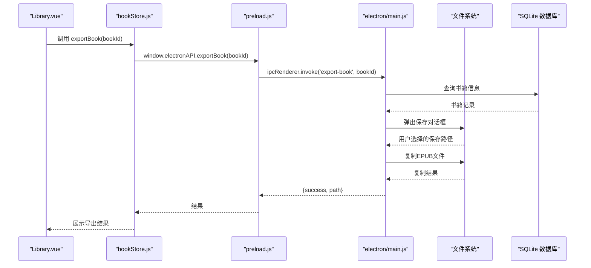
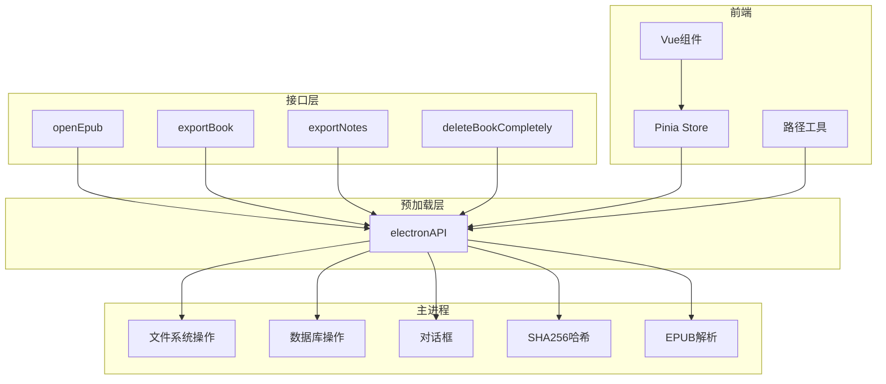

# 文件操作接口

<cite>
**本文引用的文件**
- [electron/main.js](file://electron/main.js)
- [electron/preload.js](file://electron/preload.js)
- [src/stores/bookStore.js](file://src/stores/bookStore.js)
- [src/components/Library.vue](file://src/components/Library.vue)
- [src/components/Reader.vue](file://src/components/Reader.vue)
- [src/utils/pathHelper.js](file://src/utils/pathHelper.js)
- [docs/PATH_COMPATIBILITY.md](file://docs/PATH_COMPATIBILITY.md)
- [package.json](file://package.json)
</cite>

## 目录
1. [简介](#简介)
2. [项目结构](#项目结构)
3. [核心组件](#核心组件)
4. [架构概览](#架构概览)
5. [详细组件分析](#详细组件分析)
6. [依赖关系分析](#依赖关系分析)
7. [性能考虑](#性能考虑)
8. [故障排除指南](#故障排除指南)
9. [结论](#结论)
10. [附录](#附录)

## 简介
本文档面向ROSAA电子书阅读器的文件操作接口，重点阐述EPUB文件处理相关的IPC接口，包括：
- openEpub（打开EPUB文件）
- exportBook（导出书籍）
- exportNotes（导出笔记）
- deleteBookCompletely（完全删除书籍）

文档将详细说明每个接口的调用方式、参数格式、返回值结构、错误处理机制，并提供在Vue组件中正确使用的JavaScript示例。同时解释文件路径处理、权限检查和异常情况的处理策略，以及文件操作的最佳实践和性能优化建议。

## 项目结构
ROSAA采用Electron + Vue 3 + Pinia的架构，文件操作主要通过主进程的IPC接口实现，前端通过preload桥接层暴露给渲染进程使用。



**图表来源**
- [electron/main.js:1-922](file://electron/main.js#L1-L922)
- [electron/preload.js:1-104](file://electron/preload.js#L1-L104)
- [src/stores/bookStore.js:1-234](file://src/stores/bookStore.js#L1-L234)
- [src/utils/pathHelper.js:1-63](file://src/utils/pathHelper.js#L1-L63)

**章节来源**
- [electron/main.js:1-922](file://electron/main.js#L1-L922)
- [electron/preload.js:1-104](file://electron/preload.js#L1-L104)
- [src/stores/bookStore.js:1-234](file://src/stores/bookStore.js#L1-L234)
- [src/utils/pathHelper.js:1-63](file://src/utils/pathHelper.js#L1-L63)

## 核心组件
本节概述文件操作接口的核心组件及其职责：
- 主进程接口：负责文件系统操作、数据库交互、对话框交互
- 预加载桥接：将主进程接口安全地暴露给渲染进程
- Pinia Store：封装业务逻辑，协调UI与IPC交互
- 路径工具：统一处理开发/生产环境的文件路径

**章节来源**
- [electron/main.js:343-632](file://electron/main.js#L343-L632)
- [electron/preload.js:7-101](file://electron/preload.js#L7-L101)
- [src/stores/bookStore.js:4-234](file://src/stores/bookStore.js#L4-L234)
- [src/utils/pathHelper.js:13-53](file://src/utils/pathHelper.js#L13-L53)

## 架构概览
文件操作接口遵循以下调用链路：
1. 渲染进程通过window.electronAPI调用预加载层
2. 预加载层通过ipcRenderer.invoke调用主进程ipcMain.handle处理器
3. 主进程执行文件系统操作、数据库查询或对话框交互
4. 主进程返回结果，预加载层转发给渲染进程
5. 渲染进程根据结果更新UI或提示用户



**图表来源**
- [src/components/Library.vue:538-562](file://src/components/Library.vue#L538-L562)
- [src/stores/bookStore.js:137-145](file://src/stores/bookStore.js#L137-L145)
- [electron/preload.js:56-59](file://electron/preload.js#L56-L59)
- [electron/main.js:495-531](file://electron/main.js#L495-L531)

## 详细组件分析

### openEpub 接口
openEpub用于打开EPUB文件并导入到应用中，支持多文件选择。

#### 调用方式
- 渲染进程：`await window.electronAPI.openEpub()`
- 预加载层：`electronAPI.openEpub()`
- 主进程：`ipcMain.handle('open-epub', async () => {...})`

#### 参数格式
- 无参数

#### 返回值结构
```javascript
{
  success: boolean,           // 是否成功
  added: Array,               // 新增的书籍数组
  skipped: number,            // 跳过的数量（重复或已存在）
  total: number               // 总选择数量
}
```

#### 处理流程
1. 打开文件选择对话框，允许多选EPUB文件
2. 对每个文件：
   - 生成SHA256哈希值用于去重
   - 检查数据库中是否存在相同路径或哈希的书籍
   - 解析EPUB元数据（标题、作者、封面等）
   - 复制文件到用户数据目录的upload/books
   - 保存元数据到数据库
3. 返回处理结果统计

#### 错误处理
- 文件对话框取消：返回 `{success: false, added: [], skipped: 0, total: 0}`
- 单个文件解析失败：记录错误并继续处理下一个文件
- 主进程异常：捕获错误并返回 `{success: false, error: errorMessage}`

**章节来源**
- [electron/main.js:343-427](file://electron/main.js#L343-L427)
- [electron/preload.js:8-11](file://electron/preload.js#L8-L11)
- [src/stores/bookStore.js:71-104](file://src/stores/bookStore.js#L71-L104)

### exportBook 接口
exportBook用于将指定书籍导出到用户选择的路径。

#### 调用方式
- 渲染进程：`await window.electronAPI.exportBook(bookId)`
- 预加载层：`electronAPI.exportBook(bookId)`
- 主进程：`ipcMain.handle('export-book', async (event, bookId) => {...})`

#### 参数格式
- `bookId`: number - 书籍ID

#### 返回值结构
```javascript
{
  success: boolean,
  path?: string,              // 导出文件的完整路径
  error?: string              // 错误信息（当success为false时）
}
```

#### 处理流程
1. 根据bookId查询书籍信息
2. 弹出保存对话框，默认文件名为"书名.epub"
3. 验证源文件存在性
4. 复制文件到用户选择的路径
5. 返回成功结果或错误信息

#### 错误处理
- 书籍不存在：返回 `{success: false, error: 'Book not found'}`
- 用户取消保存：返回 `{success: false, error: 'Cancelled'}`
- 源文件不存在：返回 `{success: false, error: 'Source file not found'}`
- 复制失败：返回 `{success: false, error: errorMessage}`

**章节来源**
- [electron/main.js:495-531](file://electron/main.js#L495-L531)
- [electron/preload.js:56-59](file://electron/preload.js#L56-L59)
- [src/stores/bookStore.js:137-145](file://src/stores/bookStore.js#L137-L145)

### exportNotes 接口
exportNotes用于将书籍的批注和书签导出为文本文件。

#### 调用方式
- 渲染进程：`await window.electronAPI.exportNotes(bookId)`
- 预加载层：`electronAPI.exportNotes(bookId)`
- 主进程：`ipcMain.handle('export-notes', async (event, bookId) => {...})`

#### 参数格式
- `bookId`: number - 书籍ID

#### 返回值结构
```javascript
{
  success: boolean,
  path?: string,              // 导出文件的完整路径
  error?: string              // 错误信息（当success为false时）
}
```

#### 处理流程
1. 查询书籍信息
2. 获取该书籍的所有批注（annotations）和书签（bookmarks）
3. 生成包含标题、作者、导出时间的头部信息
4. 按顺序写入批注和书签内容
5. 弹出保存对话框，默认文件名为"书名_笔记.txt"
6. 写入UTF-8编码的文本文件
7. 返回结果

#### 文本格式
导出的文本包含以下部分：
- 书籍标题和作者信息
- 导出时间
- 批注部分（按创建时间排序）
- 书签部分（按创建时间排序）

**章节来源**
- [electron/main.js:533-592](file://electron/main.js#L533-L592)
- [electron/preload.js:60-63](file://electron/preload.js#L60-L63)
- [src/stores/bookStore.js:147-155](file://src/stores/bookStore.js#L147-L155)

### deleteBookCompletely 接口
deleteBookCompletely用于彻底删除书籍，包括文件和数据库记录。

#### 调用方式
- 渲染进程：`await window.electronAPI.deleteBookCompletely(bookId)`
- 预加载层：`electronAPI.deleteBookCompletely(bookId)`
- 主进程：`ipcMain.handle('delete-book-completely', (event, bookId) => {...})`

#### 参数格式
- `bookId`: number - 书籍ID

#### 返回值结构
```javascript
{
  success: boolean,
  error?: string              // 错误信息（当success为false时）
}
```

#### 处理流程
1. 查询书籍信息
2. 删除书籍文件（book_path指向的EPUB文件）
3. 删除封面文件（cover_path指向的封面图片）
4. 删除数据库记录（通过外键级联删除相关进度、批注、书签）
5. 返回结果

#### 错误处理
- 书籍不存在：返回 `{success: false, error: 'Book not found'}`
- 文件删除失败：记录错误但继续执行后续步骤
- 数据库删除失败：返回 `{success: false, error: errorMessage}`

**章节来源**
- [electron/main.js:594-632](file://electron/main.js#L594-L632)
- [electron/preload.js:64-67](file://electron/preload.js#L64-L67)
- [src/stores/bookStore.js:115-126](file://src/stores/bookStore.js#L115-L126)

### JavaScript调用示例（Vue组件）
以下示例展示了在Vue组件中如何正确使用文件操作接口：

#### 在Library.vue中使用导出接口
```javascript
// 导出书籍
async function handleExportBook() {
  if (!selectedBook.value) return
  
  const result = await bookStore.exportBook(selectedBook.value.id)
  if (result.success) {
    alert(`书籍已导出到：${result.path}`)
  } else if (result.error !== 'Cancelled') {
    alert('导出失败：' + result.error)
  }
  closeContextMenu()
}

// 导出笔记
async function handleExportNotes() {
  if (!selectedBook.value) return
  
  const result = await bookStore.exportNotes(selectedBook.value.id)
  if (result.success) {
    alert(`笔记已导出到：${result.path}`)
  } else if (result.error !== 'Cancelled') {
    alert('导出失败：' + result.error)
  }
  closeContextMenu()
}

// 彻底删除
async function handleDeleteCompletely() {
  if (!selectedBook.value) return
  
  if (confirm('确定要彻底删除这本书吗？这将删除书籍文件和所有相关数据，此操作不可恢复！')) {
    const result = await bookStore.deleteBookCompletely(selectedBook.value.id)
    if (result.success) {
      alert('书籍已彻底删除')
    } else {
      alert('删除失败：' + result.error)
    }
  }
  closeContextMenu()
}
```

#### 在Reader.vue中使用路径工具
```javascript
// 构建EPUB文件URL
const filePath = buildFileUrl(props.book.book_path, userDataPath, appPath)
epubBook = ePub(filePath)

// 构建封面URL
const coverUrl = buildFileUrl(book.cover_path, userDataPath, appPath)
```

**章节来源**
- [src/components/Library.vue:538-577](file://src/components/Library.vue#L538-L577)
- [src/components/Reader.vue:246-248](file://src/components/Reader.vue#L246-L248)
- [src/utils/pathHelper.js:13-53](file://src/utils/pathHelper.js#L13-L53)

## 依赖关系分析
文件操作接口涉及多个模块的协作：



**图表来源**
- [electron/main.js:343-632](file://electron/main.js#L343-L632)
- [electron/preload.js:7-101](file://electron/preload.js#L7-L101)
- [src/stores/bookStore.js:4-234](file://src/stores/bookStore.js#L4-L234)
- [src/utils/pathHelper.js:13-53](file://src/utils/pathHelper.js#L13-L53)

**章节来源**
- [electron/main.js:343-632](file://electron/main.js#L343-L632)
- [electron/preload.js:7-101](file://electron/preload.js#L7-L101)
- [src/stores/bookStore.js:4-234](file://src/stores/bookStore.js#L4-L234)
- [src/utils/pathHelper.js:13-53](file://src/utils/pathHelper.js#L13-L53)

## 性能考虑
基于代码分析，以下是文件操作的性能特征和优化建议：

### 已实现的优化
1. **数据库性能优化**
   - 启用WAL模式提升并发性能
   - 使用事务和批量操作减少磁盘IO
   - 外键级联删除避免多次查询

2. **文件处理优化**
   - 使用AdmZip直接解析EPUB文件，避免临时解压
   - 异步文件复制，避免阻塞UI线程
   - 哈希去重避免重复处理相同文件

3. **内存管理**
   - 及时销毁epubjs实例和渲染器
   - 清理DOM事件监听器
   - 合理的错误处理避免资源泄漏

### 性能瓶颈识别
1. **EPUB元数据解析**：XML解析和ZIP文件读取可能成为瓶颈
2. **文件复制**：大文件复制时的磁盘IO
3. **数据库查询**：批注和书签的批量查询

### 优化建议
1. **异步处理**
   ```javascript
   // 使用Promise.all并行处理多个文件
   const results = await Promise.all(filePaths.map(processFile))
   ```

2. **分块处理**
   ```javascript
   // 对于大文件，考虑分块读取和处理
   const chunkSize = 1024 * 1024 // 1MB
   ```

3. **缓存策略**
   - 缓存EPUB元数据
   - 缓存文件哈希值
   - 缓存数据库查询结果

4. **进度反馈**
   - 在长耗时操作中提供进度条
   - 使用Web Workers处理CPU密集任务

**章节来源**
- [electron/main.js:185-187](file://electron/main.js#L185-L187)
- [electron/main.js:362-408](file://electron/main.js#L362-L408)
- [electron/main.js:533-592](file://electron/main.js#L533-L592)

## 故障排除指南
常见问题及解决方案：

### 文件路径问题
**问题**：封面或书籍无法显示
**原因**：路径构建错误或文件不存在
**解决**：
1. 检查路径工具函数的输出
2. 验证文件是否存在于用户数据目录
3. 确认开发/生产环境路径差异

**章节来源**
- [src/utils/pathHelper.js:13-53](file://src/utils/pathHelper.js#L13-L53)
- [docs/PATH_COMPATIBILITY.md:1-191](file://docs/PATH_COMPATIBILITY.md#L1-L191)

### 权限问题
**问题**：无法写入用户数据目录
**原因**：用户权限不足或磁盘空间不足
**解决**：
1. 检查应用程序是否有写入权限
2. 确保用户数据目录存在且可写
3. 检查磁盘空间是否充足

### EPUB解析失败
**问题**：EPUB文件无法解析
**原因**：文件损坏或格式不标准
**解决**：
1. 验证EPUB文件完整性
2. 检查container.xml和content.opf的存在性
3. 尝试使用其他EPUB阅读器验证文件

### 导出失败
**问题**：导出书籍或笔记失败
**原因**：目标路径不可写或源文件不存在
**解决**：
1. 检查保存对话框返回的路径
2. 验证源文件是否存在
3. 确认目标磁盘空间充足

### 数据库连接问题
**问题**：数据库操作失败
**原因**：数据库文件损坏或锁冲突
**解决**：
1. 检查数据库文件是否存在
2. 尝试重启应用程序
3. 清理数据库缓存文件

**章节来源**
- [electron/main.js:343-632](file://electron/main.js#L343-L632)
- [electron/main.js:821-921](file://electron/main.js#L821-L921)

## 结论
ROSAA电子书阅读器的文件操作接口设计合理，通过IPC机制实现了渲染进程与主进程的安全分离。openEpub、exportBook、exportNotes和deleteBookCompletely四个核心接口覆盖了EPUB文件处理的主要场景。

关键优势：
1. **安全性**：通过contextBridge和ipcRenderer实现安全的进程间通信
2. **可靠性**：完善的错误处理和异常恢复机制
3. **兼容性**：统一的路径处理逻辑支持开发和生产环境
4. **性能**：数据库优化、异步处理和资源管理

建议在实际使用中：
- 始终检查接口返回值的success字段
- 提供适当的用户反馈和进度指示
- 实现必要的权限检查和错误提示
- 考虑网络环境下的离线处理能力

## 附录

### 接口对比表
| 接口名称 | 参数 | 返回值 | 主要用途 | 错误类型 |
|---------|------|--------|----------|----------|
| openEpub | 无 | {success, added, skipped, total} | 导入EPUB文件 | 文件对话框取消、解析失败、数据库错误 |
| exportBook | bookId | {success, path, error} | 导出书籍文件 | 书籍不存在、用户取消、文件不存在 |
| exportNotes | bookId | {success, path, error} | 导出批注和书签 | 书籍不存在、用户取消、写入失败 |
| deleteBookCompletely | bookId | {success, error} | 彻底删除书籍 | 书籍不存在、文件删除失败 |

### 最佳实践
1. **错误处理**
   - 始终检查success字段
   - 区分用户取消和程序错误
   - 提供有意义的错误提示

2. **性能优化**
   - 使用异步操作避免UI阻塞
   - 实现进度反馈机制
   - 合理使用缓存

3. **安全性**
   - 验证文件路径和权限
   - 处理异常的文件格式
   - 防止路径遍历攻击

4. **用户体验**
   - 提供清晰的操作反馈
   - 支持撤销和重试机制
   - 保持界面响应性

**章节来源**
- [src/stores/bookStore.js:71-155](file://src/stores/bookStore.js#L71-L155)
- [src/components/Library.vue:538-577](file://src/components/Library.vue#L538-L577)