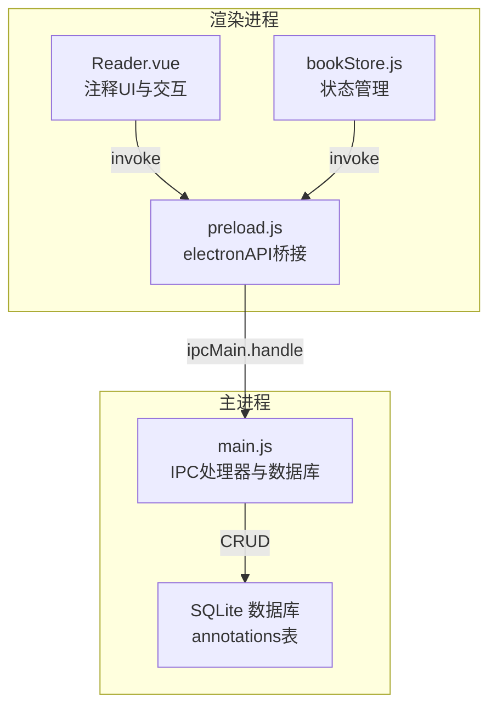
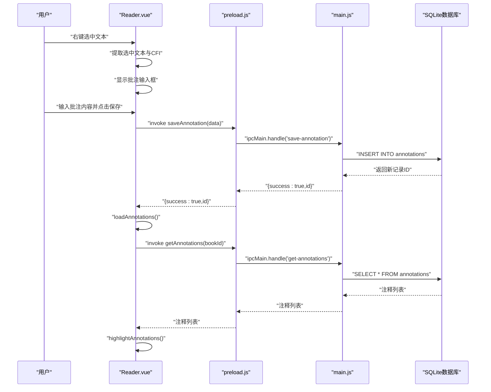
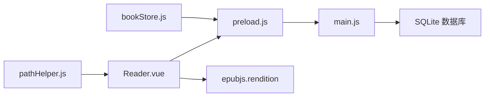
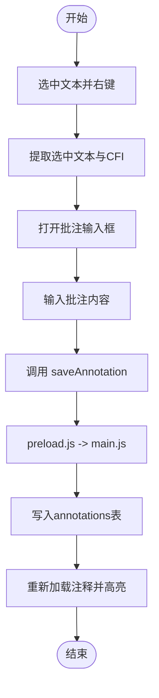

# 注释管理接口

<cite>
**本文档引用的文件**
- [README.md](file://README.md)
- [Reader.vue](file://src/components/Reader.vue)
- [bookStore.js](file://src/stores/bookStore.js)
- [main.js](file://electron/main.js)
- [preload.js](file://electron/preload.js)
- [DATA_STORAGE.md](file://docs/DATA_STORAGE.md)
- [pathHelper.js](file://src/utils/pathHelper.js)
</cite>

## 目录
1. [简介](#简介)
2. [项目结构](#项目结构)
3. [核心组件](#核心组件)
4. [架构总览](#架构总览)
5. [详细组件分析](#详细组件分析)
6. [依赖关系分析](#依赖关系分析)
7. [性能考虑](#性能考虑)
8. [故障排除指南](#故障排除指南)
9. [结论](#结论)
10. [附录](#附录)

## 简介
本文件面向ROSAA电子书阅读器的注释管理接口，系统性阐述批注功能相关的IPC接口设计与实现，包括：
- 保存注释：saveAnnotation
- 获取注释列表：getAnnotations
- 删除注释：deleteAnnotation
- 注释数据结构定义与字段说明
- 选中文本提取与CFI定位机制
- 注释内容存储与颜色标记处理
- 高亮显示、全文检索与注释导出机制
- 注释数据的版本管理与协作分享方案建议

本说明严格基于仓库现有代码实现，确保技术细节准确可靠。

## 项目结构
注释功能涉及前端Vue组件、状态管理、主进程IPC处理器与SQLite数据库四层协同：
- 前端Reader组件负责UI交互、选中文本提取、批注输入与高亮显示
- Pinia状态管理封装通用的IPC调用
- 预加载脚本暴露electronAPI给渲染进程
- 主进程注册IPC处理器，执行数据库操作
- SQLite数据库存储注释数据

图表来源
- [Reader.vue:514-562](file://src/components/Reader.vue#L514-L562)
- [bookStore.js:147-155](file://src/stores/bookStore.js#L147-L155)
- [preload.js:79-91](file://electron/preload.js#L79-L91)
- [main.js:710-760](file://electron/main.js#L710-L760)

章节来源
- [Reader.vue:1-1026](file://src/components/Reader.vue#L1-L1026)
- [bookStore.js:1-234](file://src/stores/bookStore.js#L1-L234)
- [preload.js:1-104](file://electron/preload.js#L1-L104)
- [main.js:1-922](file://electron/main.js#L1-L922)

## 核心组件
- Reader.vue：负责注释的UI交互、选中文本提取、批注输入、高亮显示与弹窗提示
- bookStore.js：封装通用的IPC调用，提供exportNotes导出能力
- preload.js：在window对象暴露electronAPI，统一渲染进程与主进程通信接口
- main.js：注册save-annotation、get-annotations、delete-annotation等IPC处理器，并执行数据库操作
- DATA_STORAGE.md：说明用户数据目录与数据库路径存储策略
- pathHelper.js：提供文件路径构建工具，支持开发与生产环境

章节来源
- [Reader.vue:118-139](file://src/components/Reader.vue#L118-L139)
- [bookStore.js:147-155](file://src/stores/bookStore.js#L147-L155)
- [preload.js:79-91](file://electron/preload.js#L79-L91)
- [main.js:710-760](file://electron/main.js#L710-L760)
- [DATA_STORAGE.md:1-42](file://docs/DATA_STORAGE.md#L1-L42)
- [pathHelper.js:1-63](file://src/utils/pathHelper.js#L1-L63)

## 架构总览
注释管理的端到端调用链路如下：
- 选中文本 → 右键菜单 → 提取选中文本与CFI → 打开批注输入框 → 保存批注 → IPC调用 → 主进程处理器 → 数据库写入 → 重新加载并高亮显示
- 获取注释 → IPC调用 → 主进程处理器 → 数据库查询 → 返回注释列表 → 渲染高亮
- 删除注释 → IPC调用 → 主进程处理器 → 数据库删除 → 重新加载并移除高亮

图表来源
- [Reader.vue:763-807](file://src/components/Reader.vue#L763-L807)
- [Reader.vue:974-1012](file://src/components/Reader.vue#L974-L1012)
- [Reader.vue:514-562](file://src/components/Reader.vue#L514-L562)
- [preload.js:80-87](file://electron/preload.js#L80-L87)
- [main.js:710-748](file://electron/main.js#L710-L748)

## 详细组件分析

### 注释数据模型与字段
注释数据存储于SQLite数据库的annotations表，字段定义如下：
- id：自增主键
- book_id：所属书籍ID（外键关联books）
- cfi：选中文本在EPUB中的定位信息（CFI）
- selected_text：选中的原文片段
- annotation：用户添加的批注内容
- color：高亮颜色，默认黄色
- created_at：创建时间
- updated_at：更新时间

章节来源
- [main.js:247-261](file://electron/main.js#L247-L261)

### 选中文本提取与CFI定位
- 右键菜单触发时，从window.getSelection或iframe.contentWindow.getSelection获取选中文本
- 通过rendition.getCFI或contents.cfiFromRange生成CFI，用于精确回溯定位
- 若CFI生成失败，将清空selectedCfi，避免无效定位

章节来源
- [Reader.vue:763-807](file://src/components/Reader.vue#L763-L807)
- [Reader.vue:809-939](file://src/components/Reader.vue#L809-L939)
- [Reader.vue:859-878](file://src/components/Reader.vue#L859-L878)

### 注释高亮显示机制
- 加载注释后，先清除已有高亮，再逐条添加高亮
- 使用rendition.annotations.add添加高亮，传入CFI、点击回调、CSS类与颜色样式
- 点击高亮时弹出包含原文与批注的提示框

章节来源
- [Reader.vue:529-562](file://src/components/Reader.vue#L529-L562)
- [Reader.vue:564-599](file://src/components/Reader.vue#L564-L599)

### 注释导出机制
- 通过bookStore.exportNotes调用preload.js的exportNotes
- 主进程查询annotations与bookmarks，按固定格式生成文本内容
- 弹出保存对话框，将内容写入目标文件

章节来源
- [bookStore.js:147-155](file://src/stores/bookStore.js#L147-L155)
- [preload.js:60-63](file://electron/preload.js#L60-L63)
- [main.js:533-592](file://electron/main.js#L533-L592)

### IPC接口定义与调用示例

#### saveAnnotation（保存注释）
- 前端调用：Reader.vue在保存批注时调用window.electronAPI.saveAnnotation
- 参数结构：bookId、cfi、selectedText、annotation、color
- 主进程处理：插入annotations表，返回{success:true,id}

调用示例（路径参考）
- [Reader.vue:974-1012](file://src/components/Reader.vue#L974-L1012)
- [preload.js:80-83](file://electron/preload.js#L80-L83)
- [main.js:710-731](file://electron/main.js#L710-L731)

章节来源
- [Reader.vue:974-1012](file://src/components/Reader.vue#L974-L1012)
- [preload.js:80-83](file://electron/preload.js#L80-L83)
- [main.js:710-731](file://electron/main.js#L710-L731)

#### getAnnotations（获取注释列表）
- 前端调用：Reader.vue在初始化与保存后调用window.electronAPI.getAnnotations
- 参数：bookId
- 主进程处理：按创建时间升序查询annotations表

调用示例（路径参考）
- [Reader.vue:514-527](file://src/components/Reader.vue#L514-L527)
- [preload.js:84-87](file://electron/preload.js#L84-L87)
- [main.js:733-748](file://electron/main.js#L733-L748)

章节来源
- [Reader.vue:514-527](file://src/components/Reader.vue#L514-L527)
- [preload.js:84-87](file://electron/preload.js#L84-L87)
- [main.js:733-748](file://electron/main.js#L733-L748)

#### deleteAnnotation（删除注释）
- 前端调用：通过preload.js的deleteAnnotation触发
- 参数：annotationId
- 主进程处理：删除annotations表对应记录

调用示例（路径参考）
- [Reader.vue:1014-1024](file://src/components/Reader.vue#L1014-L1024)
- [preload.js:88-91](file://electron/preload.js#L88-L91)
- [main.js:750-760](file://electron/main.js#L750-L760)

章节来源
- [Reader.vue:1014-1024](file://src/components/Reader.vue#L1014-L1024)
- [preload.js:88-91](file://electron/preload.js#L88-L91)
- [main.js:750-760](file://electron/main.js#L750-L760)

### 注释颜色标记处理
- 高亮颜色通过fill属性传递，若未指定则使用默认黄色
- mix-blend-mode与fill-opacity控制高亮透明度与混合模式

章节来源
- [Reader.vue:550-556](file://src/components/Reader.vue#L550-L556)

### 全文检索与注释导出
- 当前实现未提供全文检索功能；注释导出为文本格式，包含原文与批注内容及时间戳
- 若需全文检索，可在主进程扩展SQL查询条件或引入全文索引

章节来源
- [main.js:533-592](file://electron/main.js#L533-L592)

### 版本管理与协作分享方案
- 数据库版本：通过PRAGMA与DDL迁移管理（如新增列）
- 协作分享：建议在应用层面增加注释共享开关与权限控制；导出为标准格式便于跨平台分享

章节来源
- [main.js:209-219](file://electron/main.js#L209-L219)
- [main.js:274-282](file://electron/main.js#L274-L282)

## 依赖关系分析
- Reader.vue依赖epubjs的rendition进行CFI定位与高亮
- Reader.vue通过preload.js调用saveAnnotation/getAnnotations/deleteAnnotation
- bookStore.js封装exportNotes导出能力
- main.js注册IPC处理器并操作SQLite数据库
- pathHelper.js提供路径构建工具，确保开发与生产环境一致

图表来源
- [Reader.vue:164-165](file://src/components/Reader.vue#L164-L165)
- [preload.js:1-104](file://electron/preload.js#L1-L104)
- [main.js:1-922](file://electron/main.js#L1-L922)
- [bookStore.js:1-234](file://src/stores/bookStore.js#L1-L234)
- [pathHelper.js:1-63](file://src/utils/pathHelper.js#L1-L63)

章节来源
- [Reader.vue:161-166](file://src/components/Reader.vue#L161-L166)
- [bookStore.js:1-234](file://src/stores/bookStore.js#L1-L234)
- [preload.js:1-104](file://electron/preload.js#L1-L104)
- [main.js:1-922](file://electron/main.js#L1-L922)
- [pathHelper.js:1-63](file://src/utils/pathHelper.js#L1-L63)

## 性能考虑
- 注释高亮批量添加：先remove再逐条add，避免重复叠加
- CFI生成与iframe监听：采用重试机制，确保在EPUB渲染完成后再绑定事件
- 数据库写入：使用事务与唯一约束，减少冲突与重复
- 导出：一次性生成文本内容，避免多次IO

章节来源
- [Reader.vue:535-562](file://src/components/Reader.vue#L535-L562)
- [Reader.vue:810-939](file://src/components/Reader.vue#L810-L939)
- [main.js:710-731](file://electron/main.js#L710-L731)

## 故障排除指南
- 右键菜单不显示：检查iframe是否加载完成，确认contentDocument可访问
- CFI为空：确认选中范围有效，必要时降级处理
- 高亮不生效：确认CFI正确且注释列表加载完成
- 导出失败：检查文件写入权限与保存路径

章节来源
- [Reader.vue:810-939](file://src/components/Reader.vue#L810-L939)
- [Reader.vue:529-562](file://src/components/Reader.vue#L529-L562)
- [main.js:533-592](file://electron/main.js#L533-L592)

## 结论
ROSAA电子书阅读器的注释管理接口以清晰的分层架构实现，从前端交互到数据库持久化形成完整闭环。通过CFI定位与高亮显示，用户可直观地管理批注；通过导出功能，实现注释的跨平台分享。未来可在全文检索与协作分享方面进一步增强，以满足更复杂的使用场景。

## 附录

### 注释数据结构字段说明
- id：注释唯一标识
- book_id：书籍ID
- cfi：EPUB定位信息
- selected_text：选中文本
- annotation：批注内容
- color：高亮颜色
- created_at/updated_at：时间戳

章节来源
- [main.js:247-261](file://electron/main.js#L247-L261)

### 调用流程图（保存注释）

图表来源
- [Reader.vue:763-807](file://src/components/Reader.vue#L763-L807)
- [Reader.vue:974-1012](file://src/components/Reader.vue#L974-L1012)
- [preload.js:80-83](file://electron/preload.js#L80-L83)
- [main.js:710-731](file://electron/main.js#L710-L731)