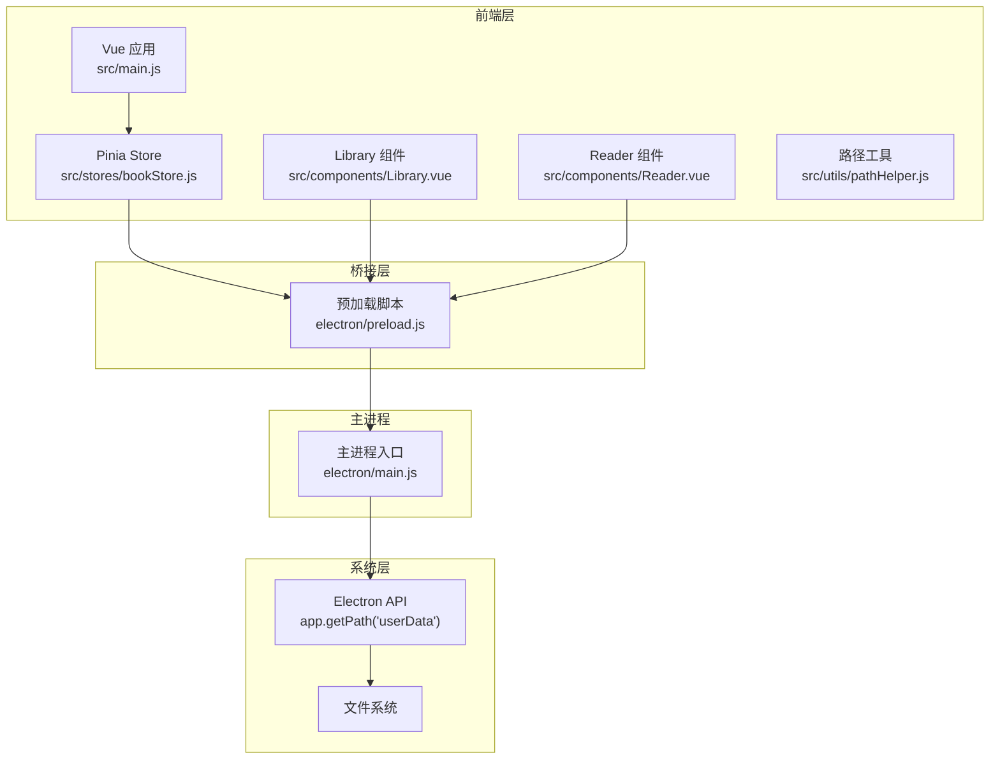
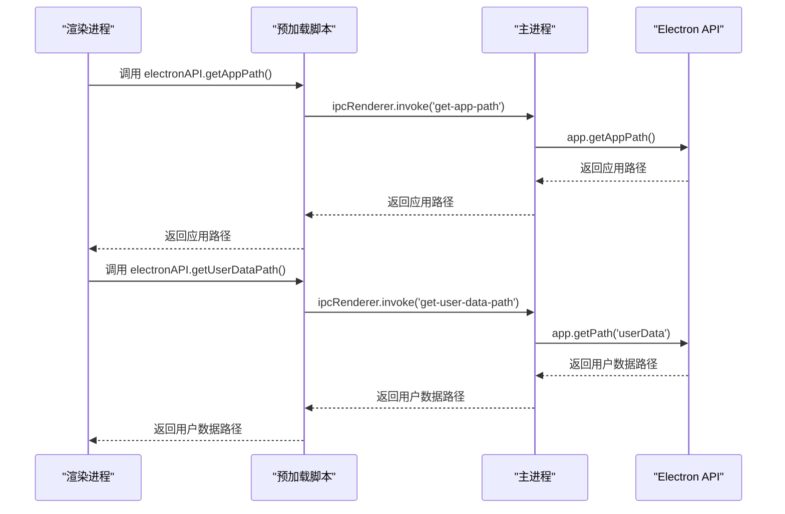
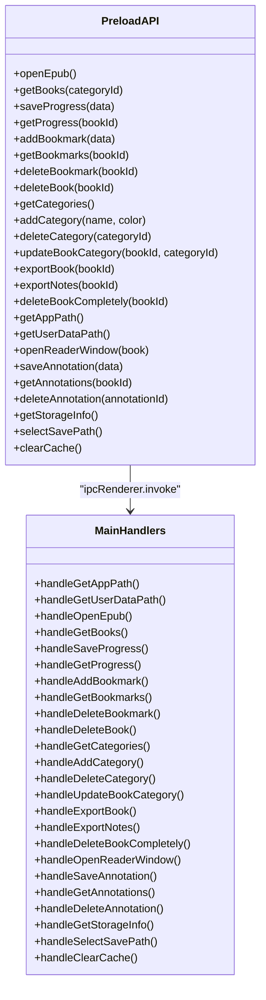
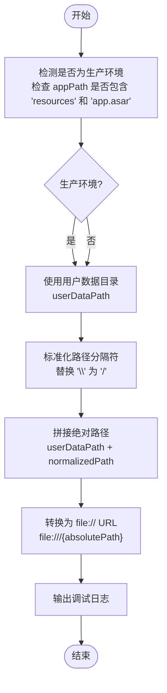
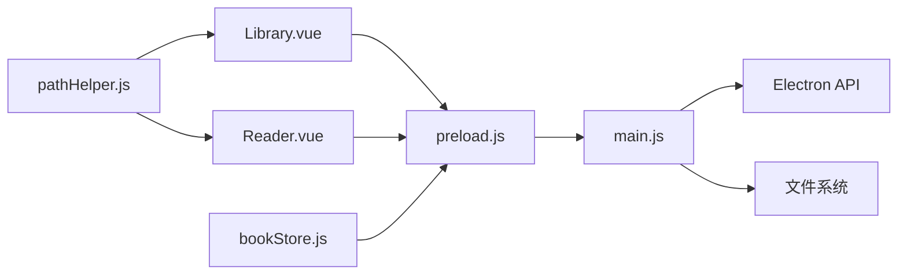

# 系统信息接口

<cite>
**本文档引用的文件**
- [electron/main.js](file://electron/main.js)
- [electron/preload.js](file://electron/preload.js)
- [src/utils/pathHelper.js](file://src/utils/pathHelper.js)
- [src/components/Library.vue](file://src/components/Library.vue)
- [src/components/Reader.vue](file://src/components/Reader.vue)
- [src/stores/bookStore.js](file://src/stores/bookStore.js)
- [docs/PATH_COMPATIBILITY.md](file://docs/PATH_COMPATIBILITY.md)
- [package.json](file://package.json)
</cite>

## 目录
1. [简介](#简介)
2. [项目结构](#项目结构)
3. [核心组件](#核心组件)
4. [架构总览](#架构总览)
5. [详细组件分析](#详细组件分析)
6. [依赖关系分析](#依赖关系分析)
7. [性能考虑](#性能考虑)
8. [故障排除指南](#故障排除指南)
9. [结论](#结论)
10. [附录](#附录)

## 简介
本文件面向ROSAA电子书阅读器的系统信息接口，重点说明应用系统信息相关的IPC接口，包括获取应用路径和用户数据路径等接口。文档将深入解析路径获取机制、跨平台兼容性处理、权限检查流程，并提供完整的调用示例，展示如何在应用启动时正确初始化文件系统。同时涵盖路径缓存策略、异常处理和安全防护措施，并包含应用升级、数据迁移和故障诊断的相关接口说明。

## 项目结构
该应用采用Electron + Vue 3的前端渲染架构，系统信息接口主要分布在主进程、预加载脚本和前端组件之间，形成清晰的IPC调用链路。

**图表来源**
- [electron/main.js:1-922](file://electron/main.js#L1-L922)
- [electron/preload.js:1-104](file://electron/preload.js#L1-L104)
- [src/utils/pathHelper.js:1-63](file://src/utils/pathHelper.js#L1-L63)
- [src/stores/bookStore.js:1-234](file://src/stores/bookStore.js#L1-L234)

**章节来源**
- [electron/main.js:1-922](file://electron/main.js#L1-L922)
- [electron/preload.js:1-104](file://electron/preload.js#L1-L104)
- [src/utils/pathHelper.js:1-63](file://src/utils/pathHelper.js#L1-L63)
- [src/stores/bookStore.js:1-234](file://src/stores/bookStore.js#L1-L234)

## 核心组件
- 系统信息IPC接口：提供获取应用路径和用户数据路径的能力，供前端组件在运行时查询。
- 路径工具：负责将相对路径标准化并转换为可访问的file:// URL，支持开发与生产环境的统一处理。
- 前端组件：在应用启动时通过IPC接口获取系统信息，用于初始化文件系统和构建资源访问路径。
- 预加载脚本：作为安全桥接层，暴露受控的IPC接口给渲染进程，避免直接访问Node.js能力。

**章节来源**
- [electron/main.js:762-769](file://electron/main.js#L762-L769)
- [electron/preload.js:68-75](file://electron/preload.js#L68-L75)
- [src/utils/pathHelper.js:13-53](file://src/utils/pathHelper.js#L13-L53)

## 架构总览
系统信息接口的调用流程遵循“渲染进程 -> 预加载脚本 -> 主进程”的单向信任链，确保安全性的同时提供必要的系统信息。

**图表来源**
- [electron/preload.js:68-75](file://electron/preload.js#L68-L75)
- [electron/main.js:762-769](file://electron/main.js#L762-L769)

## 详细组件分析

### 系统信息IPC接口
- 接口定义
  - getAppPath：返回Electron应用的程序路径，用于判断开发/生产环境。
  - getUserDataPath：返回用户数据目录路径，用于统一存储用户文件。
- 实现位置
  - 主进程：在主进程中注册ipcMain.handle处理器，直接调用Electron API。
  - 预加载脚本：在预加载脚本中通过contextBridge.exposeInMainWorld暴露electronAPI对象，封装IPC调用。
  - 渲染进程：前端组件通过window.electronAPI调用上述接口。
- 跨平台兼容性
  - Electron的app.getPath('userData')在不同平台返回不同的用户数据目录，确保路径符合各平台规范。
  - 路径工具对路径分隔符进行标准化，保证在Windows和Unix风格路径下的兼容性。

**图表来源**
- [electron/preload.js:7-101](file://electron/preload.js#L7-L101)
- [electron/main.js:343-921](file://electron/main.js#L343-L921)

**章节来源**
- [electron/main.js:762-769](file://electron/main.js#L762-L769)
- [electron/preload.js:68-75](file://electron/preload.js#L68-L75)

### 路径获取机制与跨平台兼容
- 路径标准化
  - 路径工具会将反斜杠替换为正斜杠，确保跨平台一致性。
  - 对于生产环境（打包后），通过检测appPath是否包含特定字符串来判断是否处于asar包内。
- 统一存储策略
  - 所有用户上传的文件（EPUB书籍、封面图片）均保存在用户数据目录下，数据库中存储相对路径。
  - 这种设计确保开发与生产环境使用相同的路径构建逻辑，避免因路径差异导致的资源访问失败。
- 资源访问URL
  - 将相对路径与用户数据目录拼接后转换为file:// URL，供前端组件直接访问本地文件。

**图表来源**
- [src/utils/pathHelper.js:13-53](file://src/utils/pathHelper.js#L13-L53)
- [docs/PATH_COMPATIBILITY.md:41-78](file://docs/PATH_COMPATIBILITY.md#L41-L78)

**章节来源**
- [src/utils/pathHelper.js:13-53](file://src/utils/pathHelper.js#L13-L53)
- [docs/PATH_COMPATIBILITY.md:116-131](file://docs/PATH_COMPATIBILITY.md#L116-L131)

### 权限检查与安全防护
- 预加载脚本的安全边界
  - 通过contextBridge.exposeInMainWorld仅暴露受控的electronAPI接口，避免渲染进程直接访问Node.js能力。
  - 所有IPC调用均通过ipcRenderer.invoke进行，确保调用栈清晰且可审计。
- 文件系统访问控制
  - 主进程在执行文件操作前，通常会进行存在性检查和权限验证，防止非法路径访问。
  - 对于用户数据目录的写入，确保路径位于用户数据目录内，避免越权写入系统目录。
- 异常处理
  - 主进程的IPC处理器对异常进行捕获并返回结构化的错误信息，前端组件据此进行降级处理或提示用户。

**章节来源**
- [electron/preload.js:1-104](file://electron/preload.js#L1-L104)
- [electron/main.js:343-921](file://electron/main.js#L343-L921)

### 应用启动时的文件系统初始化
- 初始化步骤
  - 应用启动时，前端组件通过electronAPI获取应用路径和用户数据路径。
  - 使用路径工具将数据库中存储的相对路径转换为可访问的file:// URL。
  - 在开发环境中，路径工具会统一使用用户数据目录，确保与生产环境一致。
- 调用示例（路径参考）
  - 获取应用路径：window.electronAPI.getAppPath()
  - 获取用户数据路径：window.electronAPI.getUserDataPath()
  - 构建封面URL：buildFileUrl(book.cover_path, userDataPath, appPath)
  - 构建书籍URL：buildFileUrl(book.book_path, userDataPath, appPath)

**章节来源**
- [src/components/Reader.vue:161-200](file://src/components/Reader.vue#L161-L200)
- [docs/PATH_COMPATIBILITY.md:98-114](file://docs/PATH_COMPATIBILITY.md#L98-L114)

### 路径缓存策略
- 前端缓存
  - 前端组件在首次获取到用户数据路径后，将其缓存在响应式状态中，避免重复IPC调用。
  - 当用户切换分类或重新加载书籍时，优先使用缓存路径，必要时再刷新。
- 主进程缓存
  - 主进程在应用启动时初始化数据库和目录结构，后续IPC请求直接基于已存在的路径进行操作。
- 缓存失效与更新
  - 当用户选择新的保存路径或清理缓存时，前端组件会重新拉取系统信息并更新缓存。
  - 数据库中的路径信息保持相对路径，确保跨版本升级时仍能正确解析。

**章节来源**
- [src/stores/bookStore.js:12-22](file://src/stores/bookStore.js#L12-L22)
- [src/components/Library.vue:101-131](file://src/components/Library.vue#L101-L131)

### 异常处理与错误恢复
- IPC调用异常
  - 预加载脚本对IPC调用进行包装，捕获异常并向渲染进程返回错误信息。
  - 前端组件根据返回结果进行用户提示或自动重试。
- 文件系统异常
  - 主进程在执行文件操作时进行存在性检查和权限验证，失败时返回结构化错误。
  - 对于数据库操作，采用事务和回滚机制，确保数据一致性。
- 日志与诊断
  - 路径工具在构建URL时输出详细日志，便于定位路径问题。
  - 存储信息接口提供磁盘剩余空间、图书文件占用和缓存大小等指标，辅助诊断存储问题。

**章节来源**
- [src/utils/pathHelper.js:43-50](file://src/utils/pathHelper.js#L43-L50)
- [electron/main.js:821-881](file://electron/main.js#L821-L881)

### 应用升级、数据迁移与故障诊断
- 升级策略
  - 用户数据目录在应用更新时保持不变，确保用户文件不被覆盖或丢失。
  - 数据库schema在运行时动态检查并迁移，新增列或索引时自动处理。
- 数据迁移
  - 对于新增字段（如file_hash），主进程会在启动时检查并添加，避免破坏现有数据。
  - 分类表的外键关联在首次添加时建立，确保历史数据的完整性。
- 故障诊断
  - 存储信息接口提供磁盘剩余空间、图书文件占用和缓存大小等指标。
  - 清理缓存接口支持主动清理WAL和SHM文件，释放磁盘空间并重置数据库状态。
  - 选择保存路径接口允许用户自定义文件保存位置，便于排查路径问题。

**章节来源**
- [docs/PATH_COMPATIBILITY.md:163-167](file://docs/PATH_COMPATIBILITY.md#L163-L167)
- [electron/main.js:167-284](file://electron/main.js#L167-L284)
- [electron/main.js:821-921](file://electron/main.js#L821-L921)

## 依赖关系分析
系统信息接口的依赖关系清晰，主进程负责系统信息的提供，预加载脚本负责安全桥接，前端组件负责业务逻辑。

**图表来源**
- [electron/preload.js:1-104](file://electron/preload.js#L1-L104)
- [electron/main.js:1-922](file://electron/main.js#L1-L922)
- [src/utils/pathHelper.js:1-63](file://src/utils/pathHelper.js#L1-L63)

**章节来源**
- [electron/main.js:1-922](file://electron/main.js#L1-L922)
- [electron/preload.js:1-104](file://electron/preload.js#L1-L104)
- [src/utils/pathHelper.js:1-63](file://src/utils/pathHelper.js#L1-L63)

## 性能考虑
- IPC调用优化
  - 预加载脚本对常用接口进行封装，减少重复IPC调用次数。
  - 前端组件在短时间内多次访问同一系统信息时，优先使用缓存。
- 文件系统访问
  - 路径工具在开发与生产环境使用统一逻辑，避免不必要的路径转换开销。
  - 数据库存储相对路径，减少绝对路径解析的复杂度。
- 存储管理
  - 存储信息接口按需计算目录大小，避免全量扫描带来的性能损耗。
  - 清理缓存时仅删除必要的WAL和SHM文件，最小化I/O影响。

## 故障排除指南
- 无法获取系统信息
  - 检查预加载脚本是否正确暴露electronAPI对象。
  - 确认主进程已注册相应的IPC处理器。
- 路径构建失败
  - 查看路径工具的日志输出，确认relativePath、userDataPath和appPath参数。
  - 确保路径分隔符已被正确标准化。
- 文件访问异常
  - 检查用户数据目录是否存在且具有读写权限。
  - 确认数据库中的相对路径与实际文件位置一致。
- 存储空间不足
  - 使用存储信息接口查看磁盘剩余空间和图书文件占用。
  - 通过清理缓存接口释放空间，或调整保存路径。

**章节来源**
- [src/utils/pathHelper.js:43-50](file://src/utils/pathHelper.js#L43-L50)
- [electron/main.js:821-921](file://electron/main.js#L821-L921)

## 结论
ROSAA电子书阅读器的系统信息接口通过清晰的IPC架构实现了安全、可靠的系统信息获取。路径工具与跨平台兼容性设计确保了开发与生产环境的一致性，而完善的异常处理与安全防护机制则保障了应用的稳定性。结合存储管理与故障诊断接口，系统能够在升级和迁移过程中保持数据完整性，并为用户提供便捷的维护手段。

## 附录
- 相关文档
  - 路径兼容性说明：[docs/PATH_COMPATIBILITY.md](file://docs/PATH_COMPATIBILITY.md)
- 构建与发布
  - 应用入口：[package.json](file://package.json)
  - 主进程入口：[electron/main.js](file://electron/main.js)