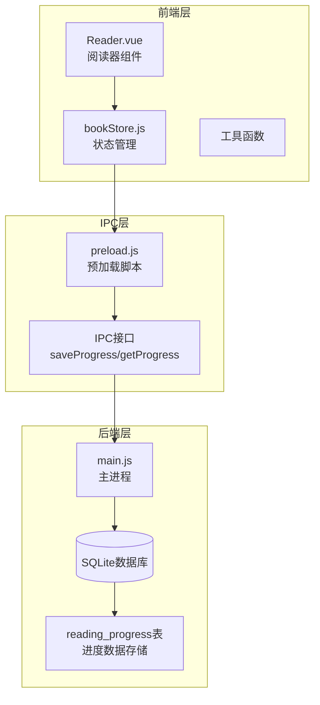
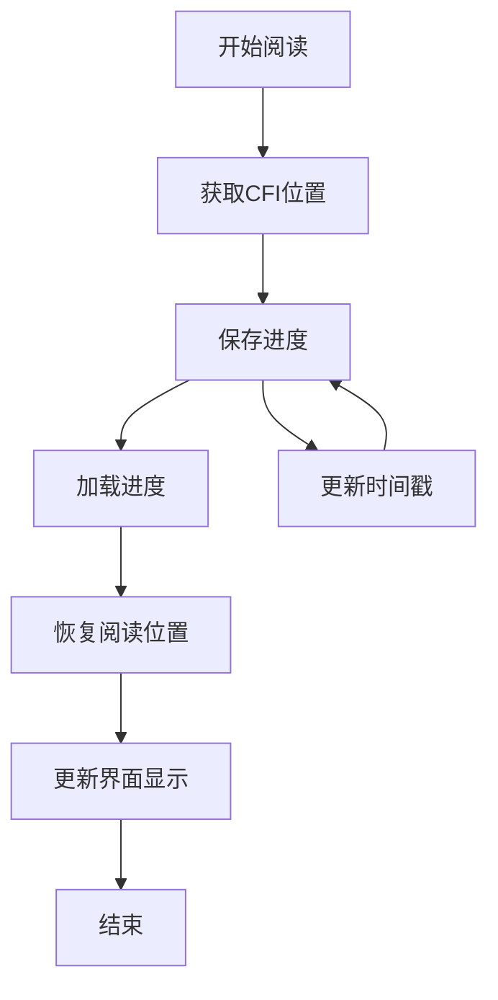
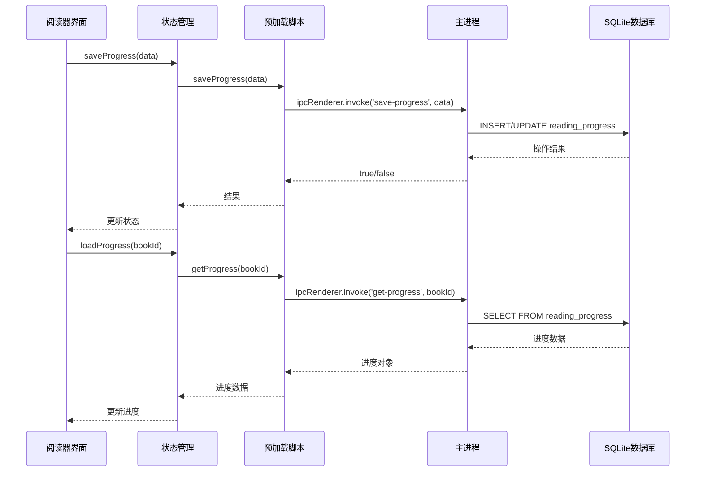
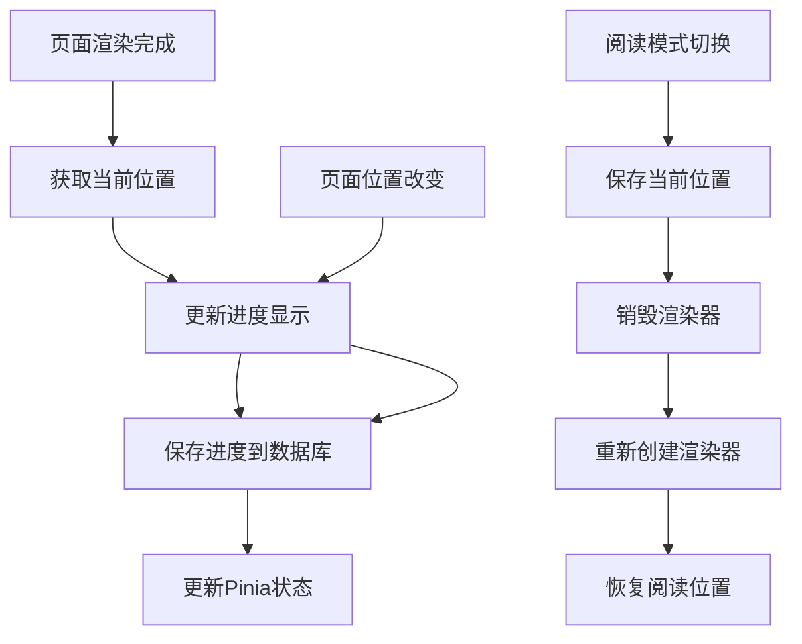
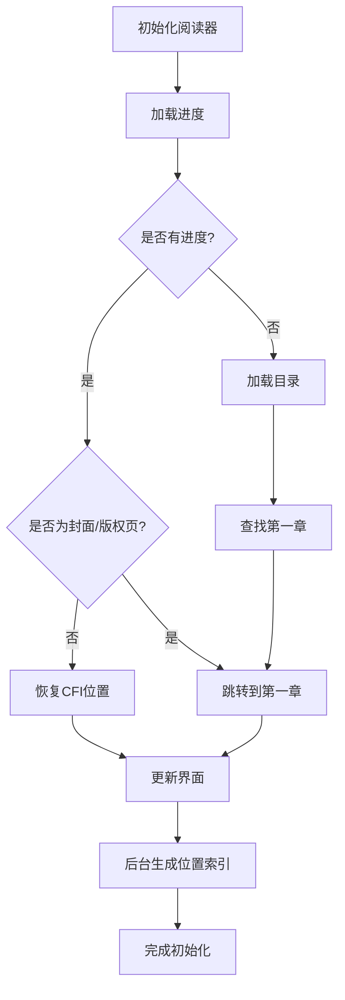
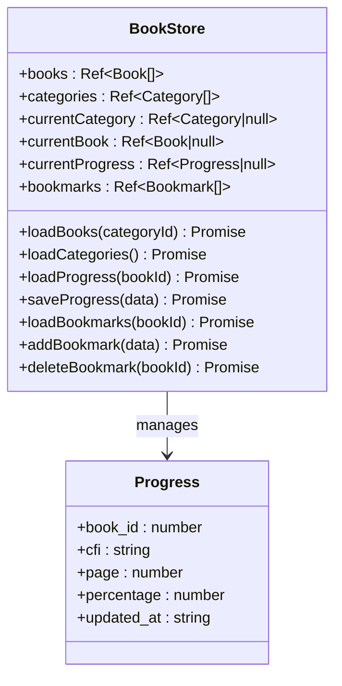
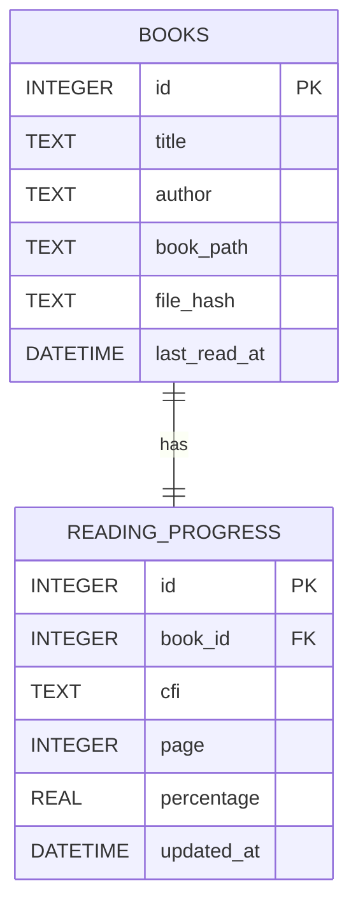
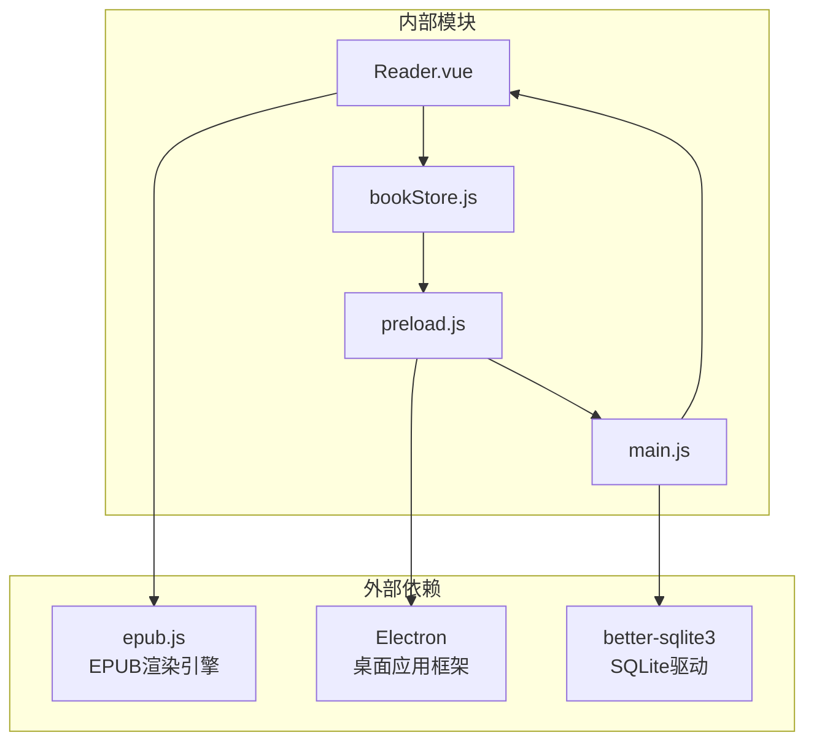
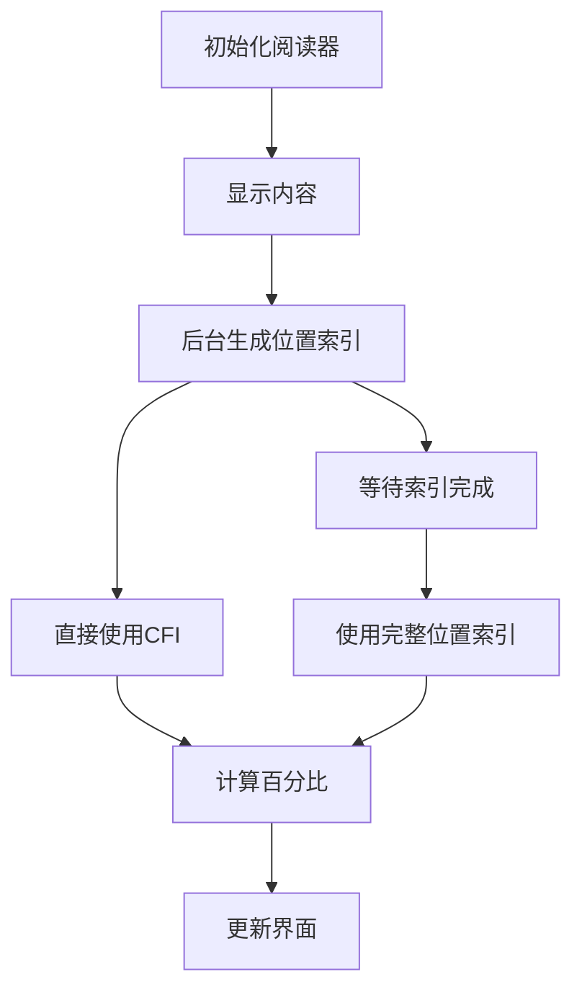

# 进度管理接口

<cite>
**本文档引用的文件**
- [Reader.vue](file://src/components/Reader.vue)
- [bookStore.js](file://src/stores/bookStore.js)
- [main.js](file://electron/main.js)
- [preload.js](file://electron/preload.js)
- [DATA_STORAGE.md](file://docs/DATA_STORAGE.md)
</cite>

## 目录
1. [简介](#简介)
2. [项目结构](#项目结构)
3. [核心组件](#核心组件)
4. [架构概览](#架构概览)
5. [详细组件分析](#详细组件分析)
6. [依赖关系分析](#依赖关系分析)
7. [性能考虑](#性能考虑)
8. [故障排除指南](#故障排除指南)
9. [结论](#结论)

## 简介

ROSAA电子书阅读器的进度管理接口是一个完整的IPC（进程间通信）系统，负责处理EPUB书籍的阅读进度跟踪、保存和恢复。该系统基于Electron框架，采用Vue.js前端界面和SQLite数据库后端，实现了断点续读功能，支持CFI（Canonical Fragment Identifier）位置编码、百分比计算和时间戳处理。

## 项目结构

进度管理系统涉及以下关键文件和模块：

**图表来源**
- [Reader.vue:161-234](file://src/components/Reader.vue#L161-L234)
- [bookStore.js:161-176](file://src/stores/bookStore.js#L161-L176)
- [preload.js:7-23](file://electron/preload.js#L7-L23)
- [main.js:634-663](file://electron/main.js#L634-L663)

**章节来源**
- [Reader.vue:1-1026](file://src/components/Reader.vue#L1-L1026)
- [bookStore.js:1-234](file://src/stores/bookStore.js#L1-L234)
- [main.js:167-284](file://electron/main.js#L167-L284)

## 核心组件

### 进度数据结构定义

进度管理系统的核心数据结构如下：

| 字段名 | 类型 | 描述 | 必填 |
|--------|------|------|------|
| book_id | INTEGER | 书籍ID（外键） | 是 |
| cfi | TEXT | CFI位置编码 | 否 |
| page | INTEGER | 当前页码 | 否 |
| percentage | REAL | 阅读百分比 | 否 |
| updated_at | DATETIME | 更新时间戳 | 否 |

### CFI位置编码系统

CFI（Canonical Fragment Identifier）是EPUB标准中定义的唯一位置标识符，用于精确定位文档中的特定位置：

**图表来源**
- [Reader.vue:344-361](file://src/components/Reader.vue#L344-L361)
- [Reader.vue:497-507](file://src/components/Reader.vue#L497-L507)

**章节来源**
- [Reader.vue:440-495](file://src/components/Reader.vue#L440-L495)
- [Reader.vue:344-417](file://src/components/Reader.vue#L344-L417)

## 架构概览

进度管理系统的整体架构采用分层设计：

**图表来源**
- [bookStore.js:169-176](file://src/stores/bookStore.js#L169-L176)
- [preload.js:16-23](file://electron/preload.js#L16-L23)
- [main.js:634-663](file://electron/main.js#L634-L663)

## 详细组件分析

### Reader组件进度管理

Reader组件是进度管理的核心实现者，负责：

#### 进度保存机制

**图表来源**
- [Reader.vue:310-326](file://src/components/Reader.vue#L310-L326)
- [Reader.vue:497-507](file://src/components/Reader.vue#L497-L507)

#### 进度恢复算法

Reader组件实现了智能的进度恢复算法：

**图表来源**
- [Reader.vue:344-417](file://src/components/Reader.vue#L344-L417)

**章节来源**
- [Reader.vue:310-417](file://src/components/Reader.vue#L310-L417)

### Pinia状态管理

bookStore.js提供了集中式的进度状态管理：

#### 进度状态管理

**图表来源**
- [bookStore.js:4-234](file://src/stores/bookStore.js#L4-L234)

**章节来源**
- [bookStore.js:161-176](file://src/stores/bookStore.js#L161-L176)

### IPC接口实现

#### saveProgress接口

saveProgress接口负责保存用户的阅读进度：

**接口定义**
- **名称**: save-progress
- **类型**: ipcMain.handle
- **参数**: `{ bookId: number, cfi: string, page: number, percentage: number }`
- **返回值**: `boolean`

**实现细节**
- 使用SQLite的ON CONFLICT子句进行UPSERT操作
- 自动更新书籍的last_read_at字段
- 支持并发访问的安全性

#### getProgress接口

getProgress接口负责获取用户的阅读进度：

**接口定义**
- **名称**: get-progress
- **类型**: ipcMain.handle
- **参数**: `bookId: number`
- **返回值**: `Progress | null`

**实现细节**
- 返回完整的进度对象或null
- 支持无进度时的优雅降级

**章节来源**
- [main.js:634-663](file://electron/main.js#L634-L663)
- [preload.js:16-23](file://electron/preload.js#L16-L23)

### 数据库设计

#### reading_progress表结构

**图表来源**
- [main.js:221-232](file://electron/main.js#L221-L232)

**章节来源**
- [main.js:221-232](file://electron/main.js#L221-L232)

## 依赖关系分析

进度管理系统的依赖关系如下：

**图表来源**
- [Reader.vue:164](file://src/components/Reader.vue#L164)
- [main.js:5](file://electron/main.js#L5)

**章节来源**
- [Reader.vue:161-166](file://src/components/Reader.vue#L161-L166)
- [main.js:1-10](file://electron/main.js#L1-L10)

## 性能考虑

### 位置索引生成优化

系统采用了异步位置索引生成策略：

**图表来源**
- [Reader.vue:427-438](file://src/components/Reader.vue#L427-L438)

### 并发访问处理

系统通过以下机制处理并发访问：

1. **SQLite WAL模式**: 提高并发读写性能
2. **事务管理**: 确保数据一致性
3. **防抖处理**: 避免频繁的进度保存操作

**章节来源**
- [main.js:185-187](file://electron/main.js#L185-L187)
- [Reader.vue:497-507](file://src/components/Reader.vue#L497-L507)

## 故障排除指南

### 常见问题及解决方案

#### 进度无法保存

**症状**: 阅读进度在重启后丢失

**可能原因**:
1. 数据库连接异常
2. IPC通信失败
3. CFI位置无效

**解决步骤**:
1. 检查数据库连接状态
2. 验证IPC接口调用
3. 确认CFI格式正确

#### 进度恢复失败

**症状**: 无法从上次位置继续阅读

**可能原因**:
1. CFI位置已失效
2. 书籍内容结构改变
3. 数据库损坏

**解决步骤**:
1. 检查书籍完整性
2. 重新生成位置索引
3. 清理损坏的进度数据

#### 百分比计算异常

**症状**: 进度百分比显示不正确

**可能原因**:
1. 位置索引未生成
2. 阅读模式切换
3. 页面布局变化

**解决步骤**:
1. 等待位置索引生成完成
2. 重新计算百分比
3. 检查阅读模式兼容性

**章节来源**
- [Reader.vue:440-495](file://src/components/Reader.vue#L440-L495)
- [main.js:634-663](file://electron/main.js#L634-L663)

## 结论

ROSAA电子书阅读器的进度管理接口是一个设计完善的IPC系统，具有以下特点：

1. **完整的生命周期管理**: 从进度保存到恢复的全流程覆盖
2. **CFI位置编码**: 基于EPUB标准的精确位置定位
3. **多模式支持**: 同时支持翻页和滚动两种阅读模式
4. **性能优化**: 异步处理和缓存机制提升用户体验
5. **数据安全**: SQLite数据库保证数据持久性和一致性

该系统为用户提供了可靠的断点续读体验，是现代电子书阅读器的重要功能基础。