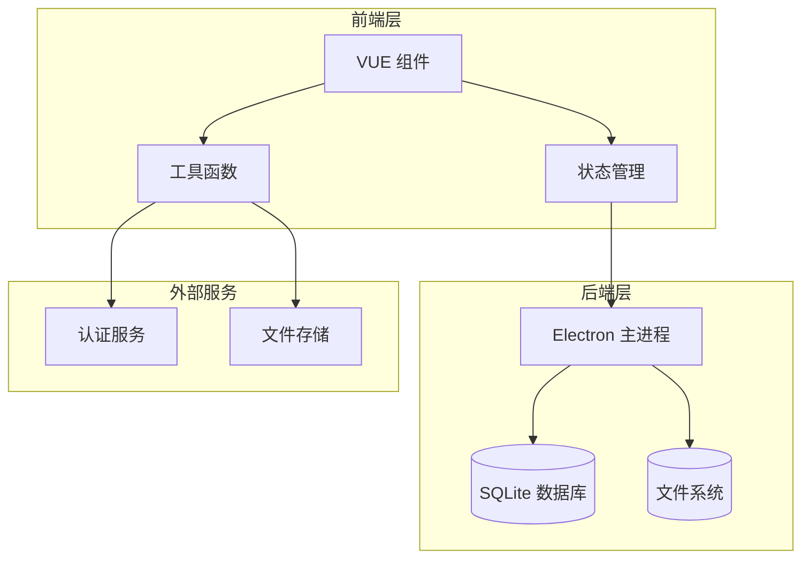
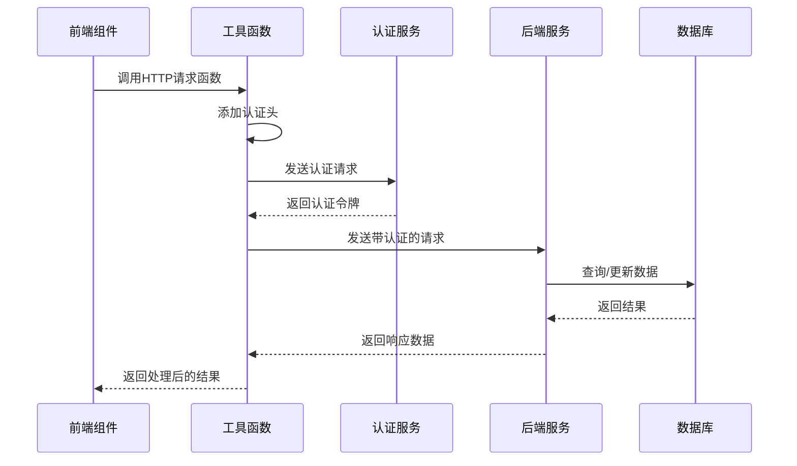
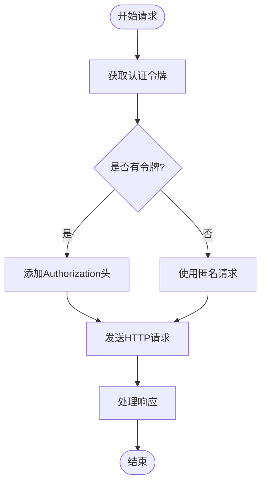
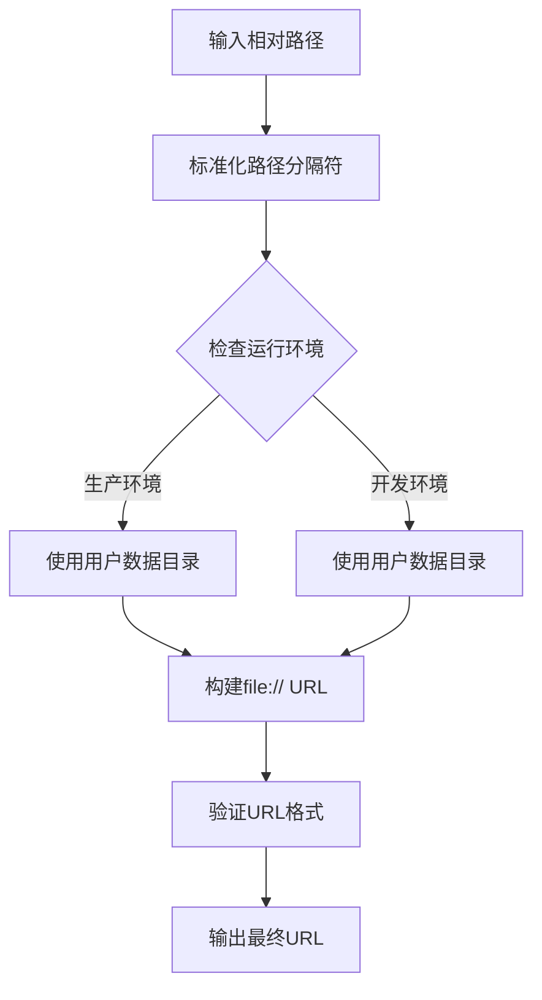
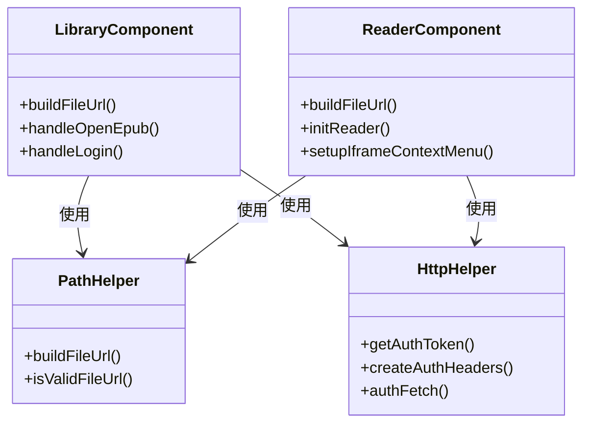
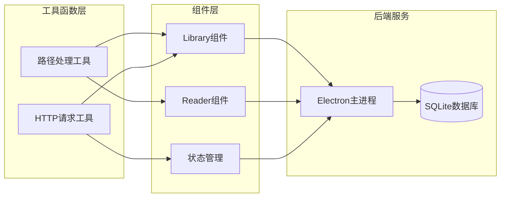

# 工具函数API

<cite>
**本文档引用的文件**
- [httpHelper.js](file://src/utils/httpHelper.js)
- [pathHelper.js](file://src/utils/pathHelper.js)
- [Library.vue](file://src/components/Library.vue)
- [Reader.vue](file://src/components/Reader.vue)
- [bookStore.js](file://src/stores/bookStore.js)
- [main.js](file://electron/main.js)
- [preload.js](file://electron/preload.js)
- [README.md](file://README.md)
</cite>

## 目录
1. [简介](#简介)
2. [项目结构](#项目结构)
3. [核心组件](#核心组件)
4. [架构概览](#架构概览)
5. [详细组件分析](#详细组件分析)
6. [依赖关系分析](#依赖关系分析)
7. [性能考虑](#性能考虑)
8. [故障排除指南](#故障排除指南)
9. [结论](#结论)

## 简介

ROSAA电子书阅读器是一个基于Electron + Vue 3 + SQLite的现代化EPUB电子书阅读器桌面应用。本文档专注于工具函数API的详细说明，包括HTTP请求封装函数、路径处理工具函数以及其他辅助函数的接口定义、参数规范和返回值格式。

## 项目结构

该项目采用前后端分离的架构设计：

**图表来源**
- [Library.vue:1-1292](file://src/components/Library.vue#L1-L1292)
- [Reader.vue:1-1026](file://src/components/Reader.vue#L1-L1026)
- [main.js:1-820](file://electron/main.js#L1-L820)

**章节来源**
- [README.md:167-193](file://README.md#L167-L193)

## 核心组件

### HTTP请求工具函数

HTTP请求工具函数提供统一的认证处理和请求封装，支持自动添加认证令牌和自定义请求头。

#### getAuthToken() - 获取认证令牌
- **功能**: 从localStorage中获取存储的认证令牌
- **参数**: 无
- **返回值**: 字符串类型的认证令牌或null
- **使用场景**: 在需要认证的API调用前获取令牌

#### createAuthHeaders(options) - 创建认证请求头
- **功能**: 创建包含认证信息的请求配置对象
- **参数**: 
  - options(Object): fetch选项对象，可包含headers属性
- **返回值**: 包含认证头的配置对象
- **认证机制**: 自动添加Authorization头，格式为Bearer token

#### authFetch(url, options) - 带认证的fetch请求
- **功能**: 发送带认证信息的HTTP请求
- **参数**:
  - url(String): 请求的URL地址
  - options(Object): fetch选项，如headers、method、body等
- **返回值**: Promise<Response> - fetch响应对象
- **错误处理**: 支持标准的fetch错误处理机制

### 路径处理工具函数

路径处理工具函数专门处理Electron应用中的文件路径转换，确保开发和生产环境的一致性。

#### buildFileUrl(relativePath, userDataPath, appPath) - 构建文件URL
- **功能**: 将相对路径转换为完整的file:// URL
- **参数**:
  - relativePath(String): 相对路径（如'upload/covers/cover_xxx.jpg'）
  - userDataPath(String): 用户数据目录路径
  - appPath(String): 应用路径（开发环境使用）
- **返回值**: String - 完整的file:// URL
- **环境检测**: 自动识别生产环境（打包后）和开发环境
- **路径标准化**: 统一处理不同操作系统的路径分隔符

#### isValidFileUrl(url) - 验证文件URL有效性
- **功能**: 检查URL是否为有效的file://协议
- **参数**: url(String): 待验证的URL
- **返回值**: Boolean - 是否为有效的文件URL
- **验证规则**: 必须以file:///开头

**章节来源**
- [httpHelper.js:1-47](file://src/utils/httpHelper.js#L1-L47)
- [pathHelper.js:1-63](file://src/utils/pathHelper.js#L1-L63)

## 架构概览

系统采用分层架构设计，工具函数位于中间层，负责前端组件与后端服务之间的数据传输和路径处理。

**图表来源**
- [Library.vue:510-549](file://src/components/Library.vue#L510-L549)
- [httpHelper.js:43-46](file://src/utils/httpHelper.js#L43-L46)
- [bookStore.js:12-22](file://src/stores/bookStore.js#L12-L22)

## 详细组件分析

### HTTP请求封装组件

#### 认证流程分析

**图表来源**
- [httpHelper.js:9-35](file://src/utils/httpHelper.js#L9-L35)

#### 错误处理策略

HTTP请求工具函数采用渐进式的错误处理策略：

1. **令牌获取失败**: 自动降级为匿名请求
2. **网络请求失败**: 保持fetch的原生错误处理机制
3. **认证失败**: 返回标准的HTTP错误状态

### 路径处理组件

#### 跨平台路径转换

**图表来源**
- [pathHelper.js:13-53](file://src/utils/pathHelper.js#L13-L53)

#### 路径验证机制

路径处理工具函数包含多层次的验证机制：

1. **空值检查**: 防止空路径导致的错误
2. **格式验证**: 确保路径符合预期格式
3. **环境适配**: 自动适应不同运行环境

**章节来源**
- [pathHelper.js:13-63](file://src/utils/pathHelper.js#L13-L63)

### 组件集成分析

#### Vue组件中的工具函数使用

在Vue组件中，工具函数通过以下方式集成：

**图表来源**
- [Library.vue:251-604](file://src/components/Library.vue#L251-L604)
- [Reader.vue:165-247](file://src/components/Reader.vue#L165-L247)

**章节来源**
- [Library.vue:251-604](file://src/components/Library.vue#L251-L604)
- [Reader.vue:165-247](file://src/components/Reader.vue#L165-L247)

## 依赖关系分析

工具函数之间的依赖关系清晰明确：

**图表来源**
- [bookStore.js:12-22](file://src/stores/bookStore.js#L12-L22)
- [preload.js:7-92](file://electron/preload.js#L7-L92)

**章节来源**
- [bookStore.js:12-22](file://src/stores/bookStore.js#L12-L22)
- [preload.js:7-92](file://electron/preload.js#L7-L92)

## 性能考虑

### HTTP请求优化

1. **令牌缓存**: 认证令牌在内存中缓存，避免重复获取
2. **请求合并**: 相同的请求头配置可重复使用
3. **错误重试**: 支持标准的fetch错误处理，可根据需要扩展重试机制

### 路径处理优化

1. **路径缓存**: 相同的路径转换结果可缓存
2. **异步处理**: 路径转换操作为同步处理，性能开销极小
3. **环境检测**: 仅在必要时进行环境判断

## 故障排除指南

### 常见问题及解决方案

#### HTTP请求问题

1. **认证失败**
   - 检查localStorage中是否存在auth_token
   - 验证服务器端的令牌有效性
   - 确认网络连接正常

2. **请求超时**
   - 检查服务器响应时间
   - 考虑增加超时时间设置
   - 验证防火墙设置

#### 路径处理问题

1. **文件无法加载**
   - 验证文件路径是否正确
   - 检查文件是否存在
   - 确认文件权限设置

2. **跨平台兼容性问题**
   - 检查路径分隔符是否正确
   - 验证操作系统兼容性
   - 确认文件系统权限

**章节来源**
- [Library.vue:562-589](file://src/components/Library.vue#L562-L589)
- [Reader.vue:201-222](file://src/components/Reader.vue#L201-L222)

## 结论

ROSAA电子书阅读器的工具函数API设计遵循了以下原则：

1. **单一职责**: 每个工具函数都有明确的功能边界
2. **可复用性**: 工具函数可在多个组件中重复使用
3. **错误处理**: 提供完善的错误处理和验证机制
4. **性能优化**: 采用高效的算法和缓存策略
5. **跨平台兼容**: 支持不同操作系统的路径处理

这些工具函数为整个应用提供了稳定可靠的基础功能，确保了系统的可维护性和扩展性。通过合理的架构设计和错误处理策略，工具函数能够有效支撑前端组件和后端服务之间的数据交互需求。