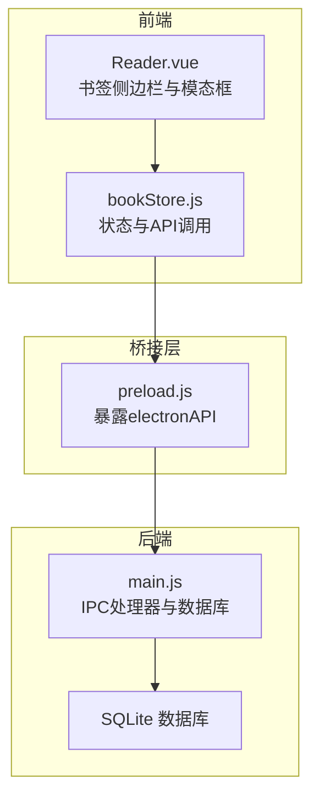
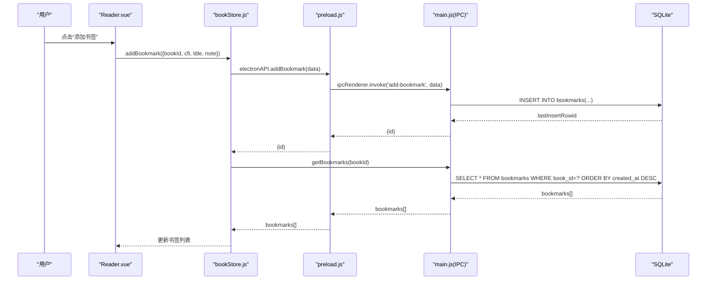
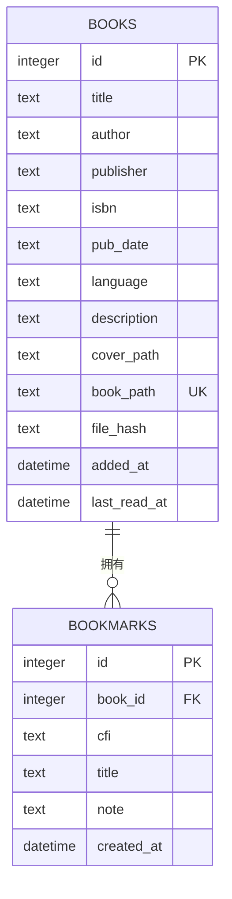
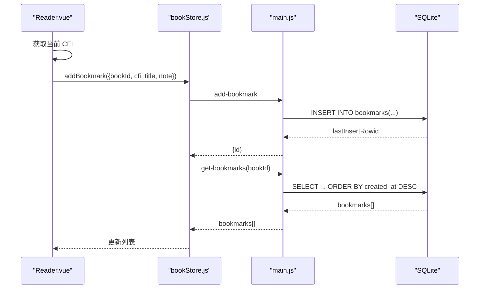
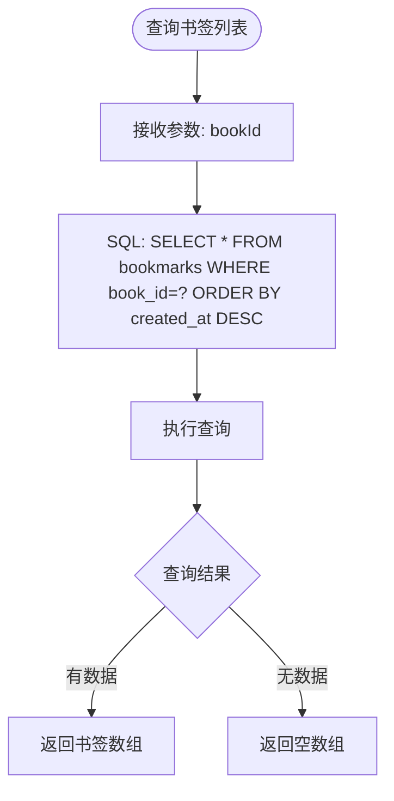
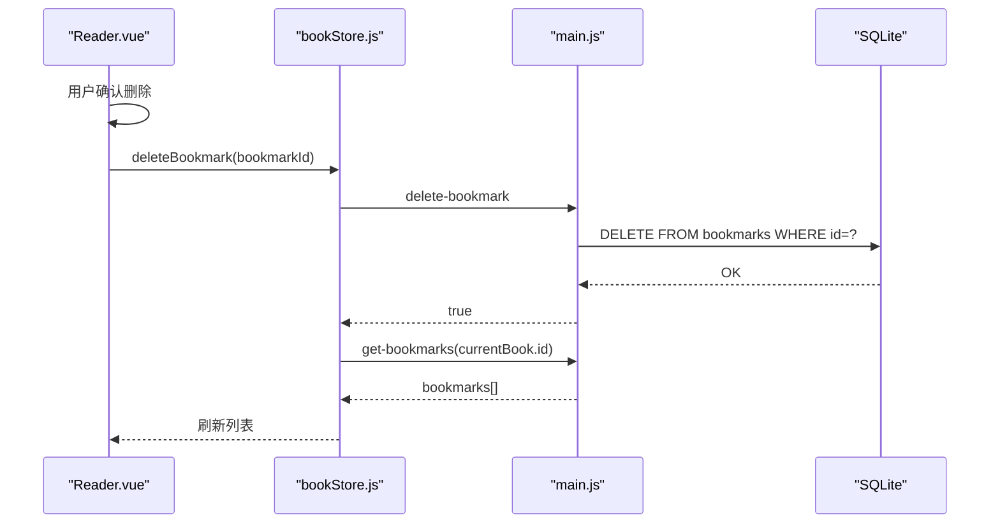
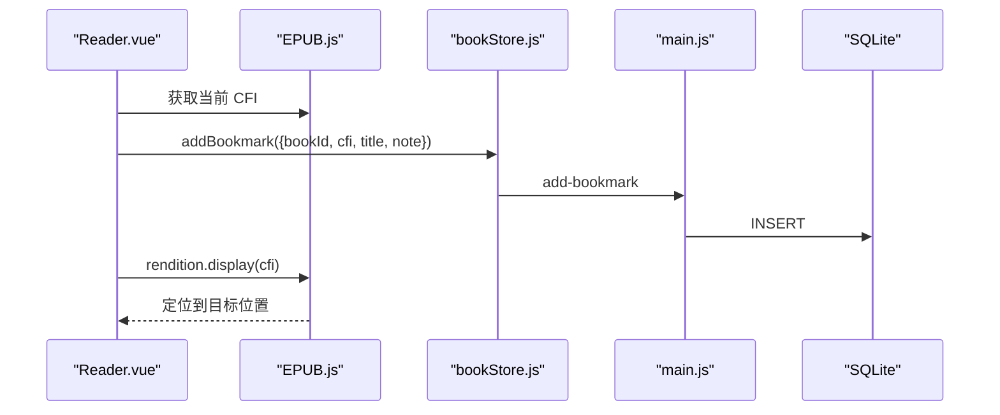
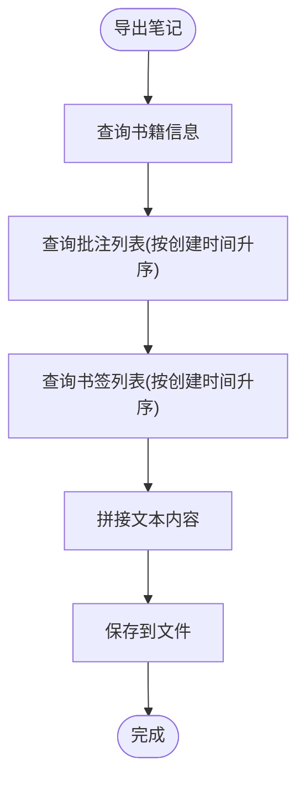
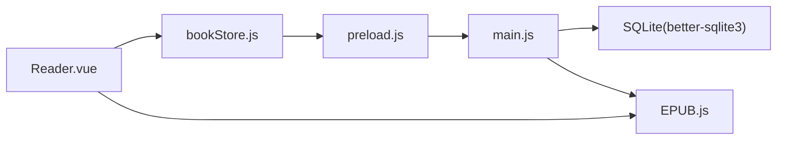

# 书签表API

<cite>
**本文档引用的文件**
- [README.md](file://README.md)
- [main.js](file://electron/main.js)
- [preload.js](file://electron/preload.js)
- [bookStore.js](file://src/stores/bookStore.js)
- [Reader.vue](file://src/components/Reader.vue)
- [epub.js](file://node_modules/epubjs/dist/epub.js)
</cite>

## 目录
1. [简介](#简介)
2. [项目结构](#项目结构)
3. [核心组件](#核心组件)
4. [架构总览](#架构总览)
5. [详细组件分析](#详细组件分析)
6. [依赖分析](#依赖分析)
7. [性能考虑](#性能考虑)
8. [故障排除指南](#故障排除指南)
9. [结论](#结论)
10. [附录](#附录)

## 简介
本文件为 ROSAA 电子书阅读器的书签表 API 完整文档，覆盖书签的创建、查询、删除操作，以及与 EPUB 内容的 CFI 位置映射、列表排序规则、导出机制、索引优化与数据清理策略。读者将了解书签表的字段结构、与书籍表的外键关联、前端交互流程、后端数据库实现及 IPC 通信桥接。

## 项目结构
- 前端（Vue 3 + Pinia）负责用户交互与状态管理，通过 window.electronAPI 调用后端能力。
- 后端（Electron 主进程 + better-sqlite3）负责数据库初始化、表结构定义、IPC 处理器与数据持久化。
- 阅读器组件使用 EPUB.js 获取当前阅读位置的 CFI，作为书签的精确位置标识。

**图表来源**
- [Reader.vue:20-62](file://src/components/Reader.vue#L20-L62)
- [bookStore.js:178-206](file://src/stores/bookStore.js#L178-L206)
- [preload.js:7-101](file://electron/preload.js#L7-L101)
- [main.js:234-245](file://electron/main.js#L234-L245)

**章节来源**
- [Reader.vue:20-62](file://src/components/Reader.vue#L20-L62)
- [bookStore.js:178-206](file://src/stores/bookStore.js#L178-L206)
- [preload.js:7-101](file://electron/preload.js#L7-L101)
- [main.js:234-245](file://electron/main.js#L234-L245)

## 核心组件
- 书签表结构与字段
  - id: 主键自增
  - book_id: 外键关联书籍表
  - cfi: EPUB CFI 位置字符串，必填
  - title: 书签标题，可空
  - note: 备注内容，可空
  - created_at: 创建时间，默认当前时间戳
- 与书籍表的关联
  - 外键约束：bookmarks.book_id -> books.id，删除级联（ON DELETE CASCADE）
- 查询排序
  - 按 created_at 降序排列（最新优先）

**章节来源**
- [main.js:234-245](file://electron/main.js#L234-L245)
- [main.js:676-684](file://electron/main.js#L676-L684)

## 架构总览
书签 API 的调用链路如下：
- 前端 Reader.vue 触发添加/删除书签
- bookStore.js 通过 window.electronAPI 调用 IPC
- preload.js 暴露 electronAPI 并转发到主进程
- main.js 的 IPC 处理器执行数据库操作并返回结果

**图表来源**
- [Reader.vue:628-641](file://src/components/Reader.vue#L628-L641)
- [bookStore.js:186-195](file://src/stores/bookStore.js#L186-L195)
- [preload.js:24-35](file://electron/preload.js#L24-L35)
- [main.js:665-684](file://electron/main.js#L665-L684)

## 详细组件分析

### 书签表模型与字段
- 字段说明
  - id: 整型主键，自增
  - book_id: 整型，非空，外键指向 books.id
  - cfi: 文本，非空，EPUB CFI 定位串
  - title: 文本，可空
  - note: 文本，可空
  - created_at: 时间戳，默认当前时间
- 约束与关系
  - 外键：bookmarks.book_id -> books.id (级联删除)
  - 排序：查询按 created_at 降序
- 与 EPUB 的映射
  - CFI 由 EPUB.js 提供，用于精确定位章节与段落位置
  - 阅读器跳转时使用 rendition.display(cfi) 实现定位

**图表来源**
- [main.js:190-206](file://electron/main.js#L190-L206)
- [main.js:234-245](file://electron/main.js#L234-L245)

**章节来源**
- [main.js:234-245](file://electron/main.js#L234-L245)
- [Reader.vue:601-603](file://src/components/Reader.vue#L601-L603)

### 书签创建（添加）
- 前端触发
  - Reader.vue 在用户点击“添加书签”时，获取当前阅读位置的 CFI，并弹出表单输入标题与备注
- 后端处理
  - main.js 的 add-bookmark 处理器插入一条书签记录，返回新增记录的 id
- 前端刷新
  - 成功后重新拉取该书籍的书签列表，按创建时间倒序展示

**图表来源**
- [Reader.vue:628-641](file://src/components/Reader.vue#L628-L641)
- [bookStore.js:186-195](file://src/stores/bookStore.js#L186-L195)
- [main.js:665-684](file://electron/main.js#L665-L684)

**章节来源**
- [Reader.vue:628-641](file://src/components/Reader.vue#L628-L641)
- [bookStore.js:186-195](file://src/stores/bookStore.js#L186-L195)
- [main.js:665-674](file://electron/main.js#L665-L674)

### 书签查询（列表）
- 查询条件：按 book_id 过滤
- 排序规则：按 created_at 降序（最新在前）
- 返回字段：id、book_id、cfi、title、note、created_at

**图表来源**
- [main.js:676-684](file://electron/main.js#L676-L684)
- [bookStore.js:178-184](file://src/stores/bookStore.js#L178-L184)

**章节来源**
- [main.js:676-684](file://electron/main.js#L676-L684)
- [bookStore.js:178-184](file://src/stores/bookStore.js#L178-L184)

### 书签删除
- 前端触发：用户在侧边栏点击“删除”，确认后调用删除接口
- 后端处理：删除指定 id 的书签记录
- 前端刷新：删除成功后重新加载当前书籍的书签列表

**图表来源**
- [Reader.vue:643-648](file://src/components/Reader.vue#L643-L648)
- [bookStore.js:197-206](file://src/stores/bookStore.js#L197-L206)
- [main.js:685-694](file://electron/main.js#L685-L694)

**章节来源**
- [Reader.vue:643-648](file://src/components/Reader.vue#L643-L648)
- [bookStore.js:197-206](file://src/stores/bookStore.js#L197-L206)
- [main.js:685-694](file://electron/main.js#L685-L694)

### 书签跳转与 CFI 解析
- CFI 获取：Reader.vue 在添加书签时调用 rendition.currentLocation() 获取当前 CFI
- 位置跳转：点击书签项时调用 rendition.display(bookmark.cfi) 实现跳转
- CFI 规范：EPUB.js 提供 CFI 解析与生成能力，保证跨版本兼容

**图表来源**
- [Reader.vue:628-641](file://src/components/Reader.vue#L628-L641)
- [Reader.vue:601-603](file://src/components/Reader.vue#L601-L603)
- [epub.js:1118-1167](file://node_modules/epubjs/dist/epub.js#L1118-L1167)

**章节来源**
- [Reader.vue:628-641](file://src/components/Reader.vue#L628-L641)
- [Reader.vue:601-603](file://src/components/Reader.vue#L601-L603)
- [epub.js:1118-1167](file://node_modules/epubjs/dist/epub.js#L1118-L1167)

### 批量操作与导出机制
- 批量导出：后端提供 export-notes 接口，可一次性导出某本书的批注与书签，形成文本文件
- 书签导出：导出内容包含书签标题、备注与创建时间
- 批注导出：导出内容包含选中文本、批注内容与创建时间

**图表来源**
- [main.js:534-592](file://electron/main.js#L534-L592)

**章节来源**
- [main.js:534-592](file://electron/main.js#L534-L592)

## 依赖分析
- 前端依赖
  - EPUB.js：提供 CFI 解析与渲染能力
  - Pinia：状态管理，集中维护书签列表
  - Electron IPC：通过 preload 暴露的 electronAPI 与主进程通信
- 后端依赖
  - better-sqlite3：SQLite 原生驱动，支持 WAL 模式提升并发性能
  - 业务逻辑：在主进程内实现 IPC 处理器与数据库操作

**图表来源**
- [Reader.vue:162-176](file://src/components/Reader.vue#L162-L176)
- [bookStore.js:1-4](file://src/stores/bookStore.js#L1-L4)
- [preload.js:1-104](file://electron/preload.js#L1-L104)
- [main.js:180-284](file://electron/main.js#L180-L284)

**章节来源**
- [Reader.vue:162-176](file://src/components/Reader.vue#L162-L176)
- [bookStore.js:1-4](file://src/stores/bookStore.js#L1-L4)
- [preload.js:1-104](file://electron/preload.js#L1-L104)
- [main.js:180-284](file://electron/main.js#L180-L284)

## 性能考虑
- 数据库初始化
  - 启用 WAL 模式以提升并发读写性能
  - 在主进程启动时创建表结构，避免运行时动态创建带来的开销
- 查询排序
  - 书签列表按 created_at DESC 排序，建议在 book_id + created_at 上建立复合索引以优化查询
- 导出性能
  - 批量导出时先查询书签与批注列表，再一次性写入文件，减少 IO 次数
- 前端渲染
  - 书签列表使用虚拟滚动或分页可进一步优化长列表渲染

**章节来源**
- [main.js:185-187](file://electron/main.js#L185-L187)
- [main.js:676-684](file://electron/main.js#L676-L684)
- [main.js:534-592](file://electron/main.js#L534-L592)

## 故障排除指南
- 无法添加书签
  - 检查前端是否正确获取 CFI；若为空则无法插入
  - 检查后端 add-bookmark 处理器是否抛错
- 书签列表为空
  - 确认传入的 bookId 是否正确
  - 检查排序是否被其他逻辑覆盖
- 跳转失败
  - 确认 CFI 字符串有效且未被篡改
  - 检查 EPUB.js 版本与 CFI 规范兼容性
- 导出异常
  - 检查书籍是否存在与文件路径是否有效
  - 确认导出目录有写入权限

**章节来源**
- [Reader.vue:628-641](file://src/components/Reader.vue#L628-L641)
- [bookStore.js:178-184](file://src/stores/bookStore.js#L178-L184)
- [main.js:665-684](file://electron/main.js#L665-L684)
- [main.js:534-592](file://electron/main.js#L534-L592)

## 结论
ROSAA 的书签系统围绕 EPUB CFI 精确定位构建，通过清晰的前后端职责划分与 IPC 通信，实现了稳定的书签创建、查询与删除能力。配合导出机制与潜在的索引优化，可满足日常阅读场景下的高效书签管理需求。

## 附录
- 术语说明
  - CFI：EPUB 内容定位规范，用于唯一标识文档中的字符偏移或范围
- 参考资料
  - EPUB.js CFI 解析与生成：[EPUB.js 文档片段:1118-1167](file://node_modules/epubjs/dist/epub.js#L1118-L1167)