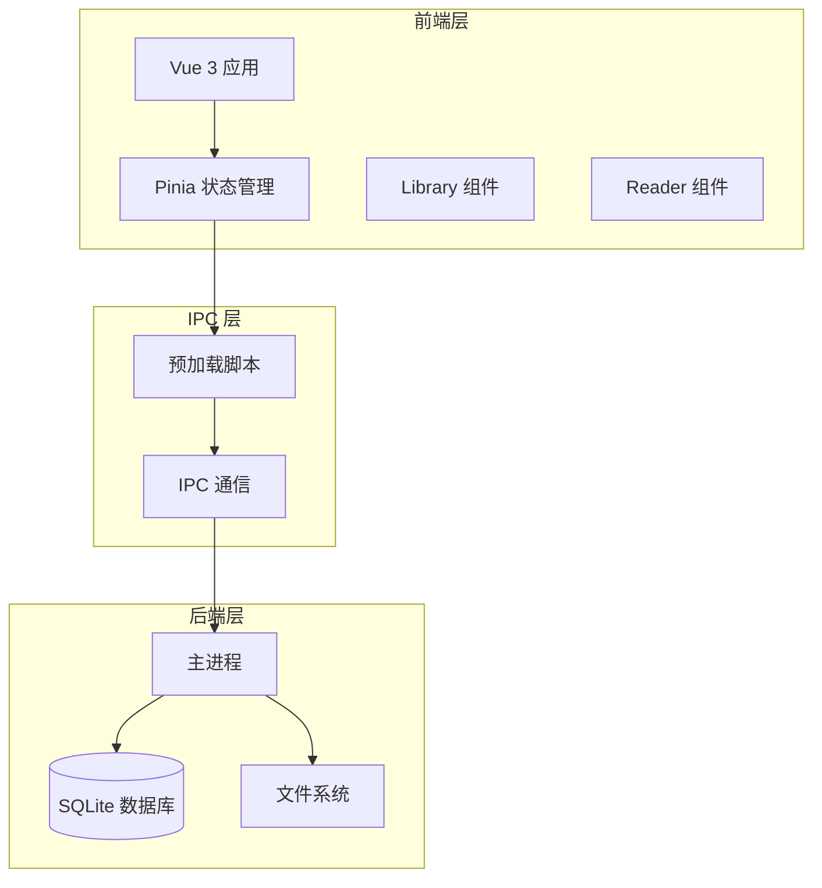
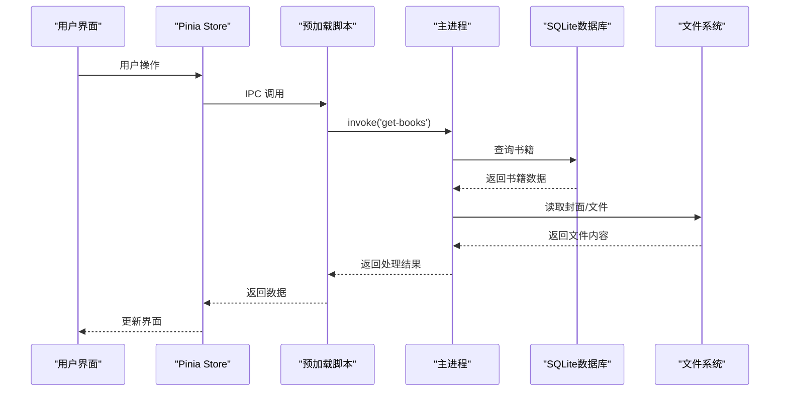
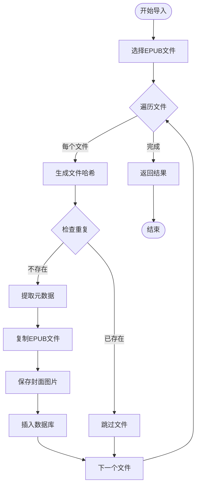
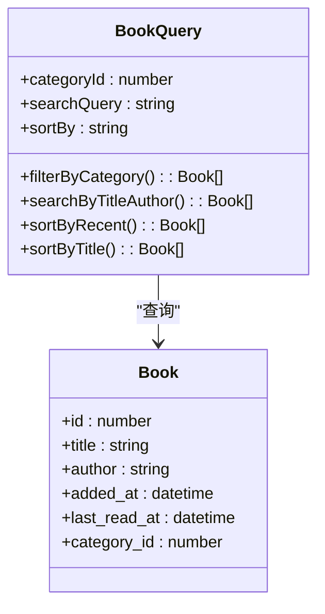
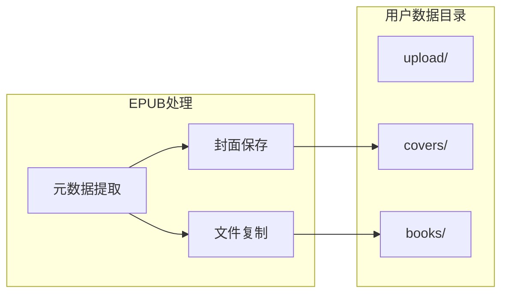

# 书籍表API

<cite>
**本文档引用的文件**
- [electron/main.js](file://electron/main.js)
- [electron/preload.js](file://electron/preload.js)
- [src/stores/bookStore.js](file://src/stores/bookStore.js)
- [src/components/Library.vue](file://src/components/Library.vue)
- [src/utils/pathHelper.js](file://src/utils/pathHelper.js)
- [src/utils/httpHelper.js](file://src/utils/httpHelper.js)
- [src/main.js](file://src/main.js)
- [README.md](file://README.md)
</cite>

## 目录
1. [简介](#简介)
2. [项目结构](#项目结构)
3. [核心组件](#核心组件)
4. [架构概览](#架构概览)
5. [详细组件分析](#详细组件分析)
6. [依赖关系分析](#依赖关系分析)
7. [性能考虑](#性能考虑)
8. [故障排除指南](#故障排除指南)
9. [结论](#结论)

## 简介
本文档为ROSAA电子书阅读器的书籍表API提供完整的技术文档。该系统基于Electron + Vue 3 + SQLite架构，实现了完整的EPUB电子书管理功能。文档详细说明了书籍表的CRUD操作接口、元数据提取流程、文件哈希验证机制、重复检测策略，以及搜索过滤功能的实现细节。

## 项目结构
ROSAA电子书阅读器采用前后端分离的架构设计，主要由以下核心模块组成：



**图表来源**
- [src/main.js:1-11](file://src/main.js#L1-L11)
- [electron/preload.js:1-104](file://electron/preload.js#L1-L104)
- [electron/main.js:1-922](file://electron/main.js#L1-L922)

**章节来源**
- [README.md:167-193](file://README.md#L167-L193)
- [src/main.js:1-11](file://src/main.js#L1-L11)

## 核心组件
系统的核心组件包括：

### 书籍表结构
书籍表采用SQLite数据库存储，包含以下字段：
- `id`: 主键，自增整数
- `title`: 书名，必填文本
- `author`: 作者，文本
- `publisher`: 出版社，文本
- `isbn`: ISBN号，文本
- `pub_date`: 出版日期，文本
- `language`: 语言，文本
- `description`: 描述，文本
- `cover_path`: 封面图片路径，文本
- `book_path`: EPUB文件路径，唯一且必填
- `file_hash`: 文件哈希值，文本
- `added_at`: 添加时间，默认当前时间戳
- `last_read_at`: 最近阅读时间，时间戳

### 状态管理
使用Pinia进行状态管理，提供以下核心功能：
- 书籍列表管理
- 分类管理
- 当前选中书籍
- 阅读进度管理
- 书签管理

**章节来源**
- [electron/main.js:190-206](file://electron/main.js#L190-L206)
- [src/stores/bookStore.js:1-234](file://src/stores/bookStore.js#L1-L234)

## 架构概览
系统采用三层架构设计，实现了清晰的职责分离：



**图表来源**
- [electron/preload.js:7-101](file://electron/preload.js#L7-L101)
- [electron/main.js:429-449](file://electron/main.js#L429-L449)

**章节来源**
- [electron/preload.js:1-104](file://electron/preload.js#L1-L104)
- [electron/main.js:343-427](file://electron/main.js#L343-L427)

## 详细组件分析

### 书籍导入流程
书籍导入是系统的核心功能之一，实现了完整的EPUB文件处理流程：



**图表来源**
- [electron/main.js:343-427](file://electron/main.js#L343-L427)
- [electron/main.js:12-30](file://electron/main.js#L12-L30)

#### 元数据提取机制
系统能够从EPUB文件中提取以下元数据：
- **基础信息**: 标题、作者、出版社、出版日期
- **标识信息**: ISBN号识别（支持ISBN-10和ISBN-13）
- **描述信息**: 语言、描述
- **封面处理**: 自动识别并保存封面图片

#### 文件哈希验证
系统使用SHA256算法对EPUB文件进行哈希计算，用于：
- 去重检测（基于文件路径或哈希值）
- 文件完整性验证
- 防止重复导入相同内容

#### 重复书籍检测
检测机制基于双重条件：
1. `book_path = ?`（文件路径完全相同）
2. `file_hash = ?`（文件内容相同但路径不同）

**章节来源**
- [electron/main.js:343-427](file://electron/main.js#L343-L427)
- [electron/main.js:12-30](file://electron/main.js#L12-L30)
- [electron/main.js:149-165](file://electron/main.js#L149-L165)

### 书籍查询与过滤
系统提供了灵活的书籍查询和过滤功能：



**图表来源**
- [src/components/Library.vue:364-392](file://src/components/Library.vue#L364-L392)
- [electron/main.js:429-449](file://electron/main.js#L429-L449)

#### 分类筛选
- 支持按分类ID筛选书籍
- 未指定分类时返回所有书籍
- 分类为空时显示"全部图书"

#### 搜索功能
- 支持按书名模糊搜索
- 支持按作者名模糊搜索
- 搜索结果实时过滤

#### 排序机制
- **最近添加**: 按`added_at`降序排列
- **书名排序**: 按`title`本地化排序
- **最近阅读**: 按`last_read_at`降序排列

**章节来源**
- [src/components/Library.vue:359-392](file://src/components/Library.vue#L359-L392)
- [electron/main.js:429-449](file://electron/main.js#L429-L449)

### 书籍CRUD操作
系统提供了完整的书籍管理API：

#### 读取操作
- `get-books(categoryId)`: 获取书籍列表
- `get-categories()`: 获取分类列表
- `get-progress(bookId)`: 获取阅读进度
- `get-bookmarks(bookId)`: 获取书签列表
- `get-annotations(bookId)`: 获取批注列表

#### 写入操作
- `open-epub()`: 导入EPUB文件
- `add-category(name, color)`: 添加分类
- `add-bookmark(data)`: 添加书签
- `save-annotation(data)`: 保存批注
- `save-progress(data)`: 保存阅读进度

#### 删除操作
- `delete-book(bookId)`: 删除书籍记录
- `delete-book-completely(bookId)`: 彻底删除书籍
- `delete-category(categoryId)`: 删除分类
- `delete-bookmark(bookmarkId)`: 删除书签
- `delete-annotation(annotationId)`: 删除批注

**章节来源**
- [electron/preload.js:7-101](file://electron/preload.js#L7-L101)
- [electron/main.js:429-760](file://electron/main.js#L429-L760)

### 文件存储管理
系统采用统一的文件存储策略：



**图表来源**
- [electron/main.js:119-133](file://electron/main.js#L119-L133)

#### 封面图片处理
- 自动从EPUB中提取封面
- 保存到`upload/covers/`目录
- 使用时间戳避免文件冲突
- 支持多种封面格式

#### EPUB文件管理
- 复制到`upload/books/`目录
- 使用时间戳确保文件名唯一
- 统一的文件路径管理
- 支持文件导出功能

**章节来源**
- [electron/main.js:119-133](file://electron/main.js#L119-L133)
- [src/utils/pathHelper.js:13-53](file://src/utils/pathHelper.js#L13-L53)

## 依赖关系分析

### 数据库设计
系统采用SQLite作为数据存储，设计了完整的数据库模式：

```mermaid
erDiagram
BOOKS {
integer id PK
text title
text author
text publisher
text isbn
text pub_date
text language
text description
text cover_path
text book_path UK
text file_hash
datetime added_at
datetime last_read_at
integer category_id FK
}
CATEGORIES {
integer id PK
text name UK
text color
datetime created_at
}
READING_PROGRESS {
integer id PK
integer book_id UK FK
text cfi
integer page
real percentage
datetime updated_at
}
BOOKMARKS {
integer id PK
integer book_id FK
text cfi
text title
text note
datetime created_at
}
ANNOTATIONS {
integer id PK
integer book_id FK
text cfi
text selected_text
text annotation
text color
datetime created_at
datetime updated_at
}
BOOKS ||--o{ READING_PROGRESS : "has"
BOOKS ||--o{ BOOKMARKS : "has"
BOOKS ||--o{ ANNOTATIONS : "has"
BOOKS }o--|| CATEGORIES : "belongs_to"
```

**图表来源**
- [electron/main.js:190-271](file://electron/main.js#L190-L271)

### 外部依赖
系统依赖以下关键库：
- **better-sqlite3**: SQLite数据库操作
- **AdmZip**: EPUB文件解压处理
- **xml2js**: XML解析（EPUB元数据）
- **crypto**: 文件哈希计算

**章节来源**
- [electron/main.js:1-8](file://electron/main.js#L1-L8)

## 性能考虑
系统在设计时充分考虑了性能优化：

### 数据库优化
- **WAL模式**: 启用Write-Ahead Logging提高并发性能
- **外键约束**: 级联删除确保数据一致性
- **索引设计**: 为常用查询字段建立索引

### 文件处理优化
- **流式处理**: 大文件使用流式读取避免内存溢出
- **异步操作**: 所有文件操作采用异步非阻塞模式
- **缓存机制**: 阅读进度和书签数据缓存

### 前端性能
- **虚拟滚动**: 大量书籍时使用虚拟滚动
- **懒加载**: 封面图片懒加载
- **状态缓存**: Pinia状态管理减少重复请求

## 故障排除指南

### 常见问题及解决方案

#### 数据库连接问题
**症状**: 应用启动时报数据库错误
**解决方案**: 
- 检查用户数据目录权限
- 验证数据库文件完整性
- 重启应用重新初始化数据库

#### EPUB文件导入失败
**症状**: 导入EPUB文件时报错
**解决方案**:
- 检查EPUB文件格式是否正确
- 验证文件路径权限
- 确认磁盘空间充足

#### 封面图片显示异常
**症状**: 封面图片无法显示
**解决方案**:
- 检查封面文件是否存在
- 验证文件路径格式
- 重新导入EPUB文件

#### 阅读进度丢失
**症状**: 重新打开书籍进度不保存
**解决方案**:
- 检查数据库连接状态
- 验证reading_progress表结构
- 重新保存阅读进度

**章节来源**
- [electron/main.js:167-284](file://electron/main.js#L167-L284)
- [src/stores/bookStore.js:161-176](file://src/stores/bookStore.js#L161-L176)

## 结论
ROSAA电子书阅读器的书籍表API设计合理，功能完整，具有良好的扩展性和维护性。系统通过合理的架构设计和优化策略，实现了高效的EPUB文件管理功能。主要特点包括：

1. **完整的CRUD操作**: 支持书籍的完整生命周期管理
2. **智能元数据提取**: 自动从EPUB文件中提取丰富元数据
3. **防重复机制**: 基于文件哈希和路径的双重去重
4. **灵活的查询过滤**: 支持多维度的书籍检索
5. **完善的文件管理**: 统一的文件存储和路径管理策略
6. **性能优化**: 数据库和文件处理层面的多重优化

该API为后续的功能扩展奠定了坚实的基础，包括云端同步、多设备支持、高级搜索等功能都可以在此基础上进行开发。