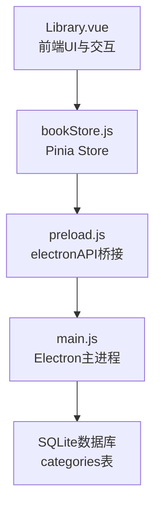
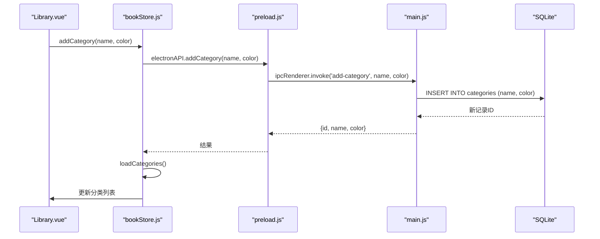
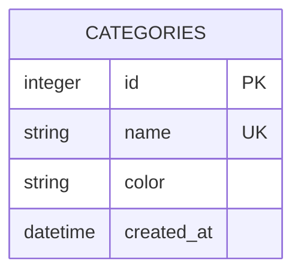
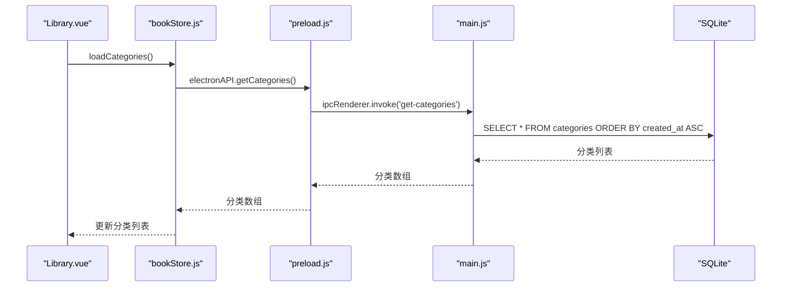
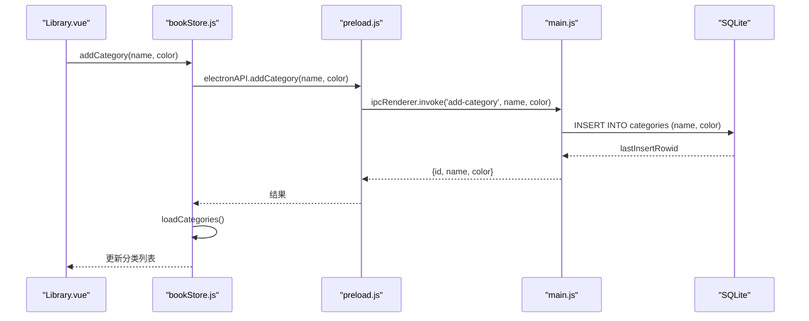
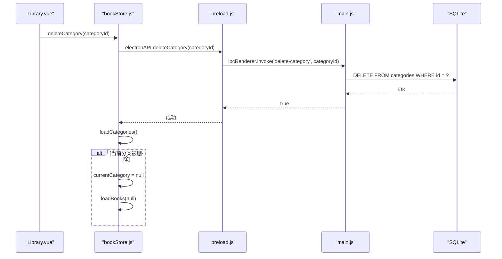
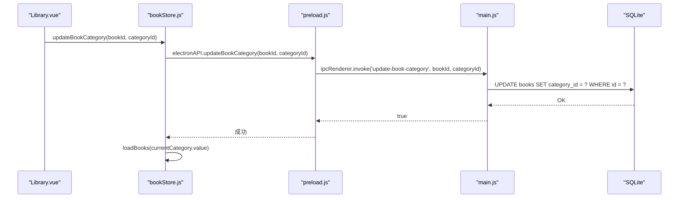
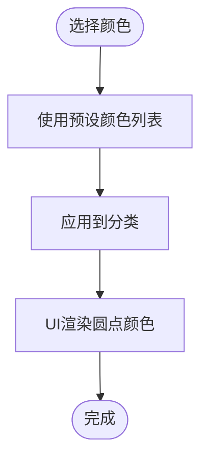
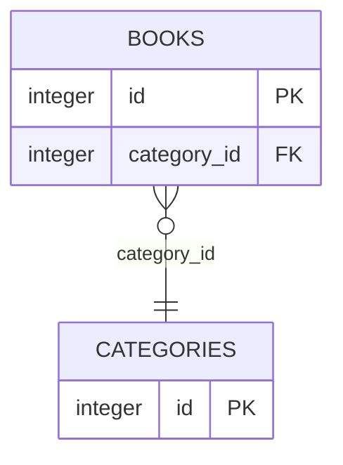
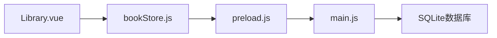

# 分类表API

<cite>
**本文档引用的文件**
- [bookStore.js](file://src/stores/bookStore.js)
- [Library.vue](file://src/components/Library.vue)
- [main.js](file://electron/main.js)
- [preload.js](file://electron/preload.js)
</cite>

## 目录
1. [简介](#简介)
2. [项目结构](#项目结构)
3. [核心组件](#核心组件)
4. [架构概览](#架构概览)
5. [详细组件分析](#详细组件分析)
6. [依赖分析](#依赖分析)
7. [性能考虑](#性能考虑)
8. [故障排除指南](#故障排除指南)
9. [结论](#结论)

## 简介
本文件为ROSAA电子书阅读器的分类表API提供完整的技术文档。内容涵盖分类系统的CRUD操作、数据模型、颜色主题系统、排序与搜索过滤、性能优化策略以及与书籍分类更新的联动机制。文档面向开发者与技术支持人员，帮助快速理解并正确使用分类功能。

## 项目结构
分类功能涉及前端状态管理、UI交互、IPC桥接以及后端数据库操作四个层面：
- 前端状态管理：Pinia Store负责维护分类列表与当前选中分类
- 前端UI：Library组件提供分类列表展示、颜色选择与交互
- IPC桥接：preload脚本暴露electronAPI供前端调用
- 后端数据库：Electron主进程执行SQLite操作，维护categories表

**图表来源**
- [Library.vue:34-624](file://src/components/Library.vue#L34-L624)
- [bookStore.js:1-234](file://src/stores/bookStore.js#L1-L234)
- [preload.js:7-101](file://electron/preload.js#L7-L101)
- [main.js:263-284](file://electron/main.js#L263-L284)

**章节来源**
- [bookStore.js:1-234](file://src/stores/bookStore.js#L1-L234)
- [Library.vue:34-624](file://src/components/Library.vue#L34-L624)
- [preload.js:7-101](file://electron/preload.js#L7-L101)
- [main.js:263-284](file://electron/main.js#L263-L284)

## 核心组件
- Pinia Store（bookStore.js）：维护分类列表、当前分类、书籍列表，并封装分类相关的异步操作。
- Library组件（Library.vue）：渲染分类列表、颜色选择器、添加分类对话框、分配书籍到分类的上下文菜单。
- preload脚本（preload.js）：通过contextBridge暴露electronAPI，统一前端调用入口。
- Electron主进程（main.js）：定义数据库初始化逻辑、分类相关IPC处理器（增删改查）。

**章节来源**
- [bookStore.js:1-234](file://src/stores/bookStore.js#L1-L234)
- [Library.vue:34-624](file://src/components/Library.vue#L34-L624)
- [preload.js:7-101](file://electron/preload.js#L7-L101)
- [main.js:263-284](file://electron/main.js#L263-L284)

## 架构概览
分类系统采用前后端分离的IPC架构：
- 前端通过electronAPI调用后端IPC处理器
- 主进程执行SQLite操作，返回标准化结果
- Store层统一管理状态，UI层响应状态变化

**图表来源**
- [bookStore.js:35-47](file://src/stores/bookStore.js#L35-L47)
- [preload.js:44-47](file://electron/preload.js#L44-L47)
- [main.js:463-471](file://electron/main.js#L463-L471)

**章节来源**
- [bookStore.js:35-47](file://src/stores/bookStore.js#L35-L47)
- [preload.js:44-47](file://electron/preload.js#L44-L47)
- [main.js:463-471](file://electron/main.js#L463-L471)

## 详细组件分析

### 数据模型与约束
分类表（categories）包含以下字段：
- id：自增主键
- name：非空且唯一，用于标识分类名称
- color：颜色值，默认提供预设颜色
- created_at：创建时间，默认当前时间戳

**图表来源**
- [main.js:265-271](file://electron/main.js#L265-L271)

**章节来源**
- [main.js:265-271](file://electron/main.js#L265-L271)

### CRUD操作API

#### 查询分类
- 前端调用：store.loadCategories() -> electronAPI.getCategories()
- 后端实现：SELECT * FROM categories ORDER BY created_at ASC
- 返回：分类数组（按创建时间升序）

**图表来源**
- [bookStore.js:24-33](file://src/stores/bookStore.js#L24-L33)
- [preload.js:40-43](file://electron/preload.js#L40-L43)
- [main.js:452-460](file://electron/main.js#L452-L460)

**章节来源**
- [bookStore.js:24-33](file://src/stores/bookStore.js#L24-L33)
- [preload.js:40-43](file://electron/preload.js#L40-L43)
- [main.js:452-460](file://electron/main.js#L452-L460)

#### 创建分类
- 前端调用：store.addCategory(name, color) -> electronAPI.addCategory(name, color)
- 后端实现：INSERT INTO categories (name, color)
- 返回：包含id、name、color的对象；若违反唯一性约束则返回null

**图表来源**
- [Library.vue:580-594](file://src/components/Library.vue#L580-L594)
- [bookStore.js:35-47](file://src/stores/bookStore.js#L35-L47)
- [preload.js:44-47](file://electron/preload.js#L44-L47)
- [main.js:463-471](file://electron/main.js#L463-L471)

**章节来源**
- [Library.vue:580-594](file://src/components/Library.vue#L580-L594)
- [bookStore.js:35-47](file://src/stores/bookStore.js#L35-L47)
- [preload.js:44-47](file://electron/preload.js#L44-L47)
- [main.js:463-471](file://electron/main.js#L463-L471)

#### 删除分类
- 前端调用：store.deleteCategory(categoryId) -> electronAPI.deleteCategory(categoryId)
- 后端实现：DELETE FROM categories WHERE id = ?
- 删除后行为：刷新分类列表；若当前选中分类被删除，则切换到“全部书籍”

**图表来源**
- [bookStore.js:49-61](file://src/stores/bookStore.js#L49-L61)
- [preload.js:48-51](file://electron/preload.js#L48-L51)
- [main.js:474-482](file://electron/main.js#L474-L482)

**章节来源**
- [bookStore.js:49-61](file://src/stores/bookStore.js#L49-L61)
- [preload.js:48-51](file://electron/preload.js#L48-L51)
- [main.js:474-482](file://electron/main.js#L474-L482)

#### 更新书籍分类
- 前端调用：store.updateBookCategory(bookId, categoryId) -> electronAPI.updateBookCategory(bookId, categoryId)
- 后端实现：UPDATE books SET category_id = ? WHERE id = ?
- 更新后行为：重新加载当前分类下的书籍列表

**图表来源**
- [Library.vue:597-612](file://src/components/Library.vue#L597-L612)
- [bookStore.js:128-135](file://src/stores/bookStore.js#L128-L135)
- [preload.js:52-55](file://electron/preload.js#L52-L55)
- [main.js:485-493](file://electron/main.js#L485-L493)

**章节来源**
- [Library.vue:597-612](file://src/components/Library.vue#L597-L612)
- [bookStore.js:128-135](file://src/stores/bookStore.js#L128-L135)
- [preload.js:52-55](file://electron/preload.js#L52-L55)
- [main.js:485-493](file://electron/main.js#L485-L493)

### 颜色主题系统
- 颜色字段：categories.color用于UI渲染
- 预设颜色：Library.vue中定义了12种预设颜色，支持用户在添加分类时选择
- 渲染方式：分类项左侧圆点使用对应颜色，支持hover与active状态

**图表来源**
- [Library.vue:429-442](file://src/components/Library.vue#L429-L442)
- [Library.vue:35-42](file://src/components/Library.vue#L35-L42)

**章节来源**
- [Library.vue:429-442](file://src/components/Library.vue#L429-L442)
- [Library.vue:35-42](file://src/components/Library.vue#L35-L42)

### 分类层次结构设计
- 当前实现：单层分类结构，无父子层级关系
- 存储设计：categories表独立维护，books表通过category_id外键关联
- 外键约束：ON DELETE SET NULL，删除分类时不会级联删除书籍

**图表来源**
- [main.js:276-277](file://electron/main.js#L276-L277)

**章节来源**
- [main.js:276-277](file://electron/main.js#L276-L277)

### 分类与书籍的多对一关联
- 关系说明：多本图书可属于同一分类，但每本书仅属于一个分类
- 查询方式：通过books.category_id过滤，支持按分类筛选
- 更新方式：通过update-book-category接口更新category_id

**章节来源**
- [main.js:434-437](file://electron/main.js#L434-L437)
- [main.js:485-493](file://electron/main.js#L485-L493)

### 高级功能
- 重命名：当前代码未提供直接的分类重命名接口，可通过删除旧分类并创建新分类实现
- 颜色修改：当前代码未提供直接的颜色修改接口，可通过删除旧分类并创建新分类实现
- 分类合并：当前代码未提供直接的分类合并接口，可通过批量更新书籍分类实现

**章节来源**
- [bookStore.js:49-61](file://src/stores/bookStore.js#L49-L61)
- [main.js:474-482](file://electron/main.js#L474-L482)

### 排序规则与搜索过滤
- 排序规则：
  - 分类列表：按created_at升序排列
  - 书籍列表：按last_read_at降序，其次按added_at降序
- 搜索过滤：Library.vue提供搜索框，支持按书名或作者模糊匹配

**章节来源**
- [main.js:439-444](file://electron/main.js#L439-L444)
- [Library.vue:376-392](file://src/components/Library.vue#L376-L392)

### 统计功能
- 书籍数量统计：当前实现中分类下的书籍数量计算为占位逻辑，需后端提供具体统计
- 缓存信息：提供存储空间与缓存大小信息，便于用户了解系统占用情况

**章节来源**
- [Library.vue:456-459](file://src/components/Library.vue#L456-L459)
- [Library.vue:417-422](file://src/components/Library.vue#L417-L422)

## 依赖分析
- 前端依赖关系：
  - Library.vue依赖bookStore.js提供的分类与书籍状态
  - bookStore.js依赖preload.js暴露的electronAPI
- 后端依赖关系：
  - main.js依赖SQLite数据库执行DDL/DML操作
  - main.js依赖Electron IPC机制与文件系统

**图表来源**
- [Library.vue:346-351](file://src/components/Library.vue#L346-L351)
- [bookStore.js:1-4](file://src/stores/bookStore.js#L1-L4)
- [preload.js:7-101](file://electron/preload.js#L7-L101)
- [main.js:180-284](file://electron/main.js#L180-L284)

**章节来源**
- [Library.vue:346-351](file://src/components/Library.vue#L346-L351)
- [bookStore.js:1-4](file://src/stores/bookStore.js#L1-L4)
- [preload.js:7-101](file://electron/preload.js#L7-L101)
- [main.js:180-284](file://electron/main.js#L180-L284)

## 性能考虑
- SQLite WAL模式：启用WAL模式提升并发读写性能
- 事务与索引：建议为高频查询字段建立索引（如books.category_id、categories.name）
- 缓存策略：提供清理WAL与共享内存文件的接口，定期清理可减少磁盘占用
- 前端优化：Store层集中管理状态，避免重复请求；UI层使用虚拟滚动处理大量书籍

**章节来源**
- [main.js:185-187](file://electron/main.js#L185-L187)
- [main.js:904-921](file://electron/main.js#L904-L921)

## 故障排除指南
- 添加分类失败：检查分类名称是否唯一；查看后端日志确认SQL异常
- 删除分类无效：确认分类ID是否存在；检查外键约束是否生效
- 更新书籍分类失败：确认书籍ID与分类ID有效；检查books.category_id字段是否正确更新
- 前端无响应：检查preload.js是否正确暴露electronAPI；确认IPC通道是否正常

**章节来源**
- [bookStore.js:35-47](file://src/stores/bookStore.js#L35-L47)
- [bookStore.js:49-61](file://src/stores/bookStore.js#L49-L61)
- [bookStore.js:128-135](file://src/stores/bookStore.js#L128-L135)
- [preload.js:7-101](file://electron/preload.js#L7-L101)

## 结论
ROSAA电子书阅读器的分类系统提供了基础的CRUD能力与良好的用户体验。通过SQLite数据库与Electron IPC的结合，实现了稳定的数据持久化与跨进程通信。未来可在现有基础上扩展分类重命名、颜色修改、分类合并等高级功能，并进一步优化查询性能与数据一致性保障。