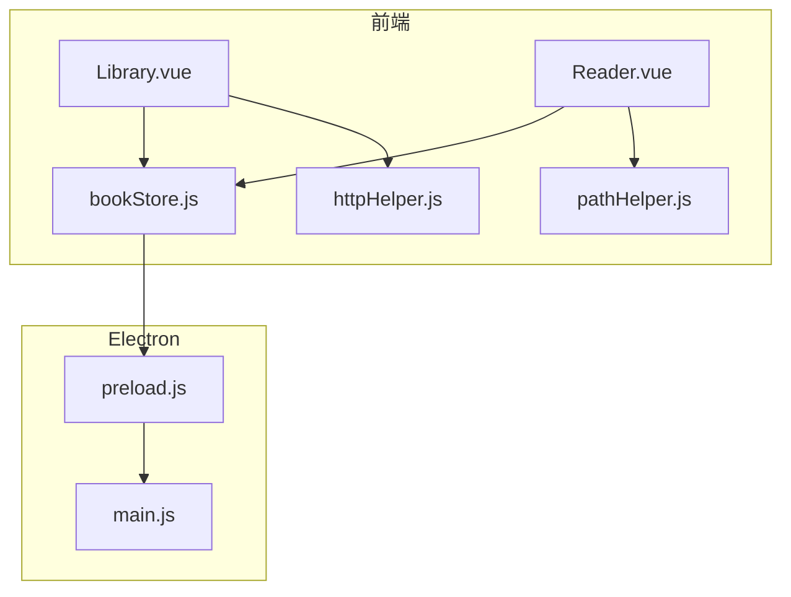
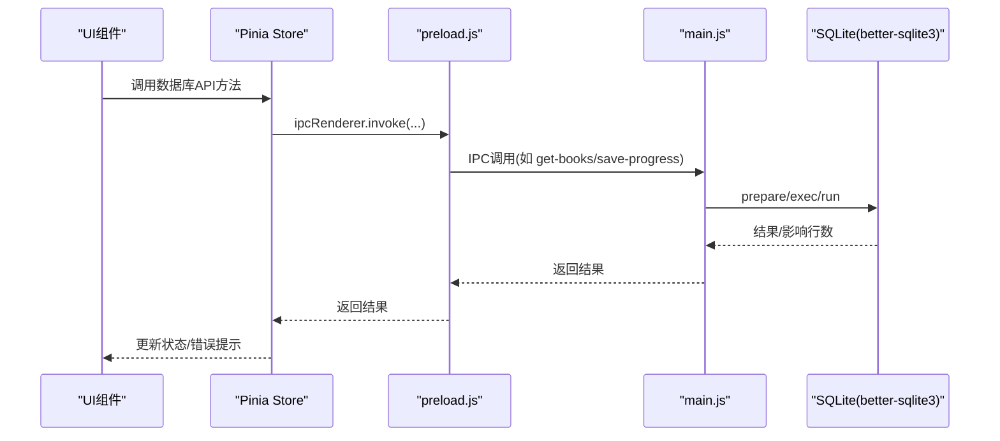
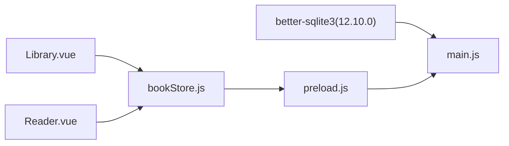

# 数据库API

<cite>
**本文引用的文件**
- [electron/main.js](file://electron/main.js)
- [electron/preload.js](file://electron/preload.js)
- [src/stores/bookStore.js](file://src/stores/bookStore.js)
- [src/components/Library.vue](file://src/components/Library.vue)
- [src/components/Reader.vue](file://src/components/Reader.vue)
- [src/utils/pathHelper.js](file://src/utils/pathHelper.js)
- [src/utils/httpHelper.js](file://src/utils/httpHelper.js)
- [package-lock.json](file://package-lock.json)
</cite>

## 目录
1. [简介](#简介)
2. [项目结构与数据库相关模块](#项目结构与数据库相关模块)
3. [核心组件与职责](#核心组件与职责)
4. [架构总览](#架构总览)
5. [详细组件分析](#详细组件分析)
6. [依赖关系分析](#依赖关系分析)
7. [性能与并发特性](#性能与并发特性)
8. [故障排查指南](#故障排查指南)
9. [结论](#结论)
10. [附录：数据库模式与索引建议](#附录数据库模式与索引建议)

## 简介
本文件面向ROSAA电子书阅读器的数据库层，系统化梳理基于SQLite的CRUD接口与数据访问模式，覆盖书籍、进度、书签、分类、注释五大实体；同时说明IPC桥接、事务管理现状、并发访问控制、性能优化策略、数据完整性约束与迁移兼容性处理建议。文档严格依据仓库现有实现进行归纳总结，并在必要处给出可落地的优化与扩展建议。

## 项目结构与数据库相关模块
- 主进程数据库初始化与表结构定义位于主进程入口，采用better-sqlite3驱动，启用WAL模式提升并发写入性能。
- 前端通过preload暴露的electronAPI，经IPC调用主进程数据库操作。
- Pinia Store集中管理UI状态与数据库交互，Reader组件负责阅读进度与注释的实时保存与恢复。

图表来源
- [electron/preload.js:1-95](file://electron/preload.js#L1-L95)
- [electron/main.js:167-284](file://electron/main.js#L167-L284)
- [src/stores/bookStore.js:1-234](file://src/stores/bookStore.js#L1-L234)
- [src/components/Library.vue:248-589](file://src/components/Library.vue#L248-L589)
- [src/components/Reader.vue:161-222](file://src/components/Reader.vue#L161-L222)
- [src/utils/pathHelper.js:1-63](file://src/utils/pathHelper.js#L1-L63)
- [src/utils/httpHelper.js:1-47](file://src/utils/httpHelper.js#L1-L47)

章节来源
- [electron/main.js:167-284](file://electron/main.js#L167-L284)
- [electron/preload.js:7-92](file://electron/preload.js#L7-L92)
- [src/stores/bookStore.js:1-234](file://src/stores/bookStore.js#L1-L234)
- [src/components/Library.vue:248-589](file://src/components/Library.vue#L248-L589)
- [src/components/Reader.vue:161-222](file://src/components/Reader.vue#L161-L222)
- [src/utils/pathHelper.js:13-53](file://src/utils/pathHelper.js#L13-L53)
- [src/utils/httpHelper.js:9-46](file://src/utils/httpHelper.js#L9-L46)

## 核心组件与职责
- 主进程数据库初始化与表结构
  - 初始化数据库实例、启用WAL、创建books、reading_progress、bookmarks、annotations、categories表，以及迁移兼容逻辑（如file_hash列、category_id列）。
- preload桥接
  - 暴露electronAPI给渲染进程，统一IPC调用入口。
- Pinia Store
  - 封装数据库API调用，提供书籍、分类、进度、书签、注释的增删改查方法，负责错误日志与UI状态同步。
- Reader组件
  - 负责阅读进度的实时更新与保存，书签与注释的创建与删除，以及注释高亮展示。
- Library组件
  - 提供分类管理、书籍导入、导出、彻底删除等操作入口。
- 路径与HTTP工具
  - 路径工具用于将相对路径转换为file://URL；HTTP工具用于携带认证头的网络请求（与数据库无直接关系，但体现认证体系）。

章节来源
- [electron/main.js:167-284](file://electron/main.js#L167-L284)
- [electron/preload.js:7-92](file://electron/preload.js#L7-L92)
- [src/stores/bookStore.js:12-231](file://src/stores/bookStore.js#L12-L231)
- [src/components/Reader.vue:497-527](file://src/components/Reader.vue#L497-L527)
- [src/components/Library.vue:365-466](file://src/components/Library.vue#L365-L466)
- [src/utils/pathHelper.js:13-53](file://src/utils/pathHelper.js#L13-L53)
- [src/utils/httpHelper.js:9-46](file://src/utils/httpHelper.js#L9-L46)

## 架构总览
数据库API通过IPC在渲染进程与主进程之间传递，主进程使用better-sqlite3执行SQL，返回结果或错误。整体流程如下：

图表来源
- [electron/preload.js:7-92](file://electron/preload.js#L7-L92)
- [electron/main.js:429-663](file://electron/main.js#L429-L663)
- [src/stores/bookStore.js:12-231](file://src/stores/bookStore.js#L12-L231)

## 详细组件分析

### 书籍表（books）数据访问模式
- 表结构要点
  - 主键自增id，唯一约束book_path，新增file_hash列用于去重与校验，category_id外键关联categories，last_read_at用于排序与统计。
- CRUD接口
  - 查询：按分类过滤、按最近阅读与添加时间排序。
  - 新增：插入书籍元数据（标题、作者、出版信息、封面、路径、哈希），INSERT OR IGNORE避免重复。
  - 更新：更新分类归属。
  - 删除：软删除（仅删除books记录，保留文件）与彻底删除（删除文件与记录）两种。
- 参数绑定与结果处理
  - 使用预编译语句prepare与run，参数按顺序绑定；查询使用all或get返回结果集。
- 事务管理
  - 当前实现未显式开启事务，多文件导入场景下为逐条处理，未见批量事务包裹。
- 并发与一致性
  - WAL模式开启，支持更高的并发写入；唯一约束保证路径与哈希层面的去重。

章节来源
- [electron/main.js:190-206](file://electron/main.js#L190-L206)
- [electron/main.js:429-449](file://electron/main.js#L429-L449)
- [electron/main.js:379-403](file://electron/main.js#L379-L403)
- [electron/main.js:484-493](file://electron/main.js#L484-L493)
- [electron/main.js:696-708](file://electron/main.js#L696-L708)
- [electron/main.js:594-632](file://electron/main.js#L594-L632)

### 阅读进度表（reading_progress）数据访问模式
- 表结构要点
  - 唯一约束book_id，记录CFI定位、页码、百分比与更新时间；外键级联删除。
- CRUD接口
  - 保存：ON CONFLICT(book_id) DO UPDATE更新CFI、页码、百分比与updated_at，同时更新books.last_read_at。
  - 查询：按book_id查询最新进度。
- 参数绑定与结果处理
  - 保存时一次性绑定bookId、cfi、page、percentage；查询时按主键匹配。
- 事务管理
  - 未显式事务，但单条写入具备原子性。
- 并发与一致性
  - 读写分离，写入频率较高，WAL模式有助于降低锁竞争。

章节来源
- [electron/main.js:221-231](file://electron/main.js#L221-L231)
- [electron/main.js:634-653](file://electron/main.js#L634-L653)
- [electron/main.js:655-663](file://electron/main.js#L655-L663)

### 书签表（bookmarks）数据访问模式
- 表结构要点
  - 记录book_id、CFI、标题、备注与创建时间；外键级联删除。
- CRUD接口
  - 新增：插入书签，返回自增id。
  - 查询：按book_id降序列出。
  - 删除：按id删除。
- 参数绑定与结果处理
  - 新增时绑定bookId、cfi、title、note；查询时按book_id过滤。
- 事务管理
  - 单条操作原子性，未见批量事务。
- 并发与一致性
  - 写入量较小，读多写少，性能压力低。

章节来源
- [electron/main.js:234-244](file://electron/main.js#L234-L244)
- [electron/main.js:665-674](file://electron/main.js#L665-L674)
- [electron/main.js:676-684](file://electron/main.js#L676-L684)
- [electron/main.js:686-694](file://electron/main.js#L686-L694)

### 分类表（categories）与书籍分类关联
- 表结构要点
  - 唯一约束name，带颜色与创建时间；books表新增category_id列并设置外键。
- CRUD接口
  - 查询：按创建时间升序列出。
  - 新增：插入name与color。
  - 删除：删除分类（注意：若存在书籍引用，需考虑级联或设置NULL策略）。
  - 更新：将书籍移动到指定分类。
- 参数绑定与结果处理
  - 新增返回lastInsertRowid；更新绑定categoryId与bookId。
- 事务管理
  - 未显式事务。
- 并发与一致性
  - 分类变更属于低频操作，影响范围有限。

章节来源
- [electron/main.js:263-272](file://electron/main.js#L263-L272)
- [electron/main.js:451-460](file://electron/main.js#L451-L460)
- [electron/main.js:462-471](file://electron/main.js#L462-L471)
- [electron/main.js:473-482](file://electron/main.js#L473-L482)
- [electron/main.js:484-493](file://electron/main.js#L484-L493)

### 注释表（annotations）数据访问模式
- 表结构要点
  - 记录book_id、CFI、选中文本、批注内容、颜色与时间戳；外键级联删除。
- CRUD接口
  - 新增：插入book_id、cfi、selected_text、annotation、color。
  - 查询：按book_id升序列出。
  - 删除：按id删除。
- 参数绑定与结果处理
  - 新增时绑定上述字段；查询按book_id过滤。
- 事务管理
  - 单条操作原子性。
- 并发与一致性
  - 批注数量通常小于书签，读写压力适中。

章节来源
- [electron/main.js:247-261](file://electron/main.js#L247-L261)
- [electron/main.js:710-731](file://electron/main.js#L710-L731)
- [electron/main.js:733-748](file://electron/main.js#L733-L748)
- [electron/main.js:750-760](file://electron/main.js#L750-L760)

### 前端调用链与数据流
- Library.vue
  - 触发openEpub导入书籍、导出书籍与笔记、删除书籍、分配分类等操作。
- Reader.vue
  - 初始化时加载书签与注释，渲染过程中根据relocated事件保存进度；支持添加书签与删除书签。
- bookStore.js
  - 将UI动作映射为electronAPI调用，统一错误处理与状态更新。
- preload.js
  - 将IPC调用转发到主进程，返回结果。
- main.js
  - 执行SQL，返回结果或抛出异常。

章节来源
- [src/components/Library.vue:365-466](file://src/components/Library.vue#L365-L466)
- [src/components/Reader.vue:497-527](file://src/components/Reader.vue#L497-L527)
- [src/stores/bookStore.js:12-231](file://src/stores/bookStore.js#L12-L231)
- [electron/preload.js:7-92](file://electron/preload.js#L7-L92)
- [electron/main.js:429-663](file://electron/main.js#L429-L663)

## 依赖关系分析
- 数据库驱动
  - better-sqlite3版本在package-lock中声明，引擎版本要求较新。
- IPC桥接
  - preload.js集中暴露API，main.js对应处理函数，形成清晰的边界。
- 前端状态管理
  - Pinia Store聚合数据库操作，减少组件直接依赖IPC。

图表来源
- [package-lock.json:2414-2427](file://package-lock.json#L2414-L2427)
- [electron/preload.js:7-92](file://electron/preload.js#L7-L92)
- [electron/main.js:167-284](file://electron/main.js#L167-L284)
- [src/stores/bookStore.js:12-231](file://src/stores/bookStore.js#L12-L231)
- [src/components/Library.vue:248-589](file://src/components/Library.vue#L248-L589)
- [src/components/Reader.vue:161-222](file://src/components/Reader.vue#L161-L222)

章节来源
- [package-lock.json:2414-2427](file://package-lock.json#L2414-L2427)
- [electron/preload.js:7-92](file://electron/preload.js#L7-L92)
- [electron/main.js:167-284](file://electron/main.js#L167-L284)
- [src/stores/bookStore.js:12-231](file://src/stores/bookStore.js#L12-L231)
- [src/components/Library.vue:248-589](file://src/components/Library.vue#L248-L589)
- [src/components/Reader.vue:161-222](file://src/components/Reader.vue#L161-L222)

## 性能与并发特性
- WAL模式
  - 主进程初始化时启用journal_mode=WAL，提升并发写入吞吐与读写并发度。
- 索引建议
  - books：file_hash、category_id、last_read_at、added_at（当前排序依赖）。
  - reading_progress：book_id（唯一）。
  - bookmarks：book_id、created_at。
  - annotations：book_id、created_at。
  - categories：name（唯一）。
- 查询优化
  - 书籍列表按分类过滤与双排序字段组合查询，建议在category_id与last_read_at上建立复合索引。
  - 进度查询按book_id，注释与书签查询按book_id，均适合单列索引。
- 并发访问控制
  - better-sqlite3为单进程内核，主进程串行处理IPC请求；WAL模式缓解写入阻塞。
  - 多窗口/多标签页场景下，建议在渲染进程侧做防抖与节流，避免高频重复写入。
- 事务管理现状
  - 未显式BEGIN/COMMIT；导入书籍时逐条INSERT，建议在批量导入场景引入事务包裹以提升性能与一致性。

章节来源
- [electron/main.js:185-187](file://electron/main.js#L185-L187)
- [electron/main.js:379-403](file://electron/main.js#L379-L403)

## 故障排查指南
- 书籍导入失败
  - 检查file://路径是否正确（参考路径工具），确认用户数据目录权限。
  - 若重复导入相同书籍，INSERT OR IGNORE会跳过，确认file_hash与book_path是否一致。
- 进度保存异常
  - 确认bookId有效，relocated事件触发频率较高，注意避免过度频繁写入。
- 书签/注释为空
  - 确认当前书籍id传入正确，查询按book_id过滤。
- 删除书籍后封面/文件未清理
  - 彻底删除需调用delete-book-completely，确保文件系统路径存在。
- IPC调用超时
  - 检查preload暴露的API是否与主进程处理函数名称一致，确认ipcRenderer.invoke调用。

章节来源
- [src/utils/pathHelper.js:13-53](file://src/utils/pathHelper.js#L13-L53)
- [electron/main.js:379-403](file://electron/main.js#L379-L403)
- [electron/main.js:634-653](file://electron/main.js#L634-L653)
- [electron/main.js:676-684](file://electron/main.js#L676-L684)
- [electron/main.js:710-731](file://electron/main.js#L710-L731)
- [electron/main.js:594-632](file://electron/main.js#L594-L632)
- [electron/preload.js:7-92](file://electron/preload.js#L7-L92)

## 结论
ROSAA电子书阅读器的数据库层以better-sqlite3为核心，主进程负责表结构与数据操作，preload提供安全的IPC桥接，Pinia Store统一封装业务API。当前实现具备良好的基础：WAL模式、唯一约束、外键级联、基本的CRUD覆盖。建议后续在批量导入场景引入事务、补充索引、完善错误回滚与重试策略，并在UI层增加防抖与节流以提升用户体验与系统稳定性。

## 附录：数据库模式与索引建议
- 表与字段概览
  - books：id、title、author、publisher、isbn、pub_date、language、description、cover_path、book_path、file_hash、added_at、last_read_at、category_id
  - reading_progress：id、book_id、cfi、page、percentage、updated_at
  - bookmarks：id、book_id、cfi、title、note、created_at
  - annotations：id、book_id、cfi、selected_text、annotation、color、created_at、updated_at
  - categories：id、name、color、created_at
- 索引建议
  - books(file_hash)、books(category_id)、books(last_read_at)、books(added_at)
  - reading_progress(book_id)
  - bookmarks(book_id, created_at)
  - annotations(book_id, created_at)
  - categories(name)
- 迁移与兼容性
  - 已有file_hash列与category_id列的动态迁移逻辑，建议在升级时保留向后兼容策略（如新增列时先ALTER，再重建索引）。

章节来源
- [electron/main.js:190-272](file://electron/main.js#L190-L272)
- [electron/main.js:210-219](file://electron/main.js#L210-L219)
- [electron/main.js:274-281](file://electron/main.js#L274-L281)