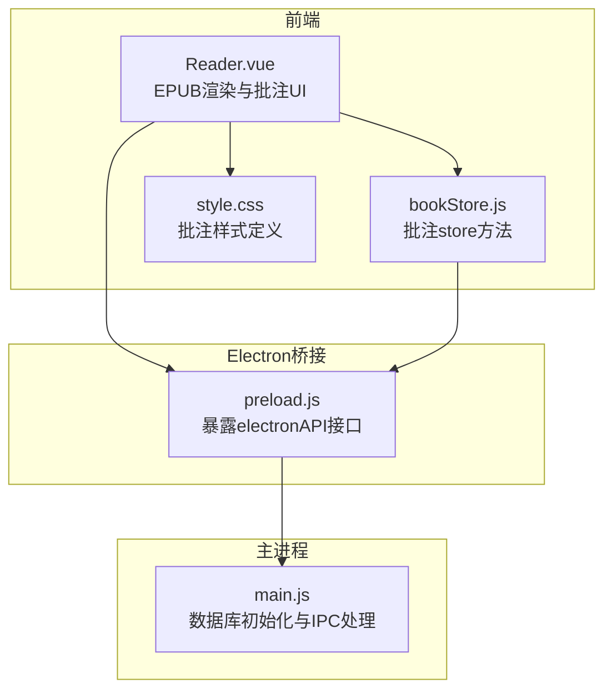
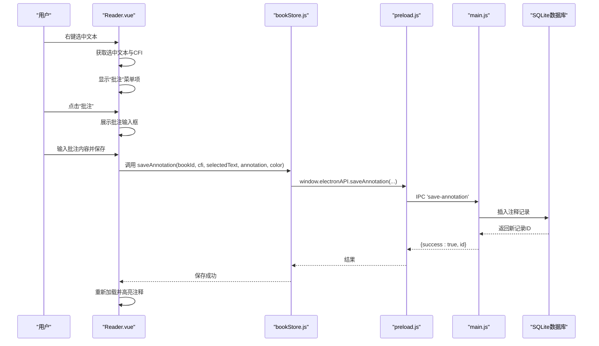
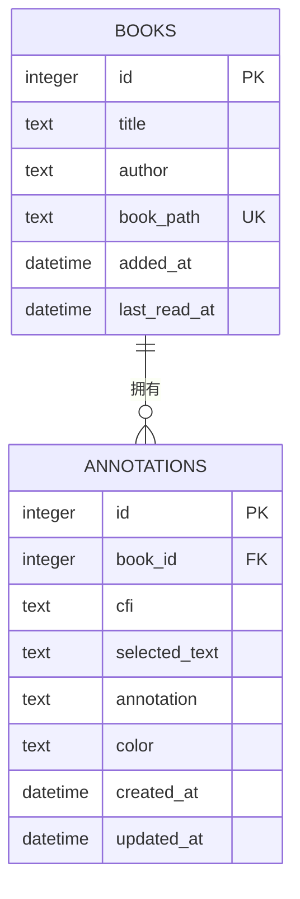
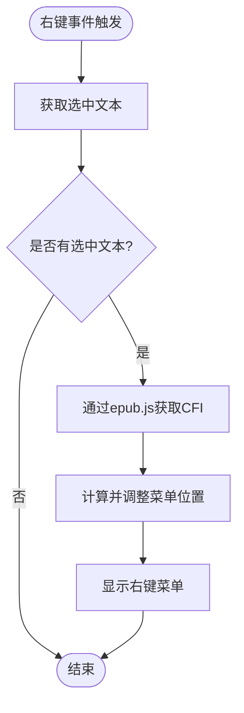
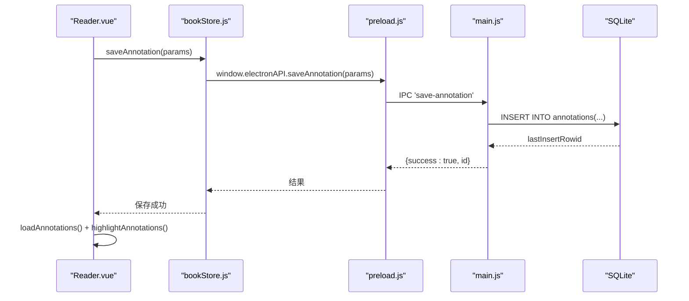
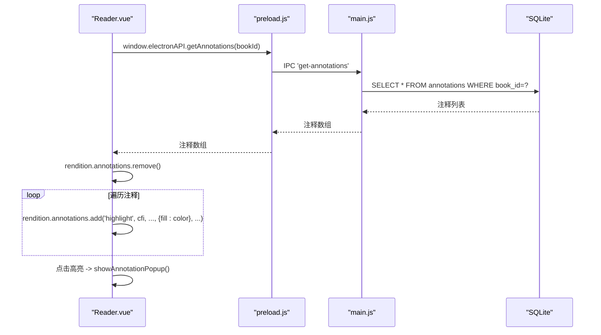
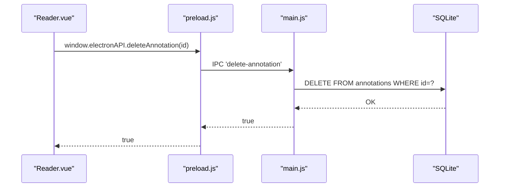
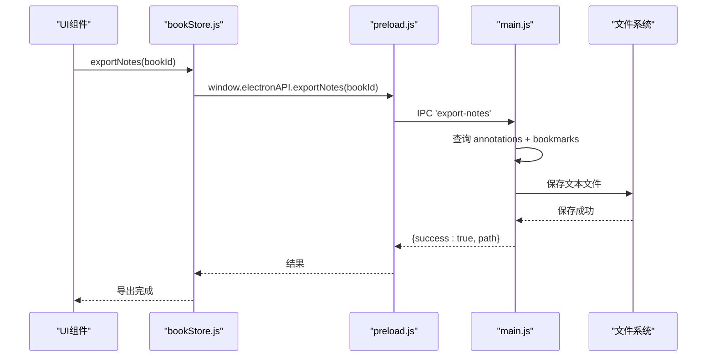
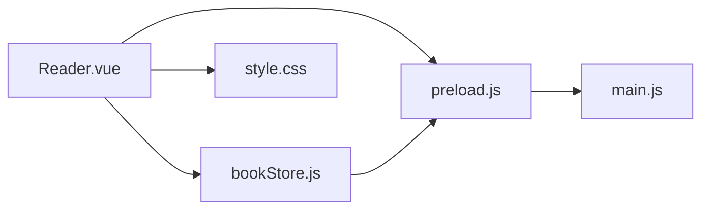

# 注释表API

<cite>
**本文档引用的文件**
- [Reader.vue](file://src/components/Reader.vue)
- [bookStore.js](file://src/stores/bookStore.js)
- [preload.js](file://electron/preload.js)
- [main.js](file://electron/main.js)
- [httpHelper.js](file://src/utils/httpHelper.js)
- [style.css](file://src/style.css)
</cite>

## 目录
1. [简介](#简介)
2. [项目结构](#项目结构)
3. [核心组件](#核心组件)
4. [架构总览](#架构总览)
5. [详细组件分析](#详细组件分析)
6. [依赖关系分析](#依赖关系分析)
7. [性能考虑](#性能考虑)
8. [故障排除指南](#故障排除指南)
9. [结论](#结论)
10. [附录](#附录)

## 简介
本文件为 ROSAA 电子书阅读器的注释表（annotations）API 完整文档，覆盖以下方面：
- 注释功能的完整实现流程：文本选择、批注创建、颜色标记、批注查看与删除
- 注释表的数据模型与字段说明：id、book_id、cfi、selected_text、annotation、color、created_at、updated_at
- 与书籍表（books）的外键关联关系
- EPUB 文本选择的 CFI 定位机制、选中文本提取与批注内容存储
- 批注的颜色系统、时间戳管理与注释列表排序规则
- 批注导出功能、文本格式化与笔记整理机制
- 注释表的查询优化、全文检索与数据备份策略

## 项目结构
本项目采用前端（Vue + Electron）架构，注释功能涉及以下模块：
- 前端组件：Reader.vue 负责 EPUB 渲染、文本选择、右键菜单、批注高亮与弹窗展示
- 状态管理：bookStore.js 提供批注相关的 store 方法，封装与 Electron IPC 的交互
- 预加载桥接：preload.js 暴露 window.electronAPI 接口，统一调用主进程 IPC
- 主进程：main.js 负责数据库初始化、注释表创建、注释 CRUD 操作与导出功能
- 工具函数：httpHelper.js 提供通用 HTTP 认证头工具（虽未直接用于注释，但体现统一的网络层设计）
- 样式：style.css 定义批注弹窗、批注框与右键菜单的 UI 样式

图表来源
- [Reader.vue:201-222](file://src/components/Reader.vue#L201-L222)
- [bookStore.js:208-232](file://src/stores/bookStore.js#L208-L232)
- [preload.js:7-101](file://electron/preload.js#L7-L101)
- [main.js:180-284](file://electron/main.js#L180-L284)

章节来源
- [Reader.vue:201-222](file://src/components/Reader.vue#L201-L222)
- [bookStore.js:208-232](file://src/stores/bookStore.js#L208-L232)
- [preload.js:7-101](file://electron/preload.js#L7-L101)
- [main.js:180-284](file://electron/main.js#L180-L284)

## 核心组件
- Reader.vue：负责 EPUB 渲染、文本选择与 CFI 获取、右键菜单触发、批注高亮与弹窗展示、批注保存与重新加载
- bookStore.js：封装批注相关的 store 方法，如 exportNotes、getAnnotations、saveAnnotation 等
- preload.js：通过 contextBridge 暴露 window.electronAPI，统一转发 IPC 调用
- main.js：数据库初始化、注释表创建、注释 CRUD 与导出逻辑
- style.css：定义批注弹窗、批注框与右键菜单的样式

章节来源
- [Reader.vue:514-562](file://src/components/Reader.vue#L514-L562)
- [bookStore.js:146-155](file://src/stores/bookStore.js#L146-L155)
- [preload.js:76-91](file://electron/preload.js#L76-L91)
- [main.js:247-261](file://electron/main.js#L247-L261)

## 架构总览
注释功能的端到端流程如下：

图表来源
- [Reader.vue:955-1012](file://src/components/Reader.vue#L955-L1012)
- [bookStore.js:208-232](file://src/stores/bookStore.js#L208-L232)
- [preload.js:80-83](file://electron/preload.js#L80-L83)
- [main.js:710-731](file://electron/main.js#L710-L731)

## 详细组件分析

### 注释表数据模型与字段说明
注释表（annotations）字段定义：
- id：自增主键
- book_id：外键，关联书籍表（books.id），级联删除
- cfi：EPUB 中的 CFI 定位字符串，用于精确回到原文位置
- selected_text：选中的原文片段
- annotation：用户的批注内容
- color：批注高亮颜色，默认值为十六进制颜色码
- created_at：创建时间，默认当前时间
- updated_at：更新时间，默认当前时间

图表来源
- [main.js:247-261](file://electron/main.js#L247-L261)

章节来源
- [main.js:247-261](file://electron/main.js#L247-L261)

### 文本选择与 CFI 定位
- 右键菜单触发：Reader.vue 监听 iframe 内部的右键事件，获取选中文本与 CFI
- CFI 获取：通过 epub.js 的 getContents 与 content.cfiFromRange 获取当前章节范围对应的 CFI
- 位置校正：若菜单超出屏幕边界，自动调整菜单位置以保证可见性

图表来源
- [Reader.vue:839-909](file://src/components/Reader.vue#L839-L909)

章节来源
- [Reader.vue:839-909](file://src/components/Reader.vue#L839-L909)

### 批注创建与保存
- 批注输入：Reader.vue 展示批注输入框，用户输入批注内容
- 参数组装：调用 window.electronAPI.saveAnnotation，传入 bookId、cfi、selectedText、annotation、color
- 主进程处理：main.js 接收 IPC 'save-annotation'，插入注释表并返回新记录 ID
- 成功反馈：Reader.vue 重新加载注释并高亮显示

图表来源
- [Reader.vue:974-1012](file://src/components/Reader.vue#L974-L1012)
- [bookStore.js:208-232](file://src/stores/bookStore.js#L208-L232)
- [preload.js:80-83](file://electron/preload.js#L80-L83)
- [main.js:710-731](file://electron/main.js#L710-L731)

章节来源
- [Reader.vue:974-1012](file://src/components/Reader.vue#L974-L1012)
- [bookStore.js:208-232](file://src/stores/bookStore.js#L208-L232)
- [preload.js:80-83](file://electron/preload.js#L80-L83)
- [main.js:710-731](file://electron/main.js#L710-L731)

### 批注高亮与弹窗展示
- 加载注释：Reader.vue 调用 window.electronAPI.getAnnotations(bookId) 获取注释列表
- 清除旧高亮：先移除现有高亮，避免重复叠加
- 添加高亮：遍历注释，使用 epub.js 的 rendition.annotations.add，按注释 color 设置填充色
- 弹窗展示：点击高亮区域显示包含原文与批注内容的弹窗，支持自动关闭

图表来源
- [Reader.vue:514-562](file://src/components/Reader.vue#L514-L562)
- [preload.js:84-86](file://electron/preload.js#L84-L86)
- [main.js:733-748](file://electron/main.js#L733-L748)

章节来源
- [Reader.vue:514-562](file://src/components/Reader.vue#L514-L562)
- [preload.js:84-86](file://electron/preload.js#L84-L86)
- [main.js:733-748](file://electron/main.js#L733-L748)

### 批注删除
- 删除入口：Reader.vue 支持删除注释（通过 preload.js 暴露的 deleteAnnotation 接口）
- 主进程处理：main.js 接收 IPC 'delete-annotation'，执行删除并返回布尔结果

图表来源
- [Reader.vue:514-562](file://src/components/Reader.vue#L514-L562)
- [preload.js:88-91](file://electron/preload.js#L88-L91)
- [main.js:750-760](file://electron/main.js#L750-L760)

章节来源
- [Reader.vue:514-562](file://src/components/Reader.vue#L514-L562)
- [preload.js:88-91](file://electron/preload.js#L88-L91)
- [main.js:750-760](file://electron/main.js#L750-L760)

### 批注导出与笔记整理
- 导出入口：bookStore.js 暴露 exportNotes(bookId)，调用 window.electronAPI.exportNotes
- 主进程处理：main.js 接收 IPC 'export-notes'，查询注释与书签，生成文本格式的笔记内容
- 输出格式：包含书籍标题、作者、导出时间、批注列表（原文、批注、时间）与书签列表（标题、备注、时间）

图表来源
- [bookStore.js:146-155](file://src/stores/bookStore.js#L146-L155)
- [preload.js:60-63](file://electron/preload.js#L60-L63)
- [main.js:533-573](file://electron/main.js#L533-L573)

章节来源
- [bookStore.js:146-155](file://src/stores/bookStore.js#L146-L155)
- [preload.js:60-63](file://electron/preload.js#L60-L63)
- [main.js:533-573](file://electron/main.js#L533-L573)

### 颜色系统与时间戳管理
- 颜色系统：注释高亮使用注释 color 字段；默认颜色在前端与后端均有默认值保障
- 时间戳：created_at 与 updated_at 字段均使用数据库默认 CURRENT_TIMESTAMP，确保一致性

章节来源
- [Reader.vue:551-556](file://src/components/Reader.vue#L551-L556)
- [main.js:255](file://electron/main.js#L255)
- [main.js:256](file://electron/main.js#L256)

### 注释列表排序规则
- 查询排序：按 created_at 升序排列，便于按时间顺序查看新增注释

章节来源
- [main.js:739-741](file://electron/main.js#L739-L741)

### 查询优化与全文检索
- 当前实现：注释查询基于 book_id 进行过滤，排序基于 created_at
- 建议优化：
  - 为 book_id、created_at 建立索引以提升查询性能
  - 若需按 selected_text 或 annotation 进行全文检索，可考虑在数据库层面引入 FTS5 扩展或在应用层进行关键词索引

章节来源
- [main.js:733-748](file://electron/main.js#L733-L748)

### 数据备份策略
- 存储信息：主进程提供 get-storage-info 接口，返回用户数据目录、书籍大小、磁盘剩余空间与数据库缓存大小
- 缓存清理：提供 clear-cache 接口，清理 WAL/SHM 文件并执行 wal_checkpoint
- 备份建议：
  - 定期复制用户数据目录下的数据库文件与上传目录
  - 结合导出功能定期生成离线笔记归档

章节来源
- [main.js:821-881](file://electron/main.js#L821-L881)
- [main.js:899-921](file://electron/main.js#L899-L921)

## 依赖关系分析
- Reader.vue 依赖 epub.js 进行渲染与 CFI 获取，依赖 bookStore.js 进行批注操作，依赖 preload.js 进行 IPC 调用
- bookStore.js 作为统一的 store 方法集合，封装与 Electron 的交互
- preload.js 作为安全桥接，仅暴露必要的 IPC 接口
- main.js 负责数据库初始化与所有注释相关 IPC 处理

图表来源
- [Reader.vue:201-222](file://src/components/Reader.vue#L201-L222)
- [bookStore.js:208-232](file://src/stores/bookStore.js#L208-L232)
- [preload.js:7-101](file://electron/preload.js#L7-L101)
- [main.js:180-284](file://electron/main.js#L180-L284)

章节来源
- [Reader.vue:201-222](file://src/components/Reader.vue#L201-L222)
- [bookStore.js:208-232](file://src/stores/bookStore.js#L208-L232)
- [preload.js:7-101](file://electron/preload.js#L7-L101)
- [main.js:180-284](file://electron/main.js#L180-L284)

## 性能考虑
- 渲染性能：epub.js 的渲染与高亮在页面渲染后进行，避免阻塞首屏显示
- 批注加载：按书籍维度批量加载注释，减少多次往返
- 数据库性能：启用 WAL 模式，合理使用索引（建议为 book_id、created_at 建立索引）
- UI 响应：批注弹窗与批注框使用固定定位与动画，保证交互流畅

## 故障排除指南
- 批注保存失败：检查 window.electronAPI.saveAnnotation 返回的错误信息，确认 bookId、cfi、selectedText、annotation、color 参数是否正确
- 注释未显示：确认 getAnnotations 查询是否返回注释列表，检查 highlightAnnotations 是否被调用
- CFI 获取失败：确认 epub.js 的 getContents 与 cfiFromRange 调用是否成功，检查 iframe 内容文档是否可访问
- 导出失败：检查 export-notes 的文件保存路径权限与磁盘空间

章节来源
- [Reader.vue:988-1012](file://src/components/Reader.vue#L988-L1012)
- [main.js:733-748](file://electron/main.js#L733-L748)
- [main.js:533-573](file://electron/main.js#L533-L573)

## 结论
本注释表 API 通过 Reader.vue、bookStore.js、preload.js 与 main.js 的协同，实现了从文本选择到批注保存、高亮展示与导出的完整闭环。注释表具备清晰的数据模型与默认值保障，结合 CFI 定位与颜色系统，提供了良好的用户体验。建议后续在数据库层面增加索引与全文检索能力，并完善批注编辑功能。

## 附录
- 批注弹窗样式定义：见 style.css 中 .annotation-popup 相关类
- 右键菜单样式定义：见 style.css 中 .context-menu、.context-menu-item 相关类
- 批注框样式定义：见 style.css 中 .annotation-box、.annotation-content 相关类

章节来源
- [style.css:527-560](file://src/style.css#L527-L560)
- [style.css:419-426](file://src/style.css#L419-L426)
- [style.css:427-479](file://src/style.css#L427-L479)