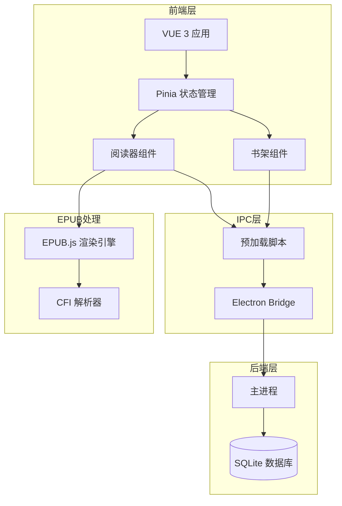
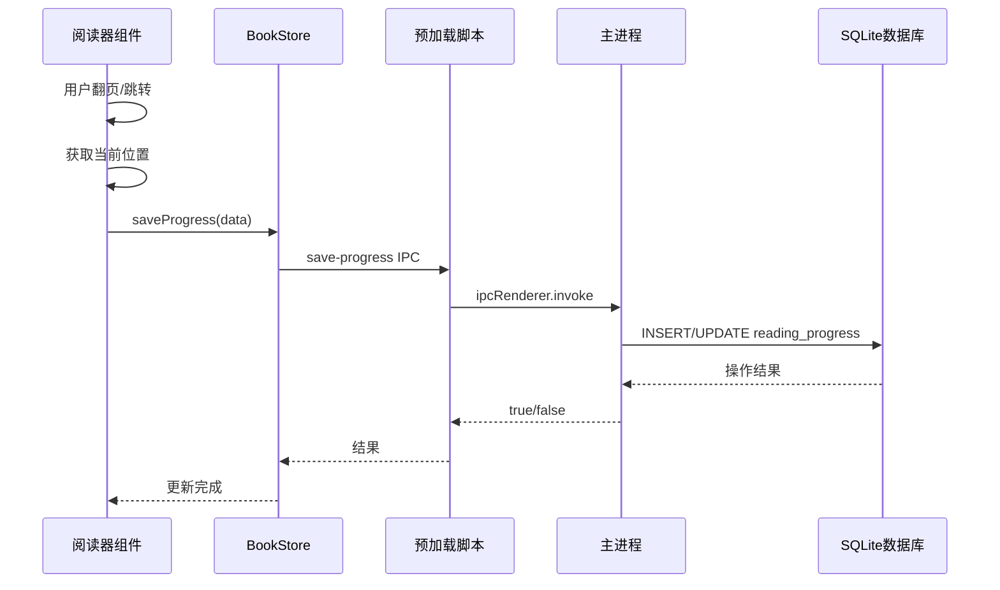
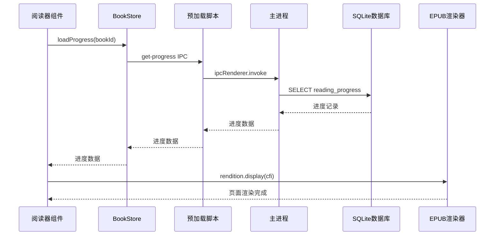
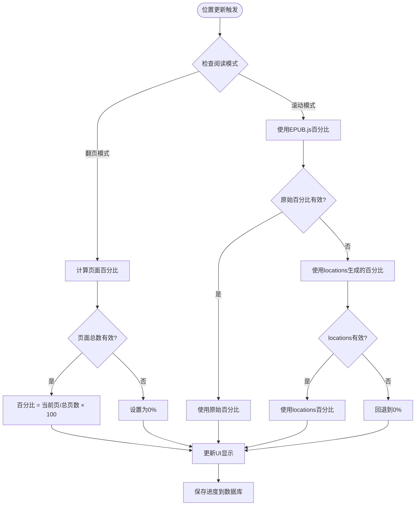
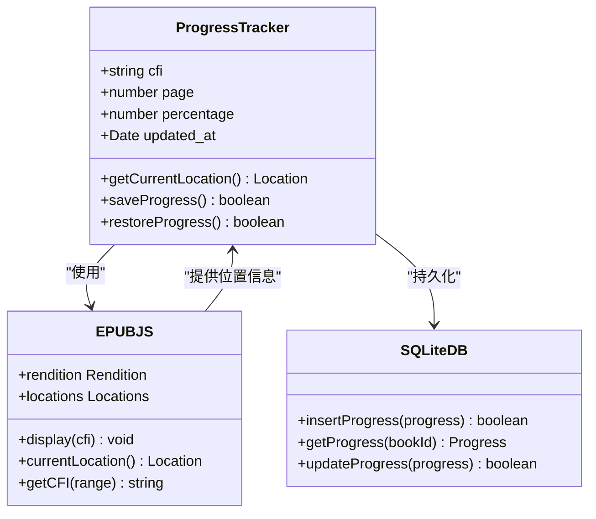
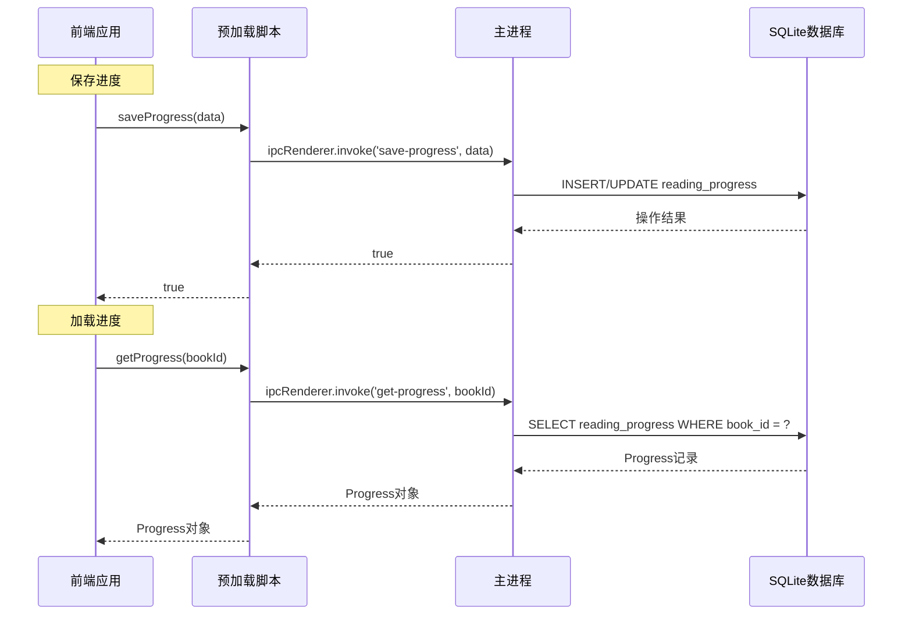
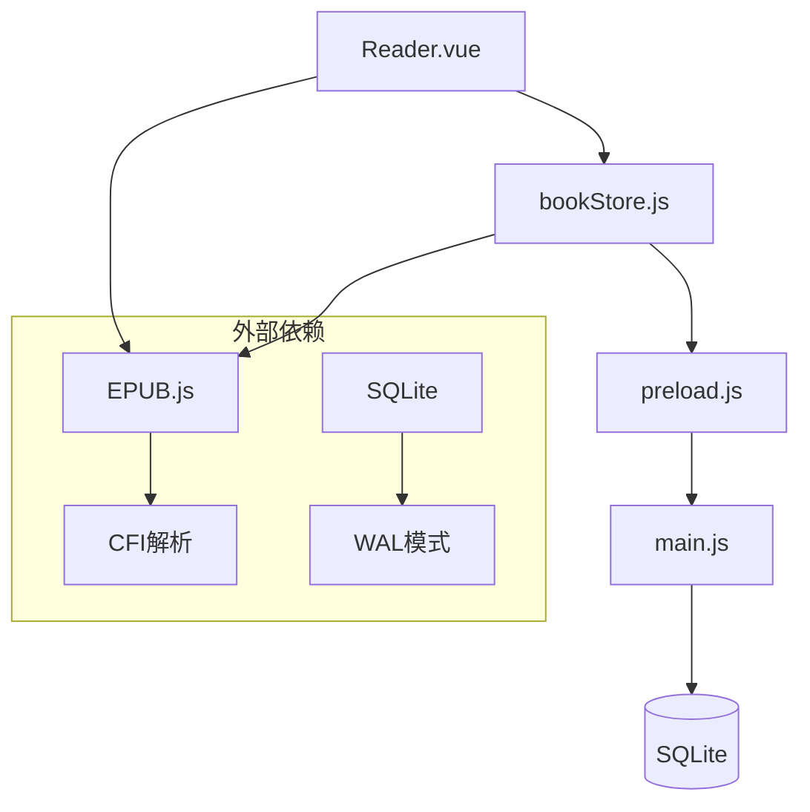
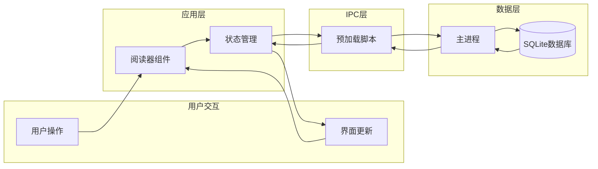
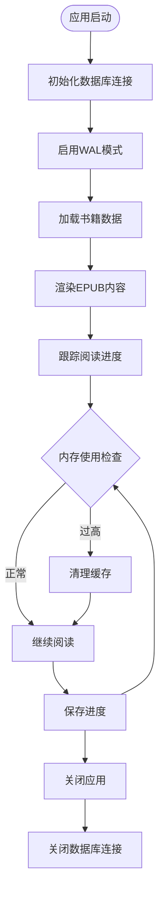

# 进度表API

<cite>
**本文档引用的文件**
- [README.md](file://README.md)
- [main.js](file://electron/main.js)
- [preload.js](file://electron/preload.js)
- [bookStore.js](file://src/stores/bookStore.js)
- [Reader.vue](file://src/components/Reader.vue)
- [pathHelper.js](file://src/utils/pathHelper.js)
- [Library.vue](file://src/components/Library.vue)
</cite>

## 目录
1. [简介](#简介)
2. [项目结构](#项目结构)
3. [核心组件](#核心组件)
4. [架构概览](#架构概览)
5. [详细组件分析](#详细组件分析)
6. [依赖关系分析](#依赖关系分析)
7. [性能考虑](#性能考虑)
8. [故障排除指南](#故障排除指南)
9. [结论](#结论)

## 简介

ROSAA电子书阅读器是一个基于Electron + Vue 3 + SQLite的现代化EPUB电子书阅读器桌面应用。本文档专注于阅读进度表API的完整实现，包括CFI位置跟踪、页码计算、阅读百分比更新等功能。

该系统实现了断点续读功能，能够精确地保存和恢复用户的阅读位置，支持EPUB文件的CFI（Canonical Fragment Identifier）解析和定位机制，确保阅读位置能够精确映射到EPUB内容。

## 项目结构

ROSAA电子书阅读器采用前后端分离的架构设计：



**图表来源**
- [main.js:1-922](file://electron/main.js#L1-L922)
- [preload.js:1-104](file://electron/preload.js#L1-L104)

**章节来源**
- [README.md:1-507](file://README.md#L1-L507)

## 核心组件

### 数据库架构

系统使用SQLite作为数据存储，采用better-sqlite3驱动实现高性能的数据访问。

#### 进度表结构

| 字段名 | 类型 | 约束 | 描述 |
|--------|------|------|------|
| id | INTEGER | PRIMARY KEY AUTOINCREMENT | 进度记录唯一标识符 |
| book_id | INTEGER | NOT NULL UNIQUE | 外键，关联书籍表 |
| cfi | TEXT | | Canonical Fragment Identifier，EPUB位置标识符 |
| page | INTEGER | DEFAULT 0 | 当前页码 |
| percentage | REAL | DEFAULT 0 | 阅读百分比 |
| updated_at | DATETIME | DEFAULT CURRENT_TIMESTAMP | 更新时间戳 |

#### 外键关系

```mermaid
erDiagram
BOOKS {
integer id PK
text title
text author
text book_path UK
datetime added_at
datetime last_read_at
}
READING_PROGRESS {
integer id PK
integer book_id UK FK
text cfi
integer page
real percentage
datetime updated_at
}
BOOKS ||--|| READING_PROGRESS : "has_one"
```

**图表来源**
- [main.js:221-232](file://electron/main.js#L221-L232)

#### 书籍表结构

| 字段名 | 类型 | 约束 | 描述 |
|--------|------|------|------|
| id | INTEGER | PRIMARY KEY AUTOINCREMENT | 书籍唯一标识符 |
| title | TEXT | NOT NULL | 书籍标题 |
| author | TEXT | | 作者信息 |
| book_path | TEXT | NOT NULL UNIQUE | EPUB文件路径 |
| file_hash | TEXT | | 文件哈希值 |
| added_at | DATETIME | DEFAULT CURRENT_TIMESTAMP | 添加时间 |
| last_read_at | DATETIME | | 最后阅读时间 |

**章节来源**
- [main.js:190-282](file://electron/main.js#L190-L282)

## 架构概览

### 进度保存流程



**图表来源**
- [Reader.vue:497-507](file://src/components/Reader.vue#L497-L507)
- [bookStore.js:169-176](file://src/stores/bookStore.js#L169-L176)
- [preload.js:16-18](file://electron/preload.js#L16-L18)
- [main.js:634-653](file://electron/main.js#L634-L653)

### 进度恢复流程



**图表来源**
- [Reader.vue:344-361](file://src/components/Reader.vue#L344-L361)
- [bookStore.js:161-167](file://src/stores/bookStore.js#L161-L167)
- [preload.js:20-22](file://electron/preload.js#L20-L22)
- [main.js:655-663](file://electron/main.js#L655-L663)

## 详细组件分析

### 阅读器组件（Reader.vue）

阅读器组件是进度表API的核心实现者，负责处理EPUB文件的渲染和位置跟踪。

#### 进度计算机制

系统实现了两种模式的进度计算：

1. **翻页模式（Paginated）**：基于页面显示信息计算百分比
2. **滚动模式（Scrolled）**：基于EPUB.js提供的百分比信息



**图表来源**
- [Reader.vue:440-495](file://src/components/Reader.vue#L440-L495)

#### CFI位置跟踪

系统使用EPUB.js的CFI（Canonical Fragment Identifier）机制来精确跟踪阅读位置：



**图表来源**
- [Reader.vue:310-326](file://src/components/Reader.vue#L310-L326)
- [Reader.vue:497-507](file://src/components/Reader.vue#L497-L507)

**章节来源**
- [Reader.vue:440-507](file://src/components/Reader.vue#L440-L507)

### 状态管理（bookStore.js）

Pinia状态管理器提供了统一的API接口，封装了所有数据库操作。

#### API接口定义

| 方法名 | 参数 | 返回值 | 描述 |
|--------|------|--------|------|
| loadProgress | bookId: number | Promise<Progress> | 加载指定书籍的阅读进度 |
| saveProgress | data: ProgressData | Promise<boolean> | 保存阅读进度到数据库 |
| loadBookmarks | bookId: number | Promise<Bookmark[]> | 加载书签列表 |
| addBookmark | data: BookmarkData | Promise<Bookmark> | 添加新书签 |
| deleteBookmark | bookmarkId: number | Promise<boolean> | 删除指定书签 |

**章节来源**
- [bookStore.js:161-206](file://src/stores/bookStore.js#L161-L206)

### IPC通信层

预加载脚本暴露了完整的API接口给前端应用：

#### 进度相关IPC接口



**图表来源**
- [preload.js:16-23](file://electron/preload.js#L16-L23)
- [main.js:634-663](file://electron/main.js#L634-L663)

**章节来源**
- [preload.js:7-101](file://electron/preload.js#L7-L101)

### 数据库操作

主进程负责所有数据库操作，使用SQLite的ON CONFLICT子句实现智能更新。

#### 进度保存SQL语句

```sql
INSERT INTO reading_progress (book_id, cfi, page, percentage)
VALUES (?, ?, ?, ?)
ON CONFLICT(book_id) DO UPDATE SET
  cfi = excluded.cfi,
  page = excluded.page,
  percentage = excluded.percentage,
  updated_at = CURRENT_TIMESTAMP
```

**章节来源**
- [main.js:634-649](file://electron/main.js#L634-L649)

## 依赖关系分析

### 组件耦合度



**图表来源**
- [Reader.vue:162-166](file://src/components/Reader.vue#L162-L166)
- [bookStore.js:1-4](file://src/stores/bookStore.js#L1-L4)

### 数据流图



**图表来源**
- [main.js:1-922](file://electron/main.js#L1-L922)
- [preload.js:1-104](file://electron/preload.js#L1-L104)

**章节来源**
- [main.js:167-284](file://electron/main.js#L167-L284)

## 性能考虑

### 数据库优化

系统采用了多种优化策略来提升性能：

1. **WAL模式**：启用Write-Ahead Logging模式提升并发性能
2. **索引优化**：为常用查询字段建立适当的索引
3. **批量操作**：使用事务处理批量数据操作

### 内存管理



**图表来源**
- [main.js:185-187](file://electron/main.js#L185-L187)
- [main.js:899-921](file://electron/main.js#L899-L921)

### 缓存策略

系统实现了多层缓存机制：

1. **内存缓存**：Pinia状态管理器缓存当前书籍进度
2. **数据库缓存**：SQLite WAL文件缓存最近访问的数据
3. **文件缓存**：EPUB文件和封面图片的本地缓存

**章节来源**
- [main.js:899-921](file://electron/main.js#L899-L921)

## 故障排除指南

### 常见问题及解决方案

#### 进度保存失败

**症状**：阅读进度无法保存到数据库

**可能原因**：
1. 数据库连接异常
2. SQL语法错误
3. 外键约束冲突

**解决方案**：
1. 检查数据库文件权限
2. 验证book_id的有效性
3. 确认书籍记录存在

#### 进度恢复失败

**症状**：应用启动时无法恢复之前的阅读位置

**可能原因**：
1. CFI位置无效
2. EPUB文件损坏
3. 数据库记录缺失

**解决方案**：
1. 检查CFI格式正确性
2. 验证EPUB文件完整性
3. 重新添加书籍文件

#### 性能问题

**症状**：应用响应缓慢，特别是在大量书籍场景

**优化建议**：
1. 定期清理数据库WAL文件
2. 优化书籍索引
3. 实施分页加载策略

**章节来源**
- [main.js:634-653](file://electron/main.js#L634-L653)
- [Reader.vue:418-425](file://src/components/Reader.vue#L418-L425)

## 结论

ROSAA电子书阅读器的进度表API实现了完整的断点续读功能，具有以下特点：

1. **精确的位置跟踪**：使用CFI机制确保阅读位置的精确映射
2. **双模式支持**：同时支持翻页模式和滚动模式的进度计算
3. **智能恢复机制**：自动检测和处理无效位置，提供优雅降级
4. **高性能设计**：采用SQLite WAL模式和多层缓存策略
5. **可靠的持久化**：使用ON CONFLICT子句实现智能数据更新

该系统为用户提供了无缝的阅读体验，能够在不同设备和应用重启之间保持阅读进度的一致性和准确性。