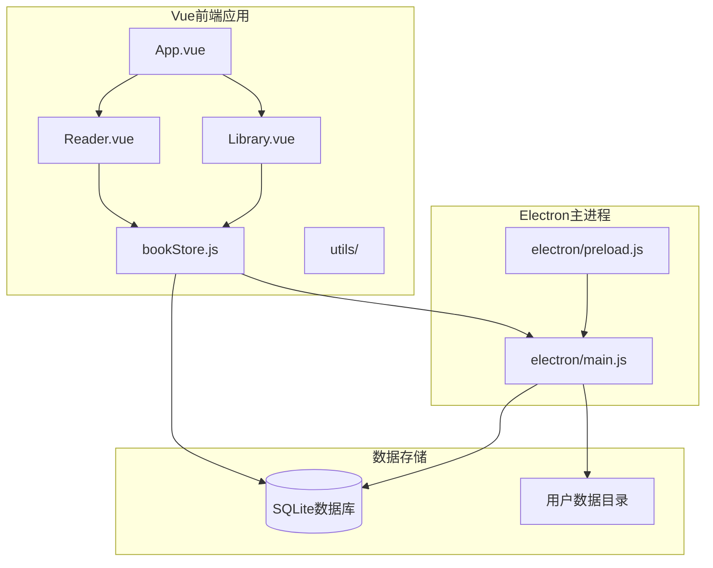
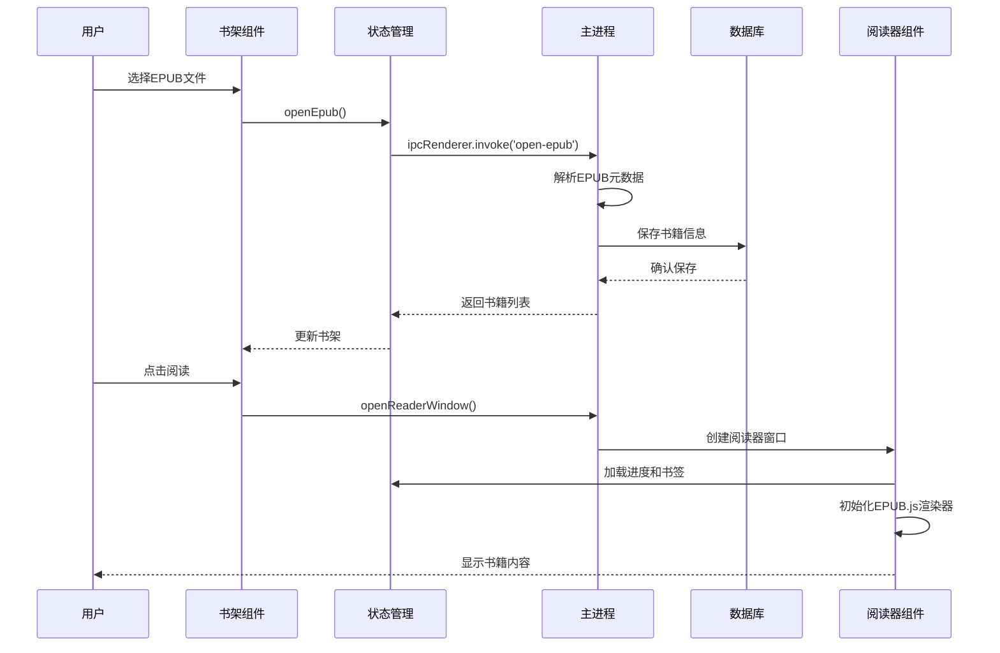
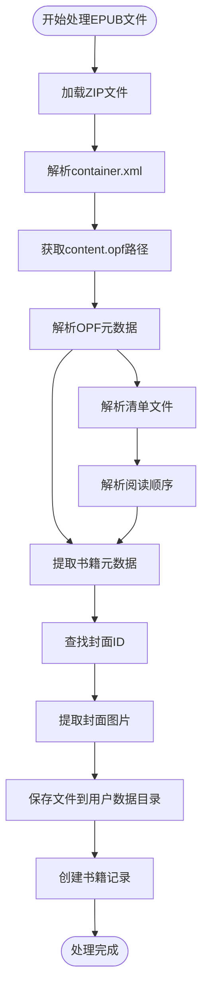
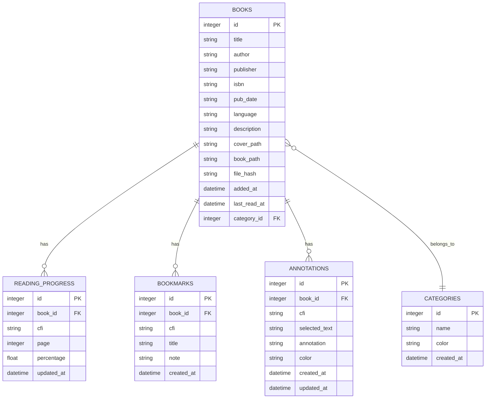
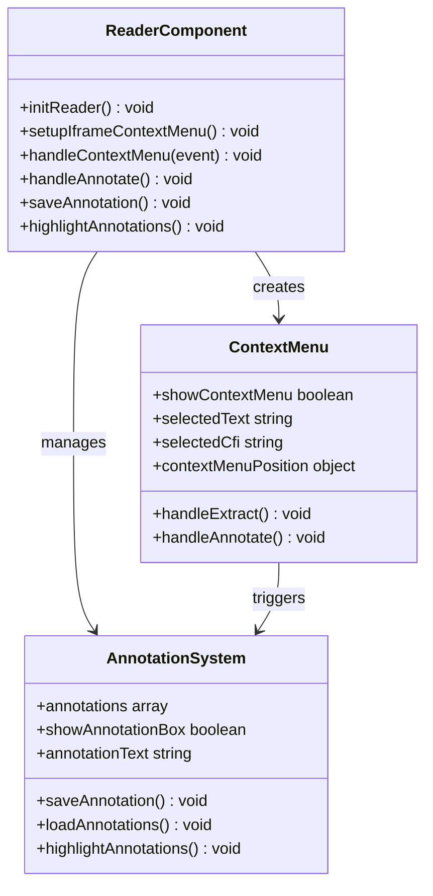
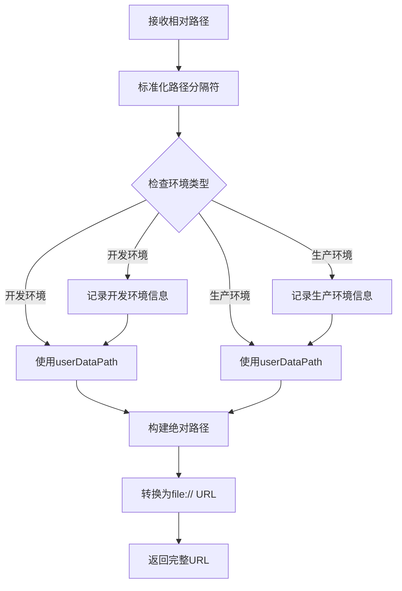
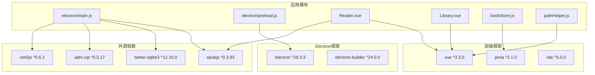

# EPUB处理系统

<cite>
**本文档引用的文件**
- [README.md](file://README.md)
- [package.json](file://package.json)
- [vite.config.js](file://vite.config.js)
- [electron/main.js](file://electron/main.js)
- [electron/preload.js](file://electron/preload.js)
- [src/main.js](file://src/main.js)
- [src/App.vue](file://src/App.vue)
- [src/components/Library.vue](file://src/components/Library.vue)
- [src/components/Reader.vue](file://src/components/Reader.vue)
- [src/stores/bookStore.js](file://src/stores/bookStore.js)
- [src/utils/pathHelper.js](file://src/utils/pathHelper.js)
- [src/utils/httpHelper.js](file://src/utils/httpHelper.js)
- [docs/PATH_COMPATIBILITY.md](file://docs/PATH_COMPATIBILITY.md)
</cite>

## 目录
1. [简介](#简介)
2. [项目结构](#项目结构)
3. [核心组件](#核心组件)
4. [架构概览](#架构概览)
5. [详细组件分析](#详细组件分析)
6. [依赖关系分析](#依赖关系分析)
7. [性能考虑](#性能考虑)
8. [故障排除指南](#故障排除指南)
9. [结论](#结论)
10. [附录](#附录)

## 简介

EPUB Reader是一个基于Electron + Vue 3 + SQLite的现代化EPUB电子书阅读器桌面应用。该系统专注于EPUB文件的完整处理流程，从文件解析到渲染显示，提供流畅的阅读体验。

### 主要特性
- **EPUB文件解析**：支持ZIP解压、元数据提取、封面获取
- **EPUB.js渲染引擎**：提供高质量的EPUB内容渲染
- **跨平台兼容**：支持Windows、macOS、Linux操作系统
- **数据持久化**：使用SQLite数据库存储所有用户数据
- **书签系统**：支持添加、管理和快速跳转书签
- **批注功能**：支持文本选择和批注管理
- **双模式阅读**：支持翻页模式和滚动模式切换

## 项目结构

该项目采用典型的Electron + Vue 3架构，分为前端界面层和后端处理层：

**图表来源**
- [electron/main.js:1-820](file://electron/main.js#L1-L820)
- [src/App.vue:1-64](file://src/App.vue#L1-L64)
- [src/components/Library.vue:1-1291](file://src/components/Library.vue#L1-L1291)
- [src/components/Reader.vue:1-1026](file://src/components/Reader.vue#L1-L1026)

**章节来源**
- [README.md:167-193](file://README.md#L167-L193)
- [package.json:1-82](file://package.json#L1-L82)

## 核心组件

### EPUB处理引擎

系统的核心在于对EPUB文件格式的完整支持，包括标准的OPF元数据文件、NCX目录文件和HTML内容文件的处理。

#### EPUB文件格式标准支持

EPUB文件本质上是ZIP压缩包，包含以下关键组件：

1. **META-INF/container.xml** - 容器配置文件，指向content.opf的路径
2. **content.opf** - OPF元数据文件，包含书籍元数据和清单
3. **目录文件** - NCX或Nav文件，定义书籍目录结构
4. **内容文件** - HTML文档、CSS样式和媒体文件

#### EPUB.js集成配置

系统集成了EPUB.js渲染引擎，提供以下配置选项：

- **渲染模式**：支持翻页模式(flow: 'paginated')和滚动模式(flow: 'scrolled')
- **主题定制**：可自定义字体大小、颜色等样式
- **交互功能**：支持书签、批注、目录导航等
- **性能优化**：支持后台生成位置索引，提升导航性能

**章节来源**
- [src/components/Reader.vue:260-277](file://src/components/Reader.vue#L260-L277)
- [src/components/Reader.vue:669-684](file://src/components/Reader.vue#L669-L684)

## 架构概览

系统采用分层架构设计，确保前后端分离和职责明确：

**图表来源**
- [src/components/Library.vue:365-387](file://src/components/Library.vue#L365-L387)
- [src/stores/bookStore.js:71-104](file://src/stores/bookStore.js#L71-L104)
- [electron/main.js:343-427](file://electron/main.js#L343-L427)

## 详细组件分析

### 主进程处理流程

主进程负责EPUB文件的底层处理，包括文件解析、元数据提取和数据持久化。

#### EPUB元数据提取流程

**图表来源**
- [electron/main.js:32-147](file://electron/main.js#L32-L147)

#### 数据库设计

系统使用SQLite数据库存储所有数据，采用规范化设计：

**图表来源**
- [electron/main.js:167-284](file://electron/main.js#L167-L284)

**章节来源**
- [electron/main.js:32-147](file://electron/main.js#L32-L147)
- [electron/main.js:167-284](file://electron/main.js#L167-L284)

### 前端渲染组件

阅读器组件基于EPUB.js提供高质量的EPUB内容渲染，支持多种阅读模式和交互功能。

#### EPUB.js渲染配置

系统为EPUB.js设置了专门的渲染配置：

| 配置项 | 值 | 说明 |
|--------|-----|------|
| width | '100%' | 容器宽度 |
| height | '100%' | 容器高度 |
| flow | 'paginated' | 翻页模式 |
| spread | 'none' | 单页显示 |
| minSpreadWidth | 0 | 最小展开宽度 |
| manager | 'continuous' | 滚动模式管理器 |
| overflow | 'auto' | 溢出处理 |

#### 右键菜单系统

系统实现了完整的右键菜单功能，支持文本选择和批注操作：

**图表来源**
- [src/components/Reader.vue:763-1026](file://src/components/Reader.vue#L763-L1026)

**章节来源**
- [src/components/Reader.vue:763-1026](file://src/components/Reader.vue#L763-L1026)

### 路径处理机制

系统实现了跨平台的文件路径处理机制，确保在开发和生产环境中的一致性。

#### 路径构建算法

**图表来源**
- [src/utils/pathHelper.js:13-53](file://src/utils/pathHelper.js#L13-L53)

#### 路径兼容性保证

系统通过以下机制确保路径处理的可靠性：

1. **统一存储位置**：所有用户文件统一存储在用户数据目录中
2. **相对路径存储**：数据库中存储相对路径，便于迁移
3. **环境检测**：自动检测开发和生产环境差异
4. **错误处理**：完善的路径验证和错误处理机制

**章节来源**
- [src/utils/pathHelper.js:13-53](file://src/utils/pathHelper.js#L13-L53)
- [docs/PATH_COMPATIBILITY.md:1-191](file://docs/PATH_COMPATIBILITY.md#L1-L191)

## 依赖关系分析

系统依赖关系清晰，各模块职责明确：

**图表来源**
- [package.json:22-41](file://package.json#L22-L41)
- [electron/main.js:1-8](file://electron/main.js#L1-L8)

**章节来源**
- [package.json:22-41](file://package.json#L22-L41)

## 性能考虑

系统在多个层面进行了性能优化：

### 渲染性能优化

1. **延迟初始化**：阅读器组件采用延迟初始化策略，先显示内容再生成位置索引
2. **后台处理**：位置索引生成在后台异步执行，不阻塞主线程
3. **内存管理**：及时销毁EPUB.js实例和相关资源

### 数据库性能优化

1. **WAL模式**：启用Write-Ahead Logging提高并发性能
2. **索引设计**：为常用查询字段建立索引
3. **事务处理**：批量操作使用事务提高效率

### 文件处理优化

1. **增量更新**：使用文件哈希避免重复处理相同文件
2. **缓存机制**：封面和书籍文件缓存减少I/O操作
3. **异步处理**：文件操作采用异步方式不阻塞UI线程

## 故障排除指南

### 常见问题及解决方案

#### EPUB文件解析失败

**问题症状**：添加EPUB文件时报错，无法识别文件格式

**可能原因**：
1. EPUB文件损坏或格式不正确
2. 缺少必要的元数据文件
3. ZIP文件结构不符合EPUB标准

**解决方案**：
1. 验证EPUB文件完整性
2. 使用EPUB校验工具检查文件格式
3. 重新生成EPUB文件

#### 封面显示问题

**问题症状**：书籍封面无法显示或显示异常

**可能原因**：
1. 封面文件路径错误
2. 封面格式不受支持
3. 文件权限问题

**解决方案**：
1. 检查数据库中的封面路径
2. 验证封面文件格式（JPG/PNG）
3. 确认文件权限设置

#### 阅读器渲染问题

**问题症状**：EPUB内容无法正确渲染或显示异常

**可能原因**：
1. EPUB.js版本兼容性问题
2. CSS样式冲突
3. 资源文件缺失

**解决方案**：
1. 更新EPUB.js到最新版本
2. 检查自定义CSS样式
3. 验证EPUB文件资源完整性

#### 路径处理错误

**问题症状**：文件路径错误导致功能异常

**可能原因**：
1. 开发环境与生产环境路径差异
2. 跨平台路径分隔符问题
3. 相对路径解析错误

**解决方案**：
1. 使用统一的路径处理工具
2. 确保路径分隔符标准化
3. 验证用户数据目录权限

**章节来源**
- [docs/PATH_COMPATIBILITY.md:155-191](file://docs/PATH_COMPATIBILITY.md#L155-L191)

## 结论

EPUB Reader系统通过精心设计的架构和完善的EPUB处理机制，为用户提供了可靠的电子书阅读体验。系统的主要优势包括：

1. **完整的EPUB支持**：严格按照EPUB标准处理文件格式
2. **跨平台兼容**：统一的路径处理机制确保多平台一致性
3. **高性能渲染**：优化的EPUB.js集成提供流畅的阅读体验
4. **数据持久化**：可靠的SQLite数据库存储用户数据
5. **扩展性强**：模块化的架构便于功能扩展和维护

该系统为EPUB文件处理提供了一个完整的解决方案，适合进一步的功能扩展和企业级应用部署。

## 附录

### API接口参考

系统提供了完整的IPC通信接口，前端通过预加载脚本访问：

#### EPUB文件操作
- `openEpub()` - 打开EPUB文件对话框
- `exportBook(bookId)` - 导出书籍文件
- `deleteBookCompletely(bookId)` - 彻底删除书籍

#### 数据管理
- `getBooks(categoryId)` - 获取书籍列表
- `getCategories()` - 获取分类列表
- `saveProgress(data)` - 保存阅读进度

#### 用户交互
- `addBookmark(data)` - 添加书签
- `getBookmarks(bookId)` - 获取书签列表
- `saveAnnotation(data)` - 保存批注

### 配置选项

#### EPUB.js渲染配置
- `flow`: 'paginated' | 'scrolled'
- `width`: '100%'
- `height`: '100%'
- `spread`: 'none'
- `minSpreadWidth`: 0

#### 数据库配置
- `journal_mode = WAL`
- 支持外键约束
- 自动迁移机制