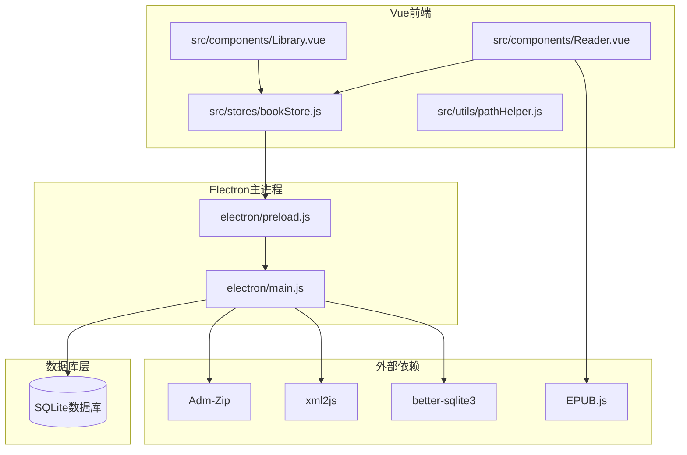
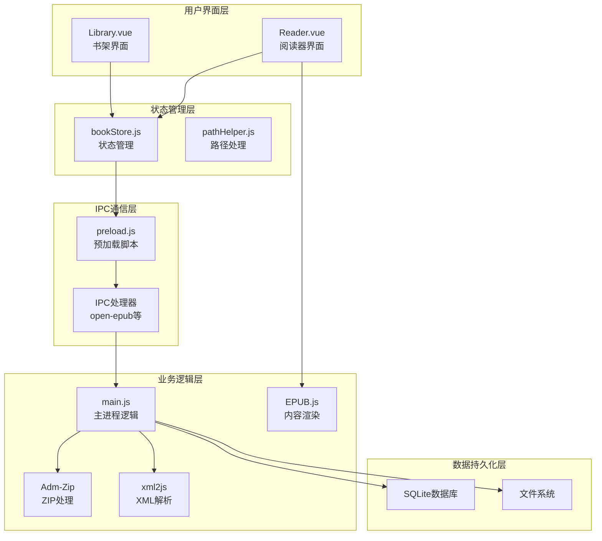
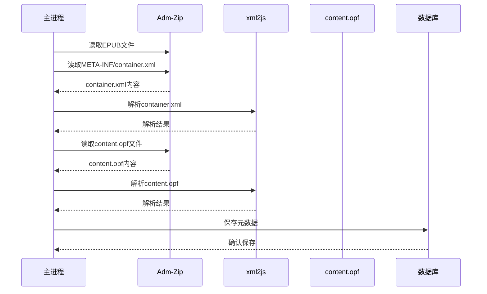
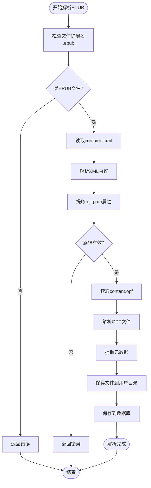
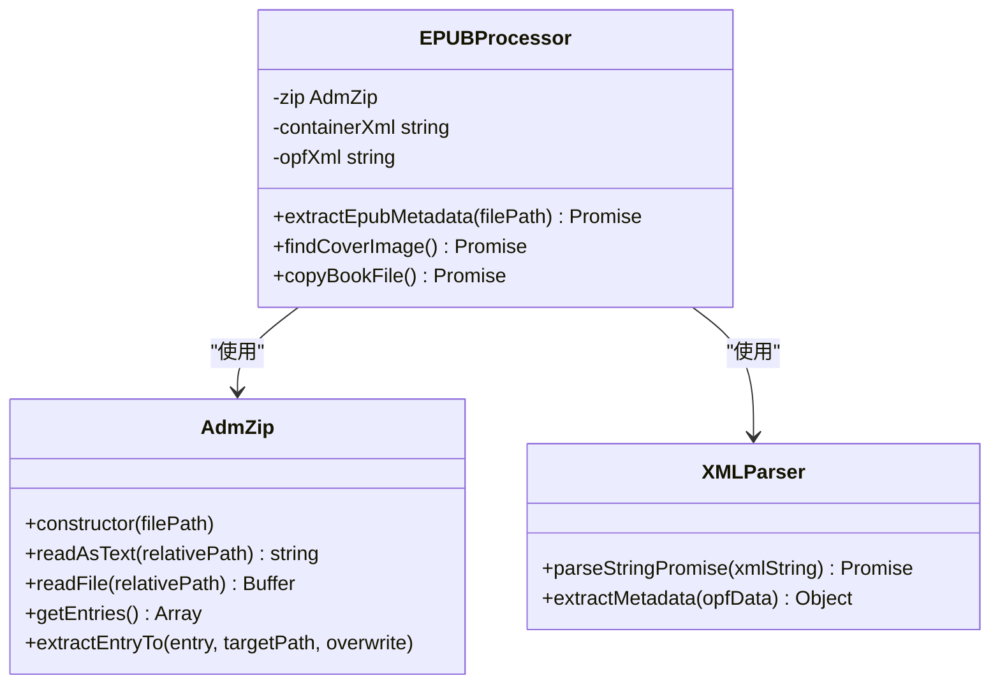
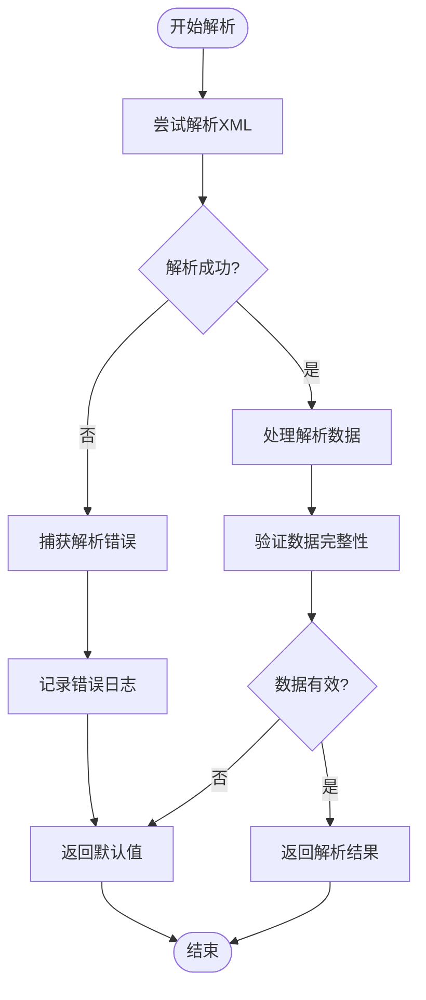
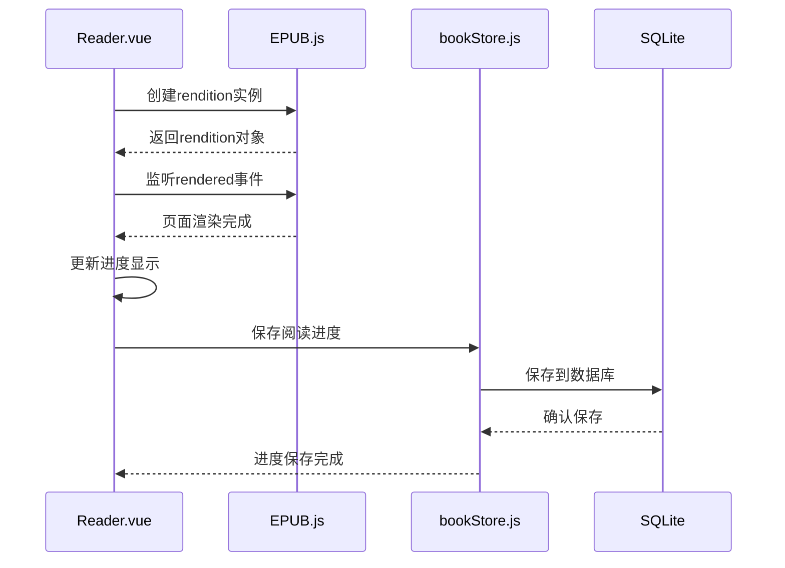
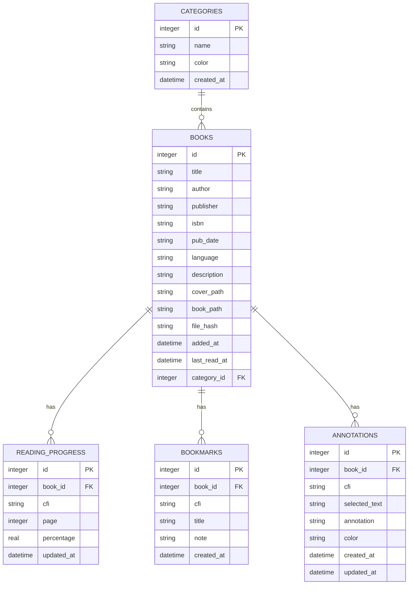
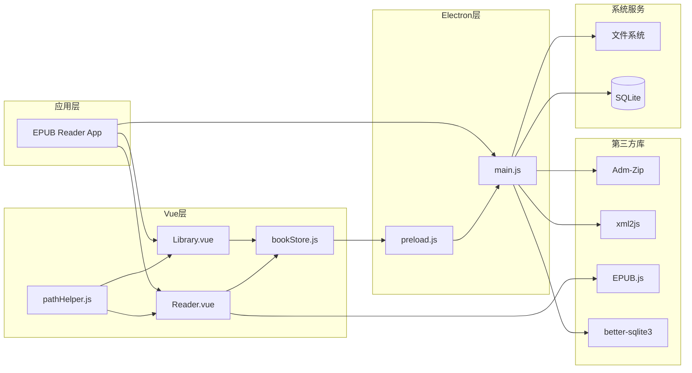
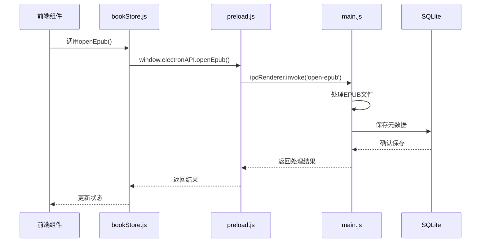

# EPUB文件解析

<cite>
**本文档引用的文件**
- [README.md](file://README.md)
- [package.json](file://package.json)
- [main.js](file://electron/main.js)
- [preload.js](file://electron/preload.js)
- [Reader.vue](file://src/components/Reader.vue)
- [Library.vue](file://src/components/Library.vue)
- [bookStore.js](file://src/stores/bookStore.js)
- [pathHelper.js](file://src/utils/pathHelper.js)
</cite>

## 目录
1. [简介](#简介)
2. [项目结构](#项目结构)
3. [核心组件](#核心组件)
4. [架构概览](#架构概览)
5. [详细组件分析](#详细组件分析)
6. [依赖关系分析](#依赖关系分析)
7. [性能考虑](#性能考虑)
8. [故障排除指南](#故障排除指南)
9. [结论](#结论)

## 简介

EPUB Reader是一个基于Electron + Vue 3 + SQLite的现代化EPUB电子书阅读器桌面应用。该项目实现了完整的EPUB文件解析、渲染和管理功能，支持书架管理、阅读功能、书签系统、目录导航、进度保存、字体调整、批注功能等特性。

EPUB（Electronic Publication）是一种开放标准的电子书格式，基于ZIP压缩容器和XML文档结构。本项目通过Adm-Zip库处理ZIP压缩，通过xml2js解析XML元数据，通过EPUB.js实现EPUB文件的渲染和展示。

## 项目结构

该项目采用典型的Electron + Vue 3架构，主要分为以下几个部分：

**图表来源**
- [main.js:1-820](file://electron/main.js#L1-L820)
- [package.json:1-82](file://package.json#L1-L82)

**章节来源**
- [README.md:167-193](file://README.md#L167-L193)
- [package.json:22-29](file://package.json#L22-L29)

## 核心组件

### EPUB解析引擎

项目的核心EPUB解析功能由Electron主进程负责，主要通过以下组件实现：

1. **Adm-Zip库**：处理EPUB文件的ZIP压缩容器
2. **xml2js库**：解析EPUB元数据文件（container.xml、content.opf）
3. **EPUB.js**：渲染和展示EPUB内容
4. **better-sqlite3**：SQLite数据库操作

### 文件处理流程

EPUB文件处理遵循以下标准流程：

1. **ZIP容器解析**：使用Adm-Zip读取EPUB文件
2. **元数据提取**：解析container.xml定位content.opf文件
3. **OPF文件解析**：提取书籍元数据和内容清单
4. **文件复制**：将EPUB文件和封面复制到用户数据目录
5. **数据库存储**：保存元数据到SQLite数据库

**章节来源**
- [main.js:32-147](file://electron/main.js#L32-L147)
- [package.json:22-29](file://package.json#L22-L29)

## 架构概览

系统采用分层架构设计，清晰分离了职责：

**图表来源**
- [main.js:343-427](file://electron/main.js#L343-L427)
- [preload.js:7-92](file://electron/preload.js#L7-L92)
- [bookStore.js:1-234](file://src/stores/bookStore.js#L1-L234)

## 详细组件分析

### EPUB元数据提取组件

#### container.xml解析流程

container.xml是EPUB文件的入口配置文件，定义了content.opf文件的位置：

**图表来源**
- [main.js:33-147](file://electron/main.js#L33-L147)

#### MIME类型验证机制

系统通过以下方式验证EPUB文件的有效性：

1. **文件扩展名检查**：确保文件扩展名为.epub
2. **ZIP格式验证**：确认文件为有效的ZIP压缩格式
3. **必需文件检查**：验证container.xml存在
4. **OPF文件验证**：确认content.opf文件可读

#### content.opf文件路径定位

content.opf文件路径通过container.xml中的full-path属性确定：

**图表来源**
- [main.js:38-56](file://electron/main.js#L38-L56)

**章节来源**
- [main.js:32-147](file://electron/main.js#L32-L147)

### Adm-Zip库使用详解

#### ZIP文件解压流程

Adm-Zip库提供了完整的ZIP文件处理能力：

1. **文件读取**：通过AdmZip(filePath)创建实例
2. **文件列表**：获取ZIP包内所有文件
3. **内容提取**：按需读取特定文件内容
4. **文件操作**：支持读取、写入、删除等操作

#### 容器文件处理

**图表来源**
- [main.js:36-147](file://electron/main.js#L36-L147)

**章节来源**
- [main.js:36-147](file://electron/main.js#L36-L147)

### XML解析器配置与错误处理

#### xml2js配置选项

系统使用xml2js库进行XML解析，主要配置包括：

1. **Promise支持**：使用parseStringPromise()异步解析
2. **属性访问**：通过$符号访问XML属性
3. **数组处理**：正确处理重复元素
4. **错误处理**：捕获解析异常

#### 错误处理机制

XML解析采用多层次错误处理策略：

**图表来源**
- [main.js:44-56](file://electron/main.js#L44-L56)

**章节来源**
- [main.js:44-56](file://electron/main.js#L44-L56)

### EPUB.js渲染引擎集成

#### 渲染配置选项

Reader.vue组件使用EPUB.js进行内容渲染，主要配置包括：

1. **尺寸设置**：width: '100%', height: '100%'
2. **流式布局**：flow: 'paginated'
3. **间距设置**：spread: 'none'
4. **主题定制**：自定义字体大小

#### 进度跟踪机制

**图表来源**
- [Reader.vue:232-425](file://src/components/Reader.vue#L232-L425)

**章节来源**
- [Reader.vue:232-425](file://src/components/Reader.vue#L232-L425)

### 数据库完整性检查

#### SQLite数据库设计

系统使用better-sqlite3库管理SQLite数据库，包含以下核心表：

1. **books表**：存储EPUB书籍信息
2. **reading_progress表**：存储阅读进度
3. **bookmarks表**：存储书签信息
4. **annotations表**：存储批注信息
5. **categories表**：存储分类信息

#### 数据完整性保障

**图表来源**
- [main.js:167-284](file://electron/main.js#L167-L284)

**章节来源**
- [main.js:167-284](file://electron/main.js#L167-L284)

## 依赖关系分析

### 核心依赖关系

**图表来源**
- [package.json:22-29](file://package.json#L22-L29)
- [main.js:1-820](file://electron/main.js#L1-L820)

### IPC通信流程

**图表来源**
- [bookStore.js:71-104](file://src/stores/bookStore.js#L71-L104)
- [preload.js:8-11](file://electron/preload.js#L8-L11)

**章节来源**
- [bookStore.js:71-104](file://src/stores/bookStore.js#L71-L104)
- [preload.js:8-11](file://electron/preload.js#L8-L11)

## 性能考虑

### ZIP文件处理优化

1. **内存管理**：使用流式读取避免大文件内存溢出
2. **并发处理**：多EPUB文件处理时采用队列机制
3. **缓存策略**：已处理文件的元数据缓存

### XML解析性能

1. **异步解析**：使用Promise避免阻塞主线程
2. **增量处理**：只解析必要的元数据字段
3. **错误恢复**：部分字段解析失败不影响整体流程

### 渲染性能优化

1. **懒加载**：EPUB内容按需渲染
2. **进度生成**：后台生成阅读进度，不阻塞UI
3. **主题缓存**：自定义主题配置缓存

## 故障排除指南

### 常见EPUB解析问题

#### EPUB文件损坏

**症状**：解析失败，返回错误信息
**解决方案**：
1. 验证EPUB文件完整性
2. 检查ZIP压缩格式
3. 确认必需文件存在

#### container.xml解析失败

**症状**：找不到content.opf文件路径
**解决方案**：
1. 检查container.xml格式
2. 验证full-path属性值
3. 确认OPF文件路径正确

#### XML解析异常

**症状**：XML解析抛出异常
**解决方案**：
1. 检查XML编码格式
2. 验证XML结构合法性
3. 处理特殊字符转义

### 数据库相关问题

#### 文件哈希冲突

**症状**：重复添加相同文件
**解决方案**：
1. 检查file_hash字段唯一性
2. 验证文件内容一致性
3. 清理重复记录

#### 进度保存失败

**症状**：阅读进度无法保存
**解决方案**：
1. 检查数据库连接状态
2. 验证CFI格式有效性
3. 确认book_id关联正确

### 前端渲染问题

#### EPUB内容加载失败

**症状**：阅读器无法显示EPUB内容
**解决方案**：
1. 检查文件URL构建
2. 验证用户数据目录权限
3. 确认EPUB.js版本兼容性

#### 右键菜单功能异常

**症状**：批注和摘抄功能失效
**解决方案**：
1. 检查iframe内容访问权限
2. 验证CFI生成机制
3. 确认selection对象有效性

**章节来源**
- [main.js:137-146](file://electron/main.js#L137-L146)
- [Reader.vue:810-939](file://src/components/Reader.vue#L810-L939)

## 结论

本EPUB文件解析系统实现了完整的EPUB格式支持，包括：

1. **标准兼容性**：严格遵循EPUB 2.0/3.0标准
2. **性能优化**：采用异步处理和缓存机制
3. **错误处理**：完善的异常捕获和恢复机制
4. **用户体验**：流畅的阅读体验和丰富的功能特性

系统通过合理的架构设计和组件分离，为EPUB电子书阅读提供了稳定可靠的技术基础。未来可以在以下方面进一步改进：

1. **格式扩展**：支持更多EPUB版本和扩展格式
2. **性能提升**：优化大文件处理和渲染性能
3. **功能增强**：增加更多阅读辅助功能
4. **兼容性**：提升跨平台兼容性和移动端支持