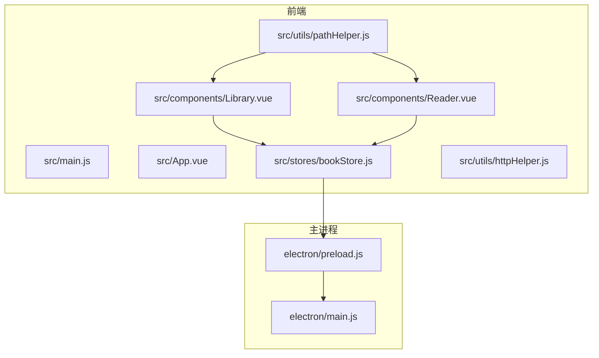
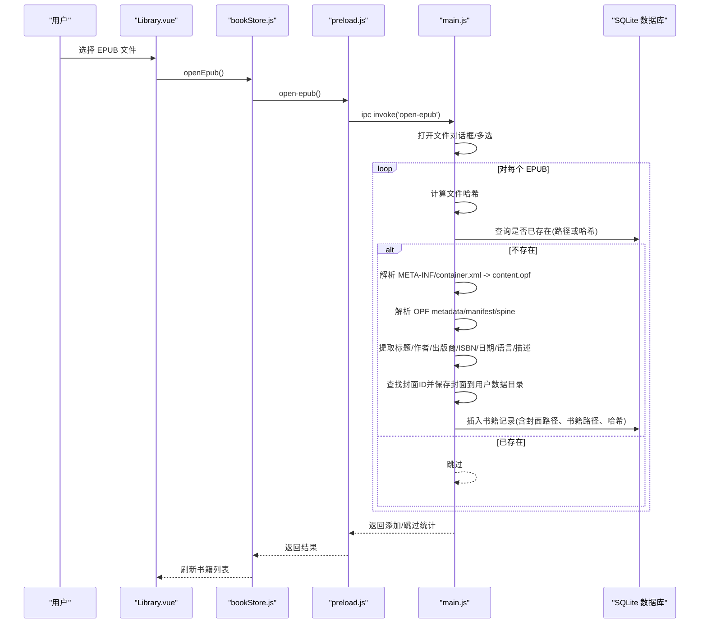
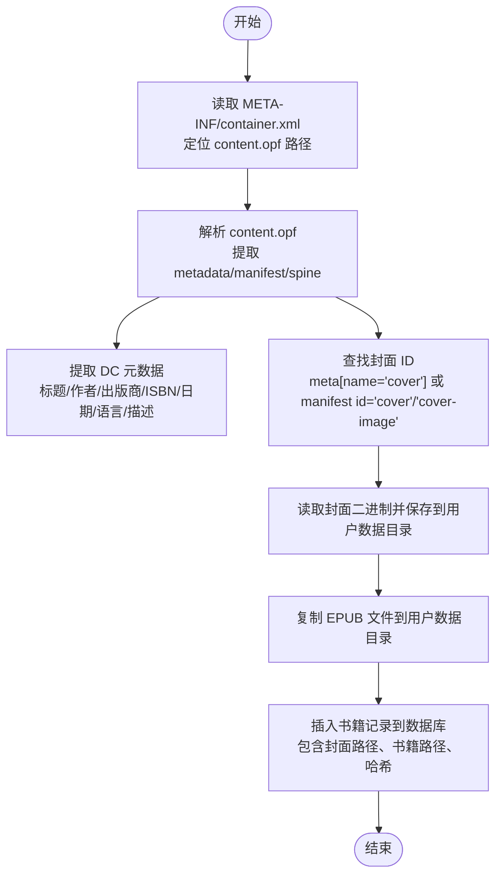
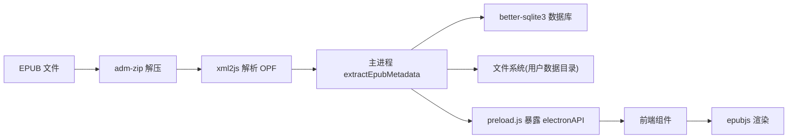

# 元数据提取

<cite>
**本文引用的文件**
- [README.md](file://README.md)
- [package.json](file://package.json)
- [electron/main.js](file://electron/main.js)
- [electron/preload.js](file://electron/preload.js)
- [src/main.js](file://src/main.js)
- [src/App.vue](file://src/App.vue)
- [src/components/Library.vue](file://src/components/Library.vue)
- [src/components/Reader.vue](file://src/components/Reader.vue)
- [src/stores/bookStore.js](file://src/stores/bookStore.js)
- [src/utils/httpHelper.js](file://src/utils/httpHelper.js)
- [src/utils/pathHelper.js](file://src/utils/pathHelper.js)
</cite>

## 目录
1. [简介](#简介)
2. [项目结构](#项目结构)
3. [核心组件](#核心组件)
4. [架构总览](#架构总览)
5. [详细组件分析](#详细组件分析)
6. [依赖关系分析](#依赖关系分析)
7. [性能考量](#性能考量)
8. [故障排除指南](#故障排除指南)
9. [结论](#结论)
10. [附录](#附录)

## 简介
本文件面向 EPUB 元数据提取系统，聚焦于 OPF（Open Packaging Format）文件解析、DC（Dublin Core）元数据标准、content.opf 的解析流程（metadata 节点、manifest 清单、spine 结构）、元数据字段提取（标题、作者、出版商、ISBN、出版日期、语言、描述）、封面图片查找与提取、元数据标准化与格式化策略、ISBN 识别算法与错误处理机制。文档基于仓库现有代码进行技术梳理与可视化呈现，帮助读者快速理解系统如何从 EPUB 文件中抽取并持久化元数据，以及如何在前端展示与使用这些元数据。

## 项目结构
该项目是一个基于 Electron + Vue 3 的桌面 EPUB 阅读器，核心元数据提取逻辑位于主进程（Node.js 环境）中，前端通过 IPC 与主进程交互，实现书籍导入、元数据提取、封面保存、数据库持久化与前端展示。

图表来源
- [src/main.js:1-11](file://src/main.js#L1-L11)
- [src/App.vue](file://src/App.vue)
- [src/components/Library.vue:1-120](file://src/components/Library.vue#L1-L120)
- [src/components/Reader.vue:1-120](file://src/components/Reader.vue#L1-L120)
- [src/stores/bookStore.js:1-234](file://src/stores/bookStore.js#L1-L234)
- [src/utils/pathHelper.js:1-63](file://src/utils/pathHelper.js#L1-L63)
- [src/utils/httpHelper.js:1-47](file://src/utils/httpHelper.js#L1-L47)
- [electron/main.js:1-80](file://electron/main.js#L1-L80)
- [electron/preload.js:1-95](file://electron/preload.js#L1-L95)

章节来源
- [README.md:167-193](file://README.md#L167-L193)
- [package.json:1-82](file://package.json#L1-L82)

## 核心组件
- 主进程元数据提取与数据库管理：负责解析 EPUB、提取 OPF 元数据、保存封面与书籍文件、维护 SQLite 数据库。
- 前端状态管理与 IPC：通过 Pinia 管理书籍、分类、进度、书签、批注等状态；通过 preload 暴露的 electronAPI 与主进程通信。
- 路径工具：统一将相对路径转换为 file:// URL，适配开发与生产环境。
- 阅读器组件：使用 EPUB.js 渲染 EPUB，支持目录、书签、批注、进度保存与切换阅读模式。

章节来源
- [electron/main.js:32-147](file://electron/main.js#L32-L147)
- [src/stores/bookStore.js:1-234](file://src/stores/bookStore.js#L1-L234)
- [src/utils/pathHelper.js:1-63](file://src/utils/pathHelper.js#L1-L63)
- [src/components/Reader.vue:160-220](file://src/components/Reader.vue#L160-L220)

## 架构总览
系统采用“主进程负责文件解析与持久化，渲染进程负责 UI 展示与交互”的分层架构。前端通过 IPC 调用主进程接口，主进程内部使用 zip 解析 EPUB、XML 解析 OPF、正则识别 ISBN、SQLite 存储元数据与文件路径。

图表来源
- [src/components/Library.vue:365-420](file://src/components/Library.vue#L365-L420)
- [src/stores/bookStore.js:71-104](file://src/stores/bookStore.js#L71-L104)
- [electron/preload.js:7-11](file://electron/preload.js#L7-L11)
- [electron/main.js:343-427](file://electron/main.js#L343-L427)

## 详细组件分析

### 主进程元数据提取与数据库管理（extractEpubMetadata）
- 解析流程
  - 读取 META-INF/container.xml，定位 content.opf 的相对路径。
  - 读取 content.opf，解析 OPF 的 metadata、manifest、spine。
  - 从 metadata 中提取 dc:title/dc:creator/dc:publisher/dc:identifier/dc:date/dc:language/dc:description。
  - 从 metadata.meta 中查找 name='cover' 的 content 作为封面 ID；若无，则按 manifest 中 id='cover'/'cover-image' 查找。
  - 根据 manifest 项 href 与根路径拼接得到封面绝对路径，读取二进制数据并保存到用户数据目录 upload/covers/。
  - 将原始 EPUB 文件复制到用户数据目录 upload/books/，并记录相对路径。
- 元数据字段提取
  - 标题：优先取 dc:title，否则回退为文件名（不含扩展名）。
  - 作者：取 dc:creator，兼容数组与对象形式。
  - 出版商：取 dc:publisher。
  - ISBN：通过 findISBN 正则识别，支持 ISBN-13（978 开头，13 位数字）与 ISBN-10（10 位数字或末尾带 X）。
  - 出版日期：取 dc:date。
  - 语言：取 dc:language。
  - 描述：取 dc:description。
- 封面图片提取
  - 优先通过 metadata.meta[name='cover'] 获取封面 ID。
  - 若无，则在 manifest 中查找 id='cover' 或 id='cover-image'。
  - 读取封面二进制并保存到用户数据目录，记录相对路径。
- 数据库持久化
  - books 表包含 title、author、publisher、isbn、pub_date、language、description、cover_path、book_path、file_hash、added_at、last_read_at。
  - reading_progress、bookmarks、annotations、categories 表分别存储阅读进度、书签、批注与分类。
- 错误处理
  - 对于缺失 container.xml 或 content.opf 的无效 EPUB，返回默认值（标题、作者、封面、书籍路径）。
  - 对于封面读取失败或保存失败的情况，记录日志并继续流程。

章节来源
- [electron/main.js:32-147](file://electron/main.js#L32-L147)
- [electron/main.js:149-165](file://electron/main.js#L149-L165)
- [electron/main.js:167-284](file://electron/main.js#L167-L284)
- [electron/main.js:343-427](file://electron/main.js#L343-L427)

### 前端状态管理与 IPC（bookStore.js）
- 作用
  - 通过 window.electronAPI 调用主进程接口，实现书籍列表、分类、进度、书签、批注、导出等功能。
  - 统一错误处理与日志输出，便于调试。
- 关键接口
  - openEpub：打开 EPUB 文件对话框，批量导入并去重（基于路径与哈希）。
  - get-books/get-categories/add-category/delete-category/update-book-category/export-book/export-notes/delete-book/delete-book-completely：数据库 CRUD 与导出。
  - save-progress/get-progress/add-bookmark/get-bookmarks/delete-bookmark/save-annotation/get-annotations/delete-annotation：阅读进度、书签、批注管理。
- 与主进程交互
  - 通过 preload.js 暴露的 electronAPI，使用 ipcRenderer.invoke 调用主进程 ipcMain.handle 注册的处理器。

章节来源
- [src/stores/bookStore.js:1-234](file://src/stores/bookStore.js#L1-L234)
- [electron/preload.js:7-92](file://electron/preload.js#L7-L92)

### 路径工具（pathHelper.js）
- 功能
  - 将相对路径（如 upload/covers/cover_xxx.jpg）转换为 file:// URL，适配开发与生产环境。
  - 通过判断 appPath 是否包含 'resources' 与 'app.asar' 来区分生产环境。
  - 提供 isValidFileUrl 校验。
- 用途
  - 前端根据用户数据目录与相对路径生成封面与书籍文件的 file:// URL，用于 img 标签与 EPUB.js 渲染。

章节来源
- [src/utils/pathHelper.js:1-63](file://src/utils/pathHelper.js#L1-L63)

### 阅读器组件（Reader.vue）
- 作用
  - 使用 EPUB.js 渲染 EPUB，支持翻页与滚动两种阅读模式。
  - 加载目录、书签、批注，保存阅读进度（CFI、页码、百分比）。
  - 右键菜单实现摘抄与批注功能（批注保存通过 IPC 调用主进程）。
- 与元数据的关系
  - 初始化时通过 window.electronAPI 获取应用路径与用户数据目录，构造 file:// URL 加载书籍。
  - 通过 epub.loaded.metadata 获取元数据（标题、作者等），用于 UI 展示与窗口标题。

章节来源
- [src/components/Reader.vue:160-220](file://src/components/Reader.vue#L160-L220)
- [src/components/Reader.vue:232-425](file://src/components/Reader.vue#L232-L425)

### 书架组件（Library.vue）
- 作用
  - 展示书籍列表，支持搜索、排序、右键菜单（打开、导出、删除、分类）。
  - 通过 getCoverUrlSync 与 pathHelper 构造封面 URL，实现封面懒加载与错误回退。
- 与元数据的关系
  - 书籍列表来自数据库，封面路径由主进程提取并保存，前端据此生成封面 URL。

章节来源
- [src/components/Library.vue:562-621](file://src/components/Library.vue#L562-L621)

### OPF 解析流程与字段提取（概念图）

图表来源
- [electron/main.js:32-147](file://electron/main.js#L32-L147)
- [electron/main.js:149-165](file://electron/main.js#L149-L165)
- [electron/main.js:167-284](file://electron/main.js#L167-L284)

## 依赖关系分析
- 依赖库
  - adm-zip：解压 EPUB，读取内部文件（container.xml、content.opf、封面等）。
  - xml2js：解析 OPF/XML。
  - better-sqlite3：SQLite 数据库，存储书籍、进度、书签、批注、分类。
  - epubjs：前端 EPUB 渲染。
- 模块耦合
  - 主进程与前端通过 preload 暴露的 electronAPI 解耦，前端只感知 IPC 接口。
  - 元数据提取与数据库操作集中在主进程，前端只负责展示与交互。
- 外部集成点
  - 文件系统：用户数据目录用于保存封面与书籍文件。
  - 对话框：文件选择与保存对话框用于导入与导出。

图表来源
- [package.json:22-29](file://package.json#L22-L29)
- [electron/main.js:1-10](file://electron/main.js#L1-L10)
- [electron/preload.js:1-95](file://electron/preload.js#L1-L95)
- [src/components/Reader.vue:160-170](file://src/components/Reader.vue#L160-L170)

章节来源
- [package.json:22-29](file://package.json#L22-L29)

## 性能考量
- EPUB 解析
  - 使用 adm-zip 直接读取 ZIP 内部文件，避免解压到磁盘，减少 IO。
  - OPF 解析使用 xml2js，解析完成后立即提取所需字段，避免冗余处理。
- 数据库
  - WAL 模式提升并发写入性能。
  - 通过 file_hash 与 book_path 去重，避免重复导入。
- 前端渲染
  - EPUB.js 渲染采用流式布局，后台生成 locations，避免阻塞首屏显示。
  - 阅读模式切换时销毁并重建渲染器，保证一致性。
- 路径处理
  - 统一 file:// URL 生成，避免跨平台路径差异导致的二次 IO。

## 故障排除指南
- EPUB 无效或缺少 container.xml/content.opf
  - 现象：返回默认值（标题、作者、封面、书籍路径）。
  - 处理：确认 EPUB 文件完整性，检查 META-INF/container.xml 是否存在。
- 封面提取失败
  - 现象：封面路径为空，UI 显示占位符。
  - 处理：检查 manifest 中是否存在 id='cover'/'cover-image'，确认封面二进制读取成功。
- 书籍导入重复
  - 现象：导入后跳过数量增加。
  - 处理：系统通过路径与哈希去重，确认是否重复导入相同文件。
- 前端封面加载失败
  - 现象：封面图片 404 或显示占位符。
  - 处理：检查 pathHelper 生成的 file:// URL 是否正确，确认用户数据目录权限。
- 批注保存失败
  - 现象：保存后未显示或报错。
  - 处理：检查 IPC 调用与数据库写入，确认 bookId 与 CFI 正确。

章节来源
- [electron/main.js:137-147](file://electron/main.js#L137-L147)
- [src/utils/pathHelper.js:13-53](file://src/utils/pathHelper.js#L13-L53)
- [src/components/Reader.vue:974-1012](file://src/components/Reader.vue#L974-L1012)

## 结论
本系统通过主进程集中解析 EPUB 元数据并持久化，前端通过 IPC 与状态管理实现高效展示与交互。OPF 解析严格遵循 Dublin Core 标准，结合正则识别 ISBN，覆盖标题、作者、出版商、ISBN、出版日期、语言、描述等关键字段；封面提取算法具备容错能力，优先通过 meta 标签定位，其次通过 manifest 匹配。路径工具与数据库设计兼顾开发与生产环境，确保稳定与可维护性。

## 附录

### OPF 元数据字段映射与提取策略
- 标题（dc:title）
  - 优先取 metadata['dc:title']，若为空回退为文件名（不含扩展名）。
- 作者（dc:creator）
  - 取 metadata['dc:creator']，兼容数组与对象形式。
- 出版商（dc:publisher）
  - 取 metadata['dc:publisher']，允许为空。
- ISBN（dc:identifier）
  - 使用正则识别：ISBN-13（978 开头，13 位数字）与 ISBN-10（10 位数字或末尾带 X）。
- 出版日期（dc:date）
  - 取 metadata['dc:date']，允许为空。
- 语言（dc:language）
  - 取 metadata['dc:language']，允许为空。
- 描述（dc:description）
  - 取 metadata['dc:description']，允许为空。

章节来源
- [electron/main.js:58-69](file://electron/main.js#L58-L69)
- [electron/main.js:149-165](file://electron/main.js#L149-L165)

### 封面查找与提取算法
- 查找顺序
  - 优先：metadata.meta[name='cover'].content。
  - 其次：manifest 中 id='cover' 或 id='cover-image'。
- 提取流程
  - 根据 manifest 项 href 与根路径拼接得到封面绝对路径。
  - 读取二进制数据并保存到用户数据目录 upload/covers/。
  - 记录相对路径到数据库。

章节来源
- [electron/main.js:71-117](file://electron/main.js#L71-L117)

### 元数据标准化与格式化建议
- 标准化
  - 统一语言代码（如使用 ISO 639-1/639-2）。
  - 规范日期格式（如 ISO 8601）。
  - ISBN 去除分隔符并统一大小写。
- 格式化
  - 标题与作者去除多余空白与换行。
  - 描述截断长度并保留语义完整。

（本节为通用建议，不直接对应具体代码）

### 错误处理机制
- 主进程
  - 对无效 EPUB 返回默认值，避免崩溃。
  - 对封面读取/保存失败记录日志并继续流程。
- 前端
  - 封面加载失败显示占位符。
  - IPC 调用失败弹出提示并记录错误。

章节来源
- [electron/main.js:137-147](file://electron/main.js#L137-L147)
- [src/components/Library.vue:606-620](file://src/components/Library.vue#L606-L620)
- [src/stores/bookStore.js:98-103](file://src/stores/bookStore.js#L98-L103)