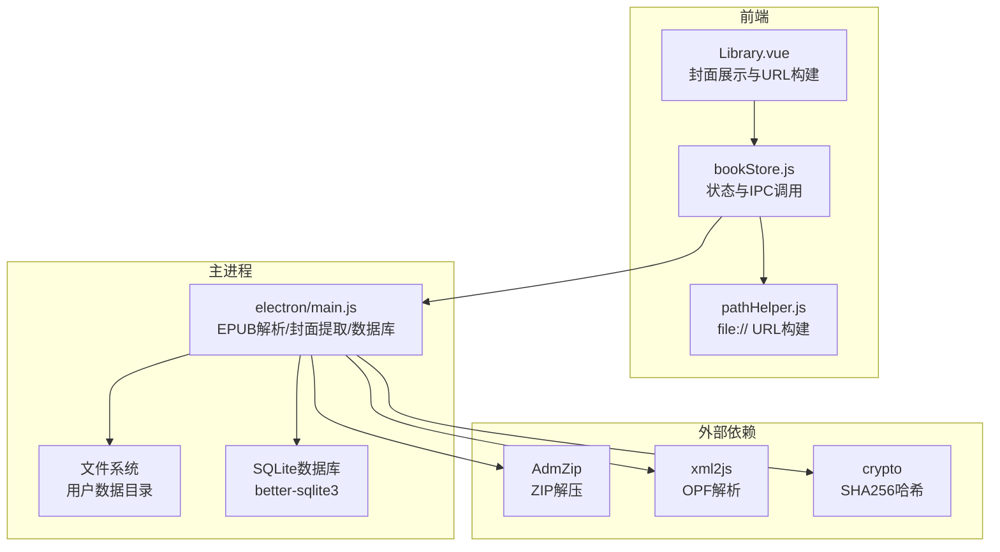
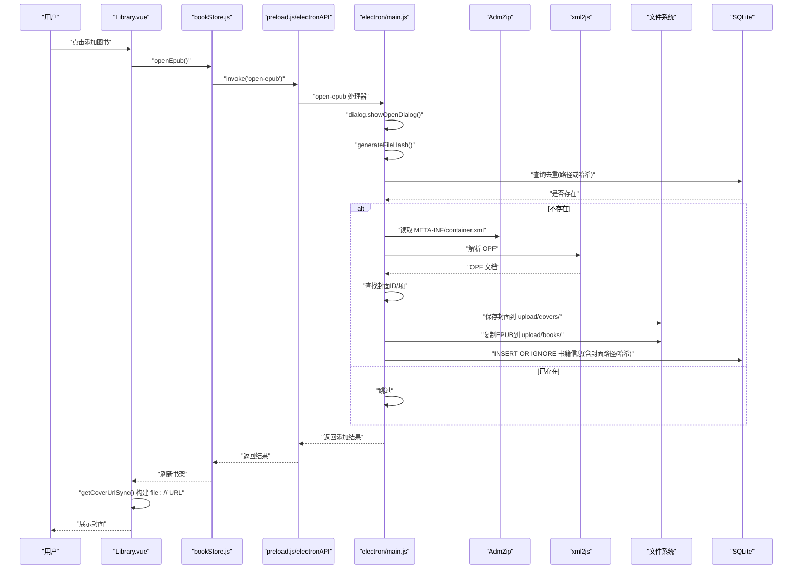
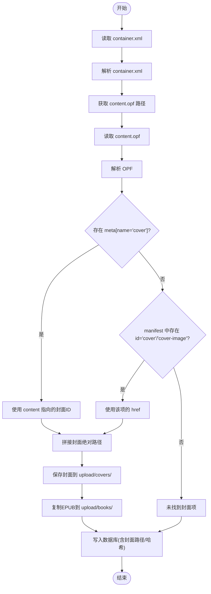
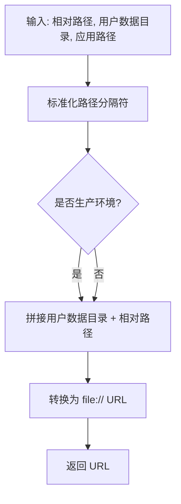
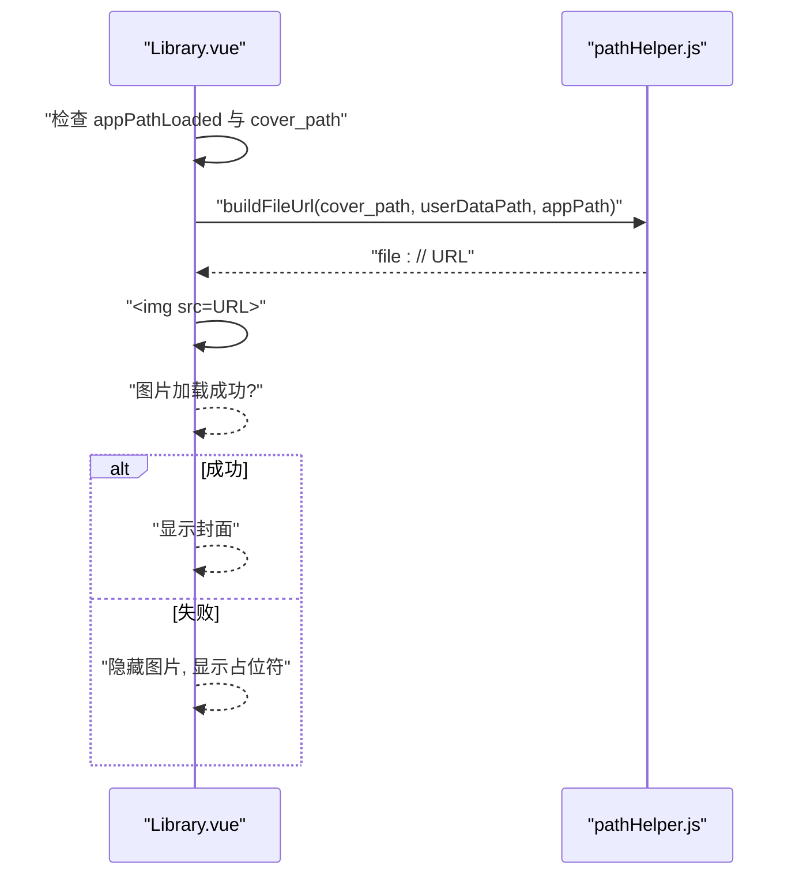
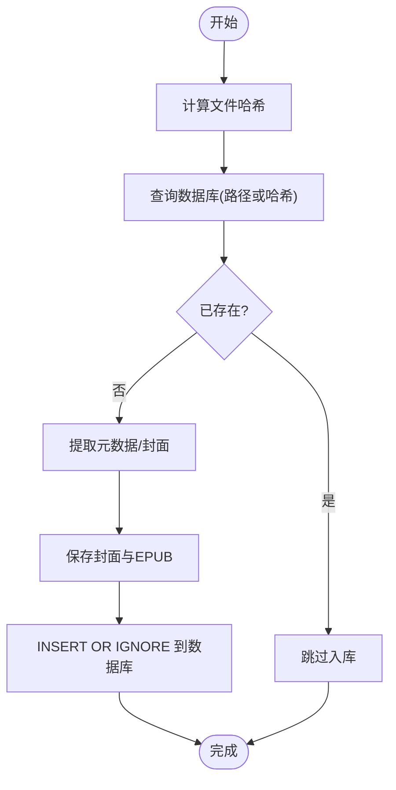
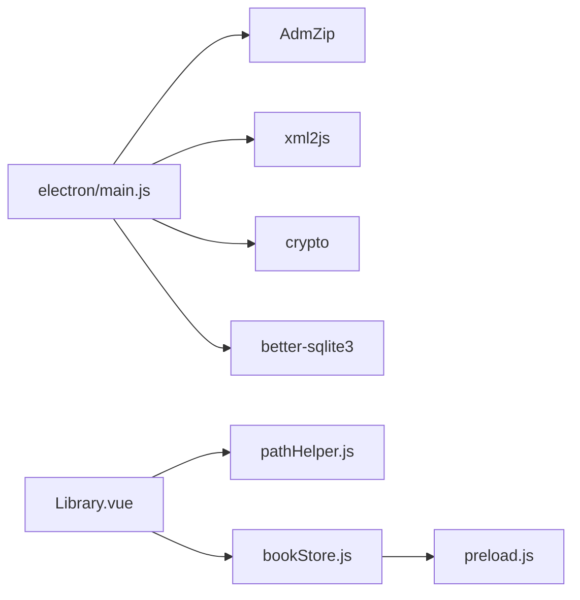

# 封面图片处理

<cite>
**本文引用的文件**
- [electron/main.js](file://electron/main.js)
- [src/utils/pathHelper.js](file://src/utils/pathHelper.js)
- [src/components/Library.vue](file://src/components/Library.vue)
- [src/stores/bookStore.js](file://src/stores/bookStore.js)
- [electron/preload.js](file://electron/preload.js)
- [src/main.js](file://src/main.js)
- [README.md](file://README.md)
</cite>

## 目录
1. [简介](#简介)
2. [项目结构](#项目结构)
3. [核心组件](#核心组件)
4. [架构总览](#架构总览)
5. [详细组件分析](#详细组件分析)
6. [依赖关系分析](#依赖关系分析)
7. [性能考量](#性能考量)
8. [故障排除指南](#故障排除指南)
9. [结论](#结论)

## 简介
本文件面向 EPUB 封面图片处理系统，围绕 Electron + Vue 3 + SQLite 的桌面应用，系统性阐述封面图片在 EPUB 中的识别策略、提取流程、路径解析与保存机制、用户数据目录组织、文件命名规则、格式转换与优化建议、缓存与重复检测方案，以及失败回退与错误处理策略。目标读者既包括开发者，也包括需要理解系统行为的非技术用户。

## 项目结构
- 主进程负责 EPUB 解析、封面提取、文件复制与数据库持久化。
- 前端负责展示封面、构建 file:// URL 并处理图片加载失败回退。
- 预加载脚本桥接 IPC，暴露安全 API 给渲染进程。

图表来源
- [electron/main.js:33-147](file://electron/main.js#L33-L147)
- [src/components/Library.vue:591-620](file://src/components/Library.vue#L591-L620)
- [src/utils/pathHelper.js:13-53](file://src/utils/pathHelper.js#L13-L53)
- [src/stores/bookStore.js:71-104](file://src/stores/bookStore.js#L71-L104)

章节来源
- [README.md:167-193](file://README.md#L167-L193)

## 核心组件
- EPUB 元数据与封面提取：主进程解析 container.xml 与 content.opf，定位封面项并保存到用户数据目录。
- 路径工具：将相对路径转换为 file:// URL，兼容开发与生产环境。
- 前端封面展示：根据数据库中的相对路径构建 URL，图片加载失败时回退到占位符。
- 重复检测：基于文件路径与 SHA256 哈希去重，避免重复入库。
- 数据库：持久化书籍、封面路径、文件哈希等信息。

章节来源
- [electron/main.js:33-147](file://electron/main.js#L33-L147)
- [src/utils/pathHelper.js:13-53](file://src/utils/pathHelper.js#L13-L53)
- [src/components/Library.vue:591-620](file://src/components/Library.vue#L591-L620)
- [src/stores/bookStore.js:71-104](file://src/stores/bookStore.js#L71-L104)

## 架构总览
EPUB 封面处理的关键流程：
- 用户选择 EPUB 文件 → 主进程计算文件哈希 → 查询数据库去重 → 解析 OPF 提取封面 → 保存封面与书籍文件 → 写入数据库 → 前端读取数据库并展示封面。

图表来源
- [src/stores/bookStore.js:71-104](file://src/stores/bookStore.js#L71-L104)
- [electron/preload.js:7-92](file://electron/preload.js#L7-L92)
- [electron/main.js:343-427](file://electron/main.js#L343-L427)
- [electron/main.js:33-147](file://electron/main.js#L33-L147)
- [src/components/Library.vue:591-620](file://src/components/Library.vue#L591-L620)

## 详细组件分析

### EPUB 封面识别与提取
- 识别策略
  - 优先解析 OPF 的 meta 节点，查找 name="cover" 的条目，其 content 即为封面项 ID。
  - 若未找到 meta 标签，则在 manifest 中查找 id 为 "cover" 或 "cover-image" 的项。
  - 通过 spine 顺序与 manifest 结合，确保封面项存在且可读。
- 相对路径解析
  - 从 container.xml 获取 content.opf 的相对路径，再结合 manifest 中的 href，拼接得到封面在 EPUB 内部的绝对路径。
  - 使用 path.join 与路径规范化，统一斜杠，避免跨平台差异。
- 保存机制
  - 封面保存到用户数据目录的 upload/covers/ 子目录，文件名包含时间戳，扩展名为 .jpg。
  - EPUB 文件复制到 upload/books/ 子目录，文件名包含时间戳与原始文件名。
  - 数据库字段 cover_path 与 book_path 保存相对路径，便于后续构建 file:// URL。
- 错误处理
  - 任何异常均捕获并返回默认值，保证流程不中断。
  - 未找到封面时，封面路径为空，前端回退到占位符。

图表来源
- [electron/main.js:33-147](file://electron/main.js#L33-L147)

章节来源
- [electron/main.js:33-147](file://electron/main.js#L33-L147)

### 路径解析与 file:// URL 构建
- 相对路径到绝对路径
  - 使用 app.getPath('userData') 获取用户数据目录，与相对路径拼接得到绝对路径。
  - 在开发与生产环境下均适用，生产环境通过 app.getAppPath() 判断是否为打包状态。
- file:// URL 构建
  - 将绝对路径转换为 file:// URL，支持 Windows 与类 Unix 系统。
  - 前端通过 buildFileUrl(book.cover_path, userDataPath, appPath) 生成可直接用于  的 URL。
- 有效性校验
  - 提供 isValidFileUrl() 判断 URL 是否为有效的 file:// URL。

图表来源
- [src/utils/pathHelper.js:13-53](file://src/utils/pathHelper.js#L13-L53)

章节来源
- [src/utils/pathHelper.js:13-53](file://src/utils/pathHelper.js#L13-L53)

### 前端封面展示与回退
- 展示逻辑
  - 仅当 appPathLoaded 为真且 book.cover_path 存在时，才调用 getCoverUrlSync()。
  - 通过 buildFileUrl() 生成 file:// URL，直接赋给 。
- 失败回退
  - 图片加载失败时触发 error 事件，隐藏图片并显示占位符（首字母大写）。
  - 控制台输出错误日志，便于调试。

图表来源
- [src/components/Library.vue:591-620](file://src/components/Library.vue#L591-L620)
- [src/utils/pathHelper.js:13-53](file://src/utils/pathHelper.js#L13-L53)

章节来源
- [src/components/Library.vue:591-620](file://src/components/Library.vue#L591-L620)

### 重复检测与去重
- 检测维度
  - 书籍路径（book_path）与文件哈希（file_hash）双重条件。
- 实现要点
  - 读取 EPUB 文件流，计算 SHA256 哈希。
  - 查询数据库：WHERE book_path = ? OR file_hash = ?。
  - 已存在则跳过，否则继续提取与入库。
- 数据库设计
  - books 表新增 file_hash 字段，用于重复检测。
  - 插入时使用 INSERT OR IGNORE，避免重复。

图表来源
- [electron/main.js:362-372](file://electron/main.js#L362-L372)
- [electron/main.js:379-394](file://electron/main.js#L379-L394)

章节来源
- [electron/main.js:362-372](file://electron/main.js#L362-L372)
- [electron/main.js:379-394](file://electron/main.js#L379-L394)

### 用户数据目录组织与文件命名规则
- 目录结构
  - 用户数据目录下创建 upload/covers/ 与 upload/books/ 子目录。
- 文件命名
  - 封面：cover_{时间戳}.jpg
  - EPUB：book_{时间戳}_{原始文件名}
- 路径存储
  - 数据库中仅保存相对路径（相对于用户数据目录），便于迁移与跨平台。

章节来源
- [electron/main.js:102-133](file://electron/main.js#L102-L133)

### 图片格式转换与优化处理
- 当前实现
  - 直接从 EPUB 中读取封面字节流并写入文件，不做格式转换或压缩。
- 建议方案
  - 使用图像处理库（如 Sharp 或 Jimp）在保存前进行：
    - 格式统一：转换为 JPEG（质量参数可配置）。
    - 尺寸优化：按最大宽度/高度缩放，生成缩略图与原图。
    - 压缩：启用合适的压缩质量，平衡体积与清晰度。
  - 生成多尺寸文件，前端按设备像素比选择合适尺寸，提升加载性能。
  - 为封面文件增加校验和，便于缓存命中与一致性校验。

[本节为通用优化建议，不直接对应现有代码实现]

### 缓存与重复检测
- 缓存策略
  - 基于文件哈希的缓存：相同哈希的封面无需重复提取。
  - 基于路径的缓存：相同路径的书籍直接跳过入库。
- 去重策略
  - 采用双重条件（路径或哈希）进行去重，避免同名不同文件或重复导入。
- 前端缓存
  - 前端仅缓存 file:// URL，不缓存图片内容；图片加载失败时回退占位符。

章节来源
- [electron/main.js:362-372](file://electron/main.js#L362-L372)
- [src/components/Library.vue:606-620](file://src/components/Library.vue#L606-L620)

### 失败回退与错误处理
- 主进程
  - 解析 OPF、读取封面、保存文件、写入数据库均在 try/catch 中执行。
  - 发生异常时返回默认值，保证流程继续。
- 前端
  - 图片加载失败时隐藏图片并显示占位符，同时输出错误日志。
  - 未加载路径时延迟构建 URL，避免无效请求。
- IPC 与用户反馈
  - 打开 EPUB 时，若用户取消或无文件选择，返回空结果；若发生错误，弹出提示并记录错误详情。

章节来源
- [electron/main.js:137-146](file://electron/main.js#L137-L146)
- [src/components/Library.vue:606-620](file://src/components/Library.vue#L606-L620)
- [src/stores/bookStore.js:71-104](file://src/stores/bookStore.js#L71-L104)

## 依赖关系分析
- 外部库
  - AdmZip：解压 EPUB，读取内部文件。
  - xml2js：解析 OPF/XML。
  - crypto：计算文件哈希。
  - better-sqlite3：SQLite 数据库。
- 前端依赖
  - Vue 3 + Composition API：组件与状态管理。
  - EPUB.js：阅读器（与封面处理无直接耦合）。

图表来源
- [electron/main.js:1-8](file://electron/main.js#L1-L8)
- [src/components/Library.vue:248-251](file://src/components/Library.vue#L248-L251)
- [electron/preload.js:1-95](file://electron/preload.js#L1-L95)

章节来源
- [electron/main.js:1-8](file://electron/main.js#L1-L8)
- [src/components/Library.vue:248-251](file://src/components/Library.vue#L248-L251)
- [electron/preload.js:1-95](file://electron/preload.js#L1-L95)

## 性能考量
- I/O 与并发
  - 批量导入时逐个计算哈希与解析 OPF，建议在 UI 层限制并发或显示进度。
- 文件系统
  - 保存封面与 EPUB 前先检查目录是否存在，避免多次 mkdir。
- 数据库
  - 使用 WAL 模式提升并发写入性能；索引可考虑在 book_path 与 file_hash 上建立（视业务量而定）。
- 前端渲染
  - 使用占位符减少空白时间；图片懒加载可进一步优化长列表性能。

[本节为通用性能建议，不直接对应现有代码实现]

## 故障排除指南
- 无法显示封面
  - 检查 cover_path 是否为空；确认用户数据目录权限。
  - 确认 file:// URL 构建正确，路径分隔符已标准化。
- 封面路径无效
  - 确认数据库中保存的是相对路径；确认 appPathLoaded 已加载。
- 重复导入
  - 检查 file_hash 是否一致；确认数据库中已存在相同哈希的记录。
- EPUB 解析失败
  - 确认 container.xml 与 content.opf 存在；检查 OPF 中 meta[name='cover'] 或 manifest 中的封面项是否存在。
- 图片加载失败
  - 查看控制台错误日志；确认封面文件确实存在于用户数据目录。

章节来源
- [src/components/Library.vue:606-620](file://src/components/Library.vue#L606-L620)
- [src/utils/pathHelper.js:13-53](file://src/utils/pathHelper.js#L13-L53)
- [electron/main.js:33-147](file://electron/main.js#L33-L147)

## 结论
本系统通过严格的封面识别策略、可靠的路径解析与保存机制、完善的重复检测与错误处理，实现了稳定高效的 EPUB 封面图片处理能力。前端以 file:// URL 直接展示封面，并在加载失败时提供占位符回退。未来可在封面格式转换、多尺寸缓存与批量导入性能方面进一步优化，以满足更广泛的使用场景。