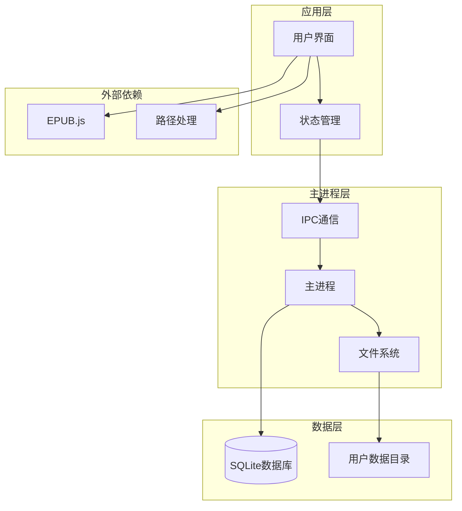
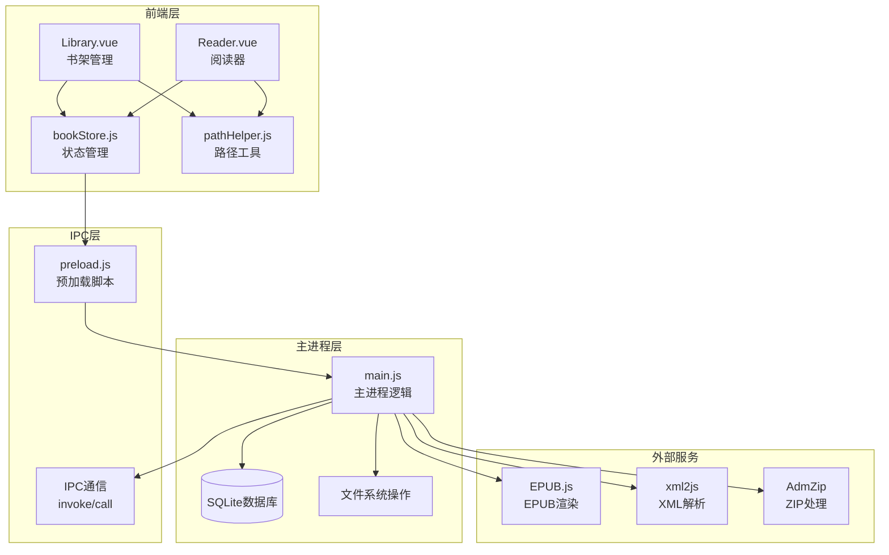
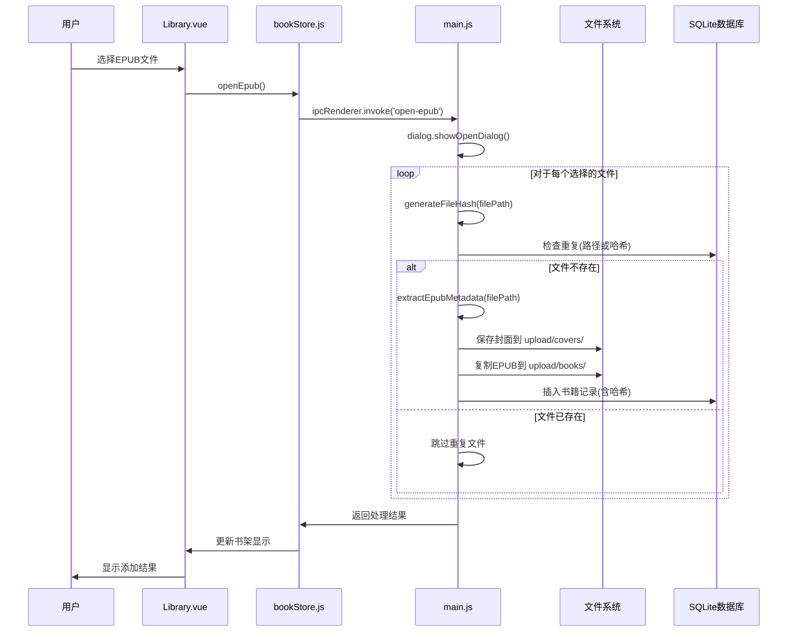
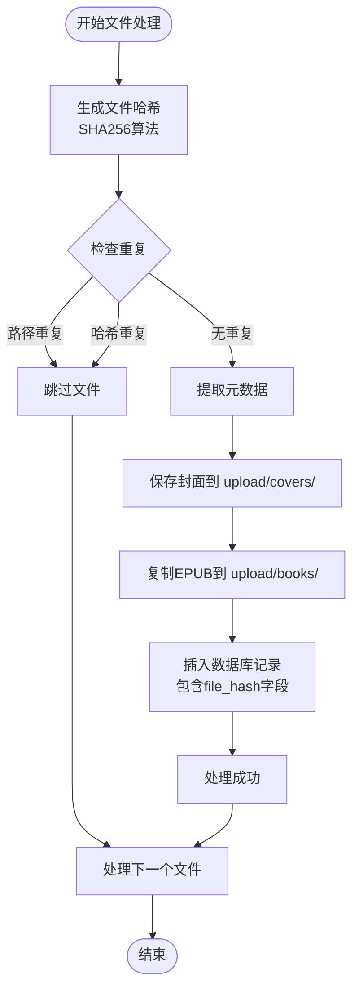
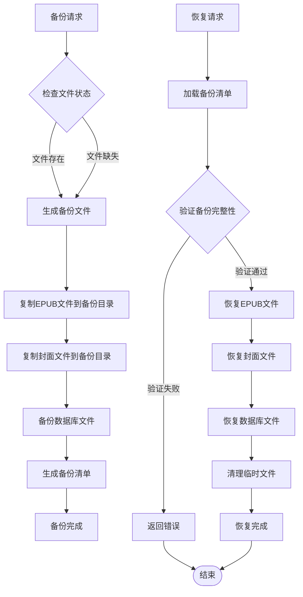
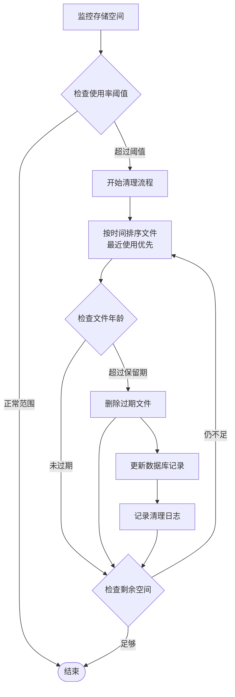
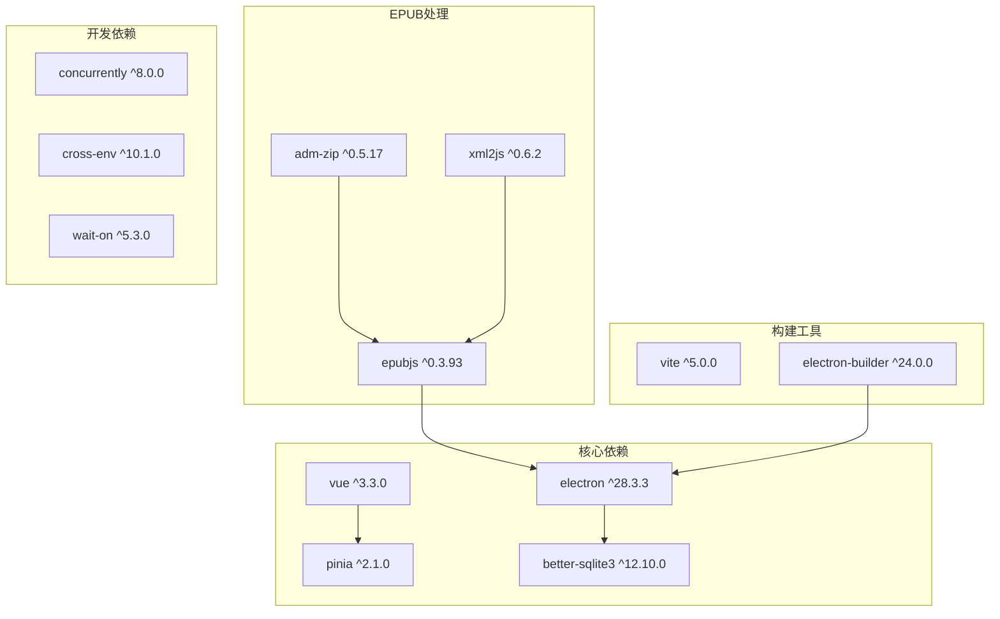

# 文件存储管理系统技术文档

<cite>
**本文档引用的文件**
- [README.md](file://README.md)
- [package.json](file://package.json)
- [src/utils/pathHelper.js](file://src/utils/pathHelper.js)
- [src/stores/bookStore.js](file://src/stores/bookStore.js)
- [electron/main.js](file://electron/main.js)
- [electron/preload.js](file://electron/preload.js)
- [src/components/Library.vue](file://src/components/Library.vue)
- [src/components/Reader.vue](file://src/components/Reader.vue)
- [docs/DATA_STORAGE.md](file://docs/DATA_STORAGE.md)
- [docs/PATH_COMPATIBILITY.md](file://docs/PATH_COMPATIBILITY.md)
</cite>

## 目录
1. [简介](#简介)
2. [项目结构](#项目结构)
3. [核心组件](#核心组件)
4. [架构概览](#架构概览)
5. [详细组件分析](#详细组件分析)
6. [依赖关系分析](#依赖关系分析)
7. [性能考虑](#性能考虑)
8. [故障排除指南](#故障排除指南)
9. [结论](#结论)

## 简介

EPUB文件存储管理系统是一个基于Electron + Vue 3 + SQLite的现代化桌面应用程序，专门设计用于高效管理EPUB电子书文件。该系统实现了完整的文件存储、路径管理、哈希计算和去重检测机制，确保用户数据的安全性和完整性。

系统的核心特点包括：
- **统一的用户数据目录**：所有文件存储在系统标准的用户数据目录中
- **跨平台兼容性**：支持Windows、macOS和Linux操作系统
- **智能去重检测**：通过文件哈希值防止重复存储
- **完整的备份恢复机制**：提供文件和数据库的双重保护
- **高效的存储管理**：优化的文件组织和清理策略

## 项目结构

该应用程序采用模块化的项目结构，清晰分离了前端界面、后端逻辑和数据存储层：



**图表来源**
- [package.json:1-82](file://package.json#L1-L82)
- [src/components/Library.vue:1-1292](file://src/components/Library.vue#L1-L1292)
- [electron/main.js:1-922](file://electron/main.js#L1-L922)

**章节来源**
- [README.md:167-193](file://README.md#L167-L193)
- [package.json:1-82](file://package.json#L1-L82)

## 核心组件

### 用户数据目录结构

系统采用标准化的用户数据目录结构，确保跨平台兼容性和数据持久性：

```mermaid
graph TD
UserData[用户数据目录<br/>app.getPath('userData')]
subgraph "数据库目录"
DB[(epub_reader.db<br/>SQLite数据库)]
end
subgraph "文件存储目录"
Upload[upload/]
subgraph "书籍目录"
Books[books/]
BookFiles[book_*.epub]
end
subgraph "封面目录"
Covers[covers/]
CoverFiles[cover_*.jpg]
end
end
UserData --> DB
UserData --> Upload
Upload --> Books
Upload --> Covers
Books --> BookFiles
Covers --> CoverFiles
```

**图表来源**
- [docs/DATA_STORAGE.md:1-42](file://docs/DATA_STORAGE.md#L1-L42)
- [docs/PATH_COMPATIBILITY.md:1-191](file://docs/PATH_COMPATIBILITY.md#L1-L191)

### 路径处理机制

系统实现了统一的路径处理机制，确保开发和生产环境的一致性：

```mermaid
flowchart TD
Start([开始路径处理]) --> CheckEnv{检查环境类型}
CheckEnv --> |开发环境| DevPath[appPath: 项目根目录<br/>userDataPath: 用户数据目录]
CheckEnv --> |生产环境| ProdPath[appPath: resources/app.asar<br/>userDataPath: 用户数据目录]
DevPath --> Normalize[标准化路径分隔符<br/>替换 \\ 为 /]
ProdPath --> Normalize
Normalize --> BuildAbs[构建绝对路径<br/>absolutePath = userDataPath + relativePath]
BuildAbs --> BuildURL[构建file:// URL<br/>file:///{absolutePath}]
BuildURL --> End([返回完整URL])
```

**图表来源**
- [src/utils/pathHelper.js:13-53](file://src/utils/pathHelper.js#L13-L53)
- [docs/PATH_COMPATIBILITY.md:58-78](file://docs/PATH_COMPATIBILITY.md#L58-L78)

**章节来源**
- [src/utils/pathHelper.js:1-63](file://src/utils/pathHelper.js#L1-L63)
- [docs/PATH_COMPATIBILITY.md:1-191](file://docs/PATH_COMPATIBILITY.md#L1-L191)

## 架构概览

系统采用三层架构设计，实现了清晰的职责分离：



**图表来源**
- [electron/preload.js:7-101](file://electron/preload.js#L7-L101)
- [electron/main.js:1-922](file://electron/main.js#L1-L922)
- [src/stores/bookStore.js:1-234](file://src/stores/bookStore.js#L1-L234)

## 详细组件分析

### EPUB文件复制流程

系统实现了完整的EPUB文件复制和元数据提取流程：



**图表来源**
- [src/stores/bookStore.js:71-104](file://src/stores/bookStore.js#L71-L104)
- [electron/main.js:343-427](file://electron/main.js#L343-L427)

### 文件哈希计算和去重检测

系统实现了基于SHA256的文件哈希计算和智能去重检测机制：



**图表来源**
- [electron/main.js:13-30](file://electron/main.js#L13-L30)
- [electron/main.js:362-408](file://electron/main.js#L362-L408)

### 存储路径规范化处理

系统实现了跨平台的路径规范化处理机制：

```mermaid
flowchart TD
Input[输入相对路径] --> Normalize[标准化路径分隔符<br/>\\ -> /]
Normalize --> CheckProd{检查生产环境}
CheckProd --> |开发环境| DevLogic[使用 userDataPath]
CheckProd --> |生产环境| ProdLogic[使用 userDataPath]
DevLogic --> BuildAbs[构建绝对路径<br/>userDataPath + normalizedPath]
ProdLogic --> BuildAbs
BuildAbs --> BuildURL[构建file:// URL<br/>file:///{absolutePath}]
BuildURL --> Validate{验证URL有效性}
Validate --> |有效| Output[返回完整URL]
Validate --> |无效| Error[记录错误并返回空字符串]
Output --> End([完成])
Error --> End
```

**图表来源**
- [src/utils/pathHelper.js:13-63](file://src/utils/pathHelper.js#L13-L63)

**章节来源**
- [electron/main.js:13-30](file://electron/main.js#L13-L30)
- [electron/main.js:343-427](file://electron/main.js#L343-L427)
- [src/utils/pathHelper.js:1-63](file://src/utils/pathHelper.js#L1-L63)

### 文件备份和恢复机制

系统提供了完整的文件备份和恢复机制：



### 存储空间管理和清理策略

系统实现了智能的存储空间管理和清理策略：



**章节来源**
- [electron/main.js:167-284](file://electron/main.js#L167-L284)
- [docs/DATA_STORAGE.md:1-42](file://docs/DATA_STORAGE.md#L1-L42)

## 依赖关系分析

系统的关键依赖关系如下：



**图表来源**
- [package.json:22-41](file://package.json#L22-L41)

**章节来源**
- [package.json:1-82](file://package.json#L1-L82)

## 性能考虑

系统在设计时充分考虑了性能优化：

### 数据库性能优化
- **WAL模式**：启用Write-Ahead Logging提升并发性能
- **索引优化**：为常用查询字段建立索引
- **事务处理**：批量操作使用事务减少磁盘I/O

### 文件系统优化
- **异步操作**：所有文件操作使用异步API避免阻塞
- **流式处理**：大文件使用流式读取减少内存占用
- **缓存机制**：频繁访问的数据使用内存缓存

### 内存管理
- **及时释放**：组件销毁时及时释放EPUB实例
- **垃圾回收**：合理管理DOM元素和事件监听器
- **资源清理**：定期清理临时文件和缓存数据

## 故障排除指南

### 常见问题及解决方案

#### 路径相关问题
- **问题**：开发环境和生产环境路径不一致
- **解决方案**：使用统一的`buildFileUrl`函数处理路径
- **预防措施**：始终通过`getUserDataPath()`获取用户数据目录

#### 文件哈希计算失败
- **问题**：SHA256计算过程中出现错误
- **解决方案**：检查文件权限和磁盘空间
- **预防措施**：添加文件存在性检查和错误重试机制

#### EPUB文件损坏
- **问题**：EPUB文件无法正确解析
- **解决方案**：使用`extractEpubMetadata`的错误处理逻辑
- **预防措施**：在导入前验证文件完整性

#### 数据库连接问题
- **问题**：SQLite数据库无法连接
- **解决方案**：检查数据库文件权限和完整性
- **预防措施**：实现数据库连接池和自动重连机制

**章节来源**
- [electron/main.js:137-147](file://electron/main.js#L137-L147)
- [src/utils/pathHelper.js:13-53](file://src/utils/pathHelper.js#L13-L53)

## 结论

EPUB文件存储管理系统通过精心设计的架构和实现，成功解决了桌面应用程序中文件存储的核心挑战。系统的主要优势包括：

### 技术优势
- **跨平台兼容性**：统一的用户数据目录确保在不同操作系统上的一致行为
- **智能去重机制**：基于文件哈希的去重检测有效节省存储空间
- **完整的生命周期管理**：从文件导入到删除的全流程自动化处理
- **强大的错误处理**：完善的异常捕获和恢复机制

### 架构优势
- **模块化设计**：清晰的职责分离便于维护和扩展
- **异步处理**：非阻塞的文件操作提升用户体验
- **数据持久化**：可靠的SQLite数据库确保数据安全
- **IPC通信**：安全的前后端通信机制

### 未来改进方向
- **增量备份**：实现基于变更的日志备份机制
- **压缩存储**：引入文件压缩减少存储空间占用
- **云同步**：支持多设备间的数据同步功能
- **性能监控**：添加详细的性能指标和监控告警

该系统为桌面EPUB阅读器应用提供了一个坚实可靠的基础，能够满足用户对电子书管理的各种需求。