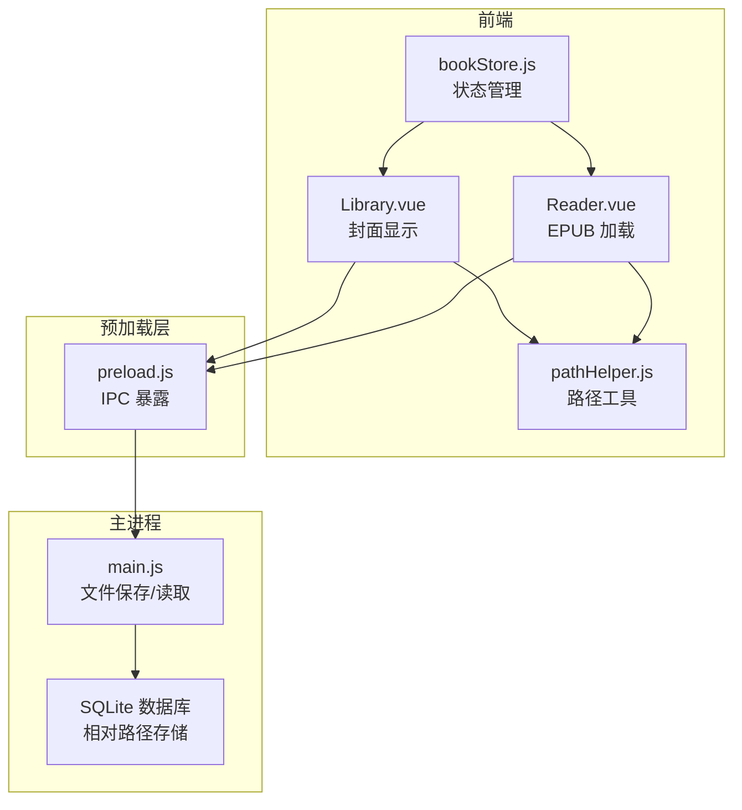
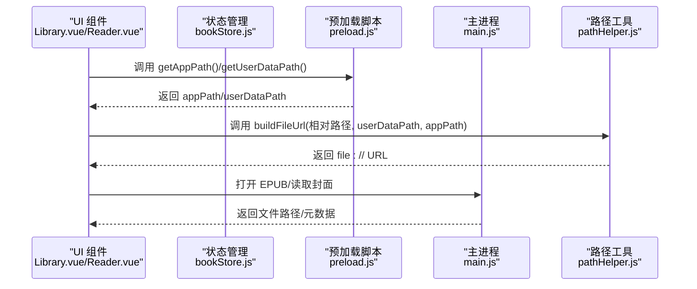
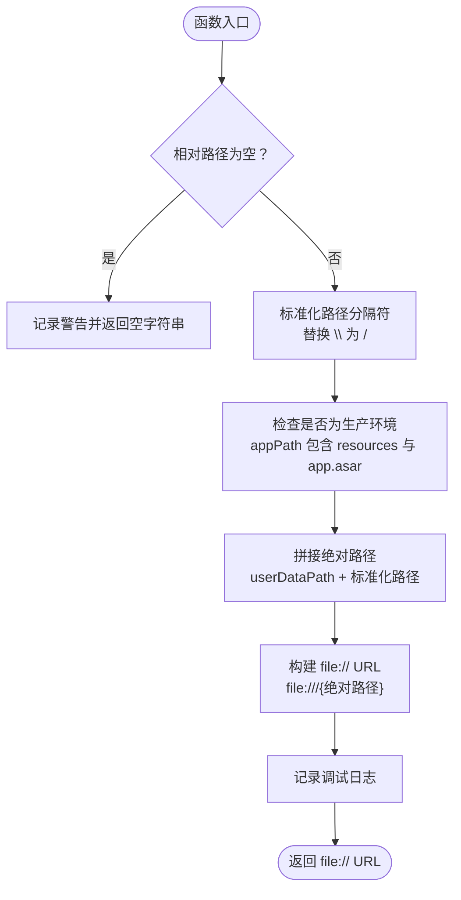
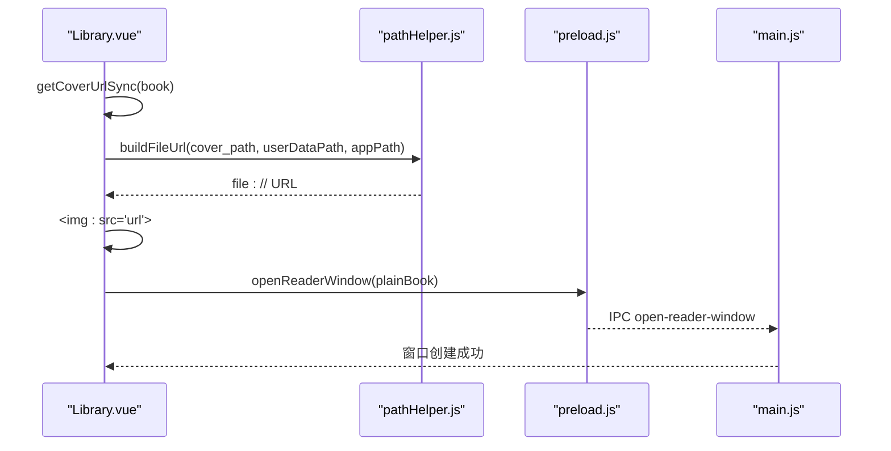
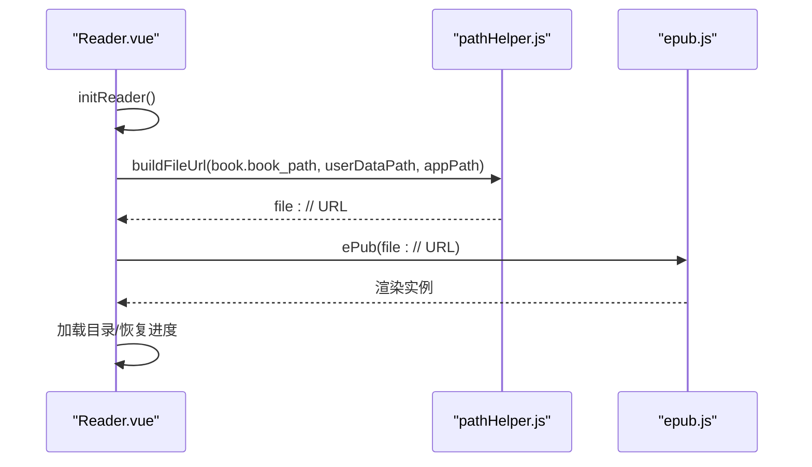
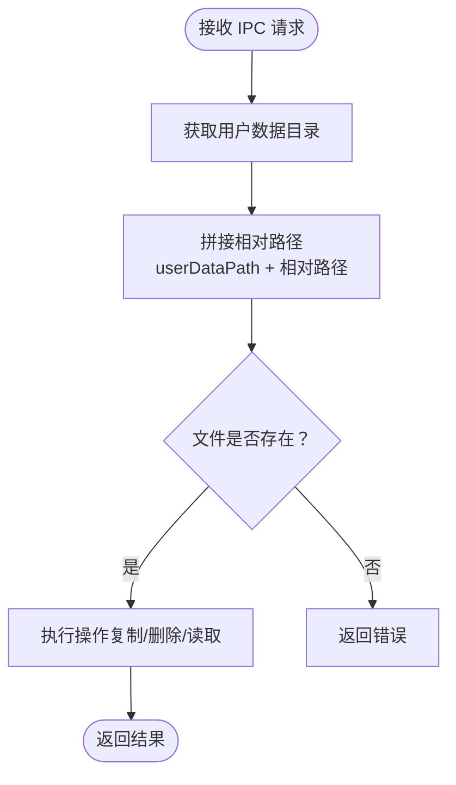
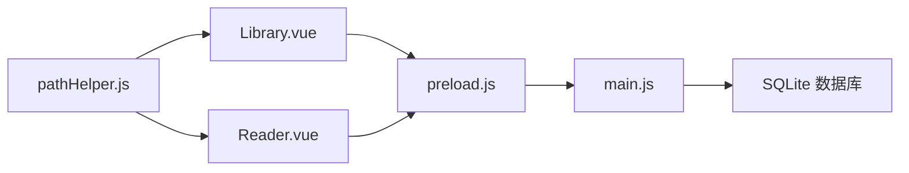

# 路径处理系统

<cite>
**本文引用的文件**
- [pathHelper.js](file://src/utils/pathHelper.js)
- [PATH_COMPATIBILITY.md](file://docs/PATH_COMPATIBILITY.md)
- [Library.vue](file://src/components/Library.vue)
- [Reader.vue](file://src/components/Reader.vue)
- [bookStore.js](file://src/stores/bookStore.js)
- [preload.js](file://electron/preload.js)
- [main.js](file://electron/main.js)
- [README.md](file://README.md)
</cite>

## 目录
1. [简介](#简介)
2. [项目结构](#项目结构)
3. [核心组件](#核心组件)
4. [架构概览](#架构概览)
5. [详细组件分析](#详细组件分析)
6. [依赖关系分析](#依赖关系分析)
7. [性能考虑](#性能考虑)
8. [故障排除指南](#故障排除指南)
9. [结论](#结论)
10. [附录](#附录)

## 简介
本文件详细阐述 EPUB Reader 应用中的路径处理系统，重点覆盖：
- 跨平台文件路径处理的挑战与解决方案
- 相对路径与绝对路径的转换算法
- EPUB 内部文件路径的解析与规范化
- Windows、macOS、Linux 平台的路径差异与兼容性处理
- 路径安全验证与路径遍历攻击防护机制
- 路径缓存与性能优化策略
- 路径处理在 EPUB 文件解析中的具体应用场景

## 项目结构
该应用采用 Electron + Vue 3 架构，路径处理贯穿前端组件、预加载脚本与主进程之间：
- 前端组件通过预加载脚本暴露的 API 获取应用路径与用户数据目录
- 路径工具函数负责将相对路径标准化并转换为 file:// URL
- 主进程统一使用用户数据目录存储用户上传的 EPUB 书籍与封面图片
- 数据库存储相对路径，确保跨平台一致性

**图表来源**
- [Library.vue:688-701](file://src/components/Library.vue#L688-L701)
- [Reader.vue:232-250](file://src/components/Reader.vue#L232-L250)
- [pathHelper.js:13-52](file://src/utils/pathHelper.js#L13-L52)
- [preload.js:68-75](file://electron/preload.js#L68-L75)
- [main.js:101-133](file://electron/main.js#L101-L133)

**章节来源**
- [README.md:167-193](file://README.md#L167-L193)

## 核心组件
- 路径工具函数：负责相对路径标准化、生产/开发环境识别、file:// URL 构建与有效性校验
- 前端组件：Library.vue（封面显示）、Reader.vue（EPUB 加载）
- 预加载脚本：暴露 IPC 接口，提供应用路径与用户数据目录查询
- 主进程：统一使用用户数据目录保存文件，数据库存储相对路径
- 状态管理：bookStore.js 协调前端与主进程交互

**章节来源**
- [pathHelper.js:13-62](file://src/utils/pathHelper.js#L13-L62)
- [Library.vue:688-701](file://src/components/Library.vue#L688-L701)
- [Reader.vue:232-250](file://src/components/Reader.vue#L232-L250)
- [preload.js:68-75](file://electron/preload.js#L68-L75)
- [main.js:101-133](file://electron/main.js#L101-L133)
- [bookStore.js:12-22](file://src/stores/bookStore.js#L12-L22)

## 架构概览
路径处理系统的关键流程如下：
1. 前端组件通过预加载脚本获取 appPath 与 userDataPath
2. 使用路径工具函数将数据库中存储的相对路径标准化并拼接为绝对路径
3. 转换为 file:// URL 供 EPUB 渲染引擎使用
4. 主进程统一使用用户数据目录保存文件，数据库仅存储相对路径

**图表来源**
- [Reader.vue:242-248](file://src/components/Reader.vue#L242-L248)
- [Library.vue:670-675](file://src/components/Library.vue#L670-L675)
- [pathHelper.js:13-52](file://src/utils/pathHelper.js#L13-L52)
- [preload.js:68-75](file://electron/preload.js#L68-L75)
- [main.js:101-133](file://electron/main.js#L101-L133)

## 详细组件分析

### 路径工具函数（pathHelper.js）
- 功能概述
  - 将相对路径标准化（统一斜杠）
  - 识别生产环境（app.asar）
  - 统一使用用户数据目录构建绝对路径
  - 转换为 file:// URL
  - 提供 URL 有效性校验

- 算法要点
  - 路径标准化：将反斜杠替换为正斜杠
  - 环境判断：通过 appPath 是否包含 resources 与 app.asar 判断生产环境
  - 绝对路径拼接：userDataPath + 相对路径
  - URL 构建：file:///{绝对路径}

- 安全与兼容性
  - 统一使用用户数据目录，避免访问只读目录
  - 通过 file:// URL 避免跨平台路径差异带来的问题

**图表来源**
- [pathHelper.js:13-52](file://src/utils/pathHelper.js#L13-L52)

**章节来源**
- [pathHelper.js:13-62](file://src/utils/pathHelper.js#L13-L62)

### 前端组件集成（Library.vue）
- 封面图片加载
  - 通过 getCoverUrlSync(book) 调用路径工具函数
  - 使用 appPathLoaded 确保路径信息已加载
  - 失败时回退到占位符

- 书籍打开
  - 将书籍对象转换为普通对象后通过 IPC 发送
  - 预加载脚本负责窗口创建与路由参数传递

**图表来源**
- [Library.vue:688-701](file://src/components/Library.vue#L688-L701)
- [pathHelper.js:13-52](file://src/utils/pathHelper.js#L13-L52)
- [preload.js:76-79](file://electron/preload.js#L76-L79)
- [main.js:800-819](file://electron/main.js#L800-L819)

**章节来源**
- [Library.vue:688-718](file://src/components/Library.vue#L688-L718)

### EPUB 加载流程（Reader.vue）
- 初始化阅读器
  - 获取 appPath 与 userDataPath
  - 调用路径工具函数构建 EPUB 文件 URL
  - 使用 epub.js 渲染 EPUB

- 目录与进度处理
  - 加载目录并跳过封面/版权页
  - 恢复阅读进度并后台生成位置索引

**图表来源**
- [Reader.vue:232-250](file://src/components/Reader.vue#L232-L250)
- [pathHelper.js:13-52](file://src/utils/pathHelper.js#L13-L52)

**章节来源**
- [Reader.vue:232-425](file://src/components/Reader.vue#L232-L425)

### 主进程文件处理（main.js）
- EPUB 元数据提取与文件保存
  - 使用用户数据目录保存封面与 EPUB 文件
  - 数据库中存储相对路径（upload/covers/xxx.jpg）

- 导出与删除
  - 通过相对路径拼接用户数据目录定位文件
  - 删除书籍时同步删除封面与 EPUB 文件

**图表来源**
- [main.js:517-526](file://electron/main.js#L517-L526)
- [main.js:607-622](file://electron/main.js#L607-L622)

**章节来源**
- [main.js:101-133](file://electron/main.js#L101-L133)
- [main.js:517-526](file://electron/main.js#L517-L526)
- [main.js:607-622](file://electron/main.js#L607-L622)

### 预加载脚本（preload.js）
- 暴露 IPC 接口
  - getAppPath/getUserDataPath：供前端查询路径
  - openReaderWindow/openEpub：触发主进程操作

- 日志与调试
  - 每个接口调用均记录日志，便于问题排查

**章节来源**
- [preload.js:68-75](file://electron/preload.js#L68-L75)
- [preload.js:76-79](file://electron/preload.js#L76-L79)

## 依赖关系分析
- 组件依赖
  - Library.vue 与 Reader.vue 依赖 pathHelper.js 进行路径构建
  - 两者通过 preload.js 与主进程通信
- 主进程依赖
  - 使用 better-sqlite3 存储数据，统一使用用户数据目录
  - 使用 path.join 进行路径拼接，避免跨平台差异
- 文档与实现一致性
  - PATH_COMPATIBILITY.md 与实现保持一致，强调统一使用用户数据目录

**图表来源**
- [pathHelper.js:13-52](file://src/utils/pathHelper.js#L13-L52)
- [Library.vue:688-701](file://src/components/Library.vue#L688-L701)
- [Reader.vue:232-250](file://src/components/Reader.vue#L232-L250)
- [preload.js:68-75](file://electron/preload.js#L68-L75)
- [main.js:101-133](file://electron/main.js#L101-L133)

**章节来源**
- [PATH_COMPATIBILITY.md:132-148](file://docs/PATH_COMPATIBILITY.md#L132-L148)

## 性能考虑
- 路径缓存策略
  - 前端组件在组件挂载时一次性获取 appPath 与 userDataPath，并在组件生命周期内复用
  - 避免重复 IPC 调用，减少主进程压力
- 后台任务
  - Reader.vue 在初始化完成后后台生成 EPUB 位置索引，避免阻塞首屏渲染
- I/O 优化
  - 主进程使用 better-sqlite3 与 WAL 模式，提升并发读写性能
  - 目录扫描与磁盘空间查询采用异步方式，避免阻塞主线程

**章节来源**
- [Reader.vue:427-438](file://src/components/Reader.vue#L427-L438)
- [main.js:185-187](file://electron/main.js#L185-L187)
- [main.js:829-844](file://electron/main.js#L829-L844)

## 故障排除指南
- 路径构建失败
  - 检查相对路径是否为空
  - 确认 appPath 与 userDataPath 是否正确获取
  - 查看控制台日志中的调试信息
- EPUB 无法加载
  - 确认 file:// URL 是否有效
  - 检查用户数据目录中文件是否存在
  - 验证 EPUB 文件完整性
- 路径遍历攻击防护
  - 数据库仅存储相对路径，主进程统一拼接用户数据目录
  - 严格限制文件操作范围，避免访问用户数据目录之外的文件

**章节来源**
- [pathHelper.js:14-17](file://src/utils/pathHelper.js#L14-L17)
- [Reader.vue:418-424](file://src/components/Reader.vue#L418-L424)
- [main.js:101-133](file://electron/main.js#L101-L133)

## 结论
本路径处理系统通过统一的用户数据目录、标准化的相对路径存储与 file:// URL 构建，实现了跨平台的一致性与安全性。结合前端缓存与后台任务优化，系统在开发与生产环境中均能稳定运行，满足 EPUB 文件解析与阅读的核心需求。

## 附录
- 平台路径差异与兼容性
  - Windows：file:///C:/Users/...，路径分隔符为反斜杠
  - macOS/Linux：file:///Users/... 或 /home/...，路径分隔符为正斜杠
  - 通过路径工具函数统一斜杠，避免跨平台差异
- 相对路径与绝对路径转换算法
  - 标准化：将反斜杠替换为正斜杠
  - 环境识别：通过 appPath 是否包含 resources 与 app.asar
  - 绝对路径拼接：userDataPath + 标准化路径
  - URL 构建：file:///{绝对路径}
- EPUB 内部文件路径解析与规范化
  - 主进程使用 path.join 规范化路径
  - 数据库仅存储相对路径，确保跨平台一致性

**章节来源**
- [PATH_COMPATIBILITY.md:1-191](file://docs/PATH_COMPATIBILITY.md#L1-L191)
- [pathHelper.js:13-52](file://src/utils/pathHelper.js#L13-L52)
- [main.js:97-98](file://electron/main.js#L97-L98)