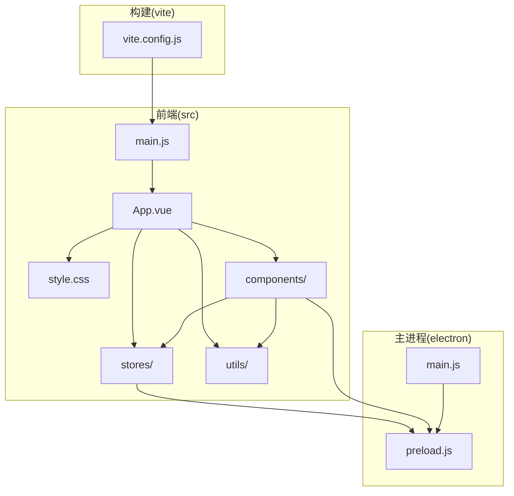
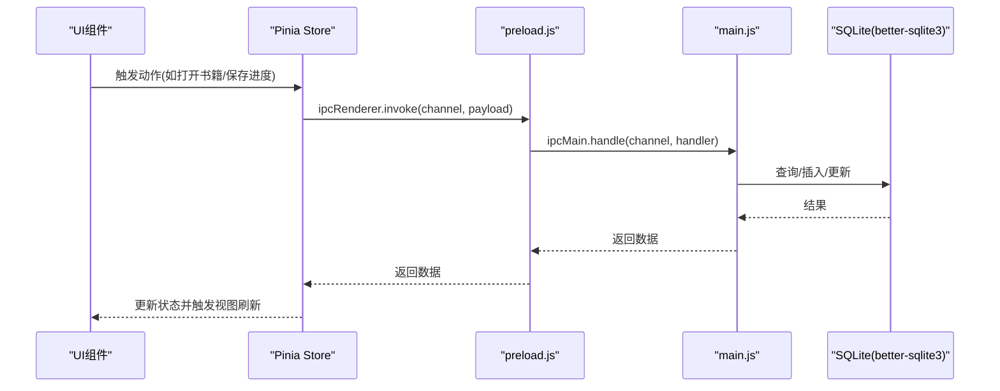
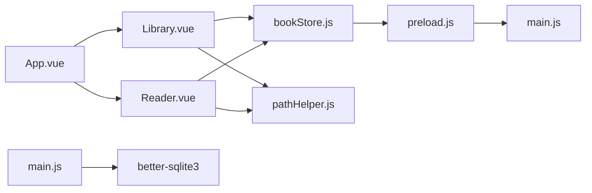

# 代码规范

<cite>
**本文引用的文件**
- [README.md](file://README.md)
- [package.json](file://package.json)
- [vite.config.js](file://vite.config.js)
- [src/main.js](file://src/main.js)
- [src/App.vue](file://src/App.vue)
- [src/style.css](file://src/style.css)
- [src/components/Library.vue](file://src/components/Library.vue)
- [src/components/Reader.vue](file://src/components/Reader.vue)
- [src/stores/bookStore.js](file://src/stores/bookStore.js)
- [src/utils/httpHelper.js](file://src/utils/httpHelper.js)
- [src/utils/pathHelper.js](file://src/utils/pathHelper.js)
- [electron/main.js](file://electron/main.js)
- [electron/preload.js](file://electron/preload.js)
</cite>

## 目录
1. [简介](#简介)
2. [项目结构](#项目结构)
3. [核心组件](#核心组件)
4. [架构总览](#架构总览)
5. [详细组件分析](#详细组件分析)
6. [依赖关系分析](#依赖关系分析)
7. [性能考量](#性能考量)
8. [故障排查指南](#故障排查指南)
9. [结论](#结论)
10. [附录](#附录)

## 简介
本规范文档面向 ROSAA 电子书阅读器项目，聚焦于 Vue 3 Composition API 的最佳实践、JavaScript/ES6+ 编码标准、CSS 样式编写规范、文件组织与命名约定，以及代码审查检查清单与常见问题解决方案。目标是统一团队开发风格，提升可维护性与一致性。

## 项目结构
项目采用典型的 Electron + Vue 3 + Vite 前后端分离架构：
- 前端（src）：Vue 单文件组件、状态管理（Pinia）、工具函数、全局样式
- 主进程（electron）：数据库初始化、IPC 处理、窗口管理
- 构建（vite.config.js）：别名、基础路径、开发服务器端口
- 依赖与脚本（package.json）：开发与打包脚本、构建配置

图表来源
- [src/main.js:1-11](file://src/main.js#L1-L11)
- [src/App.vue:1-64](file://src/App.vue#L1-L64)
- [src/style.css:1-692](file://src/style.css#L1-L692)
- [src/components/Library.vue:1-1291](file://src/components/Library.vue#L1-L1291)
- [src/components/Reader.vue:1-1026](file://src/components/Reader.vue#L1-L1026)
- [src/stores/bookStore.js:1-234](file://src/stores/bookStore.js#L1-L234)
- [src/utils/httpHelper.js:1-47](file://src/utils/httpHelper.js#L1-L47)
- [src/utils/pathHelper.js:1-63](file://src/utils/pathHelper.js#L1-L63)
- [electron/main.js:1-820](file://electron/main.js#L1-L820)
- [electron/preload.js:1-95](file://electron/preload.js#L1-L95)
- [vite.config.js:1-18](file://vite.config.js#L1-L18)

章节来源
- [README.md:167-193](file://README.md#L167-L193)
- [package.json:1-82](file://package.json#L1-L82)
- [vite.config.js:1-18](file://vite.config.js#L1-L18)

## 核心组件
- App.vue：根组件，负责路由切换（书架/阅读器）、窗口标题与 URL 参数处理
- Library.vue：书架组件，包含分类、搜索、排序、右键菜单、登录、导出等功能
- Reader.vue：阅读器组件，集成 EPUB.js，支持翻页/滚动模式、书签、批注、目录跳转
- bookStore.js：Pinia Store，封装与主进程 IPC 的数据交互
- httpHelper.js：HTTP 工具，统一注入 Authorization 头
- pathHelper.js：路径工具，跨开发/生产环境构建 file:// URL
- main.js：应用入口，注册 Pinia 并挂载
- style.css：全局样式，采用 BEM 风格类名与组件作用域样式结合

章节来源
- [src/App.vue:1-64](file://src/App.vue#L1-L64)
- [src/components/Library.vue:1-1291](file://src/components/Library.vue#L1-L1291)
- [src/components/Reader.vue:1-1026](file://src/components/Reader.vue#L1-L1026)
- [src/stores/bookStore.js:1-234](file://src/stores/bookStore.js#L1-L234)
- [src/utils/httpHelper.js:1-47](file://src/utils/httpHelper.js#L1-L47)
- [src/utils/pathHelper.js:1-63](file://src/utils/pathHelper.js#L1-L63)
- [src/main.js:1-11](file://src/main.js#L1-L11)
- [src/style.css:1-692](file://src/style.css#L1-L692)

## 架构总览
前后端通过 Electron 的 IPC 通道通信，前端通过 preload 暴露的 window.electronAPI 调用主进程能力；Pinia Store 统一管理书籍、分类、进度、书签、批注等状态。

图表来源
- [src/stores/bookStore.js:1-234](file://src/stores/bookStore.js#L1-L234)
- [electron/preload.js:1-95](file://electron/preload.js#L1-L95)
- [electron/main.js:1-820](file://electron/main.js#L1-L820)

## 详细组件分析

### 组件命名与文件组织
- 组件文件命名：采用 PascalCase，如 Library.vue、Reader.vue
- 组件内部导出：使用 defineStore 命名导出，便于按需引入
- 工具函数文件：采用小驼峰命名，如 httpHelper.js、pathHelper.js
- 样式文件：全局样式 style.css，组件内使用 scoped 样式隔离

章节来源
- [README.md:424-429](file://README.md#L424-L429)
- [src/components/Library.vue:1-1291](file://src/components/Library.vue#L1-L1291)
- [src/components/Reader.vue:1-1026](file://src/components/Reader.vue#L1-L1026)
- [src/stores/bookStore.js:1-234](file://src/stores/bookStore.js#L1-L234)
- [src/utils/httpHelper.js:1-47](file://src/utils/httpHelper.js#L1-L47)
- [src/utils/pathHelper.js:1-63](file://src/utils/pathHelper.js#L1-L63)

### Vue 3 Composition API 最佳实践
- 响应式数据：使用 ref/computed/watchEffect 管理局部状态
- 生命周期：onMounted/onUnmounted 中进行资源初始化与清理
- 事件与回调：通过 defineEmits 暴露事件，避免直接操作 DOM
- Props 与类型：明确 props 类型与必填项，减少运行时错误
- 组合逻辑：将重复逻辑抽取为组合函数（如路径构建、HTTP 请求）

章节来源
- [src/App.vue:8-63](file://src/App.vue#L8-L63)
- [src/components/Library.vue:248-589](file://src/components/Library.vue#L248-L589)
- [src/components/Reader.vue:161-222](file://src/components/Reader.vue#L161-L222)
- [src/stores/bookStore.js:4-234](file://src/stores/bookStore.js#L4-L234)

### JavaScript/ES6+ 编码标准
- 模块化：统一使用 ES Module 导入导出，避免混用 CommonJS
- 解构赋值：合理使用解构简化对象属性访问
- 箭头函数：在回调中使用箭头函数保持 this 上下文稳定
- 异步处理：统一使用 async/await，集中 try/catch
- 常量命名：UPPER_SNAKE_CASE（如常量定义）
- 变量与函数命名：camelCase（如函数名、变量名）

章节来源
- [src/utils/httpHelper.js:1-47](file://src/utils/httpHelper.js#L1-L47)
- [src/utils/pathHelper.js:1-63](file://src/utils/pathHelper.js#L1-L63)
- [src/stores/bookStore.js:1-234](file://src/stores/bookStore.js#L1-L234)
- [README.md:424-429](file://README.md#L424-L429)

### CSS 样式编写规范
- 类名命名：采用 BEM 风格，如 .library-container、.book-card、.btn-primary
- 组件作用域：组件内样式使用 scoped，避免全局污染
- 全局样式：全局样式集中于 style.css，按模块分段注释
- 动画与过渡：使用 CSS 动画与过渡，避免复杂 JS 动画
- 响应式：使用媒体查询与相对单位，适配不同屏幕尺寸

章节来源
- [src/style.css:1-692](file://src/style.css#L1-L692)
- [src/components/Library.vue:623-800](file://src/components/Library.vue#L623-L800)
- [src/components/Reader.vue:1-159](file://src/components/Reader.vue#L1-L159)

### 文件组织与命名约定
- 组件文件：PascalCase，如 Library.vue、Reader.vue
- 工具函数：小驼峰，如 httpHelper.js、pathHelper.js
- 状态管理：store 文件使用小驼峰，如 bookStore.js
- 全局样式：style.css
- 静态资源：public 目录，图标与 Logo 放置于此

章节来源
- [README.md:167-193](file://README.md#L167-L193)
- [src/style.css:1-692](file://src/style.css#L1-L692)

### 代码审查检查清单
- 组件职责单一：每个组件只负责一个功能域
- 响应式数据最小化：仅暴露必要的响应式数据
- 生命周期钩子：在 onMounted 中初始化，在 onUnmounted 中清理
- IPC 调用：统一通过 window.electronAPI，错误处理完备
- 路径处理：使用 pathHelper 构建 file:// URL，兼容开发/生产
- HTTP 请求：使用 httpHelper 注入 Authorization 头
- 样式隔离：组件内样式使用 scoped，避免全局污染
- 命名一致性：组件、函数、变量、常量命名风格统一
- 错误提示：用户可见的错误提示与控制台日志并存

章节来源
- [src/components/Library.vue:248-589](file://src/components/Library.vue#L248-L589)
- [src/components/Reader.vue:161-222](file://src/components/Reader.vue#L161-L222)
- [src/stores/bookStore.js:1-234](file://src/stores/bookStore.js#L1-L234)
- [src/utils/httpHelper.js:1-47](file://src/utils/httpHelper.js#L1-L47)
- [src/utils/pathHelper.js:1-63](file://src/utils/pathHelper.js#L1-L63)
- [src/style.css:1-692](file://src/style.css#L1-L692)
- [README.md:424-429](file://README.md#L424-L429)

### 常见代码问题与解决方案
- 未定义的 Electron API：在 App.vue 中检查 window.electronAPI 并给出提示
- 路径无效：在 pathHelper 中校验 file:// URL，避免空白路径
- IPC 调用失败：在 preload 中统一记录日志，捕获异常并返回错误
- 样式冲突：组件内使用 scoped，全局样式按模块划分
- 性能问题：Reader.vue 中后台生成 locations，避免阻塞首屏

章节来源
- [src/App.vue:18-41](file://src/App.vue#L18-L41)
- [src/utils/pathHelper.js:55-63](file://src/utils/pathHelper.js#L55-L63)
- [electron/preload.js:7-92](file://electron/preload.js#L7-L92)
- [src/components/Reader.vue:427-438](file://src/components/Reader.vue#L427-L438)

## 依赖关系分析

图表来源
- [src/App.vue:1-64](file://src/App.vue#L1-L64)
- [src/components/Library.vue:1-1291](file://src/components/Library.vue#L1-L1291)
- [src/components/Reader.vue:1-1026](file://src/components/Reader.vue#L1-L1026)
- [src/stores/bookStore.js:1-234](file://src/stores/bookStore.js#L1-L234)
- [src/utils/pathHelper.js:1-63](file://src/utils/pathHelper.js#L1-L63)
- [electron/preload.js:1-95](file://electron/preload.js#L1-L95)
- [electron/main.js:1-820](file://electron/main.js#L1-L820)

章节来源
- [package.json:22-41](file://package.json#L22-L41)
- [vite.config.js:1-18](file://vite.config.js#L1-L18)

## 性能考量
- 首屏加载：Reader.vue 采用后台生成 locations，避免阻塞首屏渲染
- 滚动模式：在滚动模式下动态设置 iframe 宽度，保证渲染稳定性
- 数据库：启用 WAL 模式，提升并发读写性能
- 资源路径：统一通过 pathHelper 构建 file:// URL，减少路径错误导致的重试

章节来源
- [src/components/Reader.vue:427-438](file://src/components/Reader.vue#L427-L438)
- [electron/main.js:185-187](file://electron/main.js#L185-L187)
- [src/utils/pathHelper.js:13-53](file://src/utils/pathHelper.js#L13-L53)

## 故障排查指南
- 开发环境：使用 npm run electron:dev 启动，查看 Vite 与主进程日志
- 生产环境：使用 npm run electron:build 打包，检查 dist-electron 输出
- IPC 调用：在 preload 中记录调用链路，定位主进程处理异常
- 数据库：确认数据库目录与表结构，检查 WAL 模式启用状态
- 路径问题：确认 appPath 与 userDataPath 是否正确加载，file:// URL 是否有效

章节来源
- [README.md:431-452](file://README.md#L431-L452)
- [electron/preload.js:7-92](file://electron/preload.js#L7-L92)
- [electron/main.js:167-284](file://electron/main.js#L167-L284)
- [src/App.vue:18-41](file://src/App.vue#L18-L41)

## 结论
本规范文档总结了 ROSAA 电子书阅读器项目的代码风格与最佳实践，涵盖 Vue 3 Composition API、ES6+、CSS、文件组织与命名、代码审查清单及常见问题处理。建议在团队内推广并持续演进，以保障项目的长期可维护性与一致性。

## 附录
- 开发与打包脚本：参考 package.json 中 scripts 字段
- 构建配置：参考 vite.config.js 中的别名与开发服务器配置
- 项目结构：参考 README.md 中的目录说明

章节来源
- [package.json:6-12](file://package.json#L6-L12)
- [vite.config.js:5-17](file://vite.config.js#L5-L17)
- [README.md:167-193](file://README.md#L167-L193)