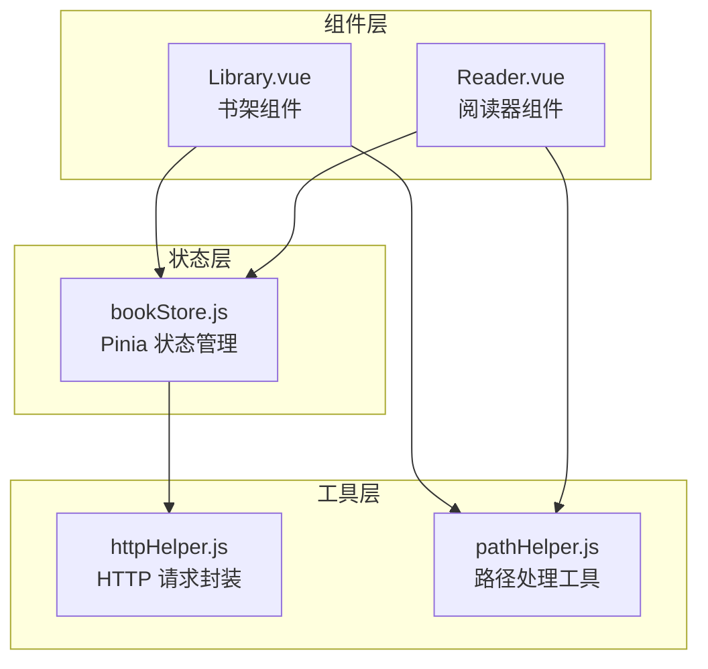
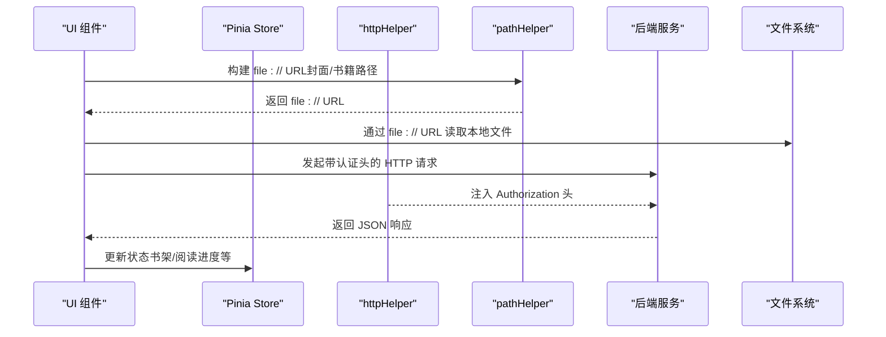
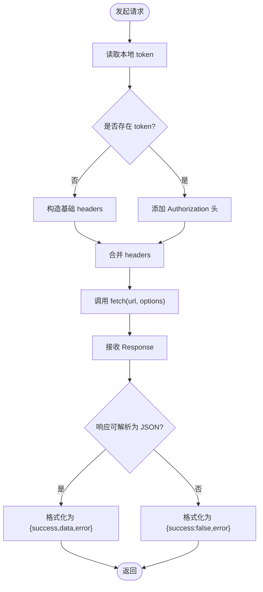
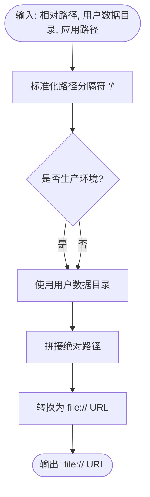
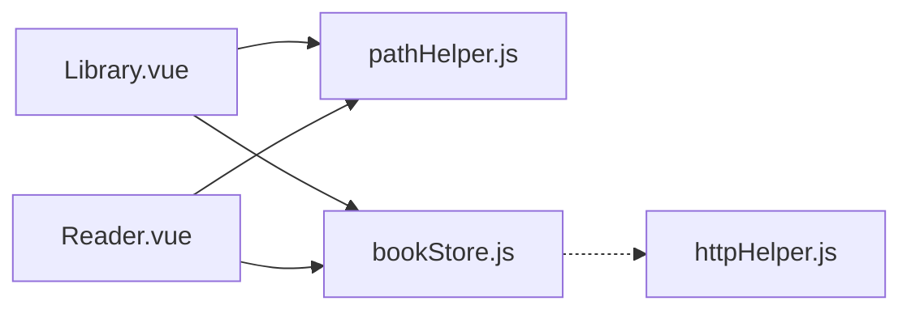

# 工具函数库

<cite>
**本文引用的文件**
- [httpHelper.js](file://src/utils/httpHelper.js)
- [pathHelper.js](file://src/utils/pathHelper.js)
- [Library.vue](file://src/components/Library.vue)
- [Reader.vue](file://src/components/Reader.vue)
- [bookStore.js](file://src/stores/bookStore.js)
- [PATH_COMPATIBILITY.md](file://docs/PATH_COMPATIBILITY.md)
- [DATA_STORAGE.md](file://docs/DATA_STORAGE.md)
- [README.md](file://README.md)
- [package.json](file://package.json)
</cite>

## 目录
1. [简介](#简介)
2. [项目结构](#项目结构)
3. [核心组件](#核心组件)
4. [架构概览](#架构概览)
5. [详细组件分析](#详细组件分析)
6. [依赖关系分析](#依赖关系分析)
7. [性能考量](#性能考量)
8. [故障排除指南](#故障排除指南)
9. [结论](#结论)
10. [附录](#附录)

## 简介
本指南面向 ROSAA 电子书阅读器的工具函数库，重点覆盖两类工具：
- HTTP 请求封装工具：提供带认证头的 fetch 请求封装，支持 GET/POST 等常用场景，内置错误处理与响应数据格式化建议。
- 路径处理工具：提供跨平台文件路径转换、相对路径解析与 file:// URL 构建，确保开发与生产环境一致兼容。

文档将给出 API 参考、使用示例、最佳实践、扩展方法以及测试建议，帮助开发者在组件中正确调用这些工具函数。

## 项目结构
工具函数库位于 src/utils 目录，分别提供 HTTP 与路径处理能力；组件层（Library.vue、Reader.vue）与状态层（bookStore.js）在需要时导入并使用这些工具。

图表来源
- [httpHelper.js:1-47](file://src/utils/httpHelper.js#L1-L47)
- [pathHelper.js:1-63](file://src/utils/pathHelper.js#L1-L63)
- [Library.vue:348-701](file://src/components/Library.vue#L348-L701)
- [Reader.vue:165-247](file://src/components/Reader.vue#L165-L247)
- [bookStore.js:1-234](file://src/stores/bookStore.js#L1-L234)

章节来源
- [README.md:167-193](file://README.md#L167-L193)
- [package.json:1-82](file://package.json#L1-L82)

## 核心组件
- HTTP 请求封装工具
  - getAuthToken：从本地存储获取认证 token
  - createAuthHeaders：为 fetch 请求注入认证头（Authorization: Bearer ...）
  - authFetch：带认证头的 fetch 请求封装
- 路径处理工具
  - buildFileUrl：将相对路径标准化并转换为 file:// URL，兼容开发与生产环境
  - isValidFileUrl：校验是否为有效的 file:// URL

章节来源
- [httpHelper.js:9-46](file://src/utils/httpHelper.js#L9-L46)
- [pathHelper.js:13-62](file://src/utils/pathHelper.js#L13-L62)

## 架构概览
工具函数库与组件/状态层的交互如下：

图表来源
- [Library.vue:688-701](file://src/components/Library.vue#L688-L701)
- [Reader.vue:246-247](file://src/components/Reader.vue#L246-L247)
- [httpHelper.js:18-46](file://src/utils/httpHelper.js#L18-L46)
- [pathHelper.js:13-53](file://src/utils/pathHelper.js#L13-L53)

## 详细组件分析

### HTTP 请求封装工具
- 设计目标
  - 自动在请求头中添加认证 token，简化业务层调用
  - 保持与 fetch 的一致接口，便于替换与扩展
- 关键函数
  - getAuthToken：从 localStorage 读取 auth_token
  - createAuthHeaders：合并默认 Content-Type 与自定义 headers，并在存在 token 时添加 Authorization
  - authFetch：基于 createAuthHeaders 包装 fetch，返回标准 Response
- 错误处理与响应格式化建议
  - 建议在调用方捕获异常并统一处理（如网络错误、4xx/5xx）
  - 建议对响应进行 JSON 解析与状态判断，统一返回 {success, data, error} 结构
  - 建议对 401/403 做 token 失效处理（清除本地 token 并引导重新登录）

图表来源
- [httpHelper.js:9-46](file://src/utils/httpHelper.js#L9-L46)

章节来源
- [httpHelper.js:9-46](file://src/utils/httpHelper.js#L9-L46)
- [Library.vue:608-646](file://src/components/Library.vue#L608-L646)

### 路径处理工具
- 设计目标
  - 统一开发与生产环境的文件路径构建逻辑
  - 将相对路径转换为浏览器可访问的 file:// URL
- 关键函数
  - buildFileUrl：标准化路径分隔符，识别生产环境，拼接用户数据目录，生成 file:// URL
  - isValidFileUrl：校验 URL 前缀
- 使用场景
  - 书架封面显示：根据数据库中的相对路径与用户数据目录构建 file:// URL
  - EPUB 书籍加载：在阅读器中将书籍相对路径转换为 file:// URL 供 EPUB.js 使用

图表来源
- [pathHelper.js:13-53](file://src/utils/pathHelper.js#L13-L53)

章节来源
- [pathHelper.js:13-62](file://src/utils/pathHelper.js#L13-L62)
- [Library.vue:688-701](file://src/components/Library.vue#L688-L701)
- [Reader.vue:246-247](file://src/components/Reader.vue#L246-L247)
- [PATH_COMPATIBILITY.md:58-114](file://docs/PATH_COMPATIBILITY.md#L58-L114)

## 依赖关系分析
- 组件对工具的依赖
  - Library.vue：导入 pathHelper 用于封面 URL 构建；在登录流程中直接使用 fetch（未使用 httpHelper）
  - Reader.vue：导入 pathHelper 用于书籍文件 URL 构建
  - bookStore.js：通过 window.electronAPI 与主进程交互，不直接依赖 httpHelper
- 工具函数之间的依赖
  - httpHelper 内部无相互依赖，独立导出
  - pathHelper 内部无相互依赖，独立导出

图表来源
- [Library.vue:348-348](file://src/components/Library.vue#L348-L348)
- [Reader.vue:165-165](file://src/components/Reader.vue#L165-L165)
- [bookStore.js:1-234](file://src/stores/bookStore.js#L1-L234)
- [httpHelper.js:1-47](file://src/utils/httpHelper.js#L1-L47)
- [pathHelper.js:1-63](file://src/utils/pathHelper.js#L1-L63)

章节来源
- [Library.vue:348-348](file://src/components/Library.vue#L348-L348)
- [Reader.vue:165-165](file://src/components/Reader.vue#L165-L165)
- [bookStore.js:1-234](file://src/stores/bookStore.js#L1-L234)

## 性能考量
- HTTP 请求
  - 使用 fetch 时尽量复用 headers，减少重复构造
  - 对于频繁请求，考虑引入缓存策略（如按 URL 缓存响应）
- 路径处理
  - buildFileUrl 仅做字符串拼接与少量判断，性能开销极低
  - 避免在循环中重复构建相同路径，可缓存中间结果

## 故障排除指南
- HTTP 请求
  - 现象：请求未携带 token
    - 检查 localStorage 中是否存在 auth_token
    - 确认 getAuthToken 返回值
  - 现象：401/403
    - 清除本地 token 并重新登录
    - 检查服务端 token 有效期与签名
- 路径处理
  - 现象：file:// URL 为空或无效
    - 检查 relativePath 是否为空
    - 确认 appPath 与 userDataPath 正确传入
    - 使用 isValidFileUrl 校验 URL 前缀
  - 现象：图片/书籍无法加载
    - 查看控制台日志，确认最终 file:// URL
    - 确认文件确实存在于用户数据目录

章节来源
- [httpHelper.js:9-46](file://src/utils/httpHelper.js#L9-L46)
- [pathHelper.js:13-62](file://src/utils/pathHelper.js#L13-L62)
- [Library.vue:688-701](file://src/components/Library.vue#L688-L701)
- [Reader.vue:246-247](file://src/components/Reader.vue#L246-L247)

## 结论
工具函数库提供了简洁可靠的 HTTP 认证与路径转换能力，满足 Electron + Vue 应用在开发与生产环境的一致性需求。建议在业务层统一通过工具函数封装请求与路径构建，提升可维护性与可测试性。

## 附录

### API 参考

- HTTP 请求封装工具
  - getAuthToken()
    - 参数：无
    - 返回：字符串（localStorage 中的 auth_token），不存在时为 null/空字符串
    - 用途：获取认证 token
  - createAuthHeaders(options)
    - 参数：options（可选，fetch 选项对象）
    - 返回：对象（包含 headers 的新配置）
    - 用途：为 fetch 请求注入 Content-Type 与 Authorization 头
  - authFetch(url, options)
    - 参数：url（字符串）、options（可选，fetch 选项对象）
    - 返回：Promise<Response>
    - 用途：带认证头的 fetch 请求封装

- 路径处理工具
  - buildFileUrl(relativePath, userDataPath, appPath)
    - 参数：
      - relativePath（字符串，相对路径）
      - userDataPath（字符串，用户数据目录）
      - appPath（字符串，应用路径，用于判断生产环境）
    - 返回：字符串（file:// URL）
    - 用途：将相对路径转换为 file:// URL
  - isValidFileUrl(url)
    - 参数：url（字符串）
    - 返回：布尔值
    - 用途：校验是否为有效的 file:// URL

章节来源
- [httpHelper.js:9-46](file://src/utils/httpHelper.js#L9-L46)
- [pathHelper.js:13-62](file://src/utils/pathHelper.js#L13-L62)

### 使用示例与最佳实践

- HTTP 请求封装使用示例
  - 场景：登录接口（示例）
    - 在组件中调用 fetch，或通过 httpHelper.authFetch 统一封装
    - 建议：对响应进行 JSON 解析与状态判断，统一返回 {success, data, error}
  - 场景：带认证的业务接口
    - 使用 createAuthHeaders 或 authFetch，自动注入 Authorization 头
    - 建议：对 401/403 做 token 失效处理

- 路径处理使用示例
  - 场景：书架封面显示
    - 从数据库读取 cover_path，结合 userDataPath 与 appPath，调用 buildFileUrl
    - 将返回的 file:// URL 赋给 img 的 src
  - 场景：阅读器加载 EPUB
    - 从 props.book.book_path 读取书籍相对路径，调用 buildFileUrl
    - 将返回的 file:// URL 传给 EPUB.js 渲染

- 最佳实践
  - 统一通过工具函数封装请求与路径构建，避免分散逻辑
  - 对错误进行集中处理，提供用户友好的提示
  - 在开发与生产环境保持一致的路径构建逻辑

章节来源
- [Library.vue:608-646](file://src/components/Library.vue#L608-L646)
- [Library.vue:688-701](file://src/components/Library.vue#L688-L701)
- [Reader.vue:246-247](file://src/components/Reader.vue#L246-L247)
- [PATH_COMPATIBILITY.md:82-114](file://docs/PATH_COMPATIBILITY.md#L82-L114)

### 设计原则与扩展方法
- 设计原则
  - 单一职责：每个工具函数专注单一功能
  - 无副作用：不直接操作 DOM 或全局状态，返回纯数据
  - 可测试性：参数明确、返回值可预期
- 扩展方法
  - HTTP：新增 authFetch 的超时控制、重试策略、拦截器链
  - 路径：新增路径规范化（去除 ..、..）、多平台路径分隔符适配

### 测试方法与注意事项
- HTTP 工具测试
  - 单元测试：mock localStorage、fetch，验证 headers 注入与返回值
  - 集成测试：模拟 401/403/500 响应，验证错误处理
- 路径工具测试
  - 单元测试：不同相对路径、不同 appPath（开发/生产）、不同 userDataPath
  - 集成测试：与组件联调，验证 file:// URL 能被浏览器正确加载
- 注意事项
  - 路径工具依赖 appPath 与 userDataPath 的正确传入
  - 生产环境 appPath 包含 resources/app.asar，需据此判断环境

章节来源
- [httpHelper.js:9-46](file://src/utils/httpHelper.js#L9-L46)
- [pathHelper.js:13-62](file://src/utils/pathHelper.js#L13-L62)
- [PATH_COMPATIBILITY.md:169-181](file://docs/PATH_COMPATIBILITY.md#L169-L181)