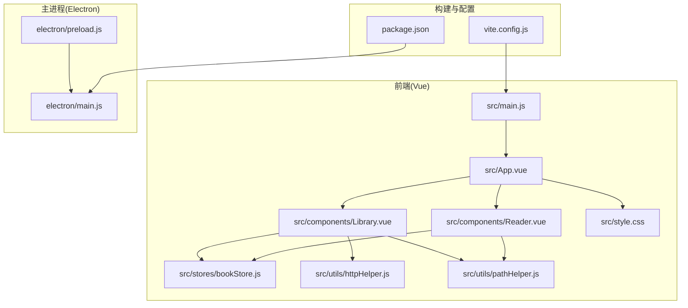
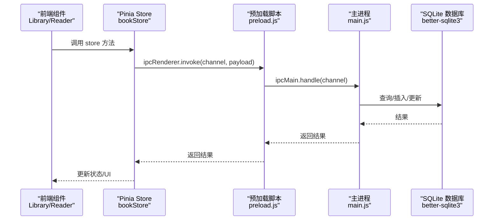
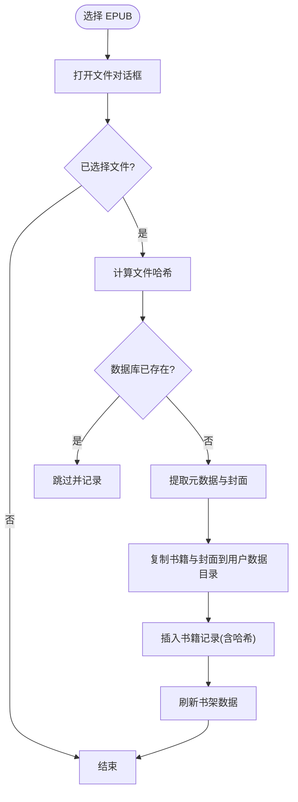
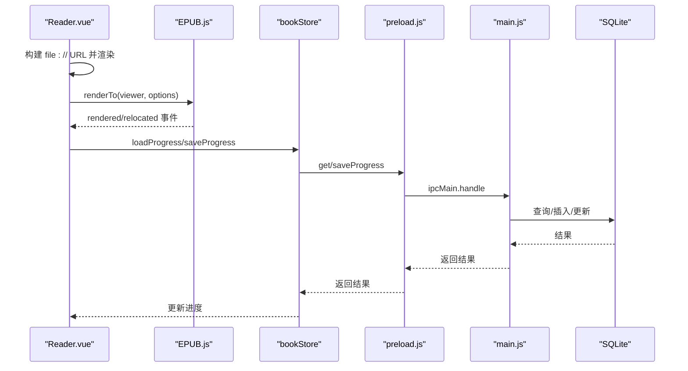
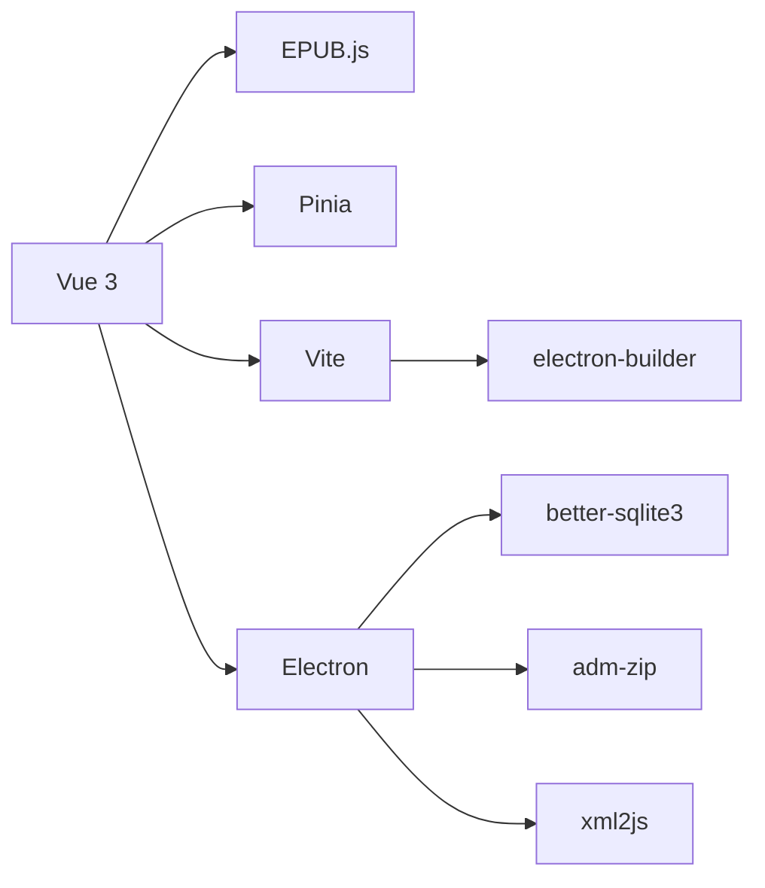

# 开发指南

<cite>
**本文引用的文件**
- [README.md](file://README.md)
- [package.json](file://package.json)
- [vite.config.js](file://vite.config.js)
- [src/main.js](file://src/main.js)
- [src/App.vue](file://src/App.vue)
- [src/components/Library.vue](file://src/components/Library.vue)
- [src/components/Reader.vue](file://src/components/Reader.vue)
- [src/stores/bookStore.js](file://src/stores/bookStore.js)
- [src/utils/httpHelper.js](file://src/utils/httpHelper.js)
- [src/utils/pathHelper.js](file://src/utils/pathHelper.js)
- [src/style.css](file://src/style.css)
- [electron/main.js](file://electron/main.js)
- [electron/preload.js](file://electron/preload.js)
</cite>

## 目录
1. [简介](#简介)
2. [项目结构](#项目结构)
3. [核心组件](#核心组件)
4. [架构总览](#架构总览)
5. [详细组件分析](#详细组件分析)
6. [依赖关系分析](#依赖关系分析)
7. [性能考虑](#性能考虑)
8. [故障排除指南](#故障排除指南)
9. [结论](#结论)
10. [附录](#附录)

## 简介
本指南面向 ROSAA 电子书阅读器项目的开发者，提供从代码规范、开发环境配置、调试技巧到工具函数库使用、重构建议与性能优化的完整开发参考。项目采用 Electron + Vue 3 + SQLite 技术栈，结合 Pinia 状态管理、EPUB.js 渲染与 better-sqlite3 数据持久化，实现跨平台桌面应用。

## 项目结构
项目采用按层组织的结构：
- electron：主进程与预加载脚本，负责数据库初始化、文件系统交互与 IPC 通信
- src：Vue 前端源码，包含组件、状态管理、工具函数与全局样式
- db：SQLite 初始化数据（打包时随应用分发）
- public：静态资源（图标、Logo）
- 根目录：构建脚本、打包配置与项目说明

图表来源
- [src/main.js:1-11](file://src/main.js#L1-L11)
- [src/App.vue:1-64](file://src/App.vue#L1-L64)
- [src/components/Library.vue:1-1291](file://src/components/Library.vue#L1-L1291)
- [src/components/Reader.vue:1-1026](file://src/components/Reader.vue#L1-L1026)
- [src/stores/bookStore.js:1-234](file://src/stores/bookStore.js#L1-L234)
- [src/utils/httpHelper.js:1-47](file://src/utils/httpHelper.js#L1-L47)
- [src/utils/pathHelper.js:1-63](file://src/utils/pathHelper.js#L1-L63)
- [src/style.css:1-692](file://src/style.css#L1-L692)
- [electron/main.js:1-820](file://electron/main.js#L1-L820)
- [electron/preload.js:1-95](file://electron/preload.js#L1-L95)
- [vite.config.js:1-18](file://vite.config.js#L1-L18)
- [package.json:1-82](file://package.json#L1-L82)

章节来源
- [README.md:167-193](file://README.md#L167-L193)
- [package.json:1-82](file://package.json#L1-L82)

## 核心组件
- App.vue：根组件，根据阅读状态在 Library 与 Reader 之间切换，并处理 URL 参数驱动的自动打开阅读器
- Library.vue：书架组件，负责 EPUB 选择、分类管理、搜索与排序、右键菜单、导出与删除书籍等
- Reader.vue：阅读器组件，集成 EPUB.js 渲染、目录与书签侧边栏、批注高亮、阅读模式切换、进度保存
- bookStore.js：Pinia Store，封装所有与后端 IPC 的数据访问方法，统一状态管理
- httpHelper.js：HTTP 请求封装，自动注入认证头
- pathHelper.js：路径工具，将相对路径转换为 file:// URL，兼容开发与生产环境
- electron/main.js：主进程，数据库初始化、EPUB 元数据提取、文件复制、IPC 处理器
- electron/preload.js：预加载脚本，通过 contextBridge 暴露安全的 window.electronAPI

章节来源
- [src/App.vue:1-64](file://src/App.vue#L1-L64)
- [src/components/Library.vue:1-1291](file://src/components/Library.vue#L1-L1291)
- [src/components/Reader.vue:1-1026](file://src/components/Reader.vue#L1-L1026)
- [src/stores/bookStore.js:1-234](file://src/stores/bookStore.js#L1-L234)
- [src/utils/httpHelper.js:1-47](file://src/utils/httpHelper.js#L1-L47)
- [src/utils/pathHelper.js:1-63](file://src/utils/pathHelper.js#L1-L63)
- [electron/main.js:1-820](file://electron/main.js#L1-L820)
- [electron/preload.js:1-95](file://electron/preload.js#L1-L95)

## 架构总览
前端通过 window.electronAPI 与主进程通信，主进程使用 better-sqlite3 管理数据库，EPUB.js 渲染书籍内容。Vite 提供开发服务器，electron-builder 负责打包。

图表来源
- [src/stores/bookStore.js:1-234](file://src/stores/bookStore.js#L1-L234)
- [electron/preload.js:1-95](file://electron/preload.js#L1-L95)
- [electron/main.js:1-820](file://electron/main.js#L1-L820)

## 详细组件分析

### 组件 A：Library.vue（书架与分类管理）
- 功能要点
  - EPUB 选择与去重（基于路径与文件哈希）
  - 分类管理（增删改查）、书籍分配分类
  - 搜索与排序（按最近添加/书名）
  - 右键菜单（打开、导出、导出笔记、彻底删除）
  - 登录状态与本地缓存 token
  - 封面加载与错误回退
- 关键流程
  - 选择 EPUB：openEpub -> 主进程提取元数据与封面 -> 写入用户数据目录 -> 插入数据库 -> 刷新书架
  - 右键菜单：根据选中书籍与上下文位置，执行对应操作
  - 分类管理：增删改查分类并同步到 store 与数据库

图表来源
- [electron/main.js:343-427](file://electron/main.js#L343-L427)
- [src/stores/bookStore.js:71-104](file://src/stores/bookStore.js#L71-L104)

章节来源
- [src/components/Library.vue:1-1291](file://src/components/Library.vue#L1-L1291)
- [src/stores/bookStore.js:1-234](file://src/stores/bookStore.js#L1-L234)
- [electron/main.js:1-820](file://electron/main.js#L1-L820)

### 组件 B：Reader.vue（阅读器与批注）
- 功能要点
  - EPUB.js 渲染、目录与书签侧边栏
  - 右键菜单：摘抄与批注
  - 批注高亮与弹窗提示
  - 阅读模式切换（翻页/滚动）
  - 进度保存与恢复（CFI、页码、百分比）
  - 字体大小调节
- 关键流程
  - 初始化：构建 file:// URL -> 渲染 -> 加载 TOC -> 恢复进度或跳转到合适章节 -> 后台生成 locations
  - 阅读模式切换：销毁旧 rendition -> 重建 -> 恢复位置 -> 重新绑定事件
  - 批注：保存到数据库并通过 EPUB.js 高亮

图表来源
- [src/components/Reader.vue:1-1026](file://src/components/Reader.vue#L1-L1026)
- [src/stores/bookStore.js:161-176](file://src/stores/bookStore.js#L161-L176)
- [electron/preload.js:16-23](file://electron/preload.js#L16-L23)
- [electron/main.js:634-663](file://electron/main.js#L634-L663)

章节来源
- [src/components/Reader.vue:1-1026](file://src/components/Reader.vue#L1-L1026)
- [src/stores/bookStore.js:1-234](file://src/stores/bookStore.js#L1-L234)
- [electron/main.js:1-820](file://electron/main.js#L1-L820)

### 组件 C：App.vue（根组件与路由切换）
- 功能要点
  - 根据 isReading 切换 Library 与 Reader
  - URL 参数驱动自动打开阅读器
  - 检测 window.electronAPI 是否可用并提示
- 交互流程
  - onMounted：加载书籍数据、检查 URL 参数、自动打开阅读器

章节来源
- [src/App.vue:1-64](file://src/App.vue#L1-L64)

### 组件 D：bookStore.js（Pinia Store）
- 功能要点
  - 统一封装 IPC 调用，集中处理错误与日志
  - 管理书籍、分类、进度、书签、批注等状态
- 最佳实践
  - 所有与后端交互的方法均返回 Promise，便于在组件中 await
  - 在 store 内部记录关键日志，便于定位问题

章节来源
- [src/stores/bookStore.js:1-234](file://src/stores/bookStore.js#L1-L234)

### 工具函数库
- httpHelper.js
  - getAuthToken：从 localStorage 获取 token
  - createAuthHeaders：合并自定义 headers 并注入 Authorization
  - authFetch：封装 fetch，自动携带认证头
- pathHelper.js
  - buildFileUrl：将相对路径转换为 file:// URL，区分开发与生产环境
  - isValidFileUrl：校验 URL 是否为 file 协议

章节来源
- [src/utils/httpHelper.js:1-47](file://src/utils/httpHelper.js#L1-L47)
- [src/utils/pathHelper.js:1-63](file://src/utils/pathHelper.js#L1-L63)

### 主进程与预加载
- electron/preload.js
  - 通过 contextBridge.exposeInMainWorld 暴露 window.electronAPI
  - 每个 API 均记录调用日志，便于调试
- electron/main.js
  - 数据库初始化（WAL 模式）、表结构与迁移
  - EPUB 元数据提取、封面保存、书籍复制
  - IPC 处理器：open-epub、get-books、save-progress、get-progress、bookmarks/annotations 等

章节来源
- [electron/preload.js:1-95](file://electron/preload.js#L1-L95)
- [electron/main.js:1-820](file://electron/main.js#L1-L820)

## 依赖关系分析
- 前端依赖
  - Vue 3 + Composition API、Pinia、EPUB.js、Vite
- 主进程依赖
  - better-sqlite3、adm-zip、xml2js、crypto、fs、path
- 构建与打包
  - electron-builder、wait-on、concurrently

图表来源
- [package.json:22-41](file://package.json#L22-L41)
- [vite.config.js:1-18](file://vite.config.js#L1-L18)

章节来源
- [package.json:1-82](file://package.json#L1-L82)

## 性能考虑
- 阅读器性能
  - locations 后台生成：initReader 中延时生成，避免阻塞首屏显示
  - 滚动模式下强制设置 iframe 宽度，避免渲染异常
  - 主题只设置字体大小，不干预分页，减少重排
- 数据库性能
  - 启用 WAL 模式提升并发写入性能
  - 使用索引字段（book_id、file_hash）进行查询与去重
- 资源加载
  - 封面与书籍文件统一保存在用户数据目录，避免跨磁盘 IO
  - 路径工具统一转换为 file:// URL，减少跨平台差异

章节来源
- [src/components/Reader.vue:427-438](file://src/components/Reader.vue#L427-L438)
- [electron/main.js:185-187](file://electron/main.js#L185-L187)
- [src/utils/pathHelper.js:13-53](file://src/utils/pathHelper.js#L13-L53)

## 故障排除指南
- 开发环境
  - 启动：npm run electron:dev 同时启动 Vite 与 Electron
  - 前端日志：Vite 控制台；主进程日志：Electron 主进程控制台
- 生产环境
  - 打包：npm run electron:build 或 npm run build:win
  - 运行安装包：dist-electron 目录下的安装程序
- 常见问题
  - Node.js 版本不符：确保使用 Node.js 18+
  - better-sqlite3 编译失败：安装 Visual Studio 2022 Build Tools
  - 打包失败：检查端口占用、关闭应用实例、网络代理
  - 安装后无法打开：检查用户数据目录权限与控制台日志

章节来源
- [README.md:422-484](file://README.md#L422-L484)
- [README.md:370-420](file://README.md#L370-L420)

## 结论
本指南系统梳理了 ROSAA 电子书阅读器的代码结构、关键组件与数据流，提供了开发规范、调试方法、工具函数使用与性能优化建议。遵循本文档可显著提升开发效率与代码质量，确保跨平台稳定运行。

## 附录

### 代码规范与最佳实践
- Vue 3 Composition API
  - 使用 <script setup> 语法，保持组件简洁
  - 将副作用（IPC 调用、DOM 操作）集中在 onMounted/onUnmounted 中
- 组件命名
  - 组件文件名采用 PascalCase（如 Library.vue、Reader.vue）
- 变量与函数命名
  - 变量与函数采用 camelCase（如 openEpub、buildFileUrl）
  - 常量采用 UPPER_SNAKE_CASE（如 MAX_RETRY）
- 状态管理
  - 所有与后端交互通过 bookStore 统一管理，避免在组件内直接调用 IPC
- 错误处理
  - 在 store 方法中捕获异常并记录日志，向用户反馈简明错误信息
- 路径与资源
  - 使用 pathHelper 将相对路径转换为 file:// URL，避免硬编码绝对路径

章节来源
- [README.md:424-430](file://README.md#L424-L430)
- [src/utils/pathHelper.js:13-53](file://src/utils/pathHelper.js#L13-L53)

### 开发环境配置
- 前端
  - Vite：端口 5173，严格端口，别名 @ 指向 src
- 主进程
  - 开发模式自动打开 DevTools，生产模式隐藏菜单栏
- 打包
  - electron-builder：NSIS 安装包，创建桌面与开始菜单快捷方式

章节来源
- [vite.config.js:1-18](file://vite.config.js#L1-L18)
- [electron/main.js:286-315](file://electron/main.js#L286-L315)
- [package.json:42-80](file://package.json#L42-L80)

### 调试技巧与工具
- 前端控制台调试
  - Vite 开发服务器控制台查看组件与 store 日志
- Electron 主进程调试
  - 预加载脚本与主进程均输出详细日志，便于定位 IPC 问题
- 数据库调试
  - 使用 SQLite 客户端连接用户数据目录中的 epub_reader.db
  - 关注 books、reading_progress、bookmarks、annotations、categories 表

章节来源
- [electron/preload.js:1-95](file://electron/preload.js#L1-L95)
- [electron/main.js:167-284](file://electron/main.js#L167-L284)

### 工具函数库使用
- HTTP 请求封装
  - 使用 authFetch 自动注入 Authorization 头
  - createAuthHeaders 支持自定义 headers 合并
- 路径处理工具
  - buildFileUrl：统一 file:// URL 生成，兼容开发与生产
  - isValidFileUrl：校验 URL 类型

章节来源
- [src/utils/httpHelper.js:1-47](file://src/utils/httpHelper.js#L1-L47)
- [src/utils/pathHelper.js:1-63](file://src/utils/pathHelper.js#L1-L63)

### 代码重构建议
- 将重复的 IPC 调用抽象为通用函数，减少 store 中样板代码
- 将 Reader.vue 中的 EPUB.js 集成逻辑拆分为独立模块，便于单元测试
- 对 Library.vue 的右键菜单与对话框进行模块化，提升可维护性
- 为 pathHelper 增加单元测试，覆盖不同平台路径差异

### 性能优化策略
- 阅读器
  - 延迟生成 locations，避免首屏阻塞
  - 滚动模式下强制设置容器尺寸，减少重绘
- 数据库
  - 使用 WAL 模式与合适的索引字段
  - 批量操作时使用事务（如导入多本书）
- 资源
  - 封面与书籍文件统一保存在用户数据目录，减少跨盘 IO

### 贡献指南与 PR 流程
- Fork 仓库 -> 创建特性分支 -> 提交更改 -> 推送分支 -> 发起 Pull Request
- 提交信息清晰描述变更内容与动机
- 通过 CI 校验（如打包测试）

章节来源
- [README.md:494-501](file://README.md#L494-L501)

### 开发示例与常见场景
- 自动打开阅读器
  - 通过 URL 参数 bookId、bookTitle、bookPath 触发阅读器打开
- 添加书签
  - Reader.vue 中右键菜单 -> 保存到数据库 -> 高亮显示
- 导出笔记
  - Library.vue 右键菜单 -> 主进程生成文本内容 -> 保存到用户选择路径
- 切换阅读模式
  - Reader.vue 中模式切换 -> 重建 rendition -> 恢复位置

章节来源
- [src/App.vue:27-41](file://src/App.vue#L27-L41)
- [src/components/Reader.vue:763-800](file://src/components/Reader.vue#L763-L800)
- [src/components/Library.vue:427-451](file://src/components/Library.vue#L427-L451)
- [src/components/Reader.vue:650-761](file://src/components/Reader.vue#L650-L761)