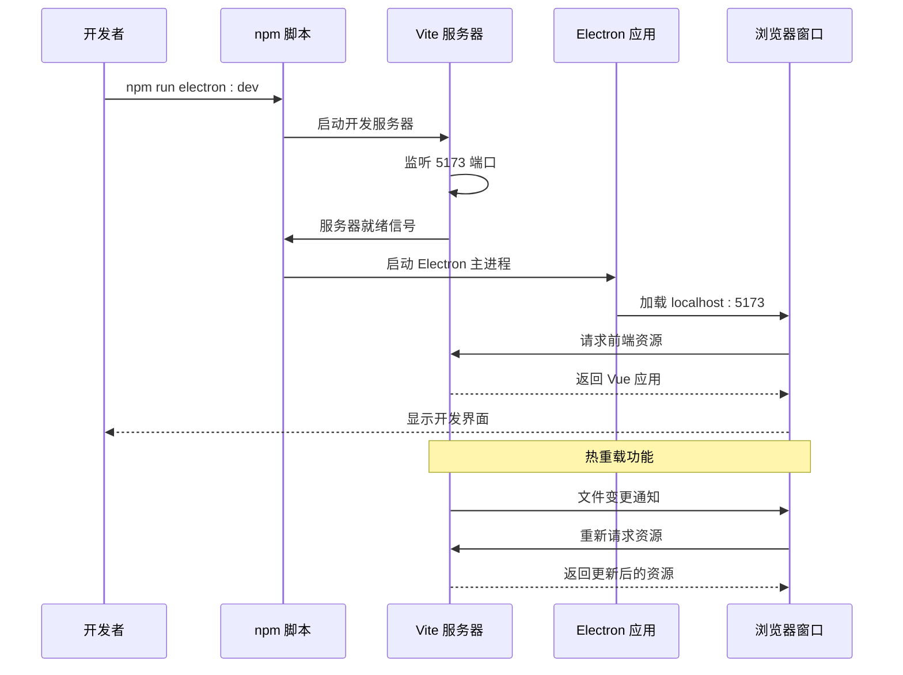
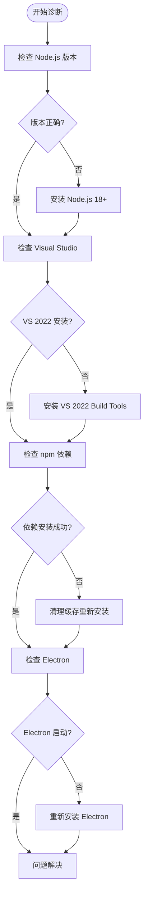

# 开发环境配置

<cite>
**本文档引用的文件**
- [package.json](file://package.json)
- [vite.config.js](file://vite.config.js)
- [README.md](file://README.md)
- [.npmrc](file://.npmrc)
- [electron/main.js](file://electron/main.js)
- [electron/preload.js](file://electron/preload.js)
- [src/main.js](file://src/main.js)
- [build-windows.ps1](file://build-windows.ps1)
- [build-windows.bat](file://build-windows.bat)
</cite>

## 目录
1. [简介](#简介)
2. [前置要求](#前置要求)
3. [Node.js 版本要求与安装](#node-js-版本要求与安装)
4. [包管理器配置](#包管理器配置)
5. [IDE 推荐配置](#ide-推荐配置)
6. [开发服务器启动流程](#开发服务器启动流程)
7. [Vite 构建工具配置](#vite-构建工具配置)
8. [Electron 开发环境特殊配置](#electron-开发环境特殊配置)
9. [完整开发环境搭建步骤](#完整开发环境搭建步骤)
10. [常见环境问题排查](#常见环境问题排查)
11. [性能考虑](#性能考虑)
12. [故障排除指南](#故障排除指南)
13. [结论](#结论)

## 简介

ROSAA 电子书阅读器是一个基于 Electron + Vue 3 + SQLite 的现代化 EPUB 电子书阅读器桌面应用。该项目采用现代化的前端技术栈，结合 Electron 实现跨平台桌面应用开发，支持 EPUB 文件的完整阅读体验，包括书签管理、批注功能、进度保存等核心特性。

## 前置要求

根据项目文档，开发环境需要满足以下最低要求：

- **Node.js**: >= 18.x（推荐 v18 或更高版本）
- **npm**: >= 9.x  
- **Visual Studio 2022 Build Tools**: 用于编译原生模块

这些要求确保了项目能够正确编译依赖项，特别是 `better-sqlite3` 这样的原生 C++ 模块。

**章节来源**
- [README.md:77-82](file://README.md#L77-L82)

## Node.js 版本要求与安装

### 版本要求说明

项目明确要求 Node.js 版本必须达到 18.x 或更高版本。这是由于以下依赖项的兼容性要求：

- **Electron v28.3.3**: 需要较新的 Node.js 版本支持
- **Vite v5.0.0**: 现代构建工具，需要 Node.js 18+
- **Vue 3.3.0**: 最新版本特性要求
- **better-sqlite3**: 需要 Node.js 18+ 的原生模块支持

### 安装步骤

1. **使用 nvm 管理 Node.js 版本**（推荐）
   ```bash
   nvm install 18
   nvm use 18
   ```

2. **验证安装**
   ```bash
   node --version
   npm --version
   ```

3. **检查版本兼容性**
   确保输出的版本满足项目要求：
   - Node.js: >= 18.x
   - npm: >= 9.x

### 版本升级策略

如果系统中已有其他版本的 Node.js，建议使用 nvm 进行版本管理：

```bash
# 查看可用版本
nvm list available

# 安装指定版本
nvm install 18.17.0

# 切换到指定版本
nvm use 18.17.0

# 设置默认版本
nvm alias default 18.17.0
```

**章节来源**
- [README.md:372-379](file://README.md#L372-L379)

## 包管理器配置

### npm 配置优化

项目使用淘宝镜像加速包下载，配置位于 `.npmrc` 文件中：

```ini
# 使用淘宝镜像加速 npm 包下载
registry=https://registry.npmmirror.com/
msvs_version=2022

# Electron 镜像
electron_mirror=https://npmmirror.com/mirrors/electron/
```

### 环境变量设置

项目通过环境变量配置 Visual Studio 版本和 Electron 镜像：

- `msvs_version=2022`: 指定 Visual Studio 2022 用于编译原生模块
- `npm_config_electron_mirror`: 使用淘宝镜像加速 Electron 下载

### 包管理器选择

项目同时支持 npm 和 yarn，但推荐使用 npm：

```bash
# 安装依赖（推荐）
npm install

# 或者使用 yarn
yarn install
```

**章节来源**
- [.npmrc:1-7](file://.npmrc#L1-L7)
- [package.json:30-41](file://package.json#L30-L41)

## IDE 推荐配置

### VS Code 插件推荐

为了获得最佳的开发体验，建议安装以下 VS Code 插件：

#### Vue 相关插件
- **Vue Language Features (Volar)**: Vue 3 单文件组件支持
- **Vue VS Code Extension Pack**: 完整的 Vue 开发工具包
- **ESLint**: JavaScript/TypeScript 代码质量检查
- **Prettier**: 代码格式化工具

#### Electron 开发插件
- **Electron Debug**: Electron 应用调试支持
- **Debugger for Chrome**: Chrome DevTools 调试集成

#### 其他实用插件
- **GitLens**: Git 代码历史和作者信息
- **Bracket Pair Colorizer**: 括号配对高亮
- **Path Intellisense**: 路径自动补全
- **Auto Rename Tag**: HTML 标签自动重命名

### VS Code 设置配置

推荐的 VS Code 设置：

```json
{
    "editor.formatOnSave": true,
    "editor.codeActionsOnSave": {
        "source.fixAll.eslint": true
    },
    "eslint.validate": [
        "javascript",
        "vue"
    ],
    "typescript.preferences.importModuleSpecifier": "relative",
    "javascript.preferences.importModuleSpecifier": "relative"
}
```

### Vue DevTools 安装

虽然项目是 Electron 应用，但仍可以使用 Vue DevTools 进行调试：

1. **安装 Vue DevTools 扩展**
   - 在 Chrome 中安装 Vue DevTools 扩展
   - 或者使用独立的 Vue DevTools 应用

2. **配置 DevTools 访问**
   - 在开发模式下，Electron 主进程会自动打开 DevTools
   - 前端代码可以通过 `npm run electron:dev` 启动

**章节来源**
- [README.md:431-442](file://README.md#L431-L442)

## 开发服务器启动流程

### 启动命令详解

项目提供了多种启动方式，推荐使用以下命令：

#### 开发模式启动
```bash
npm run electron:dev
```

这个命令会同时启动 Vite 开发服务器和 Electron 应用：

1. **Vite 开发服务器**: 监听 5173 端口
2. **Electron 应用**: 加载本地开发服务器
3. **热重载**: 自动刷新前端界面

#### 传统开发方式
```bash
# 启动 Vite 开发服务器
npm run dev

# 在另一个终端启动 Electron
npm run electron:dev
```

### 启动流程图



**图表来源**
- [package.json:9-10](file://package.json#L9-L10)
- [vite.config.js:13-16](file://vite.config.js#L13-L16)
- [electron/main.js:305-310](file://electron/main.js#L305-L310)

**章节来源**
- [README.md:98-106](file://README.md#L98-L106)
- [package.json:6-12](file://package.json#L6-L12)

## Vite 构建工具配置

### 基础配置分析

Vite 配置文件提供了现代化的前端构建支持：

```javascript
export default defineConfig({
  plugins: [vue()],
  base: './',
  resolve: {
    alias: {
      '@': path.resolve(__dirname, 'src')
    }
  },
  server: {
    port: 5173,
    strictPort: true
  }
})
```

### 关键配置说明

#### 插件配置
- **Vue 插件**: 支持 Vue 3 单文件组件
- **热重载**: 开发时自动刷新

#### 路径别名
- `@`: 指向 `src` 目录，便于模块导入

#### 服务器配置
- **端口**: 5173（与 Electron 加载地址一致）
- **严格端口**: 防止端口冲突

### 自定义配置方法

#### 开发服务器配置
```javascript
// vite.config.js
export default defineConfig({
  server: {
    host: '0.0.0.0',  // 允许外部访问
    port: 5173,
    strictPort: true,
    proxy: {
      '/api': {
        target: 'http://localhost:3000',
        changeOrigin: true,
        rewrite: (path) => path.replace(/^\/api/, '')
      }
    }
  }
})
```

#### 构建优化配置
```javascript
// vite.config.js
export default defineConfig({
  build: {
    outDir: 'dist',
    assetsDir: 'assets',
    sourcemap: false,
    rollupOptions: {
      output: {
        manualChunks: {
          vendor: ['vue', 'vue-router', 'pinia'],
          epub: ['epubjs']
        }
      }
    }
  }
})
```

**章节来源**
- [vite.config.js:1-18](file://vite.config.js#L1-L18)

## Electron 开发环境特殊配置

### 主进程配置

Electron 主进程配置了完整的开发环境支持：

```javascript
// electron/main.js
mainWindow = new BrowserWindow({
  width: 1200,
  height: 800,
  icon: path.join(__dirname, '../public/logo-256.ico'),
  webPreferences: {
    nodeIntegration: false,
    contextIsolation: true,
    preload: path.join(__dirname, 'preload.js'),
    webSecurity: false,
    allowRunningInsecureContent: true
  }
})
```

### 预加载脚本安全配置

预加载脚本提供了安全的 IPC 通信接口：

```javascript
// electron/preload.js
contextBridge.exposeInMainWorld('electronAPI', {
  openEpub: () => ipcRenderer.invoke('open-epub'),
  getBooks: (categoryId) => ipcRenderer.invoke('get-books', categoryId),
  // ... 其他 API
})
```

### 开发模式特殊处理

开发模式下，主进程会自动打开开发者工具：

```javascript
// electron/main.js
if (process.env.NODE_ENV === 'development') {
  mainWindow.loadURL('http://localhost:5173')
  mainWindow.webContents.openDevTools()
}
```

### 安全配置要点

- **contextIsolation**: 启用上下文隔离
- **nodeIntegration**: 禁用 Node.js 集成
- **preload**: 使用预加载脚本暴露受限 API

**章节来源**
- [electron/main.js:286-315](file://electron/main.js#L286-L315)
- [electron/preload.js:1-95](file://electron/preload.js#L1-L95)

## 完整开发环境搭建步骤

### 第一步：环境准备

1. **安装 Node.js 18+**
   ```bash
   # 使用 nvm 安装
   nvm install 18
   nvm use 18
   ```

2. **安装 Visual Studio 2022 Build Tools**
   - 下载并安装 Visual Studio 2022
   - 确保安装了 C++ 构建工具

3. **验证环境**
   ```bash
   node --version
   npm --version
   ```

### 第二步：项目克隆与依赖安装

1. **克隆项目**
   ```bash
   git clone <repository-url>
   cd rosa
   ```

2. **安装依赖**
   ```bash
   npm install
   ```

### 第三步：开发服务器启动

1. **启动开发环境**
   ```bash
   npm run electron:dev
   ```

2. **验证启动**
   - 浏览器打开 `http://localhost:5173`
   - Electron 应用窗口显示
   - 控制台无错误信息

### 第四步：开发验证

1. **前端功能验证**
   - Vue 组件热重载
   - 样式实时更新
   - 状态管理正常

2. **Electron 功能验证**
   - IPC 通信正常
   - 数据库连接正常
   - 文件操作功能

**章节来源**
- [README.md:83-93](file://README.md#L83-L93)
- [README.md:96-106](file://README.md#L96-L106)

## 常见环境问题排查

### Node.js 版本问题

**问题症状**:
- 安装依赖时报错
- 编译原生模块失败
- 运行时出现兼容性错误

**解决方案**:
```bash
# 检查当前版本
node --version

# 使用 nvm 切换到 18.x
nvm use 18
nvm alias default 18

# 清理缓存重新安装
rm -rf node_modules package-lock.json
npm cache clean --force
npm install
```

### better-sqlite3 编译错误

**问题症状**:
- 编译原生模块时失败
- 报告 Visual Studio 版本不匹配

**解决方案**:
1. **确认 Visual Studio 安装**
   - 确保安装了 Visual Studio 2022 Build Tools
   - 包含 C++ 构建工具

2. **设置环境变量**
   ```bash
   set msvs_version=2022
   ```

3. **重新安装依赖**
   ```bash
   npm rebuild
   ```

### 端口冲突问题

**问题症状**:
- Vite 服务器启动失败
- 端口 5173 被占用

**解决方案**:
```bash
# 查找占用端口的进程
netstat -ano | findstr :5173

# 结束占用进程
taskkill /PID <进程ID> /F

# 或修改 Vite 端口
# 在 vite.config.js 中修改 port: 5174
```

### Electron 启动失败

**问题症状**:
- Electron 应用无法启动
- 控制台显示模块加载错误

**解决方案**:
```bash
# 清理 Electron 缓存
npm run postinstall

# 重新安装依赖
rm -rf node_modules
npm install

# 检查 Electron 版本兼容性
npm ls electron
```

### 打包环境问题

**问题症状**:
- 打包过程中下载 Electron 失败
- 打包时间过长

**解决方案**:
```bash
# 设置镜像源
npm config set electron_mirror https://npmmirror.com/mirrors/electron/

# 清理缓存
npm cache clean --force

# 重新打包
npm run electron:build
```

**章节来源**
- [README.md:370-419](file://README.md#L370-L419)

## 性能考虑

### 开发性能优化

1. **Vite 热重载优化**
   - 使用 `@` 别名避免深层相对路径
   - 合理的模块拆分减少重载范围

2. **Electron 性能**
   - 开发模式下启用 DevTools
   - 生产模式禁用不必要的调试功能

3. **数据库性能**
   - 使用 WAL 模式提升并发性能
   - 合理的索引设计

### 生产性能优化

1. **构建优化**
   - 代码分割和懒加载
   - 资源压缩和缓存策略

2. **内存管理**
   - 及时清理事件监听器
   - 合理的垃圾回收

## 故障排除指南

### 快速诊断流程



### 常用诊断命令

```bash
# 检查环境
node --version && npm --version

# 清理环境
rm -rf node_modules dist dist-electron
npm cache clean --force

# 重新安装
npm install

# 启动开发
npm run electron:dev

# 打包测试
npm run electron:build
```

### 日志查看

1. **前端日志**: Vite 开发服务器控制台
2. **后端日志**: Electron 主进程控制台
3. **IPC 日志**: 预加载脚本控制台

**章节来源**
- [README.md:431-452](file://README.md#L431-L452)

## 结论

ROSAA 电子书阅读器的开发环境配置相对复杂，主要体现在以下几个方面：

1. **严格的 Node.js 版本要求**（>= 18.x）
2. **Visual Studio 2022 的原生模块编译需求**
3. **Electron + Vue 3 的双端开发架构**
4. **复杂的 IPC 通信和安全配置**

### 最佳实践建议

1. **版本管理**: 使用 nvm 管理 Node.js 版本
2. **环境隔离**: 为不同项目使用不同的 Node.js 版本
3. **依赖管理**: 使用 .npmrc 配置镜像源
4. **开发工具**: 配置 VS Code 插件和调试工具
5. **定期维护**: 定期更新依赖和清理缓存

### 后续优化方向

1. **容器化**: 考虑使用 Docker 标准化开发环境
2. **CI/CD**: 建立自动化构建和测试流程
3. **文档完善**: 增加更详细的环境配置文档
4. **监控工具**: 集成性能监控和错误报告

通过遵循本文档的配置指南，开发者可以快速搭建稳定可靠的 ROSAA 电子书阅读器开发环境，高效地进行功能开发和维护。