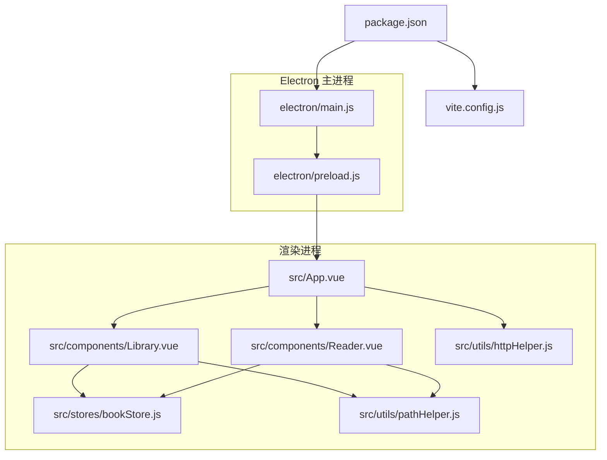
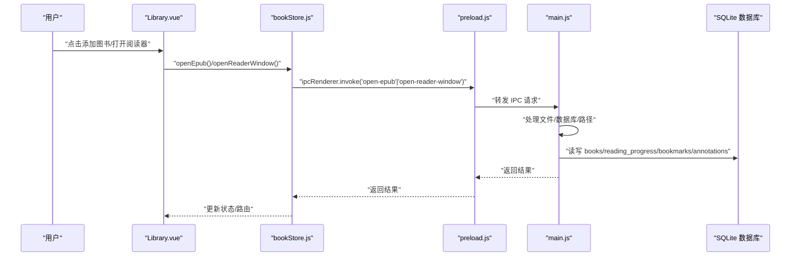
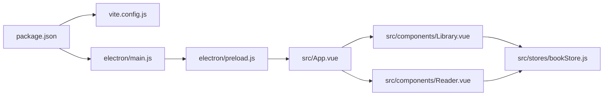

# 调试技巧

<cite>
**本文引用的文件**
- [README.md](file://README.md)
- [package.json](file://package.json)
- [vite.config.js](file://vite.config.js)
- [electron/main.js](file://electron/main.js)
- [electron/preload.js](file://electron/preload.js)
- [src/main.js](file://src/main.js)
- [src/App.vue](file://src/App.vue)
- [src/stores/bookStore.js](file://src/stores/bookStore.js)
- [src/components/Library.vue](file://src/components/Library.vue)
- [src/components/Reader.vue](file://src/components/Reader.vue)
- [src/utils/pathHelper.js](file://src/utils/pathHelper.js)
- [src/utils/httpHelper.js](file://src/utils/httpHelper.js)
- [docs/DATA_STORAGE.md](file://docs/DATA_STORAGE.md)
- [docs/PATH_COMPATIBILITY.md](file://docs/PATH_COMPATIBILITY.md)
</cite>

## 目录
1. [简介](#简介)
2. [项目结构](#项目结构)
3. [核心组件](#核心组件)
4. [架构总览](#架构总览)
5. [详细组件分析](#详细组件分析)
6. [依赖分析](#依赖分析)
7. [性能考虑](#性能考虑)
8. [故障排查指南](#故障排查指南)
9. [结论](#结论)
10. [附录](#附录)

## 简介
本指南面向 ROSAA 电子书阅读器的开发者与维护者，聚焦于调试方法论与实操技巧，覆盖前端（Vue DevTools、浏览器开发者工具、组件状态监控）、Electron 主进程（日志、断点、IPC 调试）、渲染进程（Vue 组件、状态管理、事件监听）、数据库（SQLite 查询与一致性检查）、网络请求（HTTP 请求拦截与响应检查），并提供常见 Bug 的定位与解决思路及最佳实践。

## 项目结构
- 前端基于 Vue 3 + Vite，使用 Pinia 管理状态；组件包括书架与阅读器。
- Electron 主进程负责窗口、数据库、文件系统与 IPC；预加载脚本通过 contextBridge 暴露受控 API。
- 工具模块提供路径与 HTTP 辅助能力，文档说明数据存储与路径兼容性。

图表来源
- [package.json:1-82](file://package.json#L1-L82)
- [vite.config.js:1-18](file://vite.config.js#L1-L18)
- [electron/main.js:1-820](file://electron/main.js#L1-L820)
- [electron/preload.js:1-95](file://electron/preload.js#L1-L95)
- [src/App.vue:1-64](file://src/App.vue#L1-L64)
- [src/components/Library.vue:1-1292](file://src/components/Library.vue#L1-L1292)
- [src/components/Reader.vue:1-1026](file://src/components/Reader.vue#L1-L1026)
- [src/stores/bookStore.js:1-234](file://src/stores/bookStore.js#L1-L234)
- [src/utils/pathHelper.js:1-63](file://src/utils/pathHelper.js#L1-L63)
- [src/utils/httpHelper.js:1-47](file://src/utils/httpHelper.js#L1-L47)

章节来源
- [README.md:167-193](file://README.md#L167-L193)
- [package.json:1-82](file://package.json#L1-82)
- [vite.config.js:1-18](file://vite.config.js#L1-L18)

## 核心组件
- 主进程：负责数据库初始化、窗口创建、文件导入与导出、批注/书签/进度的读写、IPC 处理。
- 预加载脚本：通过 contextBridge 暴露受控 API，记录 IPC 调用链路。
- 前端应用：App.vue 控制路由与窗口标题；Library.vue 管理书架、分类、右键菜单与登录；Reader.vue 负责阅读器初始化、目录/书签、批注与进度。
- 状态管理：bookStore.js 统一封装 IPC 调用，集中处理书籍、分类、进度、书签、批注。
- 工具函数：pathHelper.js 统一构建 file:// URL；httpHelper.js 统一注入认证头。

章节来源
- [electron/main.js:167-284](file://electron/main.js#L167-L284)
- [electron/preload.js:7-92](file://electron/preload.js#L7-L92)
- [src/App.vue:8-63](file://src/App.vue#L8-L63)
- [src/stores/bookStore.js:4-234](file://src/stores/bookStore.js#L4-L234)
- [src/components/Library.vue:1-1292](file://src/components/Library.vue#L1-L1292)
- [src/components/Reader.vue:1-1026](file://src/components/Reader.vue#L1-L1026)
- [src/utils/pathHelper.js:13-53](file://src/utils/pathHelper.js#L13-L53)
- [src/utils/httpHelper.js:9-46](file://src/utils/httpHelper.js#L9-L46)

## 架构总览
下图展示从用户交互到数据库与文件系统的调用链路，以及 IPC 的双向通信。

图表来源
- [src/components/Library.vue:365-387](file://src/components/Library.vue#L365-L387)
- [src/stores/bookStore.js:71-104](file://src/stores/bookStore.js#L71-L104)
- [electron/preload.js:8-79](file://electron/preload.js#L8-L79)
- [electron/main.js:343-427](file://electron/main.js#L343-L427)
- [electron/main.js:772-800](file://electron/main.js#L772-L800)

## 详细组件分析

### 前端调试：Vue DevTools 与浏览器开发者工具
- 启动开发服务器与 Electron：使用脚本同时启动 Vite 与 Electron，便于前端与主进程协同调试。
- Vue DevTools：在开发模式下，主窗口与阅读器窗口均会打开开发者工具，便于检查组件树、状态与事件。
- 组件状态监控：通过 bookStore.js 的日志与组件内的日志，定位状态变更与 IPC 调用时机。
- 路由与窗口标题：App.vue 在挂载时检查 Electron API 并根据 URL 参数自动打开阅读器窗口，便于验证参数传递与窗口行为。

章节来源
- [README.md:436-442](file://README.md#L436-L442)
- [vite.config.js:13-16](file://vite.config.js#L13-L16)
- [src/App.vue:18-41](file://src/App.vue#L18-L41)
- [electron/main.js:305-310](file://electron/main.js#L305-L310)
- [electron/main.js:796-799](file://electron/main.js#L796-L799)

### 前端调试：组件与事件监听
- Library.vue：右键菜单、搜索与排序、分类选择、登录与导出等功能均通过日志与弹窗反馈，便于定位交互问题。
- Reader.vue：EPUB 初始化、目录加载、进度计算、批注高亮、阅读模式切换、右键菜单与文本选择等均有日志，便于定位渲染与事件问题。
- 事件监听：组件在挂载与卸载时注册/销毁事件，避免内存泄漏与重复绑定。

章节来源
- [src/components/Library.vue:365-589](file://src/components/Library.vue#L365-L589)
- [src/components/Reader.vue:201-222](file://src/components/Reader.vue#L201-L222)
- [src/components/Reader.vue:310-334](file://src/components/Reader.vue#L310-L334)
- [src/components/Reader.vue:764-800](file://src/components/Reader.vue#L764-L800)

### 前端调试：状态管理调试（Pinia）
- bookStore.js：封装所有 IPC 调用，集中打印日志，便于追踪数据流与错误。
- 常见问题：当 Electron API 未加载时，会给出明确提示；异常会被捕获并输出堆栈，便于定位。

章节来源
- [src/stores/bookStore.js:12-22](file://src/stores/bookStore.js#L12-L22)
- [src/stores/bookStore.js:71-104](file://src/stores/bookStore.js#L71-L104)
- [src/App.vue:19-22](file://src/App.vue#L19-L22)

### Electron 主进程调试：日志、断点与 IPC
- 日志策略：主进程在关键节点输出日志（数据库初始化、窗口创建、IPC 处理、文件导入/导出、批注/书签/进度读写）。
- 断点调试：使用 VS Code 的 Node.js 断点在主进程入口与 IPC 处理器处设置断点，观察上下文与参数。
- IPC 调试：预加载脚本对每个 IPC 调用进行日志记录，便于回溯调用链。

章节来源
- [README.md:456-476](file://README.md#L456-L476)
- [electron/main.js:167-284](file://electron/main.js#L167-L284)
- [electron/main.js:343-427](file://electron/main.js#L343-L427)
- [electron/preload.js:8-92](file://electron/preload.js#L8-L92)

### 渲染进程调试：组件、状态与事件
- 组件生命周期：在 mounted 中初始化阅读器、加载书签与批注；在 unmounted 中销毁渲染实例与事件监听。
- 事件监听：针对 iframe 的右键菜单与 relocated/rendered 事件进行绑定与重新绑定，确保跨模式切换后仍能正确响应。
- 状态同步：进度保存与恢复、目录跳转、书签/批注增删改查均通过 bookStore.js 与主进程 IPC 协作。

章节来源
- [src/components/Reader.vue:201-222](file://src/components/Reader.vue#L201-L222)
- [src/components/Reader.vue:310-334](file://src/components/Reader.vue#L310-L334)
- [src/components/Reader.vue:497-507](file://src/components/Reader.vue#L497-L507)
- [src/stores/bookStore.js:178-206](file://src/stores/bookStore.js#L178-L206)

### 数据库调试：SQLite 查询与一致性检查
- 数据存储路径：用户数据目录下 db/epub_reader.db，路径与文件均在用户数据目录中，避免与项目根目录混淆。
- 表结构：书籍、阅读进度、书签、批注、分类等表，主进程在启动时创建并启用 WAL 模式提升并发性能。
- 一致性检查：通过唯一约束与外键约束保障数据一致性；导入时按路径与哈希去重。
- 调试建议：使用 SQLite 客户端连接用户数据目录中的数据库，执行基础查询与统计，核对字段完整性与索引使用情况。

章节来源
- [docs/DATA_STORAGE.md:1-42](file://docs/DATA_STORAGE.md#L1-L42)
- [docs/PATH_COMPATIBILITY.md:132-148](file://docs/PATH_COMPATIBILITY.md#L132-L148)
- [electron/main.js:167-284](file://electron/main.js#L167-L284)
- [electron/main.js:367-403](file://electron/main.js#L367-L403)

### 网络请求调试：HTTP 请求拦截与响应检查
- 认证头注入：httpHelper.js 统一从 localStorage 读取 token 并注入 Authorization 头。
- 请求封装：authFetch 提供统一的带认证头 fetch 封装，便于替换与拦截。
- 调试建议：在浏览器开发者工具 Network 面板中拦截请求，检查请求头与响应体；结合后端日志定位鉴权与业务异常。

章节来源
- [src/utils/httpHelper.js:9-46](file://src/utils/httpHelper.js#L9-L46)
- [src/components/Library.vue:511-549](file://src/components/Library.vue#L511-L549)

## 依赖分析
- 构建与运行：Vite 提供开发服务器与静态资源服务；package.json 定义了开发与打包脚本。
- Electron：主进程与预加载脚本通过 contextBridge 暴露 API；窗口创建与开发者工具开启策略在主进程配置。
- 前端：App.vue 作为根组件，Library.vue/Reader.vue 作为页面组件；bookStore.js 作为状态中心。

图表来源
- [package.json:6-12](file://package.json#L6-L12)
- [vite.config.js:1-18](file://vite.config.js#L1-L18)
- [electron/main.js:1-10](file://electron/main.js#L1-L10)
- [electron/preload.js:1-6](file://electron/preload.js#L1-L6)
- [src/App.vue:1-6](file://src/App.vue#L1-L6)
- [src/stores/bookStore.js:1-4](file://src/stores/bookStore.js#L1-L4)

章节来源
- [package.json:1-82](file://package.json#L1-L82)
- [vite.config.js:1-18](file://vite.config.js#L1-L18)

## 性能考虑
- 阅读器初始化：EPUB 渲染与目录加载采用延迟与后台生成策略，减少首屏阻塞。
- 进度保存：relocated 事件触发保存，避免频繁 IO；滚动模式下尝试多种方式计算百分比。
- 数据库：启用 WAL 模式，减少锁竞争；导入时按路径与哈希去重，避免重复写入。

章节来源
- [src/components/Reader.vue:427-438](file://src/components/Reader.vue#L427-L438)
- [src/components/Reader.vue:440-495](file://src/components/Reader.vue#L440-L495)
- [electron/main.js:185-187](file://electron/main.js#L185-L187)
- [electron/main.js:367-403](file://electron/main.js#L367-L403)

## 故障排查指南

### 常见问题与定位
- Electron API 未加载：App.vue 在挂载时检查 window.electronAPI 并提示，确认通过 npm run electron:dev 启动。
- 书籍无法打开：Reader.vue 初始化阶段输出详细日志，检查路径构建与 EPUB 文件有效性。
- 路径问题：使用 pathHelper.js 的日志与 isProduction 判断，确保开发与生产环境路径一致。
- IPC 调用失败：预加载脚本对每个 IPC 调用进行日志记录，结合主进程日志定位参数与返回值。
- 数据库异常：检查用户数据目录是否存在、数据库文件是否被占用、表结构是否完整。

章节来源
- [src/App.vue:19-22](file://src/App.vue#L19-L22)
- [src/components/Reader.vue:232-425](file://src/components/Reader.vue#L232-L425)
- [src/utils/pathHelper.js:13-53](file://src/utils/pathHelper.js#L13-L53)
- [electron/preload.js:8-92](file://electron/preload.js#L8-L92)
- [docs/DATA_STORAGE.md:1-42](file://docs/DATA_STORAGE.md#L1-L42)

### 数据库调试步骤
- 定位数据库文件：用户数据目录下 db/epub_reader.db。
- 基础查询：检查书籍数量、重复项、进度与批注条目数。
- 一致性校验：检查外键关联、唯一约束、空值约束。
- 导入流程核对：确认导入时的去重逻辑（路径与哈希）与文件复制路径。

章节来源
- [docs/DATA_STORAGE.md:18-42](file://docs/DATA_STORAGE.md#L18-L42)
- [electron/main.js:367-403](file://electron/main.js#L367-L403)

### 网络请求调试步骤
- 检查认证头：确认 localStorage 中存在 token，且 Authorization 头正确注入。
- 拦截请求：在浏览器 Network 面板中拦截并查看请求头、状态码与响应体。
- 替换封装：使用 authFetch 统一封装请求，便于后续拦截与替换。

章节来源
- [src/utils/httpHelper.js:9-46](file://src/utils/httpHelper.js#L9-L46)
- [src/components/Library.vue:511-549](file://src/components/Library.vue#L511-L549)

## 结论
通过统一的日志策略、清晰的 IPC 调用链、完善的路径与数据库设计，ROSAA 电子书阅读器具备良好的可调试性。建议在开发过程中充分利用 Vue DevTools 与浏览器开发者工具，在主进程与预加载脚本中保留关键日志，结合数据库与网络请求的可视化工具，快速定位并解决问题。

## 附录

### 调试工具与最佳实践清单
- 开发启动：使用 npm run electron:dev 同时启动 Vite 与 Electron。
- 前端调试：启用 Vue DevTools，关注组件生命周期与状态变更。
- 主进程调试：在 VS Code 中设置断点，结合日志定位 IPC 参数与返回值。
- 路径调试：利用 pathHelper.js 的日志输出，核对相对路径与绝对路径映射。
- 数据库调试：使用 SQLite 客户端连接用户数据目录中的数据库，执行基础查询与一致性检查。
- 网络调试：在 Network 面板中拦截请求，核对认证头与响应体。

章节来源
- [README.md:436-442](file://README.md#L436-L442)
- [docs/PATH_COMPATIBILITY.md:169-181](file://docs/PATH_COMPATIBILITY.md#L169-L181)