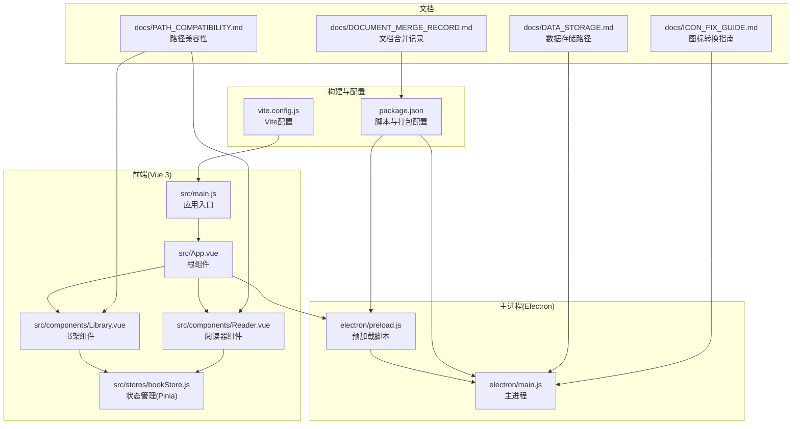
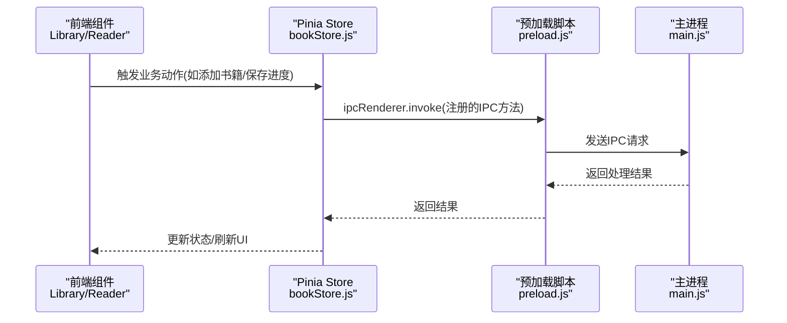
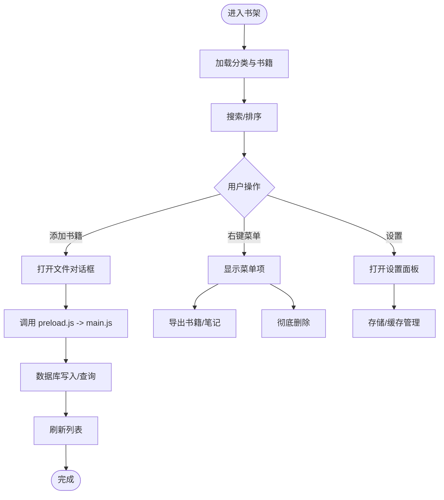
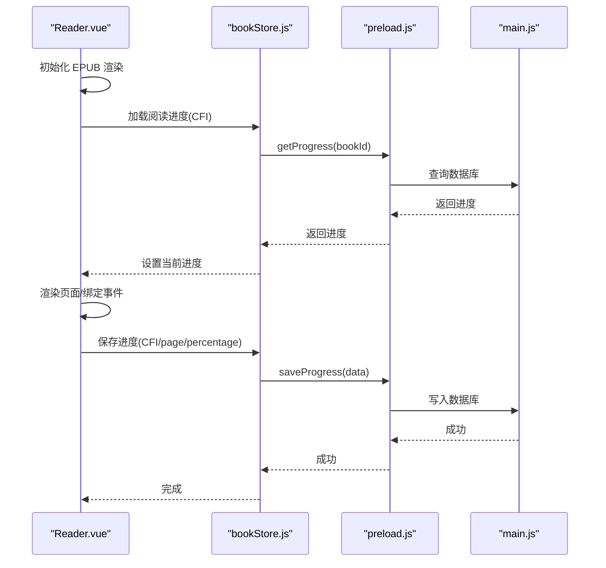
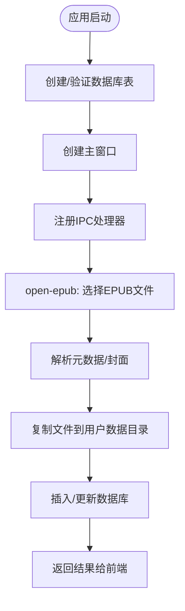
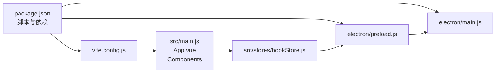

# 贡献指南

<cite>
**本文引用的文件**
- [README.md](file://README.md)
- [package.json](file://package.json)
- [vite.config.js](file://vite.config.js)
- [src/main.js](file://src/main.js)
- [src/App.vue](file://src/App.vue)
- [src/components/Library.vue](file://src/components/Library.vue)
- [src/components/Reader.vue](file://src/components/Reader.vue)
- [src/stores/bookStore.js](file://src/stores/bookStore.js)
- [electron/main.js](file://electron/main.js)
- [electron/preload.js](file://electron/preload.js)
- [docs/DATA_STORAGE.md](file://docs/DATA_STORAGE.md)
- [docs/PATH_COMPATIBILITY.md](file://docs/PATH_COMPATIBILITY.md)
- [docs/ICON_FIX_GUIDE.md](file://docs/ICON_FIX_GUIDE.md)
- [docs/DOCUMENT_MERGE_RECORD.md](file://docs/DOCUMENT_MERGE_RECORD.md)
</cite>

## 目录
1. [简介](#简介)
2. [项目结构](#项目结构)
3. [核心组件](#核心组件)
4. [架构总览](#架构总览)
5. [详细组件分析](#详细组件分析)
6. [依赖关系分析](#依赖关系分析)
7. [性能考虑](#性能考虑)
8. [故障排除指南](#故障排除指南)
9. [结论](#结论)
10. [附录](#附录)

## 简介
本指南面向希望参与 ROSAA 电子书阅读器项目的贡献者，涵盖从 Fork 项目、创建分支、提交代码到创建与审核 Pull Request 的完整流程；提供 Issue 报告的标准格式与模板；明确代码贡献的质量要求（代码规范、测试覆盖率、文档更新）；并给出社区交流渠道、新贡献者入门指导与常见问题解答。

## 项目结构
该项目采用 Electron + Vue 3 + SQLite 的桌面应用架构，前端使用 Vite 构建，主进程负责文件系统、数据库与打包流程，预加载脚本桥接安全的 IPC 通道。

**图表来源**
- [src/main.js:1-11](file://src/main.js#L1-L11)
- [src/App.vue:1-64](file://src/App.vue#L1-L64)
- [src/components/Library.vue:1-120](file://src/components/Library.vue#L1-L120)
- [src/components/Reader.vue:1-120](file://src/components/Reader.vue#L1-L120)
- [src/stores/bookStore.js:1-60](file://src/stores/bookStore.js#L1-L60)
- [electron/main.js:1-120](file://electron/main.js#L1-L120)
- [electron/preload.js:1-40](file://electron/preload.js#L1-L40)
- [vite.config.js:1-18](file://vite.config.js#L1-L18)
- [package.json:1-40](file://package.json#L1-L40)
- [docs/DATA_STORAGE.md:1-42](file://docs/DATA_STORAGE.md#L1-L42)
- [docs/PATH_COMPATIBILITY.md:1-60](file://docs/PATH_COMPATIBILITY.md#L1-L60)
- [docs/ICON_FIX_GUIDE.md:1-40](file://docs/ICON_FIX_GUIDE.md#L1-L40)
- [docs/DOCUMENT_MERGE_RECORD.md:1-40](file://docs/DOCUMENT_MERGE_RECORD.md#L1-L40)

**章节来源**
- [README.md:167-194](file://README.md#L167-L194)
- [package.json:1-40](file://package.json#L1-L40)
- [vite.config.js:1-18](file://vite.config.js#L1-L18)

## 核心组件
- 应用入口与路由：前端通过根组件控制书架与阅读器的切换，预加载脚本暴露安全的 IPC 接口给前端使用。
- 书架组件：提供书籍浏览、搜索、分类、右键菜单、设置等功能。
- 阅读器组件：集成 EPUB.js 实现翻页/滚动模式、书签、目录、批注与进度保存。
- 状态管理：Pinia Store 封装与主进程的 IPC 调用，统一数据流。
- 主进程：负责数据库初始化、文件系统操作、打包配置与窗口管理。

**章节来源**
- [src/App.vue:1-64](file://src/App.vue#L1-L64)
- [src/components/Library.vue:1-120](file://src/components/Library.vue#L1-L120)
- [src/components/Reader.vue:1-120](file://src/components/Reader.vue#L1-L120)
- [src/stores/bookStore.js:1-120](file://src/stores/bookStore.js#L1-L120)
- [electron/preload.js:1-60](file://electron/preload.js#L1-L60)
- [electron/main.js:167-284](file://electron/main.js#L167-L284)

## 架构总览
应用采用前后端分离的桌面应用架构：前端通过预加载脚本与主进程进行安全通信，主进程负责数据库与文件系统操作，前端负责 UI 与交互。

**图表来源**
- [src/stores/bookStore.js:71-104](file://src/stores/bookStore.js#L71-L104)
- [electron/preload.js:7-101](file://electron/preload.js#L7-L101)
- [electron/main.js:343-427](file://electron/main.js#L343-L427)

**章节来源**
- [src/stores/bookStore.js:1-234](file://src/stores/bookStore.js#L1-L234)
- [electron/preload.js:1-104](file://electron/preload.js#L1-L104)
- [electron/main.js:317-341](file://electron/main.js#L317-L341)

## 详细组件分析

### 书架组件（Library.vue）
- 功能要点：添加书籍、分类管理、搜索与排序、右键菜单（导出/删除/分类）、设置面板（存储/缓存/区域语言）。
- 数据来源：通过 Pinia Store 调用预加载脚本提供的 IPC 方法，从主进程数据库读取书籍与分类。
- 路径处理：使用路径工具函数统一构建 file:// URL，确保开发与生产环境一致。

**图表来源**
- [src/components/Library.vue:476-594](file://src/components/Library.vue#L476-L594)
- [src/stores/bookStore.js:71-155](file://src/stores/bookStore.js#L71-L155)
- [electron/preload.js:8-67](file://electron/preload.js#L8-L67)
- [electron/main.js:343-427](file://electron/main.js#L343-L427)

**章节来源**
- [src/components/Library.vue:1-200](file://src/components/Library.vue#L1-L200)
- [src/stores/bookStore.js:1-155](file://src/stores/bookStore.js#L1-L155)
- [docs/PATH_COMPATIBILITY.md:58-78](file://docs/PATH_COMPATIBILITY.md#L58-L78)

### 阅读器组件（Reader.vue）
- 功能要点：EPUB 渲染、翻页/滚动模式切换、字体大小调节、书签与目录、批注高亮、进度保存与恢复。
- 进度与位置：通过 CFI（EPUB 标识）与百分比实现跨章节与跨模式的进度一致性。
- 批注系统：前端高亮批注，后端持久化存储，点击高亮弹出批注详情。

**图表来源**
- [src/components/Reader.vue:232-425](file://src/components/Reader.vue#L232-L425)
- [src/stores/bookStore.js:161-176](file://src/stores/bookStore.js#L161-L176)
- [electron/preload.js:16-19](file://electron/preload.js#L16-L19)
- [electron/main.js:634-663](file://electron/main.js#L634-L663)

**章节来源**
- [src/components/Reader.vue:1-200](file://src/components/Reader.vue#L1-L200)
- [src/stores/bookStore.js:161-176](file://src/stores/bookStore.js#L161-L176)
- [electron/main.js:634-663](file://electron/main.js#L634-L663)

### 主进程（electron/main.js）
- 数据库初始化：在用户数据目录创建数据库与表，启用 WAL 模式提升并发性能。
- 文件处理：从 EPUB 中提取元数据与封面，复制书籍到用户数据目录，保存相对路径。
- IPC 处理：提供书籍、分类、书签、批注、进度、导出等 IPC 接口。

**图表来源**
- [electron/main.js:167-284](file://electron/main.js#L167-L284)
- [electron/main.js:343-427](file://electron/main.js#L343-L427)

**章节来源**
- [electron/main.js:167-284](file://electron/main.js#L167-L284)
- [docs/DATA_STORAGE.md:1-42](file://docs/DATA_STORAGE.md#L1-L42)

## 依赖关系分析
- 前端依赖：Vue 3、Pinia、EPUB.js、Vite。
- 主进程依赖：better-sqlite3、AdmZip、xml2js、electron-builder。
- 构建脚本：npm scripts 集成 Vite 与 electron-builder，支持 Windows 打包。

**图表来源**
- [package.json:1-82](file://package.json#L1-L82)
- [vite.config.js:1-18](file://vite.config.js#L1-L18)
- [src/main.js:1-11](file://src/main.js#L1-L11)
- [src/App.vue:1-64](file://src/App.vue#L1-L64)
- [src/stores/bookStore.js:1-60](file://src/stores/bookStore.js#L1-L60)
- [electron/preload.js:1-40](file://electron/preload.js#L1-L40)
- [electron/main.js:1-40](file://electron/main.js#L1-L40)

**章节来源**
- [package.json:22-41](file://package.json#L22-L41)
- [vite.config.js:1-18](file://vite.config.js#L1-L18)

## 性能考虑
- 数据库：启用 WAL 模式，减少锁竞争；使用外键约束与唯一索引保障一致性。
- 渲染：EPUB.js 生成位置索引采用后台生成策略，避免阻塞首屏显示。
- 路径：统一使用用户数据目录，避免在只读安装目录写入文件，减少 I/O 失败风险。
- 打包：electron-builder 配置 NSIS 安装器，支持自定义图标与快捷方式。

**章节来源**
- [electron/main.js:185-187](file://electron/main.js#L185-L187)
- [src/components/Reader.vue:427-438](file://src/components/Reader.vue#L427-L438)
- [docs/DATA_STORAGE.md:1-42](file://docs/DATA_STORAGE.md#L1-L42)
- [package.json:42-80](file://package.json#L42-L80)

## 故障排除指南
- Node.js 版本：确保使用 Node.js 18+，推荐 nvm 管理版本。
- better-sqlite3 编译：安装 Visual Studio 2022 Build Tools，确保 VS 版本匹配。
- 打包失败：检查网络与镜像配置，确保 Electron 下载可用；关闭应用实例避免文件占用。
- 图标问题：electron-builder 建议使用 256x256 ICO，若使用 PNG 需确认配置正确。

**章节来源**
- [README.md:370-420](file://README.md#L370-L420)
- [docs/ICON_FIX_GUIDE.md:1-101](file://docs/ICON_FIX_GUIDE.md#L1-L101)

## 结论
本指南提供了从入门到贡献的全流程说明，结合项目现有架构与文档，帮助贡献者高效参与开发。建议在提交前遵循代码规范、补充必要的文档与日志，并确保路径与数据库行为符合用户数据目录的设计原则。

## 附录

### 贡献流程（Fork/分支/提交/Pull Request）
- Fork 仓库到个人账户。
- 创建特性分支：git checkout -b feature/AmazingFeature。
- 提交更改：git commit -m 'Add some AmazingFeature'。
- 推送分支：git push origin feature/AmazingFeature。
- 在 GitHub 上发起 Pull Request，填写模板并等待代码审查。

**章节来源**
- [README.md:494-501](file://README.md#L494-L501)

### Pull Request 审核流程与标准
- 代码审查关注点：功能正确性、性能影响、安全性（路径/文件系统）、可维护性（日志、异常处理）。
- 合并要求：通过 CI（如适用）、至少一名维护者批准、无冲突、文档与日志更新。

[本节为通用流程说明，不直接分析具体文件]

### Issue 报告模板与规范
- Bug 报告：重现步骤、预期/实际结果、日志片段、环境信息（Node/electron/Vue 版本）。
- 功能请求：场景描述、期望行为、影响范围、是否已有替代方案。
- 问题描述：清晰标题、详细描述、截图/日志、最小复现步骤。

[本节为通用模板说明，不直接分析具体文件]

### 代码质量要求
- 代码规范：Vue 3 Composition API、组件命名 PascalCase、变量 camelCase、常量 UPPER_SNAKE_CASE。
- 日志策略：保留关键流程与错误日志，清理开发阶段的冗余日志。
- 测试与覆盖率：建议补充单元/集成测试，覆盖关键路径（IPC、数据库、路径处理）。
- 文档更新：新增功能需同步更新 README 或独立文档，保持一致性。

**章节来源**
- [README.md:422-484](file://README.md#L422-L484)

### 社区交流与联系方式
- 问题反馈：通过 GitHub Issues 提交，按模板填写。
- 讨论与协作：在 PR 或 Issue 下评论，或在项目内讨论区（如适用）沟通。

[本节为通用指引，不直接分析具体文件]

### 新贡献者入门指导
- 环境准备：安装 Node.js 18+、Visual Studio 2022、克隆仓库、安装依赖。
- 快速运行：npm run electron:dev 启动开发模式，npm run electron:build 打包。
- 调试技巧：利用前端与主进程控制台日志，定位 IPC 与数据库问题。

**章节来源**
- [README.md:75-124](file://README.md#L75-L124)

### 常见问题解答（FAQ）
- 为什么打包后图标显示不佳？建议使用 256x256 ICO 并更新配置。
- 如何验证路径兼容性？使用路径工具函数统一构建 file:// URL。
- 数据库文件在哪里？位于用户数据目录的 db/epub_reader.db。

**章节来源**
- [docs/ICON_FIX_GUIDE.md:60-101](file://docs/ICON_FIX_GUIDE.md#L60-L101)
- [docs/PATH_COMPATIBILITY.md:116-131](file://docs/PATH_COMPATIBILITY.md#L116-L131)
- [docs/DATA_STORAGE.md:1-42](file://docs/DATA_STORAGE.md#L1-L42)

### 贡献示例与最佳实践
- 示例：修复路径兼容性问题时，统一使用用户数据目录与路径工具函数，避免硬编码 appPath。
- 最佳实践：在主进程增加必要的错误日志，在前端仅保留关键错误提示；对 IPC 调用增加超时与重试策略（如适用）。

**章节来源**
- [docs/PATH_COMPATIBILITY.md:58-78](file://docs/PATH_COMPATIBILITY.md#L58-L78)
- [electron/main.js:137-147](file://electron/main.js#L137-L147)