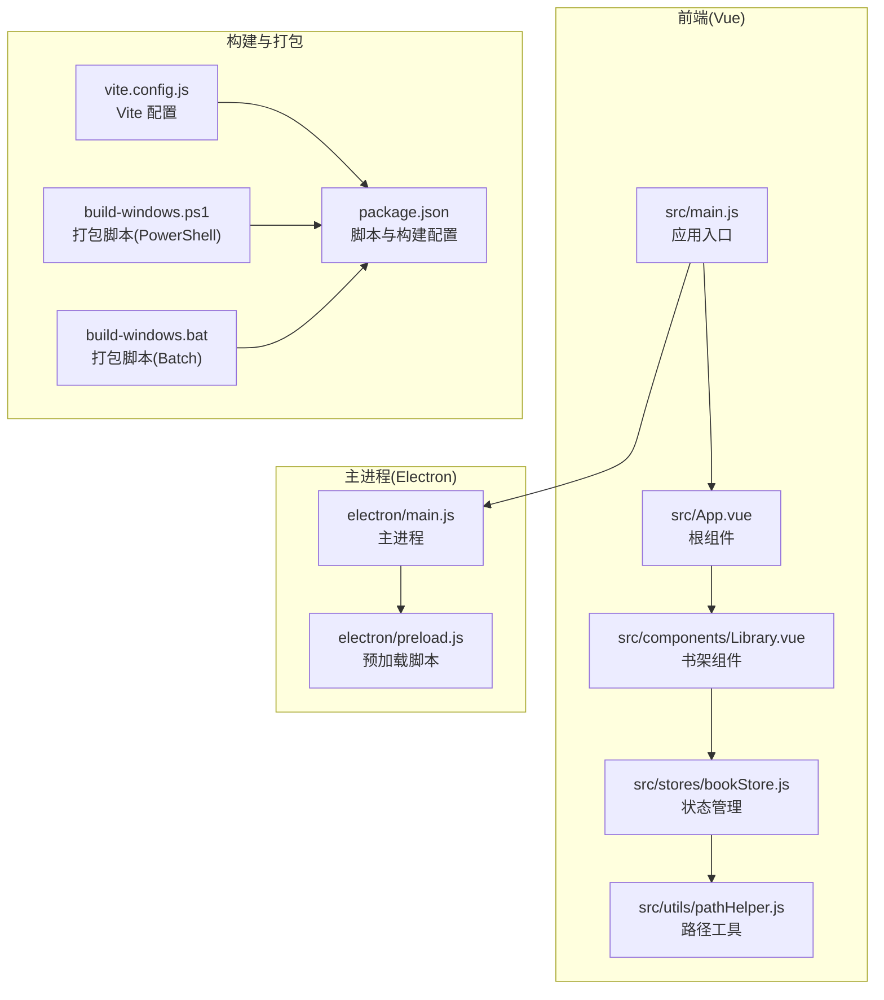
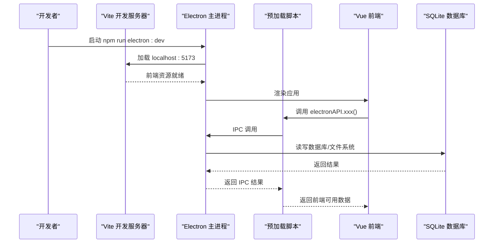
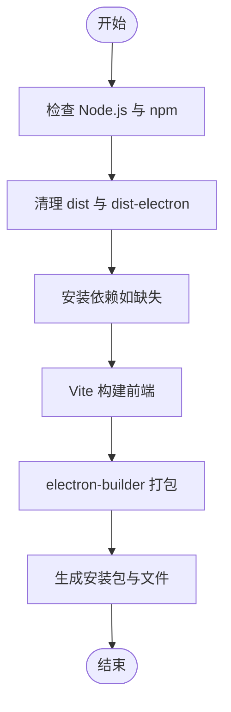
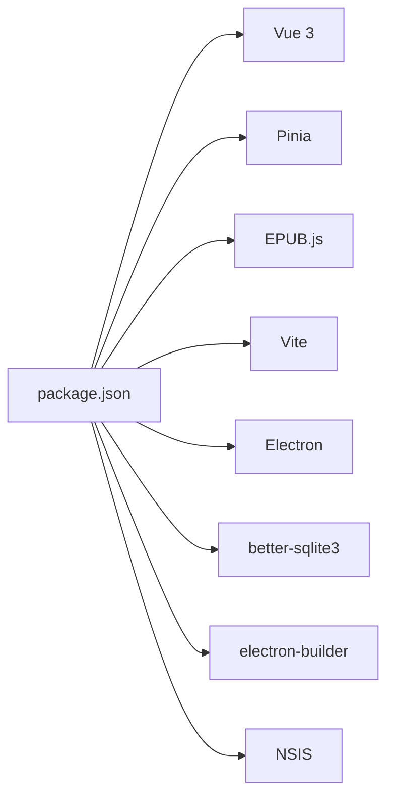

# 快速开始

<cite>
**本文引用的文件**
- [README.md](file://README.md)
- [package.json](file://package.json)
- [build-windows.ps1](file://build-windows.ps1)
- [build-windows.bat](file://build-windows.bat)
- [electron/main.js](file://electron/main.js)
- [electron/preload.js](file://electron/preload.js)
- [src/main.js](file://src/main.js)
- [vite.config.js](file://vite.config.js)
- [src/App.vue](file://src/App.vue)
- [src/components/Library.vue](file://src/components/Library.vue)
- [src/stores/bookStore.js](file://src/stores/bookStore.js)
- [src/utils/pathHelper.js](file://src/utils/pathHelper.js)
- [convert-icon.bat](file://convert-icon.bat)
</cite>

## 目录
1. [简介](#简介)
2. [项目结构](#项目结构)
3. [核心组件](#核心组件)
4. [架构总览](#架构总览)
5. [详细组件分析](#详细组件分析)
6. [依赖关系分析](#依赖关系分析)
7. [性能考虑](#性能考虑)
8. [故障排除指南](#故障排除指南)
9. [结论](#结论)
10. [附录](#附录)

## 简介
本指南面向新手开发者，帮助你在30分钟内完成 ROSAA 电子书阅读器项目的环境准备、安装、运行与打包部署。项目基于 Electron + Vue 3 + SQLite，支持 Windows 平台的桌面应用打包与发布。

## 项目结构
项目采用前后端分离的 Electron 结构：
- electron：主进程与预加载脚本，负责应用生命周期、窗口管理、数据库与文件系统交互
- src：Vue 3 前端源码，包含组件、状态管理与工具函数
- public：静态资源（图标、Logo）
- 构建与打包：Vite 前端构建 + electron-builder 打包；提供 PowerShell 与批处理脚本自动化

图表来源
- [src/main.js:1-11](file://src/main.js#L1-L11)
- [src/App.vue:1-64](file://src/App.vue#L1-L64)
- [src/components/Library.vue:1-1291](file://src/components/Library.vue#L1-L1291)
- [src/stores/bookStore.js:1-234](file://src/stores/bookStore.js#L1-L234)
- [src/utils/pathHelper.js:1-63](file://src/utils/pathHelper.js#L1-L63)
- [electron/main.js:1-820](file://electron/main.js#L1-L820)
- [electron/preload.js:1-95](file://electron/preload.js#L1-L95)
- [vite.config.js:1-18](file://vite.config.js#L1-L18)
- [package.json:1-82](file://package.json#L1-L82)
- [build-windows.ps1:1-103](file://build-windows.ps1#L1-L103)
- [build-windows.bat:1-113](file://build-windows.bat#L1-L113)

章节来源
- [README.md:167-194](file://README.md#L167-L194)

## 核心组件
- 应用入口与路由：Vue 应用在根组件中根据是否处于阅读模式切换 Library 与 Reader 组件
- 状态管理：Pinia Store 封装了书籍、分类、进度、书签等数据的加载与操作
- 预加载桥接：通过 contextBridge 暴露 electronAPI，前端通过 IPC 调用主进程能力
- 主进程：负责数据库初始化、窗口创建、EPUB 元数据提取与文件复制、IPC 处理等

章节来源
- [src/App.vue:1-64](file://src/App.vue#L1-L64)
- [src/stores/bookStore.js:1-234](file://src/stores/bookStore.js#L1-L234)
- [electron/preload.js:1-95](file://electron/preload.js#L1-L95)
- [electron/main.js:1-820](file://electron/main.js#L1-L820)

## 架构总览
应用采用典型的 Electron + Vue 3 架构：
- 开发模式：Vite 开发服务器 + Electron 主进程，同时启动
- 生产模式：Vite 构建前端 + electron-builder 打包为 NSIS 安装包
- 数据层：better-sqlite3 + SQLite，数据存储于用户数据目录

图表来源
- [package.json:9-12](file://package.json#L9-L12)
- [vite.config.js:13-16](file://vite.config.js#L13-L16)
- [electron/main.js:317-341](file://electron/main.js#L317-L341)
- [electron/preload.js:7-92](file://electron/preload.js#L7-L92)
- [src/App.vue:18-41](file://src/App.vue#L18-L41)

## 详细组件分析

### 环境要求与前置条件
- Node.js >= 18.x（推荐 v18 或更高版本）
- npm >= 9.x
- Visual Studio 2022 Build Tools（用于编译原生模块 better-sqlite3）

章节来源
- [README.md:77-82](file://README.md#L77-L82)

### 安装步骤
1) 克隆或下载项目到本地
2) 安装依赖：npm install
3) 首次安装可能因编译原生模块耗时较长，请耐心等待

章节来源
- [README.md:83-93](file://README.md#L83-L93)

### 运行方式
- 开发模式：npm run electron:dev
  - 同时启动 Vite 开发服务器与 Electron 主进程，适合调试与开发
- 生产构建：npm run electron:build 或 npm run build:win
  - 使用打包脚本一键完成前端构建与安装包生成

章节来源
- [README.md:96-123](file://README.md#L96-L123)
- [package.json:9-12](file://package.json#L9-L12)

### 打包部署（Windows）
项目提供两种打包脚本，均会自动：
- 检查 Node.js 与 npm
- 清理旧产物
- 安装依赖（如需）
- 构建前端与打包 Electron
- 输出安装包与增量更新文件

图表来源
- [build-windows.ps1:9-70](file://build-windows.ps1#L9-L70)
- [build-windows.bat:10-74](file://build-windows.bat#L10-L74)
- [package.json:10-12](file://package.json#L10-L12)

章节来源
- [README.md:260-367](file://README.md#L260-L367)
- [build-windows.ps1:1-103](file://build-windows.ps1#L1-L103)
- [build-windows.bat:1-113](file://build-windows.bat#L1-L113)

### 首次运行验证
- 启动应用后，若出现“Electron API 未加载”的提示，请确认通过 npm run electron:dev 启动，而非直接在浏览器打开
- 成功加载后，书架应显示书籍列表；可右键书籍进行导出、删除等操作
- 若封面无法显示，检查用户数据目录中的封面文件是否存在

章节来源
- [src/App.vue:18-26](file://src/App.vue#L18-L26)
- [src/components/Library.vue:562-589](file://src/components/Library.vue#L562-L589)

### 常见问题与快速解决
- Node.js 版本不符：使用 nvm 切换到 Node.js 18
- 依赖安装失败：尝试 npm install --ignore-scripts
- better-sqlite3 编译错误：确保安装 Visual Studio 2022 Build Tools，并设置 msvs_version=2022
- 打包失败：检查网络与镜像配置，或稍后再试
- 文件被占用：关闭所有 EPUB Reader 实例后重试

章节来源
- [README.md:370-420](file://README.md#L370-L420)

## 依赖关系分析
- 前端依赖：Vue 3、Pinia、EPUB.js、Vite
- 主进程依赖：Electron、better-sqlite3、AdmZip、xml2js
- 打包依赖：electron-builder、NSIS

图表来源
- [package.json:22-41](file://package.json#L22-L41)

章节来源
- [package.json:1-82](file://package.json#L1-L82)

## 性能考虑
- 使用 better-sqlite3 的 WAL 模式提升并发读写性能
- 前端构建使用 Vite，开发热更新与生产优化兼顾
- 打包时启用增量更新文件，减少安装体积与时间

章节来源
- [electron/main.js:185-187](file://electron/main.js#L185-L187)
- [README.md:287-294](file://README.md#L287-L294)

## 故障排除指南
- 控制台日志定位：开发模式下查看 Vite 与 Electron 主进程日志
- 数据库路径：确认用户数据目录具有写入权限
- 图标问题：使用 convert-icon.bat 生成 ICO 并重新打包

章节来源
- [README.md:422-483](file://README.md#L422-L483)
- [convert-icon.bat:1-29](file://convert-icon.bat#L1-L29)

## 结论
按照本指南，你可以在30分钟内完成环境准备、安装依赖、开发运行与打包部署。建议先以开发模式熟悉功能，再使用打包脚本生成安装包进行分发。

## 附录

### 快速操作清单
- 环境要求：Node.js >= 18.x，npm >= 9.x，VS 2022 Build Tools
- 安装依赖：npm install
- 开发运行：npm run electron:dev
- 生产构建：npm run electron:build 或 npm run build:win
- 首次运行验证：确保通过 npm run electron:dev 启动，检查书架与封面
- 常见问题：按 README 的“常见问题”章节逐一排查

章节来源
- [README.md:77-123](file://README.md#L77-L123)