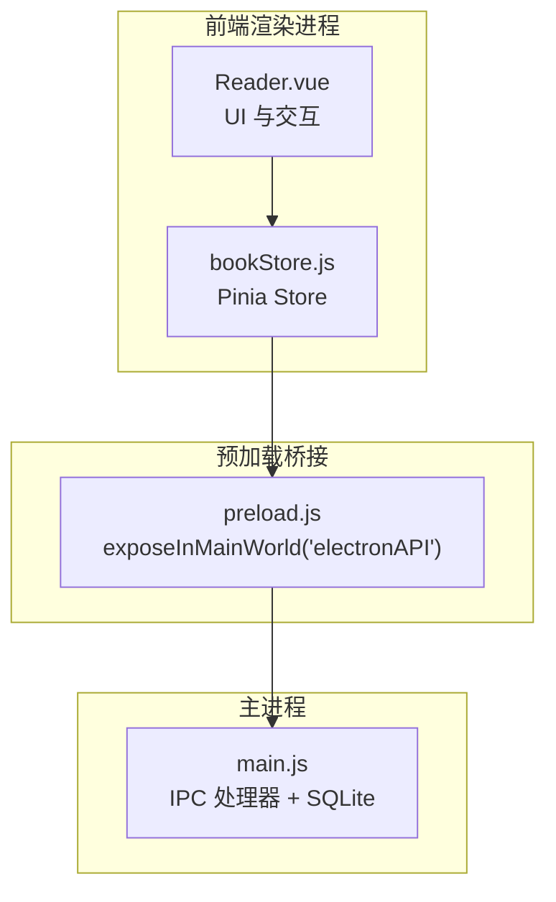
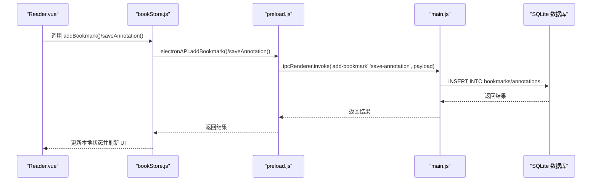
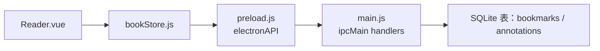

# 书签与批注接口

<cite>
**本文档引用的文件**
- [main.js](file://electron/main.js)
- [preload.js](file://electron/preload.js)
- [bookStore.js](file://src/stores/bookStore.js)
- [Reader.vue](file://src/components/Reader.vue)
- [App.vue](file://src/App.vue)
- [package.json](file://package.json)
- [README.md](file://README.md)
</cite>

## 目录
1. [简介](#简介)
2. [项目结构](#项目结构)
3. [核心组件](#核心组件)
4. [架构总览](#架构总览)
5. [详细组件分析](#详细组件分析)
6. [依赖关系分析](#依赖关系分析)
7. [性能考量](#性能考量)
8. [故障排除指南](#故障排除指南)
9. [结论](#结论)

## 简介
本文件面向 ROSAA 电子书阅读器的“书签与批注管理接口”，系统性梳理并说明以下能力：
- 书签：创建、查询、删除
- 批注：保存、获取、删除
- CFI 坐标系统与选中文本提取
- 颜色标记与高亮显示
- 书签标题自动生成策略
- 批注文本验证与时间戳更新
- 笔记导出：文本格式化与文件生成流程

该系统基于 Electron + Vue 3 + SQLite 架构，前端通过 window.electronAPI 与主进程 IPC 交互，主进程负责数据库持久化与业务逻辑。

## 项目结构
- 前端（Vue 3 + Pinia）
  - Reader.vue：阅读器界面，集成书签与批注交互
  - bookStore.js：Pinia Store，封装与后端 IPC 的调用
- 主进程（Electron + better-sqlite3）
  - main.js：IPC 处理器、数据库初始化与 CRUD
  - preload.js：暴露 window.electronAPI 给渲染进程
- 其他
  - package.json：依赖与打包配置
  - README.md：功能概览与使用说明

图表来源
- [Reader.vue:161-234](file://src/components/Reader.vue#L161-L234)
- [bookStore.js:1-234](file://src/stores/bookStore.js#L1-L234)
- [preload.js:7-101](file://electron/preload.js#L7-L101)
- [main.js:665-760](file://electron/main.js#L665-L760)

章节来源
- [package.json:1-82](file://package.json#L1-L82)
- [README.md:167-193](file://README.md#L167-L193)

## 核心组件
- Reader.vue
  - 负责：右键菜单、选中文本提取、CFI 获取、批注弹窗、书签模态、跳转到书签、高亮批注
- bookStore.js
  - 负责：封装 addBookmark、getBookmarks、deleteBookmark、saveAnnotation、getAnnotations、deleteAnnotation 等调用
- preload.js
  - 负责：将 IPC 处理器映射为 window.electronAPI
- main.js
  - 负责：数据库初始化、表结构定义、add-bookmark/get-bookmarks/delete-bookmark/save-annotation/get-annotations/delete-annotation 等处理器

章节来源
- [Reader.vue:161-234](file://src/components/Reader.vue#L161-L234)
- [bookStore.js:178-231](file://src/stores/bookStore.js#L178-L231)
- [preload.js:7-101](file://electron/preload.js#L7-L101)
- [main.js:665-760](file://electron/main.js#L665-L760)

## 架构总览
前端通过 window.electronAPI 调用主进程 IPC 处理器，主进程使用 better-sqlite3 操作 SQLite 数据库，实现书签与批注的持久化。

图表来源
- [Reader.vue:628-641](file://src/components/Reader.vue#L628-L641)
- [Reader.vue:974-1012](file://src/components/Reader.vue#L974-L1012)
- [bookStore.js:186-206](file://src/stores/bookStore.js#L186-L206)
- [bookStore.js:208-231](file://src/stores/bookStore.js#L208-L231)
- [preload.js:24-91](file://electron/preload.js#L24-L91)
- [main.js:665-760](file://electron/main.js#L665-L760)

## 详细组件分析

### 书签管理接口
- add-bookmark
  - 前端触发：Reader.vue 在当前页位置获取 CFI，调用 bookStore.addBookmark
  - Store 调用：window.electronAPI.addBookmark
  - 主进程：main.js 的 ipcMain.handle('add-bookmark') 插入 bookmarks 表
  - 返回：新增记录的 id
- get-bookmarks
  - 前端触发：Reader.vue 初始化时调用 bookStore.loadBookmarks
  - Store 调用：window.electronAPI.getBookmarks
  - 主进程：按 book_id 查询并按创建时间倒序返回
- delete-bookmark
  - 前端触发：Reader.vue 点击删除按钮，确认后调用 bookStore.deleteBookmark
  - Store 调用：window.electronAPI.deleteBookmark
  - 主进程：删除对应 id 的记录

数据结构（bookmarks 表）
- 字段：id、book_id、cfi、title、note、created_at
- 关系：外键关联 books.id（级联删除）

业务逻辑要点
- CFI 来源：Reader.vue 通过 epub.js 的 rendition.currentLocation().start.cfi 获取
- 标题生成：前端允许用户输入标题；若为空可由后端策略生成（当前实现未见自动标题生成逻辑，建议在后端统一处理）
- 时间戳：created_at 由 SQLite 自动生成

章节来源
- [Reader.vue:628-641](file://src/components/Reader.vue#L628-L641)
- [bookStore.js:178-206](file://src/stores/bookStore.js#L178-L206)
- [preload.js:24-35](file://electron/preload.js#L24-L35)
- [main.js:665-694](file://electron/main.js#L665-L694)

### 批注管理接口
- save-annotation
  - 前端触发：Reader.vue 右键菜单选择“批注”，弹出输入框，输入后调用 window.electronAPI.saveAnnotation
  - 主进程：main.js 的 ipcMain.handle('save-annotation') 插入 annotations 表（默认颜色 #FFEB3B）
  - 返回：{ success, id }
- get-annotations
  - 前端触发：Reader.vue 初始化时调用 window.electronAPI.getAnnotations
  - 主进程：按 book_id 查询并按创建时间升序返回
- delete-annotation
  - 前端触发：Reader.vue 点击删除按钮，确认后调用 window.electronAPI.deleteAnnotation
  - 主进程：删除对应 id 的记录

数据结构（annotations 表）
- 字段：id、book_id、cfi、selected_text、annotation、color、created_at、updated_at
- 关系：外键关联 books.id（级联删除）

业务逻辑要点
- 选中文本提取：Reader.vue 通过 window.getSelection() 或 iframe.contentWindow.getSelection() 获取
- CFI 获取：Reader.vue 使用 epub.js 的 rendition.getCFI(range) 或 contents.cfiFromRange(range)
- 颜色标记：前端高亮时使用 annotation.color（默认 #FFEB3B）
- 时间戳更新：updated_at 由 SQLite 自动生成（ON UPDATE CURRENT_TIMESTAMP）

章节来源
- [Reader.vue:763-807](file://src/components/Reader.vue#L763-L807)
- [Reader.vue:809-939](file://src/components/Reader.vue#L809-L939)
- [Reader.vue:955-1012](file://src/components/Reader.vue#L955-L1012)
- [bookStore.js:514-527](file://src/stores/bookStore.js#L514-L527)
- [preload.js:80-91](file://electron/preload.js#L80-L91)
- [main.js:710-760](file://electron/main.js#L710-L760)

### CFI 坐标系统与选中文本提取
- CFI 获取流程
  - 文档级：window.getSelection().getRangeAt(0) -> rendition.getCFI(range)
  - iframe 内：iframe.contentWindow.getSelection().getRangeAt(0) -> contents.cfiFromRange(range)
- 选中文本提取
  - 通过 Selection API 获取字符串并 trim
- CFI 存储
  - 书签与批注均以 cfi 字段定位，支持跨章节跳转与高亮

章节来源
- [Reader.vue:763-807](file://src/components/Reader.vue#L763-L807)
- [Reader.vue:809-939](file://src/components/Reader.vue#L809-L939)

### 颜色标记与高亮显示
- 高亮实现
  - Reader.vue 使用 epub.js 的 rendition.annotations.add，在指定 CFI 上添加高亮
  - 颜色来自 annotation.color，默认 #FFEB3B
- 弹窗展示
  - 点击高亮时显示包含原文与批注的弹窗，3 秒后自动消失

章节来源
- [Reader.vue:529-562](file://src/components/Reader.vue#L529-L562)
- [Reader.vue:564-599](file://src/components/Reader.vue#L564-L599)

### 书签标题自动生成、批注文本验证与时间戳更新
- 标题自动生成
  - 当前前端允许用户输入标题；如需自动生成，可在主进程侧根据上下文或章节信息生成（建议扩展）
- 批注文本验证
  - 前端在保存前校验 annotationText 是否为空
  - 主进程插入时未做额外长度或字符过滤，建议在主进程增加最小长度与安全字符校验
- 时间戳更新
  - bookmarks/annotations 表的 created_at 与 updated_at 由 SQLite 自动生成
  - 更新时使用 ON UPDATE CURRENT_TIMESTAMP（主进程未显式更新语句，但表结构具备此能力）

章节来源
- [Reader.vue:974-1012](file://src/components/Reader.vue#L974-L1012)
- [main.js:234-261](file://electron/main.js#L234-L261)

### 笔记导出功能
- 导出接口
  - 前端：bookStore.exportNotes(bookId)
  - 主进程：ipcMain.handle('export-notes', bookId)
- 导出内容
  - 合并书籍标题、作者、导出时间
  - 批注：按创建时间升序列出，包含原文、批注、时间
  - 书签：按创建时间升序列出，包含标题、备注、时间
- 文件生成
  - 通过对话框选择保存路径，写入 UTF-8 文本文件

章节来源
- [bookStore.js:147-155](file://src/stores/bookStore.js#L147-L155)
- [main.js:533-592](file://electron/main.js#L533-L592)

## 依赖关系分析
- 前端依赖
  - Vue 3 + Composition API
  - Pinia 状态管理
  - epub.js 渲染与 CFI 获取
- 主进程依赖
  - better-sqlite3：SQLite 原生驱动
  - xml2js/adm-zip：EPUB 元数据与封面提取
- IPC 通道
  - preload.js 暴露 electronAPI，包含 add-bookmark、get-bookmarks、delete-bookmark、save-annotation、get-annotations、delete-annotation 等

图表来源
- [Reader.vue:161-234](file://src/components/Reader.vue#L161-L234)
- [bookStore.js:178-231](file://src/stores/bookStore.js#L178-L231)
- [preload.js:7-101](file://electron/preload.js#L7-L101)
- [main.js:665-760](file://electron/main.js#L665-L760)

章节来源
- [package.json:22-29](file://package.json#L22-L29)

## 性能考量
- CFI 生成与高亮
  - CFI 生成依赖 epub.js 的 Range 与 contents，需确保 DOM 已就绪
  - 批注高亮批量添加时建议先清空历史高亮，避免重复叠加
- 数据库写入
  - 批注保存使用 INSERT，建议在高频场景下考虑批量写入或去抖
  - SQLite WAL 模式已启用，提升并发写入性能
- 页面渲染
  - 阅读器切换模式时销毁并重建渲染器，需注意 iframe 尺寸与容器尺寸同步

章节来源
- [Reader.vue:529-562](file://src/components/Reader.vue#L529-L562)
- [Reader.vue:650-761](file://src/components/Reader.vue#L650-L761)
- [main.js:185-187](file://electron/main.js#L185-L187)

## 故障排除指南
- 无法获取 CFI
  - 检查 epub.js 是否已渲染完成，确保 rendition.currentLocation() 可用
  - iframe 内部右键菜单监听需等待 iframe.contentDocument 就绪，存在重试机制
- 批注未显示高亮
  - 确认 CFI 正确且 annotations 表存在对应记录
  - 检查颜色与透明度设置是否可见
- 保存批注失败
  - 前端需保证 annotationText 非空
  - 主进程日志中查看具体错误信息
- 导出笔记为空
  - 确认数据库中是否存在对应 book_id 的 annotations 与 bookmarks
  - 检查保存对话框是否被取消

章节来源
- [Reader.vue:763-807](file://src/components/Reader.vue#L763-L807)
- [Reader.vue:809-939](file://src/components/Reader.vue#L809-L939)
- [Reader.vue:974-1012](file://src/components/Reader.vue#L974-L1012)
- [main.js:533-592](file://electron/main.js#L533-L592)

## 结论
ROSAA 电子书阅读器的书签与批注接口围绕 Electron + Vue 3 + SQLite 的架构实现，具备完善的 IPC 通道与数据库层支撑。核心能力包括：
- 书签：基于 CFI 的精准定位与持久化
- 批注：选中文本提取、CFI 定位、颜色高亮与弹窗展示
- 导出：统一格式的文本导出，便于归档与分享

建议后续增强方向：
- 书签标题自动生成策略（后端统一处理）
- 批注文本长度与字符安全校验（后端）
- 批注高亮的性能优化（批量与去重）
- 导出格式扩展（如 Markdown/HTML）