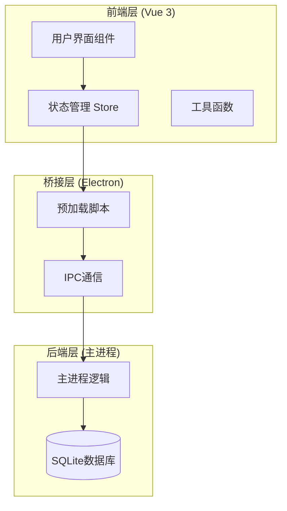
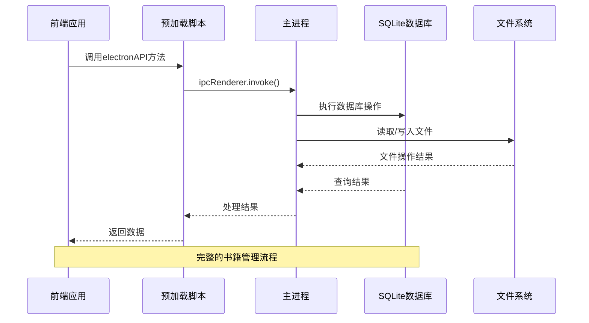
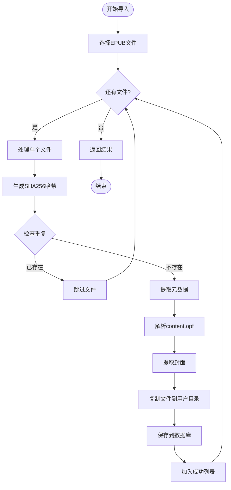
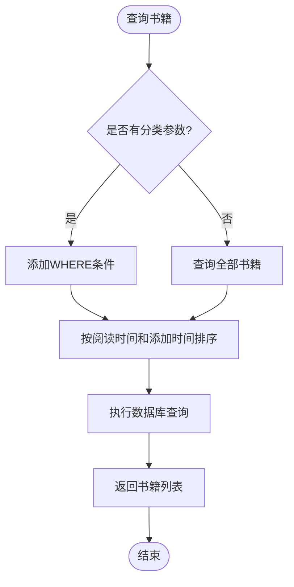
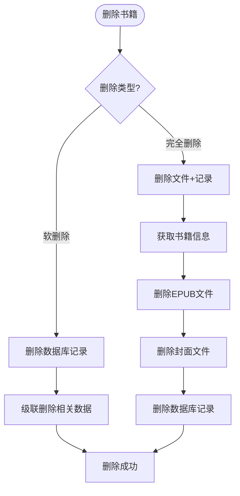
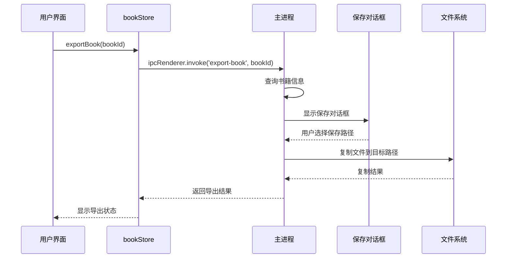
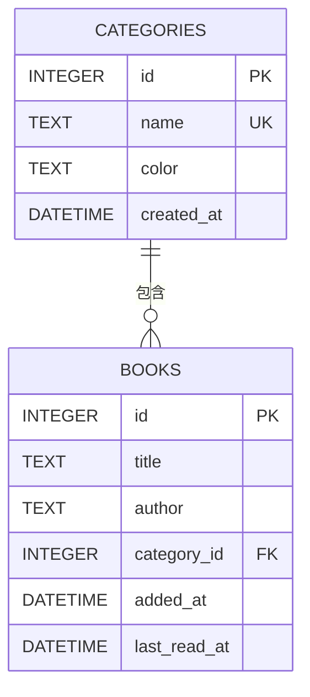
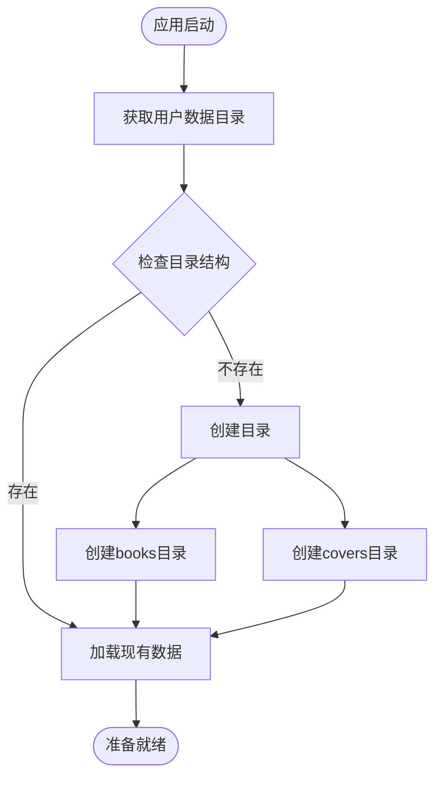

# 书籍管理接口

<cite>
**本文档引用的文件**
- [bookStore.js](file://src/stores/bookStore.js)
- [httpHelper.js](file://src/utils/httpHelper.js)
- [main.js](file://electron/main.js)
- [preload.js](file://electron/preload.js)
- [Library.vue](file://src/components/Library.vue)
- [pathHelper.js](file://src/utils/pathHelper.js)
- [main.js](file://src/main.js)
- [README.md](file://README.md)
</cite>

## 目录
1. [简介](#简介)
2. [项目结构](#项目结构)
3. [核心组件](#核心组件)
4. [架构概览](#架构概览)
5. [详细组件分析](#详细组件分析)
6. [依赖关系分析](#依赖关系分析)
7. [性能考虑](#性能考虑)
8. [故障排除指南](#故障排除指南)
9. [结论](#结论)
10. [附录](#附录)

## 简介
ROSAA电子书阅读器是一个基于Electron + Vue 3 + SQLite的现代化EPUB电子书阅读器桌面应用。本文档专注于书籍管理接口的详细API文档，涵盖书籍的增删改查、导入导出、分类管理等核心功能。

## 项目结构
该项目采用前后端分离的架构设计，主要分为三个层次：



**图表来源**
- [main.js:1-800](file://electron/main.js#L1-L800)
- [preload.js:1-104](file://electron/preload.js#L1-L104)
- [bookStore.js:1-234](file://src/stores/bookStore.js#L1-L234)

**章节来源**
- [README.md:167-193](file://README.md#L167-L193)

## 核心组件
书籍管理接口由以下核心组件构成：

### 前端状态管理
- **bookStore.js**: Vue 3 Pinia状态管理，负责书籍数据的获取、更新和同步
- **Library.vue**: 书架界面组件，提供用户交互和数据展示
- **pathHelper.js**: 文件路径处理工具，支持开发和生产环境的路径转换

### Electron桥接层
- **preload.js**: 暴露安全的Electron API给前端，实现IPC通信
- **main.js**: 主进程逻辑，处理文件系统操作和数据库管理

### 数据存储
- **SQLite数据库**: 使用better-sqlite3实现高性能本地存储
- **文件系统**: EPUB文件和封面图片的本地存储

**章节来源**
- [bookStore.js:1-234](file://src/stores/bookStore.js#L1-L234)
- [Library.vue:1-800](file://src/components/Library.vue#L1-L800)
- [preload.js:1-104](file://electron/preload.js#L1-L104)

## 架构概览
系统采用IPC（进程间通信）模式实现前后端分离：



**图表来源**
- [preload.js:7-101](file://electron/preload.js#L7-L101)
- [main.js:343-427](file://electron/main.js#L343-L427)

## 详细组件分析

### 书籍导入接口 (open-epub)
这是书籍管理的核心接口，负责EPUB文件的导入和元数据提取。

#### 接口定义
- **方法**: `openEpub()`
- **作用**: 打开文件选择对话框，导入EPUB文件
- **返回值**: Promise对象，包含导入结果统计

#### 参数说明
接口本身不接受参数，但内部处理以下流程：
1. 显示文件选择对话框（支持多选）
2. 逐个处理选中的EPUB文件
3. 生成文件SHA256哈希值
4. 检查重复（基于路径或哈希值）
5. 提取EPUB元数据
6. 复制文件到用户数据目录
7. 保存到数据库

#### 去重机制
系统采用双重去重策略：
- **路径去重**: 检查`book_path`字段是否已存在
- **哈希去重**: 检查`file_hash`字段是否已存在
- **算法**: SHA256哈希计算，确保文件内容唯一性

#### 元数据提取流程


**图表来源**
- [main.js:343-427](file://electron/main.js#L343-L427)
- [main.js:13-147](file://electron/main.js#L13-L147)

#### 返回值格式
```javascript
{
  success: boolean,      // 导入是否成功
  added: Array,         // 成功添加的书籍数组
  skipped: number,      // 跳过的书籍数量
  total: number         // 总共处理的文件数量
}
```

**章节来源**
- [bookStore.js:71-104](file://src/stores/bookStore.js#L71-L104)
- [main.js:343-427](file://electron/main.js#L343-L427)

### 书籍查询接口 (get-books)
提供书籍的查询和排序功能。

#### 接口定义
- **方法**: `getBooks(categoryId)`
- **作用**: 获取书籍列表，支持按分类筛选
- **参数**: `categoryId` (可选) - 分类ID

#### 查询逻辑


**图表来源**
- [main.js:429-449](file://electron/main.js#L429-L449)

#### 排序规则
1. **优先级**: `last_read_at DESC` (最近阅读时间)
2. **次优先级**: `added_at DESC` (添加时间)
3. **用途**: 优化用户体验，突出最近使用的书籍

**章节来源**
- [bookStore.js:12-22](file://src/stores/bookStore.js#L12-L22)
- [main.js:429-449](file://electron/main.js#L429-L449)

### 书籍删除接口 (delete-book)
提供书籍的删除功能，支持软删除和完全删除。

#### 接口定义
- **方法**: `deleteBook(bookId)` 和 `deleteBookCompletely(bookId)`
- **作用**: 删除书籍记录和相关数据

#### 删除策略


**图表来源**
- [main.js:696-708](file://electron/main.js#L696-L708)
- [main.js:595-632](file://electron/main.js#L595-L632)

#### 完全删除流程
1. **获取书籍信息**: 从数据库查询书籍详情
2. **删除EPUB文件**: 从用户数据目录删除原文件
3. **删除封面文件**: 删除对应的封面图片
4. **删除数据库记录**: 清理书籍记录和相关数据

**章节来源**
- [bookStore.js:106-126](file://src/stores/bookStore.js#L106-L126)
- [main.js:595-632](file://electron/main.js#L595-L632)

### 书籍导出接口 (export-book)
提供书籍文件和笔记的导出功能。

#### 导出书籍文件
- **方法**: `exportBook(bookId)`
- **流程**: 
  1. 验证书籍是否存在
  2. 显示保存对话框
  3. 复制文件到指定位置
  4. 返回导出结果

#### 导出笔记
- **方法**: `exportNotes(bookId)`
- **内容**: 批注和书签的文本格式导出
- **格式**: 结构化的文本文件，包含时间戳和详细信息

#### 导出流程


**图表来源**
- [main.js:495-531](file://electron/main.js#L495-L531)
- [main.js:533-592](file://electron/main.js#L533-L592)

**章节来源**
- [bookStore.js:137-155](file://src/stores/bookStore.js#L137-L155)
- [main.js:495-592](file://electron/main.js#L495-L592)

### 分类管理接口
提供书籍分类的完整管理功能。

#### 接口定义
- **获取分类**: `getCategories()`
- **添加分类**: `addCategory(name, color)`
- **删除分类**: `deleteCategory(categoryId)`
- **更新书籍分类**: `updateBookCategory(bookId, categoryId)`

#### 分类存储结构


**图表来源**
- [main.js:263-282](file://electron/main.js#L263-L282)

**章节来源**
- [bookStore.js:24-61](file://src/stores/bookStore.js#L24-L61)
- [main.js:451-493](file://electron/main.js#L451-L493)

## 依赖关系分析

### 数据库架构
系统使用SQLite作为主要数据存储，采用关系型数据库设计：

```mermaid
erDiagram
BOOKS {
INTEGER id PK
TEXT title
TEXT author
TEXT publisher
TEXT isbn
TEXT pub_date
TEXT language
TEXT description
TEXT cover_path
TEXT book_path UK
TEXT file_hash
INTEGER category_id FK
DATETIME added_at
DATETIME last_read_at
}
CATEGORIES {
INTEGER id PK
TEXT name UK
TEXT color
DATETIME created_at
}
READING_PROGRESS {
INTEGER id PK
INTEGER book_id UK FK
TEXT cfi
INTEGER page
REAL percentage
DATETIME updated_at
}
BOOKMARKS {
INTEGER id PK
INTEGER book_id FK
TEXT cfi
TEXT title
TEXT note
DATETIME created_at
}
ANNOTATIONS {
INTEGER id PK
INTEGER book_id FK
TEXT cfi
TEXT selected_text
TEXT annotation
TEXT color
DATETIME created_at
DATETIME updated_at
}
BOOKS ||--o{ READING_PROGRESS : "拥有"
BOOKS ||--o{ BOOKMARKS : "拥有"
BOOKS ||--o{ ANNOTATIONS : "拥有"
CATEGORIES ||--o{ BOOKS : "分类"
```

**图表来源**
- [main.js:190-282](file://electron/main.js#L190-L282)

### 文件存储策略
系统采用用户数据目录进行文件存储，确保跨平台兼容性：



**图表来源**
- [main.js:119-133](file://electron/main.js#L119-L133)

**章节来源**
- [main.js:167-284](file://electron/main.js#L167-L284)

## 性能考虑
系统在设计时充分考虑了性能优化：

### 数据库优化
- **WAL模式**: 启用Write-Ahead Logging提高并发性能
- **索引策略**: 在常用查询字段上建立适当的索引
- **事务处理**: 批量操作使用事务确保数据一致性

### 内存管理
- **懒加载**: 书籍封面采用延迟加载策略
- **缓存机制**: 频繁访问的数据进行内存缓存
- **垃圾回收**: 及时清理不再使用的对象引用

### 文件处理优化
- **流式处理**: 大文件采用流式读取避免内存溢出
- **异步操作**: 所有文件操作采用异步模式
- **进度反馈**: 长时间操作提供进度指示

## 故障排除指南

### 常见问题及解决方案

#### 书籍导入失败
**症状**: 导入EPUB文件时报错
**可能原因**:
- 文件损坏或格式不正确
- 磁盘空间不足
- 权限不足

**解决方法**:
1. 验证EPUB文件完整性
2. 检查磁盘可用空间
3. 确认应用程序具有文件写入权限

#### 书籍重复导入
**症状**: 同一本书被多次导入
**原因**: 系统检测到相同的文件哈希值
**解决方法**: 
- 系统自动去重，无需手动处理
- 如需重新导入，先删除重复项

#### 导出失败
**症状**: 导出书籍或笔记失败
**可能原因**:
- 源文件被移动或删除
- 目标路径无写入权限
- 文件正在被其他程序使用

**解决方法**:
1. 检查源文件是否存在
2. 验证目标路径权限
3. 关闭占用文件的程序

#### 数据库连接问题
**症状**: 应用启动时数据库初始化失败
**可能原因**:
- 用户数据目录权限问题
- 数据库文件被锁定
- 磁盘空间不足

**解决方法**:
1. 检查用户数据目录权限
2. 关闭所有使用数据库的应用
3. 清理磁盘空间

**章节来源**
- [main.js:343-427](file://electron/main.js#L343-L427)
- [bookStore.js:71-104](file://src/stores/bookStore.js#L71-L104)

## 结论
ROSAA电子书阅读器的书籍管理接口设计合理，实现了完整的EPUB书籍生命周期管理。系统采用IPC架构确保了前后端的安全分离，SQLite数据库提供了可靠的本地存储能力。去重机制、元数据提取和文件存储策略都经过精心设计，能够满足日常使用需求。

主要优势包括：
- **安全性**: 严格的前后端分离和权限控制
- **可靠性**: 完善的错误处理和数据一致性保证
- **扩展性**: 模块化设计便于功能扩展
- **用户体验**: 流畅的导入导出和分类管理功能

## 附录

### SQL语句示例
以下是系统使用的典型SQL语句：

#### 创建书籍表
```sql
CREATE TABLE IF NOT EXISTS books (
  id INTEGER PRIMARY KEY AUTOINCREMENT,
  title TEXT NOT NULL,
  author TEXT,
  publisher TEXT,
  isbn TEXT,
  pub_date TEXT,
  language TEXT,
  description TEXT,
  cover_path TEXT,
  book_path TEXT UNIQUE NOT NULL,
  file_hash TEXT,
  added_at DATETIME DEFAULT CURRENT_TIMESTAMP,
  last_read_at DATETIME
);
```

#### 创建分类表
```sql
CREATE TABLE IF NOT EXISTS categories (
  id INTEGER PRIMARY KEY AUTOINCREMENT,
  name TEXT NOT NULL UNIQUE,
  color TEXT DEFAULT '#667eea',
  created_at DATETIME DEFAULT CURRENT_TIMESTAMP
);
```

#### 插入书籍记录
```sql
INSERT OR IGNORE INTO books 
(title, author, publisher, isbn, pub_date, language, description, cover_path, book_path, file_hash)
VALUES (?, ?, ?, ?, ?, ?, ?, ?, ?, ?);
```

### JavaScript调用示例
以下是一些常见的JavaScript调用模式：

#### 导入书籍
```javascript
// 前端调用
const result = await window.electronAPI.openEpub();
if (result.success) {
  console.log(`成功添加 ${result.added.length} 本书`);
  console.log(`跳过 ${result.skipped} 本重复书籍`);
}
```

#### 查询书籍
```javascript
// 获取所有书籍
const books = await window.electronAPI.getBooks();

// 获取特定分类的书籍
const categoryBooks = await window.electronAPI.getBooks(categoryId);
```

#### 导出书籍
```javascript
// 导出单个书籍
const exportResult = await window.electronAPI.exportBook(bookId);
if (exportResult.success) {
  console.log(`书籍已导出到: ${exportResult.path}`);
}
```

### 最佳实践建议

#### 书籍搜索和排序
- **搜索优化**: 使用模糊匹配和多字段搜索
- **排序策略**: 优先按最近阅读时间排序
- **分页处理**: 大量书籍时考虑分页加载

#### 批量操作
- **批量导入**: 支持多文件同时导入
- **批量删除**: 提供批量删除功能
- **操作确认**: 重要操作提供二次确认

#### 错误处理
- **用户友好**: 提供清晰的错误信息
- **日志记录**: 详细记录错误日志便于调试
- **回滚机制**: 关键操作支持撤销功能