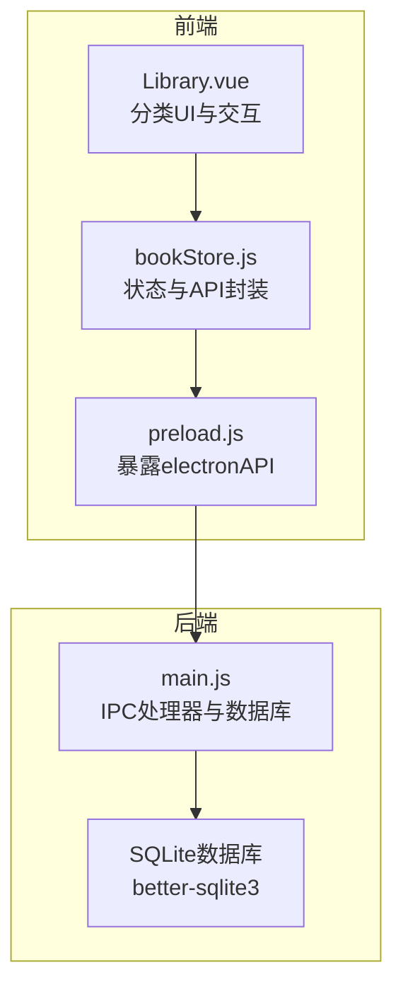
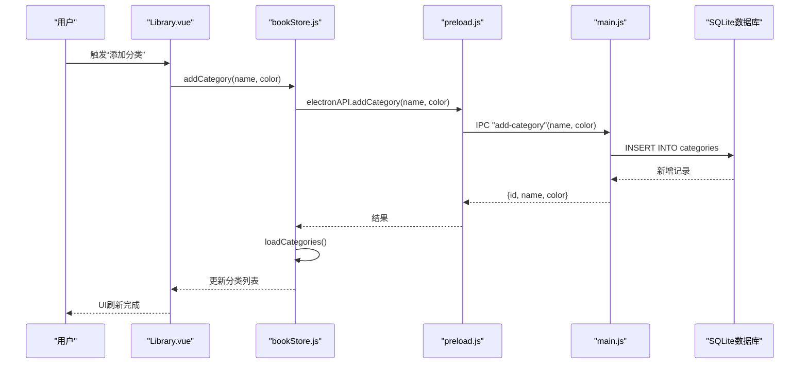
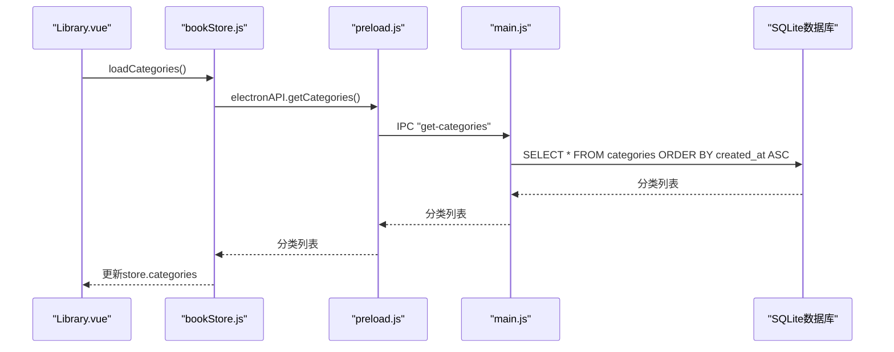
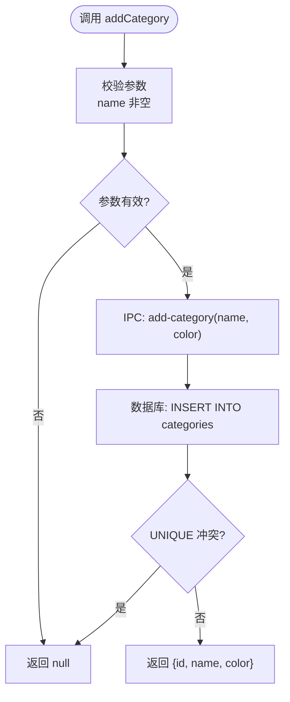
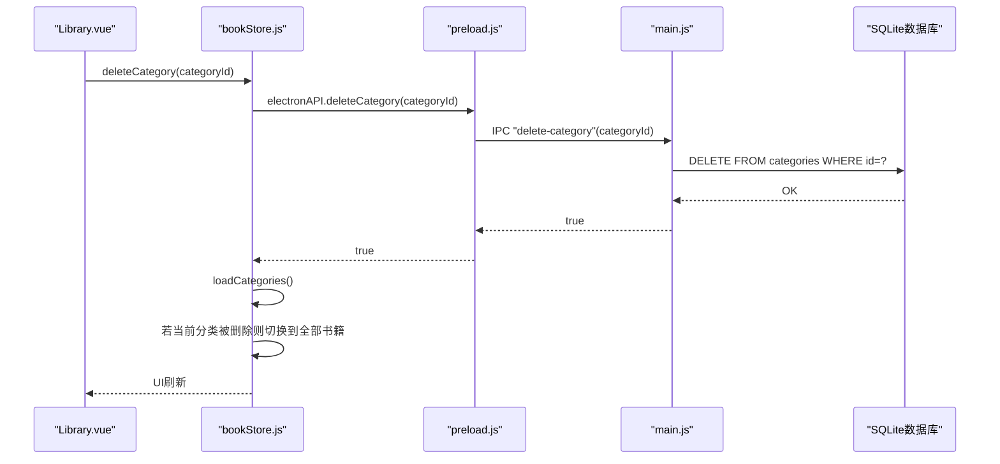
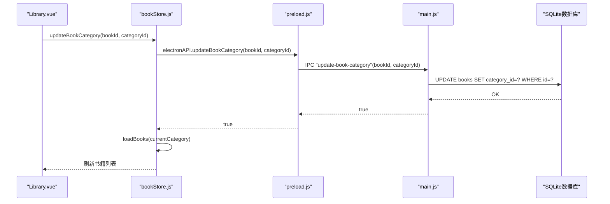
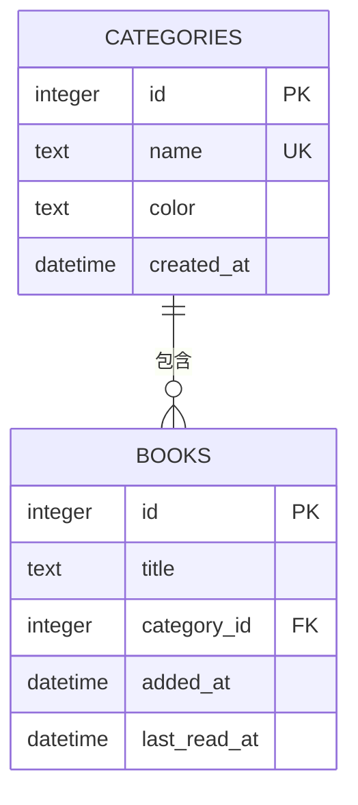

# 分类管理接口

<cite>
**本文引用的文件**
- [README.md](file://README.md)
- [Library.vue](file://src/components/Library.vue)
- [bookStore.js](file://src/stores/bookStore.js)
- [main.js](file://electron/main.js)
- [preload.js](file://electron/preload.js)
</cite>

## 目录
1. [简介](#简介)
2. [项目结构](#项目结构)
3. [核心组件](#核心组件)
4. [架构总览](#架构总览)
5. [详细组件分析](#详细组件分析)
6. [依赖分析](#依赖分析)
7. [性能考虑](#性能考虑)
8. [故障排除指南](#故障排除指南)
9. [结论](#结论)
10. [附录](#附录)

## 简介
本文件面向ROSAA电子书阅读器的分类管理接口，系统性梳理“分类的创建、查询、删除、书籍分类关联”的完整API流程，覆盖参数校验、唯一性约束、外键关联机制、颜色管理、排序规则、分类统计与导入导出、批量操作最佳实践等内容。文档同时解释分类与书籍的一对多关系、级联更新与删除策略，并提供可视化图示帮助理解。

## 项目结构
- 前端采用Vue 3 + Pinia，通过window.electronAPI桥接调用后端IPC接口。
- 后端基于Electron主进程，使用better-sqlite3作为SQLite驱动，提供IPC处理器。
- 数据库包含books、categories、reading_progress、bookmarks、annotations等表，其中categories与books通过category_id建立外键关联。

图表来源
- [Library.vue:346-612](file://src/components/Library.vue#L346-L612)
- [bookStore.js:1-234](file://src/stores/bookStore.js#L1-L234)
- [preload.js:7-101](file://electron/preload.js#L7-L101)
- [main.js:451-493](file://electron/main.js#L451-L493)

章节来源
- [README.md:167-193](file://README.md#L167-L193)
- [Library.vue:346-612](file://src/components/Library.vue#L346-L612)
- [bookStore.js:1-234](file://src/stores/bookStore.js#L1-L234)
- [preload.js:7-101](file://electron/preload.js#L7-L101)
- [main.js:451-493](file://electron/main.js#L451-L493)

## 核心组件
- 前端组件：Library.vue负责分类UI、颜色选择、书籍右键菜单、分类选择弹窗等交互。
- 状态管理：bookStore.js封装了分类与书籍的加载、增删改查以及与后端IPC的对接。
- IPC桥接：preload.js将后端IPC处理器暴露为window.electronAPI，供前端调用。
- 主进程：main.js提供get-categories、add-category、delete-category、update-book-category等IPC处理器，并维护SQLite数据库结构。

章节来源
- [Library.vue:34-612](file://src/components/Library.vue#L34-L612)
- [bookStore.js:1-234](file://src/stores/bookStore.js#L1-L234)
- [preload.js:7-101](file://electron/preload.js#L7-L101)
- [main.js:451-493](file://electron/main.js#L451-L493)

## 架构总览
分类管理接口的调用链路如下：
- 前端UI触发操作（新建分类、分配分类、删除分类）。
- bookStore.js调用window.electronAPI对应的IPC处理器。
- preload.js将调用转发到Electron主进程。
- main.js执行SQL操作并返回结果。
- 前端根据返回结果刷新状态与UI。

图表来源
- [bookStore.js:35-47](file://src/stores/bookStore.js#L35-L47)
- [preload.js:44-47](file://electron/preload.js#L44-L47)
- [main.js:462-471](file://electron/main.js#L462-L471)

章节来源
- [bookStore.js:35-47](file://src/stores/bookStore.js#L35-L47)
- [preload.js:44-47](file://electron/preload.js#L44-L47)
- [main.js:462-471](file://electron/main.js#L462-L471)

## 详细组件分析

### get-categories 接口
- 功能：获取所有分类列表，按创建时间升序排列。
- 参数：无。
- 返回：分类数组，包含id、name、color、created_at。
- 唯一性约束：categories.name字段定义为UNIQUE，数据库层保证唯一。
- 排序规则：ORDER BY created_at ASC。
- 错误处理：异常时返回空数组。

图表来源
- [bookStore.js:24-33](file://src/stores/bookStore.js#L24-L33)
- [preload.js:40-43](file://electron/preload.js#L40-L43)
- [main.js:451-460](file://electron/main.js#L451-L460)

章节来源
- [bookStore.js:24-33](file://src/stores/bookStore.js#L24-L33)
- [preload.js:40-43](file://electron/preload.js#L40-L43)
- [main.js:451-460](file://electron/main.js#L451-L460)

### add-category 接口
- 功能：新增分类，支持指定颜色，默认颜色为#667eea。
- 参数：
  - name: 分类名称（必填，非空）
  - color: 颜色值（可选）
- 唯一性约束：数据库层对name字段设置UNIQUE；若重复则插入失败。
- 返回：新增分类的{id, name, color}，失败返回null。
- 参数校验：前端在调用前对name进行非空校验；后端未显式校验，但数据库UNIQUE约束会阻止重复。
- 颜色管理：前端提供预设颜色列表，支持自定义颜色；后端默认颜色为#667eea。

图表来源
- [Library.vue:579-594](file://src/components/Library.vue#L579-L594)
- [bookStore.js:35-47](file://src/stores/bookStore.js#L35-L47)
- [preload.js:44-47](file://electron/preload.js#L44-L47)
- [main.js:462-471](file://electron/main.js#L462-L471)

章节来源
- [Library.vue:579-594](file://src/components/Library.vue#L579-L594)
- [bookStore.js:35-47](file://src/stores/bookStore.js#L35-L47)
- [preload.js:44-47](file://electron/preload.js#L44-L47)
- [main.js:462-471](file://electron/main.js#L462-L471)

### delete-category 接口
- 功能：删除指定分类。
- 参数：categoryId（必填）。
- 外键策略：categories表无级联删除；删除后，对应书籍的category_id将变为NULL（由books表的外键定义ON DELETE SET NULL决定）。
- 返回：布尔值，成功为true。
- 注意：删除分类不会影响书籍数据，仅解除关联。

图表来源
- [bookStore.js:49-61](file://src/stores/bookStore.js#L49-L61)
- [preload.js:48-51](file://electron/preload.js#L48-L51)
- [main.js:473-482](file://electron/main.js#L473-L482)

章节来源
- [bookStore.js:49-61](file://src/stores/bookStore.js#L49-L61)
- [preload.js:48-51](file://electron/preload.js#L48-L51)
- [main.js:473-482](file://electron/main.js#L473-L482)

### update-book-category 接口
- 功能：将书籍分配到指定分类或移除分类（categoryId=null）。
- 参数：
  - bookId: 书籍ID（必填）
  - categoryId: 分类ID（可为null）
- 外键关联：books.category_id REFERENCES categories(id)，删除分类时ON DELETE SET NULL使关联失效。
- 返回：布尔值，成功为true。
- 书籍筛选：前端在更新后重新加载当前分类下的书籍列表，实现即时筛选效果。

图表来源
- [bookStore.js:128-135](file://src/stores/bookStore.js#L128-L135)
- [preload.js:52-55](file://electron/preload.js#L52-L55)
- [main.js:484-493](file://electron/main.js#L484-L493)

章节来源
- [bookStore.js:128-135](file://src/stores/bookStore.js#L128-L135)
- [preload.js:52-55](file://electron/preload.js#L52-L55)
- [main.js:484-493](file://electron/main.js#L484-L493)

### 分类与书籍的关系与外键策略
- 关系模型：categories与books为一对多关系（一个分类可包含多本书）。
- 外键定义：books.category_id REFERENCES categories(id)。
- 删除策略：删除分类时，books.category_id被SET NULL，不级联删除书籍。
- 级联更新：未定义级联更新；如需迁移分类ID，需手动更新books表。
- 查询策略：get-books接口支持按category_id过滤，实现分类筛选。

图表来源
- [main.js:263-282](file://electron/main.js#L263-L282)
- [main.js:429-449](file://electron/main.js#L429-L449)

章节来源
- [main.js:263-282](file://electron/main.js#L263-L282)
- [main.js:429-449](file://electron/main.js#L429-L449)

### 颜色管理与排序规则
- 颜色管理：
  - 前端提供预设颜色列表，支持用户选择或自定义颜色。
  - 后端categories表默认color为#667eea，新增分类时可传入自定义颜色。
- 排序规则：
  - 分类列表：按created_at升序排列。
  - 书籍列表：按last_read_at降序，再按added_at降序排列。

章节来源
- [Library.vue:429-442](file://src/components/Library.vue#L429-L442)
- [main.js:451-460](file://electron/main.js#L451-L460)
- [main.js:429-449](file://electron/main.js#L429-L449)

### 分类统计与导入导出
- 分类统计：前端当前实现为占位逻辑，未从后端获取分类下书籍数量。建议在后端扩展接口，按分类ID统计书籍数量。
- 导入导出：
  - 书籍导入：open-epub接口支持多文件导入，自动去重（基于book_path或file_hash）。
  - 书籍导出：export-book接口支持将书籍文件复制到用户选择的目标路径。
  - 笔记导出：export-notes接口将批注与书签合并导出为文本文件。
- 批量操作最佳实践：
  - 批量分配分类：前端逐条调用update-book-category，或在后端增加批量更新接口以减少IPC往返。
  - 批量删除分类：删除分类后，书籍category_id自动置空，避免二次处理。

章节来源
- [Library.vue:455-459](file://src/components/Library.vue#L455-L459)
- [main.js:495-592](file://electron/main.js#L495-L592)

## 依赖分析
- 前端依赖：
  - Library.vue依赖bookStore.js提供的API。
  - bookStore.js依赖preload.js暴露的electronAPI。
- 后端依赖：
  - main.js依赖better-sqlite3进行数据库操作。
  - preload.js依赖ipcRenderer进行IPC通信。
- 数据库依赖：
  - categories表与books表通过category_id建立外键关系。

图表来源
- [Library.vue:346-351](file://src/components/Library.vue#L346-L351)
- [bookStore.js:1-11](file://src/stores/bookStore.js#L1-L11)
- [preload.js:7-101](file://electron/preload.js#L7-L101)
- [main.js:5-8](file://electron/main.js#L5-L8)

章节来源
- [Library.vue:346-351](file://src/components/Library.vue#L346-L351)
- [bookStore.js:1-11](file://src/stores/bookStore.js#L1-L11)
- [preload.js:7-101](file://electron/preload.js#L7-L101)
- [main.js:5-8](file://electron/main.js#L5-L8)

## 性能考虑
- 数据库索引：当前未见显式索引，建议在books.category_id上建立索引以优化分类筛选性能。
- 查询排序：书籍列表按last_read_at与added_at排序，建议在数据库层面建立复合索引以提升排序效率。
- IPC调用：批量操作建议合并为后端事务，减少IPC往返次数。
- 前端渲染：大量书籍时建议采用虚拟滚动或分页加载。

## 故障排除指南
- 添加分类失败：
  - 检查name是否为空或重复（UNIQUE冲突）。
  - 查看后端日志定位SQL错误。
- 删除分类后书籍仍显示分类：
  - 确认books.category_id是否正确SET NULL。
  - 前端需重新加载分类列表与书籍列表。
- 分类筛选无效：
  - 确认get-books接口传入的categoryId参数是否正确。
  - 检查books.category_id是否为NULL或无效值。

章节来源
- [main.js:462-493](file://electron/main.js#L462-L493)
- [bookStore.js:12-22](file://src/stores/bookStore.js#L12-L22)

## 结论
ROSAA电子书阅读器的分类管理接口以SQLite为基础，通过Electron IPC实现前后端解耦。接口设计遵循数据库约束（UNIQUE、外键），前端提供直观的颜色与交互体验。建议后续增强后端统计与批量操作能力，以进一步提升用户体验与性能表现。

## 附录
- 数据库初始化与表结构参考：categories表与books.category_id外键定义。
- IPC处理器清单：get-categories、add-category、delete-category、update-book-category等。

章节来源
- [main.js:263-282](file://electron/main.js#L263-L282)
- [main.js:451-493](file://electron/main.js#L451-L493)