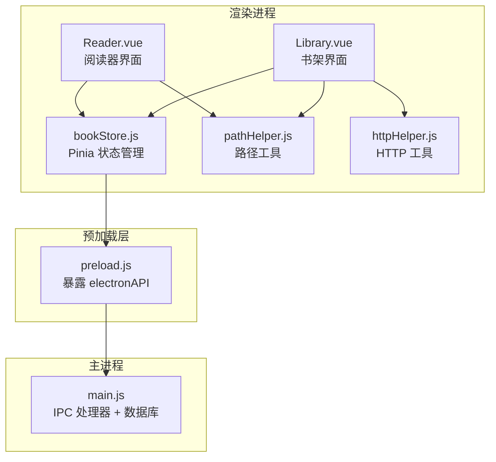
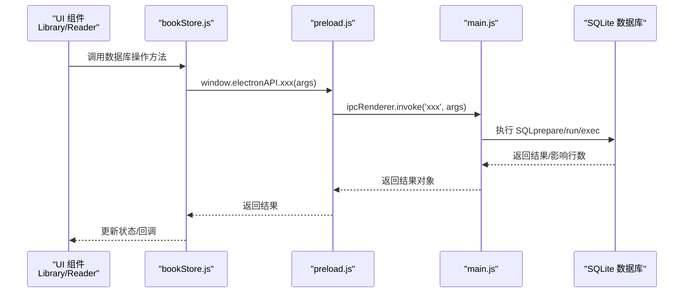
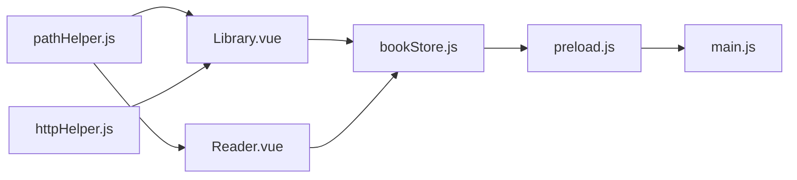

# 数据库操作接口

<cite>
**本文引用的文件**
- [electron/main.js](file://electron/main.js)
- [electron/preload.js](file://electron/preload.js)
- [src/stores/bookStore.js](file://src/stores/bookStore.js)
- [src/components/Library.vue](file://src/components/Library.vue)
- [src/components/Reader.vue](file://src/components/Reader.vue)
- [src/utils/pathHelper.js](file://src/utils/pathHelper.js)
- [src/utils/httpHelper.js](file://src/utils/httpHelper.js)
- [README.md](file://README.md)
</cite>

## 目录
1. [简介](#简介)
2. [项目结构](#项目结构)
3. [核心组件](#核心组件)
4. [架构概览](#架构概览)
5. [详细组件分析](#详细组件分析)
6. [依赖关系分析](#依赖关系分析)
7. [性能考虑](#性能考虑)
8. [故障排除指南](#故障排除指南)
9. [结论](#结论)
10. [附录](#附录)

## 简介
本文件为 ROSAA 电子书阅读器的数据库操作接口提供完整的技术文档。系统基于 Electron + Vue 3 + SQLite，采用 IPC 通道在渲染进程与主进程之间进行数据库交互。数据库采用 SQLite（better-sqlite3），使用 WAL 模式提升并发性能，并通过外键约束实现数据完整性。

本接口覆盖以下业务域：
- 书籍管理：添加、删除、查询、导出、彻底删除
- 进度保存：阅读进度的读取与保存
- 书签操作：添加、删除、查询
- 批注管理：添加、删除、查询
- 分类管理：增删改查与书籍分类关联

## 项目结构
系统采用典型的 Electron 架构，前端使用 Vue 3 + Pinia 管理状态，通过预加载脚本暴露安全的 IPC 接口给渲染进程。



图表来源
- [electron/preload.js:1-95](file://electron/preload.js#L1-L95)
- [electron/main.js:1-820](file://electron/main.js#L1-L820)
- [src/stores/bookStore.js:1-234](file://src/stores/bookStore.js#L1-L234)
- [src/components/Library.vue:1-1292](file://src/components/Library.vue#L1-L1292)
- [src/components/Reader.vue:1-1026](file://src/components/Reader.vue#L1-L1026)
- [src/utils/pathHelper.js:1-63](file://src/utils/pathHelper.js#L1-L63)
- [src/utils/httpHelper.js:1-47](file://src/utils/httpHelper.js#L1-L47)

章节来源
- [README.md:167-193](file://README.md#L167-L193)

## 核心组件
- 数据库初始化与表结构：主进程在应用启动时创建数据库并初始化表结构，启用 WAL 模式，确保并发读写性能。
- IPC 接口层：预加载脚本将主进程的数据库操作封装为 electronAPI，统一暴露给渲染进程调用。
- 前端状态管理：Pinia Store 将数据库操作封装为易用的方法，负责错误处理与状态同步。
- 业务组件：Library.vue 与 Reader.vue 通过 Store 调用数据库接口，实现用户交互。

章节来源
- [electron/main.js:167-284](file://electron/main.js#L167-L284)
- [electron/preload.js:7-92](file://electron/preload.js#L7-L92)
- [src/stores/bookStore.js:4-234](file://src/stores/bookStore.js#L4-L234)

## 架构概览
数据库操作遵循“渲染进程 -> 预加载层 -> 主进程”的调用链路，主进程通过 better-sqlite3 执行 SQL 并返回结果。



图表来源
- [electron/preload.js:7-92](file://electron/preload.js#L7-L92)
- [electron/main.js:343-427](file://electron/main.js#L343-L427)
- [src/stores/bookStore.js:12-234](file://src/stores/bookStore.js#L12-L234)

## 详细组件分析

### 数据库表结构与关系
系统包含五张核心表，通过外键实现级联删除与一致性约束。

```mermaid
erDiagram
BOOKS {
integer id PK
text title
text author
text publisher
text isbn
text pub_date
text language
text description
text cover_path
text book_path UK
text file_hash
datetime added_at
datetime last_read_at
integer category_id FK
}
CATEGORIES {
integer id PK
text name UK
text color
datetime created_at
}
READING_PROGRESS {
integer id PK
integer book_id UK FK
text cfi
integer page
real percentage
datetime updated_at
}
BOOKMARKS {
integer id PK
integer book_id FK
text cfi
text title
text note
datetime created_at
}
ANNOTATIONS {
integer id PK
integer book_id FK
text cfi
text selected_text
text annotation
text color
datetime created_at
datetime updated_at
}
BOOKS }o--|| CATEGORIES : "属于"
BOOKS }o--o| READING_PROGRESS : "拥有"
BOOKS }o--o| BOOKMARKS : "拥有"
BOOKS }o--o| ANNOTATIONS : "拥有"
```

图表来源
- [electron/main.js:190-272](file://electron/main.js#L190-L272)

章节来源
- [electron/main.js:190-281](file://electron/main.js#L190-L281)

### 书籍管理接口
- 添加书籍（open-epub）
  - 参数：无（通过系统文件对话框选择 EPUB 文件）
  - 返回：包含成功/跳过/总数统计的对象
  - 处理流程：校验重复（路径或哈希）、提取元数据、保存封面与书籍文件、插入数据库
  - 错误处理：文件读取异常、重复书籍跳过、数据库插入失败
  - SQL 示例：INSERT OR IGNORE INTO books(...) VALUES (...)
  - JS 调用：window.electronAPI.openEpub()

- 查询书籍（get-books）
  - 参数：categoryId（可选）
  - 返回：书籍数组（按最近阅读/添加排序）
  - SQL 示例：SELECT * FROM books WHERE category_id = ? ORDER BY last_read_at DESC, added_at DESC
  - JS 调用：window.electronAPI.getBooks(categoryId)

- 删除书籍（delete-book）
  - 参数：bookId
  - 返回：布尔值
  - SQL 示例：DELETE FROM books WHERE id = ?
  - JS 调用：window.electronAPI.deleteBook(bookId)

- 彻底删除书籍（delete-book-completely）
  - 参数：bookId
  - 返回：包含 success/error 的对象
  - 处理流程：删除封面与书籍文件、删除数据库记录（级联删除进度/书签/批注）
  - SQL 示例：DELETE FROM books WHERE id = ?
  - JS 调用：window.electronAPI.deleteBookCompletely(bookId)

- 导出书籍（export-book）
  - 参数：bookId
  - 返回：包含 success/path/error 的对象
  - 处理流程：验证书籍存在、选择保存路径、复制文件
  - SQL 示例：SELECT * FROM books WHERE id = ?
  - JS 调用：window.electronAPI.exportBook(bookId)

- 导出笔记（export-notes）
  - 参数：bookId
  - 返回：包含 success/path/error 的对象
  - 处理流程：查询批注与书签，生成文本内容，保存到文件
  - SQL 示例：SELECT * FROM annotations WHERE book_id = ? ORDER BY created_at ASC
  - JS 调用：window.electronAPI.exportNotes(bookId)

章节来源
- [electron/main.js:343-427](file://electron/main.js#L343-L427)
- [electron/main.js:429-449](file://electron/main.js#L429-L449)
- [electron/main.js:495-531](file://electron/main.js#L495-L531)
- [electron/main.js:594-632](file://electron/main.js#L594-L632)
- [electron/main.js:533-592](file://electron/main.js#L533-L592)

### 进度保存接口
- 保存进度（save-progress）
  - 参数：{ bookId, cfi, page, percentage }
  - 返回：布尔值
  - 处理流程：UPSERT 进度记录、更新书籍最近阅读时间
  - SQL 示例：INSERT INTO reading_progress (...) VALUES (...) ON CONFLICT(book_id) DO UPDATE SET ...
  - JS 调用：window.electronAPI.saveProgress(data)

- 读取进度（get-progress）
  - 参数：bookId
  - 返回：进度对象或 null
  - SQL 示例：SELECT * FROM reading_progress WHERE book_id = ?
  - JS 调用：window.electronAPI.getProgress(bookId)

章节来源
- [electron/main.js:634-663](file://electron/main.js#L634-L663)

### 书签操作接口
- 添加书签（add-bookmark）
  - 参数：{ bookId, cfi, title, note }
  - 返回：包含新增书签 id 的对象
  - SQL 示例：INSERT INTO bookmarks (...) VALUES (...)
  - JS 调用：window.electronAPI.addBookmark(data)

- 查询书签（get-bookmarks）
  - 参数：bookId
  - 返回：书签数组（按创建时间倒序）
  - SQL 示例：SELECT * FROM bookmarks WHERE book_id = ? ORDER BY created_at DESC
  - JS 调用：window.electronAPI.getBookmarks(bookId)

- 删除书签（delete-bookmark）
  - 参数：bookmarkId
  - 返回：布尔值
  - SQL 示例：DELETE FROM bookmarks WHERE id = ?
  - JS 调用：window.electronAPI.deleteBookmark(bookmarkId)

章节来源
- [electron/main.js:665-694](file://electron/main.js#L665-L694)

### 批注管理接口
- 添加批注（save-annotation）
  - 参数：{ bookId, cfi, selectedText, annotation, color }
  - 返回：包含 success/id 的对象
  - SQL 示例：INSERT INTO annotations (...) VALUES (...)
  - JS 调用：window.electronAPI.saveAnnotation(data)

- 查询批注（get-annotations）
  - 参数：bookId
  - 返回：批注数组（按创建时间升序）
  - SQL 示例：SELECT * FROM annotations WHERE book_id = ? ORDER BY created_at ASC
  - JS 调用：window.electronAPI.getAnnotations(bookId)

- 删除批注（delete-annotation）
  - 参数：annotationId
  - 返回：布尔值
  - SQL 示例：DELETE FROM annotations WHERE id = ?
  - JS 调用：window.electronAPI.deleteAnnotation(annotationId)

章节来源
- [electron/main.js:710-760](file://electron/main.js#L710-L760)

### 分类管理接口
- 查询分类（get-categories）
  - 参数：无
  - 返回：分类数组（按创建时间升序）
  - SQL 示例：SELECT * FROM categories ORDER BY created_at ASC
  - JS 调用：window.electronAPI.getCategories()

- 新增分类（add-category）
  - 参数：{ name, color }
  - 返回：包含 id/name/color 的对象或 null
  - SQL 示例：INSERT INTO categories (name, color) VALUES (?, ?)
  - JS 调用：window.electronAPI.addCategory(name, color)

- 删除分类（delete-category）
  - 参数：categoryId
  - 返回：布尔值
  - SQL 示例：DELETE FROM categories WHERE id = ?
  - JS 调用：window.electronAPI.deleteCategory(categoryId)

- 更新书籍分类（update-book-category）
  - 参数：{ bookId, categoryId }
  - 返回：布尔值
  - SQL 示例：UPDATE books SET category_id = ? WHERE id = ?
  - JS 调用：window.electronAPI.updateBookCategory(bookId, categoryId)

章节来源
- [electron/main.js:451-493](file://electron/main.js#L451-L493)

### 前端调用封装与错误处理
- bookStore.js 将所有 IPC 调用封装为易用方法，统一处理错误日志与状态更新。
- Library.vue 与 Reader.vue 通过 Store 调用接口，实现用户交互。
- pathHelper.js 提供 file:// URL 构建，兼容开发与生产环境。
- httpHelper.js 提供带认证头的 fetch 工具（用于未来扩展的远程服务）。

章节来源
- [src/stores/bookStore.js:12-234](file://src/stores/bookStore.js#L12-L234)
- [src/components/Library.vue:365-590](file://src/components/Library.vue#L365-L590)
- [src/components/Reader.vue:201-761](file://src/components/Reader.vue#L201-L761)
- [src/utils/pathHelper.js:13-53](file://src/utils/pathHelper.js#L13-L53)
- [src/utils/httpHelper.js:9-46](file://src/utils/httpHelper.js#L9-L46)

## 依赖关系分析
- IPC 依赖：预加载脚本暴露 electronAPI，渲染进程通过 ipcRenderer.invoke 调用主进程处理器。
- 数据库依赖：主进程使用 better-sqlite3，所有 SQL 操作集中于 main.js。
- 前端依赖：bookStore.js 作为单一数据源，避免组件直接访问 IPC。
- 文件系统依赖：封面与书籍文件保存在用户数据目录，路径通过 pathHelper 统一处理。



图表来源
- [electron/preload.js:7-92](file://electron/preload.js#L7-L92)
- [electron/main.js:1-820](file://electron/main.js#L1-L820)
- [src/stores/bookStore.js:1-234](file://src/stores/bookStore.js#L1-L234)
- [src/components/Library.vue:1-1292](file://src/components/Library.vue#L1-L1292)
- [src/components/Reader.vue:1-1026](file://src/components/Reader.vue#L1-L1026)
- [src/utils/pathHelper.js:1-63](file://src/utils/pathHelper.js#L1-L63)
- [src/utils/httpHelper.js:1-47](file://src/utils/httpHelper.js#L1-L47)

## 性能考虑
- WAL 模式：主进程启用 WAL（Write-Ahead Logging），显著提升并发读写性能，减少锁竞争。
- 索引建议：当前表结构未显式创建索引。建议在高频查询字段上建立索引：
  - books(category_id)
  - reading_progress(book_id)
  - bookmarks(book_id)
  - annotations(book_id)
- 批量操作：导出笔记时一次性查询批注与书签，避免多次往返。
- 事务控制：better-sqlite3 默认自动事务，复杂批量操作可考虑显式事务以保证原子性。
- I/O 优化：封面与书籍文件保存在用户数据目录，避免跨盘符移动；路径统一通过 file:// URL 访问。

章节来源
- [electron/main.js:185-187](file://electron/main.js#L185-L187)
- [electron/main.js:274-281](file://electron/main.js#L274-L281)

## 故障排除指南
- 数据库初始化失败
  - 症状：应用启动时报错或数据库文件损坏
  - 排查：检查用户数据目录权限、确认数据库路径正确、查看主进程日志
  - 参考：数据库初始化与表创建逻辑

- 书籍重复添加
  - 症状：相同书籍多次出现
  - 排查：检查 file_hash 与 book_path 唯一性约束
  - 解决：系统已通过 INSERT OR IGNORE 与唯一约束去重

- 进度保存失败
  - 症状：阅读进度未更新
  - 排查：确认 bookId 有效、检查 save-progress 返回值
  - 解决：前端调用后更新本地状态

- 书签/批注读取为空
  - 症状：书签或批注列表为空
  - 排查：确认 bookId 正确、检查数据库查询语句
  - 解决：按创建时间排序确保最新数据可见

- 文件路径错误
  - 症状：封面或书籍无法显示
  - 排查：确认 file:// URL 构建正确、路径存在
  - 解决：使用 pathHelper.buildFileUrl 统一处理

章节来源
- [electron/main.js:167-284](file://electron/main.js#L167-L284)
- [electron/main.js:343-427](file://electron/main.js#L343-L427)
- [electron/main.js:634-663](file://electron/main.js#L634-L663)
- [electron/main.js:665-694](file://electron/main.js#L665-L694)
- [electron/main.js:710-760](file://electron/main.js#L710-L760)
- [src/utils/pathHelper.js:13-53](file://src/utils/pathHelper.js#L13-L53)

## 结论
本接口设计清晰、职责分离明确：前端通过 Store 统一调用，IPC 层屏蔽底层差异，主进程集中处理数据库与文件系统操作。采用 WAL 模式与外键约束保障性能与数据一致性。建议后续根据使用频率为关键字段添加索引，并在批量操作场景引入显式事务以增强可靠性。

## 附录

### API 定义与调用示例

- 书籍管理
  - openEpub(): Promise<{ success, added[], skipped, total }>
  - getBooks(categoryId?): Promise<Book[]>
  - deleteBook(bookId): Promise<boolean>
  - deleteBookCompletely(bookId): Promise<{ success, error? }>
  - exportBook(bookId): Promise<{ success, path?, error? }>
  - exportNotes(bookId): Promise<{ success, path?, error? }>

- 进度管理
  - saveProgress(data: ProgressData): Promise<boolean>
  - getProgress(bookId: number): Promise<Progress | null>

- 书签管理
  - addBookmark(data: BookmarkData): Promise<{ id }>
  - getBookmarks(bookId: number): Promise<Bookmark[]>
  - deleteBookmark(bookmarkId: number): Promise<boolean>

- 批注管理
  - saveAnnotation(data: AnnotationData): Promise<{ success, id? }>
  - getAnnotations(bookId: number): Promise<Annotation[]>
  - deleteAnnotation(annotationId: number): Promise<boolean>

- 分类管理
  - getCategories(): Promise<Category[]>
  - addCategory(name: string, color?: string): Promise<{ id, name, color } | null>
  - deleteCategory(categoryId: number): Promise<boolean>
  - updateBookCategory(bookId: number, categoryId: number): Promise<boolean>

章节来源
- [electron/preload.js:7-92](file://electron/preload.js#L7-L92)
- [electron/main.js:343-427](file://electron/main.js#L343-L427)
- [electron/main.js:429-449](file://electron/main.js#L429-L449)
- [electron/main.js:495-531](file://electron/main.js#L495-L531)
- [electron/main.js:533-592](file://electron/main.js#L533-L592)
- [electron/main.js:634-663](file://electron/main.js#L634-L663)
- [electron/main.js:665-694](file://electron/main.js#L665-L694)
- [electron/main.js:710-760](file://electron/main.js#L710-L760)
- [electron/main.js:451-493](file://electron/main.js#L451-L493)

### SQL 语句示例
- 初始化表结构与约束
  - books 表：包含唯一约束与外键
  - reading_progress 表：唯一约束 book_id，级联删除
  - bookmarks 表：外键约束
  - annotations 表：外键约束
  - categories 表：唯一约束 name

- 书籍相关
  - 插入：INSERT OR IGNORE INTO books(...)
  - 查询：SELECT * FROM books WHERE category_id = ? ORDER BY last_read_at DESC, added_at DESC
  - 删除：DELETE FROM books WHERE id = ?

- 进度相关
  - UPSERT：INSERT INTO reading_progress (...) VALUES (...) ON CONFLICT(book_id) DO UPDATE SET ...

- 书签与批注
  - 添加：INSERT INTO bookmarks/annotations (...) VALUES (...)
  - 查询：SELECT * FROM bookmarks/annotations WHERE book_id = ? ORDER BY created_at [DESC/ASC]
  - 删除：DELETE FROM bookmarks/annotations WHERE id = ?

章节来源
- [electron/main.js:190-281](file://electron/main.js#L190-L281)
- [electron/main.js:378-394](file://electron/main.js#L378-L394)
- [electron/main.js:430-444](file://electron/main.js#L430-L444)
- [electron/main.js:637-645](file://electron/main.js#L637-L645)
- [electron/main.js:667-669](file://electron/main.js#L667-L669)
- [electron/main.js:678-679](file://electron/main.js#L678-L679)
- [electron/main.js:714-724](file://electron/main.js#L714-L724)
- [electron/main.js:737-741](file://electron/main.js#L737-L741)
- [electron/main.js:754](file://electron/main.js#L754)

### JavaScript 调用代码路径
- 前端调用封装：src/stores/bookStore.js
- IPC 暴露：electron/preload.js
- 主进程处理：electron/main.js
- 路径处理：src/utils/pathHelper.js
- HTTP 工具：src/utils/httpHelper.js

章节来源
- [src/stores/bookStore.js:12-234](file://src/stores/bookStore.js#L12-L234)
- [electron/preload.js:7-92](file://electron/preload.js#L7-L92)
- [electron/main.js:343-820](file://electron/main.js#L343-L820)
- [src/utils/pathHelper.js:13-53](file://src/utils/pathHelper.js#L13-L53)
- [src/utils/httpHelper.js:9-46](file://src/utils/httpHelper.js#L9-L46)

### 事务处理与并发控制策略
- 事务处理：better-sqlite3 默认自动事务，适合单条 SQL；批量操作建议显式事务包裹以保证原子性。
- 并发控制：WAL 模式允许多读并发，写入通过 WAL 写入，减少锁冲突；外键级联删除确保数据一致性。
- 错误隔离：主进程捕获异常并返回结构化错误对象，前端统一处理。

章节来源
- [electron/main.js:185-187](file://electron/main.js#L185-L187)
- [electron/main.js:228-229](file://electron/main.js#L228-L229)
- [electron/main.js:242](file://electron/main.js#L242)
- [electron/main.js:258](file://electron/main.js#L258)

### 数据导入导出、备份恢复与迁移方案
- 数据导入导出
  - 书籍导出：通过 export-book 将书籍文件复制到用户选择的目标路径
  - 笔记导出：通过 export-notes 生成文本文件，包含批注与书签
- 备份恢复
  - 数据库备份：直接复制用户数据目录中的数据库文件（epub_reader.db）
  - 恢复：停止应用后替换数据库文件，重启应用生效
- 迁移方案
  - 版本升级：主进程在初始化时检查表结构，必要时添加缺失列（如 file_hash）
  - 数据迁移：通过 ALTER TABLE 添加新列，随后批量填充默认值或迁移数据

章节来源
- [electron/main.js:210-219](file://electron/main.js#L210-L219)
- [electron/main.js:274-281](file://electron/main.js#L274-L281)
- [electron/main.js:495-531](file://electron/main.js#L495-L531)
- [electron/main.js:533-592](file://electron/main.js#L533-L592)