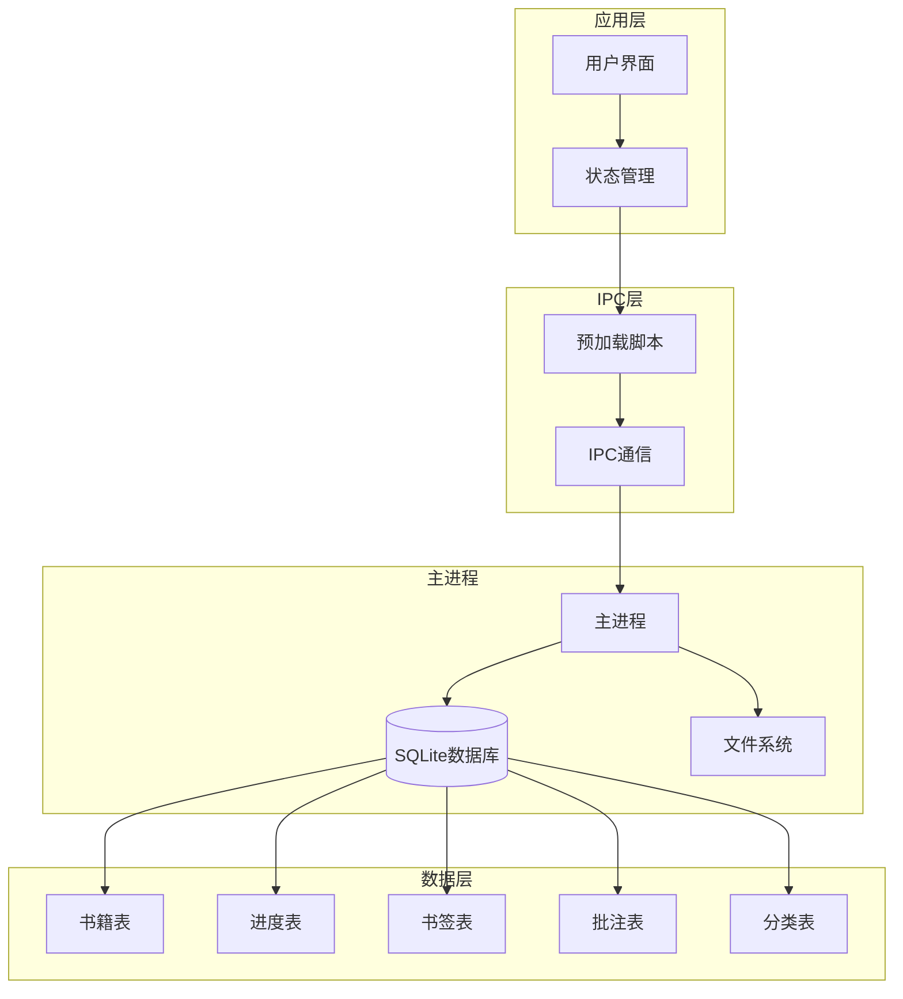
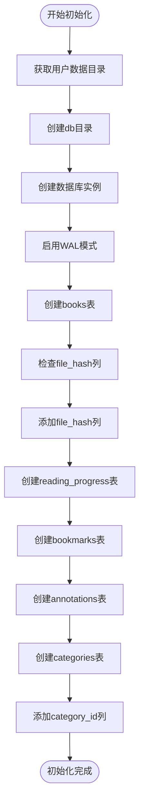
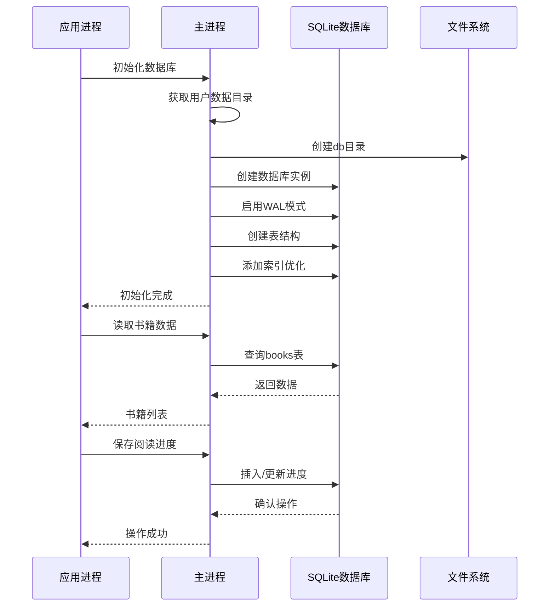
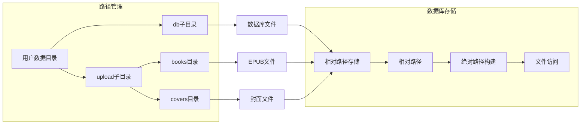
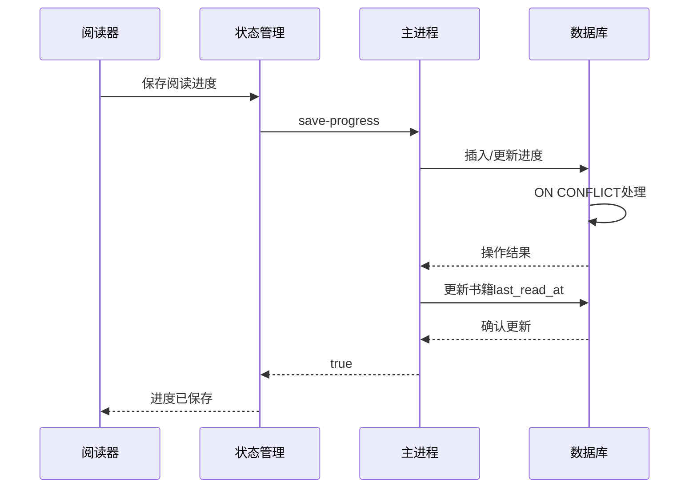
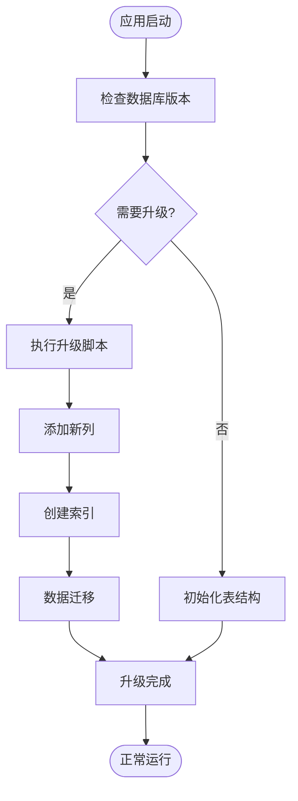
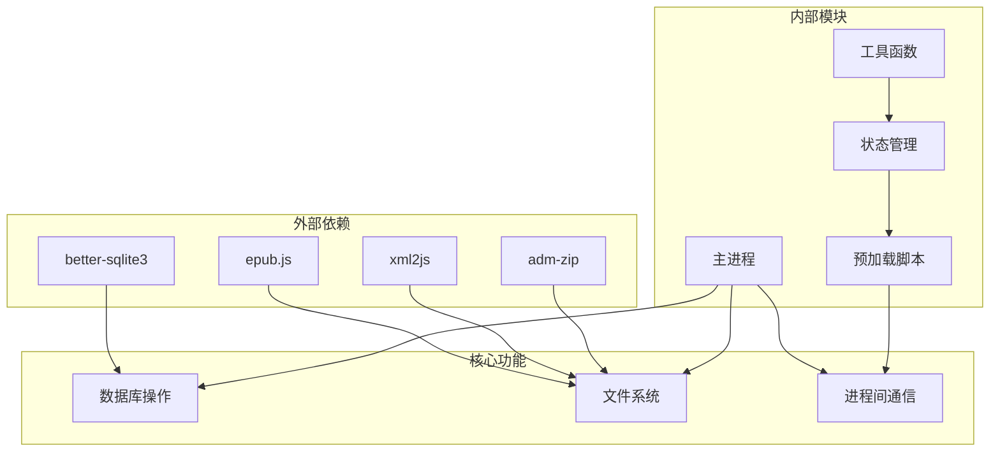
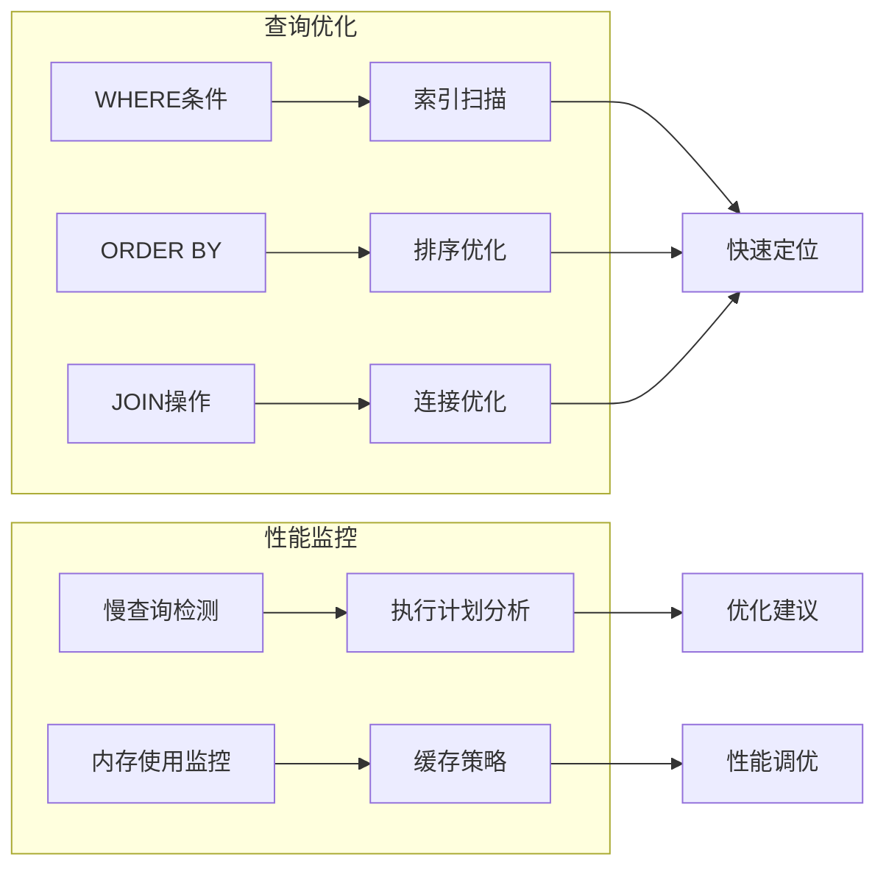
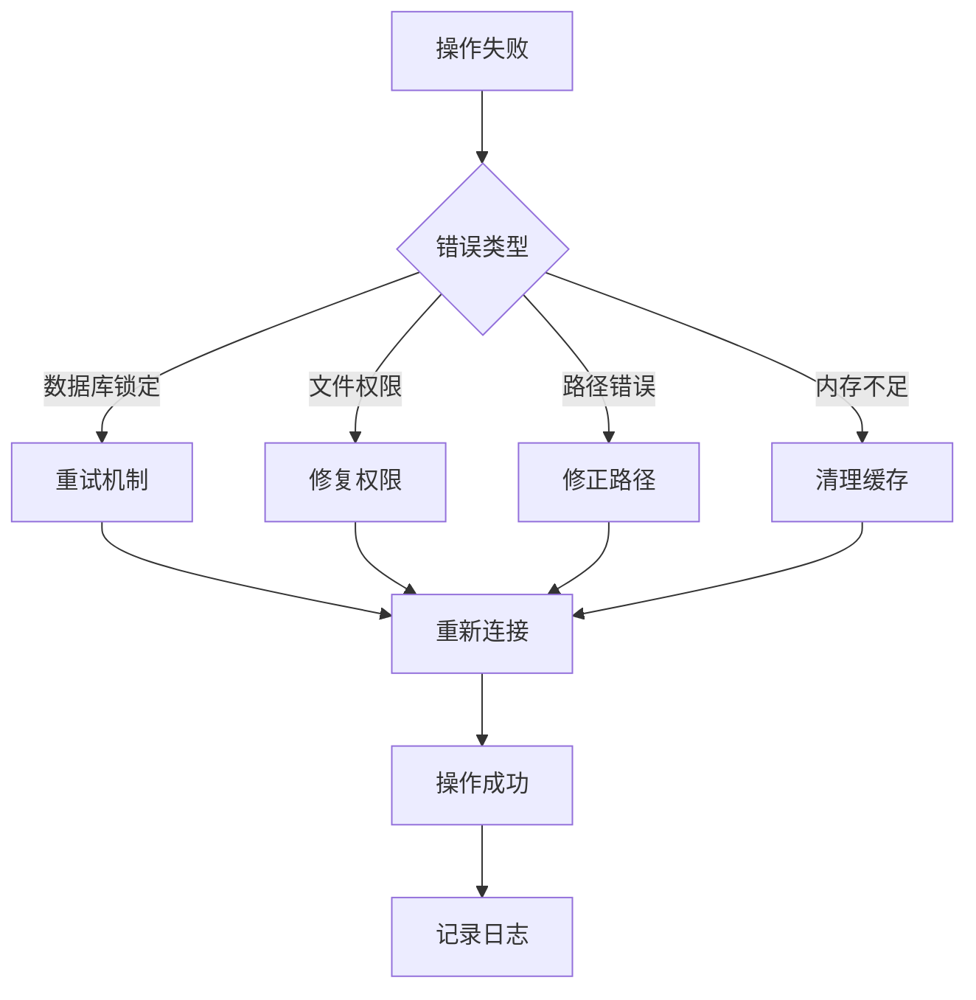

# 数据库通用操作接口

<cite>
**本文档引用的文件**
- [electron/main.js](file://electron/main.js)
- [electron/preload.js](file://electron/preload.js)
- [src/stores/bookStore.js](file://src/stores/bookStore.js)
- [src/utils/pathHelper.js](file://src/utils/pathHelper.js)
- [src/components/Library.vue](file://src/components/Library.vue)
- [src/components/Reader.vue](file://src/components/Reader.vue)
- [docs/DATA_STORAGE.md](file://docs/DATA_STORAGE.md)
- [docs/PATH_COMPATIBILITY.md](file://docs/PATH_COMPATIBILITY.md)
</cite>

## 目录
1. [简介](#简介)
2. [项目结构](#项目结构)
3. [核心组件](#核心组件)
4. [架构概览](#架构概览)
5. [详细组件分析](#详细组件分析)
6. [依赖关系分析](#依赖关系分析)
7. [性能考虑](#性能考虑)
8. [故障排除指南](#故障排除指南)
9. [结论](#结论)
10. [附录](#附录)

## 简介

ROSAA电子书阅读器采用SQLite数据库作为数据存储核心，基于better-sqlite3原生模块实现高性能的数据访问。本项目实现了完整的数据库通用操作接口，包括数据库初始化、连接管理、事务处理、错误恢复等功能。

系统采用Electron架构，主进程负责数据库操作和文件系统管理，渲染进程通过IPC通信访问数据库功能。数据库采用WAL模式提升并发性能，支持完整的CRUD操作和数据完整性保证。

## 项目结构



**图表来源**
- [electron/main.js:317-335](file://electron/main.js#L317-L335)
- [electron/preload.js:7-101](file://electron/preload.js#L7-L101)

**章节来源**
- [electron/main.js:167-284](file://electron/main.js#L167-L284)
- [docs/DATA_STORAGE.md:1-42](file://docs/DATA_STORAGE.md#L1-L42)

## 核心组件

### 数据库初始化组件

createDatabase函数负责完整的数据库初始化流程：



**图表来源**
- [electron/main.js:167-284](file://electron/main.js#L167-L284)

### 数据库连接管理

系统采用单例模式管理数据库连接，确保线程安全和资源管理：

- **连接生命周期**：应用启动时创建，进程退出时自动关闭
- **连接池**：SQLite原生支持，无需额外配置
- **并发控制**：WAL模式支持多读单写并发访问

**章节来源**
- [electron/main.js:182-187](file://electron/main.js#L182-L187)
- [electron/main.js:325-327](file://electron/main.js#L325-L327)

## 架构概览



**图表来源**
- [electron/main.js:317-335](file://electron/main.js#L317-L335)
- [electron/main.js:429-449](file://electron/main.js#L429-L449)
- [electron/main.js:634-653](file://electron/main.js#L634-L653)

## 详细组件分析

### 数据库表结构设计

系统包含五个核心数据表，采用外键约束保证数据完整性：

```mermaid
erDiagram
BOOKS {
integer id PK
text title
text author
text publisher
text isbn
text pub_date
text language
text description
text cover_path
text book_path UK
text file_hash
datetime added_at
datetime last_read_at
integer category_id FK
}
READING_PROGRESS {
integer id PK
integer book_id UK FK
text cfi
integer page
real percentage
datetime updated_at
}
BOOKMARKS {
integer id PK
integer book_id FK
text cfi
text title
text note
datetime created_at
}
ANNOTATIONS {
integer id PK
integer book_id FK
text cfi
text selected_text
text annotation
text color
datetime created_at
datetime updated_at
}
CATEGORIES {
integer id PK
text name UK
text color
datetime created_at
}
BOOKS ||--|| READING_PROGRESS : "一对一"
BOOKS ||--o{ BOOKMARKS : "一对多"
BOOKS ||--o{ ANNOTATIONS : "一对多"
BOOKS }o--|| CATEGORIES : "多对一"
```

**图表来源**
- [electron/main.js:190-271](file://electron/main.js#L190-L271)

### 文件路径管理系统

系统采用统一的文件路径管理策略，确保开发和生产环境的一致性：



**图表来源**
- [docs/DATA_STORAGE.md:8-25](file://docs/DATA_STORAGE.md#L8-L25)
- [docs/PATH_COMPATIBILITY.md:137-148](file://docs/PATH_COMPATIBILITY.md#L137-L148)

### 数据库操作接口

#### 书籍管理接口

系统提供完整的书籍管理功能：

| 接口名称 | 功能描述 | 参数类型 | 返回值 |
|---------|----------|----------|--------|
| open-epub | 添加EPUB文件 | 无 | Promise |
| get-books | 获取书籍列表 | categoryId: number | Promise<Array> |
| delete-book | 删除书籍记录 | bookId: number | Promise<boolean> |
| delete-book-completely | 彻底删除书籍 | bookId: number | Promise<Object> |

#### 阅读进度接口



**图表来源**
- [electron/main.js:634-653](file://electron/main.js#L634-L653)

#### 批注和书签接口

系统支持丰富的阅读辅助功能：

- **批注管理**：支持文本高亮、颜色标记、编辑删除
- **书签管理**：支持标题命名、备注添加、快速跳转
- **分类系统**：支持自定义分类、颜色标识、批量管理

**章节来源**
- [electron/main.js:665-760](file://electron/main.js#L665-L760)

### 数据库迁移和版本升级

系统采用渐进式数据库演进策略：



**图表来源**
- [electron/main.js:209-219](file://electron/main.js#L209-L219)
- [electron/main.js:274-281](file://electron/main.js#L274-L281)

## 依赖关系分析



**图表来源**
- [electron/main.js:1-8](file://electron/main.js#L1-L8)
- [src/stores/bookStore.js:1-4](file://src/stores/bookStore.js#L1-L4)

**章节来源**
- [electron/main.js:1-8](file://electron/main.js#L1-L8)
- [src/stores/bookStore.js:1-4](file://src/stores/bookStore.js#L1-L4)

## 性能考虑

### WAL模式优化

系统启用WAL（Write-Ahead Logging）模式提升并发性能：

- **读写分离**：允许多个读操作同时进行
- **减少锁竞争**：降低数据库锁定时间
- **提高吞吐量**：特别是在高并发场景下

### 索引优化策略



**图表来源**
- [electron/main.js:185-187](file://electron/main.js#L185-L187)

### 内存优化方案

- **流式处理**：大文件处理采用流式读取
- **延迟加载**：非关键数据按需加载
- **缓存策略**：合理使用内存缓存减少磁盘IO

## 故障排除指南

### 常见数据库问题

| 问题类型 | 症状 | 解决方案 |
|---------|------|---------|
| 数据库锁定 | 操作超时 | 检查WAL文件状态，执行checkpoint |
| 文件权限错误 | 无法创建数据库 | 检查用户数据目录权限 |
| 路径解析错误 | 文件找不到 | 验证相对路径转换逻辑 |
| 内存不足 | 操作失败 | 清理WAL缓存，优化查询 |

### 错误恢复机制



**图表来源**
- [electron/main.js:899-921](file://electron/main.js#L899-L921)

**章节来源**
- [electron/main.js:899-921](file://electron/main.js#L899-L921)

## 结论

ROSAA电子书阅读器的数据库通用操作接口设计完善，实现了以下关键特性：

1. **可靠性**：采用WAL模式和外键约束保证数据完整性
2. **性能**：优化的表结构和索引策略支持高效查询
3. **安全性**：严格的文件路径管理和权限控制
4. **可维护性**：清晰的架构设计和完善的错误处理机制

系统通过合理的数据库设计和文件管理策略，为用户提供稳定可靠的电子书阅读体验。

## 附录

### API参考

#### 数据库初始化
- **函数**：createDatabase()
- **作用**：初始化数据库连接和表结构
- **返回**：Promise<void>

#### 文件系统操作
- **函数**：extractEpubMetadata(filePath)
- **作用**：提取EPUB元数据并保存文件
- **返回**：Promise<Object>

#### 数据库查询
- **函数**：get-books(categoryId)
- **作用**：获取书籍列表
- **返回**：Promise<Array>

### 配置选项

| 选项 | 默认值 | 描述 |
|------|--------|------|
| journal_mode | WAL | 事务日志模式 |
| synchronous | NORMAL | 数据同步级别 |
| cache_size | 2000 | 缓存页数 |
| foreign_keys | ON | 外键约束 |