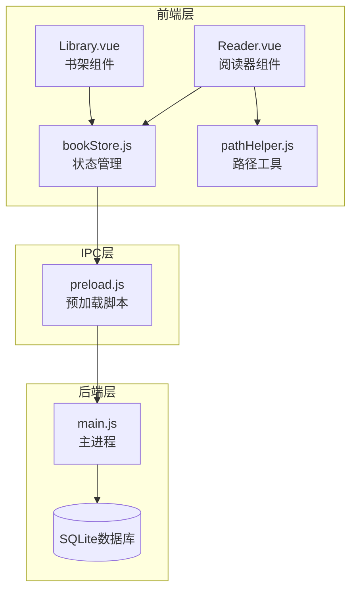
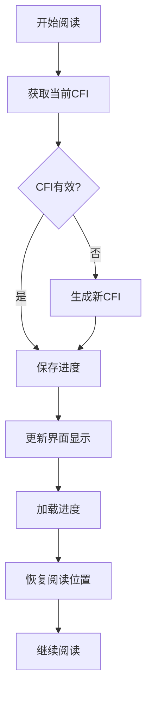
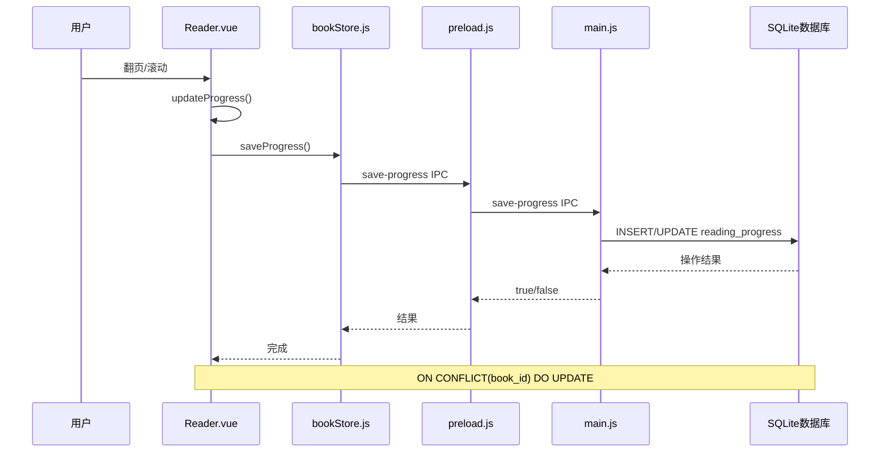
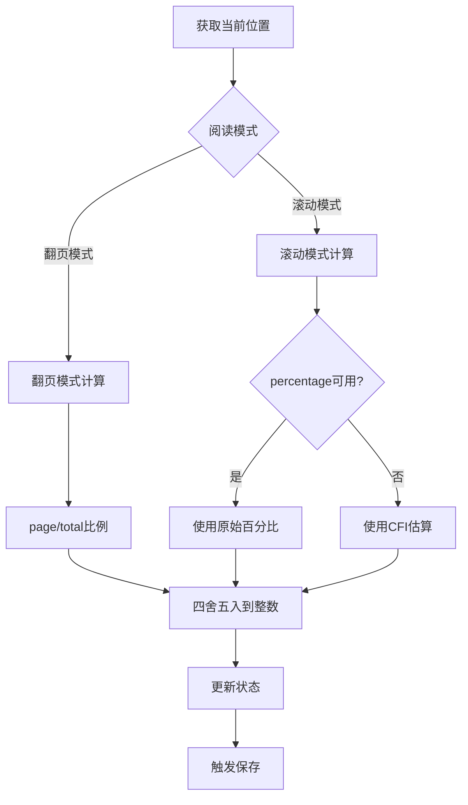
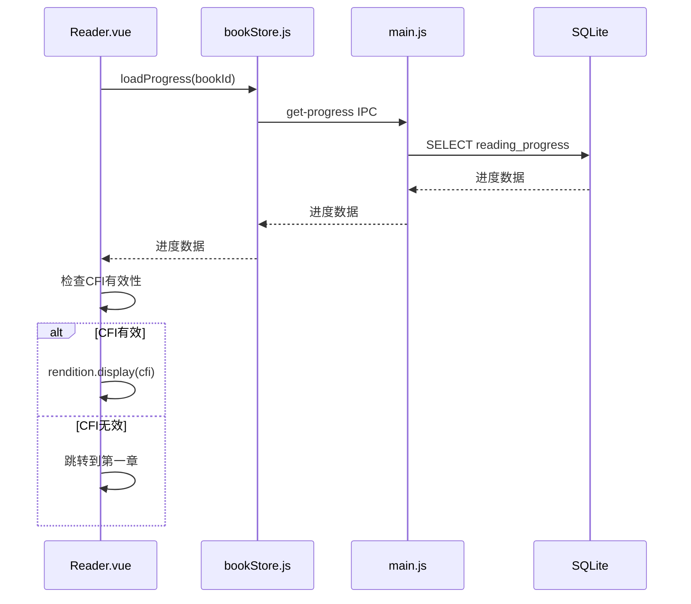
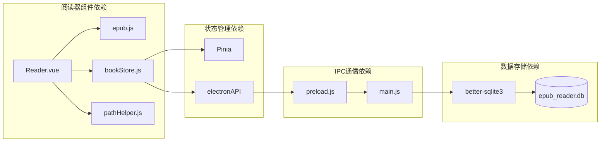
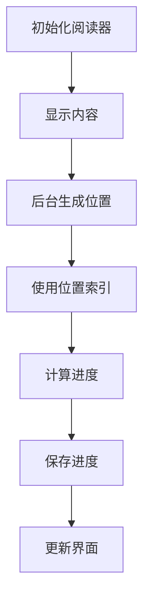

# 阅读进度接口

<cite>
**本文档引用的文件**
- [Reader.vue](file://src/components/Reader.vue)
- [bookStore.js](file://src/stores/bookStore.js)
- [main.js](file://electron/main.js)
- [preload.js](file://electron/preload.js)
- [pathHelper.js](file://src/utils/pathHelper.js)
- [Library.vue](file://src/components/Library.vue)
- [README.md](file://README.md)
</cite>

## 目录
1. [简介](#简介)
2. [项目结构](#项目结构)
3. [核心组件](#核心组件)
4. [架构概览](#架构概览)
5. [详细组件分析](#详细组件分析)
6. [依赖关系分析](#依赖关系分析)
7. [性能考虑](#性能考虑)
8. [故障排除指南](#故障排除指南)
9. [结论](#结论)

## 简介

ROSAA电子书阅读器的阅读进度跟踪接口是一个完整的端到端解决方案，实现了基于EPUB CFI（Canonical Fragment Identifier）的精确位置定位和跨设备同步功能。该系统支持断点续读、多设备兼容性和智能冲突解决策略。

## 项目结构



**图表来源**
- [Reader.vue:161-222](file://src/components/Reader.vue#L161-L222)
- [bookStore.js:4-234](file://src/stores/bookStore.js#L4-L234)
- [preload.js:7-101](file://electron/preload.js#L7-L101)
- [main.js:634-663](file://electron/main.js#L634-L663)

**章节来源**
- [Reader.vue:1-1026](file://src/components/Reader.vue#L1-L1026)
- [bookStore.js:1-234](file://src/stores/bookStore.js#L1-L234)
- [main.js:1-922](file://electron/main.js#L1-L922)
- [preload.js:1-104](file://electron/preload.js#L1-L104)

## 核心组件

### 进度数据模型

系统使用统一的进度数据结构来存储阅读状态：

| 字段名称 | 数据类型 | 描述 | 默认值 |
|---------|---------|------|--------|
| book_id | INTEGER | 书籍唯一标识符 | - |
| cfi | TEXT | EPUB CFI定位符 | NULL |
| page | INTEGER | 当前页码 | 0 |
| percentage | REAL | 整书阅读百分比 | 0 |
| updated_at | DATETIME | 最后更新时间 | CURRENT_TIMESTAMP |

### CFI定位机制

EPUB CFI是一种标准化的片段标识符，能够精确定位EPUB文档中的任意位置：



**图表来源**
- [Reader.vue:497-507](file://src/components/Reader.vue#L497-L507)
- [main.js:634-653](file://electron/main.js#L634-L653)

**章节来源**
- [Reader.vue:440-495](file://src/components/Reader.vue#L440-L495)
- [main.js:221-232](file://electron/main.js#L221-L232)

## 架构概览



**图表来源**
- [Reader.vue:322-326](file://src/components/Reader.vue#L322-L326)
- [bookStore.js:169-176](file://src/stores/bookStore.js#L169-L176)
- [main.js:634-653](file://electron/main.js#L634-L653)

## 详细组件分析

### Reader.vue - 进度跟踪核心

Reader组件负责实时监控阅读进度并触发保存操作：

#### 进度计算算法



**图表来源**
- [Reader.vue:445-495](file://src/components/Reader.vue#L445-L495)

#### 断点续读流程



**图表来源**
- [Reader.vue:344-417](file://src/components/Reader.vue#L344-L417)
- [bookStore.js:161-167](file://src/stores/bookStore.js#L161-L167)

**章节来源**
- [Reader.vue:310-326](file://src/components/Reader.vue#L310-L326)
- [Reader.vue:440-495](file://src/components/Reader.vue#L440-L495)

### bookStore.js - 状态管理

Pinia状态管理器提供统一的数据访问接口：

#### API接口定义

| 接口名称 | 参数 | 返回值 | 描述 |
|---------|------|--------|------|
| loadProgress | bookId: number | Progress | 加载指定书籍进度 |
| saveProgress | data: ProgressData | boolean | 保存进度数据 |
| loadBookmarks | bookId: number | Bookmark[] | 加载书签 |
| addBookmark | data: BookmarkData | Bookmark | 添加书签 |
| deleteBookmark | bookmarkId: number | boolean | 删除书签 |

**章节来源**
- [bookStore.js:161-206](file://src/stores/bookStore.js#L161-L206)

### main.js - 数据持久化

主进程负责SQLite数据库操作和数据持久化：

#### ON CONFLICT 冲突解决策略

系统采用SQLite的ON CONFLICT机制实现智能冲突处理：

```sql
INSERT INTO reading_progress (book_id, cfi, page, percentage)
VALUES (?, ?, ?, ?)
ON CONFLICT(book_id) DO UPDATE SET
  cfi = excluded.cfi,
  page = excluded.page,
  percentage = excluded.percentage,
  updated_at = CURRENT_TIMESTAMP
```

**章节来源**
- [main.js:634-653](file://electron/main.js#L634-L653)
- [main.js:221-232](file://electron/main.js#L221-L232)

### preload.js - IPC通信桥

预加载脚本提供安全的进程间通信接口：

#### IPC接口映射

| Vue接口 | IPC通道 | 参数 | 返回值 |
|--------|---------|------|--------|
| saveProgress | save-progress | ProgressData | boolean |
| getProgress | get-progress | bookId | Progress |
| addBookmark | add-bookmark | BookmarkData | {id: number} |
| getBookmarks | get-bookmarks | bookId | Bookmark[] |
| deleteBookmark | delete-bookmark | bookmarkId | boolean |

**章节来源**
- [preload.js:16-23](file://electron/preload.js#L16-L23)

## 依赖关系分析



**图表来源**
- [Reader.vue:164-165](file://src/components/Reader.vue#L164-L165)
- [bookStore.js:1-2](file://src/stores/bookStore.js#L1-L2)
- [preload.js:1-1](file://electron/preload.js#L1-L1)

**章节来源**
- [Reader.vue:161-165](file://src/components/Reader.vue#L161-L165)
- [bookStore.js:1-2](file://src/stores/bookStore.js#L1-L2)

## 性能考虑

### 位置生成优化

系统采用后台生成位置索引的策略，避免阻塞首屏加载：



**图表来源**
- [Reader.vue:427-438](file://src/components/Reader.vue#L427-L438)

### 内存管理策略

- **延迟生成**：位置索引在后台异步生成
- **缓存机制**：EPUB.js内部缓存CFI映射
- **垃圾回收**：组件卸载时自动清理事件监听器

## 故障排除指南

### 常见问题及解决方案

| 问题类型 | 症状 | 可能原因 | 解决方案 |
|---------|------|----------|----------|
| 进度丢失 | 重启后从头开始 | CFI无效或数据库错误 | 检查CFI格式，重建数据库 |
| 百分比异常 | 显示100%或0% | 位置索引未生成 | 等待后台生成完成 |
| 跨设备不同步 | 不同设备位置不一致 | CFI解析错误 | 验证EPUB版本兼容性 |
| 性能问题 | 页面切换卡顿 | 位置索引过大 | 优化位置生成参数 |

**章节来源**
- [Reader.vue:455-473](file://src/components/Reader.vue#L455-L473)
- [main.js:634-653](file://electron/main.js#L634-L653)

## 结论

ROSAA电子书阅读器的阅读进度跟踪接口通过以下关键技术实现了可靠的断点续读功能：

1. **CFI定位精度**：基于EPUB标准的CFI标识符确保位置定位的准确性
2. **智能冲突解决**：利用SQLite的ON CONFLICT机制实现数据一致性
3. **多模式支持**：同时支持翻页和滚动两种阅读模式的进度计算
4. **跨设备兼容**：通过CFI机制实现不同设备间的进度同步
5. **性能优化**：后台生成位置索引避免影响用户体验

该系统为用户提供无缝的阅读体验，支持随时随地的断点续读，是现代电子书阅读器的重要功能基础。