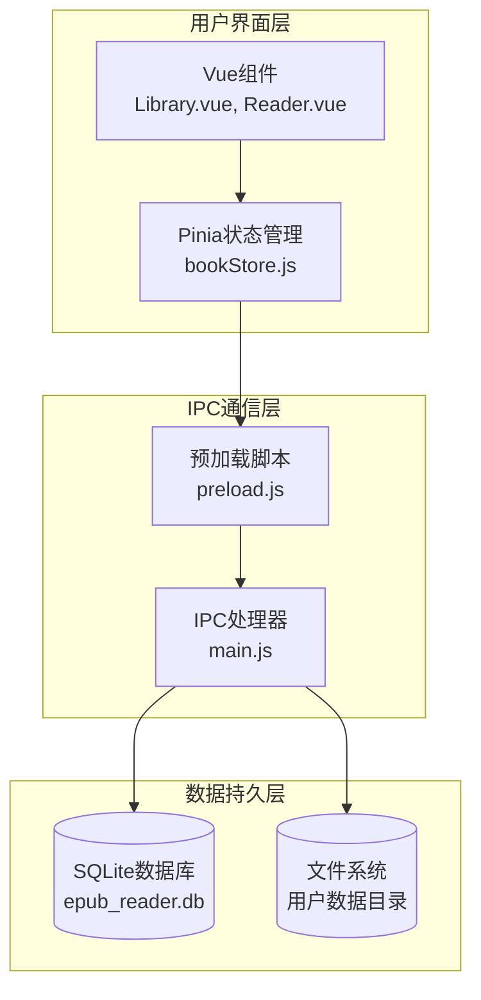
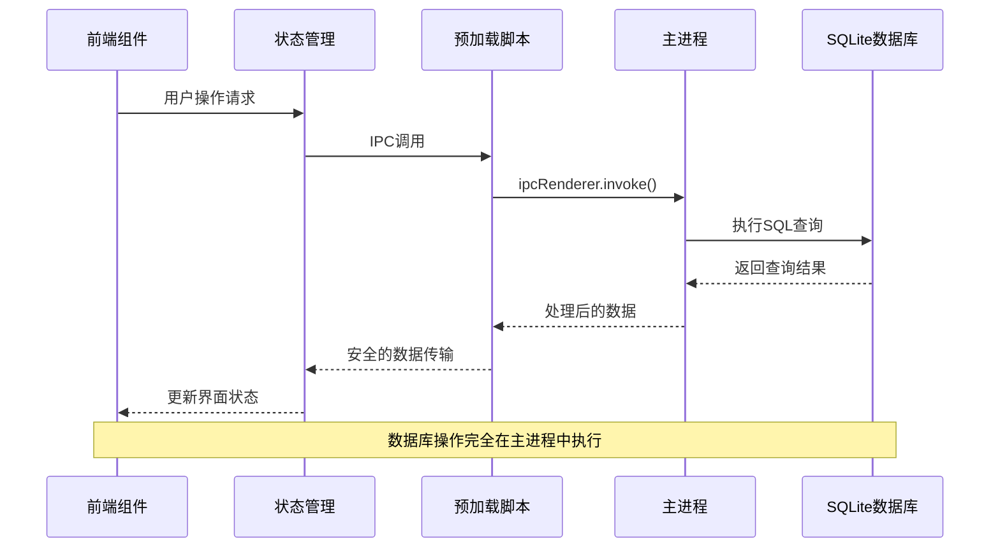
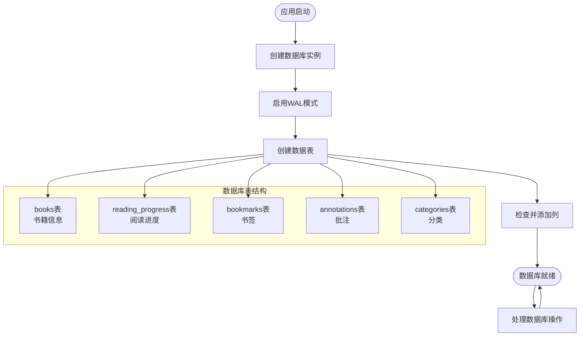
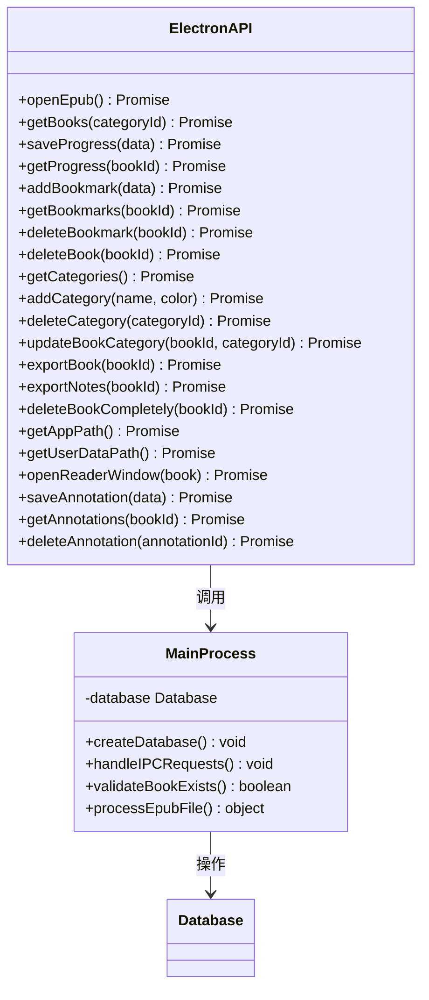
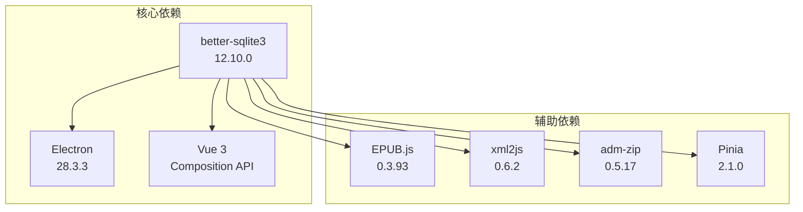
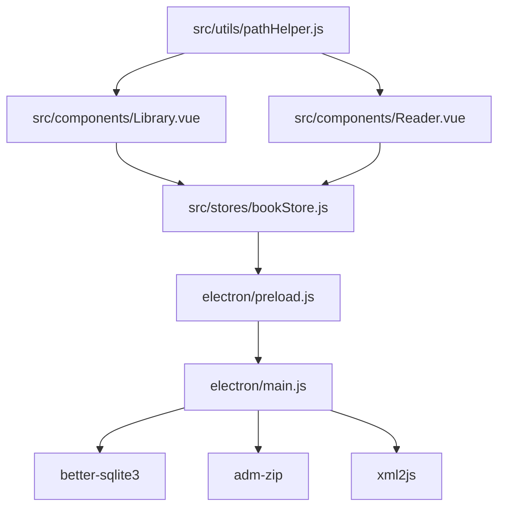

# 数据库架构设计

<cite>
**本文档引用的文件**
- [electron/main.js](file://electron/main.js)
- [electron/preload.js](file://electron/preload.js)
- [src/stores/bookStore.js](file://src/stores/bookStore.js)
- [src/utils/pathHelper.js](file://src/utils/pathHelper.js)
- [src/components/Library.vue](file://src/components/Library.vue)
- [src/components/Reader.vue](file://src/components/Reader.vue)
- [package.json](file://package.json)
- [docs/DATA_STORAGE.md](file://docs/DATA_STORAGE.md)
- [README.md](file://README.md)
</cite>

## 目录
1. [引言](#引言)
2. [项目结构](#项目结构)
3. [核心组件](#核心组件)
4. [架构概览](#架构概览)
5. [详细组件分析](#详细组件分析)
6. [依赖关系分析](#依赖关系分析)
7. [性能考虑](#性能考虑)
8. [故障排除指南](#故障排除指南)
9. [结论](#结论)

## 引言

ROSAA电子书阅读器采用SQLite数据库作为数据存储解决方案，这是一个经过验证的、可靠的嵌入式数据库管理系统。本项目选择了SQLite而非传统的客户端-服务器数据库，主要基于以下优势：

### SQLite选择的原因

**轻量级特性**
- 无需独立的数据库服务进程
- 内存占用极小，适合桌面应用程序
- 单文件数据库，便于部署和备份

**无服务器架构**
- 无需配置复杂的数据库服务器
- 降低系统复杂性和维护成本
- 减少潜在的网络延迟

**零配置优势**
- 开箱即用，无需复杂的初始配置
- 自动处理事务和并发控制
- 内置ACID事务支持

**better-sqlite3原生模块集成**
- 使用Node.js原生绑定，性能优异
- 避免JavaScript到C++的额外抽象层
- 提供接近C语言的执行效率

## 项目结构

项目的数据库架构围绕Electron主进程中的数据库管理器构建，形成了清晰的分层结构：



**图表来源**
- [electron/main.js:167-284](file://electron/main.js#L167-L284)
- [electron/preload.js:7-92](file://electron/preload.js#L7-L92)
- [src/stores/bookStore.js:4-234](file://src/stores/bookStore.js#L4-L234)

**章节来源**
- [electron/main.js:167-284](file://electron/main.js#L167-L284)
- [electron/preload.js:7-92](file://electron/preload.js#L7-L92)
- [src/stores/bookStore.js:4-234](file://src/stores/bookStore.js#L4-L234)

## 核心组件

### 数据库初始化管理器

数据库初始化在Electron主进程启动时执行，负责创建数据库实例、启用WAL模式并建立所有必要的数据表结构。

### IPC通信接口

通过预加载脚本暴露安全的API接口，前端组件通过这些接口与数据库进行交互，实现了严格的上下文隔离。

### 数据模型层

应用定义了完整的数据模型，包括书籍信息、阅读进度、书签和批注等核心实体。

**章节来源**
- [electron/main.js:167-284](file://electron/main.js#L167-L284)
- [electron/preload.js:7-92](file://electron/preload.js#L7-L92)
- [src/stores/bookStore.js:4-234](file://src/stores/bookStore.js#L4-L234)

## 架构概览

整个数据库架构遵循Electron的标准模式，通过IPC实现前后端分离的数据访问：



**图表来源**
- [electron/main.js:343-427](file://electron/main.js#L343-L427)
- [electron/preload.js:7-92](file://electron/preload.js#L7-L92)
- [src/stores/bookStore.js:12-22](file://src/stores/bookStore.js#L12-L22)

## 详细组件分析

### 数据库连接管理

#### 初始化流程

数据库连接管理采用单例模式，在应用启动时创建并全局维护：



**图表来源**
- [electron/main.js:167-284](file://electron/main.js#L167-L284)

#### 连接配置参数

数据库实例使用以下配置参数：

| 参数 | 值 | 说明 |
|------|-----|------|
| journal_mode | WAL | 启用写-ahead日志模式 |
| foreign_keys | 启用 | 支持外键约束 |
| busy_timeout | 默认 | 处理数据库忙等待 |
| timeout | 默认 | SQL执行超时设置 |

**章节来源**
- [electron/main.js:182-187](file://electron/main.js#L182-L187)

### 数据存储架构

#### 文件系统布局

数据库文件采用用户数据目录存储策略，确保跨平台兼容性和用户隐私保护：

```mermaid
graph TD
UserData[用户数据目录<br/>app.getPath('userData')] --> DBDir[db/ 子目录]
UserData --> UploadDir[upload/ 子目录]
DBDir --> DBFile[epub_reader.db<br/>SQLite数据库文件]
UploadDir --> BooksDir[books/ 书籍文件]
UploadDir --> CoversDir[covers/ 封面图片]
BooksDir --> BookFiles[*.epub文件]
CoversDir --> CoverFiles[*.jpg文件]
DBFile --> Schema[数据库模式<br/>CREATE TABLE语句]
```

**图表来源**
- [docs/DATA_STORAGE.md:1-42](file://docs/DATA_STORAGE.md#L1-L42)
- [electron/main.js:102-133](file://electron/main.js#L102-L133)

#### 路径处理机制

应用实现了统一的路径处理逻辑，确保开发和生产环境的一致性：

**章节来源**
- [docs/DATA_STORAGE.md:18-36](file://docs/DATA_STORAGE.md#L18-L36)
- [src/utils/pathHelper.js:13-53](file://src/utils/pathHelper.js#L13-L53)

### 数据模型设计

#### 实体关系图

```mermaid
erDiagram
BOOKS {
integer id PK
text title
text author
text publisher
text isbn
text pub_date
text language
text description
text cover_path
text book_path
text file_hash
datetime added_at
datetime last_read_at
integer category_id FK
}
READING_PROGRESS {
integer id PK
integer book_id UK FK
text cfi
integer page
float percentage
datetime updated_at
}
BOOKMARKS {
integer id PK
integer book_id FK
text cfi
text title
text note
datetime created_at
}
ANNOTATIONS {
integer id PK
integer book_id FK
text cfi
text selected_text
text annotation
text color
datetime created_at
datetime updated_at
}
CATEGORIES {
integer id PK
text name UK
text color
datetime created_at
}
BOOKS ||--o{ READING_PROGRESS : contains
BOOKS ||--o{ BOOKMARKS : contains
BOOKS ||--o{ ANNOTATIONS : contains
CATEGORIES ||--o{ BOOKS : contains
```

**图表来源**
- [electron/main.js:190-271](file://electron/main.js#L190-L271)

#### 核心业务实体

**书籍表 (books)**
- 基础信息：标题、作者、出版商、ISBN等
- 文件信息：EPUB文件路径和SHA256哈希值
- 时间戳：添加时间和最后阅读时间
- 分类关联：支持多书籍分类管理

**阅读进度表 (reading_progress)**
- CFI定位：精确的EPUB位置标识
- 页面信息：当前页码和百分比进度
- 时间追踪：最后更新时间

**书签表 (bookmarks)**
- 位置标记：CFI坐标精确定位
- 用户标注：标题和备注信息
- 时间记录：创建时间追踪

**批注表 (annotations)**
- 文本选择：原始选中文本
- 批注内容：用户添加的批注
- 视觉标识：高亮颜色配置
- 版本控制：创建和更新时间

**分类表 (categories)**
- 名称唯一性：防止重复分类
- 视觉配置：自定义颜色主题
- 时间戳：创建顺序管理

**章节来源**
- [electron/main.js:190-271](file://electron/main.js#L190-L271)

### IPC通信接口

#### API接口设计

应用通过预加载脚本暴露统一的数据库操作接口：



**图表来源**
- [electron/preload.js:7-92](file://electron/preload.js#L7-L92)
- [electron/main.js:343-800](file://electron/main.js#L343-L800)

#### 数据流处理

每个IPC调用都遵循标准化的数据处理流程：

**章节来源**
- [electron/preload.js:7-92](file://electron/preload.js#L7-L92)
- [electron/main.js:343-800](file://electron/main.js#L343-L800)

## 依赖关系分析

### 外部依赖

应用的数据库架构依赖于以下关键组件：



**图表来源**
- [package.json:22-28](file://package.json#L22-L28)

### 内部模块依赖



**图表来源**
- [electron/main.js:1-8](file://electron/main.js#L1-L8)
- [src/stores/bookStore.js:1-4](file://src/stores/bookStore.js#L1-L4)

**章节来源**
- [package.json:22-28](file://package.json#L22-L28)
- [electron/main.js:1-8](file://electron/main.js#L1-L8)

## 性能考虑

### WAL模式优化

应用启用了Write-Ahead Logging (WAL)模式，显著提升了并发性能：

**WAL模式优势**
- 支持多读取器并发访问
- 减少写入阻塞
- 改善事务处理性能
- 降低数据库文件锁定时间

**配置实现**
```javascript
// 启用WAL模式
db.pragma('journal_mode = WAL')
```

### 查询优化策略

**索引策略**
- 书籍表的`book_path`和`file_hash`字段用于唯一性约束
- 阅读进度表的`book_id`字段建立外键关联
- 所有时间戳字段支持高效的时间范围查询

**查询模式优化**
- 使用参数化查询防止SQL注入
- 批量操作减少IPC往返次数
- 连接池管理避免频繁创建销毁

### 内存管理

**垃圾回收优化**
- 及时释放不再使用的数据库连接
- 避免大结果集的内存泄漏
- 控制单次查询的数据量

**缓存策略**
- 频繁访问的数据在应用层缓存
- 避免重复的数据库查询
- 合理的缓存失效机制

## 故障排除指南

### 常见问题诊断

#### 数据库连接问题

**症状表现**
- 应用启动时数据库初始化失败
- IPC调用返回空结果
- 数据库文件损坏

**诊断步骤**
1. 检查用户数据目录权限
2. 验证数据库文件完整性
3. 确认WAL文件存在且可写

**解决方案**
```javascript
// 检查数据库连接状态
try {
    db.prepare('SELECT 1').get()
    console.log('数据库连接正常')
} catch (error) {
    console.error('数据库连接失败:', error.message)
}
```

#### 文件路径问题

**症状表现**
- 封面图片无法显示
- EPUB文件路径错误
- 跨平台路径分隔符问题

**诊断方法**
1. 验证`app.getPath('userData')`返回值
2. 检查相对路径到绝对路径的转换
3. 确认文件系统权限

**修复措施**
```javascript
// 统一路径处理
const normalizedPath = relativePath.replace(/\\/g, '/')
const absolutePath = path.join(userDataPath, normalizedPath)
```

#### 并发访问冲突

**症状表现**
- 数据库锁定错误
- 读写操作超时
- 事务回滚

**预防措施**
1. 使用WAL模式减少锁定
2. 实现重试机制处理临时锁定
3. 合理安排数据库操作顺序

**章节来源**
- [README.md:389-419](file://README.md#L389-L419)
- [docs/DATA_STORAGE.md:37-41](file://docs/DATA_STORAGE.md#L37-L41)

### 性能监控

#### 关键指标

**数据库健康检查**
- 连接池使用率
- 查询响应时间
- 磁盘空间使用情况

**监控实现**
```javascript
// 基本的数据库状态监控
function monitorDatabase() {
    try {
        const stats = db.pragma('wal_checkpoint(FULL)')
        const info = db.pragma('database_list')
        return { stats, info }
    } catch (error) {
        console.error('数据库监控失败:', error)
        return null
    }
}
```

#### 日志记录

**关键日志点**
- 数据库初始化完成
- 重要查询执行
- 错误处理和异常

**日志策略**
- 开发环境详细日志
- 生产环境精简日志
- 敏感信息脱敏处理

## 结论

ROSAA电子书阅读器的数据库架构设计体现了现代桌面应用的最佳实践：

**架构优势**
- 基于SQLite的轻量级解决方案，适合桌面应用场景
- better-sqlite3原生模块提供卓越的性能表现
- 清晰的分层架构确保了代码的可维护性
- 完善的IPC通信机制保证了安全性

**技术亮点**
- WAL模式优化提升了并发性能
- 统一的路径处理机制确保跨平台兼容性
- 完整的数据模型设计支持丰富的业务功能
- 健壮的错误处理和故障恢复机制

**未来扩展方向**
- 考虑添加数据库备份和恢复功能
- 实现更精细的性能监控和分析
- 探索数据迁移和版本升级策略
- 增强数据同步和云备份能力

这个数据库架构为ROSAA电子书阅读器提供了稳定可靠的数据存储基础，支持其核心的书籍管理、阅读进度跟踪、书签和批注等功能需求。