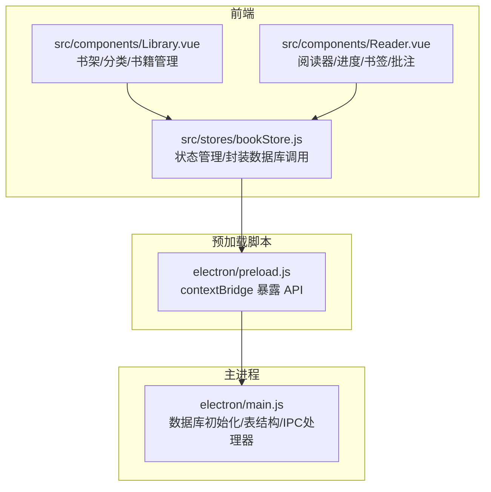
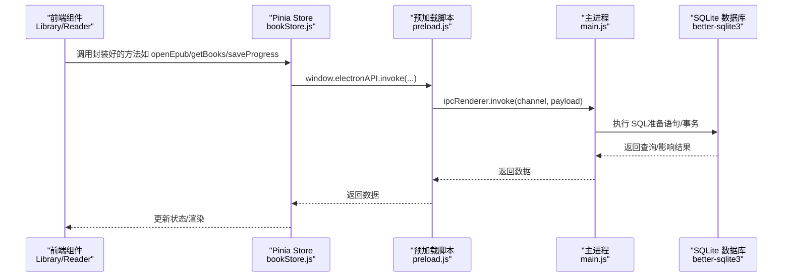
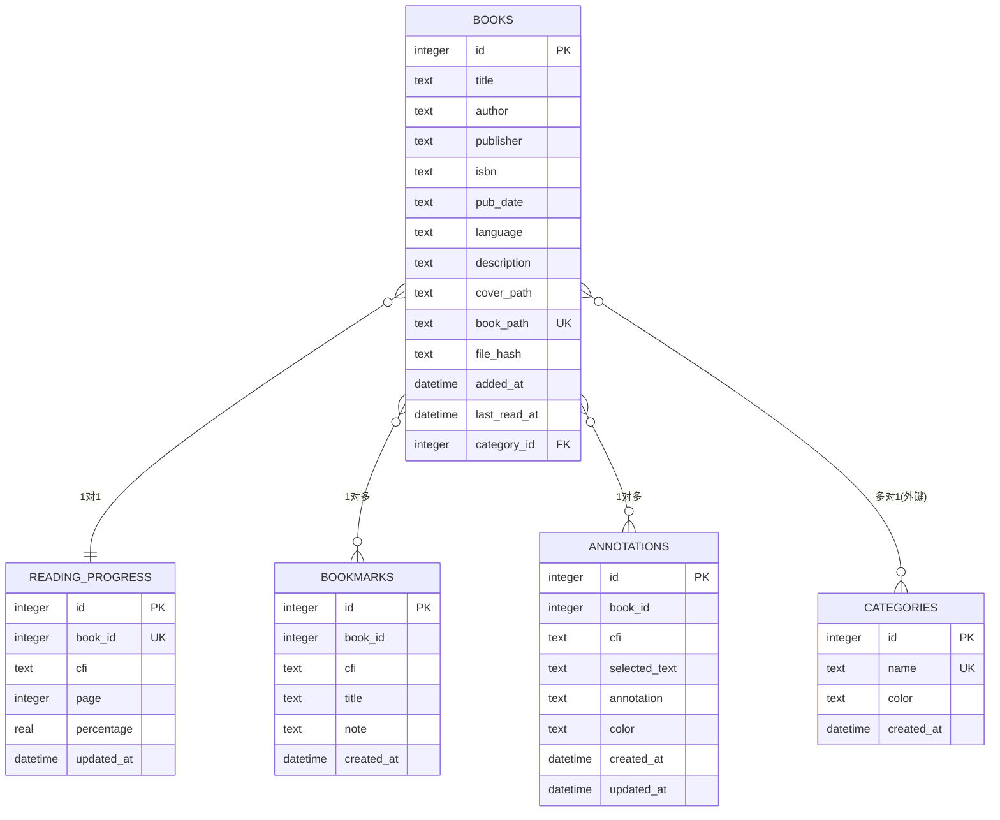
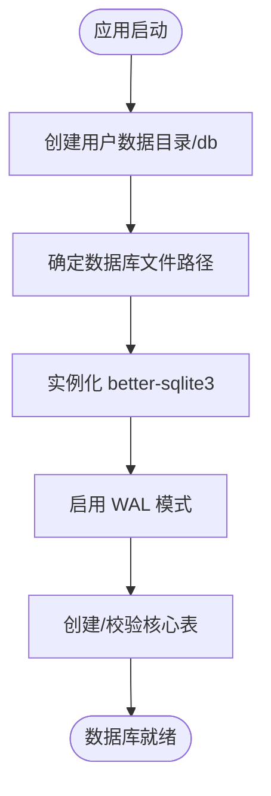
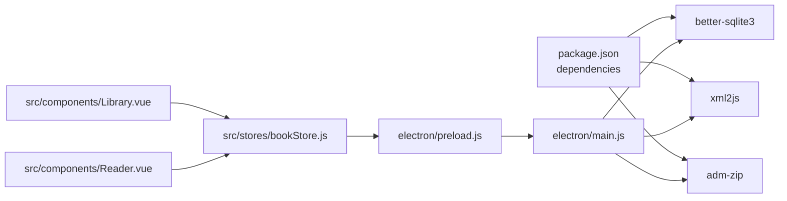

# 数据库系统

<cite>
**本文引用的文件**
- [README.md](file://README.md)
- [package.json](file://package.json)
- [electron/main.js](file://electron/main.js)
- [electron/preload.js](file://electron/preload.js)
- [src/stores/bookStore.js](file://src/stores/bookStore.js)
- [src/components/Library.vue](file://src/components/Library.vue)
- [src/components/Reader.vue](file://src/components/Reader.vue)
</cite>

## 目录
1. [简介](#简介)
2. [项目结构](#项目结构)
3. [核心组件](#核心组件)
4. [架构总览](#架构总览)
5. [详细组件分析](#详细组件分析)
6. [依赖关系分析](#依赖关系分析)
7. [性能考虑](#性能考虑)
8. [故障排除指南](#故障排除指南)
9. [结论](#结论)
10. [附录](#附录)

## 简介
本项目采用 SQLite 作为本地数据存储方案，结合 Electron 主进程与 better-sqlite3 原生模块实现高性能、低耦合的数据持久化能力。SQLite 的轻量、无服务器、零配置特性非常适合桌面应用场景；better-sqlite3 提供了接近原生的性能表现，适合频繁的增删改查操作。

- 项目特性中明确指出“数据持久化使用 SQLite”，并列出“better-sqlite3”为技术栈之一。
- README 中提到“数据库文件存储在用户数据目录中（Windows: %APPDATA%/epub_reader.db”。
- 项目使用 Electron + Vue 3 + better-sqlite3 + EPUB.js 的组合，数据库贯穿主进程与前端交互。

**章节来源**
- [README.md:29](file://README.md#L29)
- [README.md:39](file://README.md#L39)
- [README.md:255](file://README.md#L255)

## 项目结构
数据库相关的核心位置与职责如下：
- electron/main.js：负责数据库初始化、表结构定义、IPC 数据接口暴露
- electron/preload.js：通过 contextBridge 暴露安全的 IPC API 给渲染进程
- src/stores/bookStore.js：Pinia Store 将数据库 API 封装为前端可调用的方法
- src/components/Library.vue、Reader.vue：UI 层调用 Store，间接使用数据库 API

**图表来源**
- [electron/main.js:167-284](file://electron/main.js#L167-L284)
- [electron/preload.js:7-92](file://electron/preload.js#L7-L92)
- [src/stores/bookStore.js:1-234](file://src/stores/bookStore.js#L1-L234)
- [src/components/Library.vue:1-1291](file://src/components/Library.vue#L1-L1291)
- [src/components/Reader.vue:1-1026](file://src/components/Reader.vue#L1-L1026)

**章节来源**
- [electron/main.js:167-284](file://electron/main.js#L167-L284)
- [electron/preload.js:7-92](file://electron/preload.js#L7-L92)
- [src/stores/bookStore.js:1-234](file://src/stores/bookStore.js#L1-L234)
- [src/components/Library.vue:1-1291](file://src/components/Library.vue#L1-L1291)
- [src/components/Reader.vue:1-1026](file://src/components/Reader.vue#L1-L1026)

## 核心组件
- 数据库初始化与表结构
  - 初始化位置：主进程创建数据库实例、启用 WAL、创建核心表
  - 核心表：books、reading_progress、bookmarks、annotations、categories
  - 迁移兼容：动态检查并添加新增字段（如 file_hash、category_id）

- IPC 数据接口
  - 主进程通过 ipcMain.handle 暴露数据库相关 API，涵盖书籍、分类、进度、书签、批注、导入导出等
  - 预加载脚本通过 contextBridge.exposeInMainWorld 暴露 window.electronAPI 给前端

- 前端封装
  - Pinia Store 将 IPC 调用封装为易用方法，统一错误处理与状态同步

**章节来源**
- [electron/main.js:167-284](file://electron/main.js#L167-L284)
- [electron/main.js:343-820](file://electron/main.js#L343-L820)
- [electron/preload.js:7-92](file://electron/preload.js#L7-L92)
- [src/stores/bookStore.js:1-234](file://src/stores/bookStore.js#L1-L234)

## 架构总览
数据库层在 Electron 架构中的定位如下：

**图表来源**
- [electron/preload.js:7-92](file://electron/preload.js#L7-L92)
- [electron/main.js:343-820](file://electron/main.js#L343-L820)
- [src/stores/bookStore.js:1-234](file://src/stores/bookStore.js#L1-L234)

## 详细组件分析

### 数据库初始化与表结构
- 初始化流程
  - 主进程启动时创建用户数据目录下的 db 子目录与数据库文件
  - 实例化 better-sqlite3 并启用 WAL 模式提升并发读写性能
  - 依次创建 books、reading_progress、bookmarks、annotations、categories 表
  - 动态迁移：检查并添加 file_hash、category_id 等字段，保证向后兼容

- 表结构要点
  - books：存储书籍元数据与路径、哈希、分类等
  - reading_progress：按 book_id 唯一存储阅读进度（CFI、页码、百分比）
  - bookmarks：按书籍存储书签（CFI、标题、备注）
  - annotations：按书籍存储批注（选中文本、批注内容、颜色）
  - categories：书籍分类（名称、颜色、时间戳）

**图表来源**
- [electron/main.js:190-281](file://electron/main.js#L190-L281)

**章节来源**
- [electron/main.js:167-284](file://electron/main.js#L167-L284)
- [electron/main.js:190-281](file://electron/main.js#L190-L281)

### better-sqlite3 集成与性能优化
- 集成方式
  - 主进程直接引入 better-sqlite3，创建数据库实例并执行 PRAGMA/journal_mode=WAL
  - 使用 prepare/ run/run 等 API 进行 SQL 操作，避免字符串拼接注入风险

- 性能优化策略
  - WAL 模式：提升并发读写吞吐，减少锁竞争
  - 预编译语句：prepare + run/retrieve，重复执行更高效
  - 内置事务：主进程内通过单条语句或批量操作实现原子性（如 ON CONFLICT）
  - 文件哈希去重：插入书籍时基于 file_hash 去重，避免重复入库

**章节来源**
- [electron/main.js:182-187](file://electron/main.js#L182-L187)
- [electron/main.js:378-394](file://electron/main.js#L378-L394)

### 数据库初始化流程与连接管理
- 初始化流程
  - 创建用户数据目录/db
  - 实例化数据库并启用 WAL
  - 创建/校验核心表与字段
  - 记录日志便于排障

- 连接管理
  - 单实例：主进程全局 db 变量，生命周期与应用一致
  - 文件路径：用户数据目录，跨平台兼容
  - 日志：关键节点打印初始化状态

**图表来源**
- [electron/main.js:167-284](file://electron/main.js#L167-L284)

**章节来源**
- [electron/main.js:167-284](file://electron/main.js#L167-L284)

### 事务处理机制
- 主进程内使用单条 SQL 的原子性（如 UPSERT 使用 ON CONFLICT）
- 删除书籍时依赖外键级联删除（CASCADE），自动清理进度/书签/批注
- 前端 Store 统一通过 IPC 调用，避免渲染进程直接操作数据库

**章节来源**
- [electron/main.js:634-653](file://electron/main.js#L634-L653)
- [electron/main.js:696-708](file://electron/main.js#L696-L708)
- [electron/main.js:229](file://electron/main.js#L229)

### 数据持久化策略、备份与迁移
- 持久化策略
  - 书籍元数据、封面、EPUB 文件均复制到用户数据目录，数据库仅存索引与元信息
  - 阅读进度、书签、批注实时写入数据库，保障断电不丢失

- 备份与恢复
  - 数据库文件位于用户数据目录，可直接复制数据库文件进行备份
  - 恢复时将备份文件替换为当前数据库文件（需先关闭应用）

- 迁移方案
  - 启动时动态检查表结构，按需添加缺失字段（如 file_hash、category_id）
  - 通过 ALTER TABLE 与 PRAGMA table_info 实现平滑升级

**章节来源**
- [README.md:255](file://README.md#L255)
- [electron/main.js:210-219](file://electron/main.js#L210-L219)
- [electron/main.js:274-281](file://electron/main.js#L274-L281)

### 数据操作 API 一览
以下为常用数据库相关 IPC API（通道名）与用途概览（路径参考）：
- 打开 EPUB 并入库：open-epub
  - [electron/main.js:343-427](file://electron/main.js#L343-L427)
- 获取书籍列表：get-books
  - [electron/main.js:429-449](file://electron/main.js#L429-L449)
- 获取分类：get-categories
  - [electron/main.js:451-460](file://electron/main.js#L451-L460)
- 新增/删除分类：add-category/delete-category
  - [electron/main.js:462-482](file://electron/main.js#L462-L482)
- 更新书籍分类：update-book-category
  - [electron/main.js:484-493](file://electron/main.js#L484-L493)
- 导出书籍：export-book
  - [electron/main.js:495-531](file://electron/main.js#L495-L531)
- 导出笔记（书签+批注）：export-notes
  - [electron/main.js:533-592](file://electron/main.js#L533-L592)
- 彻底删除书籍（含文件与数据库）：delete-book-completely
  - [electron/main.js:594-632](file://electron/main.js#L594-L632)
- 保存/获取阅读进度：save-progress/get-progress
  - [electron/main.js:634-663](file://electron/main.js#L634-L663)
- 书签 CRUD：add-bookmark/get-bookmarks/delete-bookmark
  - [electron/main.js:665-694](file://electron/main.js#L665-L694)
- 批注 CRUD：save-annotation/get-annotations/delete-annotation
  - [electron/main.js:710-760](file://electron/main.js#L710-L760)
- 获取应用路径/用户数据路径：get-app-path/get-user-data-path
  - [electron/main.js:762-769](file://electron/main.js#L762-L769)

前端 Store 封装调用示例（路径参考）：
- Library.vue 调用 openEpub/loadBooks 等
  - [src/components/Library.vue:365-400](file://src/components/Library.vue#L365-L400)
- Reader.vue 调用 saveProgress/loadBookmarks/loadAnnotations 等
  - [src/components/Reader.vue:497-527](file://src/components/Reader.vue#L497-L527)
- bookStore.js 统一封装 IPC 调用
  - [src/stores/bookStore.js:12-234](file://src/stores/bookStore.js#L12-L234)

**章节来源**
- [electron/main.js:343-820](file://electron/main.js#L343-L820)
- [src/stores/bookStore.js:12-234](file://src/stores/bookStore.js#L12-L234)
- [src/components/Library.vue:365-400](file://src/components/Library.vue#L365-L400)
- [src/components/Reader.vue:497-527](file://src/components/Reader.vue#L497-L527)

## 依赖关系分析
- 外部依赖
  - better-sqlite3：提供高性能 SQLite 原生支持
  - xml2js/adm-zip：用于解析 EPUB 元数据与封面
- 内部依赖
  - electron/main.js 依赖 better-sqlite3 与 Node FS
  - preload.js 依赖 Electron contextBridge/ipcRenderer
  - bookStore.js 依赖 window.electronAPI
  - Library/Reader 组件依赖 bookStore

**图表来源**
- [package.json:22-28](file://package.json#L22-L28)
- [electron/main.js:1-8](file://electron/main.js#L1-L8)
- [electron/preload.js:1](file://electron/preload.js#L1)

**章节来源**
- [package.json:22-28](file://package.json#L22-L28)
- [electron/main.js:1-8](file://electron/main.js#L1-L8)
- [electron/preload.js:1](file://electron/preload.js#L1)

## 性能考虑
- WAL 模式：已在初始化时启用，显著提升并发读写性能
- 预编译语句：prepare + run/retrieve，避免重复解析 SQL
- 去重与哈希：插入书籍时基于 file_hash 去重，减少无效写入
- 外键级联：删除书籍时自动清理相关进度/书签/批注，避免碎片数据
- 前端异步：Store 统一异步调用，避免阻塞 UI

[本节为通用性能建议，无需特定文件引用]

## 故障排除指南
- better-sqlite3 编译失败
  - 现象：安装阶段报错
  - 原因：Visual Studio 版本不匹配
  - 解决：安装 VS 2022 Build Tools，确保环境变量与脚本配置正确
  - 参考：README 常见问题章节

- 打包失败：无法下载 Electron
  - 现象：打包阶段超时或失败
  - 原因：网络访问受限
  - 解决：使用内置镜像配置或改善网络

- 安装后无法打开
  - 现象：安装后启动异常
  - 可能原因：数据库路径配置错误、文件权限不足
  - 解决：检查用户数据目录写入权限，查看控制台日志定位错误

- 数据库文件损坏或路径异常
  - 现象：应用启动失败或数据丢失
  - 处理：备份用户数据目录中的数据库文件，替换为可用备份

**章节来源**
- [README.md:389-418](file://README.md#L389-L418)

## 结论
本项目的数据库系统以 SQLite 为核心，借助 better-sqlite3 实现高性能、低耦合的数据持久化。通过主进程集中管理数据库、预加载脚本暴露安全 API、前端 Store 封装调用的方式，形成清晰的分层架构。WAL 模式、预编译语句、外键级联与动态迁移等策略共同保障了系统的稳定性与可维护性。

[本节为总结，无需特定文件引用]

## 附录
- 数据库文件位置（用户数据目录）
  - Windows：%APPDATA%/epub_reader.db
  - 参考：README 用户提示

**章节来源**
- [README.md:255](file://README.md#L255)