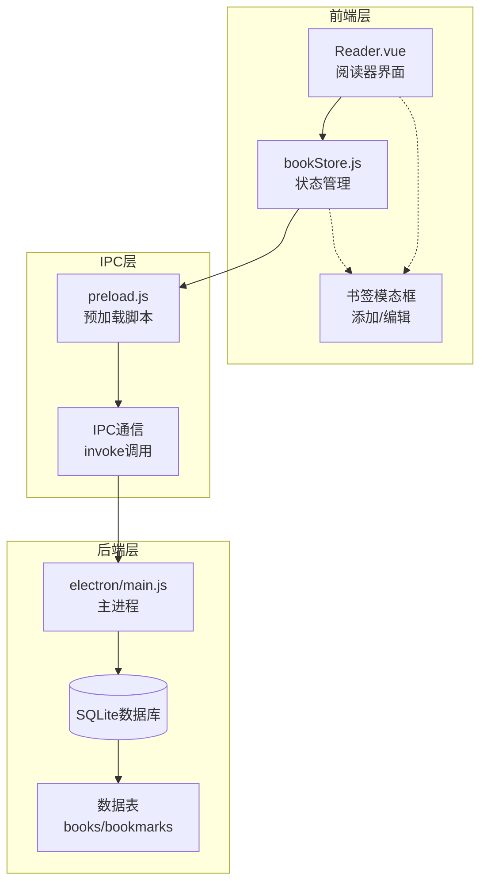
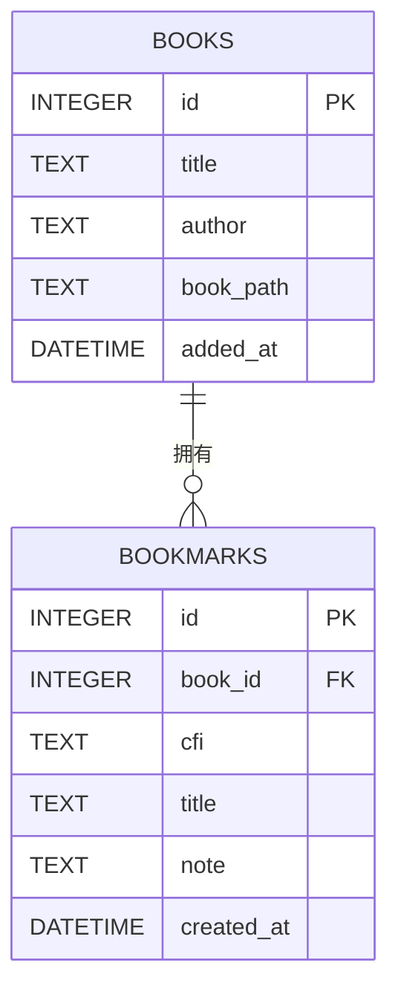
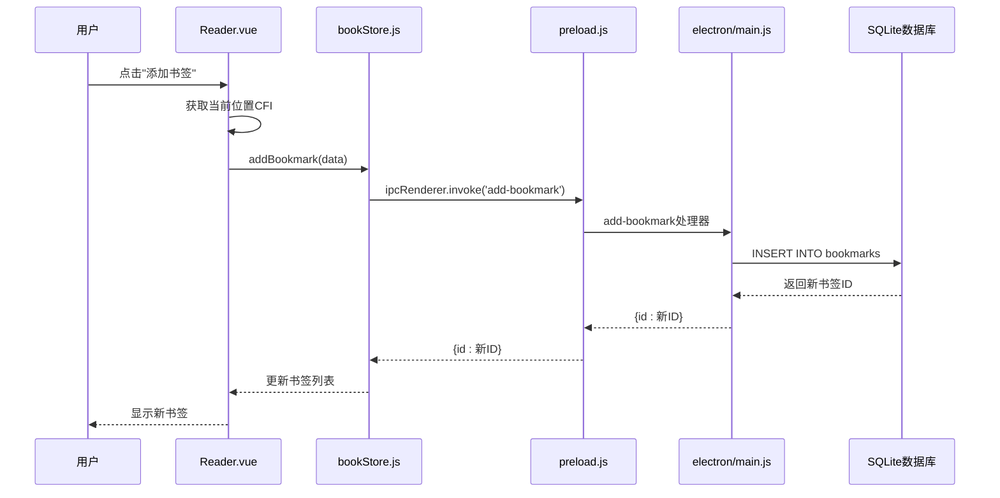
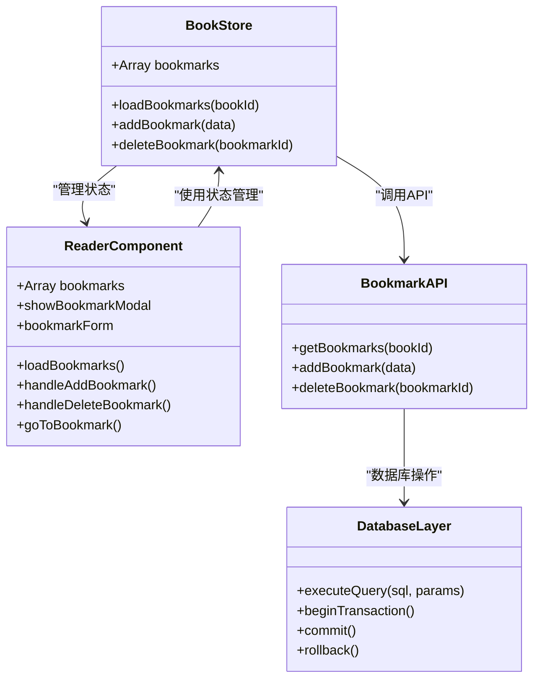
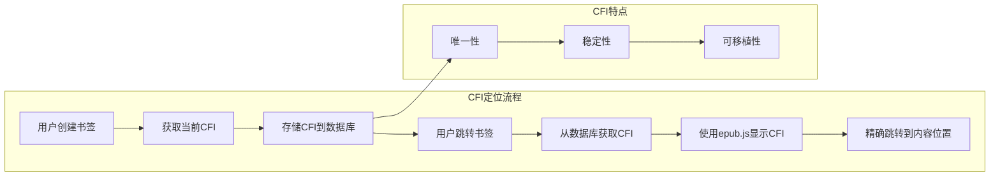
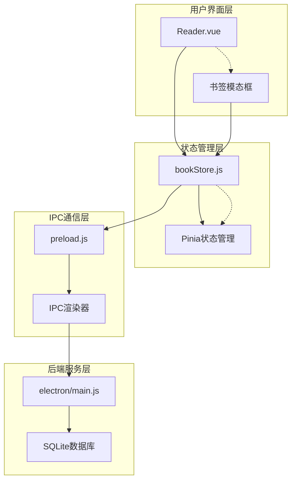

# 书签表(bookmarks)

<cite>
**本文档引用的文件**
- [electron/main.js](file://electron/main.js)
- [src/components/Reader.vue](file://src/components/Reader.vue)
- [src/stores/bookStore.js](file://src/stores/bookStore.js)
- [electron/preload.js](file://electron/preload.js)
- [README.md](file://README.md)
</cite>

## 目录
1. [简介](#简介)
2. [项目结构](#项目结构)
3. [核心组件](#核心组件)
4. [架构概览](#架构概览)
5. [详细组件分析](#详细组件分析)
6. [依赖关系分析](#依赖关系分析)
7. [性能考虑](#性能考虑)
8. [故障排除指南](#故障排除指南)
9. [结论](#结论)

## 简介

ROSAA电子书阅读器的书签系统是EPUB阅读体验的重要组成部分，它允许用户在阅读过程中创建、管理和跳转到特定的内容位置。该系统基于EPUB标准的CFI（EPUB Canonical Fragment Identifier）定位机制，确保书签能够精确定位到EPUB内容的特定位置。

书签表作为数据库的核心组成部分，采用了SQLite作为数据存储引擎，通过外键约束确保数据完整性，并支持复杂的查询和管理操作。系统设计充分考虑了用户体验和数据持久化的需求。

## 项目结构

ROSAA电子书阅读器采用前后端分离的架构设计，书签功能涉及多个层次的组件协作：



**图表来源**
- [src/components/Reader.vue:1-160](file://src/components/Reader.vue#L1-L160)
- [src/stores/bookStore.js:1-234](file://src/stores/bookStore.js#L1-L234)
- [electron/preload.js:1-104](file://electron/preload.js#L1-L104)
- [electron/main.js:167-284](file://electron/main.js#L167-L284)

**章节来源**
- [README.md:167-193](file://README.md#L167-L193)
- [src/components/Reader.vue:1-200](file://src/components/Reader.vue#L1-L200)

## 核心组件

### 数据库表结构

书签表采用标准化的关系型数据库设计，确保数据的一致性和完整性：

| 字段名 | 数据类型 | 约束条件 | 描述 |
|--------|----------|----------|------|
| id | INTEGER | PRIMARY KEY, AUTOINCREMENT | 主键标识符，自增序列 |
| book_id | INTEGER | NOT NULL, FOREIGN KEY | 外键引用books表，关联具体书籍 |
| cfi | TEXT | NOT NULL | EPUB CFI定位符，精确定位内容位置 |
| title | TEXT | NULL | 书签标题，用户自定义名称 |
| note | TEXT | NULL | 备注信息，用户添加的描述性文本 |
| created_at | DATETIME | DEFAULT CURRENT_TIMESTAMP | 创建时间戳，自动记录创建时间 |

### 外键约束设计



**图表来源**
- [electron/main.js:191-205](file://electron/main.js#L191-L205)
- [electron/main.js:235-244](file://electron/main.js#L235-L244)

**章节来源**
- [electron/main.js:235-244](file://electron/main.js#L235-L244)

## 架构概览

书签系统的整体架构体现了清晰的分层设计和职责分离：



**图表来源**
- [src/components/Reader.vue:628-641](file://src/components/Reader.vue#L628-L641)
- [src/stores/bookStore.js:186-195](file://src/stores/bookStore.js#L186-L195)
- [electron/preload.js:24-27](file://electron/preload.js#L24-L27)
- [electron/main.js:665-674](file://electron/main.js#L665-L674)

## 详细组件分析

### 书签创建流程

书签创建过程涉及多个组件的协同工作，确保用户能够直观地创建和管理书签：

```mermaid
flowchart TD
Start([用户点击"添加书签"]) --> CheckLocation{"检查当前位置"}
CheckLocation --> |有效| GetCFI["获取当前CFI定位符"]
CheckLocation --> |无效| ShowError["显示错误提示"]
GetCFI --> OpenModal["打开书签模态框"]
OpenModal --> UserInput["用户输入标题和备注"]
UserInput --> ValidateInput{"验证输入"}
ValidateInput --> |无效| ShowValidation["显示验证错误"]
ValidateInput --> |有效| CallStore["调用bookStore.addBookmark"]
CallStore --> IPCInvoke["IPC调用electronAPI.addBookmark"]
IPCInvoke --> DBInsert["数据库插入操作"]
DBInsert --> RefreshList["刷新书签列表"]
RefreshList --> ShowSuccess["显示成功消息"]
ShowError --> End([结束])
ShowValidation --> End
ShowSuccess --> End
```

**图表来源**
- [src/components/Reader.vue:628-641](file://src/components/Reader.vue#L628-L641)
- [src/stores/bookStore.js:186-195](file://src/stores/bookStore.js#L186-L195)
- [electron/main.js:665-674](file://electron/main.js#L665-L674)

### 书签查询和管理

书签的查询和管理功能提供了完整的生命周期管理：



**图表来源**
- [src/stores/bookStore.js:178-206](file://src/stores/bookStore.js#L178-L206)
- [src/components/Reader.vue:509-648](file://src/components/Reader.vue#L509-L648)
- [electron/main.js:676-694](file://electron/main.js#L676-L694)

**章节来源**
- [src/stores/bookStore.js:178-206](file://src/stores/bookStore.js#L178-L206)
- [src/components/Reader.vue:509-648](file://src/components/Reader.vue#L509-L648)

### EPUB CFI定位机制

CFI（EPUB Canonical Fragment Identifier）是EPUB标准的核心技术，用于精确定位内容位置：



**图表来源**
- [src/components/Reader.vue:601-603](file://src/components/Reader.vue#L601-L603)
- [src/components/Reader.vue:628-641](file://src/components/Reader.vue#L628-L641)

**章节来源**
- [src/components/Reader.vue:601-603](file://src/components/Reader.vue#L601-L603)
- [src/components/Reader.vue:628-641](file://src/components/Reader.vue#L628-L641)

## 依赖关系分析

书签系统各组件之间的依赖关系体现了清晰的架构设计：



**图表来源**
- [src/components/Reader.vue:1-200](file://src/components/Reader.vue#L1-L200)
- [src/stores/bookStore.js:1-234](file://src/stores/bookStore.js#L1-L234)
- [electron/preload.js:1-104](file://electron/preload.js#L1-L104)
- [electron/main.js:1-922](file://electron/main.js#L1-L922)

**章节来源**
- [src/components/Reader.vue:1-200](file://src/components/Reader.vue#L1-L200)
- [src/stores/bookStore.js:1-234](file://src/stores/bookStore.js#L1-L234)

## 性能考虑

书签系统的性能优化主要体现在以下几个方面：

### 数据库性能优化
- **索引策略**：为book_id字段建立索引，优化查询性能
- **事务处理**：批量操作时使用事务，确保数据一致性
- **连接池管理**：合理管理数据库连接，避免资源泄漏

### 前端性能优化
- **懒加载**：书签列表按需加载，减少初始渲染负担
- **虚拟滚动**：大量书签时使用虚拟滚动技术
- **缓存机制**：缓存常用的书签数据，减少重复查询

### IPC通信优化
- **异步处理**：所有数据库操作都是异步的，避免阻塞UI线程
- **错误处理**：完善的错误处理机制，防止异常传播
- **资源清理**：及时清理不再使用的资源和监听器

## 故障排除指南

### 常见问题及解决方案

#### 书签无法创建
**问题症状**：点击"添加书签"按钮无响应
**可能原因**：
1. 当前位置CFI获取失败
2. IPC通信异常
3. 数据库连接问题

**解决步骤**：
1. 检查阅读器是否正确加载EPUB文件
2. 验证IPC通信是否正常工作
3. 查看控制台错误日志

#### 书签无法跳转
**问题症状**：点击书签后无法跳转到指定位置
**可能原因**：
1. CFI定位符失效
2. EPUB文件损坏
3. 阅读模式不兼容

**解决步骤**：
1. 重新创建书签
2. 检查EPUB文件完整性
3. 尝试不同的阅读模式

#### 书签数据丢失
**问题症状**：重启应用后书签消失
**可能原因**：
1. 数据库文件损坏
2. 存储路径配置错误
3. 权限问题

**解决步骤**：
1. 检查数据库文件是否存在
2. 验证用户数据目录权限
3. 重新导入EPUB文件

**章节来源**
- [electron/main.js:665-694](file://electron/main.js#L665-L694)
- [src/stores/bookStore.js:186-206](file://src/stores/bookStore.js#L186-L206)

## 结论

ROSAA电子书阅读器的书签系统展现了现代桌面应用的最佳实践，通过精心设计的数据库结构、清晰的架构分层和完善的错误处理机制，为用户提供了可靠的书签管理体验。

系统的核心优势包括：
- **精确的定位机制**：基于EPUB标准的CFI技术，确保书签的精确定位
- **完整的生命周期管理**：从创建到删除的完整流程支持
- **良好的用户体验**：直观的界面设计和流畅的操作体验
- **可靠的数据持久化**：基于SQLite的稳定数据存储方案

未来可以考虑的功能增强包括：
- 书签分组和分类管理
- 书签搜索和过滤功能
- 云端同步支持
- 书签导出和导入功能