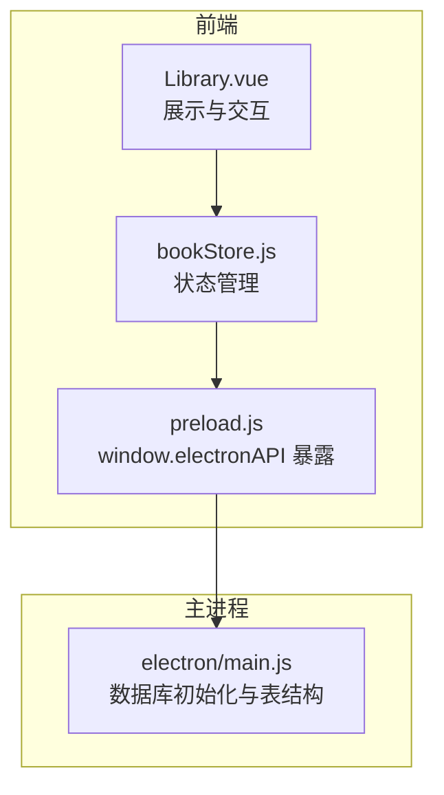
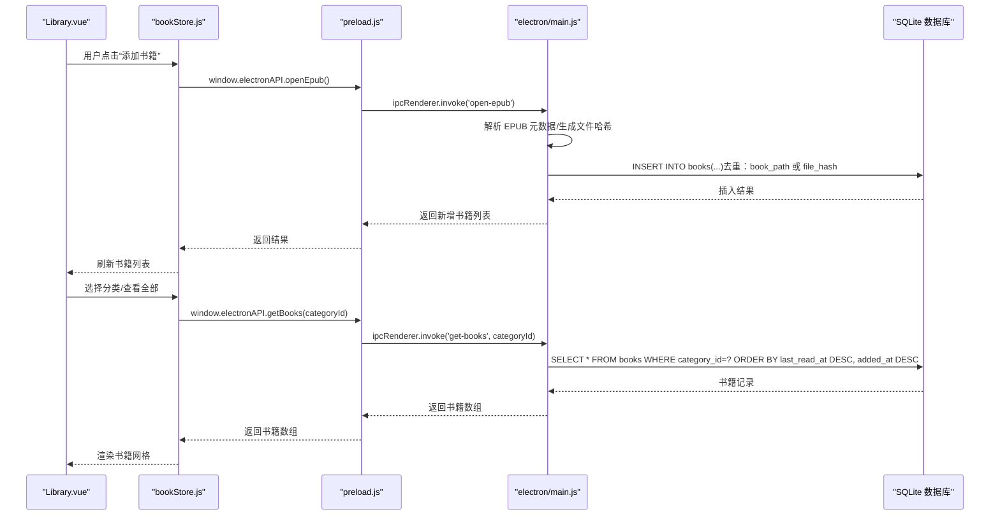
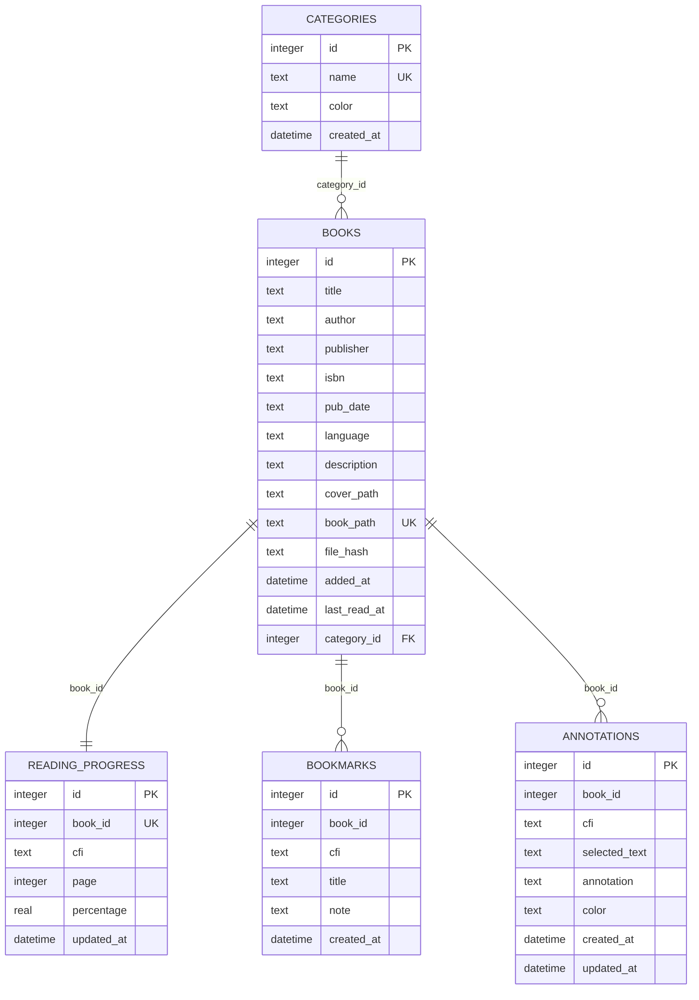

# 书籍表(books)

<cite>
**本文引用的文件**
- [electron/main.js](file://electron/main.js)
- [electron/preload.js](file://electron/preload.js)
- [src/stores/bookStore.js](file://src/stores/bookStore.js)
- [src/components/Library.vue](file://src/components/Library.vue)
- [README.md](file://README.md)
</cite>

## 目录
1. [简介](#简介)
2. [项目结构](#项目结构)
3. [核心组件](#核心组件)
4. [架构总览](#架构总览)
5. [详细组件分析](#详细组件分析)
6. [依赖分析](#依赖分析)
7. [性能考虑](#性能考虑)
8. [故障排除指南](#故障排除指南)
9. [结论](#结论)
10. [附录](#附录)

## 简介
本文件面向 ROSAA 电子书阅读器的“书籍表(books)”数据库表，提供完整、可操作的表结构说明。内容涵盖：
- 字段定义与数据类型、约束与默认值
- 主键自增机制与唯一性约束
- 外键关系设计（category_id → categories.id）
- 完整的 CREATE TABLE 语句与字段级说明
- 数据验证规则与业务约束
- 与前端状态管理、IPC 交互的关系映射

## 项目结构
书籍表属于 Electron 主进程侧 SQLite 数据库存储的一部分，由主进程在应用启动时初始化。前端通过 preload 暴露的 API 与主进程通信，实现书籍的增删改查与分类关联。



图表来源
- [electron/main.js:180-284](file://electron/main.js#L180-L284)
- [electron/preload.js:7-101](file://electron/preload.js#L7-L101)
- [src/stores/bookStore.js:1-234](file://src/stores/bookStore.js#L1-L234)
- [src/components/Library.vue:174-386](file://src/components/Library.vue#L174-L386)

章节来源
- [electron/main.js:180-284](file://electron/main.js#L180-L284)
- [electron/preload.js:7-101](file://electron/preload.js#L7-L101)
- [src/stores/bookStore.js:1-234](file://src/stores/bookStore.js#L1-L234)
- [src/components/Library.vue:174-386](file://src/components/Library.vue#L174-L386)

## 核心组件
- 书籍表(books)：存储书籍元数据、路径、哈希、时间戳与分类关联
- 分类表(categories)：存储分类信息，与书籍表通过 category_id 建立外键关系
- 前端状态与 IPC：通过 preload 暴露的 API 实现书籍查询、分类分配、删除等操作

章节来源
- [electron/main.js:189-206](file://electron/main.js#L189-L206)
- [electron/main.js:263-271](file://electron/main.js#L263-L271)
- [electron/preload.js:7-101](file://electron/preload.js#L7-L101)

## 架构总览
书籍表的创建与维护由主进程负责，前端通过 IPC 与之交互。下图展示了从“添加书籍”到“查询书籍”的典型流程。



图表来源
- [electron/main.js:343-427](file://electron/main.js#L343-L427)
- [electron/main.js:429-449](file://electron/main.js#L429-L449)
- [electron/preload.js:7-15](file://electron/preload.js#L7-L15)
- [src/stores/bookStore.js:12-22](file://src/stores/bookStore.js#L12-L22)

## 详细组件分析

### 书籍表(books)字段定义与约束
- id
  - 类型：INTEGER
  - 约束：PRIMARY KEY, AUTOINCREMENT
  - 说明：主键，自增
- title
  - 类型：TEXT
  - 约束：NOT NULL
  - 说明：书籍标题
- author
  - 类型：TEXT
  - 约束：NULL（允许为空）
  - 说明：作者
- publisher
  - 类型：TEXT
  - 约束：NULL（允许为空）
  - 说明：出版社
- isbn
  - 类型：TEXT
  - 约束：NULL（允许为空）
  - 说明：国际标准书号
- pub_date
  - 类型：TEXT
  - 约束：NULL（允许为空）
  - 说明：出版日期（字符串格式）
- language
  - 类型：TEXT
  - 约束：NULL（允许为空）
  - 说明：语言
- description
  - 类型：TEXT
  - 约束：NULL（允许为空）
  - 说明：描述
- cover_path
  - 类型：TEXT
  - 约束：NULL（允许为空）
  - 说明：封面图片相对路径
- book_path
  - 类型：TEXT
  - 约束：UNIQUE, NOT NULL
  - 说明：EPUB 文件绝对路径（唯一性用于去重）
- file_hash
  - 类型：TEXT
  - 约束：NULL（允许为空）
  - 说明：文件哈希（用于二次去重）
- added_at
  - 类型：DATETIME
  - 约束：DEFAULT CURRENT_TIMESTAMP
  - 说明：添加时间（自动记录）
- last_read_at
  - 类型：DATETIME
  - 约束：NULL（允许为空）
  - 说明：最后阅读时间（用于排序）
- category_id
  - 类型：INTEGER
  - 约束：REFERENCES categories(id) ON DELETE SET NULL
  - 说明：所属分类；删除分类时将该字段设为 NULL

章节来源
- [electron/main.js:191-205](file://electron/main.js#L191-L205)
- [electron/main.js:274-281](file://electron/main.js#L274-L281)

### 外键关系设计
- books.category_id → categories.id
- 删除策略：ON DELETE SET NULL（删除分类时不会级联删除书籍，仅清空分类引用）

章节来源
- [electron/main.js:276](file://electron/main.js#L276)

### 主键自增与唯一性
- 主键自增：id 使用 AUTOINCREMENT
- 唯一性：book_path 唯一，用于防止重复添加相同路径的书籍
- file_hash 列在初始化时按需添加，用于进一步去重

章节来源
- [electron/main.js:192](file://electron/main.js#L192)
- [electron/main.js:201](file://electron/main.js#L201)
- [electron/main.js:210-219](file://electron/main.js#L210-L219)

### 数据验证规则与业务约束
- 去重策略
  - 插入前先按 book_path 或 file_hash 查询是否存在
  - 若存在则跳过插入
- 分类分配
  - 通过 UPDATE books SET category_id=? WHERE id=? 实现
  - 支持将书籍移出分类（category_id 设为 NULL）
- 排序规则
  - 查询时按 last_read_at 降序优先，其次 added_at 降序

章节来源
- [electron/main.js:367](file://electron/main.js#L367)
- [electron/main.js:487](file://electron/main.js#L487)
- [electron/main.js:439](file://electron/main.js#L439)

### 完整 CREATE TABLE 语句
以下为书籍表的完整建表语句（与代码一致）：
```sql
CREATE TABLE IF NOT EXISTS books (
  id INTEGER PRIMARY KEY AUTOINCREMENT,
  title TEXT NOT NULL,
  author TEXT,
  publisher TEXT,
  isbn TEXT,
  pub_date TEXT,
  language TEXT,
  description TEXT,
  cover_path TEXT,
  book_path TEXT UNIQUE NOT NULL,
  file_hash TEXT,
  added_at DATETIME DEFAULT CURRENT_TIMESTAMP,
  last_read_at DATETIME,
  category_id INTEGER REFERENCES categories(id) ON DELETE SET NULL
)
```

章节来源
- [electron/main.js:190-206](file://electron/main.js#L190-L206)
- [electron/main.js:274-281](file://electron/main.js#L274-L281)

### 字段级详细说明与用途映射
- id：主键，用于关联阅读进度、书签、批注等子表
- title/author/publisher/isbn/pub_date/language/description：书籍元数据，用于展示与搜索
- cover_path：封面路径，前端用于显示缩略图
- book_path：EPUB 文件路径，唯一约束，作为去重依据之一
- file_hash：文件哈希，作为去重依据之二，便于跨设备或重命名场景识别
- added_at：添加时间，默认当前时间，用于排序
- last_read_at：最后阅读时间，用于“最近阅读”排序
- category_id：分类外键，支持书籍归类与筛选

章节来源
- [electron/main.js:191-205](file://electron/main.js#L191-L205)
- [src/components/Library.vue:206-219](file://src/components/Library.vue#L206-L219)

### 与前端状态与 IPC 的关系
- 前端通过 window.electronAPI.getBooks(categoryId) 查询书籍
- 通过 window.electronAPI.updateBookCategory(bookId, categoryId) 分配分类
- 通过 window.electronAPI.deleteBook(bookId) 删除书籍
- 书籍列表按 last_read_at 与 added_at 排序，前端据此渲染

章节来源
- [electron/preload.js:12-15](file://electron/preload.js#L12-L15)
- [electron/preload.js:52-55](file://electron/preload.js#L52-L55)
- [electron/preload.js:36-39](file://electron/preload.js#L36-L39)
- [electron/main.js:429-449](file://electron/main.js#L429-L449)
- [src/stores/bookStore.js:12-22](file://src/stores/bookStore.js#L12-L22)

## 依赖分析
书籍表与其他表的依赖关系如下：
- books.category_id → categories.id（外键，删除时 SET NULL）
- reading_progress.book_id → books.id（外键，删除时 CASCADE）
- bookmarks.book_id → books.id（外键，删除时 CASCADE）
- annotations.book_id → books.id（外键，删除时 CASCADE）



图表来源
- [electron/main.js:190-206](file://electron/main.js#L190-L206)
- [electron/main.js:221-261](file://electron/main.js#L221-L261)
- [electron/main.js:263-271](file://electron/main.js#L263-L271)

章节来源
- [electron/main.js:190-206](file://electron/main.js#L190-L206)
- [electron/main.js:221-261](file://electron/main.js#L221-L261)
- [electron/main.js:263-271](file://electron/main.js#L263-L271)

## 性能考虑
- WAL 模式：启用 WAL 提升并发读写性能
- 索引建议：若频繁按 category_id 查询，可考虑在 category_id 上建立索引
- 去重策略：利用 book_path 唯一性与 file_hash 双重去重，减少重复插入成本
- 排序字段：last_read_at 与 added_at 已用于排序，避免在应用层做复杂排序

章节来源
- [electron/main.js:185-187](file://electron/main.js#L185-L187)
- [electron/main.js:439](file://electron/main.js#L439)

## 故障排除指南
- 书籍重复导入
  - 现象：多次添加相同 EPUB 文件后出现重复项
  - 原因：未命中 book_path 唯一或 file_hash 去重
  - 处理：确认 book_path 与 file_hash 是否正确生成与存储
- 分类分配无效
  - 现象：分配分类后书籍仍显示在“全部”
  - 原因：category_id 未更新或查询参数错误
  - 处理：检查 IPC 调用 updateBookCategory 与 getBooks 的参数传递
- 删除书籍后关联数据丢失
  - 现象：删除书籍后阅读进度、书签、批注未清理
  - 原因：reading_progress、bookmarks、annotations 的外键删除策略为 CASCADE
  - 处理：确认外键定义与删除流程一致

章节来源
- [electron/main.js:367](file://electron/main.js#L367)
- [electron/main.js:487](file://electron/main.js#L487)
- [electron/main.js:429-449](file://electron/main.js#L429-L449)
- [electron/main.js:229](file://electron/main.js#L229)
- [electron/main.js:242](file://electron/main.js#L242)
- [electron/main.js:258](file://electron/main.js#L258)

## 结论
书籍表(books)是 ROSAA 电子书阅读器数据模型的核心，承担书籍元数据、路径、哈希、时间戳与分类关联的职责。其设计兼顾去重、排序与外键一致性，配合前端状态管理与 IPC 交互，实现了稳定的书架管理能力。后续可按需扩展索引与校验规则，进一步提升查询效率与数据完整性。

## 附录
- 数据库初始化与建表逻辑参见主进程文件
- 前端通过 preload 暴露的 API 与主进程通信
- 项目 README 中包含数据库文件存储位置与打包信息

章节来源
- [electron/main.js:180-284](file://electron/main.js#L180-L284)
- [electron/preload.js:7-101](file://electron/preload.js#L7-L101)
- [README.md:255](file://README.md#L255)