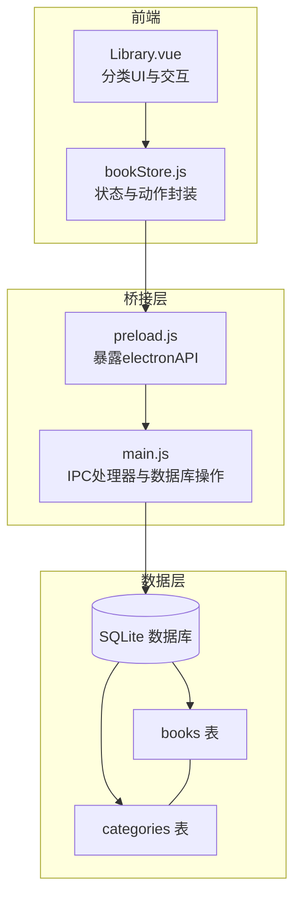
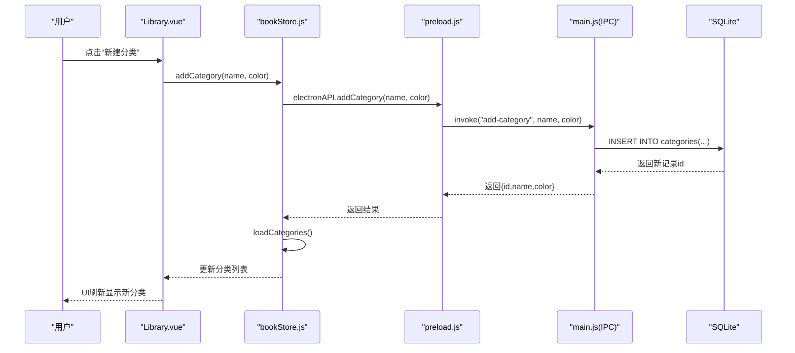
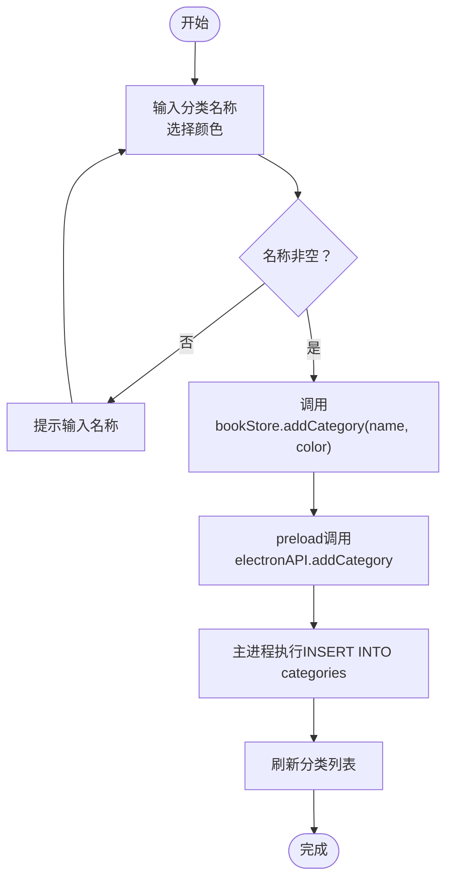
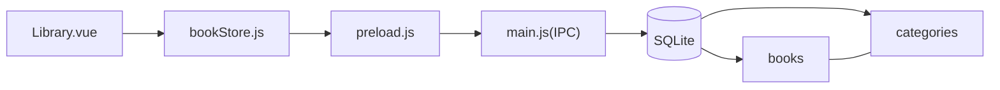

# 分类表(categories)

<cite>
**本文引用的文件**
- [electron/main.js](file://electron/main.js)
- [electron/preload.js](file://electron/preload.js)
- [src/stores/bookStore.js](file://src/stores/bookStore.js)
- [src/components/Library.vue](file://src/components/Library.vue)
</cite>

## 目录
1. [简介](#简介)
2. [项目结构](#项目结构)
3. [核心组件](#核心组件)
4. [架构总览](#架构总览)
5. [详细组件分析](#详细组件分析)
6. [依赖分析](#依赖分析)
7. [性能考虑](#性能考虑)
8. [故障排查指南](#故障排查指南)
9. [结论](#结论)
10. [附录](#附录)

## 简介
本文件面向ROSAA电子书阅读器的分类系统，聚焦于分类表(categories)的数据库结构与使用实践。文档将从字段定义、设计理念、与书籍的关联关系、颜色标识与自定义机制，到完整的DDL与CRUD操作实现进行系统化说明，并提供可视化图示帮助理解。

## 项目结构
分类功能涉及三层协作：
- 数据层：SQLite数据库中的categories表与books表的外键关联
- 后端桥接层：Electron主进程的IPC处理器，负责数据库操作
- 前端展示层：Vue组件与Pinia Store，负责用户交互与数据驱动

图表来源
- [electron/preload.js:7-101](file://electron/preload.js#L7-L101)
- [electron/main.js:451-493](file://electron/main.js#L451-L493)
- [src/stores/bookStore.js:12-135](file://src/stores/bookStore.js#L12-L135)
- [src/components/Library.vue:1-200](file://src/components/Library.vue#L1-L200)

章节来源
- [electron/main.js:263-281](file://electron/main.js#L263-L281)
- [electron/preload.js:7-101](file://electron/preload.js#L7-L101)
- [src/stores/bookStore.js:12-135](file://src/stores/bookStore.js#L12-L135)
- [src/components/Library.vue:1-200](file://src/components/Library.vue#L1-L200)

## 核心组件
- 分类表(categories)：用于组织与标识书籍的标签体系
- 书籍表(books)：新增category_id字段，建立与分类的多对一关系
- IPC处理器：提供分类的增删改查与书籍分类更新能力
- 前端Store与组件：提供分类列表渲染、新建分类、分配书籍到分类等交互

章节来源
- [electron/main.js:263-281](file://electron/main.js#L263-L281)
- [electron/main.js:451-493](file://electron/main.js#L451-L493)
- [src/stores/bookStore.js:24-61](file://src/stores/bookStore.js#L24-L61)
- [src/components/Library.vue:1-200](file://src/components/Library.vue#L1-L200)

## 架构总览
分类系统的调用链路如下：
- 前端组件触发动作（如新建分类、选择分类）
- Store封装并调用electronAPI
- preload桥接层转发到主进程IPC处理器
- 主进程执行数据库操作并返回结果
- Store更新状态，组件重新渲染

图表来源
- [src/components/Library.vue:579-594](file://src/components/Library.vue#L579-L594)
- [src/stores/bookStore.js:35-47](file://src/stores/bookStore.js#L35-L47)
- [electron/preload.js:44-55](file://electron/preload.js#L44-L55)
- [electron/main.js:463-471](file://electron/main.js#L463-L471)

## 详细组件分析

### 数据库表结构：categories
- 表名：categories
- 设计目标：为书籍提供可自定义的分组标签，支持颜色标识与唯一性约束

字段定义
- id
  - 类型：INTEGER
  - 约束：主键、自增
  - 说明：分类唯一标识
- name
  - 类型：TEXT
  - 约束：非空、唯一
  - 说明：分类名称，作为业务唯一键
- color
  - 类型：TEXT
  - 约束：默认值'#667eea'
  - 说明：分类颜色，用于界面视觉标识；支持用户自定义
- created_at
  - 类型：DATETIME
  - 约束：默认值CURRENT_TIMESTAMP
  - 说明：创建时间戳

完整性约束与默认值
- 唯一性：name字段具备唯一约束，避免重复命名
- 默认值：color默认蓝色，created_at默认当前时间

DDL参考
- 创建categories表的SQL片段路径：[electron/main.js:264-271](file://electron/main.js#L264-L271)

章节来源
- [electron/main.js:264-271](file://electron/main.js#L264-L271)

### 与书籍的关系：books.category_id
- 关系类型：多对一
  - 一个分类可包含多本书
  - 一本书只能属于一个分类（或未分类）
- 外键约束
  - books.category_id 引用 categories.id
  - 删除策略：当分类被删除时，对应书籍的category_id被置为空（SET NULL）
- 初始化增强
  - 若books表不存在category_id列，则在数据库初始化阶段自动添加

DDL参考
- 初始化时为books表添加category_id列的SQL片段路径：[electron/main.js:274-281](file://electron/main.js#L274-L281)

章节来源
- [electron/main.js:274-281](file://electron/main.js#L274-L281)

### 颜色标识系统与用户自定义
- 颜色来源
  - 前端UI直接使用categories.color渲染分类点与高亮效果
  - 预设颜色集合供用户选择
- 用户行为
  - 新建分类时可选择或自定义颜色
  - 右键菜单支持将书籍分配到指定分类或移除分类

UI与交互参考
- 分类列表渲染与颜色绑定：[src/components/Library.vue:27-43](file://src/components/Library.vue#L27-L43)
- 预设颜色集合与选择逻辑：[src/components/Library.vue:236-253](file://src/components/Library.vue#L236-L253)
- 新建分类对话框与提交：[src/components/Library.vue:225-260](file://src/components/Library.vue#L225-L260)
- 分配书籍到分类的交互：[src/components/Library.vue:286-311](file://src/components/Library.vue#L286-L311)

章节来源
- [src/components/Library.vue:27-43](file://src/components/Library.vue#L27-L43)
- [src/components/Library.vue:236-253](file://src/components/Library.vue#L236-L253)
- [src/components/Library.vue:225-260](file://src/components/Library.vue#L225-L260)
- [src/components/Library.vue:286-311](file://src/components/Library.vue#L286-L311)

### CRUD操作实现

- 查询分类
  - 前端：bookStore.loadCategories() -> preload.getCategories() -> main.get-categories
  - 后端：按创建时间升序返回所有分类
  - SQL片段路径：[electron/main.js:452-459](file://electron/main.js#L452-L459)

- 新建分类
  - 前端：bookStore.addCategory(name, color) -> preload.addCategory() -> main.add-category
  - 后端：插入name与color，返回新记录id
  - SQL片段路径：[electron/main.js:463-471](file://electron/main.js#L463-L471)

- 删除分类
  - 前端：bookStore.deleteCategory(categoryId) -> preload.deleteCategory() -> main.delete-category
  - 后端：删除指定分类；书籍category_id被置空
  - SQL片段路径：[electron/main.js:474-482](file://electron/main.js#L474-L482)

- 更新书籍分类
  - 前端：bookStore.updateBookCategory(bookId, categoryId) -> preload.updateBookCategory() -> main.update-book-category
  - 后端：将books.category_id更新为目标分类id
  - SQL片段路径：[electron/main.js:485-493](file://electron/main.js#L485-L493)

- 查询书籍（按分类筛选）
  - 前端：bookStore.loadBooks(categoryId) -> preload.getBooks(categoryId) -> main.get-books
  - 后端：若传入categoryId则WHERE子句筛选，否则返回全部书籍
  - SQL片段路径：[electron/main.js:429-449](file://electron/main.js#L429-L449)

章节来源
- [electron/main.js:452-493](file://electron/main.js#L452-L493)
- [src/stores/bookStore.js:24-61](file://src/stores/bookStore.js#L24-L61)
- [electron/preload.js:40-55](file://electron/preload.js#L40-L55)

### 前端交互流程图：新建分类

图表来源
- [src/components/Library.vue:579-594](file://src/components/Library.vue#L579-L594)
- [src/stores/bookStore.js:35-47](file://src/stores/bookStore.js#L35-L47)
- [electron/preload.js:44-55](file://electron/preload.js#L44-L55)
- [electron/main.js:463-471](file://electron/main.js#L463-L471)

## 依赖分析
- 组件耦合
  - Library.vue依赖bookStore.js的状态与动作
  - bookStore.js依赖preload.js暴露的electronAPI
  - preload.js依赖main.js的IPC处理器
- 数据依赖
  - books.category_id依赖categories.id
  - 删除分类时采用SET NULL策略，避免级联删除书籍数据

图表来源
- [src/components/Library.vue:1-200](file://src/components/Library.vue#L1-L200)
- [src/stores/bookStore.js:12-135](file://src/stores/bookStore.js#L12-L135)
- [electron/preload.js:7-101](file://electron/preload.js#L7-L101)
- [electron/main.js:274-281](file://electron/main.js#L274-L281)

章节来源
- [src/components/Library.vue:1-200](file://src/components/Library.vue#L1-L200)
- [src/stores/bookStore.js:12-135](file://src/stores/bookStore.js#L12-L135)
- [electron/preload.js:7-101](file://electron/preload.js#L7-L101)
- [electron/main.js:274-281](file://electron/main.js#L274-L281)

## 性能考虑
- 查询优化
  - 分类列表按创建时间升序，适合小规模分类场景
  - 书籍按最近阅读与添加时间排序，结合categoryId筛选可减少扫描范围
- 约束与索引
  - name唯一约束保证分类名称一致性，避免重复
  - books.category_id外键便于快速关联，建议在高频筛选场景下关注该列的统计信息
- 前端渲染
  - 分类与书籍列表均采用响应式状态，组件按需更新，避免全量重绘

## 故障排查指南
- 新建分类失败
  - 可能原因：分类名称重复（违反唯一约束）
  - 前端提示：弹窗提示“可能该分类已存在”
  - 参考路径：[src/components/Library.vue:586-594](file://src/components/Library.vue#L586-L594)
- 删除分类后书籍未归档
  - 正常行为：删除分类时，书籍category_id被置空（未分类）
  - 参考路径：[electron/main.js:276](file://electron/main.js#L276)
- 书籍无法按分类筛选
  - 检查：是否正确传递categoryId参数
  - 参考路径：[electron/main.js:429-449](file://electron/main.js#L429-L449)
- 颜色不生效
  - 检查：categories.color是否为空或非法值，前端有默认颜色兜底
  - 参考路径：[src/components/Library.vue:33](file://src/components/Library.vue#L33)

章节来源
- [src/components/Library.vue:586-594](file://src/components/Library.vue#L586-L594)
- [electron/main.js:276](file://electron/main.js#L276)
- [electron/main.js:429-449](file://electron/main.js#L429-L449)
- [src/components/Library.vue:33](file://src/components/Library.vue#L33)

## 结论
分类系统通过简洁的categories表与books.category_id外键，实现了灵活的书籍分组与颜色标识。前端提供直观的交互体验，后端通过IPC处理器保障数据一致性与可维护性。整体设计在易用性与扩展性之间取得平衡，满足个人电子书管理的基本需求。

## 附录

### 完整CREATE TABLE语句与字段说明
- categories表
  - 字段：id（主键自增）、name（非空唯一）、color（默认'#667eea'）、created_at（默认当前时间）
  - 参考路径：[electron/main.js:264-271](file://electron/main.js#L264-L271)

- books表（增强）
  - 字段：category_id（外键引用categories.id，删除时SET NULL）
  - 参考路径：[electron/main.js:274-281](file://electron/main.js#L274-L281)

### 关键操作的SQL片段路径
- 查询分类：[electron/main.js:452-459](file://electron/main.js#L452-L459)
- 新建分类：[electron/main.js:463-471](file://electron/main.js#L463-L471)
- 删除分类：[electron/main.js:474-482](file://electron/main.js#L474-L482)
- 更新书籍分类：[electron/main.js:485-493](file://electron/main.js#L485-L493)
- 查询书籍（按分类筛选）：[electron/main.js:429-449](file://electron/main.js#L429-L449)