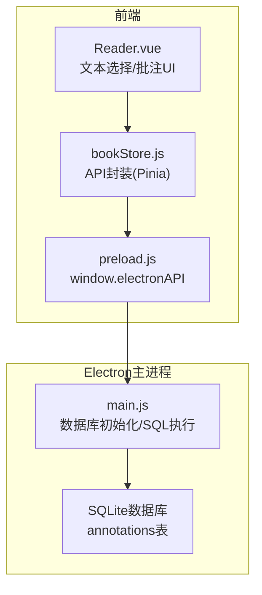
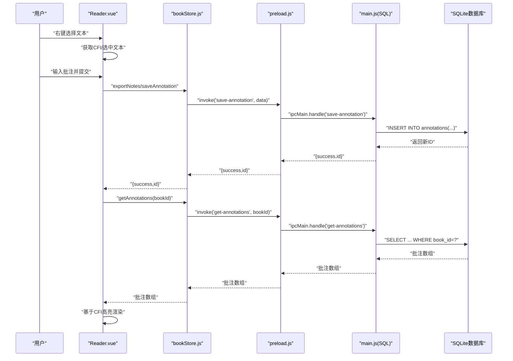
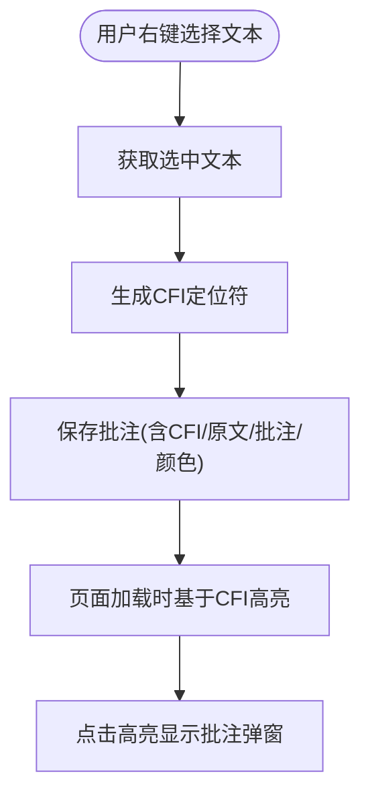
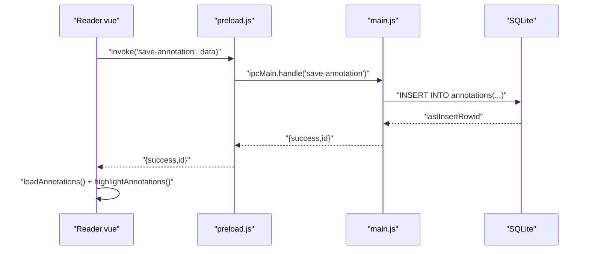
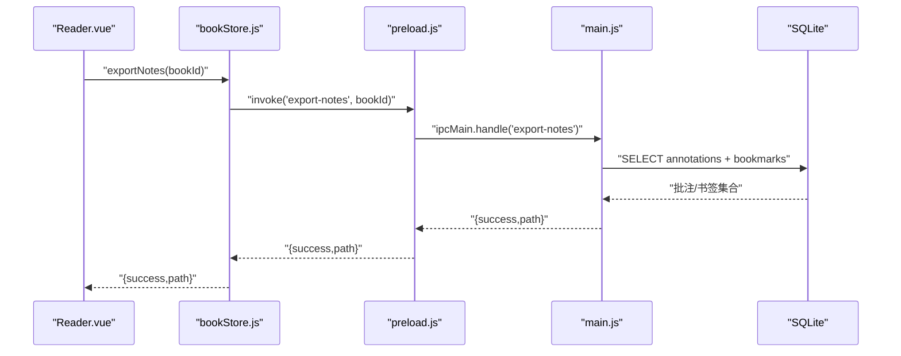

# 批注表(annotations)

<cite>
**本文引用的文件列表**
- [main.js](file://electron/main.js)
- [preload.js](file://electron/preload.js)
- [Reader.vue](file://src/components/Reader.vue)
- [bookStore.js](file://src/stores/bookStore.js)
- [style.css](file://src/style.css)
</cite>

## 目录
1. [简介](#简介)
2. [项目结构](#项目结构)
3. [核心组件](#核心组件)
4. [架构总览](#架构总览)
5. [详细组件分析](#详细组件分析)
6. [依赖分析](#依赖分析)
7. [性能考量](#性能考量)
8. [故障排查指南](#故障排查指南)
9. [结论](#结论)
10. [附录](#附录)

## 简介
本文件面向ROSAA电子书阅读器的“批注表(annotations)”数据库表，提供完整、可操作的表结构说明与技术实现细节。内容涵盖：
- 表字段定义与约束
- 与EPUB文本选择的对应关系（基于EPUB CFI定位符）
- 颜色编码系统与高亮渲染机制
- 存储格式与检索机制
- 完整的CREATE TABLE语句与字段级说明
- 批注的创建、编辑、删除与批量导出的技术实现流程

## 项目结构
批注功能涉及前端Vue组件、Pinia状态管理、Electron主进程数据库操作以及预加载桥接层。核心交互路径如下：
- 前端Reader组件负责文本选择、CFI获取、批注输入与高亮渲染
- Pinia store封装API调用
- 预加载层暴露window.electronAPI接口
- 主进程通过SQLite创建并维护annotations表，提供增删改查与导出能力

图表来源
- [Reader.vue:514-562](file://src/components/Reader.vue#L514-L562)
- [bookStore.js:147-155](file://src/stores/bookStore.js#L147-L155)
- [preload.js:80-91](file://electron/preload.js#L80-L91)
- [main.js:247-261](file://electron/main.js#L247-L261)

章节来源
- [Reader.vue:514-562](file://src/components/Reader.vue#L514-L562)
- [bookStore.js:147-155](file://src/stores/bookStore.js#L147-L155)
- [preload.js:80-91](file://electron/preload.js#L80-L91)
- [main.js:247-261](file://electron/main.js#L247-L261)

## 核心组件
- 批注表(annotations)：持久化存储每条批注的元数据与内容
- Reader组件：负责文本选择、CFI解析、批注输入与高亮渲染
- Pinia store：统一管理批注相关API调用
- 预加载层：桥接前端与主进程，暴露saveAnnotation/getAnnotations/deleteAnnotation等接口
- 主进程：负责数据库初始化、SQL执行与导出逻辑

章节来源
- [main.js:247-261](file://electron/main.js#L247-L261)
- [Reader.vue:514-562](file://src/components/Reader.vue#L514-L562)
- [bookStore.js:147-155](file://src/stores/bookStore.js#L147-L155)
- [preload.js:80-91](file://electron/preload.js#L80-L91)

## 架构总览
批注的端到端工作流如下：
- 用户在阅读器中进行文本选择，系统获取CFI定位符
- 用户输入批注内容，前端调用API保存
- 主进程写入annotations表
- 页面重新加载批注并基于CFI进行高亮渲染
- 支持批量导出为纯文本

图表来源
- [Reader.vue:974-1012](file://src/components/Reader.vue#L974-L1012)
- [bookStore.js:147-155](file://src/stores/bookStore.js#L147-L155)
- [preload.js:80-91](file://electron/preload.js#L80-L91)
- [main.js:710-748](file://electron/main.js#L710-L748)

## 详细组件分析

### 数据库表结构：annotations
- 表名：annotations
- 主键：id（自增）
- 外键：book_id 引用 books(id)，级联删除
- 字段定义与说明
  - id：INTEGER PRIMARY KEY AUTOINCREMENT，唯一标识每条批注
  - book_id：INTEGER NOT NULL，关联所属书籍
  - cfi：TEXT NOT NULL，EPUB CFI定位符，用于精确映射到文本片段
  - selected_text：TEXT NOT NULL，用户选中的原文内容（便于展示与导出）
  - annotation：TEXT NOT NULL，用户的批注内容
  - color：TEXT DEFAULT '#FFEB3B'，高亮颜色（默认黄色），用于渲染
  - created_at：DATETIME DEFAULT CURRENT_TIMESTAMP，创建时间
  - updated_at：DATETIME DEFAULT CURRENT_TIMESTAMP，更新时间
- 约束与索引
  - 外键约束：book_id REFERENCES books(id) ON DELETE CASCADE
  - 排序：按created_at升序查询，便于时间线展示
- 初始化SQL
  - 主进程在数据库初始化时创建该表，包含上述字段与约束

章节来源
- [main.js:247-261](file://electron/main.js#L247-L261)

### EPUB CFI与文本选择的对应关系
- 文本选择：Reader组件通过原生Selection API获取选中文本
- CFI生成：使用rendition提供的CFI生成能力，将选区转换为EPUB CFI
- 存储：将CFI与选中文本一并存入annotations表
- 渲染：页面加载时根据CFI在epub.js中添加高亮，点击高亮可弹出批注内容

图表来源
- [Reader.vue:764-807](file://src/components/Reader.vue#L764-L807)
- [Reader.vue:955-1012](file://src/components/Reader.vue#L955-L1012)
- [Reader.vue:529-562](file://src/components/Reader.vue#L529-L562)

章节来源
- [Reader.vue:764-807](file://src/components/Reader.vue#L764-L807)
- [Reader.vue:955-1012](file://src/components/Reader.vue#L955-L1012)
- [Reader.vue:529-562](file://src/components/Reader.vue#L529-L562)

### 颜色编码系统与高亮渲染
- 颜色字段：color字段存储颜色值（默认#FFEB3B）
- 渲染策略：使用epub.js的annotations.add接口，传入fill颜色参数，结合CSS混合模式实现半透明高亮
- 用户体验：点击高亮区域弹出包含原文与批注的提示框

章节来源
- [Reader.vue:529-562](file://src/components/Reader.vue#L529-L562)
- [style.css:527-616](file://src/style.css#L527-L616)

### 存储格式与检索机制
- 存储格式：纯文本字段，无需复杂序列化；CFI作为定位键
- 检索机制：按book_id过滤，按created_at升序排列，便于时间线浏览
- 导出机制：主进程将annotations与bookmarks合并为纯文本，包含标题、作者、导出时间、批注与书签明细

章节来源
- [main.js:733-748](file://electron/main.js#L733-L748)
- [main.js:533-592](file://electron/main.js#L533-L592)

### 批注的创建、编辑、删除与批量导出

#### 创建批注
- 前端：Reader组件收集选中文本、CFI与批注内容，调用window.electronAPI.saveAnnotation
- 预加载：preload.js转发到ipcMain.handle('save-annotation')
- 主进程：插入annotations表，返回新ID
- 刷新：重新加载批注并高亮

图表来源
- [Reader.vue:974-1012](file://src/components/Reader.vue#L974-L1012)
- [preload.js:80-83](file://electron/preload.js#L80-L83)
- [main.js:710-731](file://electron/main.js#L710-L731)

章节来源
- [Reader.vue:974-1012](file://src/components/Reader.vue#L974-L1012)
- [preload.js:80-83](file://electron/preload.js#L80-L83)
- [main.js:710-731](file://electron/main.js#L710-L731)

#### 编辑批注
- 当前实现：前端未提供直接编辑接口；若需编辑，建议删除旧批注后重新创建
- 技术要点：删除后重新加载并高亮，保持CFI与颜色一致性

章节来源
- [Reader.vue:514-562](file://src/components/Reader.vue#L514-L562)
- [main.js:750-760](file://electron/main.js#L750-L760)

#### 删除批注
- 前端：调用window.electronAPI.deleteAnnotation
- 主进程：DELETE FROM annotations WHERE id=?
- 结果：返回布尔值表示是否成功

章节来源
- [Reader.vue:514-562](file://src/components/Reader.vue#L514-L562)
- [preload.js:88-91](file://electron/preload.js#L88-L91)
- [main.js:750-760](file://electron/main.js#L750-L760)

#### 批量导出
- 前端：调用window.electronAPI.exportNotes
- 主进程：查询annotations与bookmarks，拼装为纯文本，弹出保存对话框
- 输出：包含书籍标题、作者、导出时间、批注与书签明细

图表来源
- [Reader.vue:147-155](file://src/components/Reader.vue#L147-L155)
- [bookStore.js:147-155](file://src/stores/bookStore.js#L147-L155)
- [preload.js:60-63](file://electron/preload.js#L60-L63)
- [main.js:533-592](file://electron/main.js#L533-L592)

章节来源
- [Reader.vue:147-155](file://src/components/Reader.vue#L147-L155)
- [bookStore.js:147-155](file://src/stores/bookStore.js#L147-L155)
- [preload.js:60-63](file://electron/preload.js#L60-L63)
- [main.js:533-592](file://electron/main.js#L533-L592)

## 依赖分析
- Reader.vue依赖epub.js的rendition对象进行CFI生成与高亮渲染
- bookStore.js封装API调用，统一错误处理与日志
- preload.js桥接前端与主进程，暴露saveAnnotation/getAnnotations/deleteAnnotation等方法
- main.js负责数据库初始化、SQL执行与导出逻辑

图表来源
- [Reader.vue:514-562](file://src/components/Reader.vue#L514-L562)
- [bookStore.js:147-155](file://src/stores/bookStore.js#L147-L155)
- [preload.js:80-91](file://electron/preload.js#L80-L91)
- [main.js:247-261](file://electron/main.js#L247-L261)

章节来源
- [Reader.vue:514-562](file://src/components/Reader.vue#L514-L562)
- [bookStore.js:147-155](file://src/stores/bookStore.js#L147-L155)
- [preload.js:80-91](file://electron/preload.js#L80-L91)
- [main.js:247-261](file://electron/main.js#L247-L261)

## 性能考量
- CFI生成与高亮渲染：在大体量书籍中，CFI数量较多，建议后台异步生成locations，避免阻塞首屏显示
- 查询排序：按created_at升序查询，索引可考虑在book_id+created_at上优化
- 批量导出：导出文本较大时，注意内存占用与I/O性能

## 故障排查指南
- 无法保存批注
  - 检查window.electronAPI.saveAnnotation是否被正确调用
  - 查看主进程日志与错误返回
- 高亮不生效
  - 确认CFI是否有效，页面是否已加载
  - 检查颜色参数与CSS混合模式
- 删除失败
  - 确认annotationId是否存在
- 导出为空
  - 确认bookId有效，annotations与bookmarks表中是否存在数据

章节来源
- [Reader.vue:974-1012](file://src/components/Reader.vue#L974-L1012)
- [Reader.vue:529-562](file://src/components/Reader.vue#L529-L562)
- [main.js:710-760](file://electron/main.js#L710-L760)
- [main.js:533-592](file://electron/main.js#L533-L592)

## 结论
批注表(annotations)以简洁的字段设计实现了EPUB CFI驱动的精准定位与高亮渲染，配合前端UI与主进程数据库操作，形成了完整的批注生命周期管理。通过CFI与颜色字段，系统既保证了跨版本兼容性，又提供了良好的用户体验。建议后续可扩展支持批注编辑、多颜色选择与更丰富的导出格式。

## 附录

### 完整CREATE TABLE语句
以下为annotations表的完整建表SQL（来自主进程初始化逻辑）：
- 表名：annotations
- 字段与约束：见“核心组件”小节

章节来源
- [main.js:247-261](file://electron/main.js#L247-L261)

### 字段级详细说明
- id：主键，自增，唯一标识批注
- book_id：外键，引用books表，级联删除
- cfi：EPUB CFI定位符，用于精确映射文本片段
- selected_text：选中文本，便于展示与导出
- annotation：批注内容
- color：高亮颜色，默认#FFEB3B
- created_at：创建时间
- updated_at：更新时间

章节来源
- [main.js:247-261](file://electron/main.js#L247-L261)

### 批注相关API一览
- 保存批注：window.electronAPI.saveAnnotation(data)
- 获取批注：window.electronAPI.getAnnotations(bookId)
- 删除批注：window.electronAPI.deleteAnnotation(annotationId)
- 批量导出：window.electronAPI.exportNotes(bookId)

章节来源
- [preload.js:80-91](file://electron/preload.js#L80-L91)
- [bookStore.js:147-155](file://src/stores/bookStore.js#L147-L155)