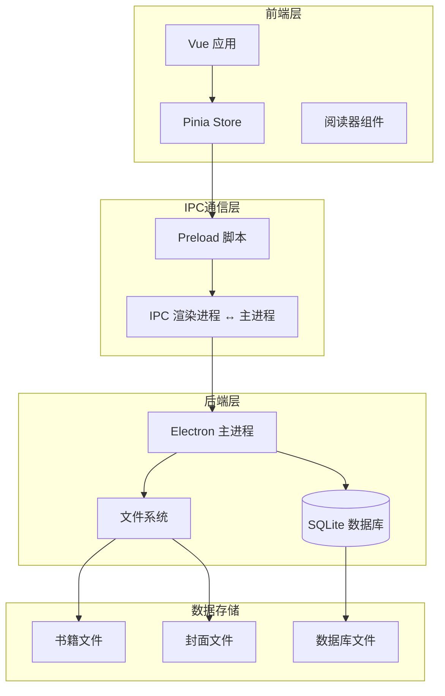
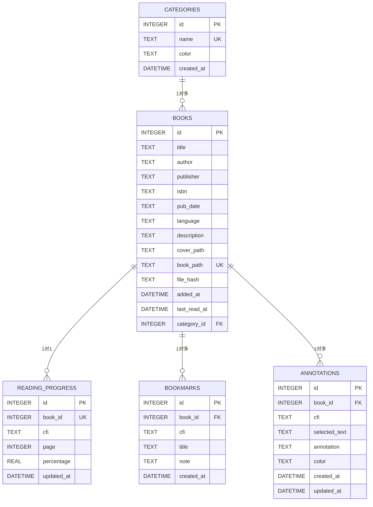
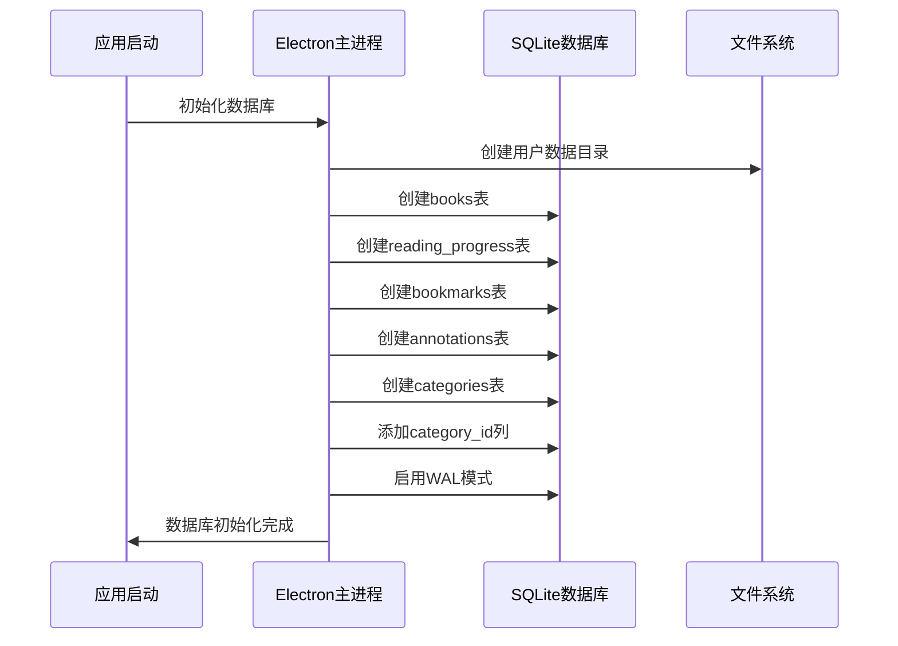
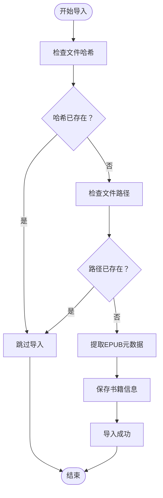
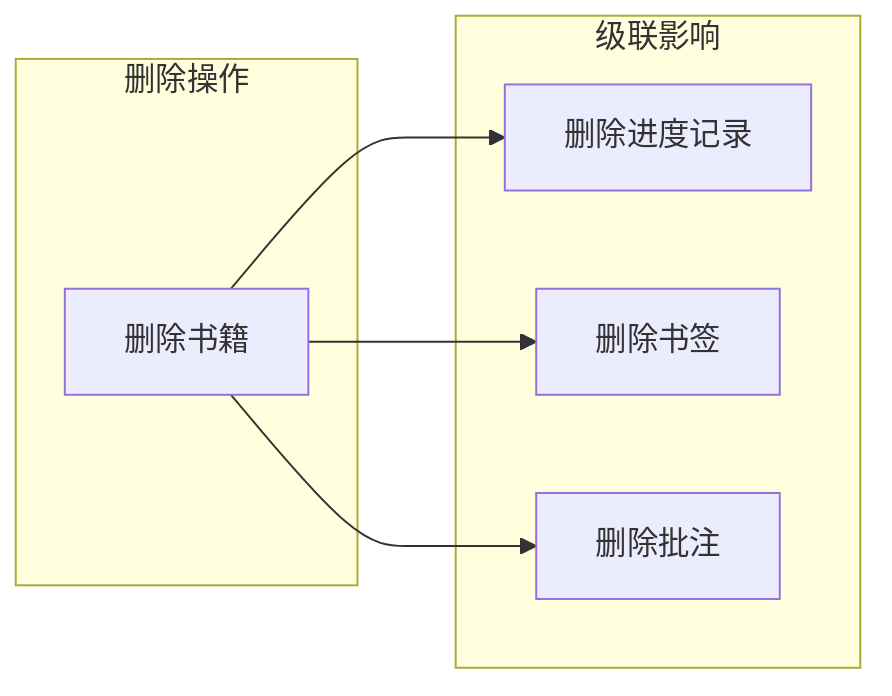
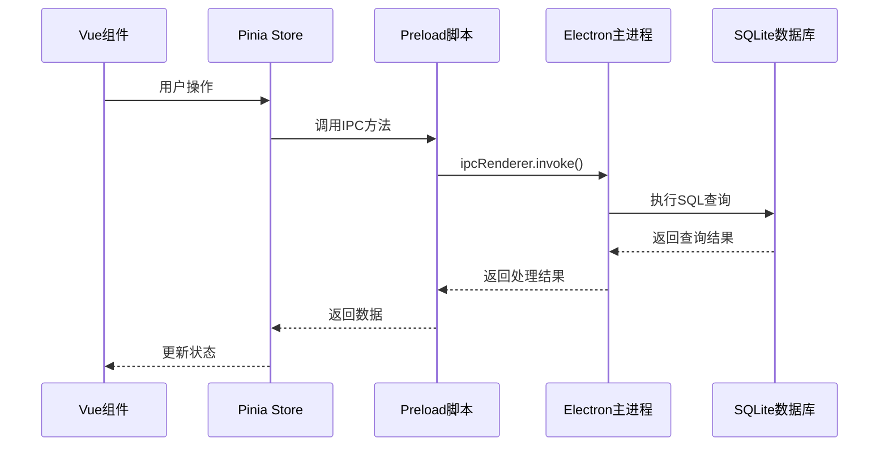

# 数据模型设计

<cite>
**本文档引用的文件**
- [main.js](file://electron/main.js)
- [preload.js](file://electron/preload.js)
- [bookStore.js](file://src/stores/bookStore.js)
- [DATA_STORAGE.md](file://docs/DATA_STORAGE.md)
</cite>

## 目录
1. [简介](#简介)
2. [项目结构](#项目结构)
3. [核心数据实体](#核心数据实体)
4. [架构概览](#架构概览)
5. [详细组件分析](#详细组件分析)
6. [依赖关系分析](#依赖关系分析)
7. [性能考虑](#性能考虑)
8. [故障排除指南](#故障排除指南)
9. [结论](#结论)

## 简介

ROSAA电子书阅读器采用SQLite作为本地数据库，结合Electron框架实现跨平台桌面应用。该数据模型设计围绕EPUB电子书管理的核心需求，建立了完整的书籍、进度、书签和批注管理体系。系统采用SQLite的WAL（Write-Ahead Logging）模式提升并发性能，通过外键约束和级联删除机制确保数据一致性。

## 项目结构

应用采用分层架构设计，数据库层位于Electron主进程中，前端Vue应用通过IPC通信访问数据库功能：

**图表来源**
- [main.js:167-284](file://electron/main.js#L167-L284)
- [preload.js:7-92](file://electron/preload.js#L7-L92)

**章节来源**
- [main.js:167-284](file://electron/main.js#L167-L284)
- [DATA_STORAGE.md:18-42](file://docs/DATA_STORAGE.md#L18-L42)

## 核心数据实体

### 书籍表 (books)

书籍表是整个数据模型的核心，存储EPUB电子书的基本信息和元数据。

| 字段名 | 数据类型 | 约束条件 | 描述 |
|--------|----------|----------|------|
| id | INTEGER | PRIMARY KEY, AUTOINCREMENT | 主键，自增标识符 |
| title | TEXT | NOT NULL | 书籍标题 |
| author | TEXT | NULL | 作者信息 |
| publisher | TEXT | NULL | 出版社信息 |
| isbn | TEXT | NULL | ISBN编号 |
| pub_date | TEXT | NULL | 出版日期 |
| language | TEXT | NULL | 语言代码 |
| description | TEXT | NULL | 书籍描述 |
| cover_path | TEXT | NULL | 封面图片相对路径 |
| book_path | TEXT | NOT NULL, UNIQUE | EPUB文件相对路径（唯一约束） |
| file_hash | TEXT | NULL | 文件SHA256哈希值 |
| added_at | DATETIME | DEFAULT CURRENT_TIMESTAMP | 添加时间 |
| last_read_at | DATETIME | NULL | 最后阅读时间 |

**章节来源**
- [main.js:190-207](file://electron/main.js#L190-L207)
- [main.js:209-219](file://electron/main.js#L209-L219)

### 进度表 (reading_progress)

进度表跟踪每本书的阅读进度，支持CFI定位和页码导航。

| 字段名 | 数据类型 | 约束条件 | 描述 |
|--------|----------|----------|------|
| id | INTEGER | PRIMARY KEY, AUTOINCREMENT | 主键，自增标识符 |
| book_id | INTEGER | NOT NULL, UNIQUE | 外键，关联书籍表（唯一约束） |
| cfi | TEXT | NULL | EPUB CFI定位字符串 |
| page | INTEGER | DEFAULT 0 | 当前页码 |
| percentage | REAL | DEFAULT 0 | 阅读进度百分比 |
| updated_at | DATETIME | DEFAULT CURRENT_TIMESTAMP | 更新时间 |

**章节来源**
- [main.js:221-232](file://electron/main.js#L221-L232)

### 书签表 (bookmarks)

书签表存储用户的阅读书签，支持标题和备注。

| 字段名 | 数据类型 | 约束条件 | 描述 |
|--------|----------|----------|------|
| id | INTEGER | PRIMARY KEY, AUTOINCREMENT | 主键，自增标识符 |
| book_id | INTEGER | NOT NULL | 外键，关联书籍表 |
| cfi | TEXT | NOT NULL | EPUB CFI定位字符串 |
| title | TEXT | NULL | 书签标题 |
| note | TEXT | NULL | 书签备注 |
| created_at | DATETIME | DEFAULT CURRENT_TIMESTAMP | 创建时间 |

**章节来源**
- [main.js:234-245](file://electron/main.js#L234-L245)

### 批注表 (annotations)

批注表存储用户的文本批注和高亮标记。

| 字段名 | 数据类型 | 约束条件 | 描述 |
|--------|----------|----------|------|
| id | INTEGER | PRIMARY KEY, AUTOINCREMENT | 主键，自增标识符 |
| book_id | INTEGER | NOT NULL | 外键，关联书籍表 |
| cfi | TEXT | NOT NULL | EPUB CFI定位字符串 |
| selected_text | TEXT | NOT NULL | 选中文本内容 |
| annotation | TEXT | NOT NULL | 用户批注内容 |
| color | TEXT | DEFAULT '#FFEB3B' | 高亮颜色 |
| created_at | DATETIME | DEFAULT CURRENT_TIMESTAMP | 创建时间 |
| updated_at | DATETIME | DEFAULT CURRENT_TIMESTAMP | 更新时间 |

**章节来源**
- [main.js:247-261](file://electron/main.js#L247-L261)

### 分类表 (categories)

分类表为书籍提供组织和管理功能。

| 字段名 | 数据类型 | 约束条件 | 描述 |
|--------|----------|----------|------|
| id | INTEGER | PRIMARY KEY, AUTOINCREMENT | 主键，自增标识符 |
| name | TEXT | NOT NULL, UNIQUE | 分类名称（唯一约束） |
| color | TEXT | DEFAULT '#667eea' | 分类颜色 |
| created_at | DATETIME | DEFAULT CURRENT_TIMESTAMP | 创建时间 |

**章节来源**
- [main.js:263-272](file://electron/main.js#L263-L272)

## 架构概览

系统采用三层架构设计，确保数据一致性和完整性：

**图表来源**
- [main.js:190-272](file://electron/main.js#L190-L272)

## 详细组件分析

### 数据库初始化流程

系统启动时自动创建和验证所有必要的数据表：

**图表来源**
- [main.js:167-284](file://electron/main.js#L167-L284)

### 数据类型和约束设计

#### 主键设计
- 所有表均采用INTEGER PRIMARY KEY AUTOINCREMENT的自增主键设计
- 确保数据唯一性和查询效率

#### 外键约束
- reading_progress.book_id: UNIQUE约束，确保每本书只有一个进度记录
- bookmarks.book_id: 外键引用books.id，支持级联删除
- annotations.book_id: 外键引用books.id，支持级联删除
- books.category_id: 外键引用categories.id，支持SET NULL级联删除

#### 索引策略
- books.book_path: 唯一索引，确保文件路径唯一性
- books.file_hash: 唯一索引，支持文件去重
- categories.name: 唯一索引，确保分类名称唯一
- reading_progress.book_id: 唯一索引，确保进度唯一性

**章节来源**
- [main.js:190-284](file://electron/main.js#L190-L284)

### 数据验证规则和业务约束

#### 书籍导入验证

**图表来源**
- [main.js:366-408](file://electron/main.js#L366-L408)

#### 业务约束说明
- **文件去重**: 通过file_hash和book_path双重唯一性约束防止重复导入
- **路径管理**: 数据库存储相对路径，运行时动态构建绝对路径
- **级联删除**: 删除书籍时自动删除相关进度、书签和批注
- **分类管理**: 分类删除时将对应书籍的category_id设置为NULL

**章节来源**
- [main.js:366-408](file://electron/main.js#L366-L408)
- [main.js:624-632](file://electron/main.js#L624-L632)

### 数据模型完整性保证

#### 级联删除机制

**图表来源**
- [main.js:229](file://electron/main.js#L229)
- [main.js:242](file://electron/main.js#L242)
- [main.js:258](file://electron/main.js#L258)

#### 数据一致性保证
- **原子性**: 所有数据库操作都在事务中执行
- **一致性**: 外键约束确保引用完整性
- **隔离性**: WAL模式提供更好的并发控制
- **持久性**: 事务提交后数据持久化

**章节来源**
- [main.js:185-187](file://electron/main.js#L185-L187)
- [main.js:276-281](file://electron/main.js#L276-L281)

## 依赖关系分析

### 前端到后端的数据流

**图表来源**
- [bookStore.js:12-232](file://src/stores/bookStore.js#L12-L232)
- [preload.js:7-92](file://electron/preload.js#L7-L92)

### 关键API调用关系

| 前端方法 | 后端处理 | 数据库操作 | 作用 |
|----------|----------|------------|------|
| loadBooks() | get-books | SELECT books | 加载书籍列表 |
| loadCategories() | get-categories | SELECT categories | 加载分类列表 |
| saveProgress() | save-progress | INSERT/UPDATE | 保存阅读进度 |
| addBookmark() | add-bookmark | INSERT | 添加书签 |
| exportNotes() | export-notes | SELECT | 导出阅读笔记 |

**章节来源**
- [bookStore.js:12-232](file://src/stores/bookStore.js#L12-L232)
- [preload.js:12-91](file://electron/preload.js#L12-L91)

## 性能考虑

### SQLite优化策略
- **WAL模式**: 启用写前日志模式提升并发性能
- **索引优化**: 为常用查询字段建立适当索引
- **连接池**: 使用better-sqlite3的高效连接管理
- **批量操作**: 支持批量插入和更新操作

### 查询优化建议
- **分页查询**: 对大量数据采用LIMIT和OFFSET分页
- **索引使用**: 确保WHERE子句中的字段有适当索引
- **连接查询**: 优化JOIN操作减少数据扫描
- **缓存策略**: 对频繁访问的数据建立内存缓存

## 故障排除指南

### 常见问题及解决方案

#### 数据库连接问题
- **症状**: 应用启动时报数据库连接错误
- **原因**: 用户数据目录权限不足或数据库文件损坏
- **解决**: 检查用户数据目录权限，重新初始化数据库

#### 文件路径问题
- **症状**: 无法找到EPUB文件或封面图片
- **原因**: 相对路径与绝对路径转换错误
- **解决**: 验证路径构建逻辑，检查用户数据目录结构

#### 数据同步问题
- **症状**: 前端显示数据与数据库不一致
- **原因**: IPC通信异常或状态管理错误
- **解决**: 检查IPC通道状态，重新加载数据

**章节来源**
- [DATA_STORAGE.md:18-42](file://docs/DATA_STORAGE.md#L18-L42)

## 结论

ROSAA电子书阅读器的数据模型设计充分考虑了EPUB电子书管理的特殊需求，通过合理的表结构设计、外键约束和级联删除机制，确保了数据的一致性和完整性。SQLite的WAL模式和优化的查询策略为应用提供了良好的性能表现。系统的模块化设计使得扩展新功能变得简单，同时保持了数据模型的清晰和可维护性。

未来可以考虑的功能增强包括：
- 添加更复杂的查询过滤选项
- 实现数据备份和恢复机制
- 增强数据迁移和版本升级支持
- 优化大文件处理性能