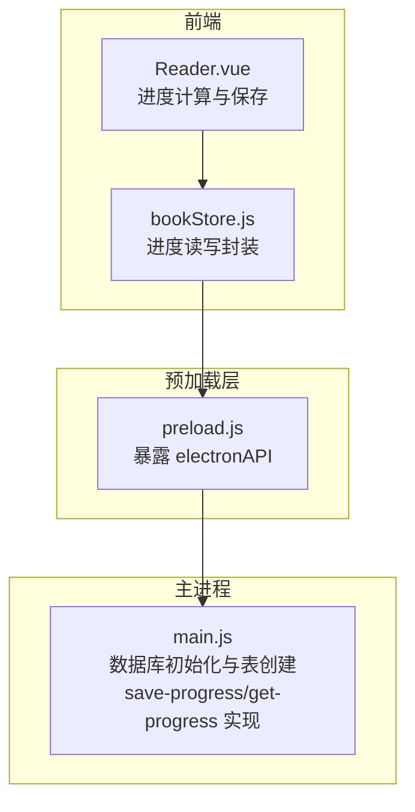
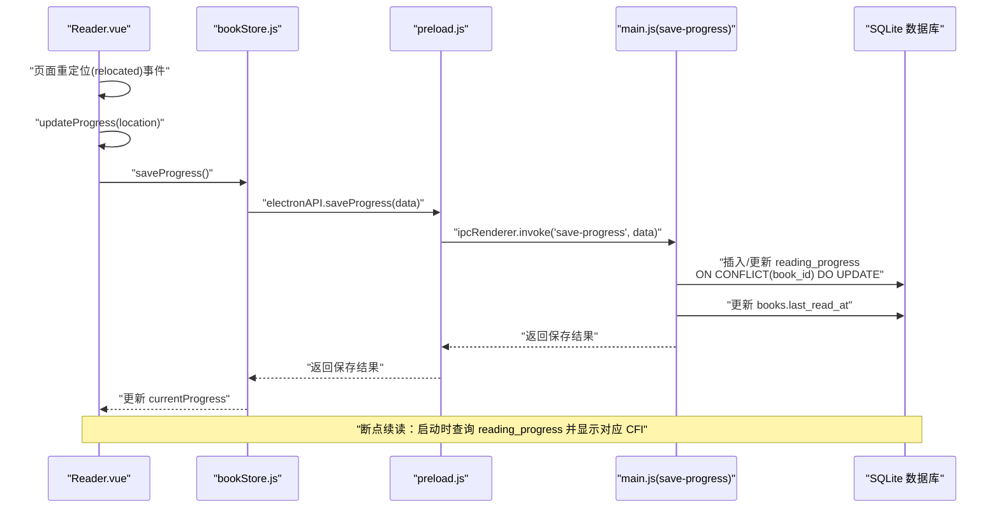

# 阅读进度表(reading_progress)

<cite>
**本文引用的文件**
- [main.js](file://electron/main.js)
- [preload.js](file://electron/preload.js)
- [bookStore.js](file://src/stores/bookStore.js)
- [Reader.vue](file://src/components/Reader.vue)
- [DATA_STORAGE.md](file://docs/DATA_STORAGE.md)
- [PATH_COMPATIBILITY.md](file://docs/PATH_COMPATIBILITY.md)
</cite>

## 目录
1. [简介](#简介)
2. [项目结构](#项目结构)
3. [核心组件](#核心组件)
4. [架构总览](#架构总览)
5. [详细组件分析](#详细组件分析)
6. [依赖关系分析](#依赖关系分析)
7. [性能考量](#性能考量)
8. [故障排查指南](#故障排查指南)
9. [结论](#结论)
10. [附录](#附录)

## 简介
本文件针对 ROSAA 电子书阅读器的“阅读进度表”进行系统化、可操作的数据库表结构说明，覆盖字段定义、约束关系、存储策略、更新逻辑以及断点续读的技术实现细节。重点解释 EPUB CFI（Canonical Fragment Identifier）定位机制及其在进度恢复中的作用，并明确 book_id 的唯一性约束与级联删除机制。

## 项目结构
围绕阅读进度表的关键文件与职责如下：
- 主进程数据库初始化与表创建：负责 reading_progress 表的建表、索引与约束定义
- 预加载层 IPC 暴露：将数据库操作封装为前端可调用的 API
- 前端状态与业务逻辑：负责进度计算、保存与断点续读
- 文档说明：提供数据存储路径与路径兼容性的背景知识



图表来源
- [main.js:167-284](file://electron/main.js#L167-L284)
- [preload.js:7-101](file://electron/preload.js#L7-L101)
- [bookStore.js:161-176](file://src/stores/bookStore.js#L161-L176)
- [Reader.vue:497-507](file://src/components/Reader.vue#L497-L507)

章节来源
- [main.js:167-284](file://electron/main.js#L167-L284)
- [preload.js:7-101](file://electron/preload.js#L7-L101)
- [bookStore.js:161-176](file://src/stores/bookStore.js#L161-L176)
- [Reader.vue:497-507](file://src/components/Reader.vue#L497-L507)

## 核心组件
- 阅读进度表（reading_progress）：存储每本书的断点位置与阅读进度
- 书籍表（books）：与进度表通过 book_id 建立一对一关系
- 进度持久化接口：由主进程提供 IPC 处理器，前端通过 preload 暴露的 API 调用

章节来源
- [main.js:221-232](file://electron/main.js#L221-L232)
- [main.js:634-663](file://electron/main.js#L634-L663)
- [preload.js:16-23](file://electron/preload.js#L16-L23)
- [bookStore.js:161-176](file://src/stores/bookStore.js#L161-L176)

## 架构总览
阅读进度的产生、存储与恢复流程如下：



图表来源
- [Reader.vue:310-326](file://src/components/Reader.vue#L310-L326)
- [Reader.vue:440-495](file://src/components/Reader.vue#L440-L495)
- [Reader.vue:497-507](file://src/components/Reader.vue#L497-L507)
- [bookStore.js:169-176](file://src/stores/bookStore.js#L169-L176)
- [preload.js:16-18](file://electron/preload.js#L16-L18)
- [main.js:634-653](file://electron/main.js#L634-L653)

## 详细组件分析

### 阅读进度表（reading_progress）字段定义与约束
- id：自增主键，唯一标识一条进度记录
- book_id：整型，NOT NULL，UNIQUE，外键引用 books.id；当删除书籍时，级联删除该书的进度记录
- cfi：文本，EPUB CFI 定位符，用于精确恢复阅读位置
- page：整型，默认 0，表示当前页码（翻页模式下使用）
- percentage：实数，默认 0，表示阅读百分比（滚动模式优先使用 epub.js 提供的整书百分比）
- updated_at：时间戳，默认 CURRENT_TIMESTAMP，记录最近一次更新

章节来源
- [main.js:221-232](file://electron/main.js#L221-L232)
- [main.js:229-229](file://electron/main.js#L229-L229)

### CFI（Canonical Fragment Identifier）与 EPUB 定位机制
- CFI 是 EPUB 规范中的标准片段标识符，可精确定位到文档中的任意文本范围或元素
- 在阅读器中，CFI 用于：
  - 断点续读：根据上次保存的 CFI 恢复到准确位置
  - 书签与批注：以 CFI 作为稳定的锚点
- 进度百分比在不同阅读模式下的来源：
  - 滚动模式：优先使用 epub.js 提供的整书百分比；若不可用，则回退到基于 CFI 的 locations 百分比
  - 翻页模式：使用当前页/总页数计算百分比

章节来源
- [Reader.vue:446-495](file://src/components/Reader.vue#L446-L495)
- [Reader.vue:786-796](file://src/components/Reader.vue#L786-L796)
- [Reader.vue:860-878](file://src/components/Reader.vue#L860-L878)

### book_id 的唯一性约束与级联删除
- reading_progress.book_id 设为 NOT NULL 且 UNIQUE，确保每本书只有一条进度记录
- 外键约束：FOREIGN KEY (book_id) REFERENCES books(id) ON DELETE CASCADE
  - 当删除书籍时，相关的进度记录会自动删除，避免悬挂引用
- 该设计简化了“按书维度”的进度管理，避免重复或冲突

章节来源
- [main.js:224-224](file://electron/main.js#L224-L224)
- [main.js:229-229](file://electron/main.js#L229-L229)

### 进度数据的存储策略与更新逻辑
- 存储策略
  - 使用 SQLite 的 INSERT ... ON CONFLICT 子句，按 book_id 去重并更新字段
  - 更新时同时刷新 updated_at，保证时间线正确
  - 每次保存进度后，同步更新 books.last_read_at，便于排序与统计
- 更新触发时机
  - 页面渲染完成（rendered）与页面重定位（relocated）事件均会触发进度更新
  - 支持在切换阅读模式时保存当前位置，保证一致性
- 断点续读
  - 初始化时先加载 reading_progress，若存在有效 CFI，则直接显示该位置
  - 若 CFI 指向封面/版权页等非正文区域，则跳转至第一章

章节来源
- [main.js:634-653](file://electron/main.js#L634-L653)
- [Reader.vue:310-326](file://src/components/Reader.vue#L310-L326)
- [Reader.vue:344-417](file://src/components/Reader.vue#L344-L417)

### 完整的 CREATE TABLE 语句
以下为 reading_progress 表的建表 SQL（来自主进程初始化逻辑）：
- 表名：reading_progress
- 字段与约束：
  - id：INTEGER PRIMARY KEY AUTOINCREMENT
  - book_id：INTEGER NOT NULL UNIQUE
  - cfi：TEXT
  - page：INTEGER DEFAULT 0
  - percentage：REAL DEFAULT 0
  - updated_at：DATETIME DEFAULT CURRENT_TIMESTAMP
  - 外键：FOREIGN KEY (book_id) REFERENCES books(id) ON DELETE CASCADE

章节来源
- [main.js:221-232](file://electron/main.js#L221-L232)

### 进度同步与断点续读技术细节
- 同步策略
  - 前端在每次 relocated 事件后调用 saveProgress，传入 bookId、cfi、page、percentage
  - 主进程使用 ON CONFLICT(book_id) DO UPDATE 实现幂等更新
- 断点续读
  - 初始化时调用 getProgress 获取上次进度
  - 若存在有效 CFI，直接显示该位置；否则跳转至第一章
  - 对封面/版权页等非正文区域进行保护性跳转

章节来源
- [Reader.vue:344-417](file://src/components/Reader.vue#L344-L417)
- [Reader.vue:497-507](file://src/components/Reader.vue#L497-L507)
- [bookStore.js:161-176](file://src/stores/bookStore.js#L161-L176)
- [main.js:655-663](file://electron/main.js#L655-L663)

## 依赖关系分析

```mermaid
erDiagram
BOOKS {
integer id PK
text title
text author
text book_path
datetime last_read_at
}
READING_PROGRESS {
integer id PK
integer book_id UK FK
text cfi
integer page
real percentage
datetime updated_at
}
BOOKS ||--o| READING_PROGRESS : "拥有"
```

图表来源
- [main.js:191-206](file://electron/main.js#L191-L206)
- [main.js:222-231](file://electron/main.js#L222-L231)

章节来源
- [main.js:191-206](file://electron/main.js#L191-L206)
- [main.js:222-231](file://electron/main.js#L222-L231)

## 性能考量
- 使用 SQLite WAL 模式提升并发写入性能
- 通过 ON CONFLICT 子句减少查询-更新往返，降低锁竞争
- locations 生成采用后台异步任务，避免阻塞首屏显示
- 仅在 relocated 事件触发保存，避免频繁写入

章节来源
- [main.js:185-187](file://electron/main.js#L185-L187)
- [Reader.vue:428-438](file://src/components/Reader.vue#L428-L438)
- [Reader.vue:738-750](file://src/components/Reader.vue#L738-L750)

## 故障排查指南
- 无法恢复进度
  - 检查 reading_progress 是否存在对应 book_id 的记录
  - 确认 cfi 是否有效；若无效，检查 epub.js 的 locations 是否已生成
- 进度未更新
  - 确认 relocated 事件是否触发 saveProgress
  - 检查 electronAPI.saveProgress 的返回值与日志
- 删除书籍后残留进度
  - 确认外键级联删除是否生效（ON DELETE CASCADE）
- 路径与文件访问问题
  - 参考数据存储路径与路径兼容性文档，确认文件实际存放位置与数据库中相对路径一致

章节来源
- [main.js:634-653](file://electron/main.js#L634-L653)
- [Reader.vue:310-326](file://src/components/Reader.vue#L310-L326)
- [DATA_STORAGE.md:1-42](file://docs/DATA_STORAGE.md#L1-L42)
- [PATH_COMPATIBILITY.md:1-114](file://docs/PATH_COMPATIBILITY.md#L1-L114)

## 结论
阅读进度表（reading_progress）通过 book_id 的唯一性约束与级联删除机制，实现了与书籍表的一对一关系，确保每本书仅有一条进度记录。结合 CFI 的精确定位与百分比计算策略，系统能够在不同阅读模式下稳定地实现断点续读与进度同步。主进程的 ON CONFLICT 更新与 WAL 模式进一步提升了写入性能与可靠性。

## 附录

### 字段级别说明（摘要）
- id：自增主键，唯一标识进度记录
- book_id：书籍标识，NOT NULL 且 UNIQUE，外键引用 books.id，支持级联删除
- cfi：EPUB CFI 定位符，用于恢复到精确位置
- page：当前页码（翻页模式），默认 0
- percentage：阅读百分比（滚动模式优先），默认 0
- updated_at：最近更新时间，默认 CURRENT_TIMESTAMP

章节来源
- [main.js:221-232](file://electron/main.js#L221-L232)