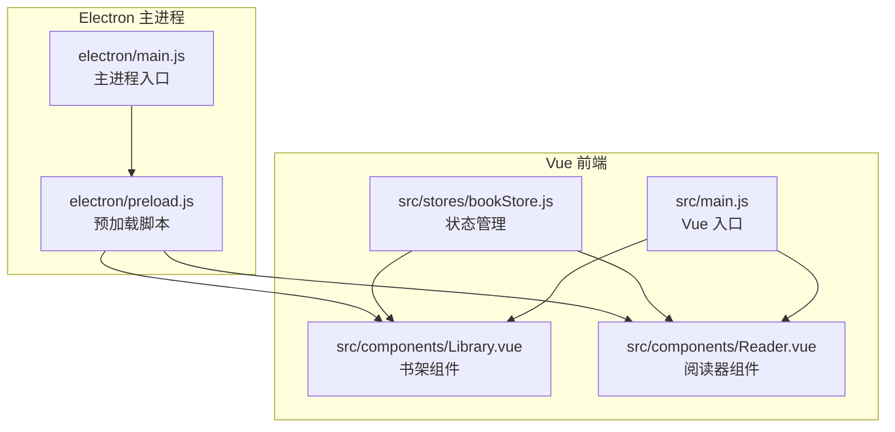
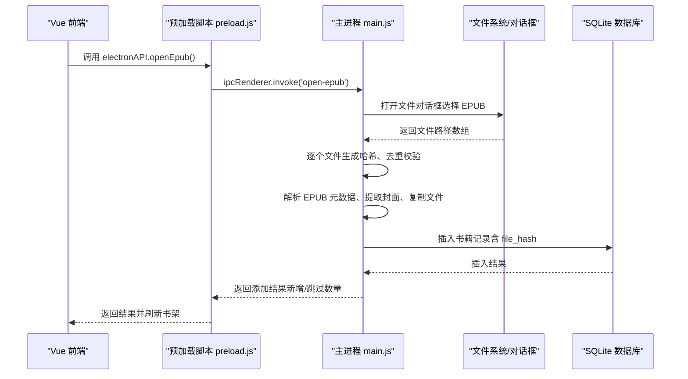
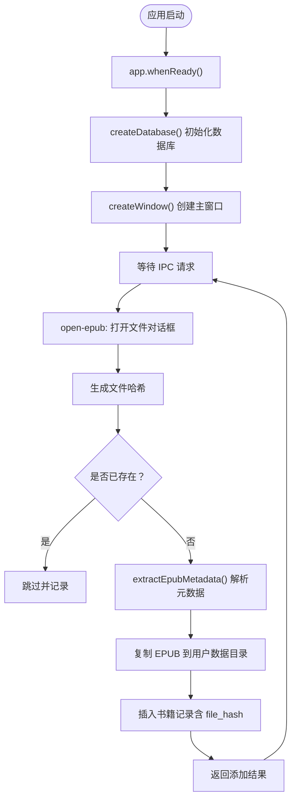
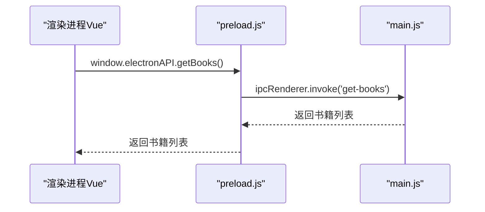
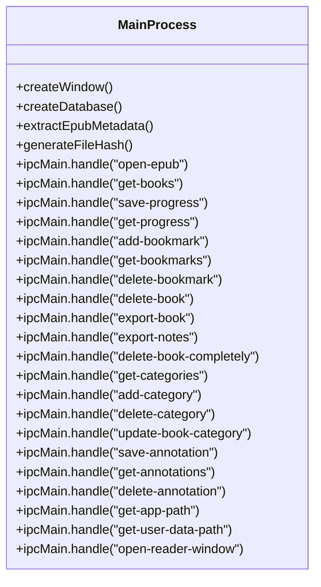
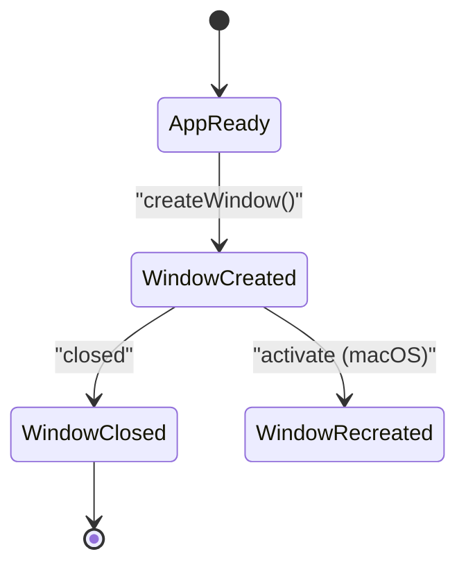
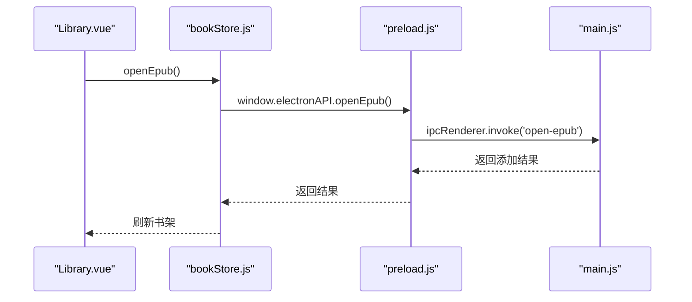
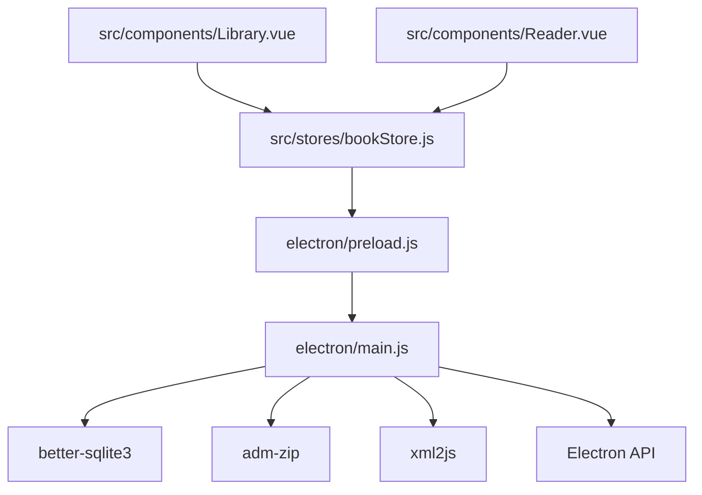

# Electron架构设计

<cite>
**本文档引用的文件**
- [electron/main.js](file://electron/main.js)
- [electron/preload.js](file://electron/preload.js)
- [src/main.js](file://src/main.js)
- [src/components/Library.vue](file://src/components/Library.vue)
- [src/components/Reader.vue](file://src/components/Reader.vue)
- [src/stores/bookStore.js](file://src/stores/bookStore.js)
- [package.json](file://package.json)
- [README.md](file://README.md)
</cite>

## 目录
1. [简介](#简介)
2. [项目结构](#项目结构)
3. [核心组件](#核心组件)
4. [架构总览](#架构总览)
5. [详细组件分析](#详细组件分析)
6. [依赖关系分析](#依赖关系分析)
7. [性能考量](#性能考量)
8. [故障排除指南](#故障排除指南)
9. [结论](#结论)

## 简介
本项目是一个基于 Electron + Vue 3 + SQLite 的现代化 EPUB 电子书阅读器桌面应用。本文档聚焦于 Electron 架构设计，深入解析主进程（electron/main.js）的职责划分、预加载脚本（electron/preload.js）的安全桥接机制、IPC 处理器设计、上下文隔离与 nodeIntegration 禁用的安全策略，以及与 Vue 前端的通信机制与数据传递方式。

## 项目结构
项目采用典型的 Electron + Vue 前端分离架构：
- electron/：主进程与预加载脚本
  - main.js：主进程入口，负责窗口管理、系统级操作、文件管理、数据库操作、IPC 处理
  - preload.js：预加载脚本，通过 contextBridge 暴露受控的 API 至渲染进程
- src/：Vue 前端源码
  - components/：Vue 组件（Library.vue、Reader.vue）
  - stores/：Pinia 状态管理（bookStore.js）
  - main.js：Vue 应用入口
- db/：SQLite 数据库文件（打包时随应用分发）
- public/：静态资源（图标、Logo）

**图表来源**
- [electron/main.js](file://electron/main.js)
- [electron/preload.js](file://electron/preload.js)
- [src/main.js](file://src/main.js)
- [src/components/Library.vue](file://src/components/Library.vue)
- [src/components/Reader.vue](file://src/components/Reader.vue)
- [src/stores/bookStore.js](file://src/stores/bookStore.js)

**章节来源**
- [README.md:167-193](file://README.md#L167-L193)
- [package.json:1-82](file://package.json#L1-L82)

## 核心组件
- 主进程（electron/main.js）
  - 窗口管理：创建主窗口与阅读器窗口，处理窗口生命周期事件
  - 系统级操作：文件对话框、路径查询、图标设置
  - 文件管理：EPUB 解析、元数据提取、封面保存、文件复制
  - 数据库操作：better-sqlite3 初始化与迁移、多表结构（书籍、阅读进度、书签、批注、分类）
  - IPC 处理：统一的 ipcMain.handle 注册，提供 open-epub、get-books、save-progress、get-progress、add-bookmark、get-bookmarks、delete-bookmark、delete-book、export-book、export-notes、delete-book-completely、get-categories、add-category、delete-category、update-book-category、save-annotation、get-annotations、delete-annotation、get-app-path、get-user-data-path、open-reader-window 等 API
- 预加载脚本（electron/preload.js）
  - 通过 contextBridge.exposeInMainWorld 暴露 electronAPI，封装 ipcRenderer.invoke 调用，实现安全的 IPC 桥接
  - 暴露 API：openEpub、getBooks、saveProgress、getProgress、addBookmark、getBookmarks、deleteBookmark、deleteBook、getCategories、addCategory、deleteCategory、updateBookCategory、exportBook、exportNotes、deleteBookCompletely、getAppPath、getUserDataPath、openReaderWindow、saveAnnotation、getAnnotations、deleteAnnotation
- Vue 前端
  - Library.vue：书架展示、分类管理、搜索排序、右键菜单、导出与删除
  - Reader.vue：阅读器界面、目录导航、书签、批注、进度保存、模式切换
  - bookStore.js：Pinia Store，封装与主进程的 IPC 调用，管理书籍、分类、进度、书签、批注等状态

**章节来源**
- [electron/main.js:1-820](file://electron/main.js#L1-L820)
- [electron/preload.js:1-95](file://electron/preload.js#L1-L95)
- [src/stores/bookStore.js:1-234](file://src/stores/bookStore.js#L1-L234)

## 架构总览
Electron 应用采用“主进程 + 预加载脚本 + 渲染进程（Vue）”三层架构。主进程负责系统级能力与数据持久化；预加载脚本提供受控的 IPC 桥接；渲染进程通过受控 API 与主进程交互，实现业务功能。

**图表来源**
- [electron/preload.js:7-11](file://electron/preload.js#L7-L11)
- [electron/main.js:343-427](file://electron/main.js#L343-L427)

**章节来源**
- [electron/main.js:286-341](file://electron/main.js#L286-L341)
- [electron/preload.js:1-95](file://electron/preload.js#L1-L95)

## 详细组件分析

### 主进程（electron/main.js）设计与实现
- 窗口管理
  - createWindow：创建 BrowserWindow，设置 webPreferences（禁用 nodeIntegration、启用 contextIsolation、指定 preload）、根据环境加载开发或生产资源、注册窗口关闭事件
  - open-reader-window：动态创建阅读器窗口，隐藏菜单栏，传递书籍信息，支持开发/生产两种加载方式
- 系统级操作
  - 使用 app.getPath('userData') 获取用户数据目录，用于数据库与文件存储
  - 使用 dialog API 打开文件/保存对话框
- 文件管理
  - generateFileHash：对 EPUB 文件生成 SHA256 哈希，用于重复检测
  - extractEpubMetadata：解析 EPUB 的 container.xml 与 content.opf，提取标题、作者、出版商、ISBN、语言、描述、封面等元数据；保存封面至用户数据目录 upload/covers；复制 EPUB 文件至 upload/books
- 数据库操作
  - createDatabase：初始化数据库目录，创建 books、reading_progress、bookmarks、annotations、categories 表；启用 WAL 模式；兼容性迁移（添加 file_hash、category_id）
  - 统一的 IPC 处理器：get-books、get-categories、add-category、delete-category、update-book-category、export-book、export-notes、delete-book-completely、save-progress、get-progress、add-bookmark、get-bookmarks、delete-bookmark、delete-book、save-annotation、get-annotations、delete-annotation、get-app-path、get-user-data-path、open-reader-window
- 生命周期管理
  - app.whenReady：应用就绪后初始化数据库、创建窗口
  - app.on('activate')：macOS 激活时重建窗口
  - app.on('window-all-closed')：非 macOS 平台退出应用

**图表来源**
- [electron/main.js:317-341](file://electron/main.js#L317-L341)
- [electron/main.js:167-284](file://electron/main.js#L167-L284)
- [electron/main.js:343-427](file://electron/main.js#L343-L427)

**章节来源**
- [electron/main.js:12-30](file://electron/main.js#L12-L30)
- [electron/main.js:33-147](file://electron/main.js#L33-L147)
- [electron/main.js:167-284](file://electron/main.js#L167-L284)
- [electron/main.js:286-341](file://electron/main.js#L286-L341)
- [electron/main.js:343-820](file://electron/main.js#L343-L820)

### 预加载脚本（electron/preload.js）安全桥接
- 通过 contextBridge.exposeInMainWorld 将 electronAPI 暴露到 window 对象，仅暴露受控方法
- 所有 API 均通过 ipcRenderer.invoke 发起异步 IPC 调用，避免直接暴露 Node.js API
- 每个 API 包裹日志输出，便于调试与追踪
- 与主进程的 IPC 名称严格对应（如 open-epub、get-books、save-progress 等）

**图表来源**
- [electron/preload.js:7-42](file://electron/preload.js#L7-L42)
- [electron/main.js:429-449](file://electron/main.js#L429-L449)

**章节来源**
- [electron/preload.js:1-95](file://electron/preload.js#L1-L95)

### IPC 处理器设计与关键 API
- open-epub：打开文件对话框，逐个处理 EPUB 文件，生成哈希、去重、解析元数据、复制文件、插入数据库，返回添加结果
- get-books：按分类过滤查询书籍，按最近阅读与添加时间排序
- get-categories / add-category / delete-category / update-book-category：分类管理
- export-book / export-notes：导出书籍与笔记
- delete-book-completely：彻底删除书籍（文件与数据库记录）
- save-progress / get-progress：阅读进度保存与读取
- add-bookmark / get-bookmarks / delete-bookmark：书签管理
- save-annotation / get-annotations / delete-annotation：批注管理
- get-app-path / get-user-data-path：应用路径与用户数据目录
- open-reader-window：打开阅读器窗口并传递书籍信息

**图表来源**
- [electron/main.js:286-820](file://electron/main.js#L286-L820)

**章节来源**
- [electron/main.js:343-820](file://electron/main.js#L343-L820)

### 上下文隔离与 nodeIntegration 禁用的安全考虑
- webPreferences 中明确禁用 nodeIntegration，启用 contextIsolation，并指定 preload 脚本
- 预加载脚本通过 contextBridge.exposeInMainWorld 暴露最小化的 API 集合，避免直接暴露 Node.js 与 Electron API
- 所有系统级能力（文件、对话框、数据库）均通过 ipcMain.handle 在主进程中执行，渲染进程仅能通过受控 API 访问

**章节来源**
- [electron/main.js:292-302](file://electron/main.js#L292-L302)
- [electron/preload.js:1-95](file://electron/preload.js#L1-L95)

### Electron 应用生命周期管理与窗口创建/销毁流程
- 应用启动：app.whenReady 触发，初始化数据库，创建主窗口
- 窗口创建：根据环境加载开发或生产资源，注册关闭事件
- 窗口销毁：窗口 closed 事件中将 mainWindow 置空
- 激活与退出：macOS activate 时重建窗口；非 macOS 平台 window-all-closed 时退出

**图表来源**
- [electron/main.js:317-341](file://electron/main.js#L317-L341)
- [electron/main.js:312-314](file://electron/main.js#L312-L314)

**章节来源**
- [electron/main.js:317-341](file://electron/main.js#L317-L341)

### 与 Vue 前端的通信机制与数据传递
- Vue 通过 window.electronAPI 调用主进程提供的受控 API
- bookStore.js 封装所有 IPC 调用，集中管理书籍、分类、进度、书签、批注等状态
- Library.vue 调用 openEpub、getBooks、getCategories、exportBook、exportNotes、deleteBookCompletely 等 API
- Reader.vue 调用 openReaderWindow、getProgress、saveProgress、getBookmarks、addBookmark、deleteBookmark、getAnnotations、saveAnnotation、deleteAnnotation 等 API
- 数据传递：前后端通过 IPC 参数与返回值传递对象（如书籍、进度、书签、批注），预加载脚本负责序列化/反序列化

**图表来源**
- [src/stores/bookStore.js:71-104](file://src/stores/bookStore.js#L71-L104)
- [electron/preload.js:7-11](file://electron/preload.js#L7-L11)
- [electron/main.js:343-427](file://electron/main.js#L343-L427)

**章节来源**
- [src/stores/bookStore.js:1-234](file://src/stores/bookStore.js#L1-L234)
- [src/components/Library.vue:365-387](file://src/components/Library.vue#L365-L387)
- [src/components/Reader.vue:201-222](file://src/components/Reader.vue#L201-L222)

## 依赖关系分析
- 主进程依赖
  - better-sqlite3：SQLite 数据库
  - adm-zip/xml2js：EPUB 解析与元数据提取
  - Electron：窗口管理、对话框、路径、菜单
- 前端依赖
  - Vue 3/Pinia：组件与状态管理
  - epubjs：EPUB 渲染
  - 通过 package.json 的 scripts 与 electron-builder 进行打包

**图表来源**
- [electron/main.js:1-8](file://electron/main.js#L1-L8)
- [src/stores/bookStore.js:1-4](file://src/stores/bookStore.js#L1-L4)
- [package.json:22-28](file://package.json#L22-L28)

**章节来源**
- [package.json:22-41](file://package.json#L22-L41)

## 性能考量
- 数据库性能
  - 启用 WAL 模式提升并发读写性能
  - 使用 PRAGMA table_info 检测列存在性，避免重复迁移
- 文件处理
  - 采用流式哈希计算，避免大文件内存压力
  - 复制 EPUB 与封面到用户数据目录，减少外部依赖
- 渲染性能
  - Reader.vue 中对 iframe 右键监听采用重试机制，确保在 EPUB 渲染完成前不丢失事件绑定
  - 滚动模式下延迟生成 locations，避免阻塞首屏显示

**章节来源**
- [electron/main.js:185-187](file://electron/main.js#L185-L187)
- [electron/main.js:124-128](file://electron/main.js#L124-L128)
- [src/components/Reader.vue:810-939](file://src/components/Reader.vue#L810-L939)
- [src/components/Reader.vue:427-438](file://src/components/Reader.vue#L427-L438)

## 故障排除指南
- 打开 EPUB 失败
  - 检查文件是否为有效 EPUB（container.xml 与 content.opf 存在）
  - 确认用户数据目录可写，封面与书籍文件复制成功
- 进度保存/读取异常
  - 确认 reading_progress 表存在且字段正确
  - 检查 bookId 是否匹配
- 批注/书签异常
  - 确认 annotations 与 bookmarks 表结构正确
  - 检查 CFI 是否有效
- 打包与图标
  - 使用提供的 PowerShell/批处理脚本进行打包
  - 确保图标转换为 ICO 格式并放置在 public 目录

**章节来源**
- [electron/main.js:133-147](file://electron/main.js#L133-L147)
- [electron/main.js:634-653](file://electron/main.js#L634-L653)
- [electron/main.js:665-684](file://electron/main.js#L665-L684)
- [README.md:260-367](file://README.md#L260-L367)

## 结论
本项目通过清晰的职责划分与严格的上下文隔离，实现了安全可靠的 Electron 架构。主进程专注于系统级能力与数据持久化，预加载脚本提供受控的 IPC 桥接，Vue 前端通过 Pinia Store 与受控 API 完成业务交互。数据库采用 WAL 模式优化性能，文件处理采用流式与去重策略，阅读器具备良好的用户体验与扩展性。