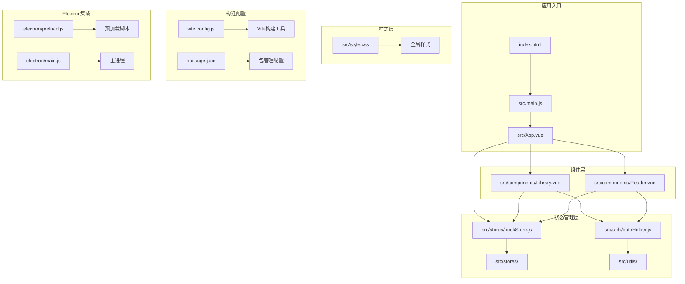
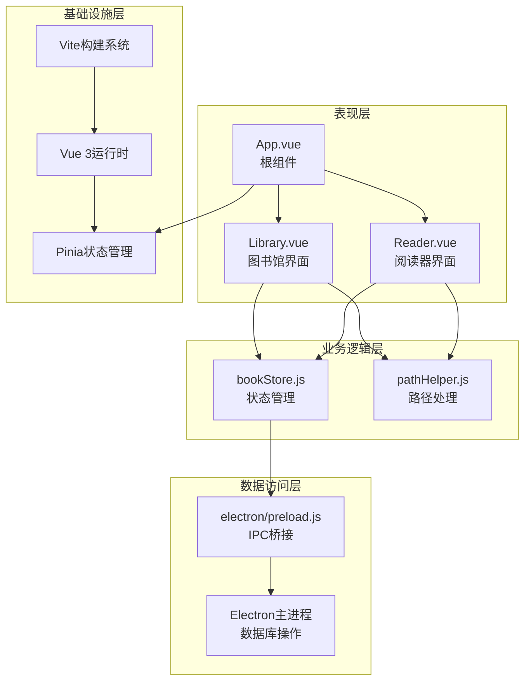
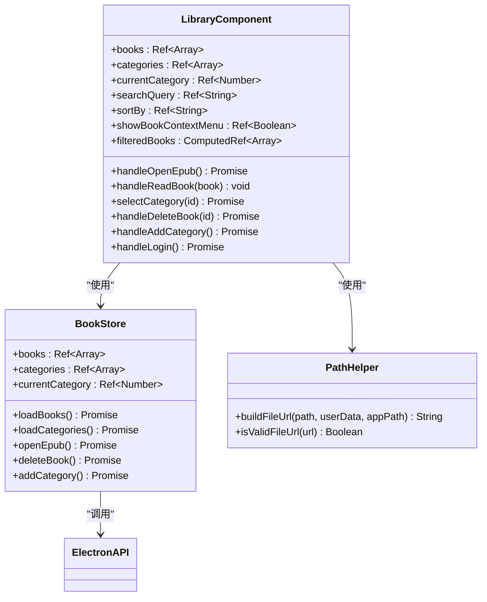
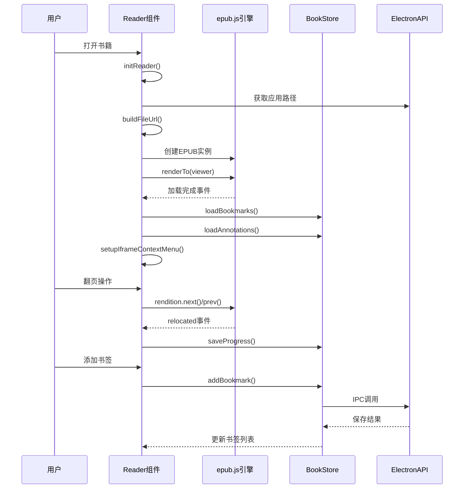
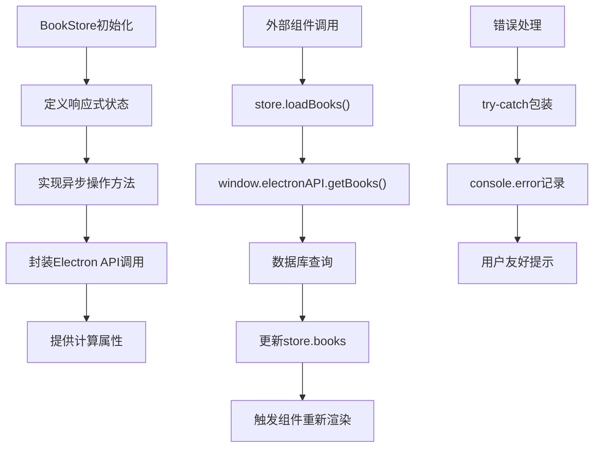

# Vue前端架构

<cite>
**本文档引用的文件**
- [src/App.vue](file://src/App.vue)
- [src/main.js](file://src/main.js)
- [vite.config.js](file://vite.config.js)
- [package.json](file://package.json)
- [src/components/Library.vue](file://src/components/Library.vue)
- [src/components/Reader.vue](file://src/components/Reader.vue)
- [src/stores/bookStore.js](file://src/stores/bookStore.js)
- [src/utils/pathHelper.js](file://src/utils/pathHelper.js)
- [src/style.css](file://src/style.css)
- [index.html](file://index.html)
- [electron/preload.js](file://electron/preload.js)
</cite>

## 目录
1. [简介](#简介)
2. [项目结构](#项目结构)
3. [核心组件](#核心组件)
4. [架构概览](#架构概览)
5. [详细组件分析](#详细组件分析)
6. [依赖关系分析](#依赖关系分析)
7. [性能考虑](#性能考虑)
8. [故障排除指南](#故障排除指南)
9. [结论](#结论)

## 简介

ROSAA电子书阅读器是一个基于Vue 3和Electron的桌面应用程序，专门用于EPUB电子书的阅读和管理。该应用采用现代前端技术栈，结合Vue 3 Composition API的响应式编程模型，实现了优雅的用户体验和高效的代码组织。

本项目的核心特点包括：
- 基于Vue 3 Composition API的现代化组件设计
- Pinia状态管理的集中式数据流控制
- Electron集成的原生桌面应用体验
- 响应式布局和主题化的视觉设计
- 高效的EPUB渲染和交互功能

## 项目结构

该项目采用了清晰的模块化组织结构，遵循Vue 3的最佳实践：



**图表来源**
- [src/App.vue:1-64](file://src/App.vue#L1-L64)
- [src/main.js:1-11](file://src/main.js#L1-L11)
- [vite.config.js:1-18](file://vite.config.js#L1-L18)

**章节来源**
- [src/App.vue:1-64](file://src/App.vue#L1-L64)
- [src/main.js:1-11](file://src/main.js#L1-L11)
- [vite.config.js:1-18](file://vite.config.js#L1-L18)

## 核心组件

### 应用根组件 App.vue

App.vue作为整个应用的根组件，采用了Vue 3 Composition API的setup语法糖，实现了简洁而强大的功能：

**主要特性：**
- 动态组件切换机制（Library与Reader之间的切换）
- 生命周期管理（onMounted钩子处理应用初始化）
- 事件驱动的组件通信模式
- Electron API集成验证和错误处理

**核心功能实现：**
- 使用ref响应式变量管理阅读状态
- 通过URL参数实现书籍自动打开功能
- 集成Pinia状态管理器
- 实现窗口标题动态更新

**章节来源**
- [src/App.vue:8-62](file://src/App.vue#L8-L62)

### 主应用入口 main.js

main.js负责应用的初始化和配置，体现了Vue 3应用的标准启动流程：

**初始化流程：**
1. 创建Vue应用实例
2. 初始化Pinia状态管理
3. 注册插件和中间件
4. 挂载应用到DOM元素

**配置选项：**
- 使用createApp创建应用实例
- 通过createPinia启用状态管理
- 应用级样式导入

**章节来源**
- [src/main.js:1-11](file://src/main.js#L1-L11)

## 架构概览

该应用采用分层架构设计，各层职责明确，耦合度低：



**图表来源**
- [src/App.vue:1-64](file://src/App.vue#L1-L64)
- [src/stores/bookStore.js:1-234](file://src/stores/bookStore.js#L1-L234)
- [electron/preload.js:1-94](file://electron/preload.js#L1-L94)

## 详细组件分析

### Library组件分析

Library.vue是应用的核心界面之一，实现了完整的电子书管理功能：

#### 组件架构设计



**图表来源**
- [src/components/Library.vue:248-589](file://src/components/Library.vue#L248-L589)
- [src/stores/bookStore.js:4-234](file://src/stores/bookStore.js#L4-L234)
- [src/utils/pathHelper.js:13-53](file://src/utils/pathHelper.js#L13-L53)

#### 核心功能模块

**1. 书籍管理功能**
- 书籍列表展示和筛选
- 分类管理和搜索功能
- 书籍右键菜单操作
- 书籍导入和导出

**2. 用户界面设计**
- 响应式布局设计
- 模态对话框系统
- 进度指示器
- 错误处理和用户反馈

**3. 状态管理集成**
- 与Pinia状态管理器的深度集成
- 响应式数据绑定
- 异步状态更新

**章节来源**
- [src/components/Library.vue:1-1291](file://src/components/Library.vue#L1-L1291)

### Reader组件分析

Reader.vue实现了专业的EPUB阅读器功能，集成了epub.js库：

#### 阅读器工作流程



**图表来源**
- [src/components/Reader.vue:201-425](file://src/components/Reader.vue#L201-L425)
- [src/stores/bookStore.js:178-206](file://src/stores/bookStore.js#L178-L206)

#### 核心技术特性

**1. EPUB渲染引擎**
- 集成epub.js库实现标准EPUB渲染
- 支持翻页和滚动两种阅读模式
- 自适应布局和响应式设计

**2. 阅读进度管理**
- 基于CFI（Canonical Fragment Identifier）的精确位置跟踪
- 自动保存和恢复阅读进度
- 目录导航和快速跳转

**3. 批注和书签系统**
- 内容选择和批注功能
- 书签管理和快速定位
- 批注高亮显示

**章节来源**
- [src/components/Reader.vue:1-1026](file://src/components/Reader.vue#L1-L1026)

### 状态管理分析

#### Pinia Store设计



**图表来源**
- [src/stores/bookStore.js:12-234](file://src/stores/bookStore.js#L12-L234)

**章节来源**
- [src/stores/bookStore.js:1-234](file://src/stores/bookStore.js#L1-L234)

## 依赖关系分析

### 技术栈依赖图

```mermaid
graph TB
subgraph "前端框架"
A[Vue 3.3.0]
B[Composition API]
C[Pinia 2.1.0]
end
subgraph "构建工具"
D[Vite 5.0.0]
E[@vitejs/plugin-vue]
end
subgraph "EPUB处理"
F[epubjs 0.3.93]
G[XML解析]
H[压缩处理]
end
subgraph "桌面应用"
I[Electron 28.3.3]
J[better-sqlite3 12.10.0]
K[adm-zip 0.5.17]
end
subgraph "工具库"
L[xml2js 0.6.2]
M[路径处理]
N[图标转换]
end
A --> C
A --> D
D --> E
F --> A
I --> J
I --> K
M --> L
```

**图表来源**
- [package.json:22-41](file://package.json#L22-L41)

### 组件间通信模式

应用采用了多种组件通信模式：

**1. Props传递模式**
- 父组件向子组件传递只读数据
- Reader组件接收Book对象作为props

**2. 事件发射模式**
- 子组件向父组件发送事件通知
- Library组件通过事件切换阅读器

**3. Pinia状态管理模式**
- 全局状态共享和同步
- 组件间解耦的数据流

**章节来源**
- [src/App.vue:3-4](file://src/App.vue#L3-L4)
- [src/components/Reader.vue:167-174](file://src/components/Reader.vue#L167-L174)

## 性能考虑

### 构建优化策略

**Vite构建配置优化：**
- 使用@vitejs/plugin-vue提升开发体验
- 配置路径别名提高导入效率
- 开发服务器端口固定避免端口冲突

**代码分割和懒加载：**
- 组件级别的按需加载
- 大型依赖的动态导入
- 避免不必要的包体积

**运行时性能优化：**
- Vue 3的响应式系统优化
- Composition API的组合函数复用
- Pinia的状态缓存机制

### 阅读器性能优化

**EPUB渲染优化：**
- 后台生成locations避免阻塞主线程
- 智能的内存管理
- 事件监听器的正确清理

**章节来源**
- [src/components/Reader.vue:427-438](file://src/components/Reader.vue#L427-L438)
- [vite.config.js:1-18](file://vite.config.js#L1-L18)

## 故障排除指南

### 常见问题诊断

**1. Electron API未加载错误**
```javascript
// 错误检测和处理
if (!window.electronAPI) {
  console.error('ERROR: window.electronAPI is not defined!')
  alert('错误：Electron API 未加载！\n请确保通过 npm run electron:dev 启动应用，而不是直接在浏览器中打开。')
}
```

**2. 路径解析问题**
- 检查buildFileUrl函数的路径处理逻辑
- 验证用户数据目录和应用路径的正确性
- 确认file:// URL格式的正确性

**3. EPUB加载失败**
- 检查书籍文件的完整性
- 验证EPUB文件格式的有效性
- 确认文件权限和访问权限

**章节来源**
- [src/App.vue:18-23](file://src/App.vue#L18-L23)
- [src/utils/pathHelper.js:13-53](file://src/utils/pathHelper.js#L13-L53)

### 开发调试技巧

**1. 日志记录策略**
- 关键操作添加详细的console日志
- 错误处理包含完整的错误信息
- 性能监控添加时间戳记录

**2. 状态监控**
- 使用Vue DevTools监控响应式状态
- Pinia状态变更的可视化追踪
- 组件生命周期的调试输出

**章节来源**
- [src/components/Reader.vue:201-425](file://src/components/Reader.vue#L201-L425)

## 结论

ROSAA电子书阅读器展现了现代Vue 3应用开发的最佳实践。通过合理的设计模式和架构决策，该应用实现了：

**技术优势：**
- Vue 3 Composition API提供了更灵活的组件逻辑组织
- Pinia状态管理确保了数据流的可预测性和可维护性
- Electron集成提供了原生桌面应用的用户体验
- Vite构建工具带来了快速的开发和构建体验

**架构特色：**
- 清晰的分层架构和职责分离
- 响应式数据流和事件驱动的组件通信
- 完善的错误处理和用户反馈机制
- 可扩展的插件化架构设计

该应用为类似的桌面应用开发提供了优秀的参考模板，展示了如何将现代前端技术与原生应用特性有机结合，创造出既美观又实用的用户体验。