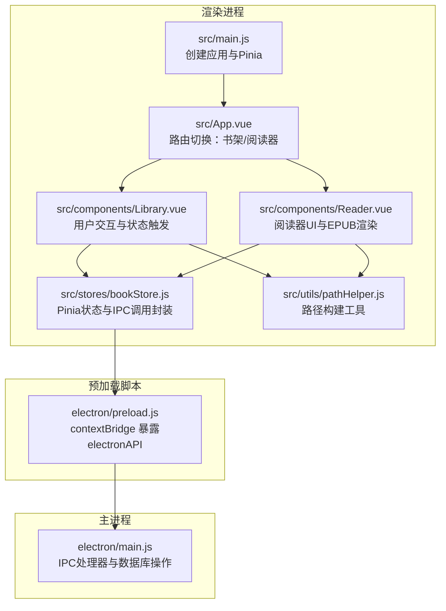
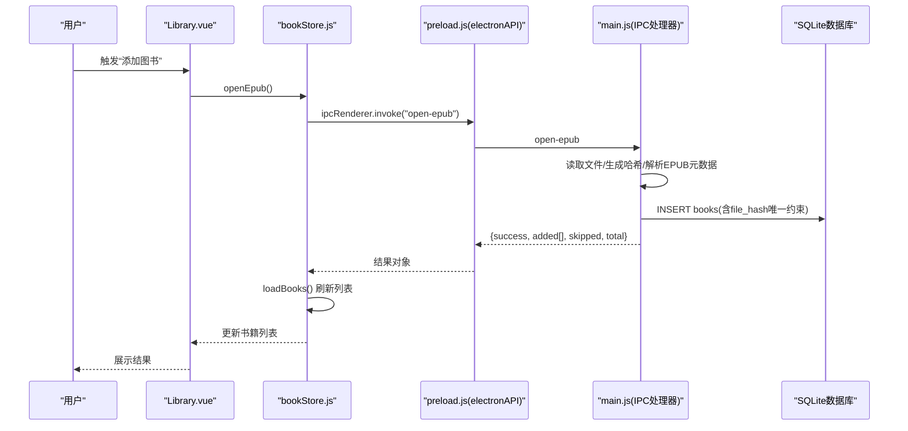
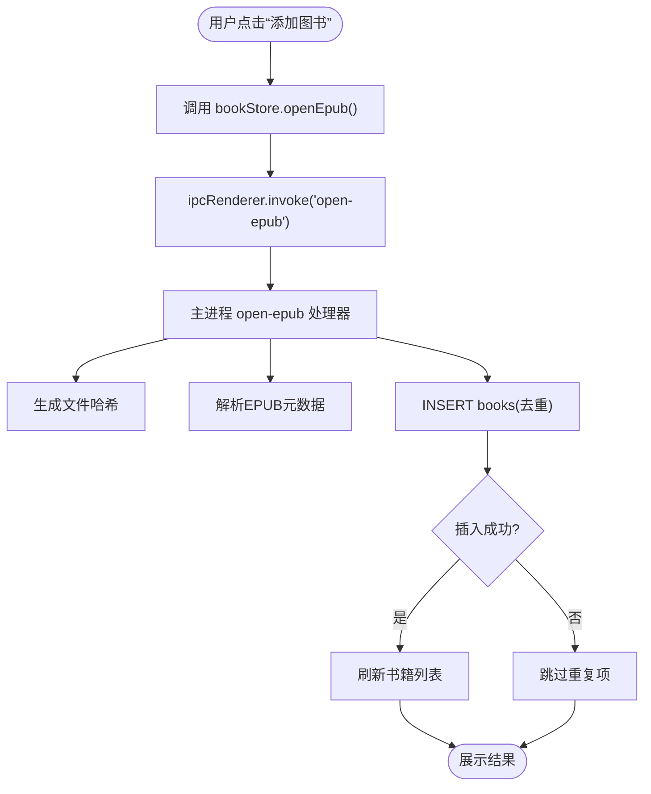
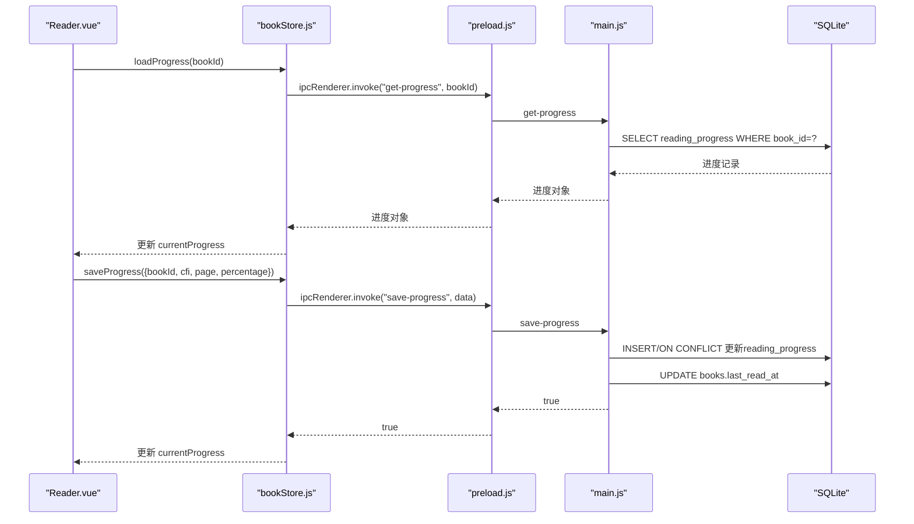
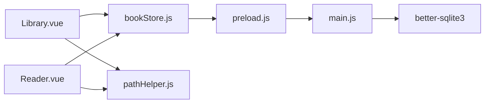

# 数据流设计

<cite>
**本文引用的文件**
- [electron/main.js](file://electron/main.js)
- [electron/preload.js](file://electron/preload.js)
- [src/main.js](file://src/main.js)
- [src/App.vue](file://src/App.vue)
- [src/components/Library.vue](file://src/components/Library.vue)
- [src/components/Reader.vue](file://src/components/Reader.vue)
- [src/stores/bookStore.js](file://src/stores/bookStore.js)
- [src/utils/pathHelper.js](file://src/utils/pathHelper.js)
- [docs/DATA_STORAGE.md](file://docs/DATA_STORAGE.md)
- [docs/PATH_COMPATIBILITY.md](file://docs/PATH_COMPATIBILITY.md)
- [package.json](file://package.json)
</cite>

## 目录
1. [简介](#简介)
2. [项目结构](#项目结构)
3. [核心组件](#核心组件)
4. [架构总览](#架构总览)
5. [详细组件分析](#详细组件分析)
6. [依赖关系分析](#依赖关系分析)
7. [性能考量](#性能考量)
8. [故障排查指南](#故障排查指南)
9. [结论](#结论)
10. [附录](#附录)

## 简介
本文件系统性梳理 ROSAA 电子书阅读器从前端组件到数据库的完整数据通路，覆盖用户操作触发、Vue 组件处理、Pinia 状态管理、预加载脚本桥接与主进程数据库操作的全流程。文档重点阐述 IPC 通信的消息格式与协议、数据流向的层次划分（应用层、传输层、持久层）、数据验证与错误处理、异常恢复机制、缓存策略与性能优化、以及异步数据操作的并发控制与状态同步。

## 项目结构
应用采用 Electron + Vue 3 + Pinia 架构，前端通过预加载脚本暴露安全的 IPC 接口给渲染进程，主进程负责数据库与文件系统操作，前后端通过 IPC 消息进行解耦协作。

**图表来源**
- [src/main.js:1-11](file://src/main.js#L1-L11)
- [src/App.vue:1-64](file://src/App.vue#L1-L64)
- [src/components/Library.vue:1-1292](file://src/components/Library.vue#L1-L1292)
- [src/components/Reader.vue:1-1026](file://src/components/Reader.vue#L1-L1026)
- [src/stores/bookStore.js:1-234](file://src/stores/bookStore.js#L1-L234)
- [src/utils/pathHelper.js:1-63](file://src/utils/pathHelper.js#L1-L63)
- [electron/preload.js:1-95](file://electron/preload.js#L1-L95)
- [electron/main.js:1-820](file://electron/main.js#L1-L820)

**章节来源**
- [src/main.js:1-11](file://src/main.js#L1-L11)
- [src/App.vue:1-64](file://src/App.vue#L1-L64)
- [electron/preload.js:1-95](file://electron/preload.js#L1-L95)
- [electron/main.js:1-820](file://electron/main.js#L1-L820)

## 核心组件
- 应用入口与状态管理
  - 应用入口初始化 Vue 与 Pinia，为后续组件注入状态容器。
  - 状态仓库集中封装所有与后端交互的异步方法，统一错误处理与刷新策略。
- 前端组件
  - 书架组件负责用户交互、搜索与分类筛选、右键菜单与导出操作。
  - 阅读器组件负责 EPUB 渲染、进度恢复、书签与批注管理。
- 预加载脚本
  - 通过 contextBridge 暴露有限的 IPC 能力，避免直接暴露 Node.js 能力。
- 主进程
  - 提供各类 IPC 处理器，负责数据库建表、增删改查、文件复制与封面提取、窗口创建等。

**章节来源**
- [src/main.js:1-11](file://src/main.js#L1-L11)
- [src/stores/bookStore.js:1-234](file://src/stores/bookStore.js#L1-L234)
- [src/components/Library.vue:1-1292](file://src/components/Library.vue#L1-L1292)
- [src/components/Reader.vue:1-1026](file://src/components/Reader.vue#L1-L1026)
- [electron/preload.js:1-95](file://electron/preload.js#L1-L95)
- [electron/main.js:1-820](file://electron/main.js#L1-L820)

## 架构总览
数据流自上而下分为三层：
- 应用层：Vue 组件与 Pinia Store，负责用户交互与业务编排。
- 传输层：预加载脚本暴露的 electronAPI，封装 ipcRenderer.invoke，统一消息格式。
- 持久层：主进程的 IPC 处理器与 better-sqlite3 数据库，负责数据读写与文件系统操作。

**图表来源**
- [src/components/Library.vue:365-369](file://src/components/Library.vue#L365-L369)
- [src/stores/bookStore.js:71-104](file://src/stores/bookStore.js#L71-L104)
- [electron/preload.js:8-11](file://electron/preload.js#L8-L11)
- [electron/main.js:343-427](file://electron/main.js#L343-L427)

## 详细组件分析

### 书架组件（Library.vue）
- 用户操作
  - “添加图书”：调用 store.openEpub，触发文件选择与批量入库。
  - 分类筛选：selectCategory 切换分类并刷新书籍列表。
  - 右键菜单：支持导出书籍、导出笔记、彻底删除等。
- 数据流
  - 通过 window.electronAPI 调用 IPC，返回结果后刷新本地状态。
  - 封面显示使用路径工具函数构建 file:// URL。
- 异常处理
  - 对 window.electronAPI 可用性进行前置校验；对网络请求与文件操作捕获错误并提示。

**图表来源**
- [src/components/Library.vue:365-369](file://src/components/Library.vue#L365-L369)
- [src/stores/bookStore.js:71-104](file://src/stores/bookStore.js#L71-L104)
- [electron/main.js:343-427](file://electron/main.js#L343-L427)

**章节来源**
- [src/components/Library.vue:1-1292](file://src/components/Library.vue#L1-L1292)
- [src/stores/bookStore.js:1-234](file://src/stores/bookStore.js#L1-L234)
- [src/utils/pathHelper.js:1-63](file://src/utils/pathHelper.js#L1-L63)

### 阅读器组件（Reader.vue）
- EPUB 渲染与进度
  - 初始化时根据路径工具函数构建 file:// URL，加载 EPUB 并生成定位信息。
  - 监听页面跳转事件，实时计算页码与百分比，保存阅读进度。
- 书签与批注
  - 右键菜单提取选中文本与 CFI，支持添加书签与批注。
  - 批注高亮显示，点击弹窗展示原文与批注内容。
- 模式切换
  - 支持翻页与滚动两种模式，切换时保存当前位置并重建渲染实例。

**图表来源**
- [src/components/Reader.vue:497-507](file://src/components/Reader.vue#L497-L507)
- [src/stores/bookStore.js:161-176](file://src/stores/bookStore.js#L161-L176)
- [electron/main.js:634-653](file://electron/main.js#L634-L653)

**章节来源**
- [src/components/Reader.vue:1-1026](file://src/components/Reader.vue#L1-L1026)
- [src/stores/bookStore.js:1-234](file://src/stores/bookStore.js#L1-L234)

### Pinia 状态管理（bookStore.js）
- 职责
  - 统一封装所有与后端交互的方法，屏蔽 IPC 细节。
  - 维护书籍、分类、当前书籍、进度、书签等状态。
  - 在关键操作后主动刷新状态，保证 UI 与后端一致。
- 错误处理
  - 每个异步方法均包含 try/catch，记录错误并返回空结果或提示。

**章节来源**
- [src/stores/bookStore.js:1-234](file://src/stores/bookStore.js#L1-L234)

### 预加载脚本桥接（preload.js）
- 职责
  - 通过 contextBridge.exposeInMainWorld 暴露 electronAPI，封装 ipcRenderer.invoke。
  - 为每个主进程 IPC 处理器提供对应方法，统一参数与返回值结构。
- 协议约定
  - 方法命名与主进程一致，参数按需传递，返回值为 Promise 包裹的对象。

**章节来源**
- [electron/preload.js:1-95](file://electron/preload.js#L1-L95)

### 主进程数据库操作（main.js）
- 数据库初始化
  - 在用户数据目录创建 db 目录与 sqlite 文件，启用 WAL 模式提升并发性能。
  - 建表：books、reading_progress、bookmarks、annotations、categories，并补充迁移字段。
- IPC 处理器
  - 文件导入：open-epub，生成哈希、去重、解析元数据、复制文件、入库。
  - 查询：get-books、get-categories、get-progress、get-bookmarks、get-annotations。
  - 写入：save-progress、add-bookmark、save-annotation、update-book-category、add-category、delete-category、delete-book、delete-book-completely、export-book、export-notes。
  - 窗口：open-reader-window，携带书籍参数并创建阅读器窗口。
- 数据一致性
  - 使用 UNIQUE 与外键约束保障数据完整性；ON CONFLICT 做幂等更新。

**章节来源**
- [electron/main.js:167-284](file://electron/main.js#L167-L284)
- [electron/main.js:343-820](file://electron/main.js#L343-L820)

### 路径处理与兼容性（pathHelper.js 与文档）
- 路径构建
  - 统一使用用户数据目录（userData）拼接相对路径，返回 file:// URL。
  - 开发与生产环境均遵循相同逻辑，避免路径差异导致资源加载失败。
- 文档说明
  - 明确用户数据目录结构、数据库存储相对路径、打包后路径行为与调试建议。

**章节来源**
- [src/utils/pathHelper.js:1-63](file://src/utils/pathHelper.js#L1-L63)
- [docs/DATA_STORAGE.md:1-42](file://docs/DATA_STORAGE.md#L1-L42)
- [docs/PATH_COMPATIBILITY.md:1-191](file://docs/PATH_COMPATIBILITY.md#L1-L191)

## 依赖关系分析
- 组件依赖
  - Library.vue 与 Reader.vue 均依赖 bookStore.js。
  - 两者均依赖 pathHelper.js 构建 file:// URL。
- IPC 依赖
  - 所有异步调用经由 preload.js 的 electronAPI，最终落到 main.js 的 ipcMain.handle 处理器。
- 外部依赖
  - better-sqlite3：高性能嵌入式数据库。
  - epubjs：EPUB 渲染与定位。
  - adm-zip/xml2js：EPUB 解析与封面提取。
  - vue/pinia：视图与状态管理。

**图表来源**
- [src/components/Library.vue:248-251](file://src/components/Library.vue#L248-L251)
- [src/components/Reader.vue:162-165](file://src/components/Reader.vue#L162-L165)
- [src/stores/bookStore.js:1-234](file://src/stores/bookStore.js#L1-L234)
- [electron/preload.js:1-95](file://electron/preload.js#L1-L95)
- [electron/main.js:1-820](file://electron/main.js#L1-L820)
- [src/utils/pathHelper.js:1-63](file://src/utils/pathHelper.js#L1-L63)

**章节来源**
- [package.json:22-41](file://package.json#L22-L41)

## 性能考量
- 数据库性能
  - 启用 WAL 模式，减少锁竞争，提升并发读写性能。
  - 使用 UNIQUE 与外键约束，避免冗余查询与数据不一致带来的额外开销。
- 渲染性能
  - 阅读器后台生成定位（locations），避免阻塞首屏显示。
  - 滚动模式下动态修复 iframe 尺寸，减少布局抖动。
- I/O 优化
  - EPUB 与封面统一保存在用户数据目录，避免跨盘符与权限问题。
  - 路径构建统一逻辑，减少字符串拼接与路径解析成本。
- 缓存策略
  - 本地内存缓存书籍与分类列表，避免频繁 IPC。
  - 阅读进度与书签按需加载，减少一次性数据量。
- 并发控制
  - IPC 调用为串行化处理，避免竞态条件；对批量导入采用逐个文件处理与去重，降低冲突概率。
- 状态同步
  - 关键操作（新增、删除、更新）后主动刷新本地状态，确保 UI 与数据库一致。

[本节为通用性能指导，无需特定文件引用]

## 故障排查指南
- IPC 未就绪
  - 现象：window.electronAPI 未定义或调用失败。
  - 排查：确认通过 npm run electron:dev 启动，而非直接在浏览器打开；检查 preload 脚本是否正确注入。
- 资源加载失败
  - 现象：封面或 EPUB 无法显示。
  - 排查：核对路径构建逻辑与用户数据目录结构；检查 file:// URL 是否正确；确认文件确实存在于用户数据目录。
- 数据库异常
  - 现象：插入失败或重复项未去重。
  - 排查：检查 UNIQUE 约束与 file_hash 唯一性；确认主进程数据库初始化是否成功；查看 WAL 模式是否启用。
- 阅读进度不同步
  - 现象：切换模式或重启后进度丢失。
  - 排查：确认 save-progress 与 get-progress 的 IPC 调用链；检查 CFI 生成与存储；验证 last_read_at 更新逻辑。
- 批注与书签异常
  - 现象：无法保存或显示。
  - 排查：检查 CFI 生成与存储；确认 annotations 与 bookmarks 表结构；验证高亮与点击事件绑定。

**章节来源**
- [src/App.vue:18-22](file://src/App.vue#L18-L22)
- [src/components/Reader.vue:809-939](file://src/components/Reader.vue#L809-L939)
- [electron/main.js:634-760](file://electron/main.js#L634-L760)

## 结论
本设计通过明确的三层分工与严格的 IPC 协议，实现了从前端交互到数据库持久化的稳定数据通路。Pinia 统一状态管理与预加载脚本的安全桥接，确保了数据一致性与安全性。配合 WAL 模式、后台生成定位与统一路径构建等优化手段，系统在易用性与性能之间取得良好平衡。建议持续完善错误上报与埋点，进一步增强可观测性与可维护性。

[本节为总结性内容，无需特定文件引用]

## 附录
- IPC 消息清单（示例）
  - open-epub：参数为空；返回 {success, added[], skipped, total}
  - get-books：参数 categoryId；返回书籍数组
  - save-progress：参数 {bookId, cfi, page, percentage}；返回布尔
  - get-progress：参数 bookId；返回进度对象
  - add-bookmark/save-annotation：参数对象；返回结果对象
  - open-reader-window：参数书籍对象；返回布尔
- 数据模型概览（简表）
  - books：id, title, author, publisher, isbn, pub_date, language, description, cover_path, book_path, file_hash, added_at, last_read_at, category_id
  - reading_progress：id, book_id(UNIQUE), cfi, page, percentage, updated_at
  - bookmarks：id, book_id, cfi, title, note, created_at
  - annotations：id, book_id, cfi, selected_text, annotation, color, created_at, updated_at
  - categories：id, name(UNIQUE), color, created_at

[本节为概念性附录，无需特定文件引用]