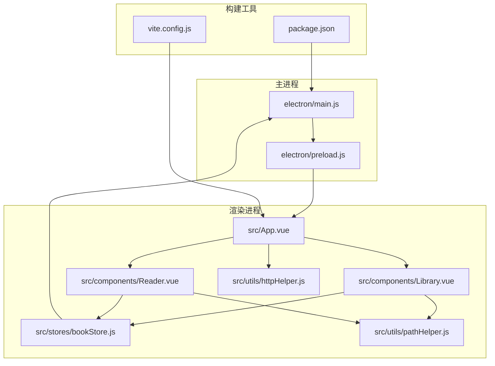
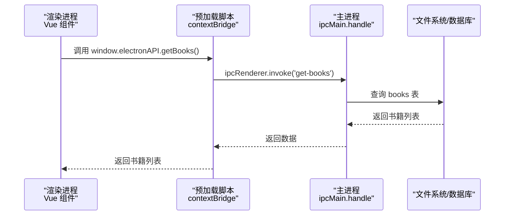
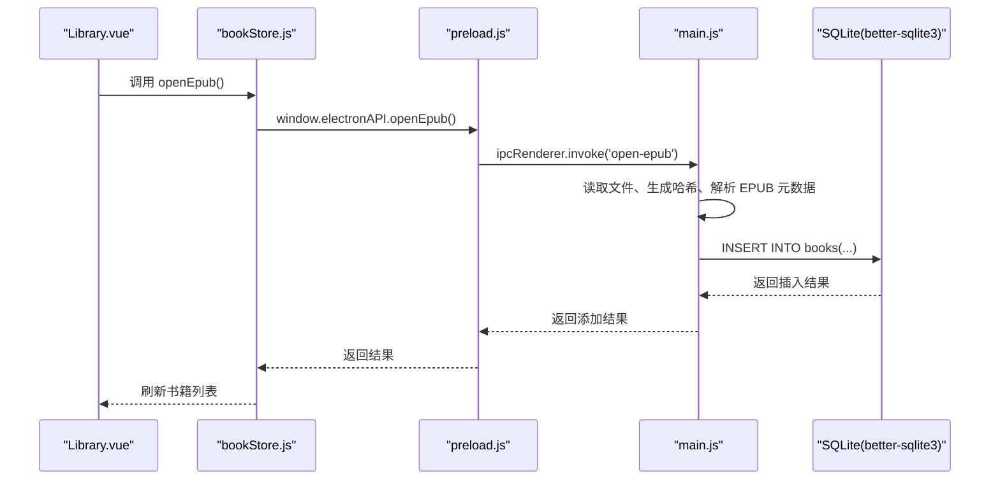
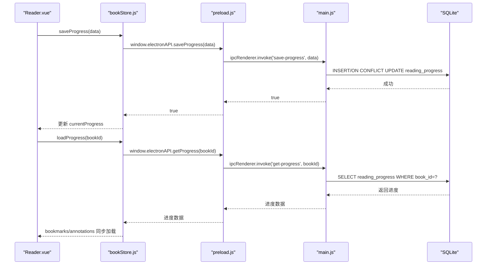
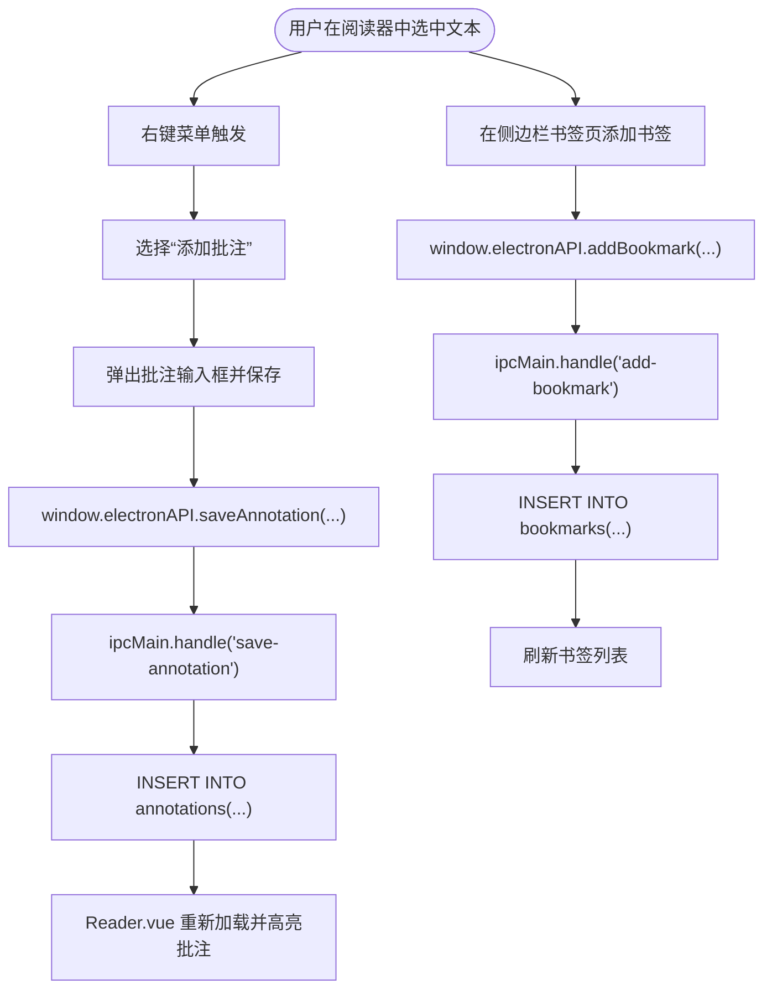
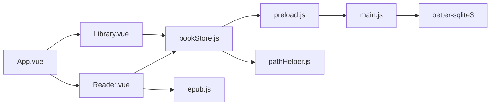

# 架构设计

<cite>
**本文引用的文件**
- [electron/main.js](file://electron/main.js)
- [electron/preload.js](file://electron/preload.js)
- [src/main.js](file://src/main.js)
- [src/App.vue](file://src/App.vue)
- [src/components/Library.vue](file://src/components/Library.vue)
- [src/components/Reader.vue](file://src/components/Reader.vue)
- [src/stores/bookStore.js](file://src/stores/bookStore.js)
- [src/utils/pathHelper.js](file://src/utils/pathHelper.js)
- [src/utils/httpHelper.js](file://src/utils/httpHelper.js)
- [vite.config.js](file://vite.config.js)
- [package.json](file://package.json)
- [README.md](file://README.md)
</cite>

## 目录
1. [简介](#简介)
2. [项目结构](#项目结构)
3. [核心组件](#核心组件)
4. [架构总览](#架构总览)
5. [详细组件分析](#详细组件分析)
6. [依赖关系分析](#依赖关系分析)
7. [性能考虑](#性能考虑)
8. [故障排除指南](#故障排除指南)
9. [结论](#结论)
10. [附录](#附录)

## 简介
本项目是一个基于 Electron + Vue 3 + SQLite 的桌面电子书阅读器应用，采用主进程-渲染进程分离架构。主进程负责系统级操作、文件管理、数据库操作和窗口管理；渲染进程承载前端界面与交互；预加载脚本提供安全的 IPC 桥接，隔离环境中暴露受控的 API。前端采用 Vue 3 Composition API 与 Pinia 状态管理，结合 Vite 构建工具，实现现代化的开发与构建体验。

## 项目结构
项目采用按层组织的结构：
- electron：主进程与预加载脚本
- src：Vue 前端源码（组件、状态管理、工具）
- public：静态资源
- 构建与打包：Vite 配置、electron-builder 配置、打包脚本

图表来源
- [electron/main.js:1-820](file://electron/main.js#L1-L820)
- [electron/preload.js:1-95](file://electron/preload.js#L1-L95)
- [src/App.vue:1-64](file://src/App.vue#L1-L64)
- [src/components/Library.vue:1-1291](file://src/components/Library.vue#L1-L1291)
- [src/components/Reader.vue:1-1026](file://src/components/Reader.vue#L1-L1026)
- [src/stores/bookStore.js:1-234](file://src/stores/bookStore.js#L1-L234)
- [src/utils/pathHelper.js:1-63](file://src/utils/pathHelper.js#L1-L63)
- [src/utils/httpHelper.js:1-47](file://src/utils/httpHelper.js#L1-L47)
- [vite.config.js:1-18](file://vite.config.js#L1-L18)
- [package.json:1-82](file://package.json#L1-L82)

章节来源
- [README.md:167-194](file://README.md#L167-L194)

## 核心组件
- 主进程（electron/main.js）：负责窗口创建、数据库初始化、文件系统操作（EPUB 解析、封面提取、复制）、IPC 处理（打开书籍、查询/增删改查、导出、进度/书签/批注管理）。
- 预加载脚本（electron/preload.js）：通过 contextBridge 暴露受限 API 至渲染进程，统一封装 ipcRenderer.invoke 调用，实现安全的 IPC 桥接。
- Vue 前端（src/main.js、App.vue、组件与 store）：应用入口、根组件、组件化界面、Pinia 状态管理、工具函数。
- Vite 构建（vite.config.js）：开发服务器、路径别名、插件配置。
- 打包配置（package.json build 字段）：electron-builder 配置、目标平台与安装器类型。

章节来源
- [electron/main.js:1-820](file://electron/main.js#L1-L820)
- [electron/preload.js:1-95](file://electron/preload.js#L1-L95)
- [src/main.js:1-11](file://src/main.js#L1-L11)
- [src/App.vue:1-64](file://src/App.vue#L1-L64)
- [src/stores/bookStore.js:1-234](file://src/stores/bookStore.js#L1-L234)
- [vite.config.js:1-18](file://vite.config.js#L1-L18)
- [package.json:42-80](file://package.json#L42-L80)

## 架构总览
主进程-渲染进程分离架构的核心在于：
- 安全隔离：渲染进程禁用 Node 集成，通过预加载脚本暴露受控 API。
- IPC 协作：渲染进程通过 window.electronAPI 发起异步调用，主进程在 ipcMain.handle 中处理业务逻辑并访问系统资源。
- 数据持久化：主进程使用 better-sqlite3 管理 SQLite 数据库，提供书籍、阅读进度、书签、批注、分类等数据的增删改查。
- 文件系统：主进程负责 EPUB 元数据提取、封面保存、书籍复制、导出与删除等文件操作。

图表来源
- [electron/preload.js:12-14](file://electron/preload.js#L12-L14)
- [electron/main.js:429-449](file://electron/main.js#L429-L449)

## 详细组件分析

### 主进程（electron/main.js）
职责概述：
- 窗口管理：创建主窗口与阅读器窗口，开发/生产环境差异化加载。
- 数据库初始化：创建数据库目录与表（books、reading_progress、bookmarks、annotations、categories），启用 WAL 模式提升并发性能。
- 文件系统与 EPUB 处理：生成文件哈希、解析 EPUB 元数据、提取封面、复制书籍到用户数据目录。
- IPC 处理：提供 open-epub、get-books、get-categories、add-category、delete-category、update-book-category、export-book、export-notes、delete-book-completely、save-progress、get-progress、add-bookmark、get-bookmarks、delete-bookmark、delete-book、save-annotation、get-annotations、delete-annotation、get-app-path、get-user-data-path、open-reader-window 等处理器。

关键实现要点：
- 数据库迁移：动态检查并添加 file_hash 列，避免破坏现有数据。
- EPUB 元数据提取：解析 container.xml 与 content.opf，提取标题、作者、出版者、ISBN、语言、描述、封面等。
- 安全与性能：启用 WAL 模式、严格限制 webPreferences（禁用 nodeIntegration、启用 contextIsolation、禁用 webSecurity 并允许不安全内容）。

章节来源
- [electron/main.js:167-284](file://electron/main.js#L167-L284)
- [electron/main.js:33-147](file://electron/main.js#L33-L147)
- [electron/main.js:286-341](file://electron/main.js#L286-L341)
- [electron/main.js:343-800](file://electron/main.js#L343-L800)

### 预加载脚本（electron/preload.js）
职责概述：
- 通过 contextBridge.exposeInMainWorld 暴露 electronAPI 到渲染进程，封装 ipcRenderer.invoke 调用，实现安全桥接。
- 暴露接口覆盖：openEpub、getBooks、saveProgress、getProgress、addBookmark、getBookmarks、deleteBookmark、deleteBook、getCategories、addCategory、deleteCategory、updateBookCategory、exportBook、exportNotes、deleteBookCompletely、getAppPath、getUserDataPath、openReaderWindow、saveAnnotation、getAnnotations、deleteAnnotation。
- 日志与调试：在预加载脚本中输出调用日志，便于定位 IPC 问题。

章节来源
- [electron/preload.js:7-92](file://electron/preload.js#L7-L92)

### Vue 前端架构
- 应用入口（src/main.js）：创建 Vue 应用与 Pinia，并挂载根组件。
- 根组件（src/App.vue）：根据 isReading 状态在 Library 与 Reader 之间切换，处理 URL 参数自动打开阅读器。
- 组件化设计：
  - Library.vue：书架界面，支持搜索、排序、分类、右键菜单、导出书籍与笔记、彻底删除书籍、新建分类等。
  - Reader.vue：阅读器界面，支持目录导航、书签、批注、字体大小调整、翻页/滚动模式切换、进度保存与恢复。
- 状态管理（src/stores/bookStore.js）：集中管理书籍、分类、当前选中分类、当前书籍、阅读进度、书签等，封装与主进程的 IPC 调用。
- 工具函数：
  - pathHelper.js：将相对路径转换为 file:// URL，兼容开发与生产环境。
  - httpHelper.js：封装带认证头的 fetch 请求，自动注入 Authorization 头。

章节来源
- [src/main.js:1-11](file://src/main.js#L1-L11)
- [src/App.vue:1-64](file://src/App.vue#L1-L64)
- [src/components/Library.vue:1-1291](file://src/components/Library.vue#L1-L1291)
- [src/components/Reader.vue:1-1026](file://src/components/Reader.vue#L1-L1026)
- [src/stores/bookStore.js:1-234](file://src/stores/bookStore.js#L1-L234)
- [src/utils/pathHelper.js:1-63](file://src/utils/pathHelper.js#L1-L63)
- [src/utils/httpHelper.js:1-47](file://src/utils/httpHelper.js#L1-L47)

### Vite 构建工具
- 插件：@vitejs/plugin-vue
- 路径别名：@ -> src
- 开发服务器：端口 5173，严格端口
- 与 Electron 开发联动：通过 npm scripts 启动 Vite 与 Electron 并等待前端服务就绪。

章节来源
- [vite.config.js:1-18](file://vite.config.js#L1-L18)
- [package.json:6-12](file://package.json#L6-L12)

### 数据流与端到端流程

#### 从前端组件到数据库的完整数据通路

图表来源
- [src/components/Library.vue:365-369](file://src/components/Library.vue#L365-L369)
- [src/stores/bookStore.js:71-104](file://src/stores/bookStore.js#L71-L104)
- [electron/preload.js:8-11](file://electron/preload.js#L8-L11)
- [electron/main.js:343-427](file://electron/main.js#L343-L427)

#### 阅读器进度保存与恢复

图表来源
- [src/components/Reader.vue:497-507](file://src/components/Reader.vue#L497-L507)
- [src/components/Reader.vue:161-167](file://src/components/Reader.vue#L161-L167)
- [src/stores/bookStore.js:161-176](file://src/stores/bookStore.js#L161-L176)
- [electron/main.js:634-663](file://electron/main.js#L634-L663)

#### 批注与书签的数据流

图表来源
- [src/components/Reader.vue:955-1012](file://src/components/Reader.vue#L955-L1012)
- [electron/main.js:710-760](file://electron/main.js#L710-L760)

## 依赖关系分析
- 组件耦合与内聚：
  - Library.vue 与 Reader.vue 通过 bookStore.js 与主进程解耦，降低组件间直接依赖。
  - 预加载脚本集中暴露 API，渲染进程只依赖 window.electronAPI，避免直接引入 Electron 模块。
- 外部依赖：
  - Electron：主进程能力与窗口管理。
  - better-sqlite3：高性能 SQLite 原生驱动。
  - epub.js：EPUB 渲染与 CFI 定位。
  - Vite：开发与构建工具链。
- 潜在循环依赖：未发现直接循环依赖；IPC 调用方向清晰（渲染进程 -> 预加载 -> 主进程 -> 数据库/文件系统）。

图表来源
- [src/components/Library.vue:249-251](file://src/components/Library.vue#L249-L251)
- [src/components/Reader.vue:162-165](file://src/components/Reader.vue#L162-L165)
- [src/stores/bookStore.js:1-4](file://src/stores/bookStore.js#L1-L4)
- [electron/preload.js:1-1](file://electron/preload.js#L1-L1)
- [electron/main.js:1-7](file://electron/main.js#L1-L7)
- [src/utils/pathHelper.js:1-1](file://src/utils/pathHelper.js#L1-L1)
- [src/App.vue:8-12](file://src/App.vue#L8-L12)

章节来源
- [src/stores/bookStore.js:1-234](file://src/stores/bookStore.js#L1-L234)
- [electron/main.js:1-820](file://electron/main.js#L1-L820)

## 性能考虑
- 数据库性能：
  - 启用 WAL 模式，提升并发读写性能。
  - 使用 PRAGMA 与事务语义减少锁竞争。
- 渲染性能：
  - Reader.vue 在后台生成 locations，避免阻塞首屏显示。
  - 翻页/滚动模式切换时销毁并重建渲染器，保证一致性。
- 文件 I/O：
  - EPUB 元数据解析与封面提取在主进程进行，避免渲染进程负担。
  - 使用用户数据目录统一存放书籍与封面，减少跨盘符访问。
- 构建优化：
  - Vite 提供快速热更新与按需打包。
  - 生产构建时静态资源路径使用相对路径，适配打包后部署。

[本节为通用性能讨论，无需特定文件来源]

## 故障排除指南
- Electron API 未定义：
  - 现象：App.vue 在 mounted 中检测到 window.electronAPI 未定义并提示。
  - 原因：直接在浏览器中打开而非通过 npm run electron:dev 启动。
  - 处理：使用 npm run electron:dev 启动开发模式。
- 打开 EPUB 失败：
  - 现象：openEpub 返回失败或弹出错误提示。
  - 原因：文件损坏、权限不足、磁盘空间不足。
  - 处理：检查文件完整性与路径权限，确认用户数据目录可写。
- 进度保存/恢复异常：
  - 现象：阅读进度未保存或无法恢复。
  - 原因：数据库连接异常、CFI 生成失败、locations 未生成。
  - 处理：查看主进程日志，确认 reading_progress 表存在且字段完整；等待 locations 生成完成。
- 批注/书签无效：
  - 现象：添加批注后未高亮或书签无法跳转。
  - 原因：CFI 生成失败、iframe 监听器未就绪。
  - 处理：确认 epub.js 正常加载，等待 iframe 监听器重试机制完成；检查 CFI 是否为空。
- 打包失败：
  - 现象：electron-builder 打包失败或下载 Electron 失败。
  - 原因：网络环境、Visual Studio 版本不匹配、依赖缺失。
  - 处理：使用提供的 PowerShell/批处理脚本，确保安装 VS 2022 Build Tools，检查 npm 镜像与网络。

章节来源
- [src/App.vue:18-22](file://src/App.vue#L18-L22)
- [src/components/Reader.vue:810-939](file://src/components/Reader.vue#L810-L939)
- [README.md:370-420](file://README.md#L370-L420)

## 结论
本项目采用成熟的主进程-渲染进程分离架构，结合 Vue 3 与 Pinia 实现现代化前端开发，借助 Vite 提升开发效率，使用 better-sqlite3 保障数据持久化性能。预加载脚本在隔离环境中提供受控的 IPC 桥接，既满足功能需求又兼顾安全性。整体架构清晰、职责明确、扩展性强，适合进一步完善批注摘抄、用户认证与云端同步等功能。

[本节为总结性内容，无需特定文件来源]

## 附录
- 技术选型权衡：
  - Electron：跨平台桌面应用框架，生态成熟，但体积与内存占用较高。
  - Vue 3 + Pinia：组合式 API 与轻量状态管理，开发体验良好。
  - Vite：更快的冷启动与热更新，优于 Webpack。
  - better-sqlite3：原生 SQLite 驱动，性能优异，适合本地应用。
  - epub.js：EPUB 渲染与 CFI 定位，功能完备。
- 构建与打包：
  - 使用 electron-builder 生成 NSIS 安装包，支持自定义图标与快捷方式。
  - 提供 PowerShell 与批处理脚本，简化 Windows 平台打包流程。

章节来源
- [README.md:32-41](file://README.md#L32-L41)
- [package.json:42-80](file://package.json#L42-L80)