# 组件通信机制

<cite>
**本文档引用的文件**
- [App.vue](file://src/App.vue)
- [main.js](file://src/main.js)
- [Library.vue](file://src/components/Library.vue)
- [Reader.vue](file://src/components/Reader.vue)
- [bookStore.js](file://src/stores/bookStore.js)
- [preload.js](file://electron/preload.js)
- [main.js](file://electron/main.js)
- [pathHelper.js](file://src/utils/pathHelper.js)
</cite>

## 目录
1. [简介](#简介)
2. [项目结构](#项目结构)
3. [核心组件](#核心组件)
4. [架构概览](#架构概览)
5. [详细组件分析](#详细组件分析)
6. [依赖关系分析](#依赖关系分析)
7. [性能考虑](#性能考虑)
8. [故障排除指南](#故障排除指南)
9. [结论](#结论)

## 简介

ROSAA电子书阅读器采用Vue 3 + Pinia + Electron技术栈构建，实现了完整的组件通信机制。本文档深入分析了组件间的通信模式，包括父子组件通信、兄弟组件通信和跨层级组件通信，并详细解释了Library.vue和Reader.vue之间的路由切换和数据传递机制。

## 项目结构

该项目采用典型的Vue 3单页应用架构，结合Electron实现桌面应用功能：

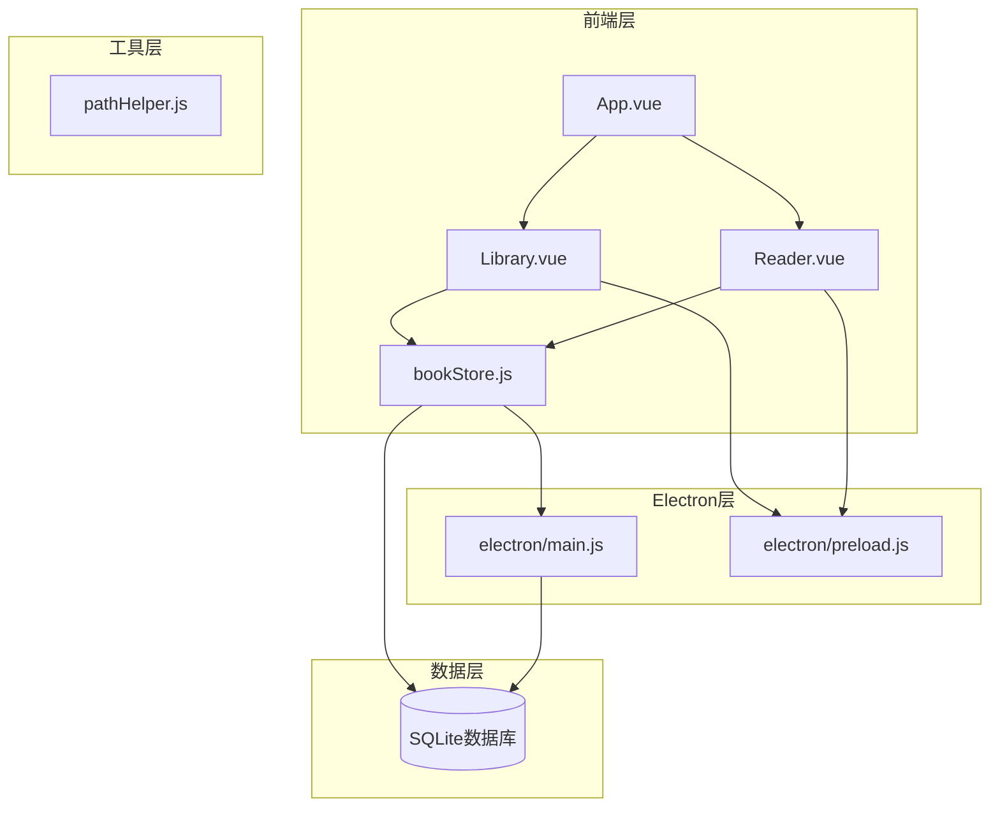

**图表来源**
- [App.vue:1-64](file://src/App.vue#L1-L64)
- [main.js:1-11](file://src/main.js#L1-L11)
- [bookStore.js:1-234](file://src/stores/bookStore.js#L1-L234)

**章节来源**
- [App.vue:1-64](file://src/App.vue#L1-L64)
- [main.js:1-11](file://src/main.js#L1-L11)

## 核心组件

### 组件通信模式概述

ROSAA电子书阅读器实现了多种组件通信模式：

1. **父子组件通信**：通过props传递数据，通过自定义事件传递回调
2. **跨层级组件通信**：通过Pinia状态管理实现全局状态共享
3. **兄弟组件通信**：通过共同父组件协调或通过全局状态管理

### 状态管理模式

项目采用Pinia作为状态管理库，实现了集中式状态管理：

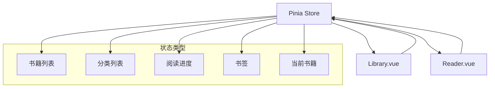

**图表来源**
- [bookStore.js:4-234](file://src/stores/bookStore.js#L4-L234)

**章节来源**
- [bookStore.js:1-234](file://src/stores/bookStore.js#L1-L234)

## 架构概览

### 整体架构设计

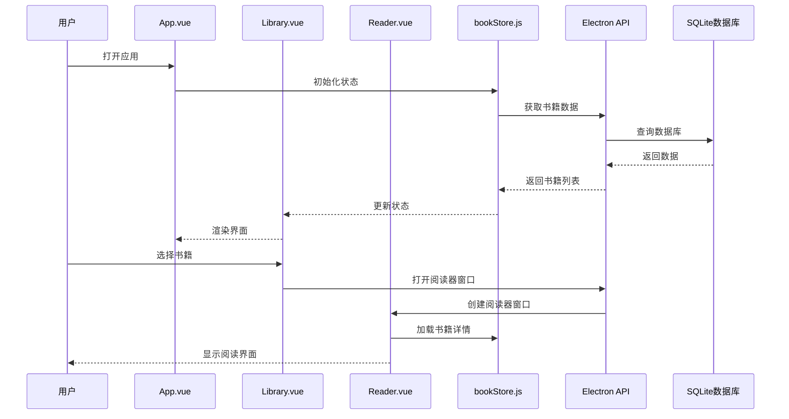

**图表来源**
- [App.vue:18-41](file://src/App.vue#L18-L41)
- [Library.vue:365-387](file://src/components/Library.vue#L365-L387)
- [Reader.vue:201-222](file://src/components/Reader.vue#L201-L222)

## 详细组件分析

### Library.vue 组件分析

#### 组件职责与功能

Library.vue作为应用的主要界面组件，负责：
- 书籍列表展示和管理
- 分类系统的维护
- 用户交互处理
- 与状态管理器的集成

#### 父子组件通信实现

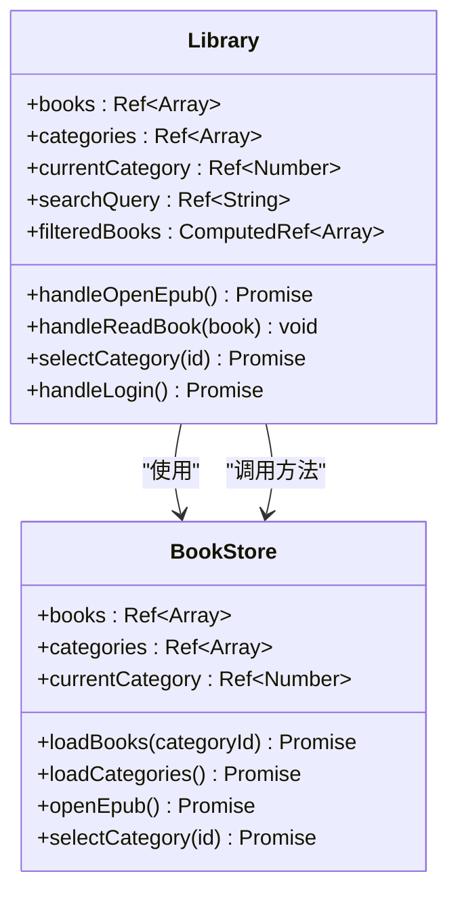

**图表来源**
- [Library.vue:248-589](file://src/components/Library.vue#L248-L589)
- [bookStore.js:4-234](file://src/stores/bookStore.js#L4-L234)

#### 自定义事件系统

Library.vue通过自定义事件实现与父组件的通信：

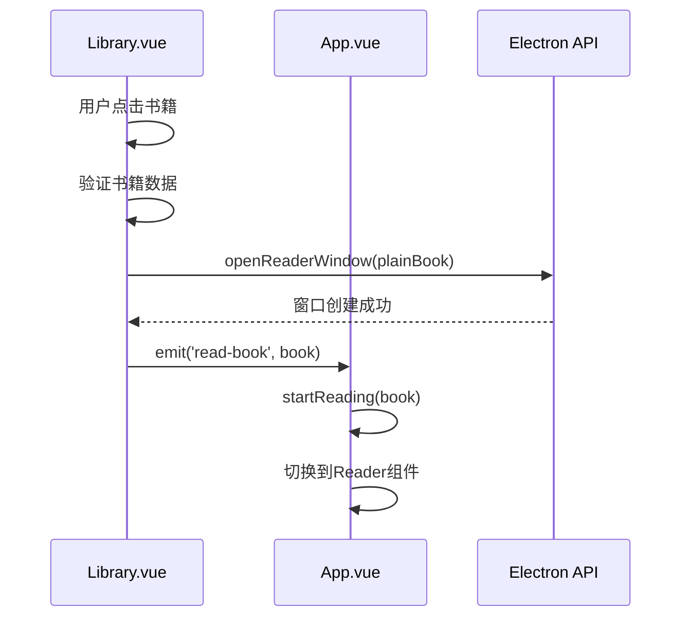

**图表来源**
- [Library.vue:371-387](file://src/components/Library.vue#L371-L387)
- [App.vue:43-54](file://src/App.vue#L43-L54)

**章节来源**
- [Library.vue:1-1292](file://src/components/Library.vue#L1-L1292)

### Reader.vue 组件分析

#### 组件职责与功能

Reader.vue作为阅读器核心组件，负责：
- EPUB文件的渲染和显示
- 阅读进度的管理和保存
- 书签和批注功能
- 用户交互处理

#### 生命周期管理

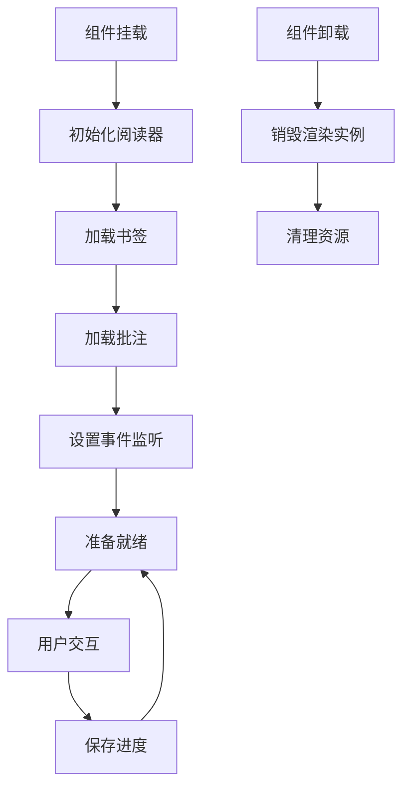

**图表来源**
- [Reader.vue:201-222](file://src/components/Reader.vue#L201-L222)
- [Reader.vue:214-222](file://src/components/Reader.vue#L214-L222)

#### 阅读器初始化流程

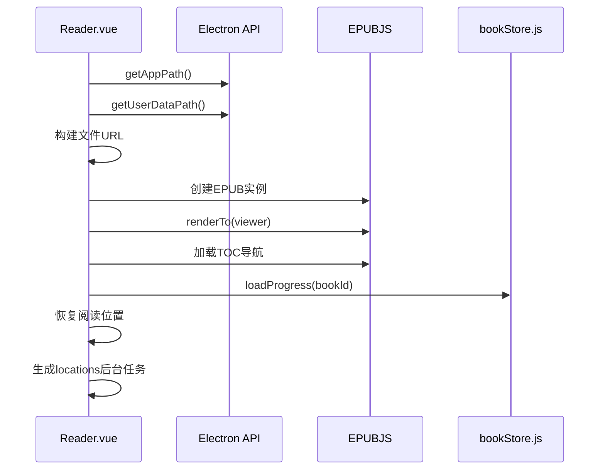

**图表来源**
- [Reader.vue:232-425](file://src/components/Reader.vue#L232-L425)

**章节来源**
- [Reader.vue:1-1026](file://src/components/Reader.vue#L1-L1026)

### App.vue 组件分析

#### 组件职责与功能

App.vue作为根组件，负责：
- 主界面的条件渲染
- 组件间的切换控制
- 全局状态的管理
- URL参数的处理

#### 路由切换机制

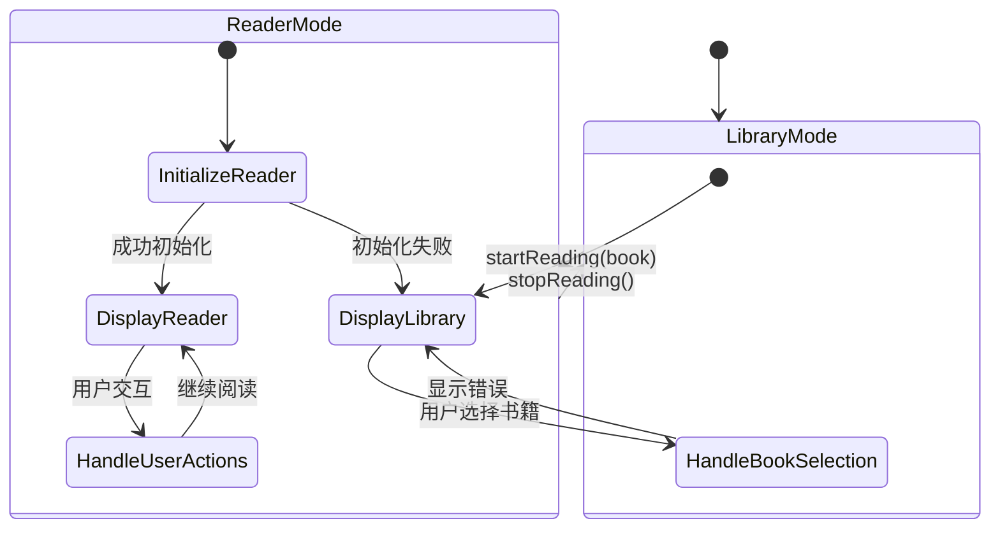

**图表来源**
- [App.vue:3-62](file://src/App.vue#L3-L62)

**章节来源**
- [App.vue:1-64](file://src/App.vue#L1-L64)

### Pinia 状态管理分析

#### Store 设计模式

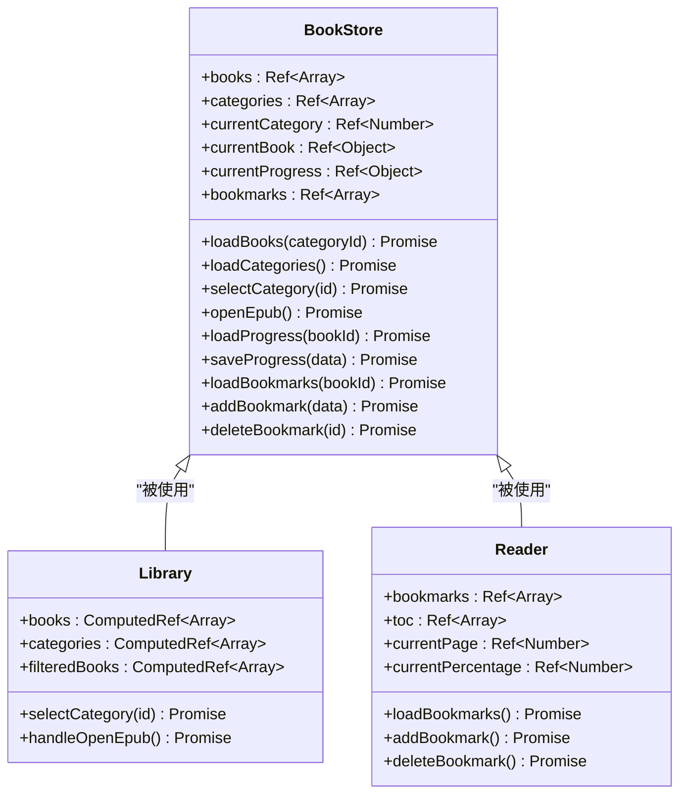

**图表来源**
- [bookStore.js:4-234](file://src/stores/bookStore.js#L4-L234)

#### 全局状态订阅机制

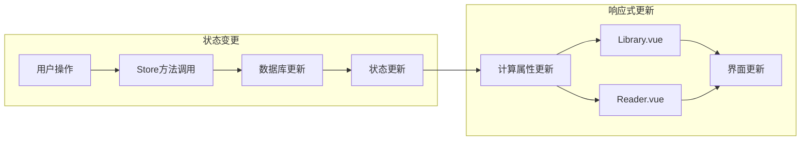

**图表来源**
- [bookStore.js:12-22](file://src/stores/bookStore.js#L12-L22)
- [Library.vue:254-256](file://src/components/Library.vue#L254-L256)

**章节来源**
- [bookStore.js:1-234](file://src/stores/bookStore.js#L1-L234)

## 依赖关系分析

### 组件依赖图

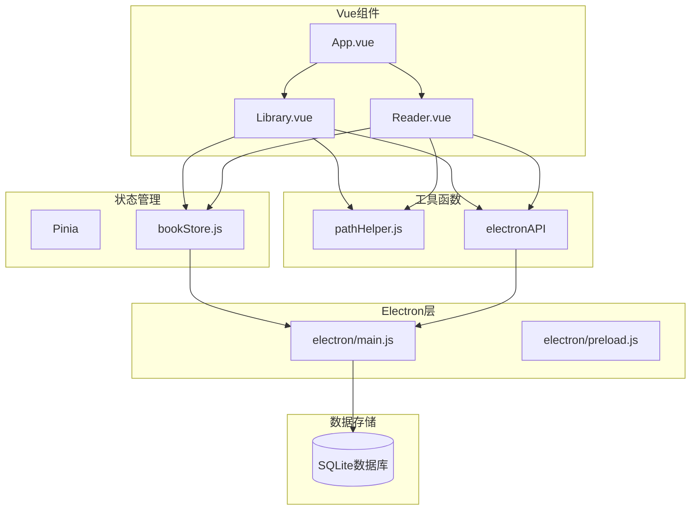

**图表来源**
- [main.js:1-11](file://src/main.js#L1-L11)
- [preload.js:7-92](file://electron/preload.js#L7-L92)

### 通信链路分析

#### 父子组件通信链路

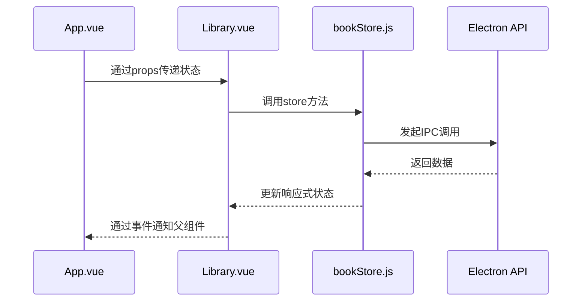

**图表来源**
- [App.vue:3-62](file://src/App.vue#L3-L62)
- [Library.vue:337](file://src/components/Library.vue#L337)

#### 兄弟组件通信机制

由于Library.vue和Reader.vue都依赖于同一个Pinia store，它们通过共享状态实现通信：

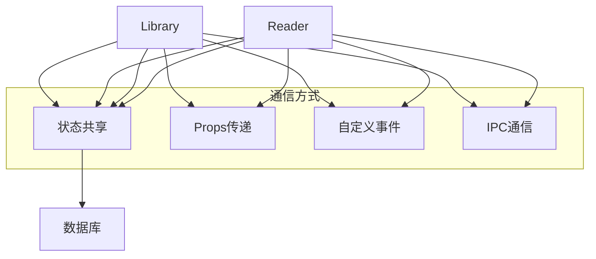

**图表来源**
- [bookStore.js:4-234](file://src/stores/bookStore.js#L4-L234)

**章节来源**
- [main.js:1-11](file://src/main.js#L1-L11)
- [preload.js:1-94](file://electron/preload.js#L1-L94)

## 性能考虑

### 性能优化策略

#### 1. 响应式数据优化

- 使用computed属性避免重复计算
- 合理使用ref和reactive，避免不必要的响应式转换
- 在大型列表渲染中使用虚拟滚动

#### 2. 组件懒加载

- 对于不常用的组件采用动态导入
- 优化首屏加载时间

#### 3. 状态管理优化

- 将大对象拆分为多个小的store模块
- 使用持久化存储减少重复加载

#### 4. IPC通信优化

- 批量处理数据库操作
- 使用防抖和节流处理高频操作

### 性能监控建议

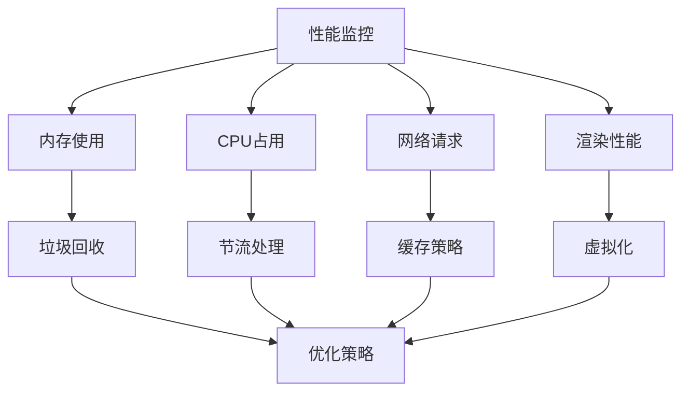

## 故障排除指南

### 常见问题及解决方案

#### 1. Electron API 未加载

**问题描述**：应用在浏览器中直接打开时出现Electron API未定义错误

**解决方案**：
- 确保通过正确的命令启动应用
- 检查preload脚本是否正确注入
- 验证contextBridge配置

#### 2. 书籍无法打开

**问题描述**：点击书籍后无法进入阅读器

**排查步骤**：
- 检查书籍路径是否正确
- 验证文件权限
- 确认EPUB文件完整性

#### 3. 阅读进度丢失

**问题描述**：重新打开书籍后进度不正确

**解决方案**：
- 检查数据库连接
- 验证CFI位置的正确性
- 确认异步操作的顺序

#### 4. 批注功能异常

**问题描述**：批注无法保存或显示

**排查方法**：
- 检查批注数据格式
- 验证CFI生成逻辑
- 确认高亮渲染过程

**章节来源**
- [App.vue:18-23](file://src/App.vue#L18-L23)
- [Reader.vue:418-424](file://src/components/Reader.vue#L418-L424)

## 结论

ROSAA电子书阅读器的组件通信机制展现了现代前端应用的最佳实践：

1. **清晰的层次结构**：App.vue作为根组件，Library.vue和Reader.vue作为主要业务组件，bookStore.js提供统一的状态管理

2. **高效的通信模式**：通过props、自定义事件和Pinia实现多层次的组件通信

3. **可靠的架构设计**：Electron + Vue + Pinia的组合提供了强大的桌面应用能力

4. **良好的扩展性**：模块化的代码结构便于功能扩展和维护

该架构为类似的应用开发提供了优秀的参考模板，特别是在组件通信、状态管理和性能优化方面都有很好的借鉴价值。