# App根组件

<cite>
**本文档引用的文件**
- [App.vue](file://src/App.vue)
- [Library.vue](file://src/components/Library.vue)
- [Reader.vue](file://src/components/Reader.vue)
- [bookStore.js](file://src/stores/bookStore.js)
- [pathHelper.js](file://src/utils/pathHelper.js)
- [preload.js](file://electron/preload.js)
- [main.js](file://electron/main.js)
</cite>

## 目录
1. [简介](#简介)
2. [项目结构](#项目结构)
3. [核心组件](#核心组件)
4. [架构概览](#架构概览)
5. [详细组件分析](#详细组件分析)
6. [依赖关系分析](#依赖关系分析)
7. [性能考虑](#性能考虑)
8. [故障排除指南](#故障排除指南)
9. [结论](#结论)

## 简介

App.vue 是 EPUB 阅读器应用的根组件，负责管理应用的整体状态和组件切换逻辑。该组件实现了条件渲染机制，根据用户当前的操作状态在 Library（图书馆）和 Reader（阅读器）组件之间进行切换。本文档将深入分析根组件的设计架构、路由切换逻辑、全局状态管理、生命周期管理和组件间通信机制。

## 项目结构

EPUB 阅读器采用基于功能模块的组织方式，主要包含以下关键目录和文件：

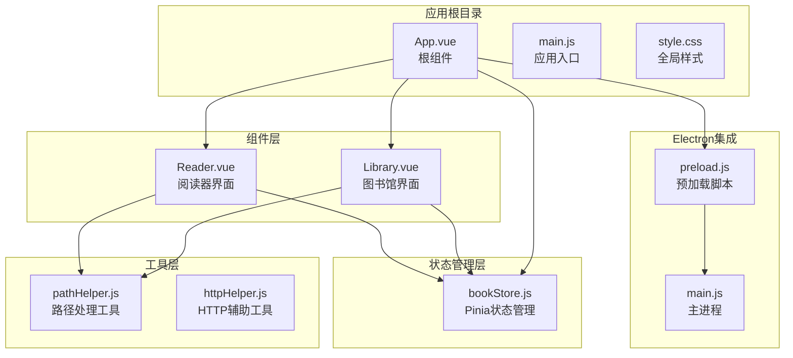

**图表来源**
- [App.vue:1-64](file://src/App.vue#L1-L64)
- [Library.vue:1-1291](file://src/components/Library.vue#L1-L1291)
- [Reader.vue:1-1026](file://src/components/Reader.vue#L1-L1026)

**章节来源**
- [App.vue:1-64](file://src/App.vue#L1-L64)
- [main.js:1-820](file://electron/main.js#L1-L820)

## 核心组件

### 条件渲染机制

App.vue 实现了基于状态的条件渲染，通过 `isReading` 响应式变量控制组件显示：

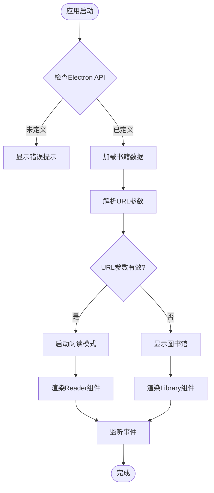

**图表来源**
- [App.vue:18-41](file://src/App.vue#L18-L41)

### 全局状态管理

组件使用 Pinia 状态管理库进行全局状态管理：

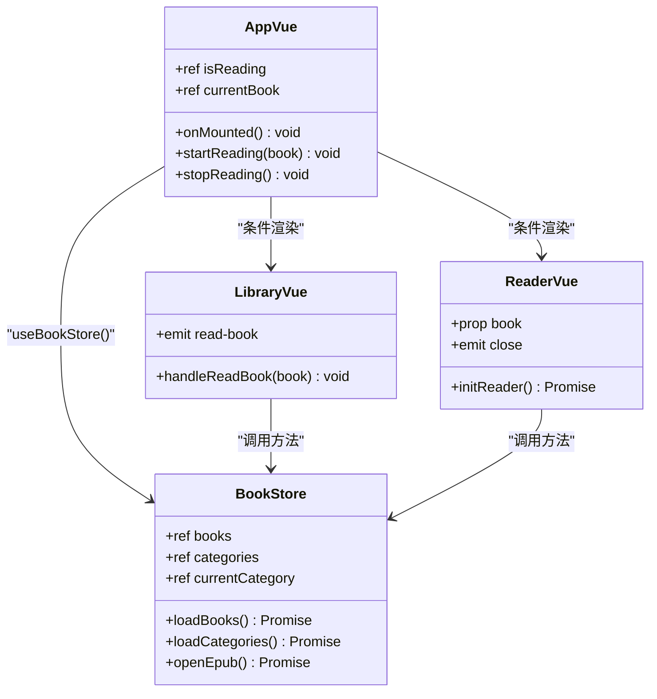

**图表来源**
- [App.vue:14-16](file://src/App.vue#L14-L16)
- [bookStore.js:4-234](file://src/stores/bookStore.js#L4-L234)

**章节来源**
- [App.vue:8-62](file://src/App.vue#L8-L62)
- [bookStore.js:1-234](file://src/stores/bookStore.js#L1-L234)

## 架构概览

### 整体架构设计

EPUB 阅读器采用三层架构设计，实现了清晰的关注点分离：

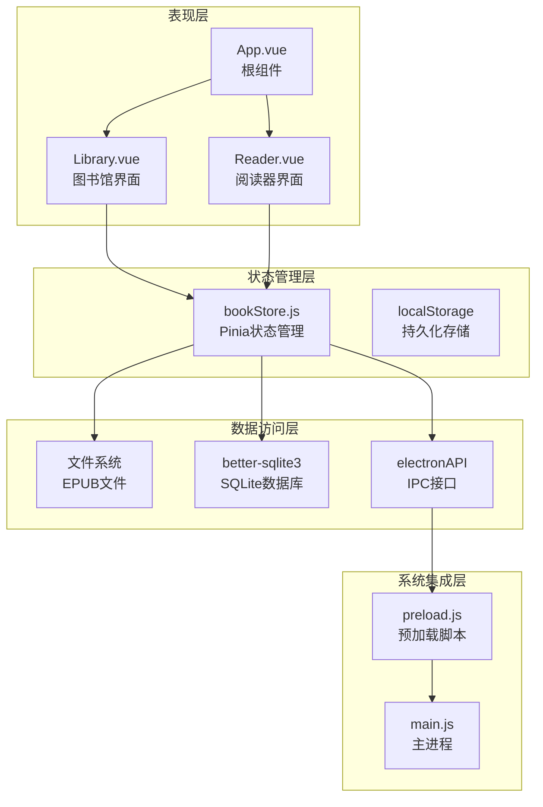

**图表来源**
- [App.vue:1-64](file://src/App.vue#L1-L64)
- [bookStore.js:1-234](file://src/stores/bookStore.js#L1-L234)
- [preload.js:1-95](file://electron/preload.js#L1-L95)
- [main.js:1-820](file://electron/main.js#L1-L820)

### 组件通信机制

组件间通信通过事件驱动的方式实现，形成了清晰的消息传递链路：

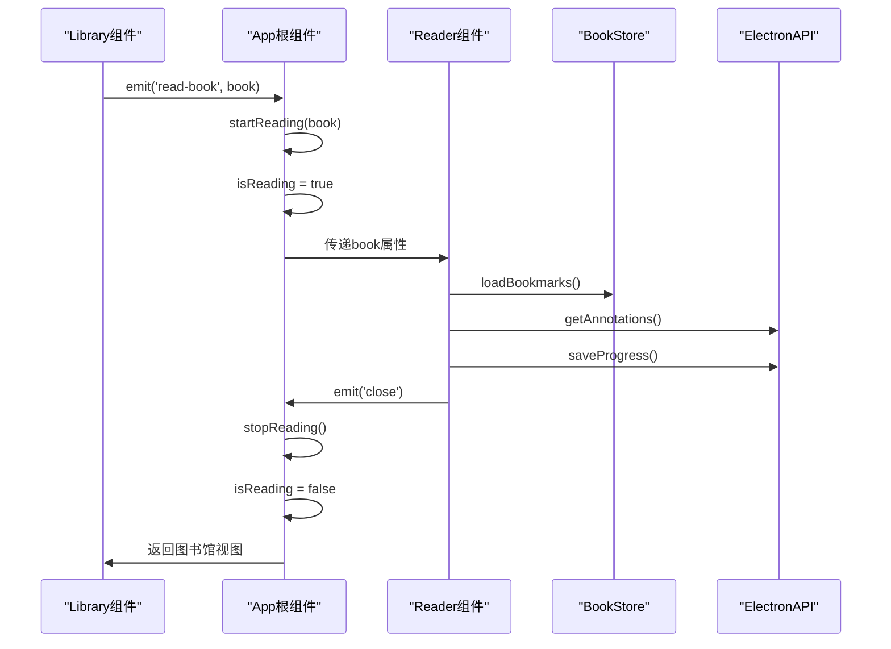

**图表来源**
- [App.vue:43-62](file://src/App.vue#L43-L62)
- [Library.vue:371-387](file://src/components/Library.vue#L371-L387)
- [Reader.vue:174](file://src/components/Reader.vue#L174)

**章节来源**
- [App.vue:3-62](file://src/App.vue#L3-L62)
- [Library.vue:337](file://src/components/Library.vue#L337)
- [Reader.vue:174](file://src/components/Reader.vue#L174)

## 详细组件分析

### App.vue 根组件深度分析

#### 生命周期管理

App.vue 的生命周期管理体现了完整的初始化流程：

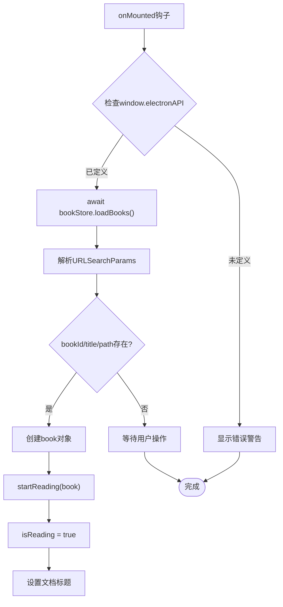

**图表来源**
- [App.vue:18-41](file://src/App.vue#L18-L41)

#### 状态管理策略

根组件采用轻量级状态管理模式：

| 状态变量 | 类型 | 用途 | 生命周期 |
|---------|------|------|----------|
| `isReading` | ref<boolean> | 控制组件切换 | 应用整个生命周期 |
| `currentBook` | ref<Object\|null> | 当前阅读的书籍 | 仅在阅读模式下使用 |

#### 事件处理机制

组件实现了双向事件处理：

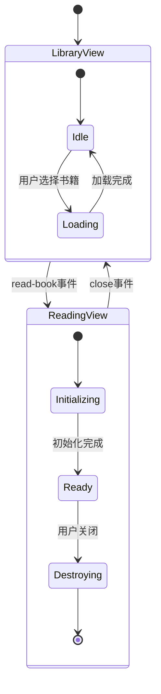

**图表来源**
- [App.vue:43-62](file://src/App.vue#L43-L62)

**章节来源**
- [App.vue:8-62](file://src/App.vue#L8-L62)

### Library.vue 组件分析

#### 书籍管理功能

Library.vue 实现了完整的书籍管理功能，包括：

- **书籍浏览**：支持按分类筛选和搜索
- **书籍操作**：添加、删除、导出书籍
- **分类管理**：创建、编辑、删除书籍分类
- **用户认证**：简单的登录/登出功能

#### 右键菜单系统

组件实现了复杂的右键菜单系统：

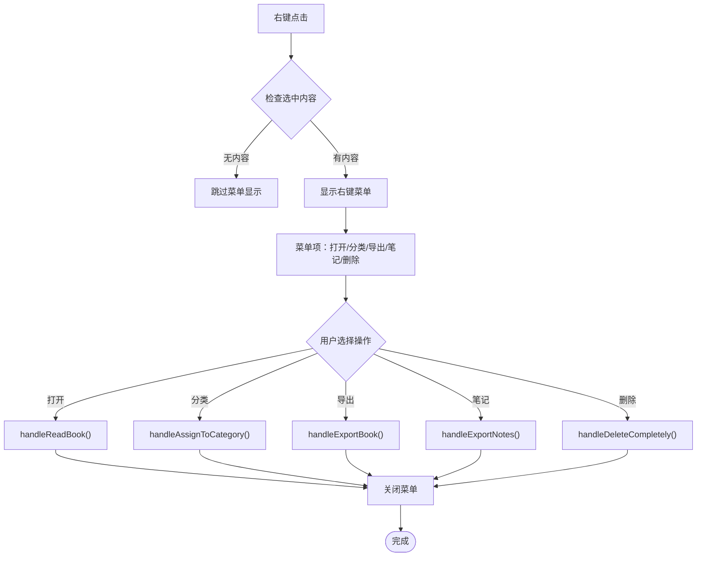

**图表来源**
- [Library.vue:402-466](file://src/components/Library.vue#L402-L466)

**章节来源**
- [Library.vue:1-1291](file://src/components/Library.vue#L1-L1291)

### Reader.vue 组件分析

#### 阅读器核心功能

Reader.vue 实现了专业的 EPUB 阅读功能：

- **双模式阅读**：翻页模式和滚动模式
- **进度跟踪**：自动保存阅读进度
- **书签管理**：添加、查看、删除书签
- **批注系统**：文本高亮和批注功能
- **目录导航**：章节跳转和书签导航

#### 阅读模式切换机制

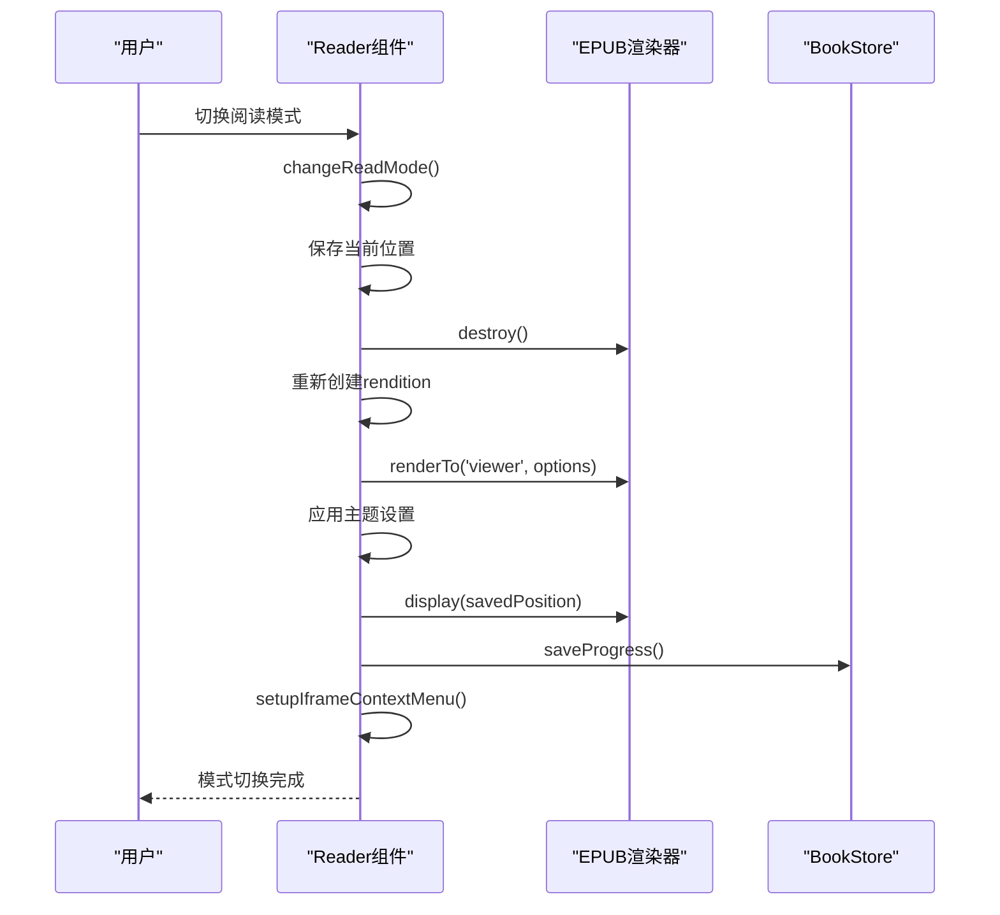

**图表来源**
- [Reader.vue:650-761](file://src/components/Reader.vue#L650-L761)

**章节来源**
- [Reader.vue:1-1026](file://src/components/Reader.vue#L1-L1026)

## 依赖关系分析

### 外部依赖关系

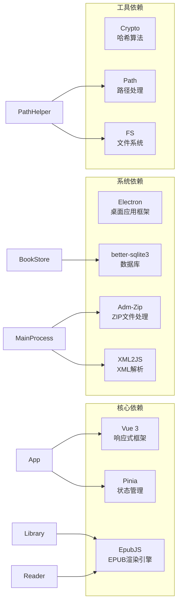

**图表来源**
- [App.vue:9-12](file://src/App.vue#L9-L12)
- [bookStore.js:1](file://src/stores/bookStore.js#L1)
- [main.js:1-8](file://electron/main.js#L1-L8)

### 内部模块依赖

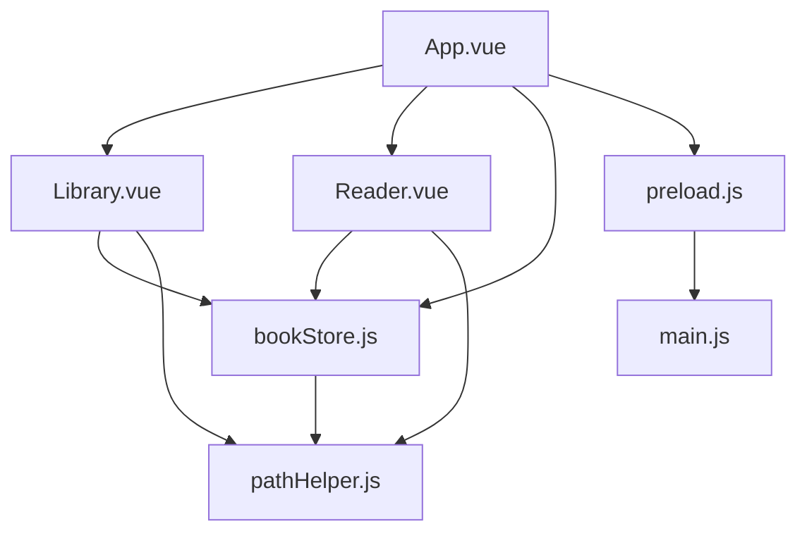

**图表来源**
- [App.vue:10-12](file://src/App.vue#L10-L12)
- [Library.vue:250-251](file://src/components/Library.vue#L250-L251)
- [Reader.vue:163-165](file://src/components/Reader.vue#L163-L165)

**章节来源**
- [App.vue:1-64](file://src/App.vue#L1-L64)
- [bookStore.js:1-234](file://src/stores/bookStore.js#L1-L234)

## 性能考虑

### 优化策略

1. **懒加载机制**：Reader 组件仅在需要时初始化
2. **异步加载**：所有外部资源采用异步加载方式
3. **内存管理**：组件卸载时正确清理事件监听器
4. **缓存策略**：使用 localStorage 缓存用户认证信息

### 性能监控

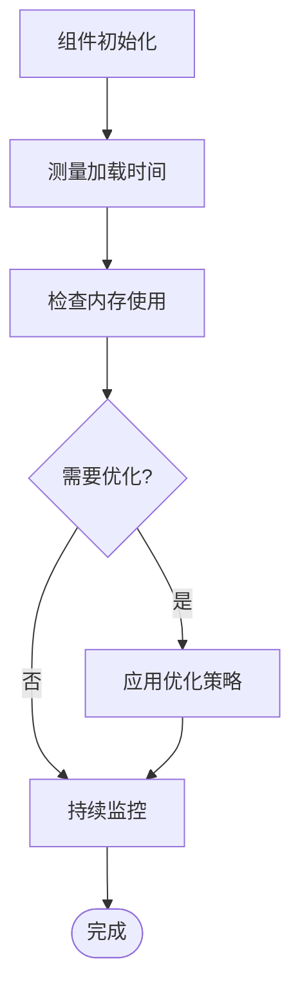

**章节来源**
- [Reader.vue:427-438](file://src/components/Reader.vue#L427-L438)
- [Library.vue:562-589](file://src/components/Library.vue#L562-L589)

## 故障排除指南

### 常见问题及解决方案

#### Electron API 未加载

**问题描述**：应用在浏览器中直接打开而非通过 Electron 启动

**解决方案**：
1. 确保通过 `npm run electron:dev` 启动应用
2. 检查 preload 脚本是否正确加载
3. 验证 Electron 主进程配置

#### 书籍无法打开

**问题描述**：Reader 组件初始化失败

**排查步骤**：
1. 检查 EPUB 文件路径是否有效
2. 验证文件权限和可访问性
3. 确认数据库连接正常
4. 查看控制台错误日志

#### 阅读进度丢失

**问题描述**：每次重新打开书籍都从第一页开始

**解决方案**：
1. 检查 SQLite 数据库连接
2. 验证 reading_progress 表结构
3. 确认 saveProgress 调用是否成功
4. 检查文件系统权限

**章节来源**
- [App.vue:18-22](file://src/App.vue#L18-L22)
- [Reader.vue:418-424](file://src/components/Reader.vue#L418-L424)
- [bookStore.js:169-176](file://src/stores/bookStore.js#L169-L176)

### 调试技巧

1. **启用开发者工具**：在开发环境中自动打开 DevTools
2. **日志记录**：利用 console.log 输出关键信息
3. **断点调试**：在关键函数处设置断点
4. **网络监控**：检查 IPC 调用的响应时间
5. **内存监控**：定期检查内存使用情况

## 结论

App.vue 根组件成功实现了 EPUB 阅读器应用的核心架构，通过清晰的条件渲染机制、完善的事件通信系统和健壮的状态管理，为用户提供了流畅的阅读体验。组件设计遵循了单一职责原则，与 Library 和 Reader 组件形成了良好的协作关系。

该架构的主要优势包括：
- **模块化设计**：各组件职责明确，便于维护和扩展
- **事件驱动**：组件间通信通过事件实现，降低耦合度
- **状态集中管理**：使用 Pinia 进行全局状态管理
- **错误处理完善**：实现了多层次的错误检测和处理机制

未来可以考虑的改进方向：
- 添加更多的性能监控指标
- 实现更丰富的用户个性化设置
- 增强离线功能支持
- 优化大文件的处理性能