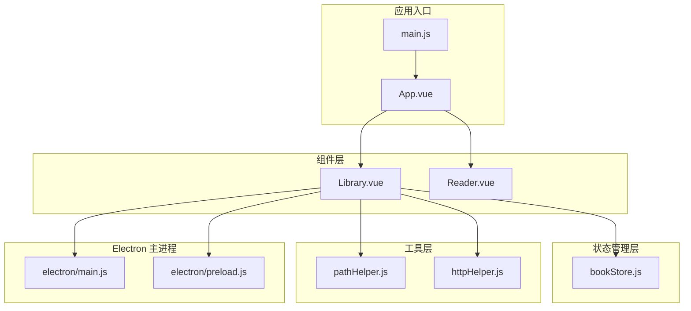
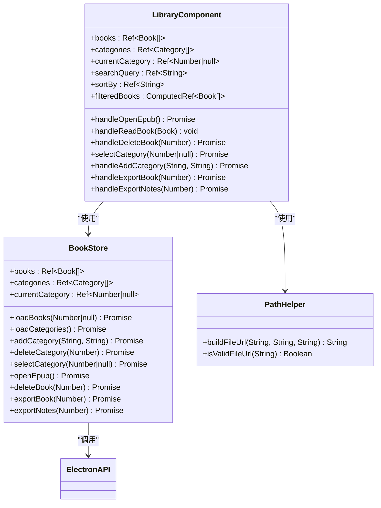
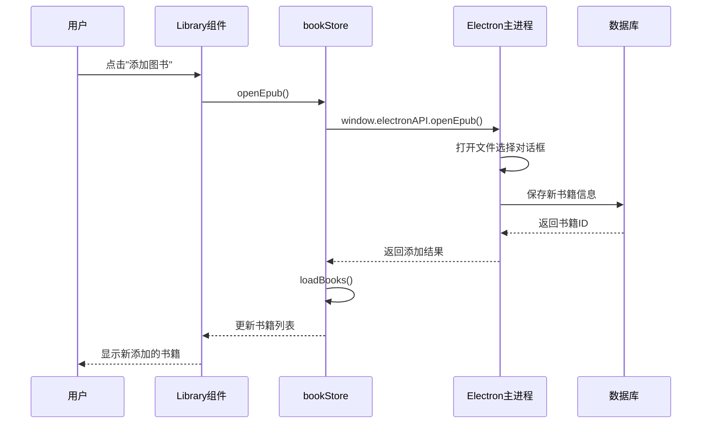
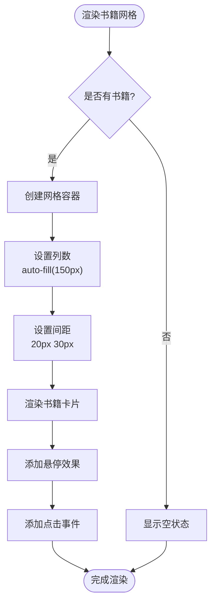
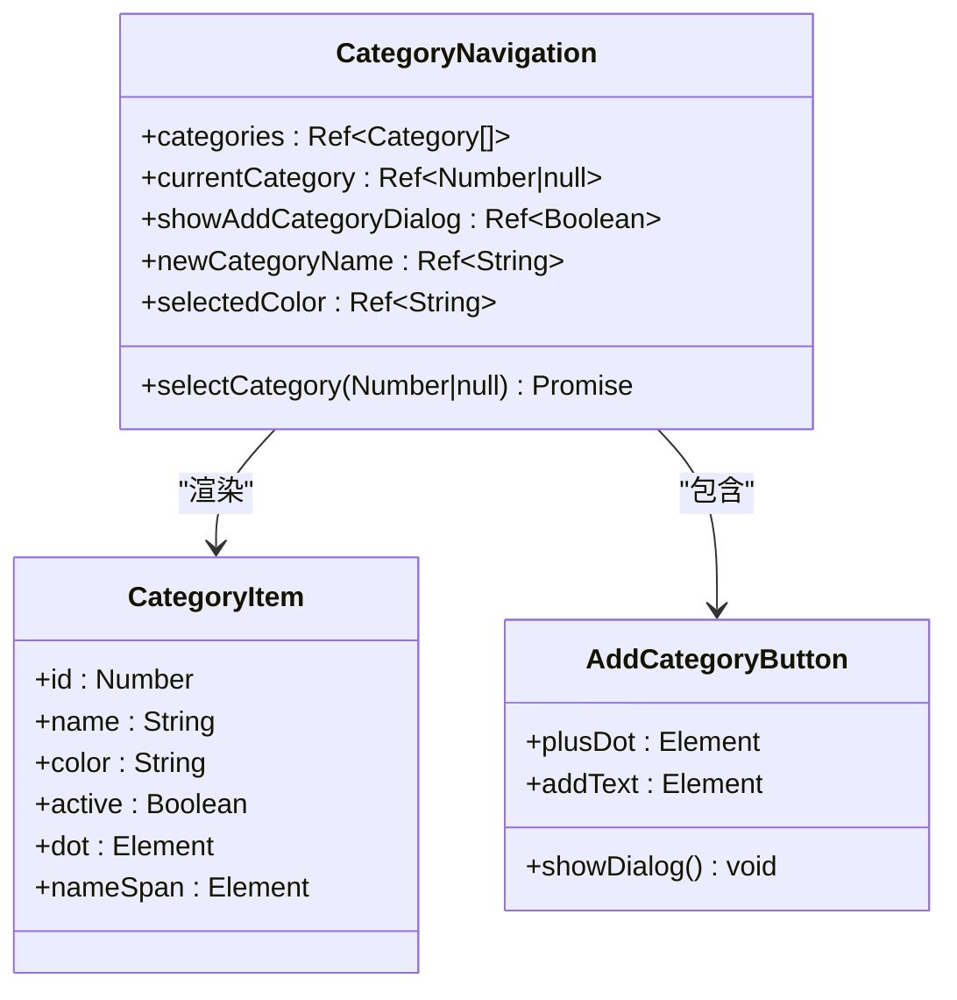
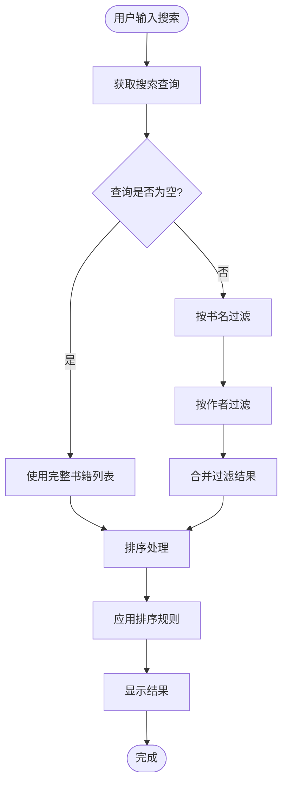
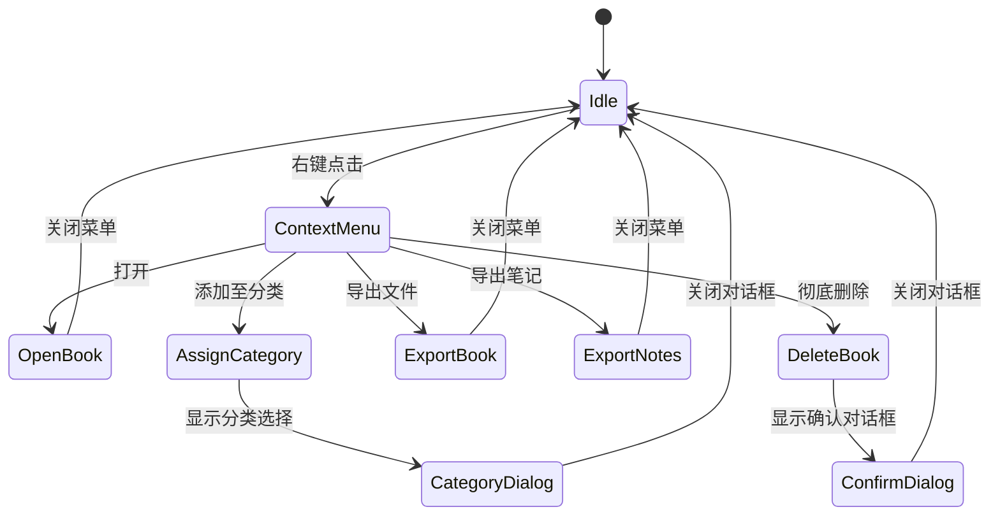
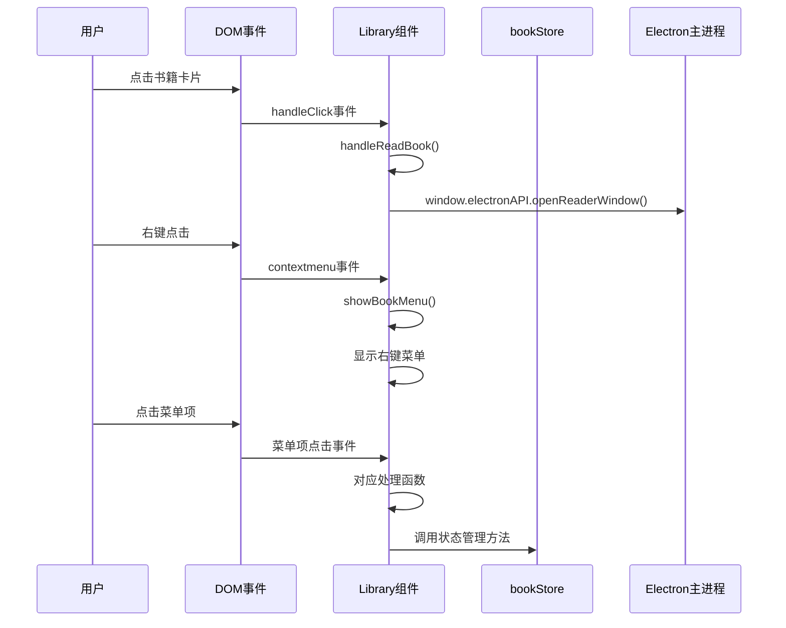
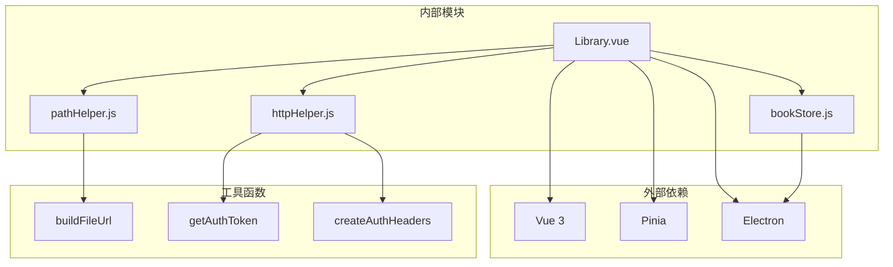

# 书架组件

<cite>
**本文档引用的文件**
- [Library.vue](file://src/components/Library.vue)
- [bookStore.js](file://src/stores/bookStore.js)
- [App.vue](file://src/App.vue)
- [main.js](file://src/main.js)
- [pathHelper.js](file://src/utils/pathHelper.js)
- [httpHelper.js](file://src/utils/httpHelper.js)
</cite>

## 目录
1. [简介](#简介)
2. [项目结构](#项目结构)
3. [核心组件](#核心组件)
4. [架构概览](#架构概览)
5. [详细组件分析](#详细组件分析)
6. [依赖关系分析](#依赖关系分析)
7. [性能考虑](#性能考虑)
8. [故障排除指南](#故障排除指南)
9. [结论](#结论)

## 简介

Library.vue 是 EPUB 阅读器应用中的核心书架组件，负责展示用户的电子书库、提供分类管理、搜索筛选和批量操作功能。该组件采用 Vue 3 Composition API 构建，集成了 Pinia 状态管理和 Electron 主进程通信，为用户提供直观的书籍管理体验。

该组件实现了完整的书籍生命周期管理，包括书籍的添加、删除、编辑和分类管理，并提供了丰富的用户交互功能，如右键菜单、拖拽操作和快捷键支持。

## 项目结构

EPUB 阅读器应用采用模块化的项目结构，主要由以下核心部分组成：



**图表来源**
- [main.js:1-11](file://src/main.js#L1-L11)
- [App.vue:1-64](file://src/App.vue#L1-L64)
- [Library.vue:1-246](file://src/components/Library.vue#L1-L246)

**章节来源**
- [main.js:1-11](file://src/main.js#L1-L11)
- [App.vue:1-64](file://src/App.vue#L1-L64)

## 核心组件

### 组件架构设计

Library.vue 采用响应式设计和模块化架构，主要包含以下核心功能模块：



**图表来源**
- [Library.vue:248-621](file://src/components/Library.vue#L248-L621)
- [bookStore.js:4-234](file://src/stores/bookStore.js#L4-L234)

### 数据绑定机制

组件采用 Vue 3 的响应式系统，通过 `ref` 和 `computed` 实现数据绑定：

- **响应式状态管理**：使用 `ref` 管理组件内部状态，如搜索查询、排序选项等
- **计算属性**：使用 `computed` 处理复杂的派生数据，如过滤后的书籍列表
- **双向绑定**：通过 `v-model` 实现表单控件与数据的双向绑定

**章节来源**
- [Library.vue:254-294](file://src/components/Library.vue#L254-L294)

## 架构概览

### 系统架构图

```mermaid
graph TB
subgraph "前端层"
Library[Library.vue]
Reader[Reader.vue]
Store[bookStore.js]
end
subgraph "状态管理层"
Pinia[Pinia Store]
Reactive[Vue Reactive System]
end
subgraph "工具层"
PathHelper[Path Helper]
HttpHelper[HTTP Helper]
end
subgraph "Electron 层"
MainProcess[Main Process]
RendererProcess[Renderer Process]
IPC[IPC Communication]
end
subgraph "数据层"
Database[(Database)]
FileSystem[(File System)]
end
Library --> Store
Store --> Pinia
Store --> Reactive
Library --> PathHelper
Library --> HttpHelper
Store --> MainProcess
MainProcess --> Database
MainProcess --> FileSystem
Library <- --> IPC
Store <- --> IPC
```

**图表来源**
- [Library.vue:248-251](file://src/components/Library.vue#L248-L251)
- [bookStore.js:1-2](file://src/stores/bookStore.js#L1-L2)

### 组件交互流程



**图表来源**
- [Library.vue:365-369](file://src/components/Library.vue#L365-L369)
- [bookStore.js:71-104](file://src/stores/bookStore.js#L71-L104)

## 详细组件分析

### 书籍列表展示功能

#### 网格布局设计

组件采用 CSS Grid 实现响应式书籍网格布局，支持自适应列数和间距调整：



**图表来源**
- [Library.vue:890-899](file://src/components/Library.vue#L890-L899)

#### 书籍卡片组件

每个书籍卡片包含以下元素：
- **封面显示**：支持图片和占位符两种模式
- **标题显示**：支持多行文本截断
- **时间徽章**：显示书籍添加时间
- **交互反馈**：悬停和点击状态

**章节来源**
- [Library.vue:930-989](file://src/components/Library.vue#L930-L989)

### 分类管理系统

#### 分类导航栏

左侧分类栏提供完整的分类管理界面：



**图表来源**
- [Library.vue:17-43](file://src/components/Library.vue#L17-L43)

#### 分类操作功能

- **分类选择**：点击分类项切换当前分类视图
- **新建分类**：弹出对话框创建新分类，支持颜色选择
- **分类删除**：通过右键菜单删除分类
- **分类重命名**：双击分类名称进行编辑

**章节来源**
- [Library.vue:395-400](file://src/components/Library.vue#L395-L400)
- [Library.vue:468-483](file://src/components/Library.vue#L468-L483)

### 搜索筛选功能

#### 搜索算法实现

组件实现了智能搜索功能，支持多字段匹配：



**图表来源**
- [Library.vue:266-294](file://src/components/Library.vue#L266-L294)

#### 排序选项

支持两种排序方式：
- **最近添加**：按 `added_at` 时间倒序排列
- **书名排序**：按中文拼音顺序排列

**章节来源**
- [Library.vue:278-291](file://src/components/Library.vue#L278-L291)

### 批量操作功能

#### 右键菜单系统

组件提供完整的右键菜单功能，支持多种操作：



**图表来源**
- [Library.vue:164-186](file://src/components/Library.vue#L164-L186)

#### 对话框系统

组件包含多个模态对话框，提供用户友好的交互体验：

- **添加分类对话框**：支持颜色选择和名称输入
- **分类选择对话框**：快速分配书籍到指定分类
- **登录对话框**：用户认证和会话管理

**章节来源**
- [Library.vue:127-162](file://src/components/Library.vue#L127-L162)
- [Library.vue:188-213](file://src/components/Library.vue#L188-L213)
- [Library.vue:215-244](file://src/components/Library.vue#L215-L244)

### 用户交互逻辑

#### 事件处理机制

组件采用事件驱动的设计模式，通过 Vue 的事件系统实现用户交互：



**图表来源**
- [Library.vue:104-106](file://src/components/Library.vue#L104-L106)
- [Library.vue:402-411](file://src/components/Library.vue#L402-L411)

#### 错误处理机制

组件实现了完善的错误处理策略：

- **网络错误**：捕获并显示友好的错误消息
- **文件加载失败**：自动降级到占位符显示
- **用户操作确认**：关键操作前显示确认对话框
- **状态恢复**：错误发生后尝试恢复到安全状态

**章节来源**
- [Library.vue:606-620](file://src/components/Library.vue#L606-L620)
- [Library.vue:453-466](file://src/components/Library.vue#L453-L466)

## 依赖关系分析

### 组件依赖图



**图表来源**
- [Library.vue:248-251](file://src/components/Library.vue#L248-L251)
- [bookStore.js:1-2](file://src/stores/bookStore.js#L1-L2)

### 状态管理集成

组件与 bookStore 的集成采用了 Pinia 的组合式 API 设计：

```mermaid
flowchart LR
Library[Library.vue] --> UseStore[useBookStore()]
UseStore --> StoreInstance[bookStore实例]
StoreInstance --> ReactiveState[响应式状态]
ReactiveState --> Books[books数组]
ReactiveState --> Categories[categories数组]
ReactiveState --> CurrentCategory[currentCategory]
Library --> BooksComputed[computed books]
Library --> CategoriesComputed[computed categories]
Library --> CurrentCategoryComputed[computed currentCategory]
BooksComputed --> Library
CategoriesComputed --> Library
CurrentCategoryComputed --> Library
```

**图表来源**
- [Library.vue:253-256](file://src/components/Library.vue#L253-L256)
- [bookStore.js:4-11](file://src/stores/bookStore.js#L4-L11)

**章节来源**
- [bookStore.js:208-232](file://src/stores/bookStore.js#L208-L232)

## 性能考虑

### 性能优化策略

#### 响应式更新优化

- **计算属性缓存**：使用 `computed` 缓存过滤和排序结果
- **条件渲染**：仅在需要时渲染大型对话框
- **事件节流**：对频繁触发的事件进行防抖处理

#### 内存管理

- **组件卸载清理**：在 `onUnmounted` 钩子中移除事件监听器
- **图片资源管理**：及时释放失败加载的图片资源
- **状态清理**：组件销毁时清理临时状态

#### 网络请求优化

- **批量请求**：避免重复的网络请求
- **缓存策略**：利用浏览器缓存机制
- **错误重试**：实现智能的错误重试机制

**章节来源**
- [Library.vue:333-335](file://src/components/Library.vue#L333-L335)
- [Library.vue:587-589](file://src/components/Library.vue#L587-L589)

## 故障排除指南

### 常见问题及解决方案

#### Electron API 未加载

**问题描述**：在浏览器环境中直接打开应用时出现 Electron API 未定义错误

**解决方案**：
- 确保通过 `npm run electron:dev` 启动应用
- 检查 `window.electronAPI` 是否正确注入
- 验证 Electron 主进程配置

**章节来源**
- [App.vue:18-22](file://src/App.vue#L18-L22)

#### 书籍封面加载失败

**问题描述**：书籍封面图片无法正常显示

**解决方案**：
- 检查文件路径是否正确
- 验证文件权限和存在性
- 使用占位符作为后备方案

**章节来源**
- [Library.vue:606-620](file://src/components/Library.vue#L606-L620)

#### 分类数据不同步

**问题描述**：添加或删除分类后界面未更新

**解决方案**：
- 确保调用 `loadCategories()` 刷新分类列表
- 检查 `currentCategory` 状态是否正确更新
- 验证 Electron 主进程的数据库操作

**章节来源**
- [bookStore.js:24-33](file://src/stores/bookStore.js#L24-L33)
- [bookStore.js:49-61](file://src/stores/bookStore.js#L49-L61)

### 调试技巧

#### 开发者工具使用

- **Vue DevTools**：监控组件状态和响应式更新
- **Electron DevTools**：调试主进程和渲染进程通信
- **Network面板**：监控 API 请求和响应
- **Console面板**：查看详细的错误信息和日志

#### 日志记录策略

组件在关键操作点添加了详细的日志输出，便于问题诊断：

- **状态变更**：记录重要状态的变更历史
- **API调用**：记录所有外部 API 调用
- **错误处理**：记录异常情况和处理结果

**章节来源**
- [bookStore.js:12-22](file://src/stores/bookStore.js#L12-L22)
- [Library.vue:367-369](file://src/components/Library.vue#L367-L369)

## 结论

Library.vue 书架组件是一个功能完整、架构清晰的 Vue 3 组件，成功实现了 EPUB 阅读器的核心功能。该组件具有以下特点：

### 技术优势

- **现代化架构**：采用 Vue 3 Composition API 和 Pinia 状态管理
- **响应式设计**：提供流畅的用户体验和良好的视觉效果
- **模块化设计**：清晰的组件边界和职责分离
- **错误处理**：完善的错误处理和用户反馈机制

### 功能完整性

- **书籍管理**：完整的 CRUD 操作和分类管理
- **搜索筛选**：智能的搜索算法和灵活的筛选选项
- **用户交互**：丰富的交互元素和直观的操作流程
- **状态同步**：实时的状态更新和数据一致性保证

### 扩展性考虑

组件设计充分考虑了未来的扩展需求，包括：
- **插件化架构**：易于添加新的功能模块
- **配置化设计**：支持通过配置文件定制行为
- **接口抽象**：清晰的接口定义便于替换实现
- **测试友好**：模块化设计便于单元测试和集成测试

该组件为 EPUB 阅读器应用奠定了坚实的基础，为用户提供了优秀的书籍管理体验。